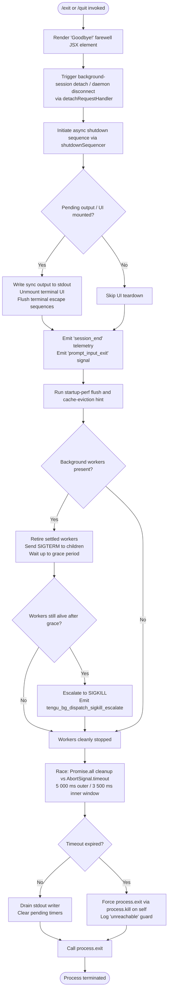

# `/exit`

> Analysis basis: CC v2.1.150 bundle.js (AST extraction + Claude interpretation)
> Minimum version: v2.1.150

---

## Overview

`/exit` (aliased as `/quit`) terminates the current Claude Code CLI session. When invoked, the handler displays a farewell message, flushes pending I/O and telemetry, tears down background workers and daemon connections, and then calls `process.exit` to halt the process. The command is implemented as an async function (`j_5`) loaded from module `DF1` and is always immediately available.

---

## Registration

| Field | Value |
|---|---|
| type | `local-jsx` |
| name | `exit` |
| description | `null` |
| aliases | `["quit"]` |
| immediate | `true` |
| module_id | `DF1` |
| load_inline | `true` |
| loc_byte | `12261890` |
| loc_byte_end | `12262051` |
| arbor_handler.name | `j_5` |
| arbor_handler.fqn | `claude-2.1.150::j_5` |
| arbor_handler.kind | `AsyncFunction` |
| arbor_handler.resolution_path | `module_id` |
| arbor_handler.n_hits | `1` |

Analysis basis: CC v2.1.150 bundle.js:+12261890

---

## Input Branching

The exit flow has more than three distinct phases/branches (UI rendering, async teardown, background-process cleanup, forcible kill, and final `process.exit`), so a Mermaid flowchart is used.



Analysis basis: CC v2.1.150 bundle.js:+12261139 (handler entry), +5286080 (`Promise.race`), +5285960 (5 000 ms constant), +5285967 (3 500 ms constant), +5284395 (`process.exit`), +5284420 (`process.kill`), +15260871 (SIGKILL telemetry)

---

## Behavioral Spec

### 1. Handler Entry — `exitCommandHandler` (`j_5`)

```
async function exitCommandHandler(commandContext):
    // Step 1: send a detach request to daemon / background session
    detachFromBackgroundSession()          // calls detachRequestSender (bq → f$H)

    // Step 2: display animated farewell element
    startFarewellAnimation()               // calls farewell animator (H) — uses
                                           // Math.random + setTimeout internally

    // Step 3: initiate daemon disconnect sequence
    daemonDisconnect()                     // calls daemonDisconnectHandler (ZLH)

    // Step 4: record prompt-input-exit signal
    emitPromptInputExitSignal()            // literal "prompt_input_exit" at +12261327

    // Step 5: add scheduled-task teardown entry
    addScheduledTaskCleanup()             // calls scheduledTaskAdder (c08)

    // Step 6: create React/Ink farewell element
    return Ra_.createElement(farewellComponent, ...)

    // Step 7: run the full async shutdown sequence
    await shutdownSequencer()             // calls _q
```

Analysis basis: CC v2.1.150 bundle.js:+12261139–12261322

---

### 2. Farewell Animation — `farewellAnimator` (`H`)

```
function farewellAnimator():
    // Displays the literal "Goodbye!" string (+12261103)
    // Uses Math.random() to pick animation variant (+13290155)
    // Schedules display via setTimeout (+13290192)
    // Numeric constants observed: 2 (+13290153), 1 (+13290169)
    displayMessage("Goodbye!")
    delay = Math.random() * animationConstant
    setTimeout(renderFarewell, delay)
```

Analysis basis: CC v2.1.150 bundle.js:+13290155, +13290192, +12261103

---

### 3. Daemon Disconnect — `daemonDisconnectHandler` (`ZLH`)

```
function daemonDisconnectHandler():
    // Sends a "detach-request" message over the IPC channel
    // literal "detach-request" at +10683137
    writeDetachMessage("detach-request")   // calls ipcWriter (no → lo.write)
    // Serialises payload via JSON.stringify (+182698)
    // Stops heartbeat scheduler (PW1 → bJH, k8)
    // literal "task" at +10677730, index 0 (+10677686)
    stopHeartbeatTask("task", index: 0)
    // Tears down error handler (E_H)
    clearErrorHandler()
```

Analysis basis: CC v2.1.150 bundle.js:+10683103, +10683128, +10683137, +10683183

---

### 4. Scheduled-Task Cleanup — `scheduledTaskAdder` (`c08`)

```
function scheduledTaskAdder(context):
    // Registers a "scheduled task" (+10676649) cleanup entry
    registerCleanupEntry("scheduled task")
    // Pushes timer handle for cancellation
    pushTimerHandle()                     // c08 → H.push (+10676635)
    // Formats duration display via durationFormatter (ouL)
    displayDuration = durationFormatter(startTime, now)
    // Formats token/string display via stringTruncator (uq)
    truncatedDisplay = stringTruncator(rawOutput)
```

Analysis basis: CC v2.1.150 bundle.js:+10676630, +10676635, +10676649, +10676676, +10676691

---

### 5. Shutdown Sequencer — `shutdownSequencer` (`_q`)

```
async function shutdownSequencer():
    // Phase A — UI teardown
    terminalTeardown()                    // TvH: XDH.writeSync, H.unmount, escape seqs
    // terminal escape: save cursor "\x1b7" (+3695002), restore "\x1b8" (+3695013)
    // tmux double-escape "\x1b\x1b" (+3352158) handled for multiplexers

    // Phase B — write final output line, emit telemetry
    writeOutputFinal()                    // o0_: XDH.writeSync (+5284187), dim styling
    emitSignal("prompt_input_exit")

    // Phase C — session-end telemetry
    emitTelemetry("session_end")          // literal at +5286331

    // Phase D — shutdown race with timeout
    timeoutMs_outer = 5000               // +5285960
    timeoutMs_inner = 3500               // +5285967
    result = await Promise.race([
        Promise.all([cleanupTasks]),      // P48
        AbortSignal.timeout(timeoutMs_outer)   // +5286222
    ])

    // Phase E — drain stdout
    drainStdout()                         // kCH → W7A.drain (+58315)
    clearTimeout(pendingTimers)

    // Phase F — force exit if still alive
    exitCleanly()                         // a0_: process.exit (+5284395)
                                          // fallback: process.kill(pid) (+5284420)
                                          // guard literal "unreachable" (+5284468)
```

Analysis basis: CC v2.1.150 bundle.js:+5285863, +5285960, +5285967, +5286080, +5286157, +5286222, +5286283, +5286374, +5286400

---

### 6. Background Worker Cleanup — `backgroundWorkerShutdown` (`w`, called via `Y`)

```
function backgroundWorkerShutdown():
    // Iterate all background workers
    for worker in A.values():
        worker.retireIfSettled()

    // Wait grace period: 30 s / 15 s constants (+15260826, +15260837)
    // Send SIGTERM to child processes (+15262764)
    // If still alive → escalate to SIGKILL (+15260919)
    // emit tengu_bg_dispatch_sigkill_escalate (+15260871)

    // Low-memory check via mqA.freemem (+15261280)
    // emit tengu_bg_dispatch_low_mem when threshold breached (+15261450)

    // Spare-worker management:
    //   tengu_bg_spare_enable  (+15262145)
    //   tengu_bg_spare_claim   (+15262266)
    //   tengu_bg_spare_claim_fail (+15262529)
    //   tengu_bg_spare_spawn   (+15260564)

    // Dispose active sessions
    S.dispose() / $.dispose()
    // Spawn replacement if needed via bB.spawn (+15262588)
```

Analysis basis: CC v2.1.150 bundle.js:+15260826, +15260871, +15261280, +15261450, +15262145, +15262199, +15262569, +15262588

---

### 7. Startup-Performance Flush — `startupPerfFlusher` (`u96` → `Cx8` → `EMA`)

```
function startupPerfFlusher():
    // Reads perf_hooks marks (+210477)
    // Writes "startup-perf" report (+211927) to a file via atomic write:
    //   H9H.openSync → H9H.writeFileSync → H9H.fsyncSync → H9H.closeSync
    // Reports contain "STARTUP PROFILING REPORT" header (+211323)
    // emit tengu_startup_perf (+212856)
    // Max entry width: 80 chars (+211311); column pad: 8 chars (+211471)
    // File size cap: 1 048 576 bytes (+212510)
```

Analysis basis: CC v2.1.150 bundle.js:+211323, +211927, +212856, +212510

---

## State & Side Effects

| Item | Detail |
|---|---|
| Telemetry — `tengu_bg_dispatch_sigkill_escalate` | Emitted when a background worker does not respond to SIGTERM and is force-killed (+15260871) |
| Telemetry — `tengu_bg_dispatch_low_mem` | Emitted when system free memory drops below threshold during shutdown (+15261450) |
| Telemetry — `tengu_bg_spare_enable` | Emitted when spare-worker pool is activated (+15262145) |
| Telemetry — `tengu_bg_spare_claim` | Emitted when a spare worker slot is claimed (+15262266) |
| Telemetry — `tengu_bg_spare_claim_fail` | Emitted when claiming a spare slot fails (+15262529) |
| Telemetry — `tengu_bg_spare_spawn` | Emitted when a new spare worker is spawned (+15260564) |
| Telemetry — `tengu_daemon_config_reload` | Emitted when daemon configuration is reloaded during teardown (+15275657) |
| Telemetry — `tengu_startup_perf` | Emitted when startup-profiling data is flushed to disk (+212856) |
| Telemetry — `tengu_scroll_summary` | Emitted as part of session-summary collection (+5285263) |
| Telemetry — `tengu_amber_creek` | UI/rendering feature-flag telemetry emitted during teardown (+3360591) |
| Telemetry — `tengu_pewter_brook` | UI/rendering feature-flag telemetry emitted during teardown (+3360499) |
| Telemetry — `tengu_cache_eviction_hint` | Emitted after session-end to hint cache eviction (+5286296) |
| Signal emitted | `prompt_input_exit` literal written to signal channel (+12261327) |
| Signal emitted | `session_end` literal written to session tracker (+5286331) |
| IPC message sent | `detach-request` sent to daemon over IPC socket (+10683137) |
| Terminal escape sequences | Cursor save (`\x1b7`) and restore (`\x1b8`) written; tmux double-escape (`\x1b\x1b`) applied where relevant |
| Background workers | SIGTERM sent; SIGKILL escalation after grace period (30 s / 15 s); all sessions disposed |
| Stdout drain | `W7A.drain()` called before final exit to flush buffered output (+58315) |
| `process.exit` | Called after all cleanup; `process.kill` self-signal used as fallback (+5284395, +5284420) |
| Farewell display | Literal `"Goodbye!"` displayed (+12261103) |
| Scheduled tasks | Any pending scheduled tasks are registered for cancellation under label `"scheduled task"` (+10676649) |
| Startup profiling | Profiling report written atomically to disk (fsync) if profiling was enabled (+211927) |

---

## Version History

| Version | Change |
|---|---|
| v2.1.150 | Initial analysis |

---

## Common Mistakes

1. **Using `/exit` during an active agent run**: Because `immediate: true`, the command fires without waiting for a running agent turn to finish. Any in-flight tool calls or sub-processes may be abandoned mid-execution; use `/stop` first if a clean agent stop is required.
2. **Expecting instant termination**: The shutdown sequencer races against a 5 000 ms outer timeout and a 3 500 ms inner timeout. If background workers are slow to acknowledge SIGTERM, the process may take up to the full timeout window before `process.exit` is reached.
3. **Confusing `/quit` behavior**: `/quit` is a registered alias and is behaviorally identical to `/exit` — it maps to the same handler (`j_5`) with no difference in logic.
4. **Assuming telemetry is optional**: Multiple telemetry events (especially `session_end` and `tengu_cache_eviction_hint`) are always emitted on exit. If the network is unavailable, flushing these may consume part of the shutdown timeout budget.
5. **Expecting a non-zero exit code on user-initiated exit**: The handler calls `process.exit` (not `process.exit(1)`); the exit code is `0` for a normal `/exit` invocation unless an internal error is thrown before that point.

---

## Appendix — Identifier Mapping

> For bundle debugging only. Identifiers change across versions.

| Identifier | Role |
|---|---|
| `j_5` | Main exit command handler (AsyncFunction, Arbor-resolved entry point) |
| `bq` | Detach-request sender — initiates background-session detach |
| `f$H` | Low-level IPC write helper called by detach sender |
| `H` | Farewell animation renderer (uses Math.random + setTimeout) |
| `ZLH` | Daemon disconnect handler — sends detach-request, stops heartbeat |
| `al6` | Heartbeat scheduler helper |
| `PW1` | Heartbeat task stopper |
| `bJH` | Heartbeat sub-task canceller |
| `k8` | Task-queue accessor used by heartbeat stopper |
| `no` | IPC message writer (calls lo.write) |
| `CH` | JSON serialiser wrapper (calls JSON.stringify) |
| `E_H` | Error handler clearer for daemon connection |
| `yf` | Prompt-input-exit signal emitter |
| `c08` | Scheduled-task cleanup registrar |
| `F0` | Cleanup entry factory |
| `Dv` | Low-level disposable / resource handle |
| `ouL` | Duration formatter for scheduled-task display |
| `tZ` | Cron-style schedule formatter (handles "Every minute", "Every hour" labels) |
| `K` | Cron column padder / schedule map helper |
| `w` | Background-worker manager (SIGTERM/SIGKILL, spare pool, low-mem check) |
| `L` | Async-task tracker (add/finally/delete lifecycle) |
| `j` | Worker kill helper (sends SIGTERM to active agents) |
| `D` | Worker state inspector / session disposer |
| `$` | Session disposal wrapper |
| `J` | UTC date/time calculator for schedule display |
| `vN` | Cron-string parser |
| `OP7` | Cron-field tokeniser (split, match, parseInt, Set.add) |
| `A` | String normaliser (toLowerCase) |
| `xdH` | Time-of-day / day-of-week resolver for cron schedules |
| `_` | Generic string / date helper |
| `O` | Date object with background-session state |
| `M` | Session-map manager (close, get, set operations) |
| `q` | File-system helper (unlinkSync, write) |
| `Hq` | Human-readable duration formatter (floor/round helpers) |
| `uq` | String truncator (indexOf + substring) |
| `w8` | Grapheme-width calculator (Bun.stringWidth) |
| `Dq` | Display-width helper using grapheme segmenter |
| `_Y` | Grapheme segmentation utility |
| `w_5` | Farewell wrapper component |
| `_q` | Full async shutdown sequencer |
| `TvH` | Terminal UI teardown (writeSync, unmount, escape sequences) |
| `wS` | Terminal state saver |
| `l68` | Terminal escape sequence writer (cursor save/restore) |
| `xEH` | Terminal-type detector (Ghostty, iTerm2 version checks) |
| `SEH` | Terminal-specific escape handler |
| `VG` | Tmux/screen escape sequence adapter (replaceAll for double-escape) |
| `mH` | String coercion utility (calls String()) |
| `o0_` | Final output writer (XDH.writeSync, dim styling) |
| `jv` | Output content builder |
| `jC` | Output channel selector |
| `S6` | Disposable resource manager |
| `Aj6` | File-system stat helper (statSync, join) |
| `Wh` | Resource handle wrapper |
| `j_` | Secondary resource handle wrapper |
| `Q6` | Path existence checker |
| `gO` | Configuration directory resolver |
| `h4` | Config sub-path helper |
| `e$q` | Output escaper (backslash and quote replacement) |
| `a0_` | Final exit executor (process.exit / process.kill fallback) |
| `kCH` | Stdout drainer (W7A.drain) |
| `Y` | Supervisor session writer / daemon config reloader |
| `tXH` | Session metadata serialiser |
| `A1` | Async-local-storage store reader |
| `K8` | Session key formatter |
| `ts_` | Session state serialiser |
| `EH` | String coercion wrapper for session data |
| `Ic1` | Session summary table formatter (Object.keys, Math.max, column widths) |
| `G` | Remote-control / keypress stop handler |
| `b` | Keypress event target |
| `FW` | User-settings accessor |
| `Z` | Daemon observer (stop/updateConfig/start) |
| `_XK` | Heartbeat restart helper |
| `Je` | Heartbeat interval manager |
| `V` | Supervisor listener starter |
| `c` | Generic callback / continuation |
| `u96` | Startup-performance report orchestrator |
| `Cx8` | Performance-mark collector and telemetry emitter |
| `$m` | perf_hooks module loader (require) |
| `EMA` | Startup-perf file writer (atomic fsync sequence) |
| `vMA` | Profiling-output path builder |
| `_9H` | Atomic file writer (openSync → writeFileSync → fsyncSync → closeSync) |
| `PMA` | Profiling checkpoint collator |
| `N` | Log-level filter / event formatter |
| `X48` | Scroll-summary and session-cleanup coordinator |
| `t$q` | Scroll-summary content builder |
| `s$q` | Scroll metrics calculator (Date.now, Math.max, Math.round) |
| `o$q` | Scroll-summary output helper |
| `Y9` | UI rendering mode selector (fullscreen vs default) |
| `WxH` | Fullscreen-capability detector |
| `I3_` | Local-agent renderer |
| `fi` | Rendering helper |
| `N3_` | Fullscreen-disabled message builder |
| `HA` | Highlight/colour helper |
| `A67` | Alternative rendering path (calls V6) |
| `V6` | Core UI event emitter (amber-creek / pewter-brook telemetry) |
| `t_6` | Cache-eviction hint emitter |
| `P48` | Parallel cleanup task runner (Promise.all / Promise.race) |
| `r8` | Timeout-with-abort helper (setTimeout + clearTimeout + AbortSignal) |

---

Note: index built via Arbor fallback; some signals (telemetry, literals) may be missing — see arbor-fallback.js.