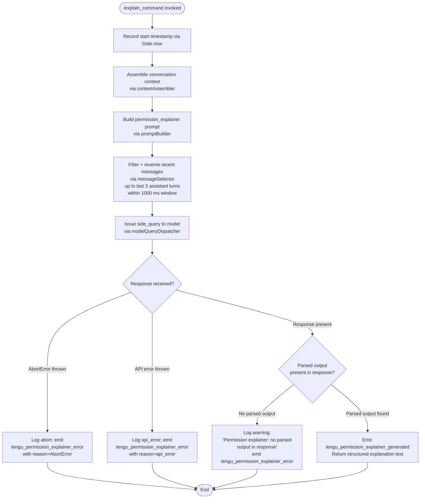

# `/explain_command`

> Analysis basis: CC v2.1.150 bundle.js (AST extraction + Claude interpretation)
> Minimum version: v2.1.150

---

## Overview

`/explain_command` is an internal tool-type slash command that generates a human-readable explanation of why a given tool invocation requires specific permissions. It operates as an asynchronous agent handler (`W1K`) that assembles recent conversation context, issues a side-query to the model with a `permission_explainer` role, and returns a structured natural-language justification for the pending permission request.

---

## Registration

| Field | Value |
|---|---|
| type | `tool` |
| name | `explain_command` |
| description | `null` |
| loc_byte | `13760759` |
| loc_byte_end | `13760795` |
| loc_line | `12321` |
| arbor_handler.name | `W1K` |
| arbor_handler.fqn | `claude-2.1.150::W1K` |
| arbor_handler.kind | `AsyncFunction` |
| arbor_handler.resolution_path | `direct` |
| arbor_handler.n_hits | `1` |

Analysis basis: CC v2.1.150 bundle.js:+13760759 – +13760795

---

## Input Branching

The handler has 4+ distinct execution paths depending on context assembly, model response parsing, abort conditions, and error handling, so a Mermaid flowchart is used.



Analysis basis: CC v2.1.150 bundle.js:+13760454 (handler entry `W1K`), +13760664 (model dispatch via `Fq`), +13761242 (success telemetry), +13761454 (error telemetry), +13761589 (no-parsed-output warning), +13761912 (AbortError branch), +13761983 (api_error branch)

---

## Behavioral Spec

### 1. Handler Entry and Timestamp Recording

```
async function permissionExplainerHandler(toolInput, appContext):
    startTime = Date.now()
    // Record invocation timestamp for duration metrics
    proceed to context assembly
```

Analysis basis: CC v2.1.150 bundle.js:+13760454 (`W1K`), +13760478 (`Date.now` call)

---

### 2. Context Assembly

```
function assembleContext(conversationHistory, appContext):
    // Delegates to inner context helper (h_A → m6)
    // Reads configuration; may access config file via readFileSync (utf-8)
    // Backs up config state as needed (JOH sub-routine handles backups dir)
    // Watches file state changes (Tt4 sub-routine, ve6.watchFile / unwatchFile)
    return contextBundle
```

Analysis basis: CC v2.1.150 bundle.js:+13760454 (`W1K`→`h_A`), +13760330 (`h_A`→`m6`), +3195710 (`q.readFileSync`), +3195737 (encoding literal `"utf-8"`), +3195222 (literal `"backups"`)

---

### 3. Prompt Construction — Message Selector

```
function buildRecentMessageSummary(messages):
    // Filter messages: keep only assistant-role entries
    //   (literal "assistant" at +13760053)
    // Reverse chronological order (A.reverse)
    // Take at most 3 messages (literal 3 at +13760073)
    // Within 1000 ms recency window (literal 1000 at +13760018)
    // For each qualifying message, extract text content blocks
    //   (literal "text" at +13760156)
    // Truncate long entries with "..." (literal "..." at +13760254)
    // Re-join with double-space separator
    // Prepend unshift marker if needed (q.unshift)
    // Join final array (q.join)
    return summaryString
```

Analysis basis: CC v2.1.150 bundle.js:+13760499 (`qP5`), +13760517 (`KP5`), +13760030 (`H.filter`), +13760098 (`A.reverse`), +13760073 (limit `3`), +13760018 (window `1000`), +13760053 (`"assistant"`), +13760156 (`"text"`), +13760241 (`M.slice`), +13760254 (`"..."`), +13760262 (`q.unshift`), +13760295 (`q.join`)

---

### 4. Prompt Formatting and Model Dispatch

```
function issuePermissionExplainerQuery(contextBundle, summaryString, toolCall):
    // Normalise model identifier via normaliseModelId (CH / JSON.stringify path)
    // Build message array with role=permission_explainer
    //   (literal "permission_explainer" at +13760817)
    // Route as a side_query (literal "side_query" at +13038804)
    // Dispatch through standard model query pipeline (Gx → Kp)
    //   which handles: auth (OAuth / API key), proxy, streaming,
    //   retry logic, byte watchdog (300 000 ms timeout), and
    //   Bedrock/Vertex/gateway routing as configured
    return responseStream
```

Analysis basis: CC v2.1.150 bundle.js:+13760499 (`qP5`→`CH`), +13760664 (`Fq` model formatter), +13760677 (`Gx` dispatch), +13760817 (literal `"permission_explainer"`), +13038804 (literal `"side_query"`)

---

### 5. Response Parsing and Telemetry

```
function parseExplainerResponse(response, startTime):
    if response contains no parsed output:
        log warning "Permission explainer: no parsed output in response"
        emit tengu_permission_explainer_error
        return null

    emit tengu_permission_explainer_generated
        with fields: duration_ms = Date.now() - startTime
    return parsedExplanationText
```

Analysis basis: CC v2.1.150 bundle.js:+13761242 (`tengu_permission_explainer_generated`), +13761344 (literal `"permission_explainer_generate"`), +13761454 (`tengu_permission_explainer_error`), +13761589 (literal `"Permission explainer: no parsed output in response"`)

---

### 6. Error Handling

```
function handleExplainerError(error):
    if error.name == "AbortError":
        // User or system cancelled the query
        emit tengu_permission_explainer_error with reason="AbortError"
        return silently

    if error is API error:
        emit tengu_permission_explainer_error with reason="api_error"
        log error details

    // All error paths suppress re-throw; command never crashes the REPL
```

Analysis basis: CC v2.1.150 bundle.js:+13761912 (literal `"AbortError"`), +13761983 (literal `"api_error"`), +13761454 (`tengu_permission_explainer_error`)

---

### 7. MCP Tool Name Guard

```
function isMcpToolName(toolName):
    // Checks whether toolName starts with "mcp_tool" prefix
    //   (literal "mcp_tool" at +3146892)
    // Used before formatting to select correct explanation template
    return toolName.startsWith("mcp_tool")
```

Analysis basis: CC v2.1.150 bundle.js:+13761292 (`rq`), +3146812 (`Object.hasOwn`), +3146864 (`H.startsWith`), +3146892 (literal `"mcp_tool"`)

---

## State & Side Effects

| Item | Detail |
|---|---|
| Telemetry — success | `tengu_permission_explainer_generated` (bundle.js:+13761242) — fired when a valid explanation is returned |
| Telemetry — error | `tengu_permission_explainer_error` (bundle.js:+13761454) — fired on abort, API error, or missing parsed output |
| Telemetry — indirect (config) | `tengu_config_parse_error` (+3196285), `tengu_config_auth_loss_prevented` (+3191047) — fired by config-read sub-routines reached during context assembly |
| Telemetry — indirect (OAuth) | Full suite of `tengu_oauth_token_refresh_*` events (+2947980 – +2949644) — fired by auth layer during model dispatch |
| Telemetry — indirect (API) | `tengu_api_success` (+13040255), `tengu_byte_watchdog_fired_late` (+2913933) — fired by generic API call path |
| File I/O | Reads config file synchronously (utf-8) during context assembly; creates `backups/` directory snapshot on config change (JOH, +3195710, +3196464) |
| File watching | Registers `ve6.watchFile` / `ve6.unwatchFile` for config path during context assembly lifecycle (Tt4, +3192050 / +3192377) |
| Hook registration | `W7A.register` called by `a9` sub-routine (+58272) during file-watch setup |
| appState changes | None observed in depth-2 traversal |
| Sound | None observed |
| No persistent write | The command is read-only with respect to conversation state; it only returns a string result |

---

## Version History

| Version | Change |
|---|---|
| v2.1.150 | Initial analysis |

---

## Common Mistakes

1. **Invoking `/explain_command` manually**: This is an internal tool-type command invoked programmatically by the permission-approval UI; calling it directly in a chat context will yield no visible output because there is no pending tool call to explain.
2. **Expecting a persistent result**: The command returns a transient explanation string; it does not write to any config file or conversation history entry.
3. **Assuming it works offline**: The command requires a live API call to generate the explanation. Without network access or valid auth credentials (`ANTHROPIC_API_KEY` / `CLAUDE_CODE_OAUTH_TOKEN`), it will emit `tengu_permission_explainer_error` silently.
4. **Confusing with `/help`**: `/explain_command` is scoped to permission justification for a specific pending tool call, not general documentation of any command.
5. **Expecting instant response**: The handler uses the full streaming model-query pipeline with a 300 000 ms byte-watchdog timeout; latency matches a normal API inference call.

---

## Appendix — Identifier Mapping

> For bundle debugging only. Identifiers change across versions.

| Identifier | Role |
|---|---|
| `W1K` | Main async handler for `/explain_command` (arbor-resolved, direct) |
| `h_A` | Context assembly dispatcher (called first by W1K) |
| `m6` | Config/context loader (reads config, triggers file watch) |
| `Q6` | Config object accessor |
| `Af_` | Config field extractor |
| `JOH` | Config file reader and backup manager |
| `g6` | JSON.parse wrapper |
| `xC` | String prefix/slice utility |
| `K8` | Config key helper |
| `mb9` | Directory scanner for config backups |
| `N` | Log/debug formatter |
| `Of_` | Path join helper for backup directory |
| `Tt4` | File-watch lifecycle manager (watchFile / unwatchFile) |
| `rn` | File-change handler callback |
| `a9` | Hook registrar (calls W7A.register) |
| `qP5` | Context string normaliser / JSON stringify wrapper |
| `CH` | JSON.stringify facade |
| `KP5` | Recent-message selector (filter, reverse, slice, join) |
| `Fq` | Prompt formatter / model message builder |
| `Wt` | Message structure builder |
| `wv` | Role/type constant provider |
| `gAH` | Prompt assembly helper |
| `Xg` | Model-ID normalisation and capability routing |
| `Yc6` | Model feature-flag resolver |
| `ppH` | Model capability inclusion checker |
| `Y79` | Model index lookup |
| `jI4` | Model feature membership check |
| `GqH` | Model capability set membership |
| `nq` | Model alias normaliser (trim, lowercase, replace) |
| `JI4` | Model prefix handler |
| `QJ` | Query dispatcher wrapper |
| `CW` | API call coordinator |
| `EA` | Auth token provider |
| `Zt` | Plan/tier resolver (max) |
| `L$H` | Team plan resolver |
| `FpH` | Enterprise plan resolver |
| `GZ` | Model tier wrapper |
| `$P` | Provider selector |
| `Z3` | Provider config resolver |
| `RA` | Provider base-URL builder |
| `cf` | Request config assembler |
| `cv` | Request config finaliser |
| `Gx` | Full model-query dispatcher (side_query entry) |
| `Kp` | Core API request handler (auth, headers, retry, stream) |
| `FD` | AsyncLocalStorage store reader |
| `Jl4` | Header field parser (split, trim, indexOf, slice) |
| `bq` | Background-mode header injector |
| `f$H` | Background-mode flag constant |
| `Fn` | Feature-flag reader |
| `gl6` | P79 AsyncLocalStorage reader |
| `S6` | Session-mode dispatcher |
| `Dv` | Session-mode constant |
| `y8_` | URL path encoder (replace, encodeURIComponent) |
| `mH` | String coercion utility |
| `t$` | OAuth token refresh orchestrator |
| `wL_` | OAuth token refresh lock manager |
| `W79` | Boolean coercion wrapper |
| `dD` | Auth credential resolver |
| `K4` | Auth string builder |
| `ev` | Credential validator |
| `yO` | Provider-aware auth selector |
| `hJ` | Auth header injector |
| `e$` | API-key / OAuth credential selector |
| `O1H` | Auth metadata builder |
| `G$` | Request deduplicator / cache key |
| `wl4` | Request lifecycle manager |
| `TBH` | Request timing tracker |
| `y_` | Retry-policy resolver |
| `Mg6` | Proxy auth helper invoker |
| `R0H` | Proxy auth string builder |
| `tgA` | Proxy URL builder |
| `cO4` | Proxy port parser |
| `nC` | Proxy config reader |
| `sX` | Proxy header injector |
| `Wl4` | HTTP(S) connection manager (UUID, streaming, retry) |
| `w5` | Connection pool entry |
| `Gl4` | Authorization header redactor (verbose logging) |
| `Pl4` | Stream type selector |
| `s7_` | Backoff calculator |
| `Xl4` | Stream reader with byte watchdog |
| `UD` | Provider domain resolver |
| `Oc6` | Provider base URL builder |
| `uZ4` | URL prefix checker |
| `$c6` | Provider name normaliser (toLowerCase, Object.values) |
| `zY` | Proxy resolver |
| `fn` | Proxy URL parser |
| `np6` | Proxy credential reader |
| `egA` | Proxy env-var reader |
| `jl4` | Request-options finaliser |
| `sa6` | Request pipeline builder |
| `Jv` | Request validator |
| `SCH` | Request schema checker |
| `V2H` | Built-in tool name resolver |
| `h9` | OAuth endpoint validator |
| `Y$H` | Gateway JWT refresh handler |
| `KC8` | Gateway token cache |
| `Dk4` | Gateway refresh HTTP call |
| `wh6` | Gateway refresh scheduler |
| `qC8` | Request timestamp stamper |
| `H36` | Header lowercasing normaliser |
| `HOH` | SDK error logger |
| `C` | IPC / socket manager |
| `KXK` | Real-path resolver |
| `Dz` | Socket path builder |
| `RH` | Error reporter with logError |
| `kk5` | Socket connection initiator |
| `z` | Socket write stream |
| `h` | Away-summary trigger |
| `tg` | Away-summary state checker |
| `I` | Away-summary generator |
| `V` | Away-summary cache writer |
| `ELK` | Away-summary result emitter |
| `Z` | Request abort controller |
| `Rj` | Retry dispatcher |
| `apH` | WIF (Workload Identity Federation) token exchanger |
| `Pn6` | WIF credential fetcher |
| `bH` | Feature flag checker (ok) |
| `uH` | Feature flag checker (bad) |
| `Xk4` | WIF include-list checker |
| `G` | Key-press / IPC event router |
| `b` | Key-press event source |
| `FW` | User-settings accessor |
| `Y` | IPC session manager |
| `X` | IPC socket reader |
| `J` | IPC socket connector |
| `zM` | IPC response writer |
| `Ok5` | IPC message dispatcher / daemon protocol handler |
| `zk5` | IPC framing constant |
| `YY` | Background service constant |
| `RqA` | IPC rate-limiter |
| `xJK` | IPC timeout manager |
| `r8` | Async retry utility |
| `P` | Repaint scheduler |
| `FT` | Working-directory resolver |
| `E$` | Real-path normaliser |
| `WfH` | File line reader |
| `fk5` | Terminal scroll calculator |
| `x` | Terminal write-with-timeout helper |
| `E_H` | Terminal event emitter |
| `bK` | Socket path joiner |
| `$k5` | Attach-session bootstrap |
| `s` | Voice toggle silence-timeout handler |
| `m` | Supervisor write-with-timeout helper |
| `t` | Voice focus silence-timeout handler |
| `W` | Skills/hooks batch emitter |
| `g` | MCP tool filter (mcp__ prefix) |
| `B` | Tool-use block pair (g + $) |
| `l` | Active-session filter |
| `r` | IPC duplex stream |
| `d` | IPC write-side stream |
| `Jk6` | IPC destroy/write helper |
| `T` | Terminal repaint helper |
| `EH` | String encoder |
| `kTH` | Side-query context builder |
| `Xq` | Model context formatter |
| `xj` | Model name sanitiser |
| `UC8` | Model context constant |
| `OP` | Model parameter replacement |
| `sh` | Provider gateway resolver |
| `jf5` | Message find helper |
| `PHA` | SHA-256 hash builder |
| `dl6` | Context cache-control builder |
| `t1` | String constant builder |
| `he6` | Provider RA wrapper |
| `ovH` | Cache-control prompt injector |
| `xC8` | Cache-type constant |
| `V6` | Cache-control block appender |
| `_$6` | Cache-control field builder |
| `A$6` | Cache-control array builder |
| `we` | Cache set membership checker |
| `we6` | Cache-hit tracker |
| `uC8` | Cache suffix matcher |
| `vZ` | Context length limit enforcer |
| `KL_` | Context length RA wrapper |
| `wa1` | Prompt token estimator |
| `Ks6` | Side-query builder (temperature + Xq) |
| `G2` | Message map formatter |
| `VzH` | Streaming response parser |
| `$p` | Config write-back manager |
| `f8` | Config file writer |
| `R5` | Response result extractor |
| `jMH` | Misc timing helper |
| `hVH` | Hook invocation manager |
| `iW7` | Hook registry checker |
| `dKH` | Hook metadata reader |
| `W4` | Claude.ai domain replacer |
| `rQ` | Agent-type router |
| `nW7` | Agent-type prefix parser |
| `z18` | Agent-type sub-prefix parser |
| `VX_` | Agent-type index/slice extractor |
| `RHH` | Agent-type prefix checker |
| `HA6` | Agent type finaliser |
| `rq` | MCP tool name guard (hasOwn + startsWith) |
| `_8` | Config write-guard |

---

Note: index built via Arbor fallback; some signals (telemetry, literals) may be missing — see arbor-fallback.js.