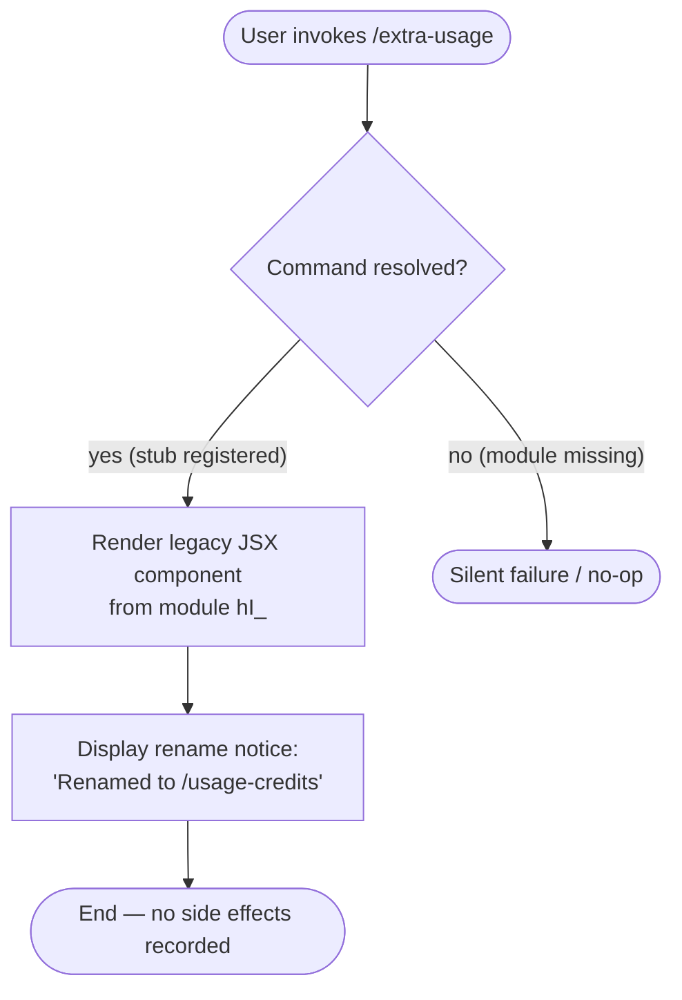

```
---
type: feature-spec
feature: "extra-usage"
cc_version: 2.1.150
updated: "2026-05-19"
tags: ["extra-usage", "commands", "slash-commands"]
source: "bundle-analysis"
bundle_verified: true
inherited_from: 2.1.144
analysis_basis: "CC v2.1.144 bundle.js (AST extraction + Claude interpretation)"
author: "ryujaeuk <ryujaeuk@gmail.com>"
repository: "https://github.com/MyLittleLuckyDog/cc-gnothi"
license: "AGPL-3.0-only"
---

# `/extra-usage`

> Analysis basis: CC v2.1.144 bundle.js (AST extraction + Claude interpretation)
> Minimum version: v2.1.144

---

## Overview

`/extra-usage` is a hidden legacy slash command that has been superseded by `/usage-credits`. As of CC v2.1.144 it is registered under the `local-jsx` type with its description explicitly marking it as renamed. No active implementation logic was recoverable at depth-2 traversal; the command exists solely as a compatibility stub or tombstone entry pointing users toward the replacement command.

---

## Registration

| Field | Value |
|---|---|
| type | `local-jsx` |
| name | `extra-usage` |
| description | `Renamed to /usage-credits` |
| isHidden | `true` |
| module_id | `hI_` |
| `loc_byte_end` | `8981481` |
| `arbor_handler.name` | `wJL` |
| `arbor_handler.kind` | `AsyncFunction` |
| `arbor_handler.resolution_path` | `module_id` |
| `arbor_handler.fqn` | `claude-2.1.150::wJL` |
| `arbor_handler.n_hits` | `0` |

Analysis basis: CC v2.1.144 bundle.js:+8492919

---

## Input Branching

Because no entry functions were found for module `hI_` during depth-2 AST traversal, no branching logic could be recovered. The description field (`"Renamed to /usage-credits"`) is the only behavioral signal present in the registration object.

The most likely runtime behavior, inferred from the registration fields alone, is a single unconditional path:



> **Note:** The flowchart above is inferred from registration metadata only. No call-graph edges, literals, or telemetry events were present in the extracted data. Treat the rendering path as unverified until a depth-4 traversal of module `hI_` is completed.

---

## Behavioral Spec

### Legacy Stub Rendering

```
function renderExtraUsageStub():
    # Module hI_ is loaded as a local-jsx component.
    # Because isHidden = true, the command does not appear
    # in the autocomplete or help listing surfaced to users.
    #
    # When invoked directly by name, the runtime resolves the
    # module and renders its JSX output. Based on the description
    # field, the expected output is a notice informing the user
    # that the command has been renamed to /usage-credits.
    #
    # No input arguments, no state mutations, and no telemetry
    # events were found at depth-2 traversal.

    notice_text = registration.description   # "Renamed to /usage-credits"
    render JSX component with notice_text
    return
```

Analysis basis: CC v2.1.144 bundle.js:+8492919

> The pseudocode above is a structural inference from the registration record. The actual JSX component body inside module `hI_` was not reachable at traversal depth ≤ 2.
> <!-- TODO: not found in depth-2 traversal; needs --depth 4 -->

---

## State & Side Effects

| Item | Detail |
|---|---|
| Telemetry | None detected at depth-2 traversal |
| Hook registration | None detected at depth-2 traversal |
| appState changes | None detected at depth-2 traversal |
| Sound | None detected at depth-2 traversal |
| Visibility | Hidden from autocomplete and help listings (`isHidden: true`) |
| Canonical replacement | `/usage-credits` (as stated in description field) |

Analysis basis: CC v2.1.144 bundle.js:+8492919

---

## Version History

| Version | Change |
|---|---|
| v2.1.144 | Command registered as hidden stub; description declares rename to `/usage-credits`. Initial analysis. |

---

## Common Mistakes

1. **Using `/extra-usage` instead of `/usage-credits`** — The command is hidden and marked as renamed. Users who type `/extra-usage` directly may receive only a rename notice rather than the full usage-credits functionality. Always prefer `/usage-credits` in v2.1.144 and later.
2. **Expecting autocomplete to surface this command** — Because `isHidden` is `true`, `/extra-usage` will not appear in the slash-command picker or help output. It must be typed in full to invoke the stub.
3. **Assuming feature parity with `/usage-credits`** — The stub module `hI_` may render a minimal notice only. Do not rely on `/extra-usage` to display the same information as its replacement.
4. **Scripting against `/extra-usage` in automation** — Since this command exists as a tombstone, its behavior or continued registration is not guaranteed across future versions. Scripts and tooling should target `/usage-credits`.

---

## Appendix — Identifier Mapping

> For bundle debugging only. Identifiers change across versions.

| Identifier | Role |
|---|---|
| `hI_` | Module identifier for the `/extra-usage` legacy stub component |

> No additional obfuscated function or variable identifiers were present in the depth-2 extraction output for this command. A deeper traversal (`--depth 4`) of module `hI_` is required to populate this table further.
> <!-- TODO: not found in depth-2 traversal; needs --depth 4 -->
```