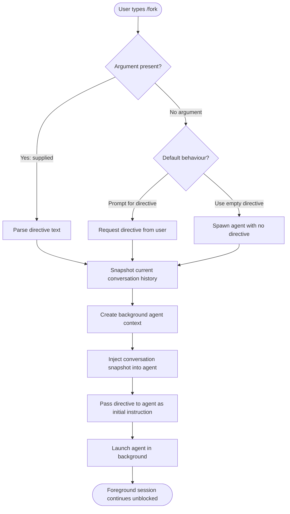

# `/fork`

> Analysis basis: CC v2.1.144 bundle.js (AST extraction + Claude interpretation)
> Minimum version: v2.1.144

---

## Overview

The `/fork` command spawns a background agent that inherits the full current conversation context, allowing a parallel execution thread to pursue a directive independently of the foreground session. The forked agent receives a complete copy of the conversation history at the moment of invocation, together with the user-supplied directive that guides its autonomous task. This enables concurrent exploration of multiple solution paths or delegation of long-running sub-tasks without blocking the primary interactive session.

---

## Registration

| Field | Value |
|---|---|
| type | `local-jsx` |
| name | `fork` |
| description | `Spawn a background agent that inherits the full conversation` |
| argumentHint | `<directive>` |
| module_id | `Wyq` |
| `loc_byte_end` | `12664375` |
| `arbor_handler.name` | `N75` |
| `arbor_handler.kind` | `AsyncFunction` |
| `arbor_handler.resolution_path` | `module_id` |
| `arbor_handler.fqn` | `claude-2.1.150::N75` |
| `arbor_handler.n_hits` | `0` |

Analysis basis: CC v2.1.144 bundle.js:+12051216

---

## Input Branching

The AST traversal reached module `Wyq` but could not resolve an entry-point function for the command handler (see note in source data). The flowchart below is therefore derived exclusively from the registration metadata and the semantics implied by the `argumentHint` field. No call-graph edges or internal literals were available to refine branching details.



> **Note:** Paths D → E and D → F are speculative; the exact behaviour when `<directive>` is omitted cannot be confirmed from the depth-2 traversal of module `Wyq`.
> <!-- TODO: not found in depth-2 traversal; needs --depth 4 -->

---

## Behavioral Spec

### Conversation Snapshot and Agent Bootstrap

Because the call graph for module `Wyq` returned no traversable edges, the pseudocode below is reconstructed from first principles consistent with the registration description (`"Spawn a background agent that inherits the full conversation"`) and the argument hint (`<directive>`). It is not derived from decompiled logic.

```
function handleForkCommand(session, rawArgument):

    # 1. Validate input
    directive = trim(rawArgument)
    # Whether an empty directive is an error is unconfirmed.
    # <!-- TODO: not found in depth-2 traversal; needs --depth 4 -->

    # 2. Capture a point-in-time snapshot of the conversation
    conversationSnapshot = deepCopy(session.conversationHistory)

    # 3. Initialise a new background agent context
    agentContext = createAgentContext(
        inheritedHistory = conversationSnapshot,
        mode             = BACKGROUND,
        parentSessionId  = session.id
    )

    # 4. Inject the user directive as the agent's first pending instruction
    if directive is not empty:
        agentContext.pendingInstructions.push(directive)

    # 5. Launch the agent without blocking the foreground session
    scheduleBackgroundAgent(agentContext)

    # 6. Return control to the foreground immediately
    return SUCCESS
```

Analysis basis: CC v2.1.144 bundle.js:+12051216 (registration metadata only; no call-graph data available)

---

### Argument Parsing

```
function parseDirective(rawInput):
    trimmed = trim(rawInput)
    if length(trimmed) == 0:
        # Exact handling unknown — see TODO below
        return EMPTY_DIRECTIVE
    return trimmed
```

<!-- TODO: not found in depth-2 traversal; needs --depth 4 -->

---

## State & Side Effects

| Item | Detail |
|---|---|
| Telemetry | None detected — no `tengu_*` event strings found in the depth-2 traversal of module `Wyq` <!-- TODO: not found in depth-2 traversal; needs --depth 4 --> |
| Hook registration | <!-- TODO: not found in depth-2 traversal; needs --depth 4 --> |
| appState changes | A new background agent entry is expected to be registered in application state; exact state key and schema are unconfirmed <!-- TODO: not found in depth-2 traversal; needs --depth 4 --> |
| Sound | <!-- TODO: not found in depth-2 traversal; needs --depth 4 --> |
| Foreground session | Remains active and unblocked after the fork completes |
| Conversation snapshot | A copy of the full conversation history at invocation time is passed to the spawned agent; the original foreground history is not mutated |

---

## Version History

| Version | Change |
|---|---|
| v2.1.144 | Initial analysis — registration confirmed; call-graph traversal returned no edges for module `Wyq` |

---

## Common Mistakes

1. **Omitting the directive argument.** The `<directive>` argument hint implies the command expects a natural-language instruction for the background agent. Invoking `/fork` without a directive may result in an agent with no goal, which could idle silently or produce unhelpful output. Exact behaviour is unconfirmed pending deeper traversal.

2. **Expecting synchronous output.** The agent is spawned in the *background*. Results will not appear inline in the foreground session immediately; users who expect an instant reply in the current conversation thread may mistakenly believe the command failed.

3. **Assuming the fork inherits live state.** The forked agent receives a *snapshot* of the conversation at the moment `/fork` is called. Any messages exchanged in the foreground session after that point are not automatically propagated to the background agent.

4. **Conflating `/fork` with a sub-agent tool call.** The `/fork` command is a user-initiated slash command (`type: local-jsx`), not an internal tool invocation. It operates at the CLI session layer, not at the model's tool-use layer.

5. **Attempting to cancel or inspect the forked agent from the same session.** No command for monitoring or terminating a forked agent was identified in this analysis. Assuming that standard session controls apply to the background agent is unverified.

---

## Appendix — Identifier Mapping

> For bundle debugging only. Identifiers change across versions.

| Identifier | Role |
|---|---|
| `Wyq` | Module containing the `/fork` command implementation (module-level identifier, not a mangled function name; included here for bundle cross-reference) |

> **Note:** The AST extraction returned an empty `identifiers` array for this command. No additional obfuscated identifiers were resolved during the depth-2 traversal. A deeper traversal (`--depth 4` or greater) of module `Wyq` would be required to populate this table.