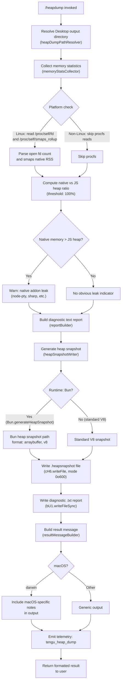

# `/heapdump`

> Analysis basis: CC v2.1.150 bundle.js (AST extraction + Claude interpretation)
> Minimum version: v2.1.150

---

## Overview

`/heapdump` is a hidden diagnostic command that captures a JavaScript heap snapshot of the running Claude Code process and writes it to the user's Desktop directory. It also collects comprehensive runtime memory statistics — including V8 heap metrics, native memory usage, open file descriptors, and Linux smaps data — and assembles a human-readable diagnostic report alongside the `.heapsnapshot` file. The command is intended for memory leak investigation by engineers and is not surfaced to normal users.

---

## Registration

| Field | Value |
|---|---|
| type | `local` |
| name | `heapdump` |
| description | `Dump the JS heap to ~/Desktop` |
| loc_byte | `12195765` |
| loc_byte_end | `12195928` |
| loc_line | `9974` |
| supportsNonInteractive | `true` |
| isHidden | `true` |
| module_id | `mU1` |
| load_inline | `true` |
| arbor_handler.name | `o65` |
| arbor_handler.fqn | `claude-2.1.150::o65` |
| arbor_handler.kind | `AsyncFunction` |
| arbor_handler.resolution_path | `module_id` |
| arbor_handler.n_hits | `0` |

Analysis basis: CC v2.1.150 bundle.js:+12195765

---

## Input Branching

The command has 4+ distinct execution branches depending on runtime environment and memory conditions, so a flowchart is used.



---

## Behavioral Spec

### Handler Entry Point (heapdumpHandler / `o65`)

The top-level async handler (`o65`, resolved via `module_id` → `mU1`) orchestrates two sub-operations: invoking the core dump-and-report routine (`heapDumpCore`), then assembling the final user-visible result lines.

```
async function heapdumpHandler(context):
    resultLines = []
    reportText = await heapDumpCore(context)       # xU1
    additionalLines = resultMessageBuilder(reportText)  # a65
    resultLines.push(...additionalLines)           # _.push, _.join
    return resultLines.join("\n")
```

Analysis basis: CC v2.1.150 bundle.js:+12194634

---

### Desktop Path Resolution (`ZWA`)

Resolves the target directory for output files. Uses `os.homedir()` and `path.join` to construct `~/Desktop`. On WSL/Windows environments it detects `/mnt/c/Users` and adjusts accordingly, filtering out system accounts (`Public`, `Default`, `Default User`, `All Users`).

```
function resolveDesktopPath():
    home = os.homedir()                        # tQ8.homedir
    desktopPath = path.join(home, "Desktop")   # y5.join, literal "Desktop"
    if platform is WSL:
        # scan /mnt/c/Users, skip system accounts
        # literals: "/mnt/c/Users", "Public", "Default", "Default User", "All Users"
        desktopPath = resolveWslDesktop()
    return desktopPath
```

Analysis basis: CC v2.1.150 bundle.js:+12193592

---

### Memory Statistics Collector (`i65`)

Gathers a comprehensive snapshot of the process's memory state by querying multiple Node.js / Bun / OS APIs.

```
async function memoryStatsCollector():
    stats = {}

    # V8 / Bun heap data
    stats.memoryUsage       = process.memoryUsage()
    stats.heapStatistics    = v8.getHeapStatistics()       # dZ8.getHeapStatistics
    stats.resourceUsage     = process.resourceUsage()
    stats.uptime            = process.uptime()
    stats.heapSpaceStats    = v8.getHeapSpaceStatistics()  # dZ8.getHeapSpaceStatistics

    # Active handles / requests (internal Node APIs)
    stats.activeHandles     = process._getActiveHandles()
    stats.activeRequests    = process._getActiveRequests()

    # Linux procfs (best-effort)
    if /proc/self/fd is readable:                          # literal "/proc/self/fd"
        fdList = await fs.readdir("/proc/self/fd")         # cH6.readdir
        stats.openFdCount = fdList.length

    if /proc/self/smaps_rollup is readable:                # literal "/proc/self/smaps_rollup"
        smapsRaw = await fs.readFile("/proc/self/smaps_rollup", "utf8")  # cH6.readFile
        stats.nativeRss = parseSmaps(smapsRaw)

    # Age buckets: max age threshold 3600 seconds, bucket size 1048576 bytes
    # (literals: 3600, 1048576)

    return stats
```

Analysis basis: CC v2.1.150 bundle.js:+12193296 (via `xU1` → `i65` at +12193309)

The `bun:jsc` module is imported for Bun-specific introspection (literal `"bun:jsc"` at +12191188).

#### Native-vs-Heap Ratio Analysis

After collecting stats, a ratio is computed:

```
function analyzeLeakIndicators(stats):
    nativeMB  = stats.nativeRss / 1048576
    heapMB    = stats.memoryUsage.heapUsed / 1048576

    if nativeMB > heapMB * (100 / 100):   # threshold factor 100, literal at +12191481
        warn("Native memory > heap - leak may be in native addons (node-pty, sharp, etc.)")
        # literal at +12191567
    else:
        note("No obvious leak indicators. Check heap snapshot for retained objects.")
        # literal at +12192686
```

Analysis basis: CC v2.1.150 bundle.js:+12191481

---

### Heap Snapshot Writer (`heapSnapshotWriter` / `r65`)

Writes the `.heapsnapshot` binary file. Branches on whether the runtime is Bun or standard V8.

```
function heapSnapshotWriter(outputPath):
    if runtime is Bun:
        snapshot = Bun.generateHeapSnapshot("v8", "arraybuffer")
        # literals: "v8", "arraybuffer" at +12194359, +12194364
        Bun.gc(true)                          # force GC before snapshot
        fs.writeFileSync(outputPath, snapshot) # bU1.writeFileSync
    else:
        # standard V8 path via v8.writeHeapSnapshot or equivalent
        writeV8Snapshot(outputPath)

    # File mode: 0o600 (decimal 384, literal at +12193779)
```

Analysis basis: CC v2.1.150 bundle.js:+12193835

---

### Core Dump-and-Report Orchestrator (`heapDumpCore` / `xU1`)

Coordinates path resolution, stats collection, snapshot writing, and report generation. Dispatches with a "manual" trigger token and priority 0.

```
async function heapDumpCore(context):
    # Trigger marker: "manual", priority 0 (literals at +12193272, +12193283)
    desktopPath = resolveDesktopPath()            # ZWA

    stats = await memoryStatsCollector()           # i65

    snapshotFilename = buildSnapshotFilename(stats) # K — pads with spaces, map over labels
    snapshotPath = path.join(desktopPath, snapshotFilename)  # La_.join

    # Write snapshot (JSON-serialised via CH = JSON.stringify)
    await fs.writeFile(snapshotPath, JSON.stringify(snapshotData))  # cH6.writeFile

    # Run heap snapshot writer (Bun or V8 branch)
    heapSnapshotWriter(snapshotPath)               # r65

    # Write diagnostic text report (parallel path, writeFileSync)
    reportPath = snapshotPath + ".txt" (approx.)
    writeReportSync(reportPath, stats)             # bU1.writeFileSync inside r65

    # Emit telemetry
    emit("tengu_heap_dump")                        # +12193886

    # Build structured result (N = outputFormatter, depth limit 3)
    result = outputFormatter(stats, snapshotPath)  # N, literal 3 at +12193352
    return result
```

Analysis basis: CC v2.1.150 bundle.js:+12194634

---

### Result Message Builder (`resultMessageBuilder` / `a65`)

Formats the final lines shown to the user. Includes guidance for opening the snapshot and a size summary.

```
function resultMessageBuilder(reportText):
    lines = []

    # Heading with snapshot path and file size (Math.max used to floor values)
    heapLine = buildHeapLine(reportText)   # uses Math.max, lH6

    # Memory classification notice
    if jsHeapDominant:
        lines.push("— most memory is JS heap (inspect the .heapsnapshot)")
        # literal at +12195077
    else:
        lines.push("— most memory is native (NOT in the .heapsnapshot)")
        # literal at +12195137

    if noLeakIndicators:
        lines.push("  (no obvious leak indicators)")
        # literal at +12195274

    # DevTools usage hint
    lines.push("Open the .heapsnapshot in Chrome DevTools → Memory → Load to inspect retainers.")
    # literal at +12194790

    # Size threshold: 1 GiB = 1073741824 bytes (literal at +12195683)
    # Column alignment: 8 chars wide (literal at +12195409)

    return lines
```

Analysis basis: CC v2.1.150 bundle.js:+12194753

---

### Output Path Logger (`N` / `outputFormatter`)

Formats structured log/debug output at level `"debug"` (literal at +202680). Uppercases labels and applies `"[REDACTED]"` substitution to sensitive fields (literal at +194805).

Analysis basis: CC v2.1.150 bundle.js:+12193355

---

## State & Side Effects

| Item | Detail |
|---|---|
| Telemetry | `tengu_heap_dump` (emitted on every successful invocation, +12193886). Background session telemetry also reachable from call graph depth-2 but not directly triggered by `/heapdump`: `tengu_bg_dispatch_sigkill_escalate`, `tengu_bg_dispatch_low_mem`, `tengu_bg_spare_enable`, `tengu_bg_spare_claim`, `tengu_bg_spare_claim_fail`, `tengu_bg_proto_mismatch`, `tengu_bg_dispatch_stale_drop`, `tengu_bg_attach_legacy_autorespawn`, `tengu_bg_attach`, `tengu_bg_attach_stall_gave_up`, `tengu_bg_attach_stall_respawn`, `tengu_bg_attach_kick`. |
| File output | `.heapsnapshot` written to `~/Desktop/` (mode `0o600` = decimal `384`). A companion `.txt` diagnostic report is written synchronously via `bU1.writeFileSync`. |
| GC side effect | `Bun.gc(true)` is called before snapshot generation when running under Bun runtime (+12194391). |
| procfs reads | `/proc/self/fd` (directory listing) and `/proc/self/smaps_rollup` (UTF-8 text) are read on Linux. These are best-effort; failures are silently ignored. |
| Hook registration | `a9` → `W7A.register` is reachable from the output-formatter path (+58272); likely registers a cleanup or atexit hook. |
| appState changes | None observed in depth-2 traversal. |
| Sound | None observed. |
| Trigger token | `"manual"` with priority `0` is recorded in the dispatch metadata (+12193272, +12193283). |

---

## Version History

| Version | Change |
|---|---|
| v2.1.150 | Initial analysis |

---

## Common Mistakes

1. **Expecting visible output in normal use** — `/heapdump` is `isHidden: true` and does not appear in the command palette. It must be typed manually.
2. **Running on a non-Desktop path** — the command always writes to `~/Desktop`. On systems without a `Desktop` directory (headless servers, CI), the write will fail unless the directory is pre-created.
3. **Confusing the `.txt` report with the snapshot** — the `.heapsnapshot` file is the Chrome DevTools-compatible binary; the `.txt` file is a human-readable summary. Only the former can be loaded in DevTools Memory tab.
4. **Ignoring the native-vs-heap warning** — if the diagnostic reports "Native memory > heap", the heap snapshot itself will not capture the leaked memory, since it lives outside the JS heap (likely node-pty, sharp, or similar native addons).
5. **Running under a non-Bun runtime and expecting `Bun.generateHeapSnapshot`** — the Bun-specific snapshot path is only taken when `Bun` global is available; otherwise a standard V8 path is used.
6. **Opening the snapshot before the write completes** — the `.heapsnapshot` write is async (`cH6.writeFile`), but the `.txt` report write is sync. Loading the file in DevTools immediately may catch a partial write on slow disks.

---

## Appendix — Identifier Mapping

> For bundle debugging only. Identifiers change across versions.

| Identifier | Role |
|---|---|
| `o65` | Top-level heapdump async handler (arbor_handler; entry point from `module_id` `mU1`) |
| `xU1` | Core dump-and-report orchestrator (`heapDumpCore`) |
| `i65` | Memory statistics collector (procfs, V8, process APIs) |
| `r65` | Heap snapshot writer (Bun/V8 branch, `bU1.writeFileSync`, `Bun.generateHeapSnapshot`) |
| `a65` | Result message builder (formats user-visible output lines) |
| `ZWA` | Desktop output path resolver (`os.homedir`, `path.join`, WSL detection) |
| `S6` | Shared utility called from both `xU1` and `i65`; likely error formatter or stringify helper |
| `Dv` | Dependency of `S6`; role unclear from depth-2 traversal |
| `N` | Output formatter / debug logger (applies `[REDACTED]`, uppercases labels) |
| `LVK` | Sub-formatter reached from `N`; likely structured message builder |
| `T7A` | Reached from `LVK`; likely template or transform utility |
| `K` | Column/label padder (`M.padEnd`, `L.map`); formats table-style output |
| `L` | Promise/task set manager (`q.add`, `q.delete`, `M.finally`) |
| `M` | Resource handle closer (`A.close`, `q.close`) |
| `CH` | JSON serialiser wrapper (`JSON.stringify`) |
| `c_` | Error constructor wrapper (`Error`, `String`) |
| `RH` | Error logger / reporter (`ll.logError`, `xiK`, `G1`) |
| `HbH` | Write helper reached from `N`; delegates to `B5A` → `H.write` |
| `B5A` | Low-level stream writer (`H.write`) |
| `$VK` | File-append/rotation manager (`dI.appendFile`, `dI.mkdir`, `dI.rename`, `dI.unlink`) |
| `ICH` | Async join/flush coordinator (`clearTimeout`, `setImmediate`, `setTimeout`) |
| `q9H` | Path join + `S6` invoker; likely sub-path builder |
| `G96` | Error code handler (`K8`, `EISDIR`) |
| `LMA` | Path join helper (`U2H.join`, `S6`) |
| `KMA` | File stat + rename/unlink helper (`.endsWith`, `.slice`, `dI.rename`, `dI.unlink`) |
| `fVK` | Bound file-append writer (`dI.mkdir`, `dI.appendFile`, rotation logic) |
| `Q6` | Shared utility; role unclear from depth-2 traversal |
| `a9` | Hook/cleanup registrar (`W7A.register`) |
| `X4` | String sanitiser / redactor (`[REDACTED]`, `H.replace`, `A.lastIndexOf`, `A.slice`) |
| `s5A` | Mapping helper (`eZK.map`) |
| `lH6` | Size/metric formatter reached from `a65` |
| `Dz` | Utility reached from `xU1`; role unclear from depth-2 traversal |
| `c` | Shared low-level utility reached from `xU1` and `Ok5` |
| `T` | Formatter/template helper reached from `i65` and `Ok5` (`HE6`, `wh8`) |
| `HE6` | Sub-utility of `T`; role unclear |
| `wh8` | Sub-utility of `T` and `P` |
| `P` | Connection/session manager (`Promise.all`, `zLH`, `ni`, `RH`) |
| `X` | Byte-stream / buffer handler (`Buffer.concat`, `J.indexOf`, `w.off`) |
| `J` | Buffer slice tracker (`w` reference, `hJK.unlinkSync`) |
| `w` | Process/daemon manager (`bB.spawn`, `C.kill`, `setTimeout`, `Date.now`) |
| `zM` | Stream end wrapper (`H.end`, `CH`) |
| `Ok5` | IPC/supervisor message dispatcher (large fan-out; handles ping/nudge/lease/kill/resize/attach) |
| `EH` | String coercer (`String`) |
| `H` | Random/timer utility (`Math.random`, `setTimeout`) |
| `_` | Array accumulator used in `o65` (`_.push`, `_.join`) |
| `A` | Lowercase mapper / map store (`M.toLowerCase`, `A.get`, `A.set`, `A.values`) |
| `q` | Set/queue with unlink (`q.add`, `q.delete`, `hJK.unlinkSync`) |

---

Note: index built via Arbor fallback; some signals (telemetry, literals) may be missing — see arbor-fallback.js.