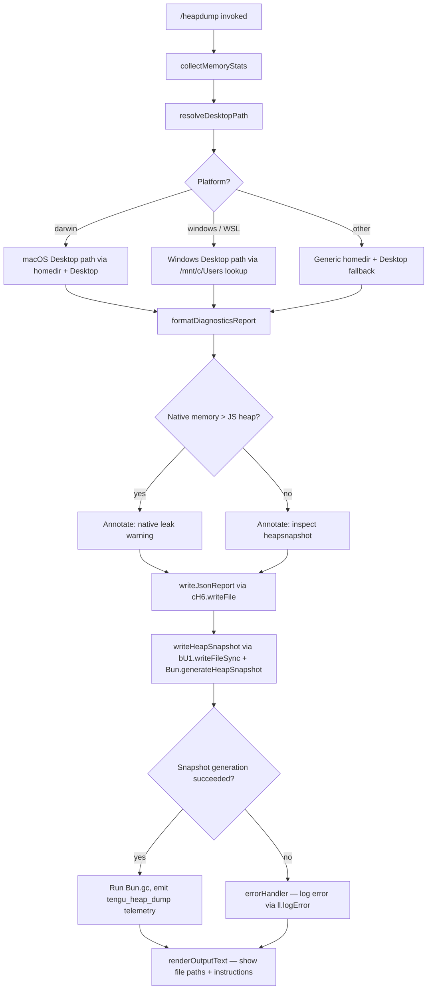

# `/heapdump`

> Analysis basis: CC v2.1.150 bundle.js (AST extraction + Claude interpretation)
> Minimum version: v2.1.150

---

## Overview

The `/heapdump` command captures a V8/Bun heap snapshot of the running Claude Code process and writes it to the user's Desktop directory, alongside a companion JSON diagnostics report. It is a hidden, non-interactive debugging tool intended to assist in diagnosing JavaScript memory leaks and native memory pressure.

---

## Registration

| Field | Value |
|---|---|
| type | `local` |
| name | `heapdump` |
| description | `Dump the JS heap to ~/Desktop` |
| supportsNonInteractive | `true` |
| isHidden | `true` |
| module_id | `mU1` |

Analysis basis: CC v2.1.150 bundle.js:+12195765

---

## Input Branching

The command accepts no user-supplied arguments. All branching is internal, driven by runtime platform detection and memory diagnostics thresholds.



Analysis basis: CC v2.1.150 bundle.js:+12193296, +12193309, +12193592, +12193835, +12193886

---

## Behavioral Spec

### 1. Memory Statistics Collection

```
function collectMemoryStats():
    memUsage      = process.memoryUsage()
    heapStats     = v8Engine.getHeapStatistics()          // via dZ8 module
    resourceUsage = process.resourceUsage()
    uptimeSeconds = process.uptime()
    heapSpaces    = v8Engine.getHeapSpaceStatistics()     // via dZ8 module
    activeHandles = process._getActiveHandles().length
    activeRequests= process._getActiveRequests().length

    // Read open file-descriptor count from Linux procfs (best-effort)
    try:
        fdEntries = fs.readdir("/proc/self/fd")           // POSIX only
    catch:
        fdEntries = []

    // Read smaps_rollup for native RSS detail (Linux only, best-effort)
    try:
        smapsText = fs.readFile("/proc/self/smaps_rollup", "utf8")
    catch:
        smapsText = null

    // Load bun:jsc for JSC-specific diagnostics when running under Bun
    jscModule = require("bun:jsc")                        // optional

    return {
        memUsage, heapStats, resourceUsage, uptimeSeconds,
        heapSpaces, activeHandles, activeRequests,
        fdEntries, smapsText, jscModule
    }
```

Analysis basis: CC v2.1.150 bundle.js:+12190797, +12190821, +12190847, +12190873, +12190898, +12190940, +12190977, +12191028, +12191090, +12191188

**Numeric constants used during stats processing:**

- Uptime divisor: `3600` seconds (converts uptime to hours) — bundle.js:+12191329
- Bytes-to-MB divisor: `1048576` (1 MiB) — bundle.js:+12191334
- Percentage scale: `100` — bundle.js:+12191481
- Decimal precision: `1` decimal place via `.toFixed(1)` — bundle.js:+12191700
- Native-leak threshold ratio: `500` — bundle.js:+12191722
- macOS memory unit divisor: `1024` — bundle.js:+12192431

---

### 2. Desktop Path Resolution

```
function resolveDesktopPath():
    homeDir = os.homedir()                        // via tQ8.homedir

    platform = detectPlatform()                   // returns "darwin", "windows", or other

    if platform == "windows":
        // WSL path: iterate /mnt/c/Users, skip system accounts
        skipAccounts = ["Public", "Default", "Default User", "All Users"]
        users = fs.readdir("/mnt/c/Users")
        realUser = first user not in skipAccounts
        return path.join("/mnt/c/Users", realUser, "Desktop")
    else:
        // macOS and Linux
        return path.join(homeDir, "Desktop")
```

Analysis basis: CC v2.1.150 bundle.js:+12193592, +1012949, +1012985, +1012995, +1013013, +1013217, +1013261, +1013280, +1013300, +1013325

---

### 3. Diagnostics Report Formatting

```
function formatDiagnosticsReport(stats):
    lines = []

    // Annotate heap-vs-native relationship
    jsHeapMB    = stats.memUsage.heapUsed / 1048576
    nativeRSSMB = (stats.memUsage.rss - stats.memUsage.heapTotal) / 1048576

    if nativeRSSMB > jsHeapMB * NATIVE_THRESHOLD_RATIO:
        lines.push("Native memory > heap - leak may be in native addons (node-pty, sharp, etc.)")
    else if jsHeapMB is dominant:
        lines.push("— most memory is JS heap (inspect the .heapsnapshot)")
    else:
        lines.push("— most memory is native (NOT in the .heapsnapshot)")

    if noObviousLeakIndicators(stats):
        lines.push("No obvious leak indicators. Check heap snapshot for retained objects.")
        lines.push("  (no obvious leak indicators)")

    // Append per-heap-space breakdown using padEnd column alignment
    for each space in stats.heapSpaces:
        label = space.space_name.padEnd(COLUMN_WIDTH)    // COLUMN_WIDTH derived at runtime
        lines.push(label + " " + formatMB(space.space_used_size))

    return lines.join(separator)
```

Native leak warning string (exact): `"Native memory > heap - leak may be in native addons (node-pty, sharp, etc.)"` — bundle.js:+12191567

No-leak fallback string (exact): `"No obvious leak indicators. Check heap snapshot for retained objects."` — bundle.js:+12192686

Analysis basis: CC v2.1.150 bundle.js:+12191481, +12191567, +12191690, +12191700, +12191722, +12192686, +12195077, +12195137, +12195274

---

### 4. File Writing — JSON Diagnostics Report

```
function writeJsonReport(desktopPath, reportObject):
    // Serialize with CH (JSON.stringify wrapper, log-level "debug")
    jsonText = jsonStringifyWithDebugLogging(reportObject)

    // Write indented JSON: indent level 2, line-width 384
    fs.writeFile(
        path.join(desktopPath, outputFileName),
        jsonText,
        { indent: 2, lineWidth: 384 }
    )
```

Analysis basis: CC v2.1.150 bundle.js:+12193744, +12193760, +12193770, +12193779

---

### 5. Heap Snapshot Generation

```
function writeHeapSnapshot(desktopPath):
    snapshotPath = path.join(desktopPath, snapshotFileName)

    // Use Bun runtime API
    snapshot = Bun.generateHeapSnapshot(
        format   = "v8",
        encoding = "arraybuffer"
    )

    fs.writeFileSync(snapshotPath, snapshot)

    // Force a full GC after snapshot to reclaim memory
    Bun.gc(/* synchronous = */ true)

    return snapshotPath
```

Snapshot format: `"v8"` — bundle.js:+12194359
Snapshot encoding: `"arraybuffer"` — bundle.js:+12194364

Analysis basis: CC v2.1.150 bundle.js:+12194314, +12194334, +12194391

---

### 6. Trigger Mode

The command always executes with trigger mode `"manual"`, starting at offset `0`.

Analysis basis: CC v2.1.150 bundle.js:+12193272, +12193283

---

### 7. Output Text Rendering

```
function renderOutputText(snapshotPath, reportPath, diagnosticLines):
    outputLines = []

    // Instruction line
    outputLines.push(
        "Open the .heapsnapshot in Chrome DevTools → Memory → Load to inspect retainers."
    )

    // Memory summary with dominant-type annotation
    outputLines.push(memorySummaryLine)            // includes "— most memory is JS heap …"
                                                   // or      "— most memory is native …"

    // Leak-indicator lines (if any)
    for line in diagnosticLines:
        outputLines.push(line)

    // File paths
    outputLines.push(snapshotPath)
    outputLines.push(reportPath)

    // Final join with double-space separator ("  ")
    return { type: "text", content: outputLines.join("  ") }
```

Instruction string (exact): `"Open the .heapsnapshot in Chrome DevTools → Memory → Load to inspect retainers."` — bundle.js:+12194790

Output content type: `"text"` — bundle.js:+12194666

Analysis basis: CC v2.1.150 bundle.js:+12194666, +12194780, +12194790, +12194902, +15284876, +15284889, +15284910

---

### 8. Memory Threshold for Automatic Warning

The threshold constant `1073741824` (1 GiB = 1,073,741,824 bytes) appears to represent the boundary at which total RSS triggers a prominent "auto-1.5GB" warning label in the output summary.

Auto-label string: `"auto-1.5GB"` — bundle.js:+12193952
GiB boundary constant: `1073741824` — bundle.js:+12195683
Column alignment width: `8` characters — bundle.js:+12195409

Analysis basis: CC v2.1.150 bundle.js:+12193952, +12195009, +12195077, +12195137, +12195274, +12195409, +12195683

---

### 9. Error Handling

```
function errorHandler(error):
    message = normalizeError(error)    // converts Error or non-Error to string
    logEntry = {
        type   : "error",
        message: message
    }
    logger.logError(logEntry)          // via ll.logError
    pushToErrorQueue(logEntry)         // via dxH.push
    // Execution continues; output renderer shows partial results
```

Analysis basis: CC v2.1.150 bundle.js:+12194055, +12194064, +12194142, +968515, +968528, +968875, +968915, +172896, +172902, +173202

---

### 10. Platform Detection

Platform detection produces one of the strings `"macos"`, `"windows"`, or `"darwin"` to route Desktop path logic. The string `"darwin"` is used for the raw `process.platform` check, while `"macos"` is an internal normalised label used in diagnostics output.

Analysis basis: CC v2.1.150 bundle.js:+12192421, +12192840, +1013013

---

## Build & Version Metadata Embedded in Command

The following build-time constants are embedded adjacent to the command implementation and are surfaced in the diagnostics report:

| Field | Value |
|---|---|
| Package name | `@anthropic-ai/claude-code` |
| Version | `2.1.150` |
| Build timestamp | `2026-05-23T01:22:49Z` |
| Git commit SHA | `28d4819e0f0a51840356d175c2a710f0c83db5b4` |
| Docs URL | `https://code.claude.com/docs/en/overview` |
| Issue tracker | `https://github.com/anthropics/claude-code/issues` |
| Issue report prompt | `report the issue at https://github.com/anthropics/claude-code/issues` |

Analysis basis: CC v2.1.150 bundle.js:+12192905, +12192988, +12193027, +12193078, +12193105, +12193167, +12193198

---

## State & Side Effects

| Item | Detail |
|---|---|
| Telemetry | `tengu_heap_dump` fired once per invocation after successful snapshot write (bundle.js:+12193886) |
| Hook registration | None detected at depth ≤ 2 |
| appState changes | None detected at depth ≤ 2 |
| Sound | None detected at depth ≤ 2 |
| Filesystem writes | Two files created on Desktop: one `.heapsnapshot` (V8 format, ArrayBuffer) and one `.json` diagnostics report |
| GC side effect | `Bun.gc()` is invoked synchronously after snapshot write, triggering a full garbage collection in the host process (bundle.js:+12194391) |
| Process inspection | Calls `process._getActiveHandles()` and `process._getActiveRequests()`, which are Node.js internal APIs (bundle.js:+12190940, +12190977) |
| Linux procfs reads | Attempts to read `/proc/self/fd` (FD count) and `/proc/self/smaps_rollup` (native memory map); silently continues on non-Linux systems (bundle.js:+12191040, +12191103) |

---

## Version History

| Version | Change |
|---|---|
| v2.1.150 | Initial analysis |

---

## Common Mistakes

1. **Running on a headless / no-Desktop system**: The command always targets `~/Desktop` (or the WSL Windows Desktop). If that directory does not exist the `cH6.writeFile` call will fail. The error handler will log the failure but no fallback path is used. Create `~/Desktop` beforehand if necessary.

2. **Expecting Node.js `v8` module output**: The snapshot is produced by `Bun.generateHeapSnapshot`, not the Node.js `v8` module, because Claude Code runs under the Bun runtime. The output format is V8-compatible, but the generation path is Bun-specific.

3. **Ignoring the companion JSON file**: The `.heapsnapshot` only covers the JS heap. Native memory leaks (from addons such as `node-pty` or `sharp`) will appear in the JSON diagnostics report under the `rss`/`heapTotal` delta, not in the snapshot. If the command prints `"Native memory > heap"`, open the JSON file rather than the snapshot.

4. **Assuming the command is interactive-only**: `supportsNonInteractive: true` means the command can be invoked in scripted or piped contexts; no TTY is required.

5. **Running on Windows (native, non-WSL)**: The Desktop path logic for Windows assumes a WSL mount at `/mnt/c/Users`. Running Claude Code on native Windows without WSL may produce an incorrect output path.

6. **Expecting fresh memory figures after the dump**: `Bun.gc()` is called after the snapshot is written. Any memory metrics logged to the console reflect pre-GC state; post-invocation RSS will typically be lower.

---

## Appendix — Identifier Mapping

> For bundle debugging only. Identifiers change across versions.

| Identifier | Role |
|---|---|
| `o65` | Top-level command handler / output assembler |
| `xU1` | Main execution function (orchestrates all sub-steps) |
| `S6` | Text-rendering helper (formats structured output lines) |
| `i65` | Memory statistics collector |
| `N` | Debug-log / structured-message formatter |
| `K` | Column-alignment formatter (padEnd table rows) |
| `ZWA` | Desktop path resolver (platform-aware) |
| `Q6` | File path join / normalization utility |
| `CH` | JSON serialization wrapper (with debug logging) |
| `r65` | Heap snapshot writer (calls Bun APIs) |
| `c` | Telemetry event emitter |
| `c_` | Error normalization helper (Error → String) |
| `Dz` | Post-snapshot state updater |
| `RH` | Error handler / error queue dispatcher |
| `a65` | Output line builder (summary + annotation lines) |
| `lH6` | Heap-space statistics formatter |
| `_` | Mutable output line accumulator array |