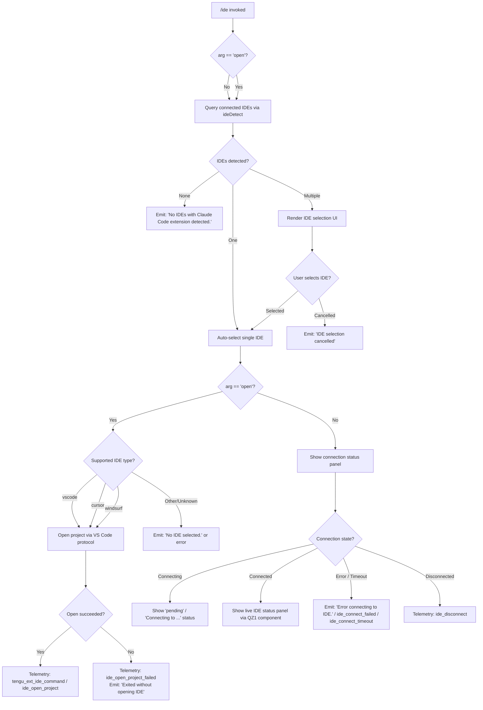

# `/ide`

> Analysis basis: CC v2.1.150 bundle.js (AST extraction + Claude interpretation)
> Minimum version: v2.1.150

---

## Overview

The `/ide` command manages IDE integrations for Claude Code by detecting connected IDE instances (VS Code, Cursor, Windsurf, JetBrains, etc.), displaying their current connection status, and optionally opening the current project directly in a detected IDE. It operates as an async handler that queries the IDE connection subsystem and renders a live JSX status panel.

---

## Registration

| Field | Value |
|---|---|
| type | `local-jsx` |
| name | `ide` |
| description | `Manage IDE integrations and show status` |
| argumentHint | `[open]` |
| module_id | `dZ1` |
| load_inline | `true` |
| loc_byte | `11215536` |
| loc_byte_end | `11215692` |
| loc_line | `8607` |
| arbor_handler.name | `uQL` |
| arbor_handler.fqn | `claude-2.1.150::uQL` |
| arbor_handler.kind | `AsyncFunction` |
| arbor_handler.resolution_path | `module_id` |
| arbor_handler.n_hits | `0` |

Analysis basis: CC v2.1.150 bundle.js:+11215536

---

## Input Branching

The command has 5+ distinct branches depending on the argument, IDE detection result, connection state, and selection outcome.



Analysis basis: CC v2.1.150 bundle.js:+11211650

---

## Behavioral Spec

### Top-Level Handler (`uQL`)

The primary async handler `uQL` (Arbor-resolved name) runs when the user invokes `/ide`.

```
async function ideCommandHandler(context):
    emit telemetry("tengu_ext_ide_command")   // always fires at entry

    arg = context.args.trim()                 // e.g. "" or "open"

    if arg == "open":
        openMode = true
    else:
        openMode = false

    ideList = await detectIDEs(context)       // calls ideDetectFunction (flH)

    if ideList is empty:
        render("No IDEs with Claude Code extension detected.")
        return

    if ideList.length == 1:
        selectedIDE = ideList[0]
    else:
        selectedIDE = await showIDESelectionUI(ideList)   // interactive picker

    if selectedIDE is null:
        render("IDE selection cancelled")
        return

    if openMode:
        result = await openProjectInIDE(selectedIDE, context)
        if result.success:
            emit telemetry("ide_open_project")
        else:
            emit telemetry("ide_open_project_failed")
            render("Exited without opening IDE")
        return

    // status display path
    renderIDEStatusPanel(selectedIDE)         // renders QZ1 JSX component
```

Analysis basis: CC v2.1.150 bundle.js:+11211650

---

### IDE Detection (`flH`)

`flH` is the IDE detection function, invoked from `uQL` at +11211810. It discovers running IDE processes and their Claude Code extension socket endpoints.

```
async function detectIDEs(context):
    portInfo = parsePortOrDefault(context)    // parseInt at +5255915

    candidateList = await gatherIDECandidates()   // M48 at +5255964

    results = await Promise.all(
        candidateList.map(candidate -> probeIDE(candidate))  // FN7 at +5256004
    )

    ideEntries = results.filter(entry -> entry is valid)

    for each entry in ideEntries:
        if entry.platform == "wsl":
            normalizeWSLPath(entry)
        entry.ideType = classifyIDEType(entry)   // jX at +11212845

    emit telemetry("ide_detect")              // +5257258
    if any probe failed:
        emit telemetry("ide_detect_failed")   // +5257322

    return ideEntries
```

Analysis basis: CC v2.1.150 bundle.js:+5255915

---

### IDE Candidate Gathering (`M48` / `QN7`)

`M48` (called from `flH` at +5255964) resolves IDE installation locations using OS-specific paths. `QN7` (called from `M48`) scans known filesystem locations for IDE socket/config files.

```
async function gatherIDECandidates():
    searchPaths = []
    searchPaths.push(homedir())                // z$q.homedir at +5253785

    if platform == "wsl":
        searchPaths.push("/mnt/c/Users")       // literal at +5254006
        // excludes "Public", "Default", "Default User", "All Users"

    results = []
    for each path in searchPaths:
        entries = await scanForIDESocketFiles(path)   // QN7 logic
        for each entry in entries:
            if entry.isDirectory() or entry.isSymbolicLink():
                realPath = await fs.realpath(entry)
                if not seen.has(realPath):
                    seen.add(realPath)
                    results.push(entry)

    return await Promise.all(results.map(resolveIDEEntry))
```

Analysis basis: CC v2.1.150 bundle.js:+5252469

---

### IDE Type Classification (`jX`)

`jX` (called from `flH` at +11212845 and from `uQL` at +11212845) maps a raw IDE process or socket descriptor to one of the known IDE type strings.

```
function classifyIDEType(ideDescriptor):
    name = ideDescriptor.name.toLowerCase()   // +5261667

    if name contains "cursor":
        return "cursor"                        // literal at +11212106
    if name contains "windsurf":
        return "windsurf"                      // literal at +11212147
    if name contains "code":
        return "vscode"                        // literal at +11212065
    if name matches jetbrains pattern:         // includes idea, pycharm, etc.
        return "jetbrains"                     // literal at +5252365
    if name contains "appcode":
        return "appcode"                       // literal at +5261166

    processName = path.basename(ideDescriptor.executable)  // CN.basename at +5261725
    return deriveName(processName)             // MvH at +5261799
```

Analysis basis: CC v2.1.150 bundle.js:+5261667

For Linux, process detection uses a `ps aux` scan (literal at +5260792):
> Pattern searched: `code|cursor|windsurf|idea|pycharm|webstorm|phpstorm|rubymine|clion|goland|rider|datagrip|dataspell|aqua|gateway|fleet|android-studio`

Analysis basis: CC v2.1.150 bundle.js:+5260792

---

### Open Project in IDE (`uQL` open-mode branch)

When `arg == "open"`, the handler attempts to open the current worktree or project in the selected IDE.

```
async function openProjectInIDE(selectedIDE, context):
    projectPath = resolveProjectPath(context)   // worktree or project root

    ideType = selectedIDE.ideType

    if ideType in ["vscode", "cursor", "windsurf"]:
        protocol = buildVSCodeOpenURI(ideType, projectPath)
        success = await launchURIOrCLI(protocol)
    else:
        success = false

    if not success:
        logWarning("Exited without opening IDE")  // literal at +11212602
        emit telemetry("ide_open_project_failed") // literal at +11212312
        return { success: false }

    emit telemetry("ide_open_project")            // literal at +11212205
    return { success: true }
```

Analysis basis: CC v2.1.150 bundle.js:+11212178

---

### IDE Status Panel Component (`QZ1`)

`QZ1` is the JSX React component rendered during the status-display path. It subscribes to IDE connection state via `useEffect` and renders connection status, detected extension metadata, and MCP tool availability.

```
function IDEStatusPanel({ selectedIDE }):
    [connectionState, setConnectionState] = useState(null)   // +11213538
    appState = useAppState()                                  // J6 at +11213558
    ref = useRef()                                            // +11213616

    useEffect(() => {
        setConnectionState("pending")                         // literal at +11213711

        connection = connectToIDE(selectedIDE)               // uses x6 / ideConnectionStore

        connection.on("connected", () => {
            emit telemetry("ide_connect")                     // +11213755
            setConnectionState("connected")
        })

        connection.on("error", () => {
            emit telemetry("ide_connect_failed")              // +11213842
            setConnectionState("error")
        })

        connection.on("timeout", () => {
            emit telemetry("ide_connect_timeout")             // +11213949
            setConnectionState("timeout")
        })

        connection.on("disconnect", () => {
            emit telemetry("ide_disconnect")                  // +11214448
        })

        return () => connection.cleanup()
    }, [selectedIDE])

    mcpTools = appState.tools
        .filter(t -> t.name.startsWith("mcp__ide__"))        // literal at +11214345

    if connectionState == "pending":
        render "Connecting to {selectedIDE.name}…"           // literal at +11214785

    if connectionState == "error" or "timeout":
        render "Error connecting to IDE."                     // literal at +11214067

    render IDEStatusView(selectedIDE, mcpTools, connectionState)
```

Analysis basis: CC v2.1.150 bundle.js:+11213538

---

### Connected IDE Count Display Helper (`Rl_`)

`Rl_` (called from the registration block context at +11215030) formats the list of connected IDE names for display. It trims and normalizes entries with NFC Unicode normalization (literal at +11215135).

```
function formatConnectedIDEList(ideList):
    if ideList.length == 0:
        return ""

    normalized = ideList.map(ide -> ide.name.normalize("NFC"))  // +11215123, +11215135
    
    displayCount = Math.floor(...)                               // +11215098

    if ideList.length > 3:                                       // literal at +11215067
        visible = normalized.slice(0, 3)
        return visible.join(", ") + ", …"                        // literals at +11215292, +11215306
    else:
        return normalized.join(", ")                             // literal at +11215292
```

Analysis basis: CC v2.1.150 bundle.js:+11215037

---

### IDE Connection Store (`x6` / `Mm6`)

`x6` is the IDE connection store accessor (called from `uQL` at +11211796). It reads from an async store (`Lm6.getStore`) and delegates to the notification subsystem `wl`.

```
function getIDEConnectionStore():
    store = Lm6.getStore()         // AsyncLocalStorage get at +973406
    if store is null:
        return defaultStore(wl)    // wl at +973427
    return store
```

Analysis basis: CC v2.1.150 bundle.js:+973406

---

## State & Side Effects

| Item | Detail |
|---|---|
| Telemetry: `tengu_ext_ide_command` | Fired unconditionally on every `/ide` invocation (bundle.js:+11211652) |
| Telemetry: `ide_detect` | Fired after IDE detection completes (bundle.js:+5257258) |
| Telemetry: `ide_detect_failed` | Fired when one or more IDE probes fail (bundle.js:+5257322) |
| Telemetry: `ide_open_project` | Fired on successful project open (bundle.js:+11212205) |
| Telemetry: `ide_open_project_failed` | Fired when project open fails or exits without opening (bundle.js:+11212312) |
| Telemetry: `ide_connect` | Fired when IDE WebSocket/SSE connection is established (bundle.js:+11213755) |
| Telemetry: `ide_connect_failed` | Fired on connection error (bundle.js:+11213842) |
| Telemetry: `ide_connect_timeout` | Fired when connection attempt times out (bundle.js:+11213949) |
| Telemetry: `ide_disconnect` | Fired when previously connected IDE disconnects (bundle.js:+11214448) |
| Connection protocols | Supports both SSE (`sse-ide`, literal at +11209637) and WebSocket (`ws-ide`, literal at +11209657) transports |
| MCP tool filtering | Filters appState tools whose names begin with `mcp__ide__` (literal at +11214345) |
| appState changes | Reads connection state and MCP tool registry from appState via `useAppState` (J6 at +11213558) |
| Hook registration | No hook registration observed in depth-2 traversal |
| Sound | No sound side effects observed in depth-2 traversal |
| Platform behavior | WSL path normalization active when `platform == "wsl"` (literal at +5253844); Linux uses `ps aux` grep (literal at +5260792) |

---

## Version History

| Version | Change |
|---|---|
| v2.1.150 | Initial analysis |

---

## Common Mistakes

1. **Invoking `/ide open` without an extension installed** — If no IDE has the Claude Code extension active, the command emits "No IDEs with Claude Code extension detected." and exits. The extension must be installed and running before `/ide open` can succeed.
2. **Expecting `/ide` to work without a daemon** — The IDE connection subsystem depends on the background daemon; if the daemon is not running, connection attempts will timeout and emit `ide_connect_timeout`.
3. **Assuming all IDE types support `open`** — Only `vscode`, `cursor`, and `windsurf` have a project-open code path. JetBrains and other IDEs detected by type classification may not support the `open` subcommand.
4. **Misreading the argument hint** — The `[open]` argument is the only recognized subcommand. Any other text is ignored (treated as the no-argument status display path).
5. **WSL users expecting standard paths** — Under WSL, the candidate scanner includes `/mnt/c/Users` but excludes system accounts (`Public`, `Default`, `Default User`, `All Users`). A custom Windows user directory outside these paths may not be scanned.

---

## Appendix — Identifier Mapping

> For bundle debugging only. Identifiers change across versions.

| Identifier | Role |
|---|---|
| `uQL` | Primary async handler for `/ide` command (Arbor-resolved, fqn: `claude-2.1.150::uQL`) |
| `Rl_` | Connected IDE list formatter / display helper |
| `flH` | IDE detection function (probes running IDE processes) |
| `M48` | IDE candidate gatherer (resolves installation paths) |
| `QN7` | Filesystem scanner for IDE socket/config files |
| `FN7` | Individual IDE probe function |
| `h8_` | IDE process descriptor parser |
| `G_` | IDE metadata resolution helper |
| `jX` | IDE type classifier (maps process name to type string) |
| `Cq` | String slice/index utility used in classification |
| `s3q` | Regex-match helper used in IDE detection |
| `Y$q` | Process kill helper used during IDE lifecycle |
| `QZ1` | JSX React status panel component |
| `J6` | App state accessor hook (`useAppState`) |
| `Tz_` | App state context reader |
| `zA` | App state context alternative accessor |
| `AO` | Terminal/focus context hook |
| `OI` | Cleanup utility for IDE connection side effects |
| `ytH` | Serialization helper used in connection setup |
| `E8` | IDE metadata builder / display formatter |
| `u0_` | IDE open subcommand orchestrator |
| `oN7` | OS-specific IDE path resolver |
| `sX` | Platform detection helper |
| `lWH` | Low-level IDE socket connection initiator |
| `x6` | IDE connection store accessor |
| `Mm6` | AsyncLocalStorage-backed IDE store reader |
| `wl` | IDE connection notification/fallback subsystem |
| `j_` | Store subscriber/watcher |
| `Dv` | Subscriber cleanup helper |
| `Wr` | IDE restart advisory renderer ("restart your IDE") |
| `hQL` | Status panel sub-renderer |
| `yf` | App state pre-check before IDE command runs |
| `flH` | (see above — IDE detection) |
| `_8` | Error boundary / catch helper |
| `Rl_` | (see above — list formatter) |
| `c` | Generic error/result container |
| `K8` | Error construction utility |
| `RH` | Structured error logger |
| `N` | Log/output writer |
| `CH` | JSON serializer wrapper |
| `bH` | Output write helper (stdout) |
| `uH` | Output write helper (stderr) |
| `mH` | String conversion utility |
| `EH` | String coercion helper |
| `j8` | Error code mapper |
| `s9` | Error detail formatter |
| `g6` | JSON parse wrapper |
| `V6` | IDE daemon normalizer / path resolver |
| `D` | Daemon manager / background process supervisor |
| `w` | Background session lifecycle manager |
| `C` | IDE connection process wrapper |
| `z` | IPC write channel |
| `y` | Background worker kill helper |
| `j` | Background worker value iterator |
| `O` | Terminal k8 wrapper |
| `k8` | Raw terminal instance |
| `W` | Config change watcher / skill reload trigger |
| `czH` | Config-change event dispatcher |
| `b7` | Config subsystem event emitter |
| `YW` | Hook runner / event processing function |
| `tQH` | Hook presence checker |
| `bo` | Skill index reload orchestrator |
| `Vx` | Skill cache clear helper |