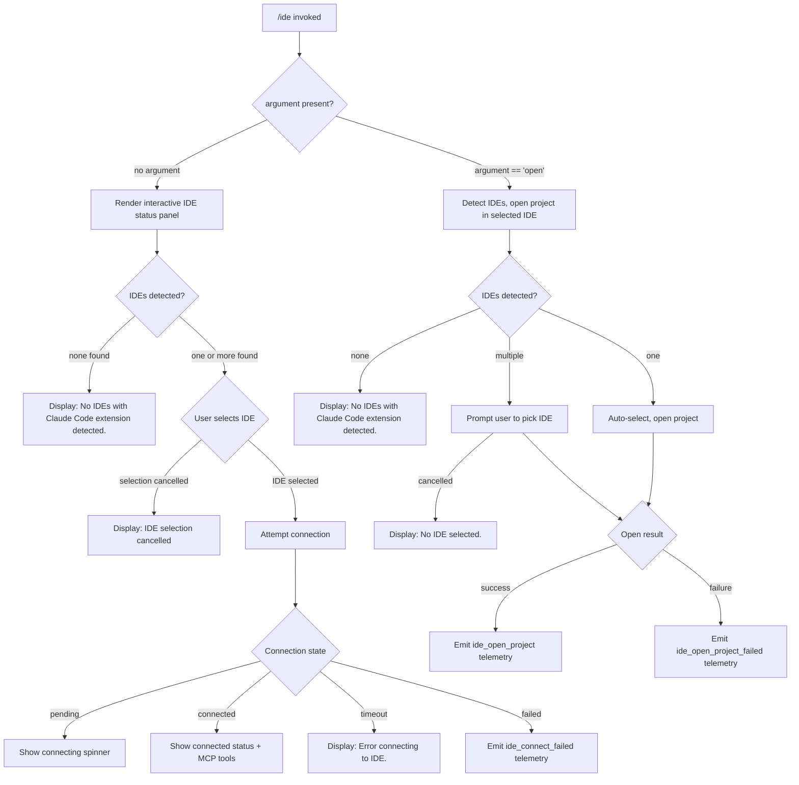

# `/ide`

> Analysis basis: CC v2.1.150 bundle.js (AST extraction + Claude interpretation)
> Minimum version: v2.1.150

---

## Overview

The `/ide` command manages IDE integrations for Claude Code by detecting running IDE instances (VS Code, Cursor, Windsurf, JetBrains family), establishing or disconnecting MCP connections over SSE or WebSocket transports, and presenting a real-time status display. When invoked with the `open` argument it immediately opens the current project in the selected IDE; without arguments it renders an interactive status panel where the user can pick an IDE, monitor connection state, and disconnect.

## Registration

| Field | Value |
|---|---|
| type | `local-jsx` |
| name | `ide` |
| description | Manage IDE integrations and show status |
| argumentHint | `[open]` |
| module_id | `dZ1` |
| `loc_byte_end` | `11215692` |
| `arbor_handler.name` | `uQL` |
| `arbor_handler.kind` | `AsyncFunction` |
| `arbor_handler.resolution_path` | `module_id` |
| `arbor_handler.fqn` | `claude-2.1.150::uQL` |
| `arbor_handler.n_hits` | `0` |

Analysis basis: CC v2.1.150 bundle.js:+11215536

## Input Branching



Analysis basis: CC v2.1.150 bundle.js:+11211758, +11211867, +11212005, +11214918

## Behavioral Spec

### Top-Level Command Handler

```
function ideCommandHandler(args, appState):
    // Trim and inspect first argument
    subcommand = args[0] if args else null

    if subcommand == "open":
        return openProjectFlow(appState)
    else:
        return renderIdeStatusPanel(appState)
```

Analysis basis: CC v2.1.150 bundle.js:+11211758, +11211796

---

### IDE Detection (`flH` → detectIDEs)

```
function detectIDEs(platform):
    results = []

    if platform == "wsl":
        // WSL-specific detection path
        wsResult = detectIDEsViaWSL()
        results.push(wsResult)

    if platform == "linux":
        // Run process listing command and parse output
        psOutput = exec(
            "ps aux | grep -E \"code|cursor|windsurf|idea|pycharm|webstorm" +
            "|phpstorm|rubymine|clion|goland|rider|datagrip|dataspell" +
            "|aqua|gateway|fleet|android-studio\" | grep -v grep"
        )
        results.push(...parseLinuxProcessList(psOutput))

    // Normalise, deduplicate, and classify each candidate
    for each candidate in results:
        candidate.name = normaliseIDEName(candidate.name)  // toLowerCase + classify
        candidate.type = classifyIDEType(candidate.name)   // "vscode"|"cursor"|"windsurf"|"jetbrains"

    // Attempt socket/port connection per candidate (up to 10 retries per IDE)
    connected = []
    for each candidate in results:
        port = parseInt(candidate.port)
        connection = tryConnect(port)   // uses j_ → connectionAttempt
        if connection.ok:
            connected.push(candidate)

    emitTelemetry("ide_detect")            // on success
    // on any failure: emitTelemetry("ide_detect_failed")

    return connected
```

Analysis basis: CC v2.1.150 bundle.js:+5255915, +5256019, +5256374, +5257258, +5257322, +5260792, +5261667

---

### IDE Name Normalisation (`jX` → normaliseIDEName)

```
function normaliseIDEName(rawName):
    lower = rawName.toLowerCase()

    if lower contains "code":    return "vscode"
    if lower contains "cursor":  return "cursor"
    if lower contains "windsurf":return "windsurf"
    if lower contains "idea"
       or lower contains "pycharm"
       or lower contains "webstorm"
       or lower contains "appcode"
       or other JetBrains products: return "jetbrains"

    // Fall back to basename of process path
    return path.basename(lower)
```

Analysis basis: CC v2.1.150 bundle.js:+5261667, +5261725, +5261799, +11212065, +11212106, +11212147, +5261166

---

### Open-Project Flow (`uQL` with `open` argument)

```
function openProjectFlow(appState):
    emitTelemetry("tengu_ext_ide_command")

    ideList = detectIDEs(currentPlatform)

    if ideList is empty:
        display("No IDEs with Claude Code extension detected.")
        return

    selectedIDE = null

    if ideList.length == 1:
        selectedIDE = ideList[0]
    else:
        selectedIDE = promptUserToSelectIDE(ideList)

    if selectedIDE is null:
        display("No IDE selected.")
        return

    // Determine open mode: "worktree" or "project"
    openMode = determineOpenMode(appState)   // "worktree" | "project"

    result = sendOpenProjectRequest(selectedIDE, openMode)

    if result.success:
        emitTelemetry("ide_open_project")
        // record ide type (vscode / cursor / windsurf) in event properties
    else:
        emitTelemetry("ide_open_project_failed")
        display("Exited without opening IDE")
```

Analysis basis: CC v2.1.150 bundle.js:+11211810, +11211867, +11212005, +11212178, +11212205, +11212239, +11212250, +11212312, +11212602

---

### Interactive Status Panel (`QZ1` → renderIdeStatusPanel)

```
function renderIdeStatusPanel(appState):
    emitTelemetry("tengu_ext_ide_command")

    // React hooks initialisation
    [connectionState, setConnectionState] = useState("pending")
    ideRef = useRef(null)
    useEffect(...)   // mounts connection lifecycle

    ideList = detectIDEs(currentPlatform)  // via x6 → getIDEList

    if ideList is empty:
        render("No IDEs with Claude Code extension detected.")
        return

    selectedIDE = promptUserToSelectIDE(ideList)

    if selectedIDE is null:
        render("IDE selection cancelled")
        return

    setConnectionState("pending")

    // Attempt MCP connection
    transport = chooseTransport(selectedIDE)
    // transport is "sse-ide" or "ws-ide" depending on IDE endpoint
    // "ws:" prefix in URL → WebSocket transport, otherwise SSE
    connectToIDE(selectedIDE, transport, callbacks):
        on connect:
            setConnectionState("connected")
            emitTelemetry("ide_connect")
            listMCPTools()   // tools prefixed "mcp__ide__"
        on timeout:
            setConnectionState("timeout")
            emitTelemetry("ide_connect_timeout")
            display("Error connecting to IDE.")
        on error:
            setConnectionState("failed")
            emitTelemetry("ide_connect_failed")

    // Render connection status, active MCP tool list, disconnect button
    render(
        connectionStatusBar(connectionState),
        mcpToolList(toolsWithPrefix("mcp__ide__")),
        disconnectButton → onDisconnect()
    )

function onDisconnect():
    emitTelemetry("ide_disconnect")
    teardownMCPConnection()
    setConnectionState("pending")
```

Analysis basis: CC v2.1.150 bundle.js:+11213538, +11213599, +11213711, +11213755, +11213842, +11213949, +11214037, +11214345, +11214448, +11214552, +11214565, +11209637, +11209657

---

### Connection Transport Selection

```
function chooseTransport(ideEndpointURL):
    if ideEndpointURL.startsWith("ws:"):
        return "ws-ide"    // WebSocket transport
    else:
        return "sse-ide"   // Server-Sent Events transport
```

Analysis basis: CC v2.1.150 bundle.js:+11214565, +11214682, +11209637, +11209657

---

### Daemon / Background Session Interactions (`w` → daemonSessionManager)

The IDE command drives a background daemon session infrastructure used to host the MCP connection.

```
function daemonSessionManager(ideTarget):
    // Attempt to claim a pre-warmed spare session
    spareSession = claimSpareSession()   // via yqA → claimSession

    if spareSession is null:
        // Spawn a fresh background PTY host process
        spawnBackgroundPTYHost(args=[
            "--bg-pty-host", "200", "50", "--", "--bg-spare"
        ])

    // Connection error handling
    on error code "ENOENT" or "enoent":
        handleMissingSocket()
    on error code "ECONNREFUSED" or "econnrefused":
        handleRefusedConnection()
    on error code "unknown":
        handleUnknownConnectionError()

    // Session lifecycle retry loop
    // Retries with 2000 ms delay between attempts
    // After 30 s total: escalate to SIGKILL
    // After 15 s grace: send SIGTERM first
    on session idle > 300000 ms (5 minutes):
        markSessionIdle()
        scheduleCleanup()
```

Analysis basis: CC v2.1.150 bundle.js:+15260497, +15260826, +15260837, +15260912, +15260919, +15261296, +15262245, +15262438, +15262460, +15267635, +15240695, +15240713, +15240719, +15240736

---

### Path and String Normalisation Utility (`Rl_` → normaliseIDESocketPaths)

```
function normaliseIDESocketPaths(rawPaths):
    // Generate a random suffix of 3 hex characters
    randomSuffix = Math.floor(Math.random() * 100) padded to base value

    // Normalise each path to NFC Unicode form
    normalisedPaths = rawPaths.map(p => path.normalize(p).normalize("NFC"))

    // Select first and slice/truncate lists for display
    primary   = normalisedPaths[0]              // index 0
    displayed = normalisedPaths.slice(0, 3)     // up to 3 entries shown
    remainder = normalisedPaths.slice(3)        // overflow

    // Format overflow as ", …" when more than 3 entries exist
    label = displayed.join(", ")
    if remainder.length > 0:
        label += ", …"

    return { primary, label }
```

Analysis basis: CC v2.1.150 bundle.js:+11215037, +11215067, +11215098, +11215123, +11215135, +11215144, +11215210, +11215269, +11215292, +11215306

---

### IDE Status Display Component (`oN7` → buildIDEStatusEntries)

```
function buildIDEStatusEntries(ideRegistry):
    entries = []

    for each [key, value] in Object.entries(ideRegistry):
        // Skip IDE types not in current allowed list
        if not allowedIDETypes.includes(key):
            continue

        name = value.toLowerCase()
        entry = {
            id:     key,
            label:  name,
            status: value.status   // "connected" | "pending" | "failed" | etc.
        }
        entries.push(entry)

    // Sort and return for rendering
    return entries
```

Analysis basis: CC v2.1.150 bundle.js:+5259903, +5260206, +5260263, +5260278, +5260708, +5260719

---

### Daemon Spare Pool Management (`kqA` → spawnSpareSession)

```
function spawnSpareSession(platform):
    label = "daemon_bg_spare_refill"
    randomToken = crypto.randomBytes(4).toString("hex")

    socketDir = path.join(tempDir, randomToken)
    fs.mkdir(socketDir, { mode: 448 })   // octal 0o700

    process = Bun.spawn([
        currentExecutable,
        "--bg-pty-host", "200", "50",
        "--", "--bg-spare"
    ], { stdio: "ignore" })

    process.unref()   // detach from parent

    // Poll until ready or timeout
    deadline = Date.now() + CONNECTION_TIMEOUT
    loop:
        if Date.now() > deadline:
            process.kill("SIGTERM")
            break
        sleep(POLL_INTERVAL)

    on exit:
        log via H.onExit / H.log
```

Analysis basis: CC v2.1.150 bundle.js:+15240399, +15240438, +15240479, +15240495, +15240507, +15240538, +15240547, +15240571, +15240669, +15240677, +15240695, +15240713, +15240719, +15240724, +15240736, +15240779, +15240836, +15240899, +15241298

---

### Reconnect / Restart Hint Display

When the connection state is `failed` or `timeout`, the panel advises:

> "restart your IDE"

Analysis basis: CC v2.1.150 bundle.js:+11212870

---

### MCP Tool Filtering for IDE

After connection, the panel lists only tools whose names start with `"mcp__ide__"`. All other MCP tools are excluded from the IDE status view.

Analysis basis: CC v2.1.150 bundle.js:+11214345

## State & Side Effects

| Item | Detail |
|---|---|
| Telemetry — `tengu_ext_ide_command` | Fired on every invocation of `/ide` (both `open` and status modes) |
| Telemetry — `ide_detect` | Fired when IDE detection succeeds |
| Telemetry — `ide_detect_failed` | Fired when IDE detection fails |
| Telemetry — `ide_open_project` | Fired when the project is successfully opened in the IDE |
| Telemetry — `ide_open_project_failed` | Fired when the project open request fails |
| Telemetry — `ide_connect` | Fired when MCP connection to IDE is established |
| Telemetry — `ide_connect_failed` | Fired when MCP connection attempt fails |
| Telemetry — `ide_connect_timeout` | Fired when MCP connection attempt times out |
| Telemetry — `ide_disconnect` | Fired when user disconnects from IDE |
| Telemetry — `tengu_bg_spare_enable` | Fired when spare background session pool is enabled |
| Telemetry — `tengu_bg_spare_spawn` | Fired when a spare session is spawned |
| Telemetry — `tengu_bg_spare_claim` | Fired when a spare session is successfully claimed |
| Telemetry — `tengu_bg_spare_claim_fail` | Fired when spare session claim fails |
| Telemetry — `tengu_bg_dispatch_low_mem` | Fired when background dispatch is constrained by low memory |
| Telemetry — `tengu_bg_dispatch_sigkill_escalate` | Fired when SIGKILL escalation occurs for a background session |
| Telemetry — `tengu_bg_sendclaim_failed` | Fired when the background session claim message send fails |
| Telemetry — `tengu_bg_low_mem_mb` | Memory metric event for background sessions (macOS; threshold 1024 MB) |
| Telemetry — `tengu_daemon_control` | Fired on daemon control operations (stop/start) |
| Telemetry — `tengu_daemon_yield` | Fired when daemon yields to foreground session |
| Telemetry — `tengu_feature_ok` | Fired when a feature gate check passes |
| Telemetry — `tengu_feature_bad` | Fired when a feature gate check fails |
| Telemetry — `tengu_feature_sad` | Fired on feature gate error/exception path |
| Transport registration | Registers either `"sse-ide"` or `"ws-ide"` MCP transport depending on IDE endpoint URL scheme |
| appState changes | Sets `ide` key in appState to `"pending"` → `"connected"` / `"failed"` / `"timeout"` |
| Background daemon | May spawn or claim a background PTY host process (`--bg-pty-host`) |
| Socket cleanup | Removes socket files and lock files (`unlinkSync`, `yY.unlink`, `yY.rm`) on session teardown |
| Idle session cleanup | Sessions idle for longer than 300 000 ms (5 minutes) are scheduled for cleanup |
| Process signals | SIGTERM sent first; SIGKILL escalation after grace period (15 s first warning, 30 s hard kill) |

## Version History

| Version | Change |
|---|---|
| v2.1.150 | Initial analysis |

## Common Mistakes

1. **Running `/ide open` with no IDE running**: If no IDE with the Claude Code extension is active, the command exits immediately with "No IDEs with Claude Code extension detected." Launch your IDE and install the Claude Code extension first.
2. **Connection timeout after selection**: If the MCP connection times out ("Error connecting to IDE."), heed the "restart your IDE" hint — the extension may need reloading. The timeout is not configurable from the CLI.
3. **WSL environments**: Detection uses a distinct code path on WSL. On plain Linux the command spawns a `ps aux | grep …` process; if that process list is unexpectedly empty (e.g., restricted `/proc` access), no IDEs will be found.
4. **Multiple IDEs open**: When more than one IDE is detected the command prompts for selection. Pressing escape or cancelling the prompt results in "IDE selection cancelled" with no connection made.
5. **MCP tool prefix assumption**: Only tools prefixed `mcp__ide__` appear in the IDE status tool list. Custom MCP servers whose tool names accidentally share this prefix may appear in the list.
6. **Transport mismatch**: The transport (SSE vs. WebSocket) is selected automatically based on whether the IDE endpoint URL starts with `ws:`. Manually specifying an endpoint with the wrong scheme is not supported via the `/ide` command.
7. **Spare session pool on low-memory hosts**: On macOS systems with less than 1024 MB free memory, background spare session spawning is suppressed (`tengu_bg_low_mem_mb` telemetry is emitted). This can cause slightly longer connection setup times.

## Appendix — Identifier Mapping

> For bundle debugging only. Identifiers change across versions.

| Identifier | Role |
|---|---|
| `Rl_` | normaliseIDESocketPaths — formats and truncates IDE socket path lists for display |
| `x6` | getIDEList — retrieves the current list of detected IDE connections from store |
| `Mm6` | ideStoreAccessor — reads IDE state from the application store via `Lm6.getStore` |
| `j_` | connectionAttempt — low-level TCP/socket connection probe |
| `H` | randomSuffixGenerator — uses `Math.random` + `setTimeout` for token generation |
| `A` | pathNormaliser — wraps `M.toLowerCase` and Unicode NFC normalisation |
| `M` | socketConnectionHandle — manages `A.close`, `q.close`, `L` lifecycle |
| `q` | socketFileSet — file-system socket entry collection (`unlinkSync`) |
| `D` | daemonSessionManager — top-level background session orchestrator |
| `V6` | sessionRegistrar — registers/deregisters sessions in the global session map |
| `$` | disposableHandle — wraps `HQ1`, exposes `.dispose()` |
| `Kv8` | platformSpawnHelper — platform-aware (`macos`, 1024 MB threshold) session spawner |
| `kqA` | spawnSpareSession — spawns a detached background PTY host process |
| `c` | appStateStore — core application state container |
| `Dz` | diagnosticsLogger — structured diagnostic/warning logger |
| `N` | platformEnvReader — reads platform env vars, normalises to uppercase |
| `K8` | sessionStateUpdater — updates session status fields in appState |
| `RH` | errorEventEmitter — emits structured error events with `ll.logError` |
| `w` | sessionLifecycleController — manages connect/kill/retry/dispose for a session |
| `C` | supervisorProcess — background supervisor write/kill handler |
| `uH` | featureGateOkHandler — callback for feature gate pass (`tengu_feature_ok`) |
| `bH` | featureGateBadHandler — callback for feature gate fail (`tengu_feature_bad`) |
| `Oz6` | rosterFileReader — reads roster JSON file via `vP.readFile` |
| `g` | retiredSessionFilter — filters and retires settled sessions |
| `yqA` | claimSession — claims a pre-warmed spare background session via `bB.claim` |
| `uqA` | sessionRequestHandler — manages full session request lifecycle including cleanup |
| `L` | sessionRequestHandlerAlias — shares queue/lifecycle logic with `uqA` |
| `S` | disposableSessionRef — session reference with `.dispose()` |
| `uQL` | ideCommandEntryPoint — main `/ide` command React component / handler |
| `yf` | argumentParser — extracts and validates the `[open]` argument |
| `flH` | detectIDEsAndConnect — orchestrates full IDE detection + connection negotiation |
| `M48` | jetBrainsSocketScanner — scans JetBrains socket paths, builds port list |
| `FN7` | lockFileResolver — resolves `.lock` file paths for JetBrains IDEs |
| `mH` | stringCoercer — wraps `String()` for safe coercion |
| `s3q` | vscodeSocketPathParser — parses VS Code socket paths via regex (`H.match`) |
| `K` | statusColumnFormatter — pads status columns with `M.padEnd` and two-space separator |
| `W` | debounceEmitter — debounced event emitter using `clearTimeout`/`setTimeout`/`z.clear` |
| `X` | socketDataReader — reads buffered socket data, handles `ETOOLARGE` / `EUNKNOWN` |
| `P` | mcpClientConnector — establishes MCP client connection (`connected`, `Connection failed`) |
| `Y$q` | processKillHelper — wraps `process.kill` for IDE process termination |
| `f` | ideSessionRegistry — maps IDE sessions by key, exposes `L.get`/`L.values` |
| `jX` | ideNameNormaliser — lowercases and classifies IDE process names |
| `_` | ideListAccumulator — collects detected IDE entries via `_.push` / `_.filter` |
| `_8` | featureSadHandler — callback for feature gate exception path (`tengu_feature_sad`) |
| `E8` | ideStatusPanelRenderer — renders the IDE status panel using `G_` sub-renderer |
| `G_` | ideConnectionStatusView — renders per-IDE connection status rows |
| `u0_` | ideExtensionInstallHandler — handles `_.onInstallIDEExtension` user action |
| `oN7` | buildIDEStatusEntries — builds display entries from IDE registry |
| `Wr` | ideRestartHintRenderer — renders "restart your IDE" advisory message |
| `hQL` | ideStatusFooter — renders footer section of the IDE status panel |
| `QZ1` | ideInteractivePanel — full interactive IDE panel React component |
| `J6` | appStateSubscriber — subscribes to appState slice via `sOH.useSyncExternalStore` |
| `Tz_` | appStateContextReader — reads from `AppStateProvider` context, throws `ReferenceError` if missing |
| `zA` | appStateSetterHook — exposes the appState setter from context |
| `AO` | mcpContextProvider — provides MCP context via `KKH.useContext` / `KKH.useSyncExternalStore` |
| `z` | daemonControlActions — exposes `daemon_stop` / `daemon_stop_failed` control actions |
| `OI` | cleanupOrchestrator — orchestrates `K.cleanup` after connection teardown |
| `ytH` | connectionHealthChecker — runs `CH` health probe |
| `O` | backgroundSessionKiller — invokes `k8` to terminate background sessions |
| `k8` | backgroundSessionTerminator — low-level background session kill primitive |
| `j` | allSessionKiller — iterates `A.values` and issues `y.kill` to each |
| `y` | transientSessionHandle — manages transient session write/kill lifecycle |