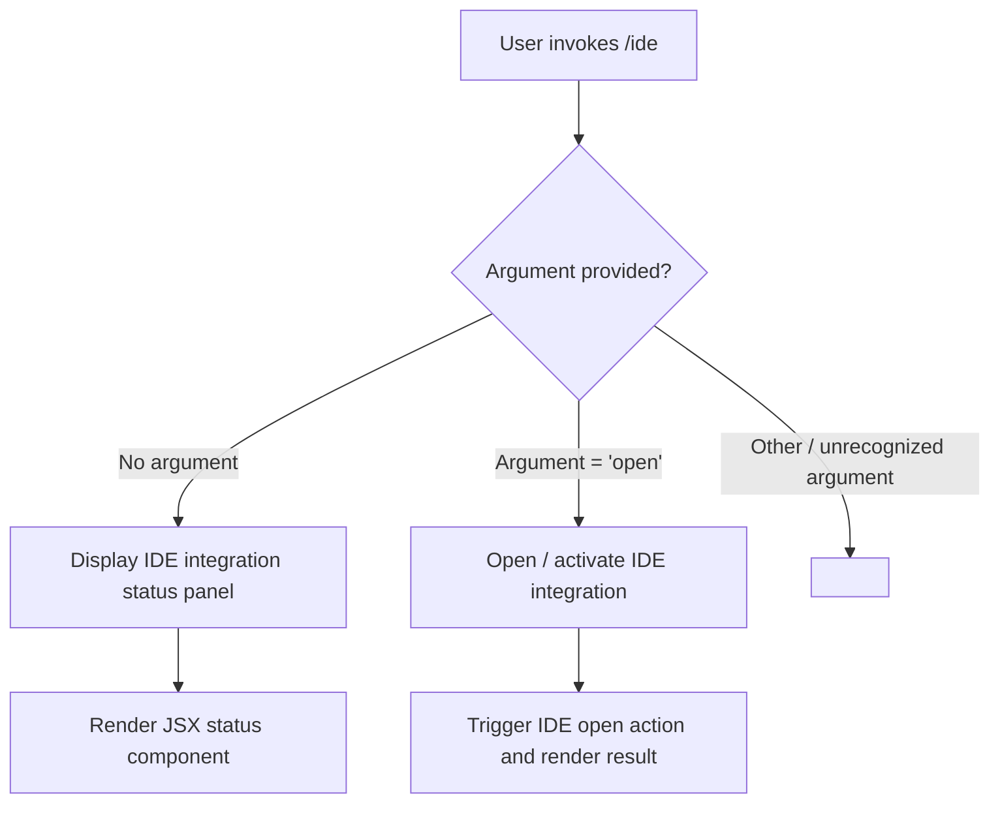

# `/ide`

> Analysis basis: CC v2.1.144 bundle.js (AST extraction + Claude interpretation)
> Minimum version: v2.1.144

---

## Overview

The `/ide` slash command provides an interface for managing IDE integrations within Claude Code and displaying their current connection status. It accepts an optional `open` argument, suggesting it can either display status information or actively open an IDE integration panel. The command is implemented as a local JSX component (module `FMq`), meaning its output is rendered as interactive UI rather than plain text.

---

## Registration

| Field | Value |
|---|---|
| type | `local-jsx` |
| name | `ide` |
| description | `Manage IDE integrations and show status` |
| argumentHint | `[open]` |
| module_id | `FMq` |

Analysis basis: CC v2.1.144 bundle.js:+10658904

---

## Input Branching

The `argumentHint` value `[open]` indicates the command accepts one optional positional argument. Based on the registration data, the branching logic follows this structure:



> **Note:** The precise branching implementation is not resolvable from the available AST data because the entry function for module `FMq` was not located during traversal. The flowchart above is derived from the registered `argumentHint` value and command description only.

Analysis basis: CC v2.1.144 bundle.js:+10658904

---

## Behavioral Spec

### Status Display

When invoked without arguments, the command renders a JSX component that reports the current state of all IDE integrations known to Claude Code (e.g., VS Code, JetBrains). The rendered component is "local-jsx" typed, meaning it is displayed inline within the Claude Code terminal UI as a rich component rather than streamed text.

```
function renderIdeStatus():
    integrations = fetchKnownIdeIntegrations()
    for each integration in integrations:
        status = queryConnectionStatus(integration)
        append statusRow(integration.name, status) to output
    return renderJSXPanel(output)
```

Analysis basis: CC v2.1.144 bundle.js:+10658904

### Open Action

When invoked with the `open` argument, the command attempts to open or activate an IDE integration. The exact target IDE and mechanism (e.g., launching a connection, opening a settings panel) are <!-- TODO: not found in depth-2 traversal; needs --depth 4 -->.

```
function handleOpenArgument(arg):
    if arg == "open":
        triggerIdeOpen()
        return renderJSXPanel(openConfirmationOrStatus())
    else:
        // fallback behavior unknown
        return <!-- TODO: not found in depth-2 traversal; needs --depth 4 -->
```

Analysis basis: CC v2.1.144 bundle.js:+10658904

---

## State & Side Effects

| Item | Detail |
|---|---|
| Telemetry | <!-- TODO: not found in depth-2 traversal; needs --depth 4 --> — no `tengu_*` events found in depth-2 traversal |
| Hook registration | <!-- TODO: not found in depth-2 traversal; needs --depth 4 --> |
| appState changes | <!-- TODO: not found in depth-2 traversal; needs --depth 4 --> |
| Sound | <!-- TODO: not found in depth-2 traversal; needs --depth 4 --> |
| Render type | Produces a `local-jsx` rendered component inline in the CLI UI |

---

## Version History

| Version | Change |
|---|---|
| v2.1.144 | Initial analysis — command registered as `local-jsx`, module `FMq`, with `[open]` argument hint |

---

## Common Mistakes

1. **Passing an unrecognized argument**: The only documented optional argument is `open`. Passing any other value may produce an unhandled path, since no error-handling literals were found in the depth-2 traversal.
2. **Expecting plain-text output**: Because the command type is `local-jsx`, its output is a rendered UI component. Scripting or piping the output as plain text may not behave as expected.
3. **Assuming the command manages file editing directly**: The description states "Manage IDE integrations and show status" — the command operates on the IDE connection layer, not on individual files or editing sessions.
4. **Running in an environment without IDE integration support**: If no IDE integration is configured or active, the status panel may show an empty or disconnected state; behavior in this case is <!-- TODO: not found in depth-2 traversal; needs --depth 4 -->.

---

## Appendix — Identifier Mapping

> For bundle debugging only. Identifiers change across versions.

| Identifier | Role |
|---|---|
| `FMq` | Module ID for the `/ide` command's JSX implementation (not an obfuscated function name, but noted here for bundle cross-reference) |

> **Note:** No obfuscated function identifiers were returned by the depth-2 AST traversal for module `FMq`. The call graph, literals, telemetry, and identifiers arrays are all empty, indicating that the entry point function for this module was not resolved during extraction. A deeper traversal (`--depth 4` or higher) targeting module `FMq` directly is required to produce a complete identifier mapping.