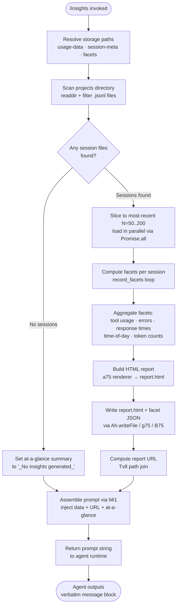

# `/insights`

> Analysis basis: CC v2.1.150 bundle.js (AST extraction + Claude interpretation)
> Minimum version: v2.1.150

---

## Overview

`/insights` generates a shareable HTML usage-analytics report by scanning the user's local Claude Code session data (JSONL transcript files in the projects directory), computing multi-dimensional facets (tool usage, response times, time-of-day patterns, error rates, etc.), writes the resulting `report.html` and supporting facet files to disk, then instructs the agent to deliver a fixed confirmation message verbatim. The command's handler is an inline `getPromptForCommand` method on the registration object; all data assembly and file I/O happen before the prompt is sent to the model.

---

## Registration

| Field | Value |
|---|---|
| type | `prompt` |
| name | `insights` |
| description | `Generate a report analyzing your Claude Code sessions` |
| loc_byte | `12738736` |
| loc_byte_end | `12740040` |
| loc_line | `11654` |
| handler_method | `getPromptForCommand` |
| handler_method_start | `12738910` |
| handler_method_end | `12740039` |
| prompt_body.length | `513` characters |
| prompt_body.trace | `call→Mi1(...) (1 literals)` |
| arbor_handler.name | `getPromptForCommand` |
| arbor_handler.fqn | `claude-2.1.150::getPromptForCommand` |
| arbor_handler.kind | `Method` |
| arbor_handler.resolution_path | `direct` |
| arbor_handler.n_hits | `1` |

Analysis basis: CC v2.1.150 bundle.js:+12738736

---

## Input Branching

The command has more than three distinct execution paths (session discovery → facet assembly → report existence check → HTML write → prompt construction), so a flowchart is used.



Analysis basis: CC v2.1.150 bundle.js:+12738916 (handler entry), +12725779 (session scan), +12739942 (Mi1 call)

---

## Behavioral Spec

### 1. Handler Entry — `getPromptForCommand`

The registration object's `getPromptForCommand` method is the sole entry point. Arbor resolved it as a direct `Method` symbol at `claude-2.1.150::getPromptForCommand` (n_hits = 1).

```
async function getPromptForCommand(context):
    sessionList  = await discoverSessions(context)        // Li1
    reportPaths  = buildReportPaths(context)              // Tv8
    promptString = assemblePrompt(sessionList, reportPaths)  // Mi1 → CH
    return { type: "prompt", content: promptString }
```

Analysis basis: CC v2.1.150 bundle.js:+12738916

---

### 2. Session Discovery — `sessionScanner` (Li1 → t75)

Locates candidate JSONL transcript files under the `projects` subdirectory of the usage-data store.

```
async function sessionScanner(storageRoot):
    projectsDir = pathJoin(storageRoot, "projects")   // Xd + "projects" literal
    entries     = await fs.readdir(projectsDir)
    dirs        = entries.filter(e => e.isDirectory())

    allFiles = []
    for dir in dirs:
        jsonlFiles = await listJsonlFiles(dir)         // k66 — filters ".jsonl" extension
        allFiles.push(...jsonlFiles)

    // Batch in groups of 10, yield via setImmediate every 9 items
    // to avoid blocking the event loop
    allFiles.sort(byMtime descending)                  // q.sort
    return allFiles
```

Key constants:
- Directory filter token: `"projects"` (bundle.js:+6508181)
- File extension filter: `".jsonl"` (bundle.js:+12808410)
- Batch size upper bound: `10` items before `setImmediate` yield (bundle.js:+12725656), skip stride `9` (bundle.js:+12725661)
- Session slice window: minimum `50`, maximum `200` most-recent sessions loaded for analysis (bundle.js:+12725798, +12725803)

Analysis basis: CC v2.1.150 bundle.js:+12725779

---

### 3. Per-Session Facet Extraction — `facetExtractor` (k66 + `record_facets` loop)

For each JSONL file, reads stat metadata and parses records to extract structured facets.

```
async function facetExtractor(sessionPath):
    stat    = await fs.stat(sessionPath)
    records = await fs.readdir(sessionPath)   // A7.readdir
    files   = records.filter(e => e.isFile() AND matchesJsonl(e))   // kr regex test

    for file in files:
        basename = path.basename(file)        // zj.basename
        data     = await parseJsonlRecords(file)
        facets   = normalizeFacet(data)       // N — includes toUpperCase, trim, cI, HbH, $VK
        results.push({ basename, facets, stat })

    statResults = await Promise.all(results.map(r => fs.stat(r.path)))
    _.set(accumulator, statResults)
    return accumulator
```

Analysis basis: CC v2.1.150 bundle.js:+12725564 (k66 call), +12808304 (k66 body)

---

### 4. Facet Normalization — `normalizeFacetRecord` (N)

Normalizes raw JSONL message records into canonical facet entries used by the report renderer.

```
function normalizeFacetRecord(record):
    level = h96(record)                     // severity/log-level check
    if LVK(record):
        return null                         // skip non-qualifying records
    if record includes known categories (H.includes):
        CH(record)                          // serialize via JSON.stringify path
    normalized = record.toUpperCase()       // field canonicalization
    trimmed    = X4(H.trim(normalized))
    result     = cI(trimmed)
    result     = HbH(result)
    result     = $VK(result)
    return result
```

Log-level constant: `"debug"` (bundle.js:+202680) — debug-level records are filtered out.

Analysis basis: CC v2.1.150 bundle.js:+202704

---

### 5. `_i1` — Per-Message Facet Classifier

Classifies individual transcript messages into tool-use categories and outcome buckets used by the HTML report sections.

```
function classifyMessage(msg):
    if Array.isArray(msg.content):
        for block in msg.content:
            if block.startsWith("WebSearch"):   // "WebSearch" literal +12665424
                recordWebSearch(block)
            elif block.startsWith("WebFetch"):  // "WebFetch" literal +12665448
                recordWebFetch(block)
            elif iv6(block):
                category = R75(block)           // extname-based file type
            elif block includes "Edit":         // "Edit" +12665555
                classifyEdit(block)
            elif block includes "Write":        // "Write" +12665567
                classifyWrite(block)
            if block includes "git commit":     // +12665811
                recordGit("commit")
            if block includes "git push":       // +12665843
                recordGit("push")

    // Outcome classification
    if msg includes "exit code":               // +12666427
        outcome = "Command Failed"             // +12666442
    elif msg includes "rejected" OR "doesn't want":
        outcome = "User Rejected"              // +12666520
    elif msg includes "string to replace not found" OR "no changes":
        outcome = "Edit Failed"                // +12666614
    elif msg includes "modified since read":
        outcome = "File Changed"               // +12666672
    elif msg includes "exceeds maximum" OR "too large":
        outcome = "File Too Large"             // +12666752
    elif msg includes "file not found" OR "does not exist":
        outcome = "File Not Found"             // +12666838
    elif msg includes "[Request interrupted by user":
        outcome = "Interrupted"                // +12666912

    // Time bucketing (hours field)
    hourOfDay = msg.getHours()
    sessionAge = msg.getTime()

    // Session-hour constant: 3600 seconds +12666228
    return { category, outcome, hourOfDay, sessionAge }
```

Analysis basis: CC v2.1.150 bundle.js:+12665265

---

### 6. Report Aggregation — `aggregateInsights` (Ki1 + `qi1`)

Rolls individual message facets into report-level statistics.

```
function aggregateInsights(facetList):
    toolCounts    = {}
    errorCounts   = {}
    responseTimes = []
    hourBuckets   = { "Morning (6-12)": 0, "Afternoon (12-18)": 0,
                      "Evening (18-24)": 0, "Night (0-6)": 0 }

    for facet in facetList:
        toolCounts[facet.category]++
        if facet.outcome != "none":               // "none" literal +12676135
            errorCounts[facet.outcome]++
        responseTimes.push(facet.duration)

    // Percentile computation via qi1
    sortedTimes = responseTimes.sort(ascending)
    p50 = sortedTimes[floor(len * 0.5)]
    p95 = sortedTimes[floor(len * 0.95)]

    // Session idle-cutoff: 1800000 ms (30 min) +12673204

    // Top-N sorting via q.sort + q.at + Math.floor
    topTools = sortedBy(toolCounts, descending).slice(0, N)

    return { toolCounts, errorCounts, responseTimes, hourBuckets,
             p50, p95, topTools }
```

Analysis basis: CC v2.1.150 bundle.js:+12674567 (Ki1), +12673012 (qi1)

---

### 7. HTML Report Renderer — `buildHtmlReport` (a75)

Generates the self-contained `report.html` file from aggregated facets.

```
function buildHtmlReport(aggregated):
    sections = []

    // Tool-usage section
    toolRows = aggregated.toolCounts
                .map(formatToolRow)              // D5H — uses "Add to CLAUDE.md" CTA +12687293
    sections.push(toolSection(toolRows))

    // Response-time histogram
    // Buckets: "2-10s", "10-30s", "30s-1m", "1-2m", "2-5m", "5-15m", ">15m"
    // (literals +12681949–+12682009)
    // 120s threshold +12682169, 900s threshold +12682251
    rtHistogram = buildHistogram(aggregated.responseTimes, buckets)

    // Time-of-day chart
    todChart = buildTodChart(aggregated.hourBuckets)
    // Morning 6-12 (+12682797), Afternoon 12-18 (+12682844),
    // Evening 18-24 (+12682898), Night 0-6 (+12682950)

    // Error section — colors: #dc2626 error +12723330, #16a34a ok +12723579,
    //                          #eab308 warn +12724072
    errorSection = buildErrorSection(aggregated.errorCounts)
    // Empty state: "<p class=\"empty\">No tool errors</p>" +12723341

    // Chart palette: #2563eb +12719614, #0891b2 +12719752,
    //               #10b981 +12719924, #8b5cf6 +12720067
    palette = ["#2563eb", "#0891b2", "#10b981", "#8b5cf6"]

    // HTML escaping via _5 / J5
    // Bold markdown: "<strong>$1</strong>" +12683655
    // Bullet: "• " +12683698, line-break: "<br>" +12683728

    html = assembleFullDocument(sections, rtHistogram, todChart, errorSection)
    // Max HTML token budget: 8192 characters +12681118

    return html
```

Output filename: `"report.html"` (bundle.js:+12728036)

Analysis basis: CC v2.1.150 bundle.js:+12683583 (a75 entry), +12719592 (D5H), +12720284 (i75)

---

### 8. File Write Pipeline — `writeReportFiles` (g75 + B75)

Persists the generated report and facet data to disk.

```
async function writeReportFiles(reportHtml, facetData, paths):
    await fs.mkdir(paths.facetsDir, { recursive: true })  // g75: Ah.mkdir
    reportPath = pathJoin(paths.base, "report.html")
    await fs.writeFile(reportPath, reportHtml, "utf-8")   // "utf-8" +12670862

    // Also write per-facet JSON via B75
    facetPath = pathJoin(paths.base, paths.facetsSubdir)
    await fs.mkdir(facetPath, { recursive: true })
    await fs.writeFile(facetPath, CH(facetData))          // CH = JSON.stringify

    // Error path defers to RH (logged, not thrown)
```

Analysis basis: CC v2.1.150 bundle.js:+12671379 (g75), +12670622 (B75), +12671460 (writeFile)

---

### 9. Path Resolution — `resolveStoragePaths` (rv6 + Tv8 + at_)

Builds all filesystem paths needed by the command.

```
function resolveStoragePaths(context):
    usageDataDir  = pathJoin(baseDir, "usage-data")     // "usage-data" +12664731
    sessionMetaDir = pathJoin(baseDir, "session-meta")  // "session-meta" +12664827
    facetsDir      = pathJoin(baseDir, "facets")        // "facets" +12664781
    return { usageDataDir, sessionMetaDir, facetsDir }
```

Analysis basis: CC v2.1.150 bundle.js:+12664718 (rv6), +12664767 (Tv8), +12664813 (at_)

---

### 10. Prompt Assembly — `assembleInsightsPrompt` (Mi1 via `__handler_insights`)

Constructs the 513-character prompt that is returned to the agent runtime.

```
function assembleInsightsPrompt(insightsData, reportUrl, htmlFile,
                                 facetsDir, atAGlance):
    // Template injects:
    //   - full serialized insights data (CH = JSON.stringify)
    //   - report URL (Tv8-computed path)
    //   - HTML file path
    //   - facets directory path
    //   - at-a-glance summary string (or "_No insights generated_" +12739807)
    //
    // Separator literal: " · " +12739368
    // Math.round used for numeric metric formatting +12739297
    //
    // Closes with a <message> block instructing the agent to output
    // a verbatim "Your shareable insights report is ready: ..."
    // followed by "Want to dig into any section or try one of the suggestions?"
    //
    // Agent MUST NOT omit any line from the <message> block.

    prompt = Mi1(insightsData, reportUrl, htmlFile, facetsDir, atAGlance)
    return CH(prompt)   // final serialization pass
```

Prompt length: 513 characters (bundle.js:+12738910).
Fallback summary value when no sessions found: `"_No insights generated_"` (bundle.js:+12739807).

Analysis basis: CC v2.1.150 bundle.js:+12739942 (Mi1 call), +12739960 (CH call)

---

### 11. Insights Report Content Generation — `generateInsightsContent` (Q75 + en1 + c75)

Orchestrates the full content-generation pipeline that sits between raw session data and the final HTML blob.

```
async function generateInsightsContent(sessions, context):
    // Identify model used per session via qJH (uses SHA-1 hash, +9920836)
    // Token budget per chunk: 4096 tokens +12672680
    // warmup_minimal mode flag: "warmup_minimal" +12727594

    chunkResults = await Promise.all(
        sessions.map(s => processSessionChunk(s))   // p75 → x75 → tt_
    )

    // Merge chunks; fallback label "None captured" +12678310
    merged = mergeChunkResults(chunkResults)

    // at_a_glance key: "at_a_glance" +12678976
    atAGlance = merged["at_a_glance"] ?? "_No insights generated_"

    htmlContent = buildHtmlReport(merged)           // a75
    return { htmlContent, atAGlance }
```

Analysis basis: CC v2.1.150 bundle.js:+12727316 (Q75), +12676883 (en1), +12677430 (c75)

---

### 12. Transcript Chain Walking — `chainWalker` (C7H + hL5 + IL5)

Resolves parent–child relationships between transcript entries to build ordered conversation chains before facet extraction.

```
function buildChain(transcriptIndex):
    for entry in transcriptIndex.values():
        if chain has cycle:
            // fires tengu_chain_parent_cycle telemetry
            break
        if timestamp fallback needed:
            // fires tengu_chain_timestamp_fallback telemetry

    // Sort chain by timestamp; parallel-transcript recovery:
    //   fires tengu_chain_parallel_tr_recovered telemetry

    return orderedChain
```

Analysis basis: CC v2.1.150 bundle.js:+12776170 (C7H), +12777320 (hL5), +12776791 (IL5)

---

## State & Side Effects

| Item | Detail |
|---|---|
| Telemetry — `tengu_transcript_phantom_parent` | Fired when a transcript entry references a parent UUID that cannot be found in the index (bundle.js:+12794245) |
| Telemetry — `tengu_transcript_parent_cycle` | Fired when a cycle is detected in the parent-UUID chain during transcript walking (bundle.js:+12797808) |
| Telemetry — `tengu_chain_parent_cycle` | Fired inside the chain-builder when a parent-cycle is detected (bundle.js:+12776287) |
| Telemetry — `tengu_chain_timestamp_fallback` | Fired when a chain entry has no reliable timestamp and a fallback is used (bundle.js:+12776436) |
| Telemetry — `tengu_chain_parallel_tr_recovered` | Fired when parallel-transcript ambiguity is resolved during chain sorting (bundle.js:+12778302) |
| Telemetry — `tengu_relink_walk_broken` | Fired when a broken link is encountered during the session relink walk (bundle.js:+12774518) |
| File I/O — `report.html` | Written to the usage-data base directory; filename literal `"report.html"` (bundle.js:+12728036) |
| File I/O — facets directory | Created (recursive mkdir) and populated with per-facet JSON files (bundle.js:+12671379) |
| File I/O — session-meta reads | `A7.readFile` / `Ah.readFile` called per session during facet extraction (bundle.js:+12797327, +12670838) |
| Error logging | Non-fatal I/O errors routed through `RH` → `ll.logError` (bundle.js:+968915) |
| appState changes | None observed in depth-2 traversal |
| Hook registration | None observed in depth-2 traversal |
| Sound | None observed in depth-2 traversal |
| Agent output constraint | Agent is instructed to output the `<message>` block verbatim with no omissions |

---

## Version History

| Version | Change |
|---|---|
| v2.1.150 | Initial analysis |

---

## Common Mistakes

1. **Running `/insights` with no prior sessions**: If no `.jsonl` transcript files exist under the `projects` directory, the at-a-glance summary is set to `"_No insights generated_"` and the report HTML will contain empty-state placeholders (`<p class="empty">No data</p>`). The command still completes without error.
2. **Expecting real-time data**: The command reads already-persisted JSONL files; it does not capture the current in-progress session. Data from the current session may be absent or partial.
3. **Assuming the agent adds commentary**: The prompt explicitly instructs the agent to output only the content inside the `<message>` tags verbatim. Any additional commentary or summarization by the agent would be a model deviation.
4. **Moving or deleting `report.html` between runs**: The command always overwrites `report.html` at the same path; there is no versioned output. The report URL injected into the prompt is computed from the fixed path via `Tv8`.
5. **Conflating `/insights` with live telemetry**: The `tengu_*` events observed in the call graph are fired by lower-level infrastructure (daemon, chain walker, transcript indexer), not by `/insights` itself as a dedicated analytics event.

---

## Appendix — Identifier Mapping

> For bundle debugging only. Identifiers change across versions.

| Identifier | Role |
|---|---|
| `__handler_insights` | Synthetic BFS entry node for the `/insights` command handler |
| `Li1` | Main insights data-assembly orchestrator (session load → facet collection → report write) |
| `t75` | Session file scanner (readdir + isDirectory filter + JSONL enumeration) |
| `Xd` | Path builder for the `projects` subdirectory |
| `k66` | Per-directory JSONL file lister and stat collector |
| `kr` | Regex tester for `.jsonl` extension matching |
| `N` | Facet record normalizer (toUpperCase, trim, field canonicalization) |
| `F75` | Session metadata file reader (reads session-meta JSON via Ah.readFile) |
| `at_` | Path resolver for the `session-meta` storage subdirectory |
| `rv6` | Path resolver for the `usage-data` base directory |
| `Tv8` | Path resolver for the report output location (used to compute report URL) |
| `g6` | JSON.parse wrapper |
| `CH` | JSON.stringify wrapper |
| `Mi1` | Prompt template assembler — injects insights data, paths, and at-a-glance summary |
| `a75` | Full HTML report renderer (tool usage, histograms, time-of-day, error sections) |
| `Ki1` | Facet aggregation engine (counts, percentiles, top-N sorting) |
| `qi1` | Percentile/statistical helper for response-time distribution |
| `Q75` | Top-level insights content generation orchestrator |
| `p75` | Session chunk processor (maps sessions to analysis units) |
| `x75` | Per-chunk message processor feeding `tt_` |
| `tt_` | Chunk-level facet accumulator (Math.round, Array.isArray guard) |
| `_i1` | Per-message classifier (tool categories, outcome labels, time bucketing) |
| `en1` | Per-session report entry generator (calls qJH for model identification) |
| `c75` | Final facet-to-report-content transformer (Promise.all over sessions) |
| `qJH` | Session model identifier (SHA-1 hash, token count, ASH for message extraction) |
| `u28` | Session file hasher and metadata writer (NT6.createHash, LLH.writeFile) |
| `g75` | Report HTML file writer (Ah.mkdir + Ah.writeFile) |
| `B75` | Facet JSON file writer (Ah.mkdir + Ah.writeFile) |
| `U75` | Report data file reader (Ah.readFile + g6 + fi1 + Ah.unlink) |
| `D5H` | Tool-usage table row builder for HTML (includes "Add to CLAUDE.md" CTA) |
| `i75` | Response-time statistics helper (Math.max, Object.values, Object.entries) |
| `r75` | Per-section chart data mapper |
| `o75` | HTML section assembler calling CH |
| `Gv8` | Markdown-to-HTML inline formatter (calls J5) |
| `J5` | HTML entity escaper (delegates to `_5`) |
| `_5` | Core replaceAll-based HTML entity encoder |
| `C7H` | Transcript chain builder (cycle detection, timestamp fallback, parallel recovery) |
| `hL5` | Chain segment sorter and deduplicator |
| `IL5` | Chain entry queue processor (L.shift, K.push, K.sort) |
| `yL5` | Chain NaN-timestamp detector (Number.isNaN guard) |
| `si1` | Chain value setter (H.values → q.push → _.set) |
| `ZaH` | Chain H-map entry mapper |
| `Ge_` | Prompt text preprocessor (replaceAll, A.slice) |
| `RV6` | Content block processor (Array.isArray, i1, L.replace, XR, pi1.test) |
| `Ee_` | Content filter invoking SL5 and RL5 |
| `SL5` | Trim + Array.isArray + some-based content filter |
| `RL5` | Array.isArray + some-based secondary content filter |
| `Cv8` | Cached-value reader/writer (H.get, q.get, q.set, A.push) |
| `bv8` | Array.from(H.values) conversion helper |
| `b8H` | Transcript index manager (coordinates all Map/Set state for session entries) |
| `FL5` | Binary JSONL file parser (Buffer operations, openSync/readSync/closeSync) |
| `gL5` | Lightweight binary file reader (openSync/readSync/closeSync + g6) |
| `BL5` | Secondary binary parser (Buffer.from, H.indexOf, H.compare, H.toString) |
| `xi1` | Transcript relink walker (H.values, K.set, iP, NL5, H.has) |
| `Ev8` | Session state reader (coordinates b8H + si1 + C7H + Ge_ + Ee_) |
| `C75` | Number.isNaN guard for numeric session metadata |
| `R75` | File-extension extractor (RB.extname) |
| `jDH` | Diff utility caller (C$q.diff) |
| `Hi1` | GZ decompressor entry (GZ → Z3 + cf) |
| `GZ` | Decompression wrapper |
| `fi1` | Post-read cleanup helper |
| `vK` | Session validation / version-key checker |
| `ASH` | Assistant-message extractor (jB_, Da1, Error) |
| `EG` | Engagement metric collector |
| `$K` | Filter helper (H.filter) |
| `c_` | Error string coercer (Error + String) |
| `I66` | Object.entries-based field enumerator for facet schema |
| `Cq` | Substring extractor (H.indexOf + H.slice) |
| `st_` | Storage-state helper |
| `RH` | Error logger (c_, mH, G1, xiK, dxH.push, ll.logError) |
| `mH` | String coercion helper (String) |
| `EH` | Error-to-string converter (String) |
| `CL` | MCP error logger (dxH.push, ll.logMCPError) |
| `Ai1` | Session metadata post-processor |
| `k75` | GZ path resolver for session content |
| `iv6` | Content-type detector |

Note: index built via Arbor fallback; some signals (telemetry, literals) may be missing — see arbor-fallback.js.