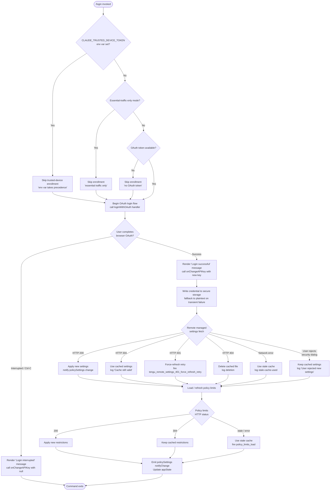

# `/login`

> Analysis basis: CC v2.1.149 bundle.js (AST extraction + Claude interpretation)
> Minimum version: v2.1.149

---

## Overview

The `/login` command initiates an interactive OAuth-based authentication flow that allows the user to switch Anthropic accounts or sign in for the first time. It renders a JSX component that orchestrates credential acquisition, secure storage, policy-limits loading, and remote managed-settings synchronization, then signals the rest of the application that authentication state has changed.

---

## Registration

| Field | Value |
|---|---|
| type | `local-jsx` |
| name | `login` |
| description | `Switch Anthropic accounts \| Sign in with your Anthropic account` |
| loc_byte | `11250748` |
| loc_byte_end | `11250981` |
| loc_line | `9091` |
| module_id | `f_1` |
| load_inline | `true` |
| arbor_handler.name | `LV1` |
| arbor_handler.fqn | `claude-2.1.149::LV1` |
| arbor_handler.kind | `Function` |
| arbor_handler.resolution_path | `direct` |
| arbor_handler.n_hits | `2` |

Analysis basis: CC v2.1.149 bundle.js:+11250748

---

## Input Branching

The command has more than three distinct execution paths (OAuth token present vs. absent, trusted-device enrollment skipped for several independent reasons, remote-settings security dialog accept/reject, policy-limits cache hit/miss/stale), so a Mermaid flowchart is used.



---

## Behavioral Spec

### 1. Handler Entry Point (`LV1` / `NjL` JSX wrapper)

The registration is of type `local-jsx`, meaning the handler returns a React element rather than a plain string. The top-level function (`LV1`, resolved via `arbor_handler` direct path) produces a JSX tree. An outer wrapper component (`NjL`, bundle.js:+8930452) calls `Eo.createElement` and passes control to the inner interactive component (`_J8`).

Analysis basis: CC v2.1.149 bundle.js:+11250748, +8930452, +8930498

### 2. Interactive Login Component (`_J8`)

```
function loginInteractiveComponent(props):
    appState = props.getAppState()
    setAppState = props.setAppState

    // Subscribe to external store via React hooks
    storeState = useExternalStore(storeSelector)

    // Step 1 — Initiate OAuth
    result = await oauthLoginFlow()          // yY6

    if result.interrupted:
        display("Login interrupted")          // literal bundle.js:+8930530
        onChangeAPIKey(null)                  // _J8 → H.onChangeAPIKey :+8930103
        return

    // Step 2 — Apply new API key
    applyMessageOp(result.apiKey)            // _J8 → H.applyMessageOp :+8930122
    onChangeAPIKey(result.apiKey)

    // Step 3 — Persist credential
    writeCredentialToSecureStorage(result.apiKey)   // secureStorageWrite :+2218173

    // Step 4 — Refresh remote managed settings
    await refreshRemoteManagedSettings()     // vnH :+8930184

    // Step 5 — Refresh policy limits
    await refreshPolicyLimits()              // via JnH :+8930220

    setAppState(updatedState)               // H.setAppState :+8930364
    display("Login successful")             // literal bundle.js:+8930511
```

Analysis basis: CC v2.1.149 bundle.js:+8930103, +8930122, +8930184, +8930220, +8930268, +8930364

### 3. OAuth Login Flow (`oauthLoginFlow` / `yY6`)

```
function oauthLoginFlow():
    // Clean up any previous auth file
    unlinkPreviousAuthFile()               // kY6.unlink :+4685979

    // Start browser-based OAuth
    oauthProcess = startOAuthProcess()     // Aq8 :+4686010

    // Poll for completion
    pollResult = await pollForCompletion(oauthProcess)   // U8q :+4685838

    if pollResult.timedOut:
        clearTimeout(timer)               // :+4685890
        return { interrupted: true }

    return { apiKey: pollResult.apiKey }
```

The polling loop (`U8q`) uses `setInterval` / `clearInterval` (via `a98` at bundle.js:+4686363) and fires the `policy_limits_poll` telemetry key during background cycling.

Analysis basis: CC v2.1.149 bundle.js:+4685944, +4685979, +4686010, +4685838, +4685890

### 4. Credential Persistence (`secureStorageWrite` / `$L9`)

```
function writeCredentialToSecureStorage(apiKey):
    try:
        primaryResult = await primaryKeychain.write(apiKey)
        if primaryResult.transientSkipFallback:
            telemetry("primary_transient_skip_fallback")   // :+2218271
            return
        telemetry("secure_storage_credentials_write")      // :+2218173
    catch primaryError:
        try:
            plaintextFallback.write(apiKey)
            telemetry("plaintext_fallback_used")           // :+2218420
        catch:
            telemetry("primary_and_fallback_failed")       // :+2218523
```

Analysis basis: CC v2.1.149 bundle.js:+2218173, +2218271, +2218420, +2218523

### 5. Remote Managed Settings Refresh (`refreshRemoteManagedSettings` / `vnH`)

```
function refreshRemoteManagedSettings():
    // Step A — fetch with ETag caching
    response = await fetchRemoteSettings(
        headers: { "If-None-Match": cachedETag,            // :+6686324
                   "User-Agent": userAgentString }         // :+6686298
    )

    if response.status == 304:
        log("Remote settings: Using cached settings (304)")  // :+6686478
        return cachedSettings

    if response.status == 401:
        telemetry("tengu_remote_settings_401_force_refresh_retry")  // :+6687427
        forceRefreshRetry()
        return

    if response.status == 404:
        deleteLocalCacheFile()                             // MNH.unlink :+6689226
        log("Remote settings: Deleted cached file (404 response)")  // :+6689242
        return

    if response.status == 200:
        parsedSettings = validateSettingsStructure(response.body)
        if invalid:
            throw Error("Invalid remote settings format")  // :+6686836

        // Show security dialog if settings differ from cached
        dialogResult = await showManagedSettingsSecurityDialog()
        // Dialog outcomes fire telemetry:
        // tengu_managed_settings_security_dialog_shown    :+6683491
        // tengu_managed_settings_security_dialog_accepted :+6683175
        // tengu_managed_settings_security_dialog_rejected :+6683225

        if dialogResult == "rejected":
            log("Remote settings: User rejected new settings, using cached settings")  // :+6688947
            return cachedSettings

        applySettings(parsedSettings)
        notifyChange("policySettings")                     // BS.notifyChange :+6690146
        log("Remote settings: Applied new settings successfully")  // :+6689077
        return parsedSettings

    if networkError:
        log("Remote settings: Using stale cache after fetch failure")  // :+6688540
        telemetry("remote_managed_settings_fetch_failed")  // :+6688489
        return staleCache
```

Hash of settings computed with SHA-256 (`"sha256"` literal at bundle.js:+6657487) for change detection.

Analysis basis: CC v2.1.149 bundle.js:+6689961, +6689967, +6690003, +6690040, +6690106

### 6. Policy Limits Refresh (`refreshPolicyLimits` / `JnH`)

```
function refreshPolicyLimits():
    // Skip conditions checked first
    if CLAUDE_TRUSTED_DEVICE_TOKEN env var is set:
        log("[trusted-device] env var takes precedence, skipping enrollment")  // :+6651380
        return

    if essentialTrafficOnlyMode:
        log("[trusted-device] Essential traffic only, skipping enrollment")    // :+6651662
        return

    if not oauthTokenPresent:
        log("[trusted-device] No OAuth token, skipping enrollment")            // :+6651775
        return

    await waitForPolicyLimitsToLoad()     // q.waitForPolicyLimitsToLoad :+6651519
    allowed = isPolicyAllowed()           // q.isPolicyAllowed :+6651550

    response = await httpPost(
        url: buildPolicyEndpoint(),
        headers: {
            "Content-Type": "application/json",   // :+6652021
            "anthropic-beta": "oauth"             // :+4682029
        },
        timeout: 10000                            // :+6652064
    )

    if response.status == 201:
        // Success — device enrolled
        telemetry("bridge_trusted_device_enroll")   // :+6652166
        storeDeviceToken(response.body.device_token)

    if response.status == 500:
        // Retry with backoff (hHH: exponential backoff, max 32000 ms)
        scheduleRetry()                             // hHH :+6686008

    if deviceTokenMissing:
        log("[trusted-device] Enrollment response missing device_token field") // :+6652449
        telemetry("missing_token")                  // :+6652550

    telemetry("tengu_policy_limits_fetch")          // :+4684273
```

Exponential back-off parameters: base `0.25`, cap `32000 ms`, jitter via `Math.random` (bundle.js:+10432773).

Analysis basis: CC v2.1.149 bundle.js:+6651117, +6651519, +6651550, +6652166, +4684273

### 7. UI Rendering (`ljH` / `ef` / `LD_`)

The JSX component renders:

- A settings panel header (`"Settings"` literal, bundle.js:+8930749) with a `"confirm:no"` guard (bundle.js:+8930783).
- Keyboard hint showing `"Press "` + key + `" again to exit"` (bundle.js:+8930888, +8930907) mapped to `"Esc"` (bundle.js:+8930994) for cancel.
- A `"Login"` label (bundle.js:+8931436) and a `"permission"` scope indicator (bundle.js:+8931461).
- Final success/failure message drawn from the `"Login successful"` / `"Login interrupted"` literals.

The component memoizes child nodes using React's sentinel value `"react.memo_cache_sentinel"` (bundle.js:+8930709) across cache slots indexed 3–17.

Analysis basis: CC v2.1.149 bundle.js:+8930511, +8930530, +8930749, +8930783, +8930864

### 8. Auto-Mode Gate Notification

After login, if auto mode is newly available or newly blocked, a notification of type `"auto-mode-gate-notification"` (bundle.js:+8929573) is emitted at severity `"warning"` / priority `"high"` (bundle.js:+8929616, +8929635).

Analysis basis: CC v2.1.149 bundle.js:+8929573

---

## State & Side Effects

| Item | Detail |
|---|---|
| Telemetry | `tengu_remote_settings_401_force_refresh_retry` (bundle.js:+6687427) |
| Telemetry | `tengu_feature_bad` (bundle.js:+963479) |
| Telemetry | `tengu_feature_ok` (bundle.js:+963421) |
| Telemetry | `tengu_feature_sad` (bundle.js:+963556) |
| Telemetry | `tengu_managed_settings_security_dialog_shown` (bundle.js:+6683491) |
| Telemetry | `tengu_managed_settings_security_dialog_accepted` (bundle.js:+6683175) |
| Telemetry | `tengu_managed_settings_security_dialog_rejected` (bundle.js:+6683225) |
| Telemetry | `tengu_policy_limits_fetch` (bundle.js:+4684273) |
| Telemetry | `tengu_disable_bypass_permissions_mode` (bundle.js:+10333866) |
| Telemetry | `tengu_auto_mode_config` (bundle.js:+10331893) |
| Telemetry | `tengu_daemon_config_reload` (bundle.js:+15275522) |
| Credential storage | Writes to system keychain; falls back to plaintext file on transient failure |
| Cache files | Reads/writes remote-settings cache; deletes on HTTP 404 response |
| Notify | `BS.notifyChange("policySettings")` fired on successful settings apply (bundle.js:+6690146, +6690478) |
| appState changes | `H.setAppState` called after login completes (bundle.js:+8930364); `H.getAppState` read at start (bundle.js:+8930268) |
| API key propagation | `H.onChangeAPIKey` called with new key on success, `null` on interruption (bundle.js:+8930103) |
| Message ops | `H.applyMessageOp("update")` dispatched with new credential (bundle.js:+8930122, +8930145) |
| Hook registration | `f_.registerHandler` registers a scoped `"Global"` handler (bundle.js:+3995313, +3995209) |
| Background polling | `setInterval` / `clearInterval` used for OAuth completion polling and remote-settings background refresh |
| Process listeners | `process.off` / `process.removeListener` used during cleanup (`qFH`, bundle.js:+3174244); `"exit"` and `"beforeExit"` events handled (bundle.js:+3174302, +3174959) |
| Sound | <!-- TODO: not found in depth-2 traversal; needs --depth 4 --> |

---

## Version History

| Version | Change |
|---|---|
| v2.1.149 | Initial analysis |

---

## Common Mistakes

1. **Running `/login` when `ANTHROPIC_API_KEY` is already set as an environment variable** — The environment variable (`"ANTHROPIC_API_KEY"` literal, bundle.js:+2933563) takes precedence over stored credentials, so the newly stored OAuth token may be ignored until the env var is unset.
2. **Expecting immediate effect in a `--bare` session** — The `"--bare"` flag (bundle.js:+60321) suppresses some interactive UI elements; the login flow may not render its JSX prompt correctly in bare mode.
3. **Interrupting with Ctrl-C during the browser redirect window** — The handler treats this as a clean interruption and calls `onChangeAPIKey(null)`, which clears any previously cached key from app state for the duration of the session.
4. **Assuming the command works without network access** — Policy-limits and remote managed-settings fetches are both made during login. In essential-traffic-only mode (`"essential-traffic"` literal, bundle.js:+967612) some sub-flows are skipped but others may still require connectivity.
5. **Setting `CLAUDE_CODE_CUSTOM_OAUTH_URL` to an unapproved endpoint** — The runtime validates the URL against an allowlist and throws `"CLAUDE_CODE_CUSTOM_OAUTH_URL is not an approved endpoint."` (bundle.js:+948726), aborting the flow.

---

## Appendix — Identifier Mapping

> For bundle debugging only. Identifiers change across versions.

| Identifier | Role |
|---|---|
| `LV1` | Top-level login command handler (arbor-resolved entry point) |
| `NjL` | Outer JSX wrapper component; calls `Eo.createElement` and mounts `_J8` |
| `_J8` | Interactive login React component; orchestrates all sub-steps |
| `ljH` | Login UI render function; produces the visible prompt/keyboard hint JSX |
| `Kw` | Sub-component factory used inside the login UI |
| `A_1` | Hook-initialisation helper for `Kw`; sets up `useReducer` / `useEffect` |
| `J6` | External-store subscription hook used by the login component |
| `Tz_` | Context accessor; throws if called outside `<AppStateProvider />` |
| `yY6` | OAuth login orchestrator; deletes stale auth file, drives `Aq8` and `U8q` |
| `Aq8` | OAuth process launcher; spawns browser-redirect flow and monitors result |
| `U8q` | OAuth completion poller; uses `setInterval` via `a98` |
| `m8q` | Core OAuth token fetch/exchange logic with retry bookkeeping |
| `bJ_` | Auth-file reader; uses `readFileSync` to load interim token data |
| `_X7` | Token hasher; computes SHA-256 digest via `C8q.createHash` |
| `u8q` | Token applicator; calls `eA` and `e$` to write new credentials |
| `AX7` | Retry scheduler for OAuth fetch; integrates with exponential back-off (`hHH`) |
| `KX7` | Auth-file writer; persists interim token data |
| `fX7` | Polling tick handler; fires `policy_limits_poll` telemetry |
| `vnH` | Remote managed-settings refresh entry; calls fetch pipeline and `JZ_`/`PZ_` |
| `PZ_` | Settings fetch-and-apply pipeline; handles all HTTP status branches |
| `YZq` | Post-auth settings re-sync; triggers refresh after API-key change |
| `rU7` | Background-poll handler for remote settings |
| `JZ_` | Settings-change notifier; calls `BS.notifyChange("policySettings")` |
| `OZq` | HTTP fetch wrapper for remote settings endpoint |
| `lU7` | Remote-settings fetch orchestrator with back-off |
| `hHH` | Exponential back-off calculator (`Math.min`, `Math.pow`, `Math.random`; cap 32000 ms) |
| `r8` | Generic retryable-request wrapper with `setTimeout` / `clearTimeout` |
| `qZq` | Security-dialog manager for new remote settings |
| `AZq` | Security-dialog state holder |
| `pU7` | Pending-dialog queue manager |
| `CEq` | Settings normaliser feeding security dialog |
| `GnH` | Settings-object key enumerator with case normalisation |
| `SL8` | Settings-object key extractor |
| `vEq` | Settings hash comparator using SHA-256 (`"sha256"`, `"hex"`) |
| `sE_` | Recursive settings serialiser |
| `fZq` | Deep-clone helper for settings objects; uses `structuredClone` |
| `nU7` | Atomic settings file writer (open → write → datasync → close) |
| `KZq` | Post-apply settings integrator |
| `IK` | Settings applicator; maps parsed payload onto app state |
| `JnH` | Policy-limits and trusted-device enrollment orchestrator |
| `h9` | OAuth endpoint URL builder; validates `CLAUDE_CODE_CUSTOM_OAUTH_URL` |
| `nE_` | Pre-enrollment state initialiser |
| `Tb` | Trusted-device token writer |
| `Vb9` | Feature-gate checker for trusted-device flow |
| `$L9` | Secure-storage credential writer with plaintext fallback |
| `LGH` | Primary keychain write helper |
| `FK` | Credential-store dispatcher |
| `eTH` | Session cleanup / teardown on login interruption |
| `qFH` | Process-listener cleaner; removes `exit`/`beforeExit` handlers |
| `nM_` | Interval/listener removal helper used by `qFH` |
| `we` | Session-state builder called during teardown |
| `Gb` | Session-object assembler |
| `OS` | Low-level session constructor |
| `rE_` | Auth-change propagation handler |
| `d_` | Module bootstrap helper (`__esModule`, `Ky6.call`, `Ly6.bind`) |
| `yO` | Auth-state updater; calls `RA` |
| `x4H` | Context provider helper for auth state |
| `V6` | Auth-context setter; updates `YOH`, `e36`, `lg` maps |
| `we6` | Feature-map updater; manages `FM_`, `YOH` sets |
| `y06` | App-state watcher; mounts `HJ8` and `KNH` |
| `HJ8` | `lM_`-based boolean feature observer |
| `lM_` | Boolean feature reader using `_$6` / `A$6` / `we` |
| `KNH` | Permission-mode change handler; calls `Vf` |
| `Vf` | Permission-rule applicator; handles `addRules`, `removeRules`, `setMode`, etc. |
| `S_` | `allowed_tools` / `avoid_prompts` / model state synchroniser |
| `v08` | Settings-to-state mapper |
| `h06` | Auto-mode configuration resolver; calls `S06` |
| `S06` | Auto-mode evaluator; checks circuit-breaker, plan, model constraints |
| `je` | Auto-mode gate helper (`je6` → `Vb9`) |
| `Fq` | Model-name normaliser entry point |
| `nq` | Detailed model-string parser (opusplan, sonnet, haiku, opus, best) |
| `QJ` | Model-selector combinator |
| `EBH` | Extended model validator; checks `claude-3-*`, `claude-opus-4-*` etc. |
| `Xq` | Model family classifier |
| `gtH` | Auto-mode-feature resolver via `FC` |
| `FC` | Policy-based feature gate |
| `Y` | Daemon/supervisor config reload handler; fires `tengu_daemon_config_reload` |
| `tXH` | Supervisor message formatter |
| `kc1` | Config-change serialiser |
| `M` | Supervisor connection manager |
| `G` | Remote-control event dispatcher |
| `lKH` | Permission-mode-changed event emitter; fires `permission_mode_changed` |
| `f4` | Audit-event emitter |
| `jLH` | Bulk permission-rule iterator |
| `ng` | Store-subscription setup using `AFH.subscribe` + `queueMicrotask` |
| `Xb9` | Async store-notification helper |
| `CW` | Token/model display formatter |
| `EA` | Token display wrapper |
| `dD` | Token metadata assembler |
| `oC` | Array-inclusion checker for token types |
| `Zt` | Token list renderer |
| `O1` | Individual token item renderer |
| `L$H` | Token-list container |
| `pg` | Token-pagination helper |
| `FpH` | Token-overflow renderer |
| `EE9` | Overflow badge |
| `GZ` | Styled token component |
| `Z3` | Token text wrapper |
| `cf` | Token colour/style resolver |
| `$P` | Token group composer |
| `ZqH` | Token-heading renderer |
| `VqH` | Token-value renderer |
| `cv` | Token sub-group renderer |
| `ef` | Login-form outer container |
| `cr9` | Login-form inner component |
| `LD_` | Login-form state machine (`useState`, `useMemo`, `useCallback`) |
| `VS` | Input-field handler with debounce |
| `f` | Command-registry lookup helper |
| `_X` | Context consumer for login form |
| `mw` | Context accessor for `YzH` |
| `f_` | Global command handler registrar; calls `L.registerHandler` |
| `a9` | Atexit / cleanup registration helper (`W7A.register`) |
| `a98` | Interval manager (`setInterval` / `clearInterval`) |
| `CJ_` | Timeout-cancellation helper |
| `t98` | OAuth response timer / timeout enforcer |
| `cb` | Credential object builder |
| `e98` | Auth-directory path resolver |
| `CH` | JSON serialiser wrapper (`JSON.stringify`) |
| `RA` | Provider-type classifier (`bedrock`, `foundry`, `vertex`, `firstParty`, etc.) |
| `mH` | String coercion utility |
| `p9H` | Path join / file-system utility |
| `RH` | Error-log dispatcher; calls `ll.logError` |
| `c_` | Error-string formatter |
| `G1` | Queue-state inspector |
| `uiK` | Request queue manager (`Hm6.shift`, `Hm6.push`) |
| `N` | Network-request dispatcher |
| `MVK` | HTTP request builder |
| `OVK` | HTTP request executor with size limits (1000 retries, 100 ms base, 1000 ms cap) |
| `QfH` | Cache-invalidation helper (`dy6.clear`, `pS8.clear`) |
| `XtK` | Cache-entry constructor |
| `CY` | Full cache clear |
| `UC` | Response decoder (`esK`, `_tK`) |
| `cX` | Deep-clone via `structuredClone` |
| `uH` | Utility: small async helper |
| `bH` | Utility: conditional branch helper |
| `EH` | String cast for HTTP error codes |
| `K4` | String-to-buffer conversion |
| `HN` | API-key validator |
| `e$` | Credential resolver; handles `ANTHROPIC_API_KEY`, `apiKeyHelper`, `none`, OAuth fallback |
| `TL6` | File-descriptor key reader (`CLAUDE_CODE_API_KEY_FILE_DESCRIPTOR`) |
| `m6` | HTTP request with retry and telemetry |
| `th` | Request slicer (last 20 chars of key for logging) |
| `vBH` | Bearer-token formatter |
| `Np` | Write-permission checker |
| `jv` | Settings-diff helper |
| `Ed` | Settings-application finaliser |
| `K8` | File-locking / atomic-write helper |
| `MOH` | Message-operation dispatcher |
| `q_1` | State-query helper |
| `Rx_` | Route / view switcher |
| `mg_` | Auto-mode metrics collector |
| `ug_` | Auto-mode TA updater |
| `JLH` | Policy-limit threshold formatter |
| `Eh` | Error-display helper |
| `AXK` | Supervisor heartbeat sender (`Je`) |
| `Z` | MCP/supervisor sub-process manager |
| `V` | Background worker manager |