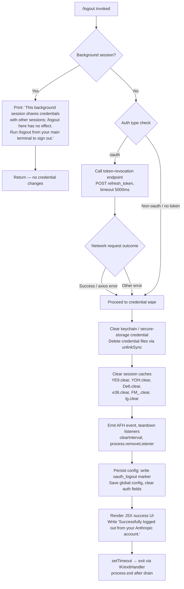

# `/logout`

> Analysis basis: CC v2.1.150 bundle.js (AST extraction + Claude interpretation)
> Minimum version: v2.1.150

---

## Overview

The `/logout` command signs the user out of their Anthropic account by revoking the active OAuth token, clearing all credential stores and session caches, and shutting down background daemon processes. It is guarded against no-op execution in background (non-main-terminal) sessions, where it prints an explanatory message and exits without performing any credential removal.

---

## Registration

| Field | Value |
|---|---|
| type | `local-jsx` |
| name | `logout` |
| description | Sign out from your Anthropic account |
| loc_byte | `11251018` |
| loc_byte_end | `11251206` |
| loc_line | `9091` |
| module_id | `gpq` |
| load_inline | `true` |
| arbor_handler.name | `A9L` |
| arbor_handler.fqn | `claude-2.1.150::A9L` |
| arbor_handler.kind | `AsyncFunction` |
| arbor_handler.resolution_path | `module_id` |
| arbor_handler.n_hits | `0` |

Analysis basis: CC v2.1.150 bundle.js:+11251018

---

## Input Branching

Four distinct execution paths are present, warranting a Mermaid flowchart.



Analysis basis: CC v2.1.150 bundle.js:+7588517 (handler entry `A9L`), +7588627 (background-session guard string), +7588826 (success string), +2046852 (token-revoke event), +7588298 (`oauth_logout` literal)

---

## Behavioral Spec

### 1. Entry point — logout handler (`A9L`)

```
async function logoutHandler(context):
    // Check for background / daemon session
    if sessionType is background:
        renderMessage(
            "This background session shares credentials " +
            "with other sessions; /logout here has no effect. " +
            "Run /logout from your main terminal to sign out."
        )
        return   // no side effects

    // Attempt OAuth token revocation
    authType = resolveAuthType(context)   // bedrock, foundry, anthropicAws,
                                          // mantle, vertex, firstParty, oauth
    if authType == "oauth":
        try:
            await revokeOAuthToken(refreshToken, timeout=5000)
            // fires telemetry label "oauth_token_revoke" (bundle.js:+2046852)
        except AxiosError:
            pass   // network failure is non-fatal; proceed to wipe
        except Error:
            pass

    // Wipe credentials from all stores
    clearAllCredentialStores()

    // Write config with oauth_logout marker
    saveConfigWithLogoutMarker()   // sets "oauth_logout" key (bundle.js:+7588298)

    // Render success UI (JSX)
    renderSuccessMessage("Successfully logged out from your Anthropic account.")
    // bundle.js:+7588826

    // Schedule process exit
    setTimeout(exitHandler, 200)   // bundle.js:+7588889, literal 200 at +7588921
```

Analysis basis: CC v2.1.150 bundle.js:+7588517

---

### 2. Pre-flight setup — initialization wrapper (`DP6`)

`DP6` is the module-level initialisation function called during command wiring. It resolves several subsystem handles used by the handler:

```
function initLogoutModule():
    resolvePromise()                       // bundle.js:+7587569
    initialiseBackgroundSessionCheck()     // Pk_ — bundle.js:+7587599
    attachStringNormaliser()               // A — bundle.js:+7587620
    initialiseDaemonRegistry(bq)           // bundle.js:+7587624
    initialiseCleanupOrchestrator(YP6)     // bundle.js:+7587636
    initialiseAuthTypeResolver(RA)         // bundle.js:+7587656
    initialiseCredentialFileStore(FK)      // bundle.js:+7587683
    attachKeyAccessor(K.readAsync)         // bundle.js:+7587723
    attachTokenRevoker(OH_)                // bundle.js:+7587778
    initialiseSplashRenderer($s)           // bundle.js:+7587858
    initialiseConfigLayer(hL_)             // bundle.js:+7587873
    initialiseOutputHandler(W2H)           // bundle.js:+7587899
    initialiseFilesystem(f8)               // bundle.js:+7587921
    attachCredentialWriter(bH)             // bundle.js:+7588295
```

Analysis basis: CC v2.1.150 bundle.js:+7587569–7588295

---

### 3. OAuth token revocation (`OH_`)

```
async function revokeOAuthToken(refreshToken):
    payload = { grant_type: "refresh_token", token: refreshToken }
    headers = { "Content-Type": "application/json" }
    response = await httpClient.post(
        endpoint = resolveOAuthEndpoint(),
        body     = payload,
        headers  = headers,
        timeout  = 5000               // bundle.js:+2046842
    )
    // Event label used internally: "oauth_token_revoke"  (bundle.js:+2046852)
    if isAxiosError(response):
        categorise(response)           // produces "network", "auth", "timeout" labels
        return                         // non-fatal
    return response
```

Analysis basis: CC v2.1.150 bundle.js:+2046684

---

### 4. Credential store cleanup (`YP6` orchestrator)

`YP6` sequences several independent cleanup helpers:

```
function cleanupAllCredentialStores():
    clearSessionDatabaseEntries(KJ6)      // bundle.js:+7588375
    clearLegacyTokenCache(Ls6)            // bundle.js:+7588381
    clearMemorySessionStore(Ms6)          // YE9.clear — bundle.js:+2927171
    clearMcpRegistrations(MOH)            // bundle.js:+7588393
    clearEventListenersAndTimers(eTH)     // bundle.js:+7588418
    clearKeyringFiles(zZq)                // MNH.unlink — bundle.js:+6688125
    clearLockFiles(pJ_)                   // kY6.unlink — bundle.js:+4686101
```

Analysis basis: CC v2.1.150 bundle.js:+7588375–7588483

---

### 5. Event listener teardown (`eTH` / `qFH`)

```
function teardownEventListeners():
    // Flush pending I/O
    writeCurrentState(we)
    // Remove interval-based heartbeat
    clearInterval(heartbeatId)                         // bundle.js:+3174901
    process.removeListener("beforeExit", handler)      // bundle.js:+3174936
    process.off("exit", handler)                       // bundle.js:+3174244 / +3174302
    // Clear all internal registries
    YOH.clear()    // bundle.js:+3174363
    De6.clear()    // bundle.js:+3174375
    e36.clear()    // bundle.js:+3174387
    FM_.clear()    // bundle.js:+3174399
    lg.clear()     // bundle.js:+3174411
    // Signal subsystems
    AFH.emit(shutdownEvent)   // bundle.js:+3174116
```

Analysis basis: CC v2.1.150 bundle.js:+3174094

---

### 6. Keyring / secure-storage deletion (`zZq`)

```
async function deleteKeychainEntry():
    try:
        // Resolve the keychain path via DZq and jZ_/XZA helpers
        keychainPath = buildKeychainPath(DZq, jZ_)    // bundle.js:+6688061–6688067
        await fs.unlink(keychainPath)                  // MNH.unlink — bundle.js:+6688125
    except Error as e:
        log("Failed to delete keychain entry")         // bundle.js:+2058546
```

Analysis basis: CC v2.1.150 bundle.js:+6688061

---

### 7. Config persistence with auth-loss guard (`f8` / `$f_`)

```
function saveConfigWithLogoutMarker():
    acquireFileLock(lockPath)
    // Safety re-read before write
    existingConfig = readConfigFromDisk()
    if existingConfig.hasAuth and cacheHasAuth:
        if reReadConfig.isMissingAuth:
            // Refuse to overwrite; guard against GH#3117
            log("saveConfigWithLock: re-read config is missing auth " +
                "that cache has; refusing to write…")   // bundle.js:+3194037
            emit(tengu_config_auth_loss_prevented)
            return
    // Create dated backup (up to 5 kept)  bundle.js:+3194640
    rotateDatedBackups(backupDir, maxBackups=5)
    // Write atomically using temp file + rename
    writeAtomic(configPath, newConfig, permissions=0o600)  // 384 dec — bundle.js:+3194922
    releaseLock()
```

Telemetry emitted during config save:

- `tengu_config_lock_contention` (bundle.js:+3193710)
- `tengu_config_stale_write` (bundle.js:+3193846)
- `tengu_config_auth_loss_prevented` (bundle.js:+3194189)
- `tengu_config_parse_error` (bundle.js:+3196285)

Analysis basis: CC v2.1.150 bundle.js:+3190712

---

### 8. Exit sequencing (`IK` / `_q`)

```
function scheduleExit():
    setTimeout(exitHandler, 200)    // bundle.js:+7588889, literal +7588921

async function exitHandler():
    // Unmount React/Ink tree
    unmountUI(TvH)                  // bundle.js:+5283795
    // Write final output line
    writeSync(XDH, finalOutput)     // bundle.js:+5284187
    // Drain stdout writer
    drainWriter(kCH / W7A.drain)    // bundle.js:+58315
    // Race: graceful exit vs timeout
    await Promise.race([
        gracefulShutdown(),
        timeout(2000)               // bundle.js:+5286145
    ])
    process.exit(0)                 // bundle.js:+5284395
```

Analysis basis: CC v2.1.150 bundle.js:+7588889

---

## State & Side Effects

| Item | Detail |
|---|---|
| Telemetry | `tengu_feature_ok` (+963421), `tengu_feature_sad` (+963556), `tengu_feature_bad` (+963479), `tengu_config_lock_contention` (+3193710), `tengu_config_stale_write` (+3193846), `tengu_config_parse_error` (+3196285), `tengu_config_auth_loss_prevented` (+3194189), `tengu_daemon_config_reload` (+15275657), `tengu_startup_perf` (+212856), `tengu_scroll_summary` (+5285263), `tengu_pewter_brook` (+3360499), `tengu_cache_eviction_hint` (+5286296) |
| OAuth revocation | HTTP POST to Anthropic OAuth endpoint with `refresh_token` grant; timeout 5 000 ms (+2046842); internal label `oauth_token_revoke` (+2046852) |
| Credential file removal | `fs.unlinkSync` on keychain file (+15239542); `MNH.unlink` on keyring entry (+6688125); `kY6.unlink` on lock file (+4686101) |
| In-memory caches cleared | `YE9.clear` (+2927171), `YOH.clear` (+3174363), `De6.clear` (+3174375), `e36.clear` (+3174387), `FM_.clear` (+3174399), `lg.clear` (+3174411) |
| Config file written | `oauth_logout` marker persisted to `~/.claude.json`; atomic write with permissions `0o600` (decimal 384, +3194922); up to 5 dated backups kept (+3194640) |
| Process event listeners removed | `clearInterval` (+3174901); `process.removeListener("beforeExit", …)` (+3174936); `process.off("exit", …)` (+3174244) |
| UI | JSX component rendered via `Wk_.createElement` (+7588801); success string emitted (+7588826); UI unmounted before exit via `H.unmount` (+5283795) |
| Process exit | `process.exit` called after 200 ms delay (+7588921) and stdout drain; SIGKILL fallback string present (+5284445) |
| Background-session guard | If running in a background/daemon session the command prints an advisory message and returns without any side effects (+7588627) |
| Auth types recognised | `bedrock`, `foundry`, `anthropicAws`, `mantle`, `vertex`, `firstParty`, `oauth` (+2035544–2035761) |

---

## Version History

| Version | Change |
|---|---|
| v2.1.150 | Initial analysis |

---

## Common Mistakes

1. **Running `/logout` inside a background or `--bg` session** — the command explicitly detects this case and prints an advisory message without revoking tokens or clearing credentials. Always run `/logout` from the primary interactive terminal.
2. **Expecting immediate credential invalidation on network error** — if the OAuth revocation POST fails (network timeout, `ECONNREFUSED`, etc.) the logout still proceeds locally. The remote token is not guaranteed to be invalidated; users should also revoke tokens from the Anthropic console if required.
3. **Interrupting the process during the atomic config write** — the implementation guards against auth loss (GH #3117) but an abrupt `SIGKILL` between the temp-file write and the `rename` could leave the config in a backup state. Allow the 200 ms exit timer to complete naturally.
4. **Assuming the command works under non-OAuth auth types** — for `bedrock`, `vertex`, `foundry`, `anthropicAws`, and `mantle` providers no OAuth token revocation is attempted; only local credential files and caches are cleared.
5. **Re-running Claude Code immediately after `/logout`** — the exit timer fires after 200 ms and drains stdout; starting a new session before the process has fully exited may hit lock-file contention (`tengu_config_lock_contention`).

---

## Appendix — Identifier Mapping

> For bundle debugging only. Identifiers change across versions.

| Identifier | Role |
|---|---|
| `A9L` | Main logout handler (AsyncFunction); Arbor-resolved entry point |
| `DP6` | Module initialisation / subsystem wiring function |
| `YP6` | Credential-store cleanup orchestrator |
| `OH_` | OAuth token revocation HTTP caller |
| `bq` | Daemon/background-session registry helper |
| `f$H` | Background session type detector |
| `KJ6` | Session database entry clearer |
| `Ls6` | Legacy token cache clearer |
| `Ms6` | In-memory session store clearer (calls `YE9.clear`) |
| `MOH` | MCP registration clearer |
| `eTH` | Event-listener and timer teardown coordinator |
| `we` | State flush / current-state writer |
| `mH` | String utility / formatter |
| `Gb` | OS-level helper |
| `qFH` | Detailed event-listener removal (clears YOH, De6, e36, FM_, lg) |
| `nM_` | Interval and `beforeExit` listener remover |
| `RH` | Error handler / logger for teardown path |
| `c_` | Error construction utility |
| `G1` | Essential-traffic queue helper |
| `xiK` | Queue shift/push manager |
| `zZq` | Keychain / keyring file deletion coordinator |
| `DZq` | Keychain path resolver (part 1) |
| `jZ_` | Keychain path resolver (part 2) |
| `XZA` | Keychain path builder |
| `p9H` | Path utility used by keychain helpers |
| `V46` | Keychain path joiner |
| `pJ_` | Lock-file removal coordinator |
| `CJ_` | Lock-file timeout clearer |
| `UJ_` | Lock-file inner cleanup |
| `e98` | Lock-file path builder |
| `RA` | Auth-type resolver (bedrock, foundry, oauth, etc.) |
| `FK` | Credential file-store initialiser |
| `$L9` | Secure storage read/write/delete coordinator |
| `H` | Primary storage handle (read, readAsync, update, delete) |
| `_` | Secondary storage handle |
| `LGH` | Storage migration / upgrade helper |
| `Lk4` | Storage context runner / async-local-storage manager |
| `bH` | Credential writer helper |
| `_8` | Credential update helper |
| `uH` | Credential delete helper |
| `c` | Low-level telemetry emitter (`tengu_feature_ok/bad/sad`) |
| `K` | Key-store async reader / padEnd formatter |
| `h9` | OAuth endpoint URL builder |
| `jPA` | Production OAuth base URL resolver |
| `NnK` | Staging/local OAuth URL resolver |
| `N` | HTTP response / error categoriser |
| `LVK` | HTTP error classifier |
| `T7A` | Error-code to category mapper |
| `CH` | JSON.stringify wrapper |
| `X4` | Log-safe redaction helper (produces `[REDACTED]`) |
| `s5A` | Header map transformer |
| `HbH` | Output write helper |
| `B5A` | Low-level stdout write |
| `$VK` | File-based log writer (with rotation and mkdir) |
| `ICH` | Log batching / debounce flusher |
| `q9H` | Log file path builder |
| `Q6` | File existence / stat helper |
| `G96` | File error handler (EISDIR) |
| `LMA` | Log directory path joiner |
| `KMA` | Atomic log-file rename helper |
| `fVK` | Append-to-log-file with rotation |
| `a9` | Log writer registration |
| `$s` | Splash / loading renderer |
| `hL_` | Config layer initialiser |
| `TE9` | Config access coordinator |
| `y69` | Config path / hash builder |
| `Qv` | Config NFC-normalised path + SHA-256 hasher |
| `sX` | Config watcher helper |
| `PZ` | Unix user-info resolver |
| `EH` | String coercion helper |
| `f8` | Global config save with auth-loss guard |
| `$f_` | Config save-with-lock (atomic write, backup rotation) |
| `_L9` | Object-assign config merger |
| `K8` | File-write error handler |
| `JOH` | Config file reader (with backup/restore logic) |
| `f$6` | Config field accessor |
| `Of_` | Backup directory path builder |
| `UK6` | Atomic temp-file writer with permissions and fsync |
| `OFH` | Config write observer |
| `ub9` | Object.entries config iterator |
| `zFH` | Config write timestamp recorder |
| `ff_` | Config file writer via `UK6` |
| `$__` | Config subsystem shutdown hook |
| `W2H` | Output / render handler |
| `LcH` | Post-logout UI render coordinator |
| `ZW` | UI string formatter |
| `f4` | Event emitter for logout completion (`A.emit`) |
| `CR8` | Render context builder |
| `SVH` | OTEL metrics / telemetry attribute builder |
| `$p` | Session-ID / random-bytes generator |
| `S6` | Metric emitter |
| `pP_` | Metric prefix helper |
| `R5` | Sub-metric recorder |
| `dqq` | Metric aggregation helpers (`sW7`, `aW7`) |
| `w18` | OTEL resource attribute freezer |
| `ZA6` | Post-render cleanup |
| `IK` | Exit handler wrapper |
| `_q` | Core exit sequencer (unmount, drain, race, `process.exit`) |
| `TvH` | UI unmount + final writeSync |
| `wS` | Terminal restore helper |
| `l68` | ANSI escape / terminal state restorer |
| `o0_` | Final output line writer (dim text, replaceAll) |
| `jv` | Output stream reference |
| `jC` | Output encoding helper |
| `Aj6` | Working-directory stat checker |
| `gO` | Session path helper |
| `e$q` | Output escape helper |
| `a0_` | Hard-exit fallback (`process.exit` / `process.kill SIGKILL`) |
| `kCH` | Stdout drain trigger (`W7A.drain`) |
| `Y` | Supervisor / daemon manager (stop/start/updateConfig) |
| `tXH` | Supervisor config writer |
| `Ic1` | Supervisor layout calculator |
| `G` | Remote-control input handler |
| `_XK` | Heartbeat scheduler |
| `u96` | Startup-perf telemetry flush |
| `Cx8` | Startup mark recorder |
| `EMA` | Startup profiling report writer |
| `X48` | Scroll-summary telemetry builder |
| `t$q` | Scroll context accessor |
| `s$q` | Scroll stats calculator |
| `Y9` | Local-agent render environment detector |
| `t_6` | Cache-eviction hint emitter |
| `P48` | Promise-based shutdown race helper |
| `r8` | Abort-signal / timeout utility |

---

Note: index built via Arbor fallback; some signals (telemetry, literals) may be missing — see arbor-fallback.js.