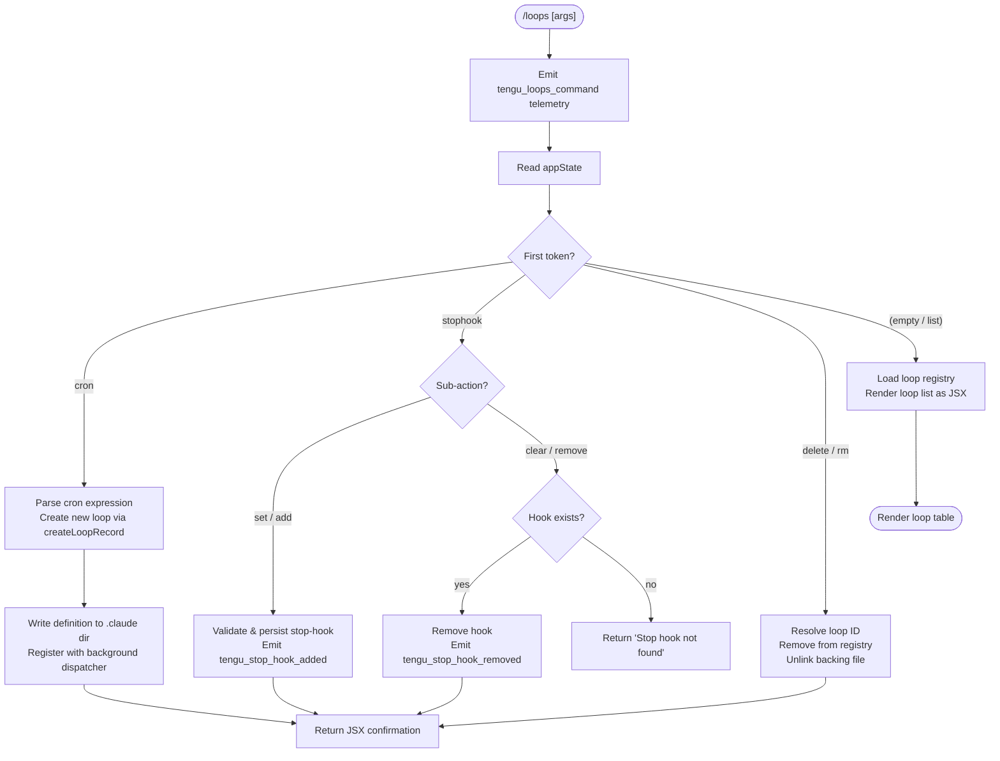

# `/loops`

> Analysis basis: CC v2.1.150 bundle.js (AST extraction + Claude interpretation)
> Minimum version: v2.1.150

---

## Overview

The `/loops` command is the primary management interface for Claude Code's recurring-task system. It allows users to list all active loops and stop-hooks, create new cron-scheduled loops or stop-hooks, and delete existing ones. Internally the command reads and writes loop definitions to the `.claude` configuration directory, dispatches tasks through the background session manager, and registers stop-hooks that fire when a session ends.

---

## Registration

| Field | Value |
|---|---|
| type | `local-jsx` |
| name | `loops` |
| description | List, create, and delete recurring loops and stop-hooks |
| immediate | `true` |
| module_id | `Fm1` |

Analysis basis: CC v2.1.150 bundle.js:+12099551

---

## Input Branching

The top-level dispatcher (`yH5`) reads the first token of the user's input, normalises it to lower-case, and routes to one of four sub-handlers. When the command is invoked with no sub-command, it falls through to the list path.



Analysis basis: CC v2.1.150 bundle.js:+12098506, +12098604, +12098690, +12098950, +12098972

---

## Behavioral Spec

### 1. Command Entry Point and Telemetry Emission

The main command handler is the first function called when `/loops` is invoked. It immediately emits a telemetry event, then reads application state before delegating to sub-handlers.

```
function loopsCommandEntryPoint(input, context):
    emitTelemetry("tengu_loops_command")           // bundle.js:+12098508
    appState = getAppState()
    loopList = loadLoopRegistry(appState)          // calls loopRegistryLoader
    stopHookList = filterStopHooks(loopList)       // calls stopHookFilter
    token = normaliseToken(input.firstWord)        // toLowerCase
    route(token, input, appState, loopList, stopHookList)
```

Analysis basis: CC v2.1.150 bundle.js:+12098506, +12098546, +12098558

---

### 2. Loop Registry Loader

Reads the persisted loop definitions from disk. Files are read with UTF-8 encoding. The result is validated with `Array.isArray` before use.

```
function loadLoopRegistry(appState):
    rawPath = resolveConfigPath(appState)          // reads Q6
    content = readFile(rawPath, "utf-8")           // bundle.js:+4761607, +4761635
    parsed = parseJSON(content)
    if not Array.isArray(parsed):                  // bundle.js:+4761751
        return []
    entries = []
    for item in parsed:
        validated = validateEntry(item)            // calls entryValidator (CH)
        if validated:
            entries.push(validated)
    return entries
```

Analysis basis: CC v2.1.150 bundle.js:+4763595, +4761607, +4761635, +4761751

---

### 3. Cron Expression Parser

Parses human-readable or standard cron strings into a normalised internal schedule object. Supports shorthand labels ("Every minute", "Every hour") as well as numeric fields.

```
function parseCronExpression(raw):
    trimmed = raw.trim()                           // bundle.js:+4759379

    // Minimum interval guard: reject schedules shorter than 5 minutes
    MIN_INTERVAL_MINUTES = 5                       // bundle.js:+4759415

    if trimmed matches "Every minute" pattern:     // bundle.js:+4759499
        return buildSchedule(interval=1)

    minutes = parseInt(extractMinutes(trimmed))    // bundle.js:+4759555
    if minutes < MIN_INTERVAL_MINUTES:
        minutes = MIN_INTERVAL_MINUTES

    // Column width for display rendering
    DISPLAY_COL_WIDTH = 40                         // bundle.js:+15286881
    DISPLAY_PAD_CHAR  = "  "                       // bundle.js:+15284910

    if trimmed matches "Every hour" pattern:       // bundle.js:+4759716
        return buildSchedule(interval=60)

    // Weekly schedule: compute next UTC trigger date
    dayOfWeek = parsed integer in range 0-6
    DAYS_IN_WEEK = 7                               // bundle.js:+4760226
    nextDate = new Date()
    delta = (dayOfWeek - nextDate.getUTCDay() + DAYS_IN_WEEK) % DAYS_IN_WEEK
    nextDate.setUTCDate(nextDate.getUTCDate() + delta)  // bundle.js:+4760275, +4760288
    nextDate.setUTCHours(0, 0, 0, 0)                    // bundle.js:+4760306

    return buildSchedule(next=nextDate, raw=trimmed)
```

Supported interval field bounds observed in cron validation helper:
- Minutes: 0 – 59 (Analysis basis: CC v2.1.150 bundle.js:+12098239, +12098273)
- Hours: 0 – 23 (Analysis basis: CC v2.1.150 bundle.js:+12098344)
- Day-of-month: 1 – 31 (Analysis basis: CC v2.1.150 bundle.js:+12098397)
- Day-of-week range string `"1-5"` is a known literal (Analysis basis: CC v2.1.150 bundle.js:+4760423)

Analysis basis: CC v2.1.150 bundle.js:+4759379, +4759499, +4759555, +4759716, +4760256

---

### 4. Loop Record Creation

Creates a new loop record with a UUID, persists it to the `.claude` configuration directory, and registers it with the background dispatcher.

```
function createLoopRecord(schedule, prompt, appState):
    id       = generateUUID()                      // OAq.randomUUID, bundle.js:+4762935
    created  = Date.now()                          // bundle.js:+4762997
    record   = buildRecord(id, schedule, prompt, created, type="cron")

    // Persist to .claude directory
    configDir = joinPath(".claude", ...)           // bundle.js:+4762776, +4762765
    mkdirSync(configDir, { recursive: true })      // bundle.js:+4762755
    writeFile(joinPath(configDir, id), serialise(record))  // bundle.js:+4762852

    // Register with loop registry (max 8 active loops observed)
    MAX_LOOPS = 8                                  // bundle.js:+4762960
    registry = loadLoopRegistry(appState)
    if registry.length >= MAX_LOOPS:
        return error("Loop limit reached")
    registry.push(record)
    persistRegistry(registry)

    // Register background dispatch
    registerWithDispatcher(record)                 // calls backgroundSessionDispatch

    return record
```

Analysis basis: CC v2.1.150 bundle.js:+12099156, +4762935, +4762997, +4762776, +4762960

---

### 5. Stop-Hook Set Handler

Validates and persists a stop-hook. The stop-hook fires when the session ends (the "Stop" lifecycle event). It stores a `prompt` and `goal` attachment and records the hook with a UUID. Gate checks (`hooks_gate`, `trust_gate`) must pass before the hook is accepted.

```
function setStopHook(rawPrompt, appState):
    // Gate checks
    gateResult = checkGates(["hooks_gate", "trust_gate"])  // bundle.js:+10453796, +10453850
    if gateResult == "Stop":                               // bundle.js:+10453608
        return gateError()

    hookId   = generateUUID()                  // FJ1 -> pJ1.randomUUID, bundle.js:+10454744
    hookObj  = {
        id:      hookId,
        trigger: "Stop",                       // bundle.js:+10453608
        type:    "prompt",                     // bundle.js:+10453715
        prompt:  rawPrompt,
        goal:    extractGoal(rawPrompt),       // kind: "goal", bundle.js:+10454685
    }

    // Append to message stream as attachment
    applyMessageOp(appState, "append", {       // bundle.js:+10454620
        kind: "attachment",                    // bundle.js:+10454726
        goal_status: "goal_set",               // bundle.js:+10453928
    })
    setAppState(appState, hookObj)             // bundle.js:+10454528

    emitTelemetry("tengu_stop_hook_added")     // bundle.js:+10454286
    return "Stop hook set"                     // bundle.js:+12099268
```

Analysis basis: CC v2.1.150 bundle.js:+10453796, +10453850, +10453608, +10454744, +10454286, +12099268

---

### 6. Stop-Hook Clear Handler

Searches the registry for an existing stop-hook and removes it. Returns distinct messages depending on whether the hook was found.

```
function clearStopHook(appState):
    existing = findStopHook(appState)          // calls stopHookFilter
    if existing is null:
        return "Stop hook not found"           // bundle.js:+12098950

    removeHookFromRegistry(existing.id)
    applyMessageOp(appState, "append", { kind: "goal_status" })
    setAppState(appState, cleared=true)

    emitTelemetry("tengu_stop_hook_removed")   // bundle.js:+10454654
    return "Stop hook cleared"                 // bundle.js:+12098972
```

Analysis basis: CC v2.1.150 bundle.js:+12098950, +12098972, +10454654

---

### 7. Loop Delete Handler

Removes a loop by ID from the in-memory registry and unlinks its backing file on disk.

```
function deleteLoop(loopId, appState):
    registry = loadLoopRegistry(appState)
    match = registry.filter(entry => entry.id == loopId)
    if match is empty:
        return error("Loop not found")

    // Remove backing file
    unlinkSync(resolveLoopFilePath(loopId))    // q -> hJK.unlinkSync, bundle.js:+15239542

    updatedRegistry = registry.filter(entry => entry.id != loopId)
    persistRegistry(updatedRegistry)
    return confirmation()
```

Analysis basis: CC v2.1.150 bundle.js:+12098670, +15239542

---

### 8. Loop List / Render Handler

Retrieves all loops and stop-hooks and renders them as a JSX component. The "skip" token is used internally to bypass certain render paths.

```
function renderLoopList(loopList, stopHookList):
    cronLoops  = loopList.filter(entry => entry.type == "cron")
    stopHooks  = loopList.filter(entry => entry.type == "stophook")

    // Build display rows with padded columns (width 40)   // bundle.js:+15286881
    rows = cronLoops.map(loop => formatRow(loop, padWidth=40))

    return createElement(                                   // bundle.js:+12099311
        ListComponent,
        { loops: rows, stopHooks: stopHooks, skip: "skip" } // bundle.js:+12099417
    )
```

Analysis basis: CC v2.1.150 bundle.js:+12099311, +12099361, +12099385, +12099417, +15286881

---

### 9. Background Session Dispatcher

Manages background execution of loop tasks. Monitors system free memory, applies SIGKILL escalation when a process does not exit cleanly, and maintains a "spare" pre-warmed session for low-latency dispatch.

```
function backgroundDispatch(record):
    session = spareSessionPool.claim()             // tengu_bg_spare_claim
    if session is null:
        emitTelemetry("tengu_bg_spare_claim_fail") // bundle.js:+15262529
        session = spawnNewSession()                // bB.spawn, bundle.js:+15262588

    freeMem = os.freemem()                         // mqA.freemem, bundle.js:+15261280
    MEM_THRESHOLD_MB = 1024                        // bundle.js:+15261344
    if freeMem < MEM_THRESHOLD_MB * 1024 * 1024:
        emitTelemetry("tengu_bg_dispatch_low_mem") // bundle.js:+15261450
        return lowMemError()

    // Escalation path
    SIGKILL_DELAY_MS = 100                         // bundle.js:+15260943
    GRACE_PERIOD_S   = 30                          // bundle.js:+15260826
    POLL_INTERVAL_S  = 15                          // bundle.js:+15260837
    if session.notExited after GRACE_PERIOD_S:
        send("SIGKILL", session)                   // bundle.js:+15260919
        emitTelemetry("tengu_bg_dispatch_sigkill_escalate")  // bundle.js:+15260871

    // Spare session maintenance
    emitTelemetry("tengu_bg_spare_enable")         // bundle.js:+15262145
    spawnSpareSession()                            // bundle.js:+15262199 (yqA)
```

Analysis basis: CC v2.1.150 bundle.js:+15261280, +15261344, +15260943, +15260826, +15260837, +15260919, +15260871, +15262145, +15262529

---

### 10. Cron Field Validator

Validates individual cron numeric fields before a loop is persisted. Uses `Math.max`, `Math.ceil`, and `Math.round` for range clamping.

```
function validateCronField(raw, fieldName):
    value = parseInt(raw.match(numericPattern))    // bundle.js:+12098094, +12098131
    bounds = FIELD_BOUNDS[fieldName]
    clamped = Math.max(bounds.min,
              Math.min(bounds.max, value))         // bundle.js:+12098216
    rounded = Math.ceil(clamped)                   // bundle.js:+12098227
    // Final display rounding
    display = Math.round(rounded)                  // bundle.js:+12098300
    return display
```

Field bounds (as observed in literals):
- Minutes upper bound: 59 (Analysis basis: CC v2.1.150 bundle.js:+12098273)
- Hours upper bound: 23 (Analysis basis: CC v2.1.150 bundle.js:+12098344)
- Day-of-month upper bound: 31 (Analysis basis: CC v2.1.150 bundle.js:+12098397)
- Lower bound for minutes interval: 60 (treated as modulus divisor, Analysis basis: CC v2.1.150 bundle.js:+12098239)

Analysis basis: CC v2.1.150 bundle.js:+12098094, +12098131, +12098216, +12098227, +12098300

---

### 11. Hook Registry Persistence Writer

Ensures the `.claude` directory exists, then writes the serialised hook array. Calls a content-normaliser before writing.

```
function persistHookRegistry(hooks, configRoot):
    dir = pathJoin(configRoot, ".claude")          // bundle.js:+4762776
    mkdirSync(dir, { recursive: true })            // bundle.js:+4762755
    filePath = pathJoin(dir, registryFileName)     // bundle.js:+4762765
    normalised = hooks.map(normaliseEntry)         // bundle.js:+4762816
    writeFile(filePath, JSON.stringify(normalised)) // bundle.js:+4762852
    updateChecksum(normalised)                     // UKH, bundle.js:+4762866
```

Analysis basis: CC v2.1.150 bundle.js:+4762755, +4762765, +4762776, +4762852, +4762866

---

## State & Side Effects

| Item | Detail |
|---|---|
| Telemetry — command invocation | `tengu_loops_command` (emitted on every `/loops` call, bundle.js:+12098508) |
| Telemetry — stop-hook added | `tengu_stop_hook_added` (bundle.js:+10454286) |
| Telemetry — stop-hook removed | `tengu_stop_hook_removed` (bundle.js:+10454654) |
| Telemetry — background SIGKILL escalation | `tengu_bg_dispatch_sigkill_escalate` (bundle.js:+15260871) |
| Telemetry — low memory dispatch | `tengu_bg_dispatch_low_mem` (bundle.js:+15261450) |
| Telemetry — spare session enabled | `tengu_bg_spare_enable` (bundle.js:+15262145) |
| Telemetry — spare session claimed | `tengu_bg_spare_claim` (bundle.js:+15262266) |
| Telemetry — spare session claim failed | `tengu_bg_spare_claim_fail` (bundle.js:+15262529) |
| Telemetry — spare session spawned | `tengu_bg_spare_spawn` (bundle.js:+15260564) |
| Telemetry — feature sad (error path) | `tengu_feature_sad` (bundle.js:+963556) |
| Telemetry — feature ok (success path) | `tengu_feature_ok` (bundle.js:+963421) |
| Disk writes | Loop definitions written to `.claude/` directory (bundle.js:+4762776) |
| Disk deletes | Loop backing files unlinked on delete (bundle.js:+15239542) |
| appState changes | `setAppState` called when stop-hook is set or cleared (bundle.js:+10454528, +10454187) |
| Message stream | `applyMessageOp("append", ...)` adds attachment entries for stop-hook set/clear (bundle.js:+10454597, +10454229) |
| Background sessions | New background sessions may be spawned via `bB.spawn` (bundle.js:+15262588); spare session pool maintained |
| Hook registration | Stop-hooks registered with trigger `"Stop"` and type `"prompt"` (bundle.js:+10453608, +10453715) |
| Gate checks | `hooks_gate` and `trust_gate` evaluated before stop-hook acceptance (bundle.js:+10453796, +10453850) |
| UUID generation | Both loop records and stop-hook IDs generated via `crypto.randomUUID` (bundle.js:+4762935, +10454744) |
| Sound | <!-- TODO: not found in depth-2 traversal; needs --depth 4 --> |

---

## Version History

| Version | Change |
|---|---|
| v2.1.150 | Initial analysis — list, create (cron), stop-hook set/clear, and delete paths confirmed |

---

## Common Mistakes

1. **Scheduling a loop below the 5-minute minimum interval**: The parser clamps any interval shorter than 5 minutes upward to 5 minutes (bundle.js:+4759415). Users expecting sub-5-minute loops will see unexpected behaviour.
2. **Exceeding the maximum of 8 active loops**: Attempting to create a ninth loop when 8 are already registered will be rejected (bundle.js:+4762960). Delete an existing loop first.
3. **Omitting the sub-command keyword**: Typing `/loops my task` without `cron` or `stophook` as the first token will route to the list path, not creation. The first token must be exactly `"cron"` or `"stophook"` (case-insensitive, bundle.js:+12098604, +12098690).
4. **Clearing a stop-hook that was never set**: The command returns `"Stop hook not found"` rather than an error code (bundle.js:+12098950); callers should not treat this as a fatal condition.
5. **Assuming loop files survive outside `.claude/`**: Loop definitions are always written to and read from the `.claude` subdirectory of the project root (bundle.js:+4762776). Moving or renaming that directory will cause registry reads to fail silently (returning an empty array).
6. **Using day-of-month values outside 1–31 or hours outside 0–23**: The validator clamps out-of-range values rather than rejecting them (bundle.js:+12098344, +12098397), so a typo such as `hour=25` is silently coerced to 23.

---

## Appendix — Identifier Mapping

> For bundle debugging only. Identifiers change across versions.

| Identifier | Role |
|---|---|
| `yH5` | Top-level `/loops` command handler (entry point) |
| `bHH` | Loop registry loader coordinator |
| `GVH` | Loop registry file reader and validator |
| `F0` | Registry format converter / deserialiser |
| `rtH` | Loop list builder / accumulator |
| `hjH` | Loop map setter (inserts entry into keyed map) |
| `S6` | Shared display/render utility (also used by Dv) |
| `tZ` | Cron expression parser |
| `kH5` | Cron field validator (range clamping) |
| `vN` | Cron entry normaliser / trimmer |
| `UdH` | Loop record creator (UUID + timestamp + persist) |
| `T2H` | Loop record builder (constructs record object) |
| `pdH` | Hook registry persistence writer (.claude dir) |
| `CHH` | Stop-hook filter / registry reconciler |
| `zs` | Registry existence checker (_.has wrapper) |
| `atH` | Stop-hook clear handler |
| `otH` | Stop-hook set handler |
| `JQ_` | Gate check orchestrator (hooks_gate / trust_gate) |
| `_8` | Feature-sad error reporter |
| `bH` | Feature-ok success reporter |
| `Vw` | App-state value enumerator (Object.values wrapper) |
| `FJ1` | UUID generator wrapper (crypto.randomUUID) |
| `Pn` | Notification / side-effect dispatcher after loop create |
| `f` | Loop dispatcher / background task registry |
| `w` | Background session runner (spawn + SIGKILL logic) |
| `D` | Background spare session manager |
| `j` | Session terminator (SIGTERM path) |
| `q` | Loop file unlink handler (delete path) |
| `L` | Pending-task tracker (add/delete set) |
| `$` | Schedule matcher ($.match for weekly patterns) |
| `J` | UTC date calculator for weekly schedules |
| `H` | Jitter / random delay utility (Math.random + setTimeout) |
| `K` | Column formatter (padEnd for display) |
| `A` | Loop entry accumulator / normalised list |
| `M` | Session close manager (A.close / q.close) |
| `Dv` | Shared low-level display primitive |