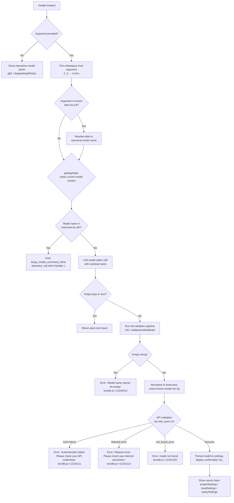

# `/model`

> Analysis basis: CC v2.1.150 bundle.js (AST extraction + Claude interpretation)
> Minimum version: v2.1.150

---

## Overview

The `/model` command allows users to view the current AI model configuration and switch to a different model within a Claude Code session. It accepts an optional model name argument, validates it against account entitlements and live API availability, and updates application state accordingly. When no argument is provided, it presents an interactive picker displaying available model choices with contextual metadata.

---

## Registration

| Field | Value |
|---|---|
| type | `local` |
| name | `model` |
| description | Set the AI model for Claude Code |
| argumentHint | `<model>` |
| supportsNonInteractive | `true` |
| module_id | `xF1` |
| load_inline | `true` |
| loc_byte | `12286895` |
| loc_byte_end | `12287069` |
| loc_line | `10003` |
| arbor_handler.name | `C_5` |
| arbor_handler.fqn | `claude-2.1.150::C_5` |
| arbor_handler.kind | `AsyncFunction` |
| arbor_handler.resolution_path | `module_id` |
| arbor_handler.n_hits | `0` |

Analysis basis: CC v2.1.150 bundle.js:+12286895

---

## Input Branching

The command has four distinct top-level paths based on the argument and execution context, warranting a Mermaid flowchart.



Analysis basis: CC v2.1.150 bundle.js:+12278706 through +12278929

---

## Behavioral Spec

### 1. Entry Point — Main Handler (`C_5`)

The Arbor-resolved handler `C_5` is an `AsyncFunction` reached via `module_id → xF1`.

```
async function mainModelHandler(args, context):
    rawInput = args.trim()                          // bundle.js:+12278706

    if rawInput is in aliasList:                    // bundle.js:+12278722
        rawInput = resolveAlias(rawInput)

    currentState = getAppState()                    // bundle.js:+12278745

    if rawInput is in restrictedModelList:          // bundle.js:+12278809
        emit telemetry("tengu_model_command_inline")// bundle.js:+12278864
        return inlineModelHandler(rawInput, context)// call c

    if no rawInput (interactive mode):
        return displayModelPicker(context)          // gB1

    return setModelWithValidation(rawInput, context, outputType="text")
                                                    // sZ8, bundle.js:+12278789
```

Analysis basis: CC v2.1.150 bundle.js:+12278706

---

### 2. Alias Resolution (`iL6` / `nq`)

Short human-readable aliases are normalized to canonical model identifiers before any validation.

Known aliases resolved at runtime (from literals):

| Alias | Resolution |
|---|---|
| `sonnet` | Canonical Sonnet model ID |
| `haiku` | Canonical Haiku model ID |
| `opus` | Canonical Opus model ID |
| `best` | Highest available model |
| `opusplan` | Opus in plan mode, else Sonnet (bundle.js:+2179021) |

Alias handling steps:

```
function resolveAlias(alias):
    normalized = alias.trim().toLowerCase()         // bundle.js:+2180378
    normalized = applyReplacements(normalized)      // A.replace, bundle.js:+2180406
    if normalized matches "sonnet": return canonicalSonnetId
    if normalized matches "haiku":  return canonicalHaikuId
    if normalized matches "opus":   return canonicalOpusId
    if normalized matches "best":   return bestAvailableModel()
    if normalized matches "opusplan": return opusPlanAlias()
    return normalized
```

The `[1m]` suffix (bundle.js:+2180489) is handled as a modifier indicating extended (1M token) context window variants, e.g. `sonnet[1m]` and `sonnet-4-6[1m]` (bundle.js:+12244132, +12244158).

Analysis basis: CC v2.1.150 bundle.js:+2180378

---

### 3. Entitlement Checks for 1M Context Models (`c85`, `l85`, `d85`)

Before allowing a model with the `[1m]` suffix, the handler checks account tier entitlements.

```
function checkOpus1MEntitlement(modelName, accountTier):
    if modelName contains "[1m]" and tier is "opus":
        if not accountHasOpus1M():
            emitError("opus_1m_unavailable")        // bundle.js:+12242335
            // Error message references:
            // "Opus with 1M context is not available for your account.
            //  Learn more: https://code.claude.com/docs/en/model-config#extended-context-with-1m"
            //                                      // bundle.js:+12242373
            return DENIED

function checkSonnet1MEntitlement(modelName, accountTier):
    if modelName is "sonnet[1m]" or "sonnet-4-6[1m]":
        if not accountHasSonnet1M():
            emitError("sonnet_1m_unavailable")      // bundle.js:+12242552
            // Error message references:
            // "Sonnet 4.6 with 1M context is not available..."
            //                                      // bundle.js:+12242592
            return DENIED
```

Account tiers checked: `max` (bundle.js:+2950381), `team` (bundle.js:+2950452), `default_claude_max_5x` (bundle.js:+2950467), `enterprise` (bundle.js:+2950562), `enterprise_usage_based` (bundle.js:+2950584).

Analysis basis: CC v2.1.150 bundle.js:+12242335

---

### 4. Live Model Validation (`rZ8` / `validateAndSetModel`)

When a model string is provided that is not a known alias or restricted shorthand, the handler validates it against the Anthropic API.

```
async function validateAndSetModel(modelName):
    trimmed = modelName.trim()                      // bundle.js:+12240375

    if trimmed is empty:
        return error("Model name cannot be empty")  // bundle.js:+12240412

    normalized = trimmed.toLowerCase()             // bundle.js:+12240535

    if normalized in knownModelSet FB1:            // bundle.js:+12240656
        // Cache hit — skip API call
        result = cachedModelInfo
    else:
        // Dispatch side_query to API             // bundle.js:+13038804
        response = await apiSideQuery(normalized, Gx)

        if auth failure:
            return error("Authentication failed. Please check your API credentials.")
                                                   // bundle.js:+12241111
        if network error:
            return error("Network error. Please check your internet connection.")
                                                   // bundle.js:+12241213
        if response.type == "not_found_error":     // bundle.js:+12241332
            extract model name from error message  // "model:" prefix, bundle.js:+12241414
            emit telemetry("invalid_model")        // bundle.js:+12242835
            return error(formattedNotFoundMessage)

        if exception during validation:
            emit telemetry("validate_exception")   // bundle.js:+12242932
            return error(exceptionMessage)

        FB1.set(normalized, result)                // bundle.js:+12240864

    applyModelToSettings(normalized)               // F85
    return successResult
```

The side query (`Gx`) sends a minimal `"Hi"` (bundle.js:+12240820) message with cache type `"ephemeral"` (bundle.js:+12240845) to validate model availability while minimizing cost.

Analysis basis: CC v2.1.150 bundle.js:+12240375

---

### 5. Settings Persistence (`Q85` / `f0H`)

After successful validation, the model is written to the appropriate settings layer.

```
function persistModelSetting(modelName):
    settingsLayers = [
        "projectSettings",   // bundle.js:+12243657
        "localSettings",     // bundle.js:+12243680
        "policySettings"     // bundle.js:+12243701
    ]

    // Locate writable layer (non-policy takes precedence)
    targetLayer = resolveWritableLayer(settingsLayers)

    // Write model key
    targetLayer.write("model", modelName)          // bundle.js:+12243641

    // If policySettings controls model, display "Managed settings" label
    //                                             // bundle.js:+12243803
```

Settings files resolved via `BC` → `.claude/settings.json` (bundle.js:+1211643, +1211653) and `.claude/settings.local.json` (bundle.js:+1211715).

Analysis basis: CC v2.1.150 bundle.js:+12243637

---

### 6. Interactive Model Picker Display (`Va_`)

When `/model` is invoked without arguments, a formatted list is rendered.

```
function renderModelPicker(currentModel, appState):
    models = buildModelList(appState)              // Xg

    for each model in models:
        label = model.displayName.padEnd(40)       // bundle.js:+15286881
        hint = ""

        if model is active fast-mode capable:
            hint += " · Fast mode ON"              // bundle.js:+12243400
        if model draws from usage credits:
            hint += " · Draws from usage credits"  // bundle.js:+12243451
        if fast mode is off:
            hint += " · Fast mode OFF"             // bundle.js:+12243497

        print bold(label) + dim(hint)              // j6.bold, j6.dim

    showCurrentModelSource(currentModel)           // Q85
    showSettingsLayerInfo()
```

The model list includes entries with `"anthropic."` prefix check (bundle.js:+2174609) and `"claude-"` prefix check (bundle.js:+2174230) to identify first-party models.

Known picker entries include at minimum:
- `opusplan` → "Opus in plan mode, else Sonnet" (bundle.js:+2179038)
- `sonnet`, `haiku`, `opus`, `best`
- `opus-4-6`, `opus-4-7` (bundle.js:+2167194, +2167248)
- `sonnet-4-6` (bundle.js:+10751007)

Analysis basis: CC v2.1.150 bundle.js:+12243115

---

### 7. Provider / Backend Detection (`mH` / `RA` / `Z3`)

The model resolution layer detects the active provider backend to adapt model availability.

```
function detectProviderBackend(config):
    if config matches "bedrock":    return BEDROCK   // bundle.js:+2035544
    if config matches "foundry":    return FOUNDRY   // bundle.js:+2035594
    if config matches "mantle":     return MANTLE    // bundle.js:+2035704
    if config matches "vertex":     return VERTEX    // bundle.js:+2035752
    if config matches "anthropicAws": return AWS     // bundle.js:+2036213
    if config matches "gateway":    return GATEWAY   // bundle.js:+2036233
    default: return FIRST_PARTY                      // "firstParty" bundle.js:+2179229
```

Analysis basis: CC v2.1.150 bundle.js:+2035504

---

## State & Side Effects

| Item | Detail |
|---|---|
| Telemetry: `tengu_model_command_inline` | Fired when a restricted/shorthand model token is submitted directly (bundle.js:+12278864) |
| Telemetry: `tengu_feature_bad` | Fired on handler error path in inline model call (bundle.js:+963479) |
| Telemetry: `tengu_api_success` | Fired after successful side-query API validation (bundle.js:+13040255) |
| Telemetry: `tengu_feature_ok` | Fired on successful completion of inline model handler (bundle.js:+963421) |
| appState changes | `getAppState()` consulted for current model; settings layers mutated on successful switch |
| Settings written | `.claude/settings.json` or `.claude/settings.local.json` depending on writable layer |
| Model validation cache | `FB1` Map — caches validated model names to avoid redundant API calls (bundle.js:+12240656, +12240864) |
| API side query | Sends minimal `"Hi"` message with `"ephemeral"` cache to validate model existence (bundle.js:+12240820, +12240845) |
| Sound | <!-- TODO: not found in depth-2 traversal; needs --depth 4 --> |

---

## Version History

| Version | Change |
|---|---|
| v2.1.150 | Initial analysis |

---

## Common Mistakes

1. **Passing an unsupported 1M-context suffix without entitlement.** Using `opus[1m]` or `sonnet[1m]` when the account tier does not include extended context will produce an error with a documentation link; the model will not be changed.
2. **Expecting non-interactive behavior without `supportsNonInteractive: true`.** This flag is set, so piped usage is valid — but callers must supply the full canonical model name or a recognized alias; partial matches are not fuzzy-resolved.
3. **Using a model string with mixed case.** The handler normalizes to lowercase internally, but API responses and settings files store the normalized form; supplying mixed-case strings is safe but may produce confusing diffs in version-controlled settings files.
4. **Assuming `/model` switches the model globally across all projects.** The settings layer resolution writes to the most local applicable layer (`localSettings` or `projectSettings`); `policySettings` is read-only and displays "Managed settings" if it controls the active model.
5. **Invoking `/model` with a provider-specific model ID on the wrong backend.** Bedrock, Vertex, Foundry, and other backends each have their own valid model namespaces; using a first-party `claude-*` ID against a Bedrock-configured session will result in a `not_found_error`.

---

## Appendix — Identifier Mapping

> For bundle debugging only. Identifiers change across versions.

| Identifier | Role |
|---|---|
| `C_5` | Main async handler for `/model` command (arbor_handler) |
| `H` | Input argument string / generic string variable |
| `_` | App state or utility reference (context-dependent) |
| `sZ8` | Model-setter dispatcher — routes to validation pipeline |
| `sy` | Model picker / display orchestrator |
| `iL6` | Alias resolution entry point |
| `uj` | Alias table lookup helper |
| `nq` | Model name normalization and alias expansion |
| `CW` | Model list builder / available-models resolver |
| `EA` | Provider capability checker |
| `Zt` | Max-tier entitlement checker |
| `L$H` | Team / default_claude_max_5x tier checker |
| `FpH` | Enterprise tier entitlement checker |
| `GZ` | Model categorization helper |
| `$P` | First-party model filter / picker entry builder |
| `Z3` | Backend/provider type resolver |
| `RA` | Provider config reader |
| `cf` | Model metadata formatter |
| `cv` | Model display entry composer |
| `c` | Inline model handler (restricted model path) |
| `gB1` | Interactive model picker launcher |
| `Za_` | Full model picker rendering pipeline |
| `Xg` | Model list constructor with prefix/flag checks |
| `A` | Intermediate model array / mapping variable |
| `f` | Model info cache lookup helper |
| `K` | Model label formatter (padEnd columns) |
| `q` | File system helper / model list accumulator |
| `Yc6` | Model entry metadata aggregator |
| `ppH` | Provider inclusion checker (`wI4` list) |
| `Y79` | Model index lookup helper |
| `jI4` | Model flag resolver (includes/GqH/nq) |
| `GqH` | Feature flag presence checker (`WqH` list) |
| `JI4` | Extended model entry builder (startsWith checks) |
| `uH` | Inline handler success wrapper |
| `c85` | Opus 1M entitlement validator |
| `E6H` | Entitlement API caller (ZqH/EA/AEq) |
| `l85` | Sonnet 1M entitlement validator |
| `b4H` | Sonnet entitlement API caller |
| `d85` | General 1M context availability checker |
| `rZ8` | Core validate-and-set-model function |
| `Gx` | API side-query dispatcher for model validation |
| `F85` | Model settings writer / persistence handler |
| `EH` | String conversion utility |
| `Va_` | Model picker display renderer |
| `bH` | Feature-ok telemetry emitter helper |
| `kK` | Model display label builder |
| `mH` | String formatting utility |
| `A$H` | Fast-mode annotation helper |
| `BD` | Model display entry with fast-mode flags |
| `jn` | Model hint string builder |
| `cJH` | Usage-credits annotation handler |
| `QJ` | Model display entry with credits annotation |
| `bW` | ZqH-based availability wrapper |
| `Q85` | Settings source display / model info summary |
| `f0H` | Settings file path resolver |
| `p8` | Settings read/write helper |
| `BC` | Settings path builder (`.claude/settings.json`) |
| `Jn` | Model picker row renderer (GqH/uj/nq) |