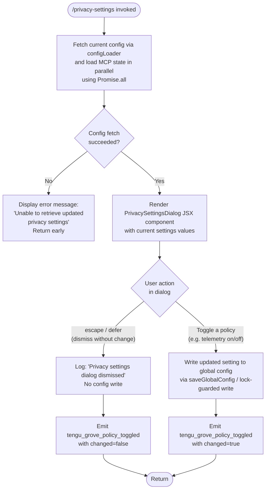

# `/privacy-settings`

> Analysis basis: CC v2.1.147 bundle.js (AST extraction + Claude interpretation)
> Minimum version: v2.1.147

---

## Overview

The `/privacy-settings` command opens an interactive dialog that lets users view and toggle privacy-related configuration options (e.g., telemetry and analytics sharing). When the dialog is dismissed, the handler persists any changes back to the global config store and emits a telemetry event recording whether a policy was toggled. The command is implemented as a `local-jsx` type, meaning it renders a JSX component inline rather than delegating to a text-based agent prompt.

---

## Registration

| Field | Value |
|---|---|
| type | `local-jsx` |
| name | `privacy-settings` |
| description | `View and update your privacy settings` |
| loc_byte | `11912818` |
| loc_byte_end | `11913010` |
| loc_line | `9737` |
| module_id | `CI1` |
| load_inline | `true` |
| arbor_handler.name | `eU7` |
| arbor_handler.fqn | `claude-2.1.147::eU7` |
| arbor_handler.kind | `AsyncFunction` |
| arbor_handler.resolution_path | `module_id` |
| arbor_handler.n_hits | `0` |

Analysis basis: CC v2.1.147 bundle.js:+11912818

---

## Input Branching

The handler has four distinct execution paths based on dialog outcome and config-fetch state, so a flowchart is used.



Analysis basis: CC v2.1.147 bundle.js:+11911822, +11911985, +11911999, +11912010, +11912358

---

## Behavioral Spec

### 1. Handler Entry — Parallel Initialization

```
async function privacySettingsHandler(context):
    // Load config and MCP connection state concurrently
    [currentConfig, mcpState] = await Promise.all([
        loadConfigWithCache(context),   // configLoader (qlH)
        loadMcpState(context)           // Mr / wDH
    ])

    if currentConfig is null or fetch failed:
        return errorResult("Unable to retrieve updated privacy settings")

    // Render dialog component
    dialogResult = await renderPrivacyDialog(currentConfig, context)
    return dialogResult
```

Analysis basis: CC v2.1.147 bundle.js:+11911822, +11911862, +11911875, +11911880, +11912136

---

### 2. Config Loading with Grove Cache (`configLoader`)

The config loading subsystem (`qlH`) implements a stale-while-revalidate ("Grove") caching strategy. Three cache states are logged at debug level:

| Cache state | Log message |
|---|---|
| No cache present | `"Grove: No cache, fetching config in background (dialog skipped this session)"` |
| Cache stale | `"Grove: Cache stale, returning cached data and refreshing in background"` |
| Cache fresh | `"Grove: Using fresh cached config"` |

```
function loadConfigWithCache(context):
    if cache is empty:
        log(debug, "Grove: No cache, fetching config...")
        fetchConfigInBackground()
        return DEFAULT_CONFIG

    age = Date.now() - cache.timestamp
    if age > STALE_THRESHOLD:
        log(debug, "Grove: Cache stale...")
        scheduleBackgroundRefresh()
        return cache.data   // return stale data immediately

    log(debug, "Grove: Using fresh cached config")
    return cache.data
```

Analysis basis: CC v2.1.147 bundle.js:+6641444, +6641564, +6641670

---

### 3. Config Read/Write with File Locking (`saveConfigWithLock`)

Config persistence (`_L_` / `M8`) uses a file-lock mechanism with safety checks:

```
function saveConfigWithLock(newSettings):
    acquireLock()                        // may emit tengu_config_lock_contention
    reReadConfigFromDisk()               // fresh read before write

    if reReadConfig is missing auth fields that cache has:
        log("saveConfigWithLock: re-read config is missing auth ... refusing to write")
        // Emit tengu_config_auth_loss_prevented
        releaseLock()
        return

    if writeIsStale:
        // Emit tengu_config_stale_write
        releaseLock()
        return

    mergeAndWriteConfig(newSettings)     // atomic write + optional backup rotation
    releaseLock()
```

Safety guard message (citation fragment): `"...refusing to write to avoid wiping ~/.claude.json. See GH #3117."` — this prevents silent data loss when a concurrent Claude instance modified auth tokens.

Backup rotation: up to 5 backup files are kept; files older than 60 000 ms relative to the newest backup are pruned. File size limit for rotation: 384 bytes threshold checked at runtime.

Analysis basis: CC v2.1.147 bundle.js:+3185186, +3184859, +3184995, +3185338, +60000 (literal:+3185540), +5 (literal:+3185789), +384 (literal:+3186071)

---

### 4. Privacy Dialog Render and Dismiss Handling

```
function renderPrivacyDialog(config, context):
    component = createElement(PrivacySettingsComponent, {
        settings: config,
        onEscape: () => handleDismiss("escape"),
        onDefer:  () => handleDismiss("defer"),
    })

    result = await mountAndAwaitDialog(component)

    if result.action in ["escape", "defer"]:
        log("Privacy settings dialog dismissed")
        emitTelemetry("tengu_grove_policy_toggled", { changed: false })
        return { dismissed: true }

    // User toggled one or more settings
    saveGlobalConfig(result.updatedSettings)
    emitTelemetry("tengu_grove_policy_toggled", { changed: true })
    return { saved: true }
```

The string constants `"escape"` and `"defer"` represent the two non-mutating dismissal paths; both produce the same telemetry payload.

Analysis basis: CC v2.1.147 bundle.js:+11911985, +11911999, +11912010, +11912358, +11912465

---

### 5. Config File I/O Internals (`configFileReader`)

The low-level config reader (`k$H`) guards against pre-initialization access:

```
function configFileReader(path):
    if accessBeforeAllowed:
        throw Error("Config accessed before allowed.")

    try:
        raw = fs.readFileSync(path, "utf-8")
    except ENOENT:
        return DEFAULT_EMPTY_CONFIG
    except error:
        emitTelemetry("tengu_config_parse_error")
        return DEFAULT_EMPTY_CONFIG

    parsed = JSON.parse(raw)

    // Backup rotation: copy to backup dir, prune old copies
    backupDir = path.join(dirname, "backups")
    fs.mkdirSync(backupDir, { recursive: true })
    existingBackups = fs.readdirStringSync(backupDir)
        .filter(f => f.startsWith(".backup."))
    // Keep at most 5 backups; delete oldest by Date.now comparison
    ...
    fs.copyFileSync(path, backupPath)
    return parsed
```

Analysis basis: CC v2.1.147 bundle.js:+3186803, +3186886, +3187033, +3187354, +3187654, +3187677, +3187712

---

### 6. "settings" View Passed to Component

The string literal `"settings"` (bundle.js:+11912419) is passed as a named prop to the JSX element, indicating the component renders in a dedicated `settings` view mode rather than a general-purpose prompt view.

Analysis basis: CC v2.1.147 bundle.js:+11912419

---

## State & Side Effects

| Item | Detail |
|---|---|
| Telemetry — `tengu_grove_policy_toggled` | Fired on every invocation; payload records whether a policy was actually changed (bundle.js:+11912358) |
| Telemetry — `tengu_config_parse_error` | Fired when the on-disk config JSON fails to parse (bundle.js:+3187440) |
| Telemetry — `tengu_config_lock_contention` | Fired when lock acquisition exceeds expected duration (bundle.js:+3184859) |
| Telemetry — `tengu_config_stale_write` | Fired when a write is aborted because the on-disk version is newer than the in-memory copy (bundle.js:+3184995) |
| Telemetry — `tengu_config_auth_loss_prevented` | Fired when a write is refused to prevent wiping auth tokens (bundle.js:+3185338) |
| Telemetry — `tengu_mcp_oauth_flow_start` | Fired by MCP OAuth subsystem reached transitively (bundle.js:+9822022) |
| Telemetry — `tengu_mcp_oauth_flow_success` | Fired on successful MCP OAuth (bundle.js:+9826799) |
| Telemetry — `tengu_mcp_oauth_flow_error` | Fired on MCP OAuth failure (bundle.js:+9828183) |
| Telemetry — `tengu_bg_spare_enable` | Background spare process telemetry (bundle.js:+15117130) |
| Telemetry — `tengu_bg_spare_spawn` | Background spare process spawn event (bundle.js:+15117490) |
| Telemetry — `tengu_daemon_config_reload` | Daemon config reload signal (bundle.js:+15132565) |
| Telemetry — `tengu_daemon_yield` | Daemon yields to foreground service (bundle.js:+15136736) |
| Config write | Global config (`~/.claude.json`) written only if user makes a change; guarded by file lock and auth-loss check |
| Config backup | Up to 5 rolling backups are maintained with a 60 000 ms age window; backup prefix `.backup.` |
| JSX render | `CE6.createElement` called to mount the privacy settings component (bundle.js:+11912465) |
| Hook / watcher | File-watch via `ws6.watchFile` / `ws6.unwatchFile` registered by the config watcher (`EQ4`) during the session |
| Log output | Debug-level Grove cache status messages emitted to internal log (not user-visible) |
| appState changes | Config cache updated on successful fetch or save |
| Sound | None detected |

---

## Version History

| Version | Change |
|---|---|
| v2.1.147 | Initial analysis |

---

## Common Mistakes

1. **Expecting immediate persistence on dismiss** — Closing the dialog with Escape or the defer action does not write any changes. Only an explicit toggle causes a config write.
2. **Running two Claude Code instances simultaneously** — The file-lock contention guard (`tengu_config_lock_contention`) will fire and the second write will be deferred or dropped with a warning about the lock taking longer than expected.
3. **Manually editing `~/.claude.json` while Claude Code is running** — The stale-write guard (`tengu_config_stale_write`) or auth-loss guard (`tengu_config_auth_loss_prevented`) may refuse to write the privacy setting change, silently preserving the hand-edited file.
4. **Expecting the command to work in headless / non-interactive mode** — The command renders a JSX component that requires an interactive terminal; it will not produce a text response suitable for piped or scripted invocations.
5. **Confusing `"defer"` with a pending save** — `"defer"` is simply an alternate dismissal label; it does not queue the settings for later application.

---

## Appendix — Identifier Mapping

> For bundle debugging only. Identifiers change across versions.

| Identifier | Role |
|---|---|
| `eU7` | Main async handler for `/privacy-settings` (arbor_handler) |
| `qlH` | Config loader with Grove stale-while-revalidate cache |
| `bGH` | Config resolution helper (merges sources) |
| `q1` | Config read sub-routine |
| `qa8` | Config field accessor A |
| `Aa8` | Config field accessor B |
| `mD` | Config object builder / field mapper |
| `GA` | Config merge/aggregation helper |
| `vC` | Array-includes check utility |
| `P29` | Config post-processing step |
| `I5` | Config initializer / default-value setter |
| `x6` | Config file read orchestrator |
| `F6` | File-path resolver utility |
| `o4_` | Config option extractor |
| `k$H` | Low-level config file reader with backup rotation |
| `EQ4` | Config file watcher (watchFile / unwatchFile lifecycle) |
| `N` | Structured logger / telemetry emitter |
| `vJK` | Log transport layer |
| `j9A` | Log destination dispatcher |
| `H` | General utility / random / setTimeout helper |
| `CH` | JSON serializer wrapper |
| `_` | General-purpose utility (various call sites) |
| `f4` | String/path manipulation helper |
| `l1A` | String map formatter |
| `q` | File-system namespace (readFileSync, statSync, etc.) |
| `A` | String utility (toLowerCase, lastIndexOf, slice) |
| `lRH` | Write-stream wrapper |
| `b1A` | Stream write helper |
| `kJK` | Async config persistence orchestrator (append, rotate, rename) |
| `XRH` | Batched-write / debounce scheduler |
| `XAH` | Config directory initializer |
| `C_6` | Config schema validator |
| `e1A` | Config file path builder |
| `t1A` | Config file rotate/rename handler |
| `IJK` | Mkdir + appendFile persistence worker |
| `r9` | Signal / unhandled-rejection cleanup registrar |
| `q2q` | Config save-with-cache orchestrator |
| `M8` | Global config save routine |
| `_L_` | Lock-guarded config write with backup management |
| `sUH` | Config write pre-check helper |
| `yy9` | Object.entries iteration helper for config fields |
| `tUH` | Timestamp-based config freshness checker |
| `Wf6` | Config write sentinel / flag setter |
| `c` | Context / app-state accessor |
| `HL_` | Fallback global config save (no-lock path) |
| `f` | MCP server state loader / aggregator |
| `EkH` | MCP server collection processor |
| `RHH` | MCP server entry builder |
| `CKH` | MCP server config resolver (enterprise/user/project layers) |
| `SHH` | MCP SDK server list builder |
| `cD6` | MCP server deduplication map builder |
| `TN` | MCP tool-namespace resolver |
| `o$` | MCP tool wrapper / proxy |
| `c2_` | MCP tool call dispatcher |
| `K` | Async task collection (map/push) |
| `L` | Async set / promise lifecycle tracker |
| `M` | Stream / connection handle |
| `s8` | General sink / discard utility |
| `F06` | MCP filter helper |
| `rj7` | MCP server startup helper |
| `Su_` | MCP connection state resolver |
| `WK8` | MCP server key generator |
| `GK8` | MCP server hash/identity builder |
| `MP` | Hash computation helper (SHA-256) |
| `XK8` | MCP permission key builder |
| `pK` | Permission-check utility |
| `z8` | MCP debug logger |
| `ux_` | MCP server connection manager / reconnect loop |
| `Hw7` | MCP connection pre-flight checker |
| `PF` | MCP transport factory |
| `P8H` | MCP OAuth flow manager |
| `RaH` | MCP pending-auth map manager |
| `D` | Background spare process / memory monitor |
| `AJ8` | MCP connection post-auth initializer |
| `Ud` | MCP reconnect orchestrator |
| `qm` | MCP transport option builder |
| `Y` | Daemon MCP server supervisor |
| `k7` | MCP error logger |
| `ZH` | String coercion / error message formatter |
| `_w7` | MCP connection race-condition guard |
| `eD7` | SSH/remote environment detector for MCP |
| `mx_` | MCP manual-callback OAuth completion handler |
| `SaH` | Pending-reconnect request reader |
| `CaH` | Pending-auth entry reader |
| `wL1` | MCP server warm-start / pre-connect helper |
| `M1` | AsyncLocalStorage store reader |
| `IJ8` | MCP needs-auth cache file path builder |
| `bx_` | MCP needs-auth cache writer |
| `B2_` | MCP server allowlist checker |
| `j` | Process collection (values / kill) |
| `y` | Child process wrapper |
| `OL1` | MCP tool result validator |
| `Gi` | Async iterator / stream utility |
| `g06` | MCP concurrency limit parser (parseInt, base 10) |
| `Ru_` | MCP port range parser (parseInt, base 10) |
| `k7K` | MCP update applicator (applyMcpUpdate + cleanup) |
| `kJ8` | MCP update serializer |
| `sN` | MCP server cleanup coordinator |
| `laH` | MCP session logger |
| `$` | Daemon status / ZC1 wrapper |
| `ZC1` | Daemon status file writer |
| `ll` | Daemon status path helper |
| `aE6` | Daemon status file path builder |
| `_D5` | Full MCP server refresh orchestrator |
| `EK8` | MCP server capability flag checker |
| `r8` | Subprocess / child-process launcher |
| `O` | OS / process utility namespace |