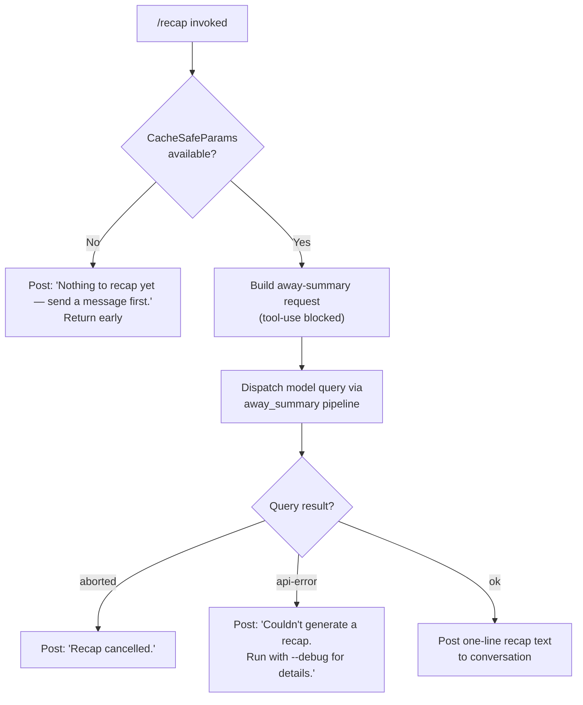

# `/recap`

> Analysis basis: CC v2.1.150 bundle.js (AST extraction + Claude interpretation)
> Minimum version: v2.1.150

---

## Overview

`/recap` generates a single-line summary of the current Claude Code session on demand. It calls the away-summary subsystem synchronously, dispatches a capped, tool-free query to the model, and posts the result as plain text to the conversation. If no conversation turns exist yet, or if generation fails, it emits a short, human-readable error message instead.

---

## Registration

| Field | Value |
|---|---|
| type | `local` |
| name | `recap` |
| description | `Generate a one-line session recap now` |
| loc_byte | `12556630` |
| loc_byte_end | `12556846` |
| loc_line | `10535` |
| supportsNonInteractive | `false` |
| thinClientDispatch | `post-text` |
| load_inline | `true` |
| load_ident | `WK5` |
| arbor_handler.name | `WK5` |
| arbor_handler.fqn | `claude-2.1.150::WK5` |
| arbor_handler.kind | `AsyncFunction` |
| arbor_handler.resolution_path | `load_ident` |
| arbor_handler.n_hits | `0` |

Analysis basis: CC v2.1.150 bundle.js:+12556630

The handler was resolved via `load_ident`: the registration object contains an inline `Promise.resolve({call: WK5})` shape, so `WK5` is both the Arbor-confirmed handler name and the `callGraph` entry point.

---

## Input Branching

The command has four distinct outcomes based on session state and model response. A Mermaid flowchart is used.



Analysis basis: CC v2.1.150 bundle.js:+12556380, +12556472, +12556530, +5317154, +5317528

---

## Behavioral Spec

### Handler Entry — `recapHandler` (`WK5`)

```
async function recapHandler(context):
    result = await awaySummaryDispatch(context)
    post result text to conversation
```

Analysis basis: CC v2.1.150 bundle.js:+12556238

The handler is an `AsyncFunction` resolved at `load_ident` position. It delegates immediately to the away-summary dispatch helper (`V48`).

---

### Away-Summary Dispatch — `awaySummaryDispatch` (`V48`)

```
async function awaySummaryDispatch(context):
    params = getCacheSafeParams(context)  // V48 → $6H / N
    if params is null or missing:
        log "[awaySummary] no CacheSafeParams saved, skipping"
        return {status: "no-turn"}

    controller = new AbortController()
    context.signal.addEventListener("abort", () => controller.abort())

    summary = await runQueryWithAwayMode(params, controller.signal)

    outcome = matchSummaryResult(summary)  // V48 → vOq
    return outcome
```

Analysis basis: CC v2.1.150 bundle.js:+5317133, +5317154, +5317212, +5317249, +5317268

Key observations:
- The literal `"[awaySummary] no CacheSafeParams saved, skipping"` (bundle.js:+5317154) indicates a guard that exits early when no prior turn data exists.
- The literal `"no-turn"` (bundle.js:+5317212) is the sentinel returned when this guard fires.
- An `AbortController` is wired to the parent signal using `"abort"` event listener (bundle.js:+5317268).

---

### Tool-Use Guard in Away-Summary Mode

```
function permissionGuard(toolUseRequest):
    // deny ALL tool use during away-summary queries
    log "Away summary cannot use tools"
    return {decision: "deny", reason: "Away summary cannot use tools"}
```

Analysis basis: CC v2.1.150 bundle.js:+5317445, +5317460

The literal `"deny"` at bundle.js:+5317445 and `"Away summary cannot use tools"` at bundle.js:+5317460 confirm that `/recap` enforces a hard no-tool policy during its model query. This prevents any file system or bash operations from being invoked inside the recap turn.

---

### Result Classification — `classifyAwayResult` (`vOq`)

```
function classifyAwayResult(rawResults):
    outcomes = rawResults.flatMap(item => mapToOutcome(item))
    // possible status values: "aborted", "api-error", "other", "ok"
    return outcomes
```

Analysis basis: CC v2.1.150 bundle.js:+5317672, +5317761, +5317822, +5317988

The function at `vOq` (bundle.js:+5317778) performs a `flatMap` over the raw query result array to produce typed outcome objects. Status strings found in literals:

| Status string | Meaning |
|---|---|
| `"aborted"` | User cancelled the request |
| `"api-error"` | Model API returned an error |
| `"other"` | Unclassified result |
| `"ok"` | Successful one-line recap |

---

### Response Text Posted to User

Based on the outcome status, one of three literal strings is posted:

| Condition | Message posted |
|---|---|
| No prior turns (`"no-turn"`) | `"Nothing to recap yet — send a message first."` (bundle.js:+12556380) |
| Aborted | `"Recap cancelled."` (bundle.js:+12556472) |
| API error | `"Couldn't generate a recap. Run with --debug for details."` (bundle.js:+12556530) |
| `"ok"` | Model-generated one-line recap text (dynamic) |

---

### Session-Recap Query Pipeline (`N` → `LVK` → `T7A`)

The recap query re-uses the same core query infrastructure as normal turns, but constrained to the "away_summary" mode:

```
function buildRecapQuery(params):
    request = buildRequest(params)         // N → LVK
    request.type = "away_summary"          // literal: bundle.js:+5317528
    request.avoidPrompts = true            // literal "avoid_prompts": bundle.js:+10584899
    request.toolUse = DENY_ALL
    return dispatchQuery(request)          // N → T7A (model call path)
```

Analysis basis: CC v2.1.150 bundle.js:+202704, +202722, +5317528, +10584899

The `"away_summary"` type string (bundle.js:+5317528) distinguishes recap queries from normal agent turns in telemetry and routing logic.

---

### Transcript Log Write (`$VK` path)

```
function appendTranscriptEntry(entry):
    dir  = path.dirname(transcriptPath)
    size = Buffer.byteLength(entry)
    if size within limit:
        appendToFile(transcriptPath, entry)
    else:
        rotateLogs(transcriptPath)
        appendToFile(newTranscriptPath, entry)
```

Analysis basis: CC v2.1.150 bundle.js:+202192, +202225, +202400, +202433

The `$VK` function cluster handles writing session transcript entries. It uses `Buffer.byteLength` (bundle.js:+202400) to check entry size before appending, and delegates rotation to `KMA` (bundle.js:+202394). The `.txt` extension (bundle.js:+201650) and rename-with-4-byte-suffix pattern (bundle.js:+201672) are used during rotation.

---

### Debug Logging

```
function debugLog(message, level):
    if level == "debug":
        serialize(message)   // CH → JSON.stringify (bundle.js:+182698)
        write to debug stream
```

Analysis basis: CC v2.1.150 bundle.js:+202680

The literal `"debug"` at bundle.js:+202680 is the log level used for internal recap tracing.

---

## State & Side Effects

| Item | Detail |
|---|---|
| Telemetry | See table below |
| Tool use | Hard-blocked during recap query (`"deny"` / `"Away summary cannot use tools"`, bundle.js:+5317445) |
| AbortController | Wired to parent session signal; abort propagates to model request |
| Transcript log | `$VK` appends the recap turn to the session transcript file; rotates if oversized |
| appState changes | `iJ8` reads and writes `appState` via `H.getAppState` / `H.setAppState` (bundle.js:+10584669, +10585449) |
| Sound | <!-- TODO: not found in depth-2 traversal; needs --depth 4 --> |
| Hook registration | `a9` registers hooks via `W7A.register` (bundle.js:+58272); standard stop-hook path applies |

### Telemetry Events (from call graph reachable during `/recap`)

| Event | Location |
|---|---|
| `tengu_auto_compact_rapid_refill_breaker` | bundle.js:+10548995 |
| `tengu_auto_compact_succeeded` | bundle.js:+10549456 |
| `tengu_ptl_surfaced_to_user` | bundle.js:+10551500 |
| `tengu_orphaned_messages_tombstoned` | bundle.js:+10553691 |
| `tengu_model_fallback_triggered` | bundle.js:+10556334 |
| `tengu_query_error` | bundle.js:+10556659 |
| `tengu_model_response_keyword_detected` | bundle.js:+10557303 |
| `tengu_malformed_tool_use_response` | bundle.js:+10560695 |
| `tengu_stop_hook_block_count` | bundle.js:+10561649 |
| `tengu_streaming_tool_execution_used` | bundle.js:+10562992 |
| `tengu_streaming_tool_execution_not_used` | bundle.js:+10563095 |
| `tengu_loop_dynamic_wakeup_ends_turn` | bundle.js:+10565251 |
| `tengu_post_autocompact_turn` | bundle.js:+10565418 |
| `tengu_query_before_attachments` | bundle.js:+10565532 |
| `tengu_query_after_attachments` | bundle.js:+10567850 |
| `tengu_mcp_tools_refreshed_mid_turn` | bundle.js:+10568153 |
| `tengu_feature_ok` | bundle.js:+963421 |
| `tengu_feature_bad` | bundle.js:+963479 |
| `tengu_forked_agent_default_turns_exceeded` | bundle.js:+10588292 |
| `tengu_fork_agent_query` | bundle.js:+10588735 |

Note: many of these events are emitted by the shared query infrastructure (`KxL`) rather than recap-specific code. The `away_summary` mode reuses the same pipeline.

---

## Version History

| Version | Change |
|---|---|
| v2.1.150 | Initial analysis |

---

## Common Mistakes

1. **Running `/recap` before any messages**: The command requires at least one prior conversation turn to have been saved as `CacheSafeParams`. Invoking it in a fresh session produces `"Nothing to recap yet — send a message first."` and returns immediately.

2. **Expecting tool output in the recap**: The recap query hard-blocks all tool use. Any model attempt to call a tool is denied with `"Away summary cannot use tools"`. The recap will always be plain text derived from the conversation transcript only.

3. **Assuming the recap runs in `--non-interactive` mode**: `supportsNonInteractive` is `false` for this command. Attempting to invoke `/recap` in a non-interactive pipeline will not work as expected.

4. **Misreading the error message as a bug**: `"Couldn't generate a recap. Run with --debug for details."` is a normal user-facing error for API failures. Pass `--debug` to the CC process to obtain the underlying API error.

5. **Cancelling mid-recap**: If the user aborts the request (e.g., Ctrl+C), the outcome is classified as `"aborted"` and the message `"Recap cancelled."` is posted. No partial recap text is emitted.

---

## Appendix — Identifier Mapping

> For bundle debugging only. Identifiers change across versions.

| Identifier | Role |
|---|---|
| `WK5` | `recapHandler` — async entry point for `/recap`; resolved via `load_ident` |
| `V48` | `awaySummaryDispatch` — orchestrates the away-summary query flow |
| `$6H` | `getCacheSafeParams` — retrieves saved turn parameters for the recap |
| `N` | `buildAndDispatchQuery` — core query builder / dispatcher shared by all turns |
| `LVK` | `buildRequestObject` — constructs the API request object |
| `T7A` | `modelCallDispatch` — dispatches the constructed request to the model |
| `H` | Context / event-emitter object (ambient, multi-role) |
| `CH` | `serializeForLog` — wraps `JSON.stringify` for debug logging |
| `_` | String utility / locale helper |
| `X4` | `resolveFilePath` — file-path resolution utility |
| `s5A` | `mapExtensions` — maps over file extensions |
| `q` | File-system handle / unlink wrapper |
| `A` | Path/string manipulation utility |
| `HbH` | `writeTranscriptEntry` — writes a single entry to the transcript |
| `B5A` | `streamWrite` — low-level write to output stream |
| `$VK` | `appendTranscriptFile` — append-with-rotation logic for transcript files |
| `ICH` | `scheduledFlush` — debounced flush with `clearTimeout`/`setTimeout` |
| `q9H` | `buildTranscriptPath` — constructs the full path for the transcript file |
| `Q6` | `getTranscriptDir` — retrieves transcript directory |
| `G96` | `checkEISDIR` — handles `EISDIR` error code during file ops |
| `LMA` | `joinTranscriptPath` — `path.join` wrapper for transcript paths |
| `KMA` | `rotateTxtFile` — renames `.txt` transcript files on overflow |
| `fVK` | `mkdirAndAppend` — creates directory then appends to transcript |
| `a9` | `registerHook` — registers stop/lifecycle hooks via `W7A.register` |
| `tW` | `runQueryTurn` — executes a single query turn with full pipeline |
| `iJ8` | `executeQueryCore` — core async query executor; reads/writes `appState` |
| `ok` | `initQueryState` — initializes query state, sets up abort binding |
| `QKH` | `dumpLoadState` — serializes/deserializes conversation state |
| `GzH` | `buildSystemPrompt` — constructs the system prompt for the turn |
| `jqq` | `prepareMessages` — prepares message array for API call |
| `M` | `closeStreams` — closes active I/O streams |
| `FW8` | `attachStreamHandlers` — attaches streaming event handlers |
| `My` | `generateRandomHex` — generates random hex bytes via `GGq.randomBytes` |
| `T` | `getTransportList` — retrieves active transport entries |
| `HE6` | Transport entry type A |
| `wh8` | Transport entry type B |
| `l8H` | `buildTurnContext` — builds per-turn context object |
| `h4` | `resolveHookRegistration` — resolves hook registration via `a9` |
| `yyH` | `filterAntMessages` — filters messages by `"ant"` prefix |
| `fu` | `runAgentLoop` — outer agent loop driving `KxL` |
| `KxL` | `queryApiLoop` — inner API streaming loop; the main model-call engine |
| `W28` | `cleanupSubagent` — tears down a completed subagent session |
| `bH` | `featureOkReporter` — reports `tengu_feature_ok` |
| `uH` | `featureBadReporter` — reports `tengu_feature_bad` |
| `jE6` | `checkToolUseSummaryFlag` — checks `aSL` set for tool-use summary flag |
| `UJH` | `postTurnSummaryEmitter` — emits post-turn summary event |
| `N08` | `notificationEmitter` — emits notification events |
| `Sj1` | `setExpandedViewEmitter` — emits `set_expanded_view` event |
| `D` | `sessionManager` — manages session lifecycle, push, and disposal |
| `V6` | `observableInputBackfill` — backfills observable input for sessions |
| `$` | `disposableSession` — session disposable wrapper |
| `Kv8` | `bgLowMemCheck` — checks memory and emits `tengu_bg_low_mem_mb` |
| `kqA` | `bgSpawnDaemon` — spawns background daemon spare process |
| `c` | `eventEmitter` — generic event emitter (ambient) |
| `Dz` | `sessionCleanupHelper` — helper for session cleanup steps |
| `K8` | `eisDirGuard` — guards against `EISDIR` errors |
| `RH` | `errorLogger` — logs errors via `ll.logError` |
| `JxL` | `forkAgentQuery` — runs a forked agent query; emits `tengu_fork_agent_query` |
| `T8` | `setupTransportChannel` — sets up transport with UUID and stream |
| `X` | `bgProtocolHandler` — handles background PTY protocol messages |
| `J` | `transportRegistry` — registry of active transports |
| `w` | `bgSessionWorker` — background session worker / process manager |
| `zM` | `streamEndHelper` — ends a stream and calls `CH` |
| `Ok5` | `bgAttachHandler` — handles attach/detach/respawn for bg PTY sessions |
| `EH` | `stringCoercer` — coerces values to `String` |
| `vOq` | `classifyAwayResult` — `flatMap`s raw results to typed outcome objects |

---

Note: index built via Arbor fallback; some signals (telemetry, literals) may be missing — see arbor-fallback.js.