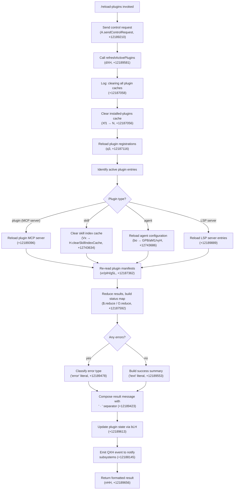

# `/reload-plugins`

> Analysis basis: CC v2.1.150 bundle.js (AST extraction + Claude interpretation)
> Minimum version: v2.1.150

---

## Overview

`/reload-plugins` activates pending plugin changes in the current session without requiring a full restart. It clears all plugin-related caches, re-scans and re-registers plugin sources (MCP servers, skills, agents, LSP servers), and emits an event to notify running subsystems of the refreshed plugin state. The command dispatches its work via a control-request channel to the daemon.

---

## Registration

| Field | Value |
|---|---|
| type | `local` |
| name | `reload-plugins` |
| description | `Activate pending plugin changes in the current session` |
| supportsNonInteractive | `false` |
| thinClientDispatch | `control-request` |
| module_id | `kU1` |
| load_inline | `true` |
| loc_byte | `12190151` |
| loc_byte_end | `12190370` |
| loc_line | `9967` |
| arbor_handler.name | `d65` |
| arbor_handler.fqn | `claude-2.1.150::d65` |
| arbor_handler.kind | `AsyncFunction` |
| arbor_handler.resolution_path | `module_id` |
| arbor_handler.n_hits | `0` |

Analysis basis: CC v2.1.150 bundle.js:+12190151

---

## Input Branching

The handler `d65` follows more than three distinct execution paths depending on plugin-type routing and per-plugin resolution outcomes. A Mermaid flowchart is used.



---

## Behavioral Spec

### 1. Entry Point — Handler `d65` (AsyncFunction)

The command's main handler is the async function resolved by Arbor as `d65` (FQN: `claude-2.1.150::d65`), reached via `module_id` resolution from `kU1`.

```
async function reloadPluginsHandler(context):
    sendControlRequest(context)                     # +12189210
    result = await refreshActivePlugins(context)    # +12189581
    pluginState = await updatePluginState(result)   # +12189613
    summary = formatSummary(result)                 # +12189656
    return summary
```

Analysis basis: CC v2.1.150 bundle.js:+12189173

---

### 2. Control Request Dispatch

Before any plugin work begins, a control-request is dispatched via `A.sendControlRequest`. The command's `thinClientDispatch` field is set to `"control-request"`, meaning thin-client environments route this command through the daemon control channel rather than executing locally.

```
function dispatchControlRequest(context):
    A.sendControlRequest(context, type="ccr")   # literal "ccr" at +12189191
```

Analysis basis: CC v2.1.150 bundle.js:+12189210

---

### 3. Cache Clearing (`refreshActivePlugins` / `dXH`)

The core refresh function `dXH` begins by logging a diagnostic string and clearing all plugin-related caches before re-scanning.

```
async function refreshActivePlugins(context):
    log("refreshActivePlugins: clearing all plugin caches")  # +12187058
    clearInstalledPluginsCache()    # Xf1 → N path, +12187056
                                    # logs "Cleared installed plugins cache" (+9650104)
    clearPluginRegistrations()      # q3 → XyH → DP8.clear, +9594062
    reloadPluginSources()           # see §4
    ...
```

Analysis basis: CC v2.1.150 bundle.js:+12187056

---

### 4. Plugin Source Reload (`q3` and associated helpers)

The plugin registration reload path (`q3`) collects plugin entries from all active scopes and passes them to type-specific handlers.

```
async function reloadPluginSources(context):
    entries = await collectPluginEntries(yTL)        # +9617259
    for entry in entries:
        if entry.type == "plugin" or "plugin MCP server":   # +12189305, +12189396
            await reloadMcpServer(entry)
        elif entry.type == "skill":                          # +12189336
            clearSkillIndexCache(entry)                      # Vx.clearSkillIndexCache +12743634
        elif entry.type == "agent":                          # +12189364
            await reloadAgentConfig(entry, bo)               # +12743681
        elif entry.type == "hook" or "plugin LSP server":   # +12189830, +12189889
            await reloadLspServer(entry)
    await Promise.all(parallelReloads)               # +12187165
```

Analysis basis: CC v2.1.150 bundle.js:+12187116

---

### 5. Plugin Manifest Re-Reading (`vr` and `pIH`)

For each MCP plugin, the manifest reader (`vr`) locates and parses the plugin definition files, handling multiple plugin configuration formats.

```
async function readPluginManifests(pluginEntries):
    for entry in pluginEntries:
        dirPath = locatePluginDir(entry, jWq)        # +6450098
        if dirPath ends with ".mcpb":                # +5111448
            extractMcpbArchive(dirPath, Tw6)         # +5117262
            # reads manifest.json (+5117468) inside archive
        elif dirPath ends with ".dxt":               # +5111469
            readDxtManifest(dirPath)
        else:
            readPlainMcpJson(dirPath, RT_)           # reads .mcp.json +6449967
    readLspConfig(entry, pIH)                        # reads .lsp.json +8021716
    return mergedManifests
```

Analysis basis: CC v2.1.150 bundle.js:+12187362

---

### 6. Result Aggregation and Status Building

After all plugin sources are reloaded, results are aggregated using reduce operations. Plugin entries are partitioned into success and error maps, then a formatted status string is built.

```
function aggregateResults(reloadResults):
    successMap = reloadResults.reduce(buildSuccessMap, {})   # $.reduce +12187592
    errorMap   = reloadResults.reduce(buildErrorMap, {})     # O.reduce +12187617
    filteredSuccess = filterPlugins(successMap, g65)         # +12187715
    filteredError   = filterPlugins(errorMap, Q65)           # +12187748
    if len(filteredError) > 0:
        errorItems = classifyErrors(filteredError)
            # error kinds: "generic-error" +12188708
            #              "lsp-manager"   +12188561
            #              "plugin:"       +12188596
        return buildErrorMessage(errorItems, separator=" · ")  # +12189423
    else:
        return buildTextMessage(filteredSuccess)  # "text" +12189553
```

Analysis basis: CC v2.1.150 bundle.js:+12187592

---

### 7. Plugin State Update (`bLH`)

After aggregation, the resolved plugin graph is written back into application state. This includes merging dependency resolution records and marking any dependency-unsatisfied entries.

```
async function updatePluginState(resolvedGraph):
    current = pluginState.get()                    # _.get +11367238
    merged  = mergeDependencyInfo(resolvedGraph)   # Md path +11367400
    if hasDependencyErrors(merged):
        # error kinds: "dependency-unsatisfied" +11367174
        #              "not-found"              +11367211
        #              "dependency-resolution"  +11368186
        markUnsatisfied(merged)
    pluginState.set(merged)                        # _.set +11367274
    pluginState.addTracked(merged)                 # $.add +11367296
    emitConfigChangeEvent(QXH)                     # QXH.emit +12188145
```

Analysis basis: CC v2.1.150 bundle.js:+12189613

---

### 8. Reload Event Emission

After state is updated, a `"ConfigChange"` event (literal at +12867991) is emitted on the `QXH` event bus, causing any listening subsystems (LSP manager, skill index, MCP connection pool) to pick up the new configuration.

```
function emitReloadEvent():
    QXH.emit("ConfigChange", {
        type: "policy_settings",     # +12868086
        scope: "skills"              # +13704271
    })
```

Analysis basis: CC v2.1.150 bundle.js:+12188145

---

### 9. Result Formatting (`nHH`)

The final step formats a human-readable summary. Up to 5 items are shown inline; beyond that a count is appended.

```
function formatReloadSummary(items):
    # Maximum inline display: 5 items (literal value 5 at +4925189)
    visible = items.map(renderItem, nHH)        # +12189656
    label   = items.length == 1 ? "dependency"
                                 : "dependencies"  # +4925303, +4925316
    joined  = visible.slice(0, 5).join(", ") +
              (remaining > 0 ? " (and N more)" : "")
    return joined
```

Analysis basis: CC v2.1.150 bundle.js:+12189656

---

## State & Side Effects

| Item | Detail |
|---|---|
| Telemetry | `tengu_feature_ok` (+963421), `tengu_feature_sad` (+963556), `tengu_feature_bad` (+963479), `tengu_daemon_yield` (+15279828), `tengu_daemon_control` (+15296981) |
| Cache cleared | Installed-plugins cache (Xf1/N, +12187056); plugin registration map (XyH → DP8.clear, +9594062); skill index cache (Vx → H.clearSkillIndexCache, +12743634) |
| appState changes | Plugin state map updated via `bLH` (_.get/_.set/$.add, +11367238–11367296); dependency satisfaction flags written |
| Event emitted | `QXH.emit("ConfigChange")` notifies LSP manager, skill subsystem, and MCP pool (+12188145) |
| Control channel | `A.sendControlRequest` with type literal `"ccr"` dispatched before local work (+12189191) |
| File I/O | Re-reads `.mcp.json` (+6449967), `manifest.json` (+5117468), `.lsp.json` (+8021716), `.claude-plugin/marketplace.json` (+9642590), `known_marketplaces.json` (+9621673) |
| MCPB extraction | If a `.mcpb` archive is detected, extracts and reads embedded manifest; computes MD5 hash (+5118305) for integrity |
| Sound | None observed in traversal |

---

## Version History

| Version | Change |
|---|---|
| v2.1.150 | Initial analysis |

---

## Common Mistakes

1. **Running in non-interactive mode**: `supportsNonInteractive` is `false` — the command will not execute in headless/scripted sessions and must be invoked interactively.
2. **Expecting immediate MCP reconnection**: `/reload-plugins` clears caches and re-registers plugin definitions, but MCP server processes that are already running must be restarted separately if their binary or configuration changed on disk.
3. **Assuming `.dxt` / `.mcpb` formats are always supported**: The handler throws a descriptive error ("This plugin uses a source type your Claude Code version does not support…", +5154338) for unrecognised archive formats — update Claude Code if this occurs.
4. **Ignoring the `"dependency-unsatisfied"` result**: Even a successful reload may surface dependency errors (`not-found`, `dependency-resolution`, `dependency-unsatisfied`) in the result text. Check the output message for the `" · "` separator pattern (+12189423) which delineates individual plugin status items.
5. **Running via thin client without daemon**: The `thinClientDispatch: "control-request"` field means thin-client builds forward this command to the daemon. If the daemon is stopped (`"stopped"` state literal at +15296815), the control request will fail silently or be queued.

---

## Appendix — Identifier Mapping

> For bundle debugging only. Identifiers change across versions.

| Identifier | Role |
|---|---|
| `d65` | Main handler for `/reload-plugins` (AsyncFunction, arbor-resolved from module `kU1`) |
| `H$` | Helper called early in handler; sets up context before control request |
| `Z2H` | Sub-utility called by H$ |
| `Uc` | Pre-reload preparation helper |
| `k8` | Utility called by Uc and O; low-level helper |
| `dXH` | `refreshActivePlugins` — core cache-clearing and re-registration function |
| `N` | General-purpose logging / error-normalisation utility (called widely) |
| `LVK` | Plugin enumeration helper |
| `T7A` | Token/transform helper inside LVK |
| `H` | Random-delay / retry utility (uses Math.random + setTimeout) |
| `CH` | JSON.stringify wrapper |
| `X4` | Path/string manipulation helper |
| `s5A` | Array-map helper inside X4 |
| `HbH` | Write-buffer helper |
| `B5A` | H.write wrapper |
| `$VK` | Log/append-file pipeline (writes logs to disk) |
| `ICH` | Batched-log flush scheduler (clearTimeout/setTimeout/setImmediate) |
| `q9H` | Log-line formatter |
| `Q6` | Directory/path resolver utility |
| `G96` | Error-code classifier (K8 path) |
| `LMA` | Path-join helper for plugin directories |
| `KMA` | File rename / stat / unlink helper |
| `fVK` | mkdir + appendFile pipeline |
| `a9` | Hook registration helper (W7A.register) |
| `Xf1` | Installed-plugins cache clearer |
| `q3` | Plugin registration reload orchestrator |
| `yTL` | Plugin-entry collector |
| `ZE` | Inner plugin-entry processor |
| `GP8` | Plugin type guard / getter |
| `nK8` | Plugin null-check helper |
| `$j8` | Plugin field accessor |
| `sC_` | Plugin-root filter (filters by "pluginRoot" key) |
| `RH` | Error logger (ll.logError path) |
| `SK8` | Plugin schema validator |
| `hp_` | Plugin health-check helper |
| `Af1` | Plugin activation finaliser |
| `bo` | Agent/skill reload dispatcher |
| `Vx` | Skill index cache clearer (calls H.clearSkillIndexCache) |
| `aM1` | Agent metadata loader |
| `vyH` | Plugin version helper |
| `O0_` | Null-check utility (nK8 path) |
| `P0_` | Plugin predicate helper |
| `XyH` | Plugin registration map clearer (DP8.clear) |
| `eGq` | Plugin event-queue helper |
| `icq` | Inter-component request helper |
| `j_` | Process/child-process utility (Dv path) |
| `Dv` | Low-level spawn/exec primitive |
| `K` | MCP server entry formatter (padEnd for display) |
| `vr` | Plugin manifest reader (orchestrates jWq + RT_) |
| `RT_` | `.mcp.json` file reader and parser |
| `j8` | Error-code normaliser (ENOENT/EISDIR handler) |
| `g6` | JSON.parse wrapper |
| `Ld` | File-extension checker (.mcpb / .dxt) |
| `jWq` | Plugin directory locator and download status checker |
| `Tw6` | MCPB archive extractor and manifest reader |
| `EH` | String coercion wrapper |
| `pIH` | LSP config reader (.lsp.json) |
| `g5L` | LSP sub-config parser (handles Array and Object shapes) |
| `F5L` | LSP path resolver (relative-path validator) |
| `$` | Aggregate result accumulator (HQ1 path) |
| `HQ1` | Daemon-status record builder |
| `Pn` | Plugin notification helper |
| `A1` | Async-local-storage store getter |
| `$v6` | Daemon status file path builder ("daemon.status.json") |
| `O` | Plugin error-map accumulator |
| `g65` | Success-plugin filter |
| `IU1` | Plugin inclusion checker |
| `Q65` | Error-plugin filter |
| `bLH` | Plugin state updater (reads/writes app plugin state map) |
| `Md` | Known-marketplaces loader (LM path) |
| `LM` | Marketplace JSON reader (known_marketplaces.json) |
| `vP8` | Marketplace path resolver |
| `bVH` | Plugin entry schema validator (Object.entries + p8) |
| `p8` | Plugin policy checker (gp6 + rF) |
| `gp6` | Plugin-type factory |
| `rF` | Plugin source-type router (npm/git/github/url/file/directory) |
| `_V` | Error thrower helper |
| `BA` | Scope string parser (includes/split on "managed") |
| `RP` | Plugin policy enforcement (GD6 + cHH paths) |
| `GD6` | Policy-rule evaluator (hostPattern/pathPattern) |
| `_18` | Policy-settings accessor |
| `Lqq` | Host-pattern matcher |
| `Mqq` | Path-pattern matcher |
| `VW7` | Policy-verdict builder |
| `cHH` | Policy-check helper |
| `ZW7` | Policy-blocked error builder |
| `K4H` | Per-plugin config file reader (.claude-plugin/marketplace.json) |
| `aG6` | Marketplace config path builder |
| `Cp_` | Marketplace config parser (zod safeParse) |
| `K8` | ENOENT/EISDIR error filter |
| `UG` | Plugin scope/config resolver |
| `eW_` | Plugin user-config reader |
| `hdL` | Plugin de-duplication tracker |
| `kw6` | Plugin installation / dependency-resolution engine |
| `AV` | Plugin availability checker |
| `pK8` | Plugin pre-install validator (BA + RP) |
| `J46` | Local-source path validator (startsWith "./") |
| `x6` | Async-context getter (Mm6 path) |
| `Mm6` | Store-context resolver (Lm6.getStore) |
| `EE` | Plugin MCP config builder (xp_ + P46 + X46) |
| `xp_` | Plugin config file reader (readFileSync) |
| `up_` | Plugin env-var expander |
| `j` | MCP process set (kill/values operations) |
| `y` | MCP process handle (z.write / c) |
| `P` | MCP server connection manager (sdk/sse/dynamic modes) |
| `wh8` | MCP transport factory |
| `c_` | Error-string normaliser |
| `Hx` | Plugin scope validator (BA + oS) |
| `oS` | Scope-string canonicaliser |
| `W18` | Semver range validator (oQ.valid/coerce/satisfies) |
| `W` | Plugin change-set debouncer (z.add / setTimeout / bo / XyH) |
| `z` | Plugin-set (bH/uH/Rk/pu members) |
| `czH` | ConfigChange event builder |
| `tQH` | Plugin-set membership checker (H.some) |
| `H1q` | Dependency graph builder (cross-marketplace/cycle detection) |
| `f` | Plugin feature-flag map (UyH/gDK/L.get paths) |
| `_A` | Settings file writer (flagSettings/userSettings/projectSettings) |
| `o$` | Plugin descriptor factory |
| `Pl8` | Plugin binary/entry-point resolver |
| `oX` | Symlink resolver (il path) |
| `Ec8` | Settings write timestamp recorder |
| `M0H` | Plugin metadata assembler |
| `UK6` | Atomic file writer (temp-file + rename pattern) |
| `CY` | Cache-clear pair (dy6.clear + pS8.clear) |
| `im6` | Gitignore-tracking helper |
| `BC` | Settings path builder (.claude/settings.json) |
| `bH` | Process signal helper (c path, SIGTERM) |
| `_8` | Cleanup helper (c path) |
| `uH` | Process-exit helper (c path) |
| `hm` | Settings persistence helper |
| `Nw6` | Plugin install path guard ($x.resolve + startsWith check) |
| `B` | MCP tool-filter set |
| `g` | Tool-list filter (v6.filter + VH.has) |
| `Q` | Plugin file cache (WZ6 read, KE1 unlink) |
| `WZ6` | Cached-file reader |
| `KE1` | Cached-file unlinker |
| `LH` | Plugin notification queue (e + DH + Z + I) |
| `e` | Notification dispatcher (addNotification) |
| `DH` | Notification enqueue helper |
| `Z` | Notification deduplicator |
| `I` | Away-summary gate (checks focus/blur state) |
| `l` | Rate-limit token bucket |
| `o` | Voice-recording session manager |
| `RD6` | Semver range-conflict detector |
| `FP_` | Semver range normaliser |
| `bK8` | Git-subdir helper (Xfq path) |
| `Xfq` | Git sub-directory extractor |
| `xK8` | npm / git tag resolver |
| `qv7` | npm registry query helper |
| `E8` | Child-process executor (G_ + x6 paths) |
| `w` | MCP worker-process pool |
| `Iw6` | Plugin installer (full install pipeline) |
| `icH` | Plugin extraction runner |
| `BK8` | Plugin registry client |
| `kfq` | Plugin checksum verifier |
| `H6H` | Plugin identifier hasher (sha256, +5123981) |
| `hN` | Plugin disk-cache accessor |
| `X` | MCP stdio transport (Buffer.concat / w.setTimeout) |
| `Z18` | npm install runner (z1q.readdir + package.json scan) |
| `ep` | Install error classifier |
| `qDH` | Plugin cache-entry updater |
| `mK8` | Temporary-file cleanup helper |
| `nW_` | Plugin registry update helper ("Updated"/"Added" literals) |
| `h` | Away-summary trigger (Date.now + Math.min + I) |
| `tg` | Away-summary debounce state |
| `V` | Away-summary API caller |
| `ELK` | API error classifier |
| `zH` | Process-exit queue (process.exit) |
| `r` | Permission allow/deny checker |
| `d` | Permission-rule evaluator |
| `R` | MCP server-process launcher |
| `C` | MCP process wrapper (KXK/Dz/RH/z.write) |
| `t` | Voice-session focus timer |
| `T` | MCP connection-state holder (HE6/wh8) |
| `Ov7` | Plugin dependency pre-validator |
| `b` | Plugin batch-map helper |
| `tk` | Plugin name normaliser (toLowerCase) |
| `of` | Plugin error-message formatter (mH path) |
| `mH` | String coercion utility |
| `f4` | Plugin telemetry emitter (plugin_installed event) |
| `CR8` | Install-trigger classifier |
| `SVH` | OTEL metrics attribute builder |
| `ZA6` | Telemetry attribute helper |
| `nHH` | Result summary formatter (join with " · " separator, max 5 inline) |