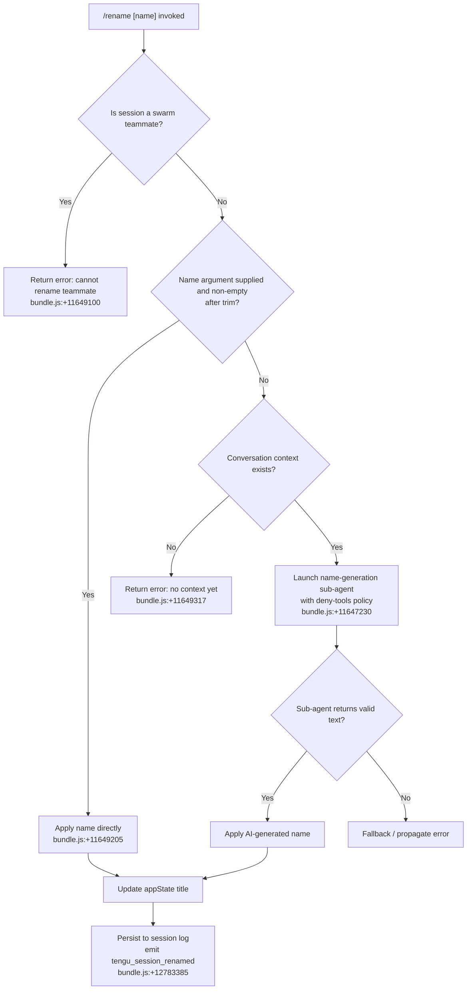

# `/rename`

> Analysis basis: CC v2.1.149 bundle.js (AST extraction + Claude interpretation)
> Minimum version: v2.1.149

---

## Overview

`/rename` (aliased as `/name`) renames the current conversation session to a user-supplied string or, when no name is provided, uses an AI-driven name-generation sub-agent to derive a title from the existing conversation context. The command immediately updates the session title in application state and persists it to the session log, emitting telemetry for both manual and auto-generated rename paths.

---

## Registration

| Field | Value |
|---|---|
| type | `local-jsx` |
| name | `rename` |
| description | `Rename the current conversation` |
| argumentHint | `[name]` |
| aliases | `["name"]` |
| immediate | `true` |
| module_id | `qh1` |
| load_inline | `true` |
| loc_byte | `11649955` |
| loc_byte_end | `11650154` |
| loc_line | `9403` |
| arbor_handler.name | `_rL` |
| arbor_handler.fqn | `claude-2.1.149::_rL` |
| arbor_handler.kind | `AsyncFunction` |
| arbor_handler.resolution_path | `module_id` |
| arbor_handler.n_hits | `0` |

Analysis basis: CC v2.1.149 bundle.js:+11649955

---

## Input Branching

Four distinct execution paths exist based on whether the session is a swarm teammate, whether a name argument was supplied, and whether there is existing conversation context to generate a name from.



---

## Behavioral Spec

### Entry Point — Handler `_rL`

`_rL` is the top-level async handler resolved via Arbor from module `qh1`.

```
async function handleRenameCommand(args, context):
    swarmCheck = getSwarmTeammateStatus(context)           // via jf → uW → x8_.getStore
    if swarmCheck.isSwarmTeammate:
        return errorMessage(
            "Cannot rename: This session is a swarm teammate. " +
            "Teammate names are set by the team leader."
        )                                                   // bundle.js:+11649100

    suppliedName = args.trim()                             // bundle.js:+11649205

    if suppliedName is non-empty:
        applyRename(suppliedName, origin="other")          // bundle.js:+11649239, +11647309
    else:
        result = await generateNameViaSubAgent(context)    // bundle.js:+11649424
        if result is error or empty:
            return result
        applyRename(result, origin="rename_generate_name") // bundle.js:+11647348

    setAppState(title = chosenName)                        // bundle.js:+11649456
    persistSessionTitle(chosenName)                        // via WzH chain
    return void
```

Analysis basis: CC v2.1.149 bundle.js:+11649646

---

### Sub-feature: Swarm Teammate Guard

Before any rename logic runs, the handler checks whether the current session is acting as a swarm teammate. This check walks the async-context store (call chain `jf` → `uW` → `x8_.getStore`).

```
function isSwarmTeammate(context):
    store = asyncContextStore.getStore()                    // bundle.js:+2187115
    return store != null and store.isSwarmTeammate === true
```

If the guard fires, a hard-coded error string is returned immediately and no further processing occurs.

Analysis basis: CC v2.1.149 bundle.js:+11649080

---

### Sub-feature: Direct Rename Path

When the caller provides a non-empty name argument (after `String.prototype.trim`):

```
function applyDirectRename(rawArg):
    name = rawArg.trim()                                   // bundle.js:+11649205
    if name is empty:
        // falls through to AI generation path
        return null
    commitRename(name, origin="other")                     // bundle.js:+11647309
```

The `origin` field written to the log distinguishes user-supplied names (`"other"`) from AI-generated names (`"rename"` / `"rename_generate_name"`).

Analysis basis: CC v2.1.149 bundle.js:+11649239

---

### Sub-feature: AI Name-Generation Sub-Agent

When no argument is provided, `$H6` orchestrates a forked sub-agent query. Key behaviors:

```
async function generateNameViaSubAgent(sessionContext):
    if sessionContext has no messages:
        return error("Could not generate a name: no conversation context yet. " +
                     "Usage: /rename <name>")              // bundle.js:+11649317

    // Snapshot the session for the fork
    forkTimestamp = Date.now()                             // via sQ_ → bundle.js:+10583302
    emit telemetry("tengu_rename_full_session_fork")       // bundle.js:+11647788

    // Build abort controller; listen for "abort" signal
    controller = newAbortController()
    controller.signal.addEventListener("abort", ...)       // bundle.js:+11647034, +11647053

    // Configure sub-agent with deny-all tools policy
    agentConfig = {
        toolPolicy: "deny",                                // bundle.js:+11647230
        systemNote: "Session name generation cannot use tools"  // bundle.js:+11647245
        taskType: "rename",                                // bundle.js:+11647324
        telemetryTag: "rename_generate_name"               // bundle.js:+11647348
    }

    // Run the forked agent query (tW is the fork-agent-query runner)
    result = await runForkedAgentQuery(agentConfig, controller.signal)

    // Extract the first text content block from the response
    textContent = extractFirstTextBlock(result)            // via Ah1 → Bh chain, bundle.js:+11647635
    trimmedName = textContent.trim()                       // bundle.js:+1092476

    return trimmedName
```

Analysis basis: CC v2.1.149 bundle.js:+11647845

---

### Sub-feature: Session Rename Commit (`applyRename` via `$H6` → logging chain)

Once a final name string is chosen (by either path), it is committed through the session persistence layer:

```
function commitRename(name, origin):
    // Write the title field to the session JSONL log
    // via WzH → bK → kG → file path resolution
    sessionFilePath = resolveSessionFilePath(currentSessionId)  // bundle.js:+11649498
    writeSessionTitle(sessionFilePath, {
        type: "name",                                      // bundle.js:+11646893
        value: name
    })

    // Emit event for log / UI consumers
    emit("tengu_session_renamed", { name, origin })        // bundle.js:+12783385

    // Update app state so the UI reflects the new title
    _.setAppState({ title: name })                         // bundle.js:+11649456

    // Tag in log file with origin type ("custom-title" or "ai-title")
    // custom-title → bundle.js:+12783293
    // ai-title     → bundle.js:+12783458
```

Analysis basis: CC v2.1.149 bundle.js:+11649498

---

### Sub-feature: Forked Agent Query Runner (`tW`)

`tW` is the general-purpose forked-agent executor reused here for name generation:

```
async function runForkedAgentQuery(config, signal):
    startTime = Date.now()                                 // bundle.js:+10586823
    sessionState = getAppState()                           // via iJ8 → H.getAppState, bundle.js:+10584693

    // Prepare message list — takes the "main" conversation branch
    messages = sessionState.messages.at(-1, branch="main") // bundle.js:+10587128, +10587153

    if messages is empty or null:
        return earlyError("no context")

    // Build conversation history for sub-agent
    conversationHistory = buildHistoryForFork(messages)    // via fu chain, bundle.js:+10587354

    // Check for tombstone / summary message types to skip
    // (tombstone, tool_use_summary, etc.) via jE6, bundle.js:+10587534

    // Apply tool deny list from config
    toolPolicy = resolveDenyPolicy(config)                 // via Rj1 → jE6, bundle.js:+10587624

    // Submit the query to the API (wa1 is the main API query function)
    apiResult = await sendAPIQuery(conversationHistory, toolPolicy, signal)

    // Map response content blocks
    contentBlocks = apiResult.map(block => normalizeBlock(block))  // bundle.js:+10588092

    return contentBlocks
```

Analysis basis: CC v2.1.149 bundle.js:+10586823

---

### Sub-feature: Output Extraction (`fE8`)

The raw API response content blocks are flattened into a single string by `fE8`:

```
function extractTextFromContentBlocks(blocks):
    parts = []
    if Array.isArray(blocks):
        for block in blocks:
            if block.type == "text":                       // bundle.js:+11644657
                parts.push(block.text)
    else:
        parts.push(blocks)

    // Slice to a reasonable length and join
    result = parts.slice(0, limit).join("")                // bundle.js:+11644719, +11644751
    return result
```

Analysis basis: CC v2.1.149 bundle.js:+11644603

---

### Sub-feature: JSON Schema Tool for Name Generation

When the sub-agent is invoked to generate a name, the response schema is constrained to a `json_schema` output format so the model returns a structured name field rather than free prose:

```
toolSchema = {
    type: "json_schema",                                   // bundle.js:+11648160
    // schema constrains output to a single name string field
}
```

This ensures the extracted text block is a clean session title without explanatory prose.

Analysis basis: CC v2.1.149 bundle.js:+11648160

---

## State & Side Effects

| Item | Detail |
|---|---|
| Telemetry: `tengu_rename_full_session_fork` | Fired when the AI name-generation path forks a sub-agent (bundle.js:+11647788) |
| Telemetry: `tengu_session_renamed` | Fired after every successful rename commit, for both manual and AI paths (bundle.js:+12783385) |
| Telemetry: `tengu_agent_name_set` | Fired when the agent's display name is written to the session log (bundle.js:+12786414) |
| Telemetry: `tengu_fork_agent_query` | Fired by the forked agent query runner on each query dispatch (bundle.js:+10588759) |
| Telemetry: `tengu_forked_agent_default_turns_exceeded` | Fired if the name-gen sub-agent exceeds its turn budget (bundle.js:+10588316) |
| `appState` changes | `title` field updated via `_.setAppState` immediately after name is chosen (bundle.js:+11649456) |
| Session log write | New `name` record appended to the session JSONL file via the `WzH` → `bK` → `kG` file path chain (bundle.js:+11649498) |
| Log tag: `custom-title` | Written when the user supplies the name explicitly (bundle.js:+12783293) |
| Log tag: `ai-title` | Written when the AI sub-agent generates the name (bundle.js:+12783458) |
| Tool policy for sub-agent | Hard-coded `"deny"` — the name-generation sub-agent is forbidden from calling any tools (bundle.js:+11647230) |
| AbortController | Registered on the forked sub-agent; receives `"abort"` signal propagation from the parent (bundle.js:+11647053) |

---

## Version History

| Version | Change |
|---|---|
| v2.1.149 | Initial analysis |

---

## Common Mistakes

1. **Expecting rename to work in swarm teammate sessions** — The command explicitly blocks renaming when the session is acting as a swarm teammate. The team leader must set teammate names. Error text: `"Cannot rename: This session is a swarm teammate…"` (bundle.js:+11649100).

2. **Calling `/rename` with no argument in a fresh session** — If there are no prior messages, the AI name-generation path will immediately fail with `"Could not generate a name: no conversation context yet. Usage: /rename <name>"` (bundle.js:+11649317). Provide an explicit name argument instead.

3. **Assuming the AI path calls external tools** — The name-generation sub-agent runs with a hard `deny` tool policy; any expectation that it can look up files or run shell commands is incorrect (bundle.js:+11647230).

4. **Confusing `/rename` with `/name`** — Both slash commands are identical; `name` is an alias registered alongside `rename` in the same registration object (registration.aliases: `["name"]`).

5. **Expecting synchronous title updates in sub-agent mode** — The AI generation path is asynchronous (the handler is `AsyncFunction`). The title update appears only after the sub-agent query resolves; there is no optimistic placeholder written first.

---

## Appendix — Identifier Mapping

> For bundle debugging only. Identifiers change across versions.

| Identifier | Role |
|---|---|
| `_rL` | Top-level async handler for `/rename` (Arbor-resolved entry point) |
| `zE8` | Inner rename execution function; dispatches direct vs. AI-generate paths |
| `OE8` | Swarm teammate check helper |
| `jf` | Async-context store accessor (session metadata lookup) |
| `uW` | Async-context store reader |
| `$H6` | AI name-generation orchestrator; forks sub-agent and commits result |
| `V6` | Session persistence / conversation store writer |
| `sQ_` | Fork timestamp recorder (`Date.now` wrapper) |
| `HrL` | Forked sub-agent query builder and executor wrapper |
| `tW` | General-purpose forked-agent query runner |
| `iJ8` | App-state reader/writer used during fork setup |
| `fu` | Conversation history builder for forked agent |
| `jE6` | Message type checker (tombstone, tool_use_summary, etc.) |
| `Rj1` | Tool deny-list policy resolver |
| `T8` | Sub-process / stdio transport for forked agent |
| `Ah1` | Text content-block extractor from sub-agent response |
| `Bh` | String trim utility (normalizes extracted name) |
| `fE8` | Content-block array flattener / text joiner |
| `nk` | Post-generation pipeline: API call runner + result handler |
| `wa1` | Main API query function (used for the name-gen sub-agent call) |
| `ASH` | Sub-agent assistant message validator |
| `jB_` | Conversation context builder for name-gen prompt |
| `u28` | Session file reader / writer (JSONL) |
| `WzH` | Session log file path resolver and write coordinator |
| `bK` | Session directory path builder |
| `kG` | Session file path joiner |
| `yG` | Session basename extractor |
| `cq` | Session file stat + cache manager |
| `x5` | Atomic session file writer |
| `SO` | Safe file write (random-suffix temp + rename) |
| `Uw` | Session file cache invalidator |
| `RH` | Error logger for session write failures |
| `G1` | Error formatter utility |
| `Z2A` | String conversion utility |
| `uiK` | Log rotation helper (shift/push circular buffer) |
| `AhH` | Session-rename title logger (writes `custom-title` / `ai-title` tags) |
| `cy` | Title write helper; emits `tengu_session_renamed` |
| `w5H` | Append-to-session-log helper |
| `P_H` | Agent-name-set writer; emits `tengu_agent_name_set` |
| `GLH` | Agent display-name session log writer |
| `Gg` | Persistent config read/write helper |
| `_56` | Atomic config file writer (read → mutate → write) |
| `h4` | Config file path resolver |
| `BV` | Config path builder |
| `VM` | Platform-specific path segment joiner |
| `$K` | Conversation message filter |
| `EH` | Error-to-string converter |
| `CH` | JSON serialiser wrapper |
| `g6` | JSON parser wrapper |
| `K8` | Generic key-value store accessor |
| `mH` | String coercion utility |
| `N` | Notification / status-message formatter |
| `S6` | Platform data-directory resolver |
| `Dv` | OS home-directory accessor |
| `F08` | App-state key enumerator |
| `My` | Random hex bytes generator |
| `l8H` | Session ID generator helper |
| `XxL` | Forked-agent result normaliser |
| `zP` | API client factory for sub-agent |
| `RA` | API provider resolver |
| `I8_` | API key prefix checker |
| `Fq` | HTTP client builder |
| `UpH` | Request credential injector |
| `EG` | Post-query cleanup / error handler |
| `vK` | Conversation context validator |
| `zE8` | (see above — inner dispatch function) |
| `$6H` | Sub-agent turn configuration builder |
| `UJH` | Usage/metrics accumulator |
| `N08` | Token-count normaliser |
| `D` | Background-spare process manager |
| `c` | Generic error catch/log helper |
| `Q6` | File path utility |
| `Af_` | File watcher utility |
| `JOH` | Config file loader (reads JSONL with backup) |
| `Et4` | File-watch subscription manager |
| `we6` | Conversation-store deduplication gate |
| `BM_` | Growthbook experiment event emitter |
| `cM_` | Conversation store write coordinator |
| `we` | Store entry formatter |
| `Gb` | Store serialiser |
| `_$6` | Store path resolver |
| `A$6` | Store metadata builder |
| `m6` | Conversation record writer |
| `x28` | Session context snapshot builder |
| `_T` | Message normalisation pipeline |
| `BvL` | Content-block array mapper |
| `x6` | Media-type classifier |
| `AO1` | Image hash deduplicator |
| `ZY1` | MCP connection liveness checker |
| `_E6` | Integer parser (port numbers etc.) |
| `NF_` | Integer parser variant |
| `QDK` | MCP update applier |
| `ZW8` | MCP state serialiser |
| `OI` | MCP client cleanup coordinator |
| `nv5` | MCP server refresh loop |
| `R78` | MCP server capability checker |
| `r8` | Retry-with-timeout helper |
| `ytH` | MCP state serialiser (CH wrapper) |
| `UyH` | MCP server initialiser |
| `j6H` | MCP server config parser |
| `bN` | MCP OAuth credential helper |
| `vkL` | MCP connection health poller |
| `h78` | MCP transport type mapper |
| `k78` | MCP capability flag reader |
| `z8` | MCP debug log emitter |
| `hB_` | MCP OAuth authentication flow handler |
| `SB_` | MCP OAuth callback handler |
| `IY1` | MCP connection result processor |
| `kB_` | MCP reconnect handler |
| `lT_` | MCP feature-flag checker |
| `CL` | MCP error log emitter |
| `n8H` | CCR (Claude Code Runner) integration initialiser |
| `H$` | Hook registration helper |
| `Z2H` | Hook store accessor |
| `BW` | Background worker coordinator |
| `eG` | Event-emitter cleanup helper |
| `yo` | Promise resolver helper |
| `f` | MCP manager façade |
| `$` | Disposable resource manager |
| `_Q1` | Resource dispose helper |