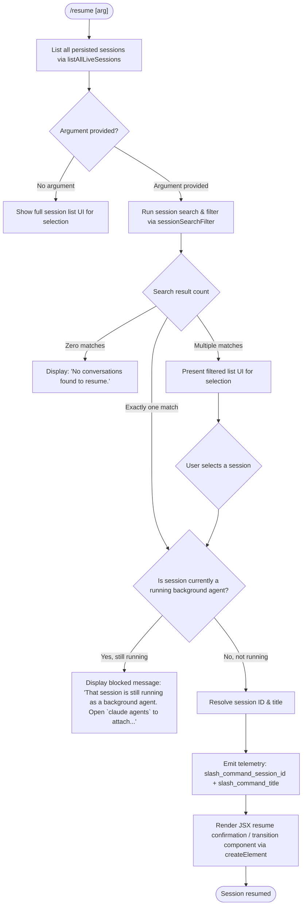

# `/resume`

> Analysis basis: CC v2.1.150 bundle.js (AST extraction + Claude interpretation)
> Minimum version: v2.1.150

---

## Overview

The `/resume` command (aliased as `/continue`) allows the user to pick up a previous Claude Code conversation by session ID or search term. It queries all persisted sessions, filters and ranks them against the user's argument, and then either opens the matched session directly or presents a selection UI when multiple candidates exist. If the target session is currently running as a background agent, the command blocks the resume and instructs the user to use `/agents` instead.

---

## Registration

| Field | Value |
|---|---|
| type | `local-jsx` |
| name | `resume` |
| description | `Resume a previous conversation` |
| argumentHint | `[conversation id or search term]` |
| aliases | `["continue"]` |
| module_id | `MC1` |
| load_inline | `true` |
| loc_byte | `11809417` |
| loc_byte_end | `11809614` |
| loc_line | `9442` |
| arbor_handler.name | `qsL` |
| arbor_handler.fqn | `claude-2.1.150::qsL` |
| arbor_handler.kind | `AsyncFunction` |
| arbor_handler.resolution_path | `module_id` |
| arbor_handler.n_hits | `0` |

Analysis basis: CC v2.1.150 bundle.js:+11809417

---

## Input Branching

The handler has more than three distinct outcome branches, so a flowchart is used.



Analysis basis: CC v2.1.150 bundle.js:+11808009 (handler entry `qsL`), +11808019 (background-agent block message), +11808454 (no-results message), +11808573 (filter step), +11808715 (session_id telemetry key), +11808939 (title telemetry key)

---

## Behavioral Spec

### 1. Session Enumeration

```
async function enumerateSessions():
    sessions = await listAllLiveSessions()   // S7H → A.listAllLiveSessions
    // Sessions carry status fields including "interactive", "background session",
    // "stopped", "resuming", etc.
    return sessions
```

`listAllLiveSessions` is reached via helper `S7H`, which wraps a `Promise.resolve` path and calls `A.listAllLiveSessions`.
Analysis basis: CC v2.1.150 bundle.js:+11808009, +8656437, +8656489

---

### 2. Session Search and Ranking (`sessionSearchFilter` / `shH`)

```
function sessionSearchFilter(sessions, rawArg, nowMs):
    nowMs = Date.now()
    worktreePaths = runGitWorktreeListPorcelain()  // "worktree list --porcelain"
    // parse output lines starting with "worktree " (prefix length 9)
    // normalise via Unicode NFC

    if rawArg starts with a session-id prefix:
        candidate = sessions.find(s => s.id.startsWith(strippedArg))
        if candidate found: return [candidate]

    filtered = sessions.filter(s => s.id or title matches rawArg, case-insensitive)
    return filtered.sort(localeCompare)   // $.localeCompare
```

Key literals used internally: `"worktree"`, `"list"`, `"--porcelain"` (git subcommand arguments), prefix length `9` for `"worktree "`, Unicode form `"NFC"`.
Analysis basis: CC v2.1.150 bundle.js:+11804846, +11804881, +11804890, +11804901, +11804908, +11805071, +11805109, +11805140, +11805153, +11805248, +11805267, +11805294, +11805327

Telemetry event `tengu_worktree_detection` is emitted during this phase.
Analysis basis: CC v2.1.150 bundle.js:+11804990

---

### 3. Background-Agent Guard

```
function checkNotRunningAsBackgroundAgent(session):
    if session.status == "background session" and session.state != "stopped":
        return ERROR(
            "That session is still running as a background agent. " +
            "Open `claude agents` to attach to it, or stop it there first to resume here."
        )
    return OK
```

The exact error string is sourced directly from the bundle.
Analysis basis: CC v2.1.150 bundle.js:+11808019

---

### 4. Main Handler Logic (`qsL`)

```
async function resumeCommandHandler(userArg, appState):
    sessions = await enumerateSessions()                        // S7H
    randomDelay = scheduleRandomDelay()                         // H → Math.random + setTimeout

    if sessions is empty OR (userArg present AND search yields zero):
        display("No conversations found to resume.")            // literal at +11808454
        return

    if userArg present:
        candidates = sessionSearchFilter(sessions, userArg)     // shH
    else:
        candidates = sessions (all)

    if candidates.length == 0:
        display("No conversations found to resume.")
        return

    if candidates.length == 1:
        session = candidates[0]
    else:
        session = await renderSelectionUI(candidates)           // Zc → list rendering
        if user cancels: return

    guardResult = checkNotRunningAsBackgroundAgent(session)
    if guardResult is ERROR:
        display(guardResult.message)
        return

    // Resolve display metadata
    title = resolveSessionTitle(session)                        // qC1 → j6.bold for bold title
    sessionId = session.id

    // Emit telemetry keys for downstream tracking
    appState.set("slash_command_session_id", sessionId)         // literal +11808715
    appState.set("slash_command_title", title)                  // literal +11808939

    // Build and render JSX resume element
    element = Mw.createElement(ResumeComponent, {
        session: session,
        timestamp: Date.now()
    })
    renderElement(element)                                       // iE8 → KN6 → Ar1 context tree
```

Analysis basis: CC v2.1.150 bundle.js:+11808017 (H random delay), +11808240 (RH path), +11808269 (EH path), +11808305 (createElement), +11808331 (Date.now), +11808376 (shH search call), +11808380 (j_ path), +11808394 (iE8 render), +11808555 (kr validation), +11808573 (M.filter), +11808587 (Cf), +11808681 (wo), +11808693 (b7H session store), +11808709 (q state), +11808760 (sW6 context), +11808821 (dLH), +11808840 (Zc list), +11808989 (qC1 title renderer)

---

### 5. Session List Rendering (`Zc`)

```
function renderSessionList(sessions, userArg):
    filtered = sessions
        |> toLowerCase for comparison
        |> M.filter for type/status exclusions
        |> check D.includes for additional filtering
        |> build display entries via Cf
        |> deduplicate via O (Map keyed by session id)
        |> sort z.sort
        |> z.slice for display limit
    return filteredList
```

Analysis basis: CC v2.1.150 bundle.js:+12789521, +12789581, +12789606, +12789706, +12789754, +12789772, +12789810, +12789828, +12789854, +12789920

---

### 6. Path Completion / Argument Hint Resolution (`iE8` → `KN6` → `Ar1`)

When the user is typing the argument, the command provides completion candidates. The completion subsystem (`KN6` → `Ar1`) walks project directories, reads git worktrees, and assembles a sorted completion list. It separates entries with `", "` (literal at +12801892) and pads columns to width `40` (literal at +15286881).

Analysis basis: CC v2.1.150 bundle.js:+11808394, +12801779, +12801826, +12801885, +12801892, +12802007, +15286881

---

### 7. Error / Logging Path (`RH`)

Errors encountered during resume are routed through the structured error handler (`RH`), which:
- Calls `c_` to format the error (wraps via `Error` + `String` coercion)
- Manages a bounded error queue (`xiK`) using `Hm6.shift` / `Hm6.push`
- Appends to a persistent error log array (`dxH.push`)
- Emits to structured logger `ll.logError` with level `"error"`

Analysis basis: CC v2.1.150 bundle.js:+11808240, +968515, +968528, +968857, +968875, +968890, +968915

---

## State & Side Effects

| Item | Detail |
|---|---|
| Telemetry — `tengu_worktree_detection` | Emitted during git worktree enumeration in `shH` (bundle.js:+11804990) |
| Telemetry — `tengu_transcript_phantom_parent` | May fire during conversation chain traversal in `FL5` (bundle.js:+12794245) |
| Telemetry — `tengu_transcript_parent_cycle` | Emitted if a cycle is detected in the message parent chain (bundle.js:+12797808) |
| Telemetry — `tengu_chain_parent_cycle` | Emitted by chain-build step `C7H` on cycle detection (bundle.js:+12776287) |
| Telemetry — `tengu_chain_timestamp_fallback` | Emitted when chain ordering falls back to timestamp (bundle.js:+12776436) |
| Telemetry — `tengu_chain_parallel_tr_recovered` | Emitted on parallel tool-result recovery in chain build (bundle.js:+12778302) |
| Telemetry — `tengu_relink_walk_broken` | Emitted if relink walk finds a broken parent reference (bundle.js:+12775797) |
| appState changes | `slash_command_session_id` and `slash_command_title` are written into app state on successful session resolution (bundle.js:+11808715, +11808939) |
| JSX element creation | `Mw.createElement` is called to build the resume UI component (bundle.js:+11808305) |
| Git subprocess | `git worktree list --porcelain` is spawned during search to discover worktree paths (bundle.js:+11804881, +11804890, +11804908) |
| Error queue | Bounded error queue managed via shift/push in `xiK`; overflow appended to `dxH` (bundle.js:+11808240, +968857, +968875) |
| Sound | <!-- TODO: not found in depth-2 traversal; needs --depth 4 --> |
| Hook registration | <!-- TODO: not found in depth-2 traversal; needs --depth 4 --> |

---

## Version History

| Version | Change |
|---|---|
| v2.1.150 | Initial analysis |

---

## Common Mistakes

1. **Attempting to resume a running background session** — If a session is still active as a background agent, `/resume` will refuse with an explicit message directing you to `/agents`. You must stop or detach the background session first.
2. **Ambiguous search term** — Providing a partial term that matches multiple sessions will trigger the interactive selection UI rather than resuming immediately. Use a unique session ID prefix for deterministic behaviour.
3. **Using the alias without awareness** — `/continue` is a registered alias for `/resume` and behaves identically; mixing both in scripts may cause confusion.
4. **Expecting instant availability of very recent sessions** — The command calls `listAllLiveSessions` which reads persisted state; sessions that were just created milliseconds ago may not yet appear.
5. **Unicode in session titles** — The search path applies Unicode NFC normalisation (`"NFC"` literal at bundle.js:+11805153) to worktree paths; manually constructed session IDs with non-NFC characters may not match as expected.

---

## Appendix — Identifier Mapping

> For bundle debugging only. Identifiers change across versions.

| Identifier | Role |
|---|---|
| `qsL` | Main async handler for `/resume` command (arbor_handler) |
| `LC1` | Pre-filter step over session list before handler entry |
| `Cf` | Session display/formatting helper used in list building |
| `S7H` | Session enumeration wrapper (`listAllLiveSessions`) |
| `shH` | Session search-and-filter function (worktree + title matching) |
| `G_` | Process/spawn orchestrator reached from search path |
| `lWH` | Lower-level subprocess launcher (Bun/Node spawn abstraction) |
| `RH` | Structured error handler and error-queue manager |
| `c_` | Error formatting helper (wraps `Error` + `String`) |
| `mH` | String coercion / message formatter |
| `G1` | Error normalisation step calling `Z2A` |
| `Z2A` | Secondary string normaliser via `mH` |
| `xiK` | Bounded error-queue manager (shift/push on `Hm6`) |
| `EH` | Alternate error path with `String` coercion |
| `j_` | Path utility / join helper (used in completions) |
| `Dv` | Low-level path or string primitive |
| `iE8` | Completion / render entry point |
| `KN6` | Completion list builder; joins paths, sorts entries |
| `Ar1` | Full completion tree walker (directory + git aware) |
| `Xd` | Path join helper using `UDH.join` and `projects` directory |
| `W` | Skills/debounce manager with `setTimeout`/`clearTimeout` |
| `K` | Column padding helper (`padEnd` to width 40) |
| `L9` | Async helper inside completion pipeline |
| `qPH` | Completion entry processor with slice and push |
| `ze_` | Recursive directory reader for completions |
| `av6` | Completion cache get/set layer |
| `Jz` | String replacement / slice utility for completion display |
| `G` | Keyboard/event handler (preventDefault + focus logic) |
| `Y` | Supervisor / MCP config manager |
| `GSH` | Buffer-based completion encoder with `Buffer.alloc` |
| `aL5` | Completion record parser (daemon/daemon-worker detection) |
| `kr` | Regex-based session ID validator (`Hp7.test`) |
| `wo` | Session store accessor |
| `b7H` | Conversation store façade (get/filter across all map stores) |
| `b8H` | Full conversation state initialiser and multi-map manager |
| `jL5` | Session entry constructor |
| `x` | Write-buffered output stream with `clearTimeout`/`$.write` |
| `TR` | Transport/connection record |
| `c5A` | Message content normaliser (`Array.isArray` + pop/push) |
| `Q5A` | Content type checker (`aZK.test`) |
| `d5A` | Content string replacer |
| `iP` | Identity/permission check helper |
| `f` | MCP server state manager (get/set across `L` map) |
| `UyH` | MCP client connector (stdio/sse/http/ws-ide types) |
| `gDK` | MCP update applier (`applyMcpUpdate`, `cleanup`) |
| `lv5` | MCP retry/recovery orchestrator |
| `O` | Session status tracker (`k8` state machine) |
| `k8` | Session status state machine |
| `z` | Background-session lifecycle manager |
| `bH` | Feature flag "ok" reporter (`tengu_feature_ok`) |
| `uH` | Feature flag "bad" reporter (`tengu_feature_bad`) |
| `Rk` | First-party tool registrar |
| `pu` | Process exit coordinator (`Promise.race` + `process.exit`) |
| `w` | Daemon/worker session dispatcher |
| `C` | Daemon writer (`z.write`, `RH` error path) |
| `Oz6` | Config file reader (`vP.readFile` → JSON parse) |
| `g` | Retired-session filter (`v6.filter`) |
| `yqA` | Background-session claim handler (`bB.claim`) |
| `uqA` | Session lifecycle finaliser (roster, unlink, cleanup) |
| `S` | Output stream / TTY writer |
| `V` | Conversation turn manager |
| `Q` | Conversation file reader/unlinker (`WZ6`/`KE1`) |
| `WZ6` | Conversation file read helper (`Tu.readFile`) |
| `KE1` | Conversation file unlink helper (`Tu.unlink`) |
| `I` | Away-summary trigger and turn manager |
| `PJ8` | Away-summary state reader (`_sH.getState`) |
| `a05` | Away-summary pre-check (`pAA`) |
| `ELK` | Token/rate-limit guard |
| `V48` | Away-summary API call with `AbortController` |
| `YJ1` | UUID generator (`pV.randomUUID`) |
| `B` | Message history accessor |
| `h` | Idle/blur timer manager (`Math.min`, `I`, `ELK`) |
| `tg` | Idle-timer callback |
| `FL5` | Conversation transcript parser (binary JSONL reader) |
| `s` | Ref-based silence-timeout recorder |
| `Hr1` | Binary record accessor (`A.at`) |
| `DH` | Streaming enqueue helper |
| `g6` | JSON parse wrapper |
| `R` | Seen-UUIDs set tracker |
| `y` | Output write helper (`z.write`) |
| `UL5` | Buffer comparison utility |
| `l` | Output filter (`o.filter`) |
| `HH` | Ref-based max-duration-cap recorder |
| `t` | Ref-based focus-timeout recorder |
| `e` | Notification manager (`H.addNotification`) |
| `LH` | Notification + DH + Z + I combiner |
| `o` | Voice recording session manager |
| `gL5` | Synchronous file reader for conversation records |
| `m` | Debounced progress writer (`setTimeout`/`z.write`) |
| `b` | Timer handle with `unref` |
| `xi1` | Conversation index manager (get/set/delete across maps) |
| `NL5` | Parent-chain walker (`tengu_relink_walk_broken`) |
| `t8` | Low-level primitive wrapper |
| `BL5` | Binary conversation file writer/merger |
| `eWH` | JSON-stream parser dispatcher |
| `raK` | JSON-stream parser entry |
| `oaK` | JSON-stream token reader (indexOf + concat) |
| `saK` | JSON-stream string extractor (`xC`) |
| `aaK` | JSON-stream object extractor (indexOf + JSON.parse) |
| `s9` | Session key formatter (`K8`) |
| `d` | Permission-rule manager (`W6A`) |
| `W6A` | Permission store |
| `r` | Permission composite (`w` + `d`) |
| `Rv8` | ISO date parser (`Date.parse`) |
| `C7H` | Conversation chain builder (`tengu_chain_*` telemetry) |
| `yL5` | Chain NaN-guard and value iterator |
| `hL5` | Chain entry sorter and deduplicator |
| `IL5` | Chain shift/queue manager |
| `si1` | Chain sibling-set builder |
| `ZaH` | Chain map transformer (`H.map`) |
| `Ge_` | Content replaceAll + slice sanitiser |
| `RV6` | Message text extractor (Array.isArray + `i1` parser) |
| `i1` | Inline-code / command-args parser (regex exec) |
| `Ee_` | Content-type classifier (`SL5` + `RL5`) |
| `SL5` | Scalar content type checker (trim + Array.isArray + some) |
| `RL5` | Array content type checker |
| `Cv8` | Conversation chunk cache (get/set/push) |
| `bv8` | Conversation chunk lister (`Array.from` + `H.values`) |
| `sW6` | Full session-state resolver (all map `.get` calls) |
| `_r1` | Session initialiser (`b8H` + `Object.assign`) |
| `QL5` | Path resolver for session files (`Wh` + `j_` + `$O`) |
| `Wh` | Home-directory helper (`Dv`) |
| `BT` | Directory listing helper (`Gm.readdir` + `Jz`) |
| `$e_` | Compound content extractor (`Ge_` + `ZaH` + `Ee_`) |
| `dLH` | Display-list header helper |
| `Zc` | Session list renderer (filter + sort + slice for display) |
| `qC1` | Title bold-formatter (`j6.bold`) |
| `OaK` | String coercion wrapper (`String`) |
| `Dz` | Daemon-mode flag accessor |
| `N` | Logger / output channel (debug/warn/error levels) |
| `K8` | Key serialiser |
| `D` | Session dispatch / boot orchestrator |
| `V6` | React-like component registry |
| `Kv8` | Memory-budget checker (`a6` + `V6`) |
| `kqA` | Background spare-process spawner (`Bun.spawn`) |