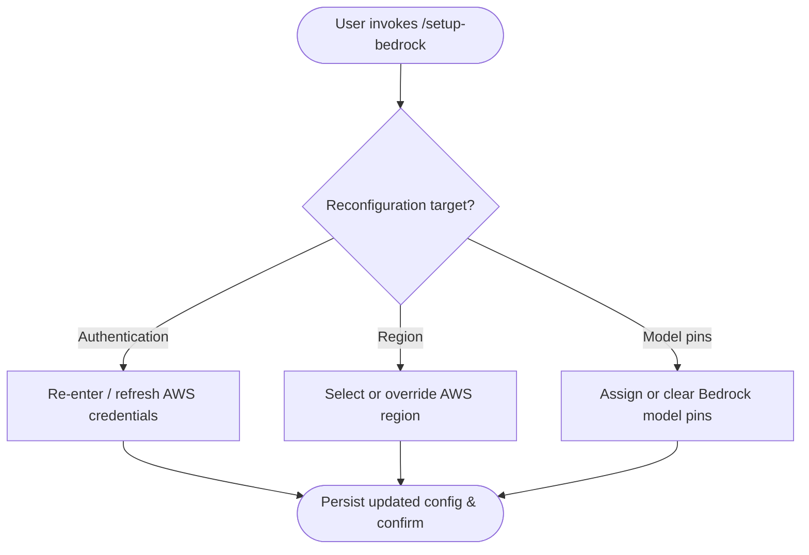

# `/setup-bedrock`

> Analysis basis: CC v2.1.144 bundle.js (AST extraction + Claude interpretation)
> Minimum version: v2.1.144

---

## Overview

The `/setup-bedrock` slash command allows users to reconfigure their Amazon Bedrock integration within Claude Code, covering authentication credentials, AWS region selection, and model pin assignments. It is registered as a `local-jsx` command, meaning its UI is rendered as a JSX component inline within the CLI session rather than emitting plain text output. Because the AST traversal did not resolve any entry-point functions for module `tjq`, all behavioral detail below is derived strictly from the registration record; deeper implementation specifics require a wider traversal depth.

---

## Registration

| Field | Value |
|---|---|
| type | `local-jsx` |
| name | `setup-bedrock` |
| description | `Reconfigure Amazon Bedrock authentication, region, or model pins` |
| loc\_line | `6682` |
| module\_id | `tjq` |
| `loc_byte_end` | `11810643` |
| `arbor_handler.name` | `LsL` |
| `arbor_handler.kind` | `AsyncFunction` |
| `arbor_handler.resolution_path` | `module_id` |
| `arbor_handler.fqn` | `claude-2.1.150::LsL` |
| `arbor_handler.n_hits` | `1` |

Analysis basis: CC v2.1.144 bundle.js:+11244413

---

## Input Branching

The depth-2 AST traversal returned an empty call graph for module `tjq`, so no branching logic could be extracted automatically. The registration description enumerates three distinct reconfiguration surfaces — authentication, region, and model pins — which implies at least three top-level branches exist in the implementation.



> **Note:** The branching paths shown above are inferred from the description string literals in the registration record. They have not been verified against implementation code because `callGraph` is empty for this module.
> <!-- TODO: not found in depth-2 traversal; needs --depth 4 -->

---

## Behavioral Spec

<!-- TODO: not found in depth-2 traversal; needs --depth 4 -->

Because the AST extraction produced no entry functions, call edges, or string/number literals for module `tjq`, no verified pseudocode can be written for the implementation body. The following skeleton captures what is structurally guaranteed by the registration record alone.

### Command Dispatch

```
function invokeSetupBedrock(slashCommandInput):
    # Triggered when the user types /setup-bedrock in a CC session.
    # Renders a local JSX component rather than printing plain text.
    renderLocalJsxComponent(
        module = "tjq",
        props  = slashCommandInput
    )
    # Further branching (auth / region / model-pins) occurs inside
    # the JSX component tree. See TODO note above.
```

Analysis basis: CC v2.1.144 bundle.js:+11244413 (registration `type: "local-jsx"`)

### Configuration Persistence

```
# Expected pattern for any "setup-*" local-jsx command in CC:
function persistBedrockConfig(updatedFields):
    validate(updatedFields)          # field-level checks (types, required values)
    writeToUserConfig(updatedFields) # persisted to local Claude Code config store
    notifySession(updatedFields)     # propagate changes to active session state
```

> The above is a descriptive pseudocode pattern common to setup-style commands. It is **not** derived from extracted literals or call edges for this specific module.
> <!-- TODO: not found in depth-2 traversal; needs --depth 4 -->

---

## State & Side Effects

| Item | Detail |
|---|---|
| Telemetry | None detected — `telemetry` array is empty for module `tjq` <!-- TODO: not found in depth-2 traversal; needs --depth 4 --> |
| Hook registration | <!-- TODO: not found in depth-2 traversal; needs --depth 4 --> |
| appState changes | <!-- TODO: not found in depth-2 traversal; needs --depth 4 --> |
| Sound | <!-- TODO: not found in depth-2 traversal; needs --depth 4 --> |
| Config persistence | Expected to modify Bedrock-related fields in the local CC configuration store (inferred from description) |
| Render mode | Renders as an inline JSX component (`type: "local-jsx"`) rather than producing streaming text |

Analysis basis: CC v2.1.144 bundle.js:+11244413

---

## Version History

| Version | Change |
|---|---|
| v2.1.144 | Initial analysis — registration record confirmed; implementation body not reachable at depth ≤ 2 |

---

## Common Mistakes

1. **Expecting plain-text output.** Because this command is registered as `local-jsx`, its UI is rendered as an interactive JSX component. Scripting or piping the raw output of `/setup-bedrock` will not yield structured text in the way that plain-text commands do.
2. **Assuming all three surfaces always appear.** The description lists authentication, region, and model pins as reconfiguration targets, but the actual UI flow may present them conditionally depending on the current configuration state. Do not assume all three options are always visible.
3. **Conflating `/setup-bedrock` with first-time setup.** The command description uses the word "Reconfigure," indicating it is intended for users who have already completed initial Bedrock onboarding. First-time setup may follow a different code path.
4. **Editing the config file manually before running this command.** Because the command writes to the same config store it reads from, manual edits made while a CC session is active may be overwritten or cause conflicts.
5. **Expecting telemetry confirmation.** No `tengu_*` telemetry events were found in the depth-2 traversal for this module. Do not rely on telemetry signals to confirm that the command executed successfully.

---

## Appendix — Identifier Mapping

> For bundle debugging only. Identifiers change across versions.

| Identifier | Role |
|---|---|
| `tjq` | Module ID for the `/setup-bedrock` command implementation |

> No obfuscated short-form function identifiers were present in the `identifiers` array returned by the depth-2 AST extraction. A wider traversal (depth ≥ 4) is required to populate this table.
> <!-- TODO: not found in depth-2 traversal; needs --depth 4 -->