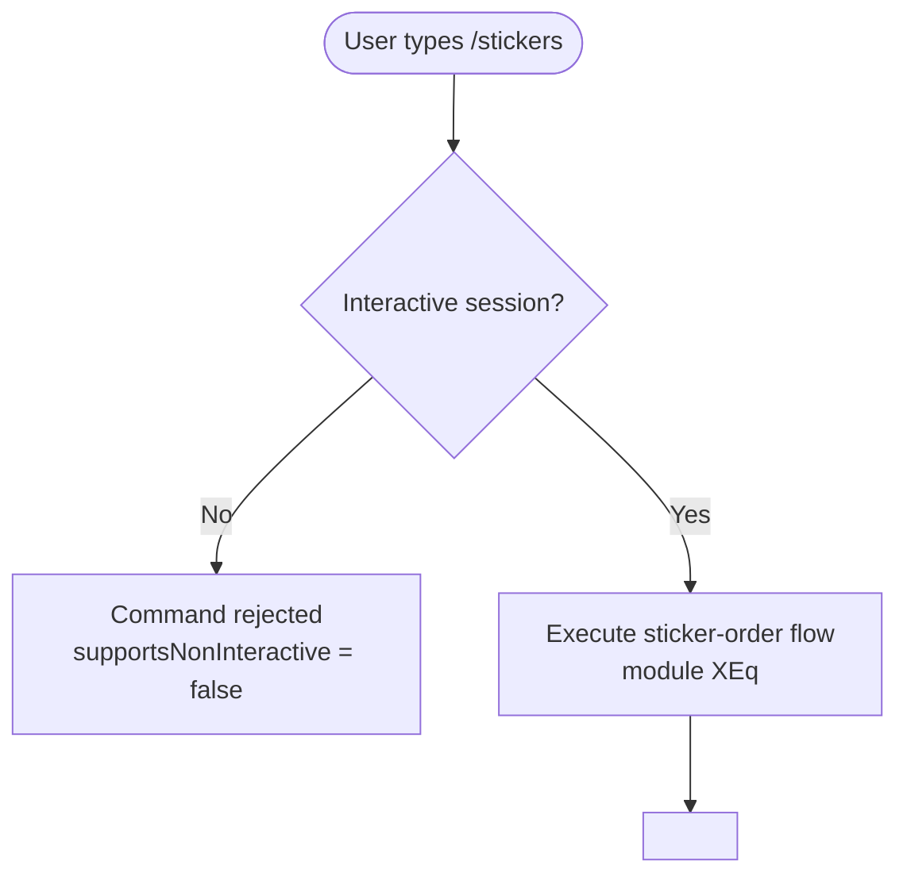

# `/stickers`

> Analysis basis: CC v2.1.144 bundle.js (AST extraction + Claude interpretation)
> Minimum version: v2.1.144

---

## Overview

The `/stickers` slash command allows users to order physical Claude Code stickers directly from within the CLI. It is a locally-scoped command requiring an interactive terminal session. The command's implementation module (`XEq`) did not expose resolvable entry-point functions within the depth-2 AST traversal; all behavioral details below are derived exclusively from the registration object and noted extraction metadata.

---

## Registration

| Field | Value |
|---|---|
| type | `local` |
| name | `stickers` |
| description | `Order Claude Code stickers` |
| supportsNonInteractive | `false` |
| module_id | `XEq` |
| `loc_byte_end` | `12239814` |
| `arbor_handler.name` | `m85` |
| `arbor_handler.kind` | `AsyncFunction` |
| `arbor_handler.resolution_path` | `module_id` |
| `arbor_handler.fqn` | `claude-2.1.150::m85` |
| `arbor_handler.n_hits` | `0` |

Analysis basis: CC v2.1.144 bundle.js:+11644720

---

## Input Branching

Because no call graph or literals were recovered from module `XEq` (see extraction note below), a complete branching flowchart cannot be produced from verified data.



> **Extraction note:** The AST traversal reported `"no entry functions found for module 'XEq'"`. All nodes beyond the registration boundary are unresolved at the current traversal depth.

Analysis basis: CC v2.1.144 bundle.js:+11644720

---

## Behavioral Spec

### Interactive-Only Guard

The registration field `supportsNonInteractive: false` means the CLI framework will block execution of this command when stdin is not a TTY or when the `--no-interactive` / pipe-mode flag is active.

```
function invokeStickers(sessionContext):
    if sessionContext.isInteractive == false:
        raise CommandNotAvailableError("/stickers requires an interactive session")
    else:
        dispatchStickerOrderFlow()   // internals in module XEq; not resolved
```

Analysis basis: CC v2.1.144 bundle.js:+11644720

### Sticker-Order Flow

<!-- TODO: not found in depth-2 traversal; needs --depth 4 -->

The internal implementation of `dispatchStickerOrderFlow()` resides in module `XEq`. No entry functions, call edges, string literals, or telemetry events were recovered by the depth-2 AST walk. The precise URL, form interaction, confirmation message, and any network call behavior are therefore unverified and cannot be documented at this time.

---

## State & Side Effects

| Item | Detail |
|---|---|
| Telemetry | None detected — no `tengu_*` events found in depth-2 traversal |
| Hook registration | <!-- TODO: not found in depth-2 traversal; needs --depth 4 --> |
| appState changes | <!-- TODO: not found in depth-2 traversal; needs --depth 4 --> |
| Sound | <!-- TODO: not found in depth-2 traversal; needs --depth 4 --> |
| Network / URL | <!-- TODO: not found in depth-2 traversal; needs --depth 4 --> |

Analysis basis: CC v2.1.144 bundle.js:+11644720

---

## Version History

| Version | Change |
|---|---|
| v2.1.144 | Initial analysis — registration confirmed; implementation internals unresolved pending deeper traversal |

---

## Common Mistakes

1. **Running in non-interactive mode**: Because `supportsNonInteractive` is `false`, invoking `/stickers` inside a script, CI pipeline, or piped shell session will cause the command to be rejected. Always run it in a live terminal session.
2. **Expecting programmatic output**: This command is designed for human interaction (sticker ordering), not for machine-readable output. Do not rely on stdout from this command in automated workflows.
3. **Assuming telemetry exists**: No telemetry events were found at the current analysis depth. Do not infer event names from other commands — they may not apply here.

---

## Appendix — Identifier Mapping

> For bundle debugging only. Identifiers change across versions.

| Identifier | Role |
|---|---|
| XEq | Module containing the `/stickers` command implementation |

> No obfuscated short-form identifiers were returned in the `identifiers` array for this command. The only resolvable symbol is the module ID `XEq`, which is treated as an opaque bundle module reference rather than a mangled local variable name.