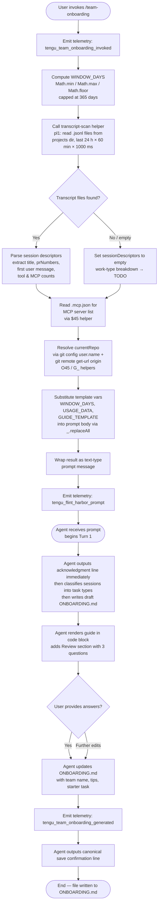

# `/team-onboarding`

> Analysis basis: CC v2.1.150 bundle.js (AST extraction + Claude interpretation)
> Minimum version: v2.1.150

---

## Overview

`/team-onboarding` is a `prompt`-type slash command that co-authors a personalized `ONBOARDING.md` guide for teammates new to Claude Code. It scans the invoking user's local Claude Code session transcripts (up to 365 days back), classifies work patterns into task-type categories, and drives a two-turn collaborative authoring loop — producing a concrete draft first, then asking three targeted review questions before finalising the file.

---

## Registration

| Field | Value |
|---|---|
| type | `prompt` |
| name | `team-onboarding` |
| description | Help teammates ramp on Claude Code with a guide from your usage |
| isHidden | `false` |
| handler_method | `getPromptForCommand` |
| handler_method_start (byte) | `12590360` |
| handler_method_end (byte) | `12591070` |
| loc_byte | `12590022` |
| loc_byte_end | `12591071` |
| loc_line | `10677` |
| prompt_body.length | `4539` characters |
| prompt_body.trace | `identifier→$ (local→1 ext vars)` |
| arbor_handler.name | `getPromptForCommand` |
| arbor_handler.kind | `Method` |
| arbor_handler.fqn | `claude-2.1.150::getPromptForCommand` |
| arbor_handler.resolution_path | `direct` |
| arbor_handler.n_hits | `2` |
| `handler_method_start` | `12590360` |
| `handler_method_end` | `12591070` |

Analysis basis: CC v2.1.150 bundle.js:+12590022

---

## Input Branching

The handler has four or more distinct decision paths (window-days clamping, transcript scan, usage-data presence check, MCP server enumeration, guide template population), so a Mermaid flowchart is used.



---

## Behavioral Spec

### 1. Handler Entry — `getPromptForCommand`

The Arbor-resolved handler `getPromptForCommand` is an ObjectMethod on the registration object. At invocation it calls the utility `V6` (usage-data collector) and then runs the main handler body.

Analysis basis: CC v2.1.150 bundle.js:+12590360

```
function getPromptForCommand(context):
    emit telemetry "tengu_team_onboarding_invoked"         // +12590620
    windowDays = clampWindowDays(context.configuredDays)   // +12590563
    usageData  = collectTranscripts(windowDays)            // +12590669
    repoInfo   = resolveRepoContext()                      // +12590798
    prompt     = buildPrompt(windowDays, usageData, repoInfo) // +12590807
    emit telemetry "tengu_flint_harbor_prompt"             // +12590397
    return { type: "text", content: prompt }               // +12591054
```

### 2. Window-Days Clamping

```
function clampWindowDays(rawDays):
    // Maximum look-back is 365 days (literal at +12590609)
    return Math.floor(Math.max(1, Math.min(rawDays, 365)))
```

Analysis basis: CC v2.1.150 bundle.js:+12590563 – +12590609

### 3. Transcript Scan — `pl1`

Reads the user's local Claude Code project transcript directory, filtering to `.jsonl` files. Timestamp cutoff is computed as `Date.now() - windowDays × 24 × 60 × 60 × 1000` (constants at +12578858–+12578867).

```
async function scanTranscripts(projectsDir, windowDays):
    cutoffMs = Date.now() - windowDays * 24 * 60 * 1000   // hours×min×sec×ms
    files    = await fs.readdir(projectsDir)
    jsonlFiles = files.filter(f => f.endsWith(".jsonl"))   // literal ".jsonl" +12578973
    results  = []
    for each file in jsonlFiles:
        stat = await fs.stat(join(projectsDir, file))
        if stat is not a file: continue
        raw  = await fs.readFile(join(projectsDir, file))
        lines = raw.split("\n")
        // extract: session title, prNumbers via regex q45/K45/L45,
        // first user message, MCP tool call counts
        // regex for MCP server names via literal "\"name\":\"mcp__" (+12579552)
        // regex for content arrays via literal "\"content\":[" (+12579902)
        sessionDescriptor = parseSession(lines)
        results.push(sessionDescriptor)
    return results
```

Analysis basis: CC v2.1.150 bundle.js:+12578845 – +12580042

### 4. MCP Server Discovery — `$45`

Reads the project-level `.mcp.json` file (literal at +12581084), parses `mcpServers` key (literal at +12581140), and returns an array of `{ name, urlOrigin? }` entries for each configured server.

```
async function readMcpServers(projectRoot):
    mcpPath = join(projectRoot, ".mcp.json")               // literal ".mcp.json" +12581084
    try:
        raw     = await fs.readFile(mcpPath, "utf8")       // literal "utf8" +12581097
        parsed  = JSON.parse(raw)
        return parsed.mcpServers ?? {}                      // literal "mcpServers" +12581140
    catch (ENOENT / parse error):
        return {}
```

Analysis basis: CC v2.1.150 bundle.js:+12581060 – +12581319

### 5. Repository Context — `O45` / `G_`

Determines `currentRepo` name and remote origin URL by spawning `git config user.name` and `git remote get-url origin` (literals at +12581707–+12581798). Falls back gracefully when git is unavailable. Path resolution uses `sV8.basename` (+12581895) to derive a short repo name.

```
async function resolveRepoContext(cwd):
    try:
        userName   = await runGit(["config", "user.name"], cwd)  // +12581714, +12581723
        remoteUrl  = await runGit(["remote", "get-url", "origin"], cwd) // +12581779–+12581798
        repoName   = path.basename(stripGitSuffix(remoteUrl))
    catch:
        repoName   = path.basename(cwd)
    return { repoName, userName, remoteUrl }
```

Analysis basis: CC v2.1.150 bundle.js:+12581385 – +12581895

### 6. Prompt Assembly — template variable substitution

Three template placeholders are replaced in the stored prompt body:

| Placeholder | Replaced With | Literal Source |
|---|---|---|
| `{{WINDOW_DAYS}}` | Clamped integer (≤ 365) | +12590820 |
| `{{USAGE_DATA}}` | JSON-serialised `usageData` object | +12590895 |
| `{{GUIDE_TEMPLATE}}` | Internal guide template string | +12590860 |

Replacement uses `String.prototype.replaceAll` (+12590807) after converting values via `String()` (+12590838).

Analysis basis: CC v2.1.150 bundle.js:+12590807 – +12590895

### 7. Agent Behaviour — Turn 1 (driven by prompt body, length 4539 chars)

The prompt instructs the agent to follow this strict ordering:

```
function agentTurn1(usageData, guideTemplate):

    // Step 1 — mandatory first output (no thinking, no tool calls before this)
    print "> Looking at how you've used Claude over the last {WINDOW_DAYS} days..."

    // Step 2 — work-type classification
    taskBreakdown = classifySessions(usageData.sessionDescriptors)
    //   Categories (internal → display):
    //   build_feature   → "Build Feature"
    //   debug_fix       → "Debug Fix"
    //   improve_quality → "Improve Quality"
    //   analyze_data    → "Analyze Data"
    //   plan_design     → "Plan Design"
    //   prototype       → "Prototype"
    //   write_docs      → "Write Docs"
    //   Pick top 3-5 with rough percentages.
    //   If sessionDescriptors is empty → mark breakdown as TODO.

    // Step 3 — gather remaining pieces
    repos      = [usageData.currentRepo] + siblingDirs
    mcpServers = describe(usageData.mcpServers)   // infer purpose + access path
    // Team Tips & Get Started → leave as TODO placeholders

    // Step 4 — write ONBOARDING.md from guideTemplate
    //   Fill real numbers; use usageData.generatedBy for author name (omit if absent)
    //   ASCII bar charts: █ filled, ░ empty, 20 chars wide
    //   Keep HTML comment instruction at bottom verbatim
    writeFile("ONBOARDING.md", renderedGuide)

    // Step 5 — render guide in code block, then Review section
    print "```\n" + renderedGuide + "\n```"
    print "---"
    print "**Review**"
    print "1. Team name confirmation question"
    print "2. Starter task question (ticket/doc link, optional)"
    print "3. Team tips question (not already in CLAUDE.md)"
```

Analysis basis: CC v2.1.150 bundle.js:+12590360 – +12591070 (prompt body length 4539)

### 8. Agent Behaviour — Turn 2+ (revision loop)

```
function agentTurnN(userAnswers):
    update ONBOARDING.md with:
        - team name (from answer 1)
        - starter task (from answer 2, if provided)
        - team tips (from answer 3)
    apply any further edits requested by user
    // Final close-out line (exact, not paraphrased):
    print "Saved to `ONBOARDING.md`. Drop it in your team docs and channels ..."
    emit telemetry "tengu_team_onboarding_generated"   // +12590939
```

Analysis basis: CC v2.1.150 bundle.js:+12590916 – +12590939

### 9. Telemetry Emission — `RsH`

After the agent completes guide generation, `RsH` (+12590916) emits the `tengu_team_onboarding_generated` event. It calls `G1` (network/event emitter wrapper) and `eA` (event attribute builder), then calls `V6` to finalise dispatch.

Analysis basis: CC v2.1.150 bundle.js:+12590916

---

## State & Side Effects

| Item | Detail |
|---|---|
| Telemetry — invocation | `tengu_team_onboarding_invoked` (+12590620) emitted at handler entry |
| Telemetry — prompt dispatch | `tengu_flint_harbor_prompt` (+12590397) emitted when prompt is submitted to agent |
| Telemetry — completion | `tengu_team_onboarding_generated` (+12590939) emitted after guide is written |
| Telemetry — config errors (reachable) | `tengu_config_parse_error` (+3196285), `tengu_config_lock_contention` (+3193710), `tengu_config_stale_write` (+3193846), `tengu_config_auth_loss_prevented` (+3194189) |
| Telemetry — background daemon (reachable) | `tengu_bg_dispatch_sigkill_escalate`, `tengu_bg_dispatch_low_mem`, `tengu_bg_spare_enable`, `tengu_bg_spare_claim`, `tengu_bg_spare_claim_fail`, `tengu_bg_spare_spawn` |
| File written | `ONBOARDING.md` in the current working directory (created or overwritten) |
| Files read | Local `.jsonl` transcript files under the Claude Code projects directory; `.mcp.json` in project root |
| Git subprocess | `git config user.name` and `git remote get-url origin` spawned via `G_` helper |
| config lock | `f8` / `$f_` acquire a config file lock; contention emits `tengu_config_lock_contention` |
| Config backup | Up to 5 rolling backup copies kept (literal `5` at +3194640); backup files identified by `.backup.` suffix (literal at +3194507) |
| appState changes | None directly observed in depth-2 traversal |
| Sound | None observed |
| Hook registration | `a9` calls `W7A.register` (+58272) — file-watcher hook registered during transcript scan |

---

## Version History

| Version | Change |
|---|---|
| v2.1.150 | Initial analysis |

---

## Common Mistakes

1. **Expecting user input before the draft** — the command is designed to produce a concrete `ONBOARDING.md` draft in the very first turn. Invoking it and immediately asking the agent questions will be met with the draft first, by design.
2. **Assuming it reads remote data** — all session data is sourced from local `.jsonl` transcript files. Users who have cleared their history or run with a very short history window (or set 0 days) will receive a guide with the work-type breakdown marked as TODO.
3. **Invoking from a directory with no git remote** — the repo-name fallback uses `path.basename(cwd)`, so the guide will contain the directory name rather than the actual repo name. Users should run the command from within a git-tracked project directory when possible.
4. **Editing `ONBOARDING.md` manually before the Review round-trip** — the agent will overwrite the file after receiving review answers. Make manual edits only after the canonical save-confirmation line has been printed.
5. **Expecting MCP server setup instructions to be complete immediately** — the command infers server purpose from `name` and `urlOrigin`; access instructions for private or self-hosted MCP servers may need manual correction in the Review step.
6. **Confusing the window cap** — the maximum look-back is 365 days (literal at +12590609). Requesting a longer window has no effect; it will be silently clamped.

---

## Appendix — Identifier Mapping

> For bundle debugging only. Identifiers change across versions.

| Identifier | Role |
|---|---|
| `__handler_team-onboarding` | Synthetic BFS entry point for the command handler (not a real bundle symbol) |
| `V6` | Usage-data collector / top-level dispatch helper |
| `_$6` | Internal utility called by usage-data collector (depth-2) |
| `A$6` | Internal utility called by usage-data collector (depth-2) |
| `we` | Session-data assembly function |
| `mH` | String conversion/formatting helper |
| `Gb` | Session lookup / transcript reader helper |
| `OS` | Transcript entry parser |
| `we6` | Deduplication / session-cache manager |
| `BM_` | Cache-miss session builder |
| `aTH` | Session attribute extractor |
| `$p` | Random-ID / nonce generator (uses `randomBytes`) |
| `CH` | JSON serialiser wrapper |
| `ns4` | Event namespace helper |
| `cM_` | Session completion handler |
| `uE9` | Session hash/fingerprint helper |
| `HA` | Async task scheduler |
| `Zb9` | Session cleanup utility |
| `WxH` | Seen-set membership checker |
| `m6` | Config file read/write orchestrator |
| `Q6` | Path resolver utility |
| `Af_` | Config schema accessor |
| `JOH` | Config read helper (reads file, parses JSON, handles ENOENT) |
| `q` | Filesystem namespace (sync ops) |
| `g6` | JSON parse wrapper |
| `xC` | String prefix-stripper |
| `_` | General-purpose utility / filesystem wrapper |
| `K8` | Error classifier / re-throw helper |
| `mb9` | Backup directory scanner |
| `N` | Logging / structured-message formatter |
| `c` | Error constructor / throw helper |
| `Of_` | Path join + existence helper |
| `w` | Background daemon process manager |
| `Tt4` | Config file watcher |
| `rn` | Config schema validator |
| `a9` | File-watcher hook registrar |
| `f8` | Global config read/save (fallback path) |
| `$f_` | Project-scoped config read/save with lock |
| `L` | Active-operations tracker / lifecycle manager |
| `M` | Resource handle / stream closer |
| `_L9` | Config object merger (uses `Object.assign`) |
| `A__` | Config initialiser helper |
| `f$6` | Config field accessor |
| `A` | Lowercase-string normaliser |
| `V` | String prefix checker |
| `P` | MCP connection manager |
| `wh8` | MCP transport factory |
| `RH` | MCP client runner |
| `c_` | Error string extractor |
| `Z` | Array slice utility |
| `UK6` | Atomic file writer (temp-file + rename, with fchmod/fsync) |
| `O` | Filesystem stat result wrapper |
| `j8` | Error code extractor |
| `H` | General async helper / random-delay utility |
| `OFH` | Old-format config migration helper |
| `ub9` | Object-entries iterator helper |
| `zFH` | Timestamp recorder |
| `ff_` | Config directory writer (uses `UK6`) |
| `O45` | Top-level usage-data aggregator (calls `pl1`, `$45`, `G_`) |
| `j_` | Duration formatter |
| `Dv` | Duration unit definitions |
| `FT` | Project-path formatter |
| `Nv` | Projects-dir path builder |
| `Jz` | Path abbreviator / display trimmer |
| `PrK` | Path-segment length calculator |
| `pl1` | Transcript-file scanner (reads `.jsonl`, parses sessions) |
| `s9` | Error suppressor for ENOENT on readdir |
| `K` | Array map/pad utility |
| `$` | Claude message-stream parser |
| `HQ1` | Message-turn extractor |
| `z` | Daemon background-session controller |
| `bH` | Background-session stop helper |
| `uH` | Background-session start helper |
| `Rk` | Daemon command dispatcher |
| `pu` | Process lifecycle manager (race/exit) |
| `D` | Background worker spawner |
| `Kv8` | Platform-specific worker args builder |
| `kqA` | Bun-runtime subprocess spawner |
| `Dz` | Warn-level logger |
| `$45` | `.mcp.json` reader / MCP server list extractor |
| `f45` | MCP server filter/transform helper |
| `G_` | Git subprocess runner (resolves repo name + remote URL) |
| `lWH` | Child-process / subprocess library (low-level) |
| `SGA` | Process command builder |
| `Sd8` | Stream collector (stdout) |
| `Rd8` | Stream collector (stderr) |
| `bd8` | Kill-signal helper |
| `U0A` | Finite-number validator |
| `FK6` | Process error classifier |
| `hd8` | Reflect-apply subprocess invoker |
| `jGA` | Exit-event listener registrar |
| `p0A` | Timeout-race wrapper for promises |
| `B0A` | Kill-on-timeout helper |
| `u0A` | Data-event handler for subprocess streams |
| `m0A` | Signal-kill method |
| `DGA` | Parallel-stream drainer |
| `cK6` | Buffered-data accessor |
| `zGA` | Pipe-through stream helper |
| `YGA` | Writable-stream creator |
| `d0A` | stdout/stderr data binder |
| `OaK` | String coercion for subprocess output |
| `oWH` | Git URL normaliser / origin parser |
| `UaK` | URL host extractor |
| `Cq` | String index/slice utility |
| `RsH` | Post-generation telemetry emitter |
| `G1` | Network event emitter wrapper |
| `Z2A` | Event attribute builder |

---

Note: index built via Arbor fallback; some signals (telemetry, literals) may be missing — see arbor-fallback.js.