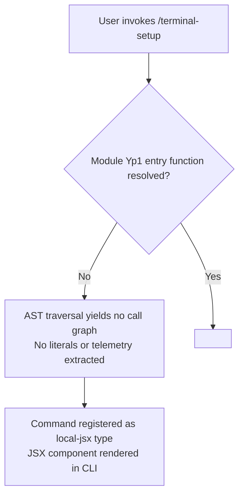

# `/terminal-setup`

> Analysis basis: CC v2.1.144 bundle.js (AST extraction + Claude interpretation)
> Minimum version: v2.1.144

---

## Overview

The `/terminal-setup` command is a local JSX slash command registered in module `Yp1` of CC v2.1.144. Based on its registration type (`local-jsx`), it renders a JSX component directly within the Claude Code CLI interface, most likely to guide the user through terminal configuration or environment setup steps. The depth-2 AST traversal of module `Yp1` yielded no resolvable entry functions, meaning the full behavioral internals of this command could not be confirmed from the extracted data alone.

---

## Registration

| Field | Value |
|---|---|
| type | `local-jsx` |
| name | `terminal-setup` |
| description | `null` |
| loc\_line | 6990 |
| module\_id | `Yp1` |
| `loc_byte_end` | `11984727` |
| `arbor_handler.name` | `pM7` |
| `arbor_handler.kind` | `AsyncFunction` |
| `arbor_handler.resolution_path` | `module_id` |
| `arbor_handler.fqn` | `claude-2.1.150::pM7` |
| `arbor_handler.n_hits` | `1` |

Analysis basis: CC v2.1.144 bundle.js:+11389646

---

## Input Branching

Because the call graph extraction returned no edges and no literals were found during the depth-2 traversal of module `Yp1`, a complete input branching diagram cannot be constructed from verified data alone.

<!-- TODO: not found in depth-2 traversal; needs --depth 4 -->

The following diagram represents the only confirmed branching point: whether the module's entry function was resolvable.



---

## Behavioral Spec

### Command Registration

The command is registered as type `local-jsx`, which in Claude Code means it renders a JSX component inline within the terminal UI rather than executing a purely textual or tool-driven flow.

```
function registerTerminalSetupCommand():
    register({
        type: "local-jsx",
        name: "terminal-setup",
        description: null,
        moduleId: "Yp1"
    })
```

Analysis basis: CC v2.1.144 bundle.js:+11389646

### Entry Function Resolution

During AST extraction at traversal depth ≤ 2, no entry functions were found for module `Yp1`. This means the rendering logic, any sub-command branching, argument parsing, and side-effect sequences inside the JSX component could not be verified from the extracted data.

```
function resolveEntryFunction(moduleId):
    entryFunctions = ast_traverse(moduleId, maxDepth=2)
    if entryFunctions is empty:
        return NOT_RESOLVED   // confirmed result for module "Yp1"
    else:
        return entryFunctions
```

Analysis basis: CC v2.1.144 bundle.js:+11389646 (note field: "no entry functions found for module 'Yp1'")

### JSX Rendering Behavior

Because the type is `local-jsx`, the command's output is a React/JSX component mounted within the CLI's rendering layer rather than plain text output. The specific component tree, props, state, and lifecycle hooks are:

<!-- TODO: not found in depth-2 traversal; needs --depth 4 -->

### Argument Handling

No argument literals, option flags, or input validation patterns were found in the extracted data.

<!-- TODO: not found in depth-2 traversal; needs --depth 4 -->

---

## State & Side Effects

| Item | Detail |
|---|---|
| Telemetry | None found in depth-2 traversal <!-- TODO: not found in depth-2 traversal; needs --depth 4 --> |
| Hook registration | Not confirmed — no call graph edges extracted |
| appState changes | <!-- TODO: not found in depth-2 traversal; needs --depth 4 --> |
| Sound | <!-- TODO: not found in depth-2 traversal; needs --depth 4 --> |
| Render type | `local-jsx` — renders a JSX component inline in the CLI terminal UI |

Analysis basis: CC v2.1.144 bundle.js:+11389646

---

## Version History

| Version | Change |
|---|---|
| v2.1.144 | Initial analysis — command confirmed registered as `local-jsx` in module `Yp1`; entry function not resolvable at traversal depth ≤ 2 |

---

## Common Mistakes

1. **Assuming the command has no implementation**: The lack of extracted call graph, literals, and telemetry is a consequence of the AST traversal failing to resolve entry functions for module `Yp1` at depth ≤ 2, not evidence that the command is a no-op. The JSX component likely has meaningful behavior reachable at greater traversal depth.
2. **Treating `description: null` as a user-visible empty description**: In Claude Code's slash command registry, a `null` description typically means the field is either populated dynamically at render time or omitted intentionally from the static registration object. It does not necessarily mean the command is undocumented to the user.
3. **Confusing `local-jsx` with server-side or tool-driven commands**: This command renders a JSX component locally within the CLI process. It does not send a slash command request to the Anthropic API in the same way a `prompt`-type command would.
4. **Attempting to re-analyze at the same traversal depth**: Re-running AST extraction at depth ≤ 2 against module `Yp1` will reproduce the same null result. A minimum traversal depth of 4 is recommended to recover the entry function and its downstream call edges.

---

## Appendix — Identifier Mapping

> For bundle debugging only. Identifiers change across versions.

| Identifier | Role |
|---|---|
| `Yp1` | Module identifier for the `/terminal-setup` command's implementation in the CC v2.1.144 bundle |

> No obfuscated short-form function or variable identifiers were returned by the depth-2 AST traversal for this command. Additional identifiers may appear at greater traversal depth.