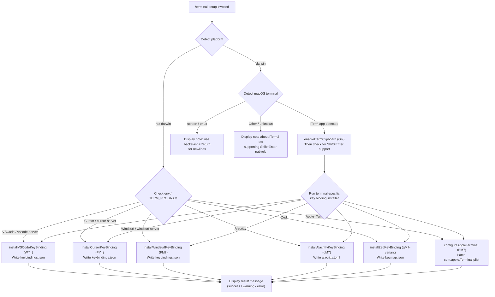

# `/terminal-setup`

> Analysis basis: CC v2.1.150 bundle.js (AST extraction + Claude interpretation)
> Minimum version: v2.1.150

---

## Overview

`/terminal-setup` detects the user's current terminal emulator and applies terminal-specific configuration changes to enable Shift+Enter as a newline key binding (and related improvements). It reads and patches configuration files for VS Code, Cursor, Windsurf, Alacritty, Zed, and macOS Terminal.app, and provides informational notes for terminals that already support Shift+Enter natively (iTerm2, WezTerm, Ghostty, Kitty, Warp, Windows Terminal).

---

## Registration

| Field | Value |
|---|---|
| type | `local-jsx` |
| name | `terminal-setup` |
| description | Install Shift+Enter key binding for newlines |
| loc_byte | `11984095` |
| loc_byte_end | `11984727` |
| loc_line | `9753` |
| module_id | `Ti9` |
| load_inline | `true` |
| arbor_handler.name | `pM7` |
| arbor_handler.fqn | `claude-2.1.150::pM7` |
| arbor_handler.kind | `AsyncFunction` |
| arbor_handler.resolution_path | `module_id` |
| arbor_handler.n_hits | `1` |

Analysis basis: CC v2.1.150 bundle.js:+11984095

---

## Input Branching

The command has 6+ distinct branches based on detected terminal emulator. A Mermaid flowchart is used.



Analysis basis: CC v2.1.150 bundle.js:+3937335 (platform check in `pM7`), +3935399 (terminal env detection in `OZH`), +3935439–3935572 (terminal name literals)

---

## Behavioral Spec

### Main Handler — `pM7` (AsyncFunction)

The Arbor-resolved handler `pM7` is the command's async entry point.

```
async function terminalSetupHandler(context):
    platform = os.platform()                          // +3937335

    if platform == "darwin":
        terminalName = detectMacOSTerminal()          // calls OZH → se.platform
        if terminalName includes "iTerm.app":         // +3937436
            enableITermClipboard()                    // calls Gi9
        if terminalName includes "screen":            // +3937485
            displayNote("backslash + Return for newlines")
        else:
            displayInfoNote("iTerm2, WezTerm, Ghostty, etc. support Shift+Enter natively")
                                                      // +3938663

    installer = selectInstaller(terminalName)         // calls __8 dispatch
    result = await installer()

    display(result)                                   // renders JSX output
```

Analysis basis: CC v2.1.150 bundle.js:+3937335, +3938805

---

### Terminal Detection — `OZH` / `GY_`

Reads the `TERM_PROGRAM` environment variable (and on macOS, also checks home-directory server subdirectory names) to identify the active terminal.

```
function detectTerminal():
    termProgram = process.env.TERM_PROGRAM            // via se.platform / OZH
    home = os.homedir()

    // Remote-server suffix detection (GY_)           // +3934976
    if home includes ".vscode-server":   return "vscode"
    if home includes ".cursor-server":   return "cursor"
    if home includes ".windsurf-server": return "windsurf"

    // Direct TERM_PROGRAM match
    switch termProgram:
        "Apple_Terminal" -> return "Apple_Terminal"   // +3935439
        "vscode"         -> return "vscode"           // +3935471
        "cursor"         -> return "cursor"           // +3935495
        "windsurf"       -> return "windsurf"         // +3935519
        "alacritty"      -> return "alacritty"        // +3935545
        "zed"            -> return "zed"              // +3935572
        default          -> return "unknown"
```

Analysis basis: CC v2.1.150 bundle.js:+3935399, +3934976

---

### VS Code / Cursor / Windsurf Key Binding Installer — `WY_` / `PY_` / `FM7`

All three VS Code-family installers follow the same pattern (writing `keybindings.json` or `settings.json`).

```
async function installVSCodeFamilyKeyBinding(editorName, configDir):
    configPath = path.join(configDir, "keybindings.json")  // +3941497

    // Ensure directory exists
    await fs.mkdir(configDir, { recursive: true })          // +3941527

    // Read existing keybindings (default to "[]" if absent)
    raw = await fs.readFile(configPath, "utf-8") ?? "[]"    // +3941560, +3941611

    // Parse JSON (tolerant via em6/ZTA)
    bindings = parseJsonWithComments(raw)                   // calls em6, ZTA

    // Check for existing Shift+Enter binding
    existing = bindings.find(entry =>
        entry.key == "shift+enter" &&                       // +3941946
        entry.command == "workbench.action.terminal.sendSequence"
    )                                                       // +3941968

    if existing:
        return { status: "already configured" }

    // Build new binding entry
    newEntry = {
        key: "shift+enter",
        command: "workbench.action.terminal.sendSequence",
        args: { text: "\u001b\r" },                        // ESC + CR, +3942020
        when: "terminalFocus"                              // +3942035
    }

    // Back up existing config with random suffix before patching
    backupPath = configPath + "." + randomHex()            // +3941678 (aO6.randomBytes)
    await fs.copyFile(configPath, backupPath)              // +3941741

    // Patch and write
    updatedBindings = insertBinding(bindings, newEntry)    // calls ZTA/ETA
    await fs.writeFile(configPath, JSON.stringify(updatedBindings, null, 2))
                                                           // +3942446
    return { status: "success", message: "Shift+Return will now enter a newline." }
                                                           // +3944517
```

Cursor (`PY_`) and Windsurf (`FM7`) follow the identical logic but target their respective config paths (display names "Cursor" at +3935764, "Windsurf" at +3935834).

Analysis basis: CC v2.1.150 bundle.js:+3941497, +3941527, +3941587, +3941628, +3941678, +3941741, +3942446

---

### Apple Terminal Configurator — `BM7`

Uses the macOS `defaults` and `/usr/libexec/PlistBuddy` utilities to patch `com.apple.Terminal.plist`.

```
async function configureAppleTerminal():
    plistPath = path.join(
        os.homedir(), "Library", "Preferences",
        "com.apple.Terminal.plist"                         // +3931570
    )

    // Step 1: Export plist to XML via `defaults export`
    result = await runCommand("defaults", ["export",       // +3931669, +3931681
        "com.apple.Terminal", plistPath])                  // +3931690

    if result.exitCode != 0:
        throw Error("Failed to create backup of Terminal.app preferences, bailing out")
                                                           // +3943606

    // Step 2: Read default window profile name via PlistBuddy
    defaultProfile = await runPlistBuddy("read",           // +3943716
        plistPath, "Default Window Settings")              // +3943744
    if error: throw Error("Failed to read default Terminal.app profile")
                                                           // +3943804

    // Step 3: Read startup window profile name
    startupProfile = await runPlistBuddy("read",
        plistPath, "Startup Window Settings")              // +3943921
    if error: throw Error("Failed to read startup Terminal.app profile")
                                                           // +3943981

    // Step 4: For each profile, use PlistBuddy to set:
    //   - Option as Meta key  (escape sequence = [0, 27])  // +3943567, +3943571
    //   - Visual bell (disable audio bell)
    //   - Shift+Return newline binding
    profiles = unique([defaultProfile, startupProfile])
    successCount = 0
    for each profile in profiles:
        ok = await applyProfileSettings(profile, plistPath)
        if ok: successCount++

    if successCount == 0:
        throw Error("Failed to enable Option as Meta key or disable audio bell for any Terminal.app profile")
                                                           // +3944191

    // Step 5: Flush preferences daemon
    await runCommand("killall", ["cfprefsd"])              // +3944290, +3944301

    // Step 6: Compose success output lines
    messages = [
        "Configured Terminal.app settings:",               // +3944343
        "- Enabled \"Use Option as Meta key\"",            // +3944410
        "- Switched to visual bell",                       // +3944472
        "Shift+Return will now enter a newline.",          // +3944517
        "Option+Enter will now enter a newline.",          // +3944566
        "You must restart Terminal.app for changes to take effect."
                                                           // +3944651
    ]
    return { status: "success", messages }
```

Analysis basis: CC v2.1.150 bundle.js:+3943560, +3943588, +3943606, +3944191, +3944290

---

### Alacritty Key Binding Installer — `FM7` (Alacritty branch)

```
async function installAlacrittyKeyBinding():
    // Locate config file (alacritty.toml)               // +3945295
    configPaths = buildAlacrittyConfigPaths()             // uses se.homedir + ES.join
    configPath = configPaths.find(p => fileExists(p))
    if not configPath:
        throw Error("No valid config path found for Alacritty")
                                                           // +3945656

    // Read existing TOML
    raw = await fs.readFile(configPath, "utf-8")

    // Check for existing binding
    if raw includes 'mods = "Shift"' and raw includes 'key = "Return"':
                                                           // +3945724, +3945754
        return { status: "already", message: "Alacritty Shift+Enter key binding already configured" }
                                                           // +3945797

    // Backup existing config
    backupPath = configPath + "." + randomHex()
    try:
        await fs.copyFile(configPath, backupPath)          // +3945959
    catch:
        throw Error("Error backing up existing Alacritty config. Bailing out.")
                                                           // +3946007

    // Append key binding section to TOML
    newToml = raw + bindingBlock                          // +3946325

    await fs.writeFile(configPath, newToml)
    return {
        status: "success",
        message: "Installed Alacritty Shift+Enter key binding",
                                                           // +3946381
        note: "You may need to restart Alacritty for changes to take effect"
                                                           // +3946451
    }
```

Analysis basis: CC v2.1.150 bundle.js:+3945295, +3945656, +3945724, +3945797, +3946007, +3946381

---

### Zed Key Binding Installer — `gM7`

```
async function installZedKeyBinding():
    keymapPath = path.join(os.homedir(), ..., "keymap.json")
                                                           // +3946810

    raw = await fs.readFile(keymapPath)
    bindings = JSON.parse(raw) ?? []

    // Check for existing shift-enter binding            // +3946976
    if bindings includes entry with key "shift-enter":
        return { message: "Zed Shift+Enter key binding already configured" }
                                                          // +3947016

    // Backup
    try:
        await backupFile(keymapPath)
    catch:
        throw Error("Error backing up existing Zed keymap. Bailing out.")
                                                          // +3947220

    // Build entry using Zed action format
    newEntry = {
        context: "Terminal",                              // +3947429
        bindings: {
            "shift-enter": "terminal::SendText"           // +3947465
        }
    }
    updatedBindings = [...bindings, newEntry]

    await fs.writeFile(keymapPath, JSON.stringify(updatedBindings, null, 2))
                                                          // +3947505
    return { message: "Installed Zed Shift+Enter key binding" }
                                                          // +3947576
```

Analysis basis: CC v2.1.150 bundle.js:+3946810, +3946976, +3947016, +3947429, +3947465, +3947576

---

### iTerm2 Clipboard Enabler — `Gi9`

When macOS Terminal is detected as iTerm2, this sub-routine runs first.

```
async function enableITermClipboard():
    domain = "com.googlecode.iterm2"                      // +3936392
    key = "AllowClipboardAccess"                          // +3936416

    // Check current value via `defaults read`
    current = await runCommand("defaults", ["read", domain, key])
    if current.trim() == "1":
        return { message: "iTerm2 clipboard access already enabled" }
                                                          // +3936491

    // Write new value
    result = await runCommand("defaults", [               // +3936579
        "write", domain, key, "-bool", "true"             // +3936634
    ])
    if result.exitCode != 0:
        return { warning: "Couldn't update iTerm2 clipboard setting." }
                                                          // +3936685

    return {
        message: "Enabled \"Applications in terminal may access clipboard\" in iTerm2",
                                                          // +3936776
        note: "Restart iTerm2 for this to take effect..."
                                                          // +3936859
    }
```

Analysis basis: CC v2.1.150 bundle.js:+3936392, +3936416, +3936491, +3936579, +3936685, +3936776

---

### Config File I/O Helpers

The command relies on several helpers for safe atomic file writes:

- **`Yi9` / config path builder**: Constructs `~/Library/Preferences/com.apple.Terminal.plist` using `path.join` + `os.homedir()` (Analysis basis: +3931523, +3931532)
- **`bM7` / plist executor**: Wraps the `defaults` and `/usr/libexec/PlistBuddy` CLI invocations via the `E8`/`RH`/`f8` subprocess chain (Analysis basis: +3931237)
- **`t88` / import-restore fallback**: If plist import fails during Terminal.app patching, attempts to restore from backup; tracks states `no_backup`, `import`, `failed`, `restored` (Analysis basis: +3931927–3932239)
- **`em6` / JSON-with-comments parser**: Parses VS Code-family config files that may contain comments or trailing commas (Analysis basis: +1092590)
- **`ZTA` / `ETA` / JSON AST patcher**: Inserts new JSON nodes into an existing keybindings array while preserving formatting (Analysis basis: +1094370, +1093962)

---

## State & Side Effects

| Item | Detail |
|---|---|
| Telemetry | `tengu_config_auth_loss_prevented` (+3191047), `tengu_bg_spare_enable` (+15260204), `tengu_bg_low_mem_mb` (+12607162), `tengu_bg_spare_spawn` (+15260564), `tengu_config_lock_contention` (+3193710), `tengu_config_stale_write` (+3193846), `tengu_config_parse_error` (+3196285), `tengu_feature_ok` (+963421) |
| File writes | Patches `keybindings.json` (VS Code / Cursor / Windsurf), `settings.json` (VS Code settings path), `alacritty.toml`, `keymap.json` (Zed), `com.apple.Terminal.plist` |
| Backups created | Before every patch, the original file is copied to `<original>.<randomHex>` using `aO6.randomBytes` / `crypto.randomBytes` |
| System commands | `defaults read/write/export` (macOS), `/usr/libexec/PlistBuddy -c`, `killall cfprefsd` |
| appState changes | None identified at depth-2; output rendered as JSX via `local-jsx` type |
| Sound | None identified |
| Hook registration | `onboarding_project_complete` literal present in graph (+3930884); relationship to this command is indirect |

---

## Version History

| Version | Change |
|---|---|
| v2.1.150 | Initial analysis |

---

## Common Mistakes

1. **Running on a non-macOS platform for Apple Terminal**: The `BM7` branch requires macOS (`darwin`) and the `defaults` CLI. Running on Linux will produce no-op or error output.
2. **iTerm2 not restarted after enabling clipboard**: The command warns that iTerm2 must be restarted for `AllowClipboardAccess` to take effect; skipping the restart means the setting has no effect.
3. **Terminal.app restart required**: Even after a successful `BM7` run, the user must restart Terminal.app. The command prints this warning, but users frequently overlook it.
4. **keybindings.json already has a conflicting entry**: If a user has manually configured a different `shift+enter` binding, the command will not overwrite it and reports "already configured," which may confuse users who expected a different behaviour.
5. **Remote VS Code server detection via home directory**: The `GY_` check for `.vscode-server` / `.cursor-server` / `.windsurf-server` in the home path means SSH environments without those directories may fall through to "unknown terminal."
6. **Alacritty TOML config path not found**: If Alacritty is installed but its config file is in a non-standard location, the command errors with "No valid config path found for Alacritty."

---

## Appendix — Identifier Mapping

> For bundle debugging only. Identifiers change across versions.

| Identifier | Role |
|---|---|
| `pM7` | Main async handler for `/terminal-setup` (Arbor-resolved entry point) |
| `OZH` | Terminal/platform detection — reads `TERM_PROGRAM` env, calls `se.platform` |
| `__8` | Installer dispatch — routes to per-terminal installer based on detected terminal |
| `BM7` | Apple Terminal.app plist configurator |
| `Yi9` | Builds macOS Terminal plist file path (`~/Library/Preferences/com.apple.Terminal.plist`) |
| `fQH` | Config path helper — constructs path via `path.join` + `os.homedir` |
| `E8` | Subprocess execution wrapper (depth-1 shell runner) |
| `G_` | Low-level subprocess/command runner |
| `x6` | Additional subprocess utility |
| `bM7` | Executes `defaults` / PlistBuddy CLI commands for Terminal.app |
| `f8` | Global config read/write helper |
| `RH` | Async subprocess runner with logging |
| `c_` | Error formatter / string converter |
| `mH` | String coercion utility |
| `G1` | Network/traffic classifier (`essential-traffic`) |
| `xiK` | Queue shift/push manager for subprocess concurrency |
| `Ji9` | PlistBuddy `read` command wrapper |
| `Xi9` | PlistBuddy `write` command wrapper |
| `MQH` | Config write helper (calls `f8`) |
| `hA` | ANSI color renderer for terminal output |
| `yOH` | ANSI color name → chalk method mapper |
| `sg` | Terminal output rendering utility |
| `WY_` | VS Code `keybindings.json` Shift+Enter installer |
| `GY_` | Remote-server directory name checker (`.vscode-server`, `.cursor-server`, etc.) |
| `NY_` | Platform-aware config directory path builder (handles win32 / darwin / linux) |
| `em6` | JSON-with-comments parser for VS Code config files |
| `xC` | JSON comment stripper (handles `//`-style comments) |
| `s9` | File permission/error handler |
| `Cb` | File URL helper; also wraps hyperlink generation |
| `EP` | Hyperlink/terminal link renderer |
| `yJ` | Terminal hyperlink utility |
| `ZTA` | JSON AST patcher — inserts nodes into existing JSON arrays (VS Code path) |
| `ETA` | JSON AST patcher — variant used in Cursor/Windsurf path |
| `Wc8` | JSON AST insert-node helper |
| `wTA` | JSON AST node writer |
| `Gc8` | JSON AST remove-node helper |
| `sm6` | JSON substring extractor |
| `PY_` | Cursor `keybindings.json` Shift+Enter installer |
| `FM7` | Windsurf `keybindings.json` + Alacritty `alacritty.toml` Shift+Enter installer |
| `gM7` | Zed `keymap.json` Shift+Enter installer |
| `g6` | JSON.parse wrapper |
| `LQH` | Onboarding / CLAUDE.md state helper |
| `HO` | App state display component |
| `Mi9` | Onboarding message renderer |
| `DY_` | CLAUDE.md workspace info builder |
| `Vm6` | Workspace query utility |
| `Vz` | Project config writer |
| `$f_` | Global config write-with-lock implementation |
| `_L9` | Config object merge helper |
| `JOH` | Config file read-with-backup implementation |
| `f$6` | Config field accessor |
| `Of_` | Config backup path builder |
| `UK6` | Atomic file write helper (temp file + fsync + rename) |
| `OFH` | Config cache layer |
| `zFH` | Config timestamp tracker |
| `ff_` | Config save with lock |
| `bH` | Error catch wrapper |
| `Gi9` | iTerm2 clipboard access enabler (runs `defaults write com.googlecode.iterm2 AllowClipboardAccess`) |
| `t88` | Apple Terminal plist import/restore fallback handler |
| `xM7` | Config store accessor |
| `vY_` | VS Code settings.json read path (alternative branch) |
| `UM7` | VS Code settings patcher |
| `VY_` | Config event emitter variant |
| `EY_` | Config event emitter variant |
| `ZY_` | Config event emitter variant |
| `TY_` | Config event emitter variant |
| `e88` | Terminal note/info message renderer |
| `N` | Log/notification utility |
| `LVK` | Log level router |
| `H` | Random-delay jitter utility (uses `Math.random` + `setTimeout`) |
| `CH` | JSON.stringify wrapper |
| `X4` | Redaction helper for log values |
| `HbH` | Log buffer helper |
| `$VK` | File-based log writer |
| `D` | Background process / daemon spawn manager |
| `V6` | Process event subscription manager |
| `we` | Process event emitter |
| `we6` | Process event deduplicator |
| `m6` | Metrics / event recorder |
| `kqA` | Daemon background process spawner |
| `f1` | Platform identifier builder |
| `jE1` | Spare PTY path builder |
| `JE1` | Spare PTY path builder (variant) |
| `yc` | Spare PTY socket path |
| `Ak5` | PTY refill helper |
| `tI5` | Daemon spawn parameter builder |
| `ny` | PTY host argument builder |
| `Kv8` | Low-memory background refill trigger |
| `HQ1` | Background process health event emitter |
| `c` | Error classification utility |
| `Dz` | Async retry wrapper |
| `K8` | Promise timeout helper |
| `Q6` | Filesystem path resolver |
| `_` | String utility (toUpperCase / trim etc.) |
| `A` | String / array utility (toLowerCase, lastIndexOf, slice) |
| `L` | Set / promise chain utility |
| `M` | Connection / process handle |
| `P` | SDK connection manager |
| `Z` | Array slice buffer |
| `V` | String prefix checker |