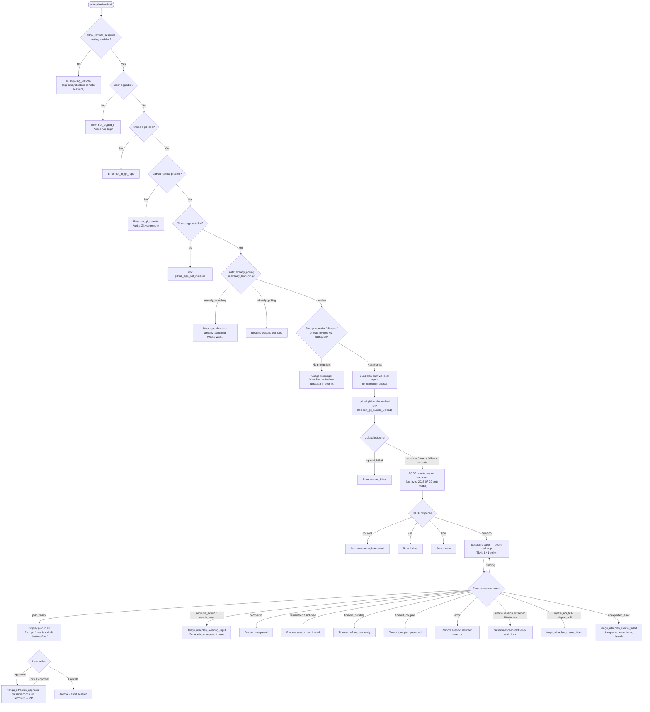

# `/ultraplan`

> Analysis basis: CC v2.1.150 bundle.js (AST extraction + Claude interpretation)
> Minimum version: v2.1.150

---

## Overview

`/ultraplan` launches a remote Claude Code web session that drafts a structured plan for the user's prompt; the plan is displayed in the web UI for inline editing and approval before any code changes are executed. The command operates as an async "teleport" workflow: it packages the local repository as a git bundle, uploads it to a cloud environment, polls the remote session for status, and then surfaces the resulting plan back to the local CLI for user review. On approval the session continues remotely and eventually lands its changes as a GitHub pull request.

---

## Registration

| Field | Value |
|---|---|
| type | `local-jsx` |
| name | `ultraplan` |
| description | `… Claude Code on the web drafts a plan you can edit and approve. See …` |
| argumentHint | `<prompt>` |
| load_inline | `true` |
| load_ident | `ksL` |
| loc_byte | `11841518` |
| loc_byte_end | `11841762` |
| loc_line | `9533` |
| arbor_handler.name | `ksL` |
| arbor_handler.fqn | `claude-2.1.150::ksL` |
| arbor_handler.kind | `AsyncFunction` |
| arbor_handler.resolution_path | `load_ident` |
| arbor_handler.n_hits | `1` |

Analysis basis: CC v2.1.150 bundle.js:+11841518

The handler was resolved via `load_ident`: the registration uses an inline `Promise.resolve({call: ksL})` shape; the Arbor symbol graph confirmed `ksL` as the unique handler with 1 hit.

---

## Input Branching

The command execution has more than three distinct branches (precondition failures, prompt-detection path, already-launching guard, plan-ready / approval flow, timeout paths, error paths). A Mermaid flowchart is used.



Analysis basis: CC v2.1.150 bundle.js:+11839661 (handler entry), +11837176 (already_polling/already_launching guard), +11836961 (create_failed telemetry), +11833276 (plan_ready telemetry), +11833684 (approved telemetry)

---

## Behavioral Spec

### 1. Handler Entry — Permission & State Guard (`ksL`)

```
async function ultraplanHandler(args, appContext):
    // Check org policy
    if not appContext.settings.allow_remote_sessions:
        emit error("policy_blocked")
        return

    // Retrieve current app state
    state = appContext.getAppState()          // _.getAppState

    // Detect prompt: either from slash-command argument or from
    // the presence of the string "ultraplan" in the user's message
    prompt = extractPrompt(args, state)       // LP8 → KP8 → fp_

    if not prompt:
        return usageMessage()                 // "Usage: /ultraplan <prompt>…"

    // Guard against double-launch
    if state.ultraplanStatus == "already_launching":
        return warningMessage("ultraplan: already launching. Please wait…")

    if state.ultraplanStatus == "already_polling":
        resumePollLoop(state)
        return

    // Check login (allow_product_feedback, firstParty, enterprise, team tiers)
    authInfo = loadAuthInfo()                 // k1 → p8q → _q8 → cb
    if not authInfo.loggedIn:
        emit error("not_logged_in",
            "Please run /login and sign in with your Claude.ai account (not Console).")
        return

    // Run eligibility checks in parallel then launch
    appContext.setAppState({ultraplanStatus: "already_launching"})
    launchRemoteSession(prompt, authInfo, appContext)
```

Analysis basis: CC v2.1.150 bundle.js:+11839661 (`ksL` → `LP8`), +11839679 (`ksL` → `k1`), +11839996 (`_.getAppState`), +11840214 (`_.setAppState`), +11837176 (guard literals), +11837194 (guard literals)

---

### 2. Prompt Extraction (`LP8` / `KP8` / `fp_`)

```
function extractPromptText(rawInput, conversationHistory):
    // Scan conversation history for messages containing "ultraplan"
    // using case-insensitive regex (flag "gi", bundle.js:+9561277)
    matches = conversationHistory.matchAll(/ultraplan/gi)

    // If the slash command was invoked with an explicit argument,
    // use that; otherwise look for the keyword in recent messages
    candidates = []
    for match in matches:
        candidates.push(match.context)

    // Take the last 5 candidates (literal 5, bundle.js:+9561977)
    // Replace pattern "$1$2" to normalise whitespace (bundle.js:+9561954)
    result = candidates.slice(-5)
    result = result.map(c => c.replace(normalisationPattern, "$1$2"))

    // Truncate to 40 chars for display label (literal 40, bundle.js:+15286881)
    return result
```

Analysis basis: CC v2.1.150 bundle.js:+9561285 (`H.matchAll`), +9561377 (`q.some`), +9561629 (string `"ultraplan"`), +9561277 (flag `"gi"`), +9561977 (literal `5`), +9561954 (replacement `"$1$2"`), +9561857 (`H.slice`)

---

### 3. Background Eligibility Check (`IH1`)

```
async function checkRemoteEligibility(authInfo, gitContext):
    // Emits tengu_ccr_bundle_seed_enabled (bundle.js:+8744745)
    results = await Promise.all([
        checkLogin(authInfo),
        checkGitRepo(gitContext),
        checkGitHubRemote(gitContext),
        checkGithubAppInstalled(authInfo)
    ])

    for check in results:
        if check.failed:
            return {eligible: false, reason: check.errorCode}
            // Known codes: not_logged_in, not_in_git_repo,
            //   no_git_remote, github_app_not_installed,
            //   policy_blocked, byoc

    return {eligible: true}
```

Key error messages surfaced at this stage (Analysis basis: CC v2.1.150 bundle.js:+8746200, +8746439, +8746711):
- `"not_logged_in"` → `"Please run /login and sign in with your Claude.ai account (not Console)."`
- `"no_git_remote"` → `"Background tasks require a GitHub remote. Add one with \`git remote add origin REPO_URL\`."`
- `"policy_blocked"` → `"Remote sessions are disabled by your organization's policy. Contact your organization admin to enable them."`
- `"github_app_not_installed"` → directs user to GitHub App setup
- `"not_in_git_repo"` → checked via git presence detection

Analysis basis: CC v2.1.150 bundle.js:+8744280 (`IH1` → `k1`), +8744415 (`Promise.all`), +8744347 (`_8`)

---

### 4. Local Plan Draft (`IsL` / `EsL`)

```
function buildLocalPlanDraft(prompt, preconditionContext):
    // Runs the local agent (mjH → IH1) to generate a preliminary plan
    // before teleporting. The draft is prefixed with the literal:
    // "Here is a draft plan to refine:" (bundle.js:+11832905)
    draftParts = []
    draftParts.push("Here is a draft plan to refine:")
    draftParts.push(runLocalPlanAgent(prompt, preconditionContext))
    draftText = draftParts.join(separator)    // EsL → q.join

    // Telemetry: tengu_ultraplan_prompt_identifier
    //   records how the prompt was identified (bundle.js:+11832731)
    emitTelemetry("tengu_ultraplan_prompt_identifier", {source: identifySource(prompt)})

    return draftText
```

Analysis basis: CC v2.1.150 bundle.js:+11832905 (literal), +11832898 (`q.push`), +11832988 (`q.join`), +11832731 (telemetry), +11837685 (`mjH` → `IH1`)

---

### 5. Git Bundle Upload (`Yb_`)

```
async function uploadGitBundle(sessionParams):
    // Emits tengu_ccr_bundle_upload (bundle.js:+8667385)
    // Teleport stage identifier: "teleport_git_bundle_upload" (bundle.js:+8667092)

    // Validate git state
    if not isGitRepo():
        return {status: "empty_repo", message: "Not in a git repository"}

    // Check for commits
    headRef = gitRevParse("--verify", "HEAD")   // literal "HEAD" +8667952
    if not headRef:
        return {status: "empty_repo",
                message: "Repository has no commits yet"}

    // Attempt stash to capture working-tree changes
    stashRef = gitStashCreate()
    seedBundleName = "ccr-seed" + ".bundle"     // literals +8668380, +8668391
    sourceSeedName = "_source_seed.bundle"       // literal +8668683

    // Bundle and upload; on failure emit status "upload_failed" (+8668828)
    // On success emit status "success" (+8668977)
    // Fallback variants: head (+8669041), fallback_head (+8669080),
    //   squashed (+8669115), fallback_squashed (+8669158)

    // Determine bundle mode (tengu_teleport_bundle_mode +8682740)
    // Modes: "bundle", "explicit_env_bundle", "git_repository" (+8682704, +8682840, +8682892)

    uploadResult = postBundleToServer(bundleBytes)
    emitTelemetry("tengu_ccr_bundle_upload", {status: uploadResult.status})
    return uploadResult
```

Analysis basis: CC v2.1.150 bundle.js:+8667063 (`Yb_`), +8667092 (telemetry label), +8667193 (`"refs/seed/stash"`), +8667211 (`"refs/seed/root"`), +8668380, +8669316 (`vaH.unlink` — cleanup of temp file)

---

### 6. Remote Session Creation (`ed` / `Do` / `GaH`)

```
async function createRemoteSession(bundleUploadResult, planDraft, envList):
    // Requires: access token (no token → "No access token found…" +8681681)
    // Requires: org UUID  (missing → "Unable to get organization UUID…" +8681991)

    // HTTP POST with headers:
    //   anthropic-beta: "ccr-byoc-2025-07-29"    (+8682330)
    //   x-organization-uuid: <orgUUID>             (+8682352)
    //   anthropic-version: "2023-06-01"            (+3139165)
    //   Content-Type: "application/json"           (+3139126)

    response = httpClient.post(sessionEndpoint, payload)

    // Status handling:
    //   201 / 200  → session created, extract session ID
    //   401 / 403  → auth failure
    //   429        → rate limited
    //   500        → server error (+8683628)
    //   409        → conflict (+8689854) — retry with delay 10000ms (+8689653)

    if response.status not in [200, 201]:
        emitTelemetry("tengu_ultraplan_create_failed")  // +11836961
        return error(response)

    sessionId = extractSessionId(response.body)
    if not sessionId:
        return error("Server returned a malformed session response (no session id)")
    //   literal +8684086

    emitTelemetry("tengu_ultraplan_launched")           // +11838631
    return {sessionId}
```

Analysis basis: CC v2.1.150 bundle.js:+8683572 (`l_.post`), +8683664 (literal `201`), +8683732 (literal `401`), +8683736 (literal `403`), +8683740 (literal `429`), +8684086 (error string), +11838631 (telemetry)

---

### 7. Environment Resolution (`Do` / `GaH`)

```
async function resolveOrCreateEnvironment(authInfo):
    // 1. List available teleport environments
    //    endpoint label: "teleport_environments_list" (+8629868)
    //    timeout: 15000 ms (+8630383)
    envList = await listEnvironments(authInfo)

    // 2. If no env exists, auto-create a default cloud env
    //    label: "teleport_default_environment_create" (+8630668)
    //    Default name: "Default" (+8630643)
    //    Auto-create uses preset: anthropic_cloud (+8630963)
    //    with /home/user workdir (+8631069), python 3.11 (+8631148), node 20 (+8631177)
    if envList is empty or null:
        newEnv = await createDefaultCloudEnv()
        logInfo("[teleportToRemote] Auto-created default cloud env")  // +8684280
        if newEnv fails:
            warnUser("Could not create a cloud environment. Set one up at " +
                     "https://claude.ai/code/onboarding?magic=env-setup")   // +8684438
            return null

    // 3. Filter to environments with "bridge" type (+8685420)
    bridges = envList.filter(e => e.type == "bridge")
    if bridges is empty:
        return error("No environments available for session creation")  // +8685458

    return bridges[0]
```

Analysis basis: CC v2.1.150 bundle.js:+8629865 (`Do` → `f1`), +8629868 (label), +8630668 (label), +8685420 (literal `"bridge"`), +8685458 (error string)

---

### 8. Session Poll Loop (`ZkH` / `SH1` / `yC1`)

```
async function pollRemoteSession(sessionId, appContext):
    // Generates a random 8-byte token for this polling instance (+12839460 / +12839476)
    // Opens browser or UI for monitoring: Wa.open (+12838490)
    pollToken = generatePollToken(8)
    openBrowserForSession(sessionId)        // YaH

    startTime = Date.now()
    timeoutMs = 1800000   // 30 minutes (+8752465)
    pollIntervalMs = 1000  // 1 second  (+8752458)

    loop:
        response = await fetchSessionStatus(sessionId)   // SH1

        switch response.status:
            case "pending":
                // still starting (+12839583)
                wait(pollIntervalMs); continue

            case "running":
                // session active (+8750978)
                updateLocalUI(response.events)
                wait(pollIntervalMs); continue

            case "plan_ready":
                emitTelemetry("tengu_ultraplan_plan_ready")   // +11833276
                displayPlanForApproval(response.planContent)
                return waitForApproval()

            case "requires_action" / "needs_input":
                emitTelemetry("tengu_ultraplan_awaiting_input")  // +11833208
                surfaceInputRequest(response)
                continue

            case "approved":
                emitTelemetry("tengu_ultraplan_approved")    // +11833684
                setAppState({ultraplanStatus: "approved"})
                return

            case "completed":
                finaliseSession(response)
                return

            case "terminated" / "archived":
                return error("remote session terminated")

            case "error":
                return error("remote session returned an error")  // +8755043

        elapsed = Date.now() - startTime
        if elapsed > timeoutMs:
            return error("remote session exceeded 30 minutes")    // +8755084

        // Special sentinel: no review output from orchestrator
        if noReviewOutput:
            return error("no review output — orchestrator may have exited early")  // +8755121
```

Polling is implemented as a recursive / interval-based loop.
Maximum session duration: 1 800 000 ms (30 minutes) (Analysis basis: CC v2.1.150 bundle.js:+8752465).
Poll interval: 1 000 ms (Analysis basis: CC v2.1.150 bundle.js:+8752458).
Plan generation timeout before "timeout_no_plan": tracked separately from wall-clock timeout; telemetry value recorded via `tengu_ultraplan_timeout_seconds` (Analysis basis: CC v2.1.150 bundle.js:+11832564); literal `5400` seconds found at +11832598.

---

### 9. Plan Display and Approval (`ZsL` / `XsL` / `NsL`)

```
function displayAndAwaitApproval(draftPlan, sessionId, appContext):
    // The "Ultraplan" UI component is labelled "Ultraplan" (+11838787)
    // Plan type tag: "plan" (+11838119)
    // Action button label: "Refine local plan" (+11838084)

    planNode = renderPlanUI(draftPlan)       // XsL → V6 (React-based render)
    appContext.update({planNode, sessionId})

    // After user approves, the remote session continues
    // Results will land as a pull request (+11834170):
    // "Results will land as a pull request when the remote session finishes.
    //  There is nothing to do here."

    // On failure, agent is told (+11834964):
    // "Remote Ultraplan session failed. Wait for the user's next instructions."

    userChoice = awaitUserInteraction()

    if userChoice == "approved":
        emitTelemetry("tengu_ultraplan_approved")
        continueRemoteSession(sessionId)
    else:
        archiveSession(sessionId)           // M06 → A7.unlink
```

Analysis basis: CC v2.1.150 bundle.js:+11833684 (telemetry), +11834170 (PR message literal), +11834964 (failure message literal), +11838084 (UI label), +11838787 (component label), +11833847 (`M06`)

---

### 10. Title Generation (`pYL`)

```
async function generateSessionTitle(promptText):
    // Telemetry: "teleport_generate_title" (+8670684)
    // Truncate prompt to 75 chars (+8670375) for the title API call
    // Endpoint path: "claude/task" (+8670386)
    // Template variable: "{description}" (+8670422)
    // Schema type: "json_schema" (+8670506)
    // Output fields: "title" (+8670610), "branch" (+8670618)

    truncated = promptText.slice(0, 75)
    payload = buildTitlePayload(truncated)
    response = await httpClient.post("claude/task", payload)
    return {title: response.title, branch: response.branch}
```

Analysis basis: CC v2.1.150 bundle.js:+8670375 (literal `75`), +8670386 (path), +8670684 (telemetry)

---

### 11. Orphaned Session Cleanup

```
function cleanupOrphanedSession(sessionId):
    // Logged as: "ultraplan: failed to archive orphaned session" (+11839346)
    // when archival of a stale session from a previous invocation fails
    try:
        archiveSession(sessionId)
    except:
        logWarning("ultraplan: failed to archive orphaned session")
```

Analysis basis: CC v2.1.150 bundle.js:+11839346

---

## State & Side Effects

| Item | Detail |
|---|---|
| Telemetry: `tengu_ultraplan_create_failed` | Fired when session POST fails or teleport returns null (bundle.js:+11836961) |
| Telemetry: `tengu_ultraplan_prompt_identifier` | Records how the prompt was identified (slash vs keyword) (bundle.js:+11832731) |
| Telemetry: `tengu_ultraplan_launched` | Fired after successful session creation (bundle.js:+11838631) |
| Telemetry: `tengu_ultraplan_awaiting_input` | Remote session requires user input (bundle.js:+11833208) |
| Telemetry: `tengu_ultraplan_plan_ready` | Plan draft is ready for user review (bundle.js:+11833276) |
| Telemetry: `tengu_ultraplan_approved` | User approved the remote plan (bundle.js:+11833684) |
| Telemetry: `tengu_ultraplan_failed` | Remote session failed (bundle.js:+11834557) |
| Telemetry: `tengu_ultraplan_timeout_seconds` | Records timeout value in seconds (bundle.js:+11832564); associated literal `5400` s at +11832598 |
| Telemetry: `tengu_ccr_bundle_seed_enabled` | Whether bundle-seed mode is active (bundle.js:+8744745) |
| Telemetry: `tengu_ccr_bundle_upload` | Outcome of git bundle upload (bundle.js:+8667385) |
| Telemetry: `tengu_teleport_bundle_mode` | Which bundle source was used (bundle.js:+8682740) |
| Telemetry: `tengu_ccr_session_link` | Session link emitted (bundle.js:+8677141) |
| Telemetry: `tengu_teleport_source_decision` | Final decision on source type for teleport (bundle.js:+8687810) |
| Telemetry: `tengu_teleport_generate_title` | Title generation for the remote session (bundle.js:+8670684) |
| Telemetry: `tengu_config_parse_error` | Config parse error during auth load (bundle.js:+3196285) |
| Telemetry: `tengu_bg_dispatch_sigkill_escalate` | Background session required SIGKILL escalation (bundle.js:+15260871) |
| Telemetry: `tengu_bg_low_mem_mb` / `tengu_bg_dispatch_low_mem` | Low-memory guard on background daemon (bundle.js:+12607162 / +15261450) |
| Telemetry: `tengu_bg_spare_enable` / `tengu_bg_spare_claim` / `tengu_bg_spare_spawn` / `tengu_bg_spare_claim_fail` | Spare-slot background dispatch metrics (bundle.js:+15262145, +15262266, +15260564, +15262529) |
| Telemetry: `tengu_bg_sendclaim_failed` | Background claim channel failure (bundle.js:+15241972) |
| Telemetry: `tengu_feature_ok` / `tengu_feature_bad` | Feature flag evaluation results (bundle.js:+963421, +963479) |
| `appState` changes | `setAppState` called with `ultraplanStatus` values: `"already_launching"`, `"already_polling"`, `"approved"`, `"skip"` (bundle.js:+11840214, +11840332) |
| `appState` reads | `getAppState` called to check current status before launch (bundle.js:+11839996) |
| File I/O | Git bundle written to temp file, uploaded, then removed via `vaH.unlink` (bundle.js:+8669316); session cleanup calls `A7.unlink` (bundle.js:+12755553); config read via `b8q.readFileSync` (bundle.js:+4683774) |
| Network | HTTP POST to remote session endpoint with `anthropic-beta: ccr-byoc-2025-07-29`; GET polling loop; axios cancel (`l_.isCancel`) for abort (bundle.js:+8689385) |
| Browser open | `Wa.open` called to open the web UI for plan review (bundle.js:+12838490) |
| Hook registration | `W7A.register` called during session lifecycle setup (bundle.js:+58272); hook event types observed: `"hook_progress"` (+8753655), `"hook_response"` (+8753684), `"hook_started"` (+8754175) |
| Crypto | `Zr1.randomBytes(8)` generates poll token (bundle.js:+12839460); `wb_.randomUUID` generates request ID (bundle.js:+8681165) |
| Sound | <!-- TODO: not found in depth-2 traversal; needs --depth 4 --> |

---

## Version History

| Version | Change |
|---|---|
| v2.1.150 | Initial analysis |

---

## Common Mistakes

1. **Invoking without being logged in to Claude.ai**: `/ultraplan` requires a Claude.ai web account authenticated via `/login`. API key authentication alone (`not_logged_in` error code) is explicitly rejected with the message "Please run /login and sign in with your Claude.ai account (not Console)." (bundle.js:+8746200).

2. **Running outside a git repository or without a GitHub remote**: The command requires both a git repository (`not_in_git_repo`) and a GitHub remote URL (`no_git_remote`). A plain `git init` without pushing to GitHub is insufficient; the GitHub App must also be installed (`github_app_not_installed`).

3. **Invoking while a session is already launching**: If a previous `/ultraplan` invocation is mid-flight, a second invocation produces the message "ultraplan: already launching. Please wait for the session to start." (bundle.js:+11835788) and does nothing. Wait for the existing session before retrying.

4. **Expecting instant results**: The command is entirely asynchronous. The remote session runs on Claude.ai and may take up to 30 minutes (1 800 000 ms, bundle.js:+8752465). The CLI polls every 1 second and surfaces status updates, but the user must remain connected until `plan_ready` or approve via the web UI.

5. **Omitting the prompt**: If neither the slash-command argument nor the word "ultraplan" appears in the message, the command prints a usage hint — "Usage: /ultraplan \<prompt\>, or include 'ultraplan' anywhere in your prompt" (bundle.js:+11837240) — and exits without launching a session.

6. **Organization policy block**: In managed enterprise or team accounts the `allow_remote_sessions` setting may be disabled. The error `policy_blocked` is returned with the message directing the user to contact their org admin (bundle.js:+8746711). This cannot be worked around client-side.

---

## Appendix — Identifier Mapping

> For bundle debugging only. Identifiers change across versions.

| Identifier | Role |
|---|---|
| `ksL` | Main async handler for `/ultraplan` (Arbor-confirmed, resolution_path: load_ident) |
| `LP8` | Prompt extraction wrapper — calls `KP8` and `fp_` |
| `KP8` | Intermediate prompt processing layer |
| `fp_` | Core prompt-matching logic; uses `matchAll`, `some`, `push`, `startsWith` |
| `k1` | Auth/config loader — checks login state, plan permissions |
| `p8q` | Auth lookup dispatch |
| `_q8` | Auth resolver — calls `cb` and `bJ_` |
| `cb` | Auth type classifier (firstParty / enterprise / team) |
| `bJ_` | Config file reader (`readFileSync`, UTF-8) |
| `G1` | Telemetry-mode resolver → `Z2A` |
| `Z2A` | Telemetry configuration helper → `mH` |
| `mH` | String coercion utility |
| `X1H` | Secondary string formatter → `mH` |
| `m7H` | Session context object |
| `uV6` | Remote-session orchestrator — coordinates plan draft, upload, creation |
| `mC1` | Message/context helper |
| `sE8` | Session event dispatcher → `aE8` |
| `aE8` | Session status emitter → `V6` and `WsL` |
| `V6` | React/UI event bus (`_$6`, `A$6`, `we`, `YOH`, `we6`, `e36`, `lg`, `m6`) |
| `WsL` | Session watcher helper |
| `IsL` | Plan lifecycle manager (precondition → launch → poll → display) |
| `mjH` | Local agent invoker → `IH1` |
| `IH1` | Background eligibility checker (git, login, GitHub remote, App check) |
| `EsL` | Plan-text builder — pushes draft prefix, calls `TsL`, joins result |
| `TsL` | Plan sub-section formatter → `PsL` |
| `ed` | Remote session creator (POST, headers, response dispatch) |
| `x6` | App-state/context accessor → `Mm6`, `j_` |
| `t$` | Token/credential resolver → `wL_` |
| `Xb_` | Error object builder → `eA`, `mH`, `wn` |
| `RH` | Error logger/reporter → `c_`, `mH`, `G1`, `xiK`, `ll.logError` |
| `aC` | Context accessor → `m6`, `eA`, `XZ`, `Yt` |
| `h9` | Environment URL validator (local / staging / prod) |
| `oJ` | HTTP header builder (`Content-Type`, `anthropic-version`, etc.) |
| `Yb_` | Git bundle upload logic (stash, bundle file, upload, cleanup) |
| `S6` | Utility → `Dv` |
| `N` | Text normaliser / formatter (`toUpperCase`, `trim`, `includes`) |
| `Uh` | Git remote URL resolver (`git config --get remote.origin.url`) |
| `req` | Request event builder (`control_request`, `set_permission_mode`, `randomUUID`) |
| `CH` | JSON serialiser wrapper → `JSON.stringify` |
| `ieq` | Session-link emitter → `c` |
| `Do` | Environments lister (`teleport_environments_list`, 15 s timeout) |
| `GaH` | Default cloud environment creator (`teleport_default_environment_create`) |
| `EH` | String coercion wrapper → `String` |
| `pYL` | Session title generator (`teleport_generate_title`, truncate to 75 chars) |
| `Tb` | Feature-flag checker (`_$6`, `A$6`, `we`, `YOH`, `we6`, `e36`, `Vb9`) |
| `YkH` | GitHub App installation checker |
| `kv` | Default branch resolver (`git symbolic-ref`, fallback to `main`/`master`) |
| `Fq` | Retry/back-off helper → `Wt`, `nq`, `QJ` |
| `c_` | Error code extractor → `String` |
| `Ih` | Cancellation handler |
| `HY` | HTTP cancel/abort helper |
| `nD` | Background daemon dispatcher → `d_`, `q`, `TX_` |
| `d_` | Module loader / bootstrap (`_2H`, `DS8`, `Ky6`, `Ly6`, `TPK`, `j1A`) |
| `TX_` | Daemon endpoint resolver (local / staging / prod URLs) |
| `vsL` | Visible-session state tracker |
| `ZkH` | Poll-loop entry point (token generation, browser open, timer) |
| `lN` | Poll token generator (`Zr1.randomBytes`) |
| `YaH` | Browser/UI opener (`Wa.open`) for plan review |
| `lP` | Poll-loop timestamp helper (`Date.now`, `L3`) |
| `XDL` | Session output formatter → `Sb_`, `N`, `String` |
| `SH1` | Session status fetcher and event dispatcher (main poll iteration) |
| `my` | Task/event ingestion coordinator (`jGL`, `DGL`, `JGL`, `XGL`, `s8H`) |
| `jGL` | Task-started event handler (retains `"task_started"`) |
| `DGL` | Task-updated event handler (`"task_updated"`) |
| `em_` | Event emission helper |
| `JGL` | Task-start timestamp recorder |
| `XGL` | Task-update timestamp recorder |
| `s8H` | Session-state machine (`user_typed`, `active`, `aborted`) |
| `ZsL` | Outer poll-result handler (routes by session status, manages timeouts) |
| `yC1` | Reconnect / retry loop on network failure |
| `XsL` | Plan-ready renderer → `V6` |
| `NsL` | Plan-status state accessor |
| `M06` | Session archive/cleanup helper (`A7.unlink`, `s9`) |
| `K` | Text padding formatter (`L.map`, `M.padEnd`) |
| `ex` | Retry-POST helper for session update (409 conflict handler, 10 s delay) |
| `a9` | Hook registrar → `W7A.register` |
| `VsL` | Visibility-state setter |
| `m6` | Config reader (project config, file watcher `Tt4`) |
| `Q6` | Config path resolver |
| `Af_` | Config file path builder |
| `JOH` | Project config loader (`readFileSync`, `statSync`, `mkdirSync`, `copyFileSync`) |
| `g6` | JSON parser → `JSON.parse` |
| `xC` | Config path normaliser (`startsWith`, `slice`) |
| `K8` | Config key helper |
| `mb9` | Backup config scanner (`readdirStringSync`, `basename`, `dirname`) |
| `Of_` | Backup path joiner (`iY.join`, `i8`) |
| `$` | Collection helper (`HQ1`) |
| `w` | Background session manager (spawn, kill, SIGKILL, memory checks) |
| `C` | Subprocess wrapper (`KXK`, `Dz`, `N`, `RH`, `kk5`, `z.write`) |
| `uH` | Async result helper → `c` |
| `bH` | Blocking result helper → `c` |
| `Kv8` | macOS memory threshold helper (`a6`, `V6`; limit 1024 MB) |
| `Oz6` | Config JSON file loader (`vP.readFile`, `g6`, `Array.isArray`, `j8`, `V37`) |
| `g` | MCP filter helper (`v6.filter`, `VH.has`) |
| `yqA` | Background session socket connector (`bB.claim`, `Vh8.connect`, `M.on/once/write/end`) |
| `uqA` | Background session lifecycle tracker (done/killed/stopped/crashed states, `yY.rm/unlink`) |
| `D` | Background session disposer (`V6`, `$.dispose`, `Kv8`, `a6`, `kqA`, `Dz`) |
| `Tt4` | Config file watcher (`ve6.watchFile/unwatchFile`, `a9`) |
| `rn` | Config reload trigger |
| `NH6` | Context-collector for plan submission (parallel fetch of auth, feature flags, git info) |

---

Note: index built via Arbor fallback; some signals (telemetry, literals) may be missing — see arbor-fallback.js.