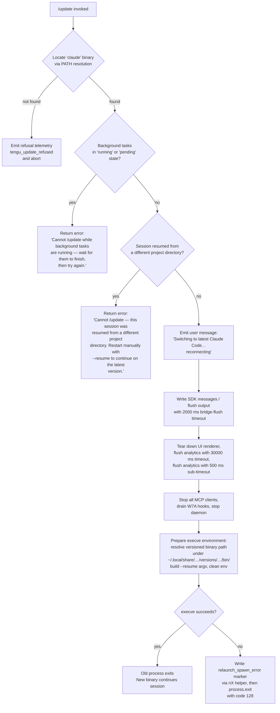

# `/update`

> Analysis basis: CC v2.1.150 bundle.js (AST extraction + Claude interpretation)
> Minimum version: v2.1.150

---

## Overview

`/update` triggers an in-place upgrade of the running Claude Code CLI to the latest released version while preserving the active conversation. The command performs a series of pre-flight safety checks (background task state, project directory continuity), tears down the current process's I/O and MCP infrastructure in an orderly sequence, spawns the new binary via `execve`/`spawnSync`, and exits the old process — all while emitting a reconnection message to the user. Because the session context is forwarded via `--resume`, the conversation continues uninterrupted in the new process.

---

## Registration

| Field | Value |
|---|---|
| type | `local` |
| name | `update` |
| description | `Switch to the latest version (conversation continues)` |
| loc_byte | `12273027` |
| loc_byte_end | `12273229` |
| loc_line | `10002` |
| supportsNonInteractive | `false` |
| isHidden | `true` |
| module_id | `VF1` |
| load_inline | `true` |
| arbor_handler.name | `E_5` |
| arbor_handler.fqn | `claude-2.1.150::E_5` |
| arbor_handler.kind | `AsyncFunction` |
| arbor_handler.resolution_path | `module_id` |
| arbor_handler.n_hits | `0` |

Analysis basis: CC v2.1.150 bundle.js:+12273027

---

## Input Branching

Five or more distinct decision paths exist before the relaunch executes, so a Mermaid flowchart is used.



---

## Behavioral Spec

### Pre-flight: Binary and Installation Path Resolution

```
async function resolveBinaryAndInstallPath():
    binaryPath = locateOnPath("claude")      // via sGA → Bun.which
    if binaryPath is null:
        emitTelemetry("tengu_update_refused")
        return ABORT

    versionsDir = path.join(
        homedir(),                           // BO8 → GUq.homedir
        ".local", "share",                   // literals: ".local", "share"
        …, "versions"                        // literal: "versions"
    )
    binDir = path.join(versionsDir, …, "bin")  // literal: "bin"
    return { binaryPath, binDir }
```

Analysis basis: CC v2.1.150 bundle.js:+12270871 (LV8→i3→sGA), +12270924 (LV8→Ku), +7625867 (BO8→GUq.homedir), +7626140–7626220 (path component literals)

---

### Pre-flight: Background Task Guard

```
function checkBackgroundTasks(appState):
    tasks = Object.values(appState.backgroundTasks)   // +12271194
    for task in tasks:
        if task.status == "running" or task.status == "pending":  // literals +12271232, +12271254
            return Error(
                "Cannot /update while background tasks are running — " +
                "wait for them to finish, then try again."
            )                                          // literal +12271335
    return OK
```

Analysis basis: CC v2.1.150 bundle.js:+12271194, +12271232, +12271254, +12271335

---

### Pre-flight: Project Directory Continuity Check

```
function checkProjectDirectoryContinuity(appState):
    if session was resumed AND current project dir != original session dir:
        return Error(
            "Cannot /update — this session was resumed from a different " +
            "project directory. Restart manually with --resume to continue " +
            "on the latest version."
        )                                              // literal +12271576
    return OK
```

Analysis basis: CC v2.1.150 bundle.js:+12271576

---

### Main Handler (`E_5`) — Orchestration

```
async function updateCommandHandler(context):
    // Step 1: resolve binary
    result = await resolveBinaryAndInstallPath()      // LV8 +12272350
    if result == ABORT: return

    // Step 2: background task check
    guardResult = checkBackgroundTasks(getAppState())
    if guardResult is Error: return guardResult

    // Step 3: project dir continuity
    continuityResult = checkProjectDirectoryContinuity(getAppState())
    if continuityResult is Error: return continuityResult

    // Step 4: emit user-visible reconnection notice
    // Message: "Switching to latest Claude Code… reconnecting"  +12272087
    emitTextMessage("Switching to latest Claude Code… reconnecting")

    // Step 5: generate a new session UUID for the resumed session
    newSessionId = generateUUID()                     // EF1 → qV8.randomUUID +12272083

    // Step 6: flush SDK bridge output
    // Uses a 2000 ms timeout ("bridge flush")         +12272167, +12272172
    await flushWithTimeout(sdkOutput, 2000, "bridge flush")   // t5 +12272154

    // Step 7: call flushAndTeardown                   // O.flush +12272157, O.teardown +12272208
    await sdkBridge.flush()
    await sdkBridge.teardown()

    // Step 8: build updated app state snapshot        // Object.assign +12272298
    updatedState = Object.assign({}, getAppState(), patchFields())

    // Step 9: perform relaunch sequence               // RXH +12272330
    await relaunchSequence(result.binDir, newSessionId, updatedState)
```

Analysis basis: CC v2.1.150 bundle.js:+12271119 (yG), +12271442–12271471, +12271759–12271811, +12271823, +12271977, +12272063–12272330

---

### Relaunch Sequence (`RXH`)

```
async function relaunchSequence(binDir, newSessionId, state):
    // Locate versioned binary on disk
    stat = await fs.stat(targetBinary)                // qu1.stat +12002901

    // Stop UI renderer and freeze terminal output
    stopIntervalTimers()                              // _j6 → _G_ → clearInterval +12002971
    teardownTerminalRenderer()                        // TvH → H.unmount, XDH.writeSync +12002977

    // Flush scroll-summary telemetry
    flushScrollSummary()                              // X48 → tengu_scroll_summary +12002983

    // Render final output line                       // Y9 +12002983
    renderFinalOutputLine()

    // Parallel teardown with 30000 ms timeout        // +12003016, literal "flush timeout (relaunch)"
    await Promise.all([
        withTimeout(stopAllMcpClients(), 30000, "flush timeout (relaunch)"),   // t5 +12003008
        withTimeout(flushDaemonConnection(), 30000),                            // FV +12003011
    ])

    // Drain W7A hook registry                        // kCH → W7A.drain +12003067
    await drainHookRegistry()

    // Flush analytics                                // P48 +12003123
    // Uses 500 ms sub-timeout ("analytics flush timeout") +12003134
    await flushAnalyticsWithTimeout(500, "analytics flush timeout")

    // Re-assign process signal handlers              // +12003518, +12003548
    process.removeAllListeners()
    process.on("SIGINT", noopHandler)
    process.on("SIGHUP", noopHandler)

    // Write any required state marker file           // nX → eCH.writeFileSync +12003797
    writeStateMarker()

    // Build argv: original argv0 + ["--resume", newSessionId, …]
    // literal "--resume" at +12002954
    newArgv = buildResumeArgv(newSessionId)

    // Attempt execve replacement (macOS/Linux)
    // Loads libSystem.B.dylib (macOS) or libc.so.6 (Linux) via bun:ffi
    // calls f.execve  +12002474
    success = execveReplace(binaryPath, newArgv, cleanEnv)

    if not success:
        // Fallback: spawnSync                        // Au1.spawnSync +12003575
        spawnSyncFallback(binaryPath, newArgv, { stdio: "inherit" })

        // Record spawn error                         // literal "relaunch_spawn_error" +12003800
        writeSpawnErrorMarker("relaunch_spawn_error")

        // Exit with code 128                         // +12003937
        process.exit(128)
    else:
        // execve succeeded — old process is replaced, never reaches here
        process.exit(0)
```

Analysis basis: CC v2.1.150 bundle.js:+12002825–12003889 (RXH body), +12002954, +12003016, +12003575, +12003800, +12003937

---

### Orderly MCP / Daemon Stop (`Hu1` + `z` + `pu`)

```
async function stopSubsystems():
    // Change cwd back to original if needed          // Hu1 → process.chdir +12002044
    restoreWorkingDirectory()

    // Iterate active worker processes and send SIGKILL if needed
    // via w.forEach → C.kill                         // +12002346
    terminateActiveWorkers()

    // Call execve via FFI (macOS: libSystem.B.dylib, Linux: libc.so.6)
    // Buffer.from + BigInt + M.ptr construct the FFI call  +12002230–12002283
    prepareExecveFFICall()

    // Stop daemon (z → bH, uH, Rk, pu)              // +12002485
    // Sends daemon_stop / daemon_stop_failed signals  // literals +15296906, +15296943
    await stopDaemon()

    // process.exit on unrecoverable daemon failure   // pu → process.exit +15292160
```

Analysis basis: CC v2.1.150 bundle.js:+12002044, +12002346, +12002474, +12002485, +15296906, +15296943

---

### Background Session Awareness (`wa`)

```
function checkAttachmentAndHooks(appState):
    // Checks whether a "background session" attachment is present
    // literal "attachment" +12805696, "ant" +12805871
    hasBackgroundSession = cL5.has("background session")   // wa → cL5.has +12805878
    // Also checks hook_success state                // literal "hook_success" +12805730
    return hasBackgroundSession
```

Analysis basis: CC v2.1.150 bundle.js:+12271767, +12805863–12805878

---

### Conversation Append: Last-Prompt Entry (`ma_`)

```
function appendLastPromptEntry(conversationStore):
    // Appends a "last-prompt" marker entry          // literal "last-prompt" +12770372
    // to the conversation log before the relaunch
    conversationStore.appendEntry({ type: "last-prompt", … })   // ma_ → _.appendEntry +12770352
```

Analysis basis: CC v2.1.150 bundle.js:+12271795, +12770266–12770490

---

## State & Side Effects

| Item | Detail |
|---|---|
| Telemetry — `tengu_update_refused` | Fired when the `claude` binary cannot be located on PATH; the update is aborted immediately. Analysis basis: +12270971 |
| Telemetry — `tengu_scroll_summary` | Fired during relaunch teardown (scroll state snapshot). Analysis basis: +5285263 |
| Telemetry — `tengu_amber_creek` | Fired from the terminal fullscreen renderer path during teardown. Analysis basis: +3360591 |
| Telemetry — `tengu_pewter_brook` | Fired from the same terminal fullscreen renderer path. Analysis basis: +3360499 |
| Telemetry — `tengu_bg_dispatch_sigkill_escalate` | Fired if worker process requires SIGKILL escalation during teardown. Analysis basis: +15260871 |
| Telemetry — `tengu_feature_bad` / `tengu_feature_ok` | Fired from feature-flag checker (`c_`/`bH`) evaluated during teardown. Analysis basis: +963479, +963421 |
| Telemetry — `tengu_bg_low_mem_mb` | Fired if memory is below threshold during worker teardown. Analysis basis: +12607162 |
| Telemetry — `tengu_bg_dispatch_low_mem` | Fired from supervisor low-memory check during teardown. Analysis basis: +15261450 |
| Telemetry — `tengu_bg_spare_enable` / `tengu_bg_spare_claim` / `tengu_bg_spare_spawn` / `tengu_bg_spare_claim_fail` | Spare-session lifecycle events emitted by the background worker manager during teardown. Analysis basis: +15262145, +15262266, +15260564, +15262529 |
| Telemetry — `tengu_bg_sendclaim_failed` | Fired if a background session claim fails during teardown. Analysis basis: +15241972 |
| Telemetry — `tengu_daemon_control` | Fired during daemon stop sequence. Analysis basis: +15296981 |
| SDK bridge | `O.flush()` and `O.teardown()` are called before relaunch. Analysis basis: +12272157, +12272208 |
| Hook registry | `W7A.drain()` drains all registered hooks before `execve`. Analysis basis: +12003067 (kCH → W7A.drain) |
| appState changes | `_.getAppState()` is read (+12271823) and `_.setAppState()` is called (+12271977) to persist session metadata before relaunch. A `last-prompt` entry is appended to the conversation log (+12270352). |
| Conversation store | `ma_ → _.appendEntry` appends the `"last-prompt"` marker. Analysis basis: +12271795 |
| Process replacement | `f.execve` (FFI) is attempted first; `Au1.spawnSync` is the fallback. Analysis basis: +12002474, +12003575 |
| Exit codes | `process.exit(128)` on spawn failure (+12003937); normal path exits via `execve` (no explicit exit code). |
| Session resumption | The new binary is launched with `--resume <newSessionId>` so conversation context is retained. Analysis basis: +12002954, +12272083 |
| isHidden | `true` — the command does not appear in the slash-command menu. Analysis basis: registration object +12273027 |
| supportsNonInteractive | `false` — the command requires an interactive session. Analysis basis: registration object +12273027 |
| Sound | None observed in depth-2 traversal. |

---

## Version History

| Version | Change |
|---|---|
| v2.1.150 | Initial analysis |

---

## Common Mistakes

1. **Invoking `/update` while background tasks are running.** The command will refuse with an explicit error message and will not attempt any relaunch. Wait for all background tasks (status `running` or `pending`) to complete before retrying.

2. **Invoking `/update` in a session resumed from a different project directory.** If the working directory at resume time differs from the original session's directory, the command will refuse. Restart manually with `claude --resume <session-id>` from the correct directory instead.

3. **Expecting the command to appear in the slash-command menu.** `isHidden: true` means `/update` is not listed; it must be typed explicitly.

4. **Expecting `/update` to work in non-interactive (headless/pipe) mode.** `supportsNonInteractive: false` means it is only available in interactive terminal sessions.

5. **Assuming the update is instantaneous.** The relaunch sequence involves multiple timed teardown phases (bridge flush: 2000 ms, full teardown: 30000 ms, analytics: 500 ms). On slow systems or heavy MCP setups these timeouts may be reached before a clean handoff.

6. **Expecting the old process to remain alive.** `execve` replaces the process image in-place; the old PID is gone. If `execve` fails, the fallback path exits with code 128 after writing a `relaunch_spawn_error` marker.

---

## Appendix — Identifier Mapping

> For bundle debugging only. Identifiers change across versions.

| Identifier | Role |
|---|---|
| `E_5` | Main async handler for `/update` (arbor_handler; AsyncFunction in module VF1) |
| `LV8` | Binary / installation path resolver (calls i3 and Ku) |
| `i3` | PATH lookup helper; delegates to `sGA` → `Bun.which` for locating the `claude` binary |
| `sGA` | Thin wrapper around `Bun.which` for binary location |
| `Ku` | Versioned install-path builder; constructs `~/.local/share/…/versions/…` paths |
| `ej8` | Path segment join utility used by Ku |
| `rf` | Array shape validator (calls `Array.isArray`) |
| `UwH` | Home-directory-relative path constructor (`.local/share`) |
| `BO8` | `os.homedir()` accessor |
| `$8H` | `bin/` subdirectory path builder |
| `bq` | Background-task/process type classifier; emits `"bg"`, `"daemon"`, `"daemon-worker"` |
| `f$H` | Helper called by `bq` for process type detection |
| `yG` | File basename resolver (`NP.basename`) |
| `S6` | Low-level utility (calls `Dv`); used for string/path operations |
| `Dv` | Primitive string/path helper (called by S6, j_, rK) |
| `YI` | App-state accessor utility |
| `Zo_` | Session directory continuity checker; reads dirname, calls `$O` and `rK` |
| `j_` | Path normalization helper (calls `Dv`) |
| `rK` | Path comparison/validation helper (calls `Dv`) |
| `n_H` | Pre-relaunch state finalizer |
| `wa` | Background-session attachment checker; inspects `cL5` Set |
| `Sv8` | Attachment registry or flag referenced by `wa` |
| `ma_` | Last-prompt entry appender; calls `h4`, `_.appendEntry`, `S6` |
| `h4` | Conversation store transaction helper (calls `a9`) |
| `a9` | Hook registration helper (`W7A.register`) |
| `RH` | Log/error utility; manages `Hm6` ring-buffer and `ll.logError` |
| `c_` | Error constructor wrapper (calls built-in `Error` and `String`) |
| `mH` | String coercion utility |
| `G1` | Error reporting helper (calls `Z2A`) |
| `Z2A` | Error formatter (calls `mH`) |
| `xiK` | Rotating log buffer manager (`Hm6.shift` / `Hm6.push`) |
| `eG` | App-state field extractor/transformer used mid-handler |
| `O` | SDK bridge object (`writeSdkMessages`, `flush`, `teardown`) |
| `k8` | Internal SDK bridge implementation |
| `EF1` | UUID generator (calls `qV8.randomUUID`) |
| `t5` | Timeout-race utility (`setTimeout` + `Promise.race` + `clearTimeout`) |
| `PzH` | String field patcher for updated app state |
| `RXH` | Full relaunch sequence orchestrator |
| `_j6` | Interval timer stopper (calls `_G_` → `clearInterval`) |
| `_G_` | `clearInterval` wrapper |
| `TvH` | Terminal renderer teardown (`H.unmount`, `XDH.writeSync`, `wS`, `l68`, `mH`) |
| `H` | Ink/terminal renderer instance (`unmount`, `replaceAll`) |
| `wS` | Terminal write-sync helper used during teardown |
| `l68` | ANSI escape sequence writer (`ue.writeSync`, `xEH`, `SEH`, `VG`) |
| `xEH` | Terminal capability detector (`yJ`, `TB9.coerce`, `xZ`); checks Ghostty ≥1.2.0, iTerm2 ≥3.6.6 |
| `SEH` | Supplementary ANSI helper |
| `VG` | tmux/screen escape sequence replacer (`QH7`, `H.replaceAll`) |
| `X48` | Scroll-summary telemetry flusher (fires `tengu_scroll_summary`) |
| `jv` | Scroll metrics helper |
| `t$q` | Scroll metrics helper |
| `s$q` | Timing/metrics calculator (`Date.now`, `Math.max`, `Math.round`, `Object.assign`) |
| `o$q` | Sub-helper for metrics calculation |
| `Y9` | Final output line renderer; handles fullscreen, tmux, Windows-over-SSH cases |
| `WxH` | Fullscreen-capability registry checker (`_QK.has`) |
| `I3_` | Output line formatter (`t1`, `mH`) |
| `fi` | Alternate output formatter (`_67`) |
| `N` | ANSI/terminal color formatter (`h96`, `LVK`, `CH`, `X4`, `cI`, `HbH`, `$VK`) |
| `N3_` | Boolean filter for output lines (`a6`, `Boolean`) |
| `HA` | Output renderer helper (`hm`) |
| `A67` | Alternate output renderer (calls `V6`) |
| `V6` | Core render/dispatch function (`_$6`, `A$6`, `we`, `YOH.has`, `we6`, `e36.add`, `lg.has`, `lg.get`, `m6`) |
| `FV` | Daemon flush helper (calls `h4`) |
| `kCH` | Hook registry drainer (`W7A.drain`) |
| `P48` | Analytics/telemetry flush with timeout (`Promise.all`, `IZ`, `ag`, `Promise.race`, `r8`) |
| `r8` | Child-process supervisor helper (`K`, `Error`, `q`, `setTimeout`, `O`, `clearTimeout`, `L.unref`) |
| `K` | Process list formatter (`L.map`, `M.padEnd`) |
| `q` | Lock-file unlinker (`hJK.unlinkSync`) |
| `L` | Promise-tracking set manager (`q.add`, `M.finally`, `q.delete`) |
| `Hu1` | Process-replacement and subsystem-stop orchestrator; calls `execve`, `require`, `bun:ffi`, `process.chdir`, etc. |
| `M` | Native module handle (`A.close`, `q.close`, `dlopen`) |
| `A` | Native library handle (`M.toLowerCase`, `close`) |
| `$` | Worker roster (`HQ1`) |
| `HQ1` | Worker registry entry constructor (`Pn`, `Date.now`, `A1`, `$v6`, `CH`) |
| `w` | Worker lifecycle manager (`A.get`, `C.kill`, `setTimeout`, `bB.spawn`, `RH`, `V6`, `Kv8`, `Oz6`, etc.) |
| `C` | Worker process wrapper (`KXK`, `Dz`, `N`, `RH`, `kk5`, `z.write`) |
| `uH` | Worker success-state handler (calls `c`) |
| `bH` | Worker failure-state handler (calls `c`) |
| `Kv8` | Memory-threshold checker (`a6`, `V6`); fires `tengu_bg_low_mem_mb` |
| `Oz6` | Config file reader (`vP.readFile`, `wD_`, `g6`, `Array.isArray`, `j8`, `V37`) |
| `g` | Settled-promise reaper (`v6.filter`, `VH.has`) |
| `yqA` | Background session connection manager (`bB.claim`, `Vh8.connect`, `M.on/once/write/end`, etc.) |
| `uqA` | Background session lifecycle state machine (`yY.rm/unlink`, `RH`, `cq`, `Bw`, `keH`, `hLH`, `ny`, `wB`, `VZ6`, `_.rosterEntry`, etc.) |
| `D` | Worker disposal/garbage-collection helper (`V6`, `$.dispose`, `Kv8`, `mqA.freemem`, `Dz`, `N`, `K8`, `RH`) |
| `K8` | Shared state/counter used in worker management |
| `S` | Disposable resource wrapper (`S.dispose`) |
| `f` | MCP client manager (calls `UyH`, `gDK`, `lv5`, `L.get/values`, `N`) |
| `UyH` | MCP transport initializer; handles `stdio`, `sse`, `http`, `sse-ide`, `ws-ide`, `claudeai-proxy` transport types |
| `gDK` | MCP update applicator (`H.applyMcpUpdate`, `ZW8`, `A.cleanup`, `OI`, `_J`) |
| `lv5` | MCP client set reconciler (`_.getClients`, `R78`, `r8`, `N`, `ytH`, `UyH`, `gDK`, `Object.fromEntries`) |
| `z` | Daemon connection object (`bH`, `uH`, `Rk`, `pu`) |
| `Rk` | Daemon message router (`Gb`, `dg.push`, `aTH`, `UM_`) |
| `pu` | Daemon shutdown coordinator (`Promise.race/all`, `cg`, `og`, `r8`, `process.exit`) |
| `EH` | String coercion utility (calls `String`) |
| `nX` | Error-marker file writer (`eCH.writeFileSync`, `jx8.join`) |

---

Note: index built via Arbor fallback; some signals (telemetry, literals) may be missing — see arbor-fallback.js.