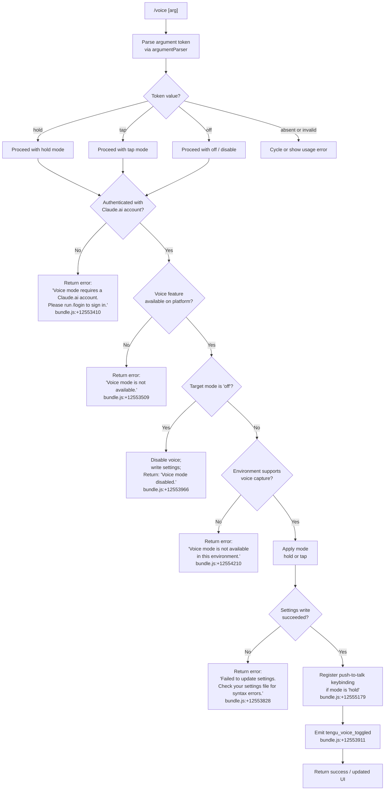

# `/voice`

> Analysis basis: CC v2.1.150 bundle.js (AST extraction + Claude interpretation)
> Minimum version: v2.1.150

---

## Overview

The `/voice` command toggles voice input mode in Claude Code, allowing users to switch between hold-to-talk, tap-to-talk, and disabled voice interaction modes. It performs prerequisite checks for authentication and platform availability before applying the requested mode, and updates persistent settings when the change succeeds.

---

## Registration

| Field | Value |
|---|---|
| type | `local` |
| name | `voice` |
| description | Toggle voice mode |
| argumentHint | `[hold\|tap\|off]` |
| supportsNonInteractive | `false` |
| isHidden | `null` |
| module_id | `Ml1` |
| load_inline | `true` |
| loc_byte | `12555915` |
| loc_byte_end | `12556157` |
| loc_line | `10535` |
| arbor_handler.name | `JK5` |
| arbor_handler.fqn | `claude-2.1.150::JK5` |
| arbor_handler.kind | `AsyncFunction` |
| arbor_handler.resolution_path | `module_id` |
| arbor_handler.n_hits | `1` |

Analysis basis: CC v2.1.150 bundle.js:+12555915

---

## Input Branching

The command parses the argument string into one of four distinct token values (`hold`, `tap`, `off`, or an invalid/absent value), then applies a layered series of prerequisite checks before executing. This yields more than three significant branches, so a flowchart is used.



---

## Behavioral Spec

### Top-level handler (`JK5`)

The Arbor-resolved handler is `JK5` (AsyncFunction, `claude-2.1.150::JK5`), reached via `module_id` resolution from module `Ml1`.

Analysis basis: CC v2.1.150 bundle.js:+12553369

```
async function voiceCommandHandler(context, args):

    # Step 1: Parse the argument
    token = argumentParser(args.trim())         # jK5 / H.trim at +12553661
    # token is one of: "hold", "tap", "off", "invalid"

    # Step 2: Load current settings
    settings = loadSettingsFromDisk()           # dD via J66/Lt_ at +12553380

    # Step 3: Account / auth prerequisite check
    if not hasClaudeAiAccount(settings):
        return textResult(
            "Voice mode requires a Claude.ai account. " +
            "Please run /login to sign in."
        )                                       # +12553410

    # Step 4: Platform-level voice availability
    if not isVoiceAvailable():
        return textResult("Voice mode is not available.")   # +12553509

    # Step 5: Disable path
    if token == "off":
        writeVoiceMode(settings, "off")         # _A at +12553730
        if writeFailed:
            return textResult("Failed to update settings. " +
                "Check your settings file for syntax errors.")  # +12553828
        return textResult("Voice mode disabled.")               # +12553966

    # Step 6: Environment capability check (non-off modes)
    if not environmentSupportsVoice():
        return textResult(
            "Voice mode is not available in this environment."
        )                                       # +12554210

    # Step 7: Write new mode (hold / tap)
    writeVoiceMode(settings, token)
    if writeFailed:
        return textResult("Failed to update settings. " +
            "Check your settings file for syntax errors.")

    # Step 8: Register keybinding when mode is "hold"
    if token == "hold":
        registerKeybinding(
            action = "voice:pushToTalk",        # +12555179
            context = "Chat",                   # +12555198
            key = "Space"                       # +12555205
        )                                       # HX at +12555176

    # Step 9: Apply MCP / daemon state refresh
    applyMcpUpdate(context)                     # f / lv5 at +12554485

    # Step 10: Emit telemetry
    emitEvent("tengu_voice_toggled")            # +12553911

    return successResult()
```

Analysis basis: CC v2.1.150 bundle.js:+12553369, +12553594, +12553730, +12555176

---

### Argument parsing (`argumentParser` / `jK5`)

```
function argumentParser(rawArg):
    s = rawArg.trim()                     # H.trim +12553239
    if s == "hold":   return "hold"       # +12553286
    if s == "tap":    return "tap"        # +12553298
    if s == "off":    return "off"        # +12553309
    return "invalid"                      # +12553330
```

Analysis basis: CC v2.1.150 bundle.js:+12553239

---

### Settings load (`settingsLoader` / `J66` → `Lt_` → `dD`)

The handler calls a settings loading chain. `J66` delegates to `Lt_`, which calls `dD` (the main settings resolution function) and `eA`. `dD` itself assembles settings from user, project, local, flag, and policy layers.

```
function loadSettings():
    rawDisk = readSettingsFromDisk()    # dD at +12553380
    return mergeSettingsLayers(
        userSettings,
        projectSettings,
        localSettings,
        flagSettings,
        policySettings
    )
```

Key literals observed in the settings subsystem:
- Layer names: `"userSettings"`, `"projectSettings"`, `"localSettings"`, `"flagSettings"`, `"policySettings"` (bundle.js:+1211389 ff.)
- Files: `.claude/settings.json` (+1211643, +1211653), `.claude/settings.local.json` (+1211715)

Analysis basis: CC v2.1.150 bundle.js:+12543903, +12543809

---

### Settings write (`settingsWriter` / `_A`)

`_A` is the settings persistence function invoked after mode resolution.

```
async function settingsWriter(settingsPath, key, value):
    existing = readFileSync(settingsPath)
    merged   = mergeWithExisting(existing, {key: value})
    atomicWriteFile(settingsPath, merged)   # UK6 at +12554696 area
    invalidateCaches()                      # CY at +1221138
```

On parse or write failure the caller receives:
- `"Failed to update settings. Check your settings file for syntax errors."` (bundle.js:+12553828)

Analysis basis: CC v2.1.150 bundle.js:+12553730, +1220393

---

### Keybinding registration (`keybindingRegistrar` / `HX`)

When mode is `"hold"`, the handler registers a push-to-talk keybinding.

```
function registerPushToTalkKeybinding():
    binding = {
        action:  "voice:pushToTalk",   # +12555179
        context: "Chat",               # +12555198
        key:     "Space"               # +12555205
    }
    loadKeybindingConfig()             # T88 / xO6 +12555176
    mergeBinding(binding)
    emitEvent("tengu_custom_keybindings_loaded")
```

The keybinding subsystem reads `keybindings.json` (+3776661) and validates the `"bindings"` array structure. Errors emit `tengu_keybinding_config_invalid_format` or `tengu_keybinding_config_invalid_structure`.

Analysis basis: CC v2.1.150 bundle.js:+12555176, +3785514

---

### MCP state refresh (`mcpStateApplier` / `f` → `lv5` → `UyH`)

After the voice mode change, the handler triggers an MCP client refresh (function `f` at +12554485). This is a standard post-settings-change hook and is not voice-specific.

```
function applyMcpUpdate(context):
    for each mcpServer in activeMcpServers:
        if serverNeedsReconnect(server):
            reconnect(server)           # UyH + related at +14981764
        updateToolManifest(server)
```

Analysis basis: CC v2.1.150 bundle.js:+12554485

---

### Microphone permission hint

When the environment check fails on macOS, the error path references the system permission path:

- `"System Settings → Privacy & Security → Microphone"` (bundle.js:+12554717)

This string is surfaced as part of the "not available in this environment" error response.

Analysis basis: CC v2.1.150 bundle.js:+12554717

---

## State & Side Effects

| Item | Detail |
|---|---|
| Telemetry — voice | `tengu_voice_toggled` emitted on every successful mode change (bundle.js:+12553911) |
| Telemetry — feature gate | `tengu_feature_ok` / `tengu_feature_bad` / `tengu_feature_sad` from the feature availability check subsystem (+963421, +963479, +963556) |
| Telemetry — keybindings | `tengu_custom_keybindings_loaded` (+3776567), `tengu_keybinding_fallback_used` (+3785596), `tengu_keybinding_customization_release` (+3776147) on hold mode registration |
| Settings file write | Writes updated voice mode to `.claude/settings.json` or `.claude/settings.local.json` |
| Keybinding registration | When mode is `"hold"`: registers `voice:pushToTalk` → `Space` in the `Chat` context |
| Cache invalidation | `CY` clears `dy6` and `pS8` caches after settings write (+1221138) |
| appState changes | Voice mode field updated in application state |
| MCP refresh | `lv5` / `UyH` — active MCP server connections may be refreshed post-settings write |
| Sound | No sound playback identified in depth-2 traversal |

---

## Version History

| Version | Change |
|---|---|
| v2.1.150 | Initial analysis |

---

## Common Mistakes

1. **Omitting the argument** — Without `hold`, `tap`, or `off`, the parser returns `"invalid"` and the command may cycle modes or show usage guidance rather than applying a specific mode. Always pass an explicit subcommand.
2. **Running without a Claude.ai account** — Voice mode requires OAuth/account authentication. API-key-only setups will receive the "requires a Claude.ai account" error (`bundle.js:+12553410`). Run `/login` first.
3. **Expecting voice on unsupported platforms** — The platform availability check (`isVoiceAvailable`) runs before any mode is applied. Environments without microphone access (e.g., SSH sessions without audio forwarding, headless CI) will receive the "not available in this environment" error (`bundle.js:+12554210`). On macOS, check `System Settings → Privacy & Security → Microphone`.
4. **Assuming instant keybinding effect** — The `Space` → `voice:pushToTalk` keybinding is only registered in `"hold"` mode. Switching to `"tap"` or `"off"` does not automatically deregister it; a subsequent keybinding config reload may be needed.
5. **Ignoring settings file syntax errors** — If `.claude/settings.json` has JSON syntax errors before the command runs, the write will fail and return the settings-error message (`bundle.js:+12553828`). Validate the file independently before retrying.

---

## Appendix — Identifier Mapping

> For bundle debugging only. Identifiers change across versions.

| Identifier | Role |
|---|---|
| `JK5` | Main `/voice` command handler (AsyncFunction; Arbor FQN: `claude-2.1.150::JK5`) |
| `J66` | Settings load dispatcher; called first by `JK5` |
| `Lt_` | Settings resolution chain entry; calls `dD` and `eA` |
| `dD` | Core settings merge function (multi-layer: user, project, local, flag, policy) |
| `K4` | Settings helper called by `dD` and `ev` |
| `ev` | Settings sub-resolver; calls `Wc6`, `K4`, `O1H`, `wn`, `HN`, `mH` |
| `yO` | Settings helper; calls `RA` (firstParty check) |
| `hJ` | Settings helper called by `dD` |
| `e$` | Settings sub-resolver; handles API key and auth (`ANTHROPIC_API_KEY`, `apiKeyHelper`) |
| `O1H` | Settings helper; calls `mH`, `MfH` |
| `kv6` | Called by `J66` alongside `dD` |
| `HA` | Feature gate / availability check called by `JK5` |
| `hm` | Telemetry / settings load wrapper (emits `loadSettingsFromDisk_start/end`) |
| `DC` | Called inside `hm` |
| `Tq` | Memory usage / perf tracking; uses `XMA`, `ZMA`, `process.memoryUsage` |
| `$m` | Requires `perf_hooks` |
| `Wl8` | Settings load executor; orchestrates layer readers and cache |
| `V8` | Log file writer; calls `L.appendFileSync`, `L.mkdirSync` |
| `ly6` | Called by `Wl8` |
| `N46` | Flag-settings layer reader; uses `_.add`, `UJ.filter`, `_.has` |
| `EZA` | Settings layer aggregator; uses `Object.keys`, `nl` |
| `L` | Promise/async tracker (queue); also used as settings cache |
| `K` | Array/log helper (`L.map`, `M.padEnd`) |
| `dfH` | User-settings file path builder (`userSettings` layer) |
| `M` | Connection/session manager |
| `iF` | SDK inline settings reader |
| `WZA` | SDK inline settings merger |
| `rF` | Settings writer subsystem dispatcher |
| `j_` | Utility called by `rF` and `x6` |
| `jA6` | Sub-writer called by `rF` |
| `sR8` | Sub-writer called by `rF` |
| `zA6` | Sub-writer called by `rF` |
| `J2H` | Sub-writer called by `rF` |
| `JA6` | Sub-writer called by `rF` |
| `BfH` | Sub-writer called by `rF` |
| `FfH` | Sub-writer called by `rF` |
| `zl8` | Sub-writer called by `rF` |
| `AZA` | Sub-writer called by `rF` |
| `sl` | Sub-writer called by `rF` |
| `I46` | Sub-writer; calls `a6`, `v46`, `tX` |
| `cy6` | Called by `hm` |
| `jK5` | Argument parser for `/voice`; tokenises `hold`/`tap`/`off`/`invalid` |
| `H` | Random/timer utility; also used as misc string helper |
| `_A` | Settings persistence function (atomic write + cache clear) |
| `o$` | Settings path resolver; calls `dfH`, `rF` |
| `Q6` | Path utilities helper |
| `Pl8` | Settings layer pipeline builder |
| `oX` | File reader orchestrator |
| `il` | File content reader (handles BOM, encoding detection) |
| `W3` | Filesystem stat helper (FIFO, socket, character device checks) |
| `N` | File-type normaliser; calls `CH`, `cI`, `HbH`, `$VK` |
| `fm6` | File read helper |
| `_` | General-purpose utility / underscore alias |
| `$m6` | Buffer slicer |
| `j8` | Utility; calls `K8` |
| `K8` | Low-level utility |
| `Ec8` | Cache timestamper; writes to `Hp6` with `Date.now` |
| `M0H` | Settings merge helper; calls `Fp6`, `rF` |
| `Fp6` | Path resolver for settings files |
| `UK6` | Atomic file write helper (random bytes, `fchmodSync`, `fsyncSync`, `renameSync`) |
| `q` | Filesystem module alias (various `Sync` operations) |
| `O` | Stat object / symlink checker |
| `k8` | Utility called by `O` |
| `CH` | JSON serialiser (`JSON.stringify`) |
| `CY` | Cache invalidator; clears `dy6` and `pS8` |
| `im6` | gitignore / file-tracking helper |
| `x6` | Context store accessor (`Mm6`) |
| `Mm6` | Async-local-storage getter (`Lm6.getStore`) |
| `Lc8` | Called by `im6`; calls `F4` |
| `A` | Misc string/array utility |
| `nm6` | gitignore rule evaluator; calls `G_` |
| `G_` | git command runner for ignore checks |
| `BaK` | Path normaliser (homedir expansion, absolute path) |
| `fTA` | git ls-files tracker; calls `G_` |
| `$TA` | Called by `im6` |
| `BC` | Path joiner (`bv.join`) |
| `bH` | Feature-gate checker (calls `c`; emits `tengu_feature_ok`) |
| `c` | Feature-gate core evaluator |
| `_8` | Feature-gate checker (emits `tengu_feature_sad`) |
| `uH` | Feature-gate checker (emits `tengu_feature_bad`) |
| `RH` | Error logger / reporter; calls `c_`, `mH`, `G1`, `xiK`, `ll.logError` |
| `c_` | Error stringifier |
| `mH` | String coercer (`String(...)`) |
| `G1` | Error formatter; calls `Z2A` |
| `Z2A` | Error formatter helper |
| `xiK` | Error queue manager (`Hm6.shift`, `Hm6.push`) |
| `f` | MCP state applier (top-level); calls `UyH`, `gDK`, `lv5` |
| `UyH` | MCP client manager / reconnect orchestrator |
| `j6H` | MCP server record builder |
| `Rj6` | MCP record helper |
| `G4H` | MCP server configuration processor |
| `w6H` | MCP SDK-type server lister |
| `Sj6` | MCP server deduplication handler |
| `bN` | MCP server builder; calls `HO`, `aT_` |
| `HO` | MCP server object constructor |
| `aT_` | MCP server helper |
| `t8` | Utility; calls `_` |
| `HE6` | MCP filter helper |
| `VkL` | MCP needs-auth cache loader |
| `vF_` | Cache-path builder |
| `y78` | MCP server hash/key builder |
| `h78` | MCP server hash wrapper |
| `JX` | SHA-256 hasher (`K0q.createHash`) |
| `k78` | MCP fingerprint builder |
| `FK` | Config path resolver |
| `z8` | MCP debug logger |
| `hB_` | MCP connection handler (OAuth flow, reconnect) |
| `hNL` | MCP connection initialiser |
| `nF` | MCP transport factory |
| `f_H` | MCP OAuth flow executor |
| `jtH` | MCP pending-connection tracker |
| `D` | Background daemon / spare session manager |
| `s28` | MCP cache path builder |
| `Dc` | MCP reconnect orchestrator |
| `ym` | Transport helper |
| `Y` | Daemon supervisor write/config update |
| `CL` | MCP error logger (`ll.logMCPError`) |
| `EH` | Error stringifier (`String`) |
| `SNL` | MCP connection race helper |
| `yNL` | SSH environment MCP helper |
| `SB_` | MCP complete-authentication flow |
| `wtH` | Pending connection getter |
| `JtH` | Connection-map getter |
| `IY1` | MCP async session initialiser |
| `A1` | Async-local-storage store accessor |
| `EW8` | Cache-file path builder |
| `kB_` | MCP connection auth-cache writer |
| `lT_` | MCP server-type dispatcher |
| `f8` | MCP server factory (stdio / SSE / ws) |
| `j` | Active-process tracker |
| `y` | Process write helper |
| `ZY1` | MCP concurrency limiter |
| `li` | Async pool/iterator implementation |
| `_E6` | Integer parser (hex port etc.) |
| `NF_` | Integer parser variant |
| `gDK` | MCP update applier (`H.applyMcpUpdate`) |
| `ZW8` | MCP update serialiser |
| `OI` | MCP cleanup orchestrator |
| `ytH` | Serialisation helper (`CH`) |
| `$` | MCP daemon proxy / session manager |
| `HQ1` | Daemon status reader |
| `Pn` | Daemon ping helper |
| `$v6` | Daemon status file path builder |
| `lv5` | MCP server list refresher |
| `R78` | MCP server filter (checks `Cm7`, `bm7`) |
| `r8` | Retry/timeout helper |
| `HX` | Keybinding registration entry point |
| `T88` | Keybinding config loader |
| `xO6` | Keybinding file parser and validator |
| `hz_` | Keybinding block parser |
| `kp` | Keybinding release logger |
| `MKH` | Keybinding file path builder |
| `g6` | JSON parser (`JSON.parse`) |
| `P88` | Array validator for keybinding blocks |
| `j88` | Keybinding entry builder |
| `qc9` | Keybinding error emitter |
| `kz_` | Duplicate key detector in keybinding JSON |
| `yz_` | Keybinding action deduplicator |
| `E88` | Keybinding block structure validator |
| `xz_` | Keybinding structure checker |
| `bz_` | Keybinding validation helper |
| `Fe` | Keybinding map builder |
| `YCH` | Locale/language code normaliser |
| `m6` | Config file watcher and loader |
| `Af_` | Config path resolver |
| `JOH` | Config file read/write with backup |
| `xC` | Config path prefix stripper |
| `mb9` | Config backup file finder |
| `Of_` | Config backup path builder |
| `w` | Background worker / daemon process manager |
| `C` | Child process wrapper |
| `Kv8` | Memory limit checker |
| `Oz6` | Config file reader (async) |
| `g` | Session retirement checker |
| `V6` | Task/session dispatcher |
| `yqA` | IPC connection establisher |
| `uqA` | Session lifecycle manager |
| `S` | Session disposable |
| `Tt4` | File watcher setup |
| `rn` | Watch handler |
| `a9` | Signal/event registrar |