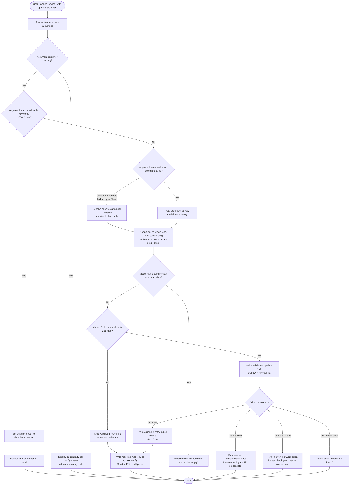

# `/advisor`

> Analysis basis: CC v2.1.152 bundle.js (AST extraction + Claude interpretation)
> Minimum version: v2.1.152

---

## Overview

The `/advisor` command configures the **Advisor Tool**, a subsystem that consults a stronger model at key decision points during an agentic task. The user supplies a model name (or a shorthand alias such as `"best"`, `"opus"`, `"sonnet"`, or `"haiku"`), and the command validates, normalises, and stores that selection so the running agent can delegate difficult sub-questions to the designated advisor model. The command renders a JSX panel and returns an async result after the model name has been resolved and cached.

---

## Registration

| Field | Value |
|---|---|
| type | `local-jsx` |
| name | `advisor` |
| description | Configure the Advisor Tool to consult a stronger model for guidance at key moments during a task |
| loc_byte | `12322840` |
| loc_byte_end | `12323127` |
| loc_line | `10292` |
| argumentHint | `null` |
| isHidden | `null` |
| module_id | `Jc1` |
| load_inline | `true` |
| arbor_handler.name | `D45` |
| arbor_handler.fqn | `claude-2.1.152::D45` |
| arbor_handler.kind | `AsyncFunction` |
| arbor_handler.resolution_path | `module_id` |
| arbor_handler.n_hits | `1` |

Analysis basis: CC v2.1.152 bundle.js:+12322840

---

## Input Branching

The command processes the user-supplied argument through five distinct paths (empty / disable keywords, named aliases, explicit model string, validation failure, and cache-hit short-circuit), so a Mermaid flowchart is used.



---

## Behavioral Spec

### Handler entry-point — `advisorCommandHandler` (bundle identifier: `D45`)

The handler is an `AsyncFunction` resolved via `module_id → Jc1`. The Arbor symbol graph identifies it unambiguously as `D45` with `n_hits = 1`.

```
async function advisorCommandHandler(commandInput, appContext):
    rawArgument = commandInput.argument
    trimmedArgument = rawArgument.trim()          // A.trim at +12322296

    if trimmedArgument is empty:
        return renderCurrentAdvisorStatus(appContext)

    if trimmedArgument in ["off", "unset"]:       // literals at +12322372, +12322383
        clearAdvisorModel(appContext)
        return renderJsxPanel("advisor disabled")

    normalised = resolveModelAlias(trimmedArgument)  // H1 at +12322450

    result = await validateAndCacheModel(normalised, appContext)  // KN8 at +12322464

    jsxElement = createElement(AdvisorResultView, {result})       // hJ.createElement at +12322332

    joinedOutput = pnH.join(...)                  // pnH.join at +12322607
    return jsxElement
```

Analysis basis: CC v2.1.152 bundle.js:+12322296

---

### Model alias resolution — `resolveModelAlias` (bundle identifier: `H1`)

Converts human-readable shorthand tokens into the system's internal tier/alias identifiers before the string reaches the validation layer.

```
function resolveModelAlias(input):
    lower = input.toLowerCase()                   // H1 → _.toLowerCase at +2185744

    // Exact alias table (literals at +2185829–+2185999)
    switch lower:
        case "opusplan":  return lookupTier("opusplan")  // +2185829
        case "sonnet":    return lookupTier("sonnet")     // +2185870
        case "haiku":     return lookupTier("haiku")      // +2185909
        case "opus":      return lookupTier("opus")       // +2185948
        case "best":      return lookupTier("best")       // +2185985

    // Bold-marker shorthand "[1m]" pattern
    stripped = input.replace("[1m]" pattern, "")          // literal at +2185855; A.replace at +2185772

    // Provider-prefix normalization
    if isRecognizedProvider(stripped):                    // L1H at +2185808
        return buildNormalizedId(stripped)                // JN at +2185847

    // Fallback: return input unchanged, normalised
    normalised = applyBaseNormalisation(input)            // MBH at +2186031
    return normalised
```

Analysis basis: CC v2.1.152 bundle.js:+12322450

---

### Model validation and caching — `validateAndCacheModel` (bundle identifier: `KN8`)

This is the central validation pipeline. It trims the model name, checks a module-level `Map` (`zc1`) for a cached result, and if absent, sends a lightweight probe request to the API to verify the model exists and is accessible.

```
async function validateAndCacheModel(modelName, appContext):
    trimmed = modelName.trim()                            // KN8 → H.trim at +12314662

    if trimmed is empty:
        throw Error("Model name cannot be empty")         // literal at +12314699

    lower = trimmed.toLowerCase()                         // _.toLowerCase at +12314822

    // Check well-known provider prefix list
    if not K1H.includes(lower):                          // K1H.includes at +12314841
        // Not a recognised provider prefix; proceed anyway

    if zc1.has(lower):                                   // zc1.has at +12314943
        return zc1.get(lower)                             // cache hit — skip API call

    // Perform live model probe via lx (the validation sub-pipeline)
    try:
        validationResult = await probeModelAvailability(lower, appContext)  // lx at +12314988
    catch AuthError:
        return { error: "Authentication failed. Please check your API credentials." }
                                                         // literal at +12315398
    catch NetworkError:
        return { error: "Network error. Please check your internet connection." }
                                                         // literal at +12315500
    catch ApiError where error.type == "not_found_error":
        return { error: "model: " + lower + " (not found)" }
                                                         // literals at +12315598, +12315619, +12315701

    // Store successful result
    zc1.set(lower, validationResult)                     // zc1.set at +12315151

    // Apply model_validation telemetry tag
    tag = "model_validation"                              // literal at +12315038

    // Build display alias via H45 / _45
    displayAlias = buildDisplayAlias(validationResult)    // H45 at +12315192

    return validationResult
```

Analysis basis: CC v2.1.152 bundle.js:+12314662

---

### Display alias builder — `buildDisplayAlias` (bundle identifiers: `H45`, `_45`)

Converts the validated model ID into a short display string shown in the confirmation panel.

```
function buildDisplayAlias(validationResult):
    raw = String(validationResult.id)             // H45 → String at +12315888
    lower = raw.toLowerCase()                     // _45 → H.toLowerCase at +12315938

    // Resolve model tier membership
    if lower includes known tier token:           // _.includes at +12315957
        tier = resolveModelTier(lower)            // K3 at +12316011

    // Known tier aliases produced (literals at +12315968–+12316276):
    //   "opus-4-7" / "opus_4_7"
    //   "opus-4-6" / "opus_4_6"
    //   "opus-4-5" / "opus_4_5"
    //   "sonnet-4-6" / "sonnet_4_6"
    //   "sonnet-4-5" / "sonnet_4_5"

    return tier ?? lower
```

Analysis basis: CC v2.1.152 bundle.js:+12315192

---

### Model probe sub-pipeline — `probeModelAvailability` (bundle identifier: `lx`)

Sends a minimal inference request (or uses the model-list endpoint) to verify the model is reachable under the current credential context.

```
async function probeModelAvailability(modelId, appContext):
    // Build request context
    requestContext = buildApiRequestContext(appContext)    // Ip at +13119322

    // Hash model string for cache-key deduplication
    hash = DHK.createHash("sha256")                       // W_A at +13119515; literal at +13074089
          .update(modelId).digest("hex")                  // literal at +13074116

    // Maximum budget: 1024 tokens                        // literal at +13119170
    budget = min(1024, remainingBudget)

    // Issue side-query fetch                             // literal "side_query" at +13119354
    response = await globalThis.fetch(endpoint, opts)    // globalThis.fetch at +13119407

    // Normalise response through OIH / GYH layers
    normalised = normaliseApiResponse(response)           // OIH at +13120185, GYH at +13120680

    // Timing / performance instrumentation
    elapsed = performance.now() - startTime              // performance.now at +13120397

    // Apply prompt-cache configuration if "1h" TTL enabled
    if cacheControl == "1h":                             // literals at +13120204, +13121296
        applyPromptCacheTtl(request)

    return normalised
```

Analysis basis: CC v2.1.152 bundle.js:+13119322

---

### API request builder — `buildApiRequestContext` (bundle identifier: `Ip`)

Assembles the full HTTP request, including authentication headers, session identifiers, and provider-specific fields.

```
async function buildApiRequestContext(appContext):
    // Determine app-type header
    appType = isBackground ? "cli-bg" : "cli"            // literals at +2912511, +2912520
    headers["x-app"] = appType                           // literal at +2912498
    headers["User-Agent"] = buildUserAgent()             // literal at +2912526

    // Session headers
    headers["X-Claude-Code-Session-Id"] = sessionId     // literal at +2912544
    headers["x-claude-remote-container-id"] = containerId  // literal at +2912588
    headers["x-claude-remote-session-id"] = remoteSessionId  // literal at +2912629
    headers["x-client-app"] = clientApp                 // literal at +2912668
    headers["x-claude-code-agent-id"] = agentId         // literal at +2912702
    headers["x-claude-code-parent-agent-id"] = parentId // literal at +2912765

    // OAuth token acquisition
    log("[API:auth] OAuth token check starting")         // literal at +2913081
    token = await T.getToken()                           // T.getToken at +2916978
    log("[API:auth] OAuth token check complete")         // literal at +2913135

    // Timeout: 600000 ms (10 min), retry: 10 attempts  // literals at +2913405, +2913413
    config.timeout = 600000
    config.maxRetries = 10

    // Cloud gateway session expiry guard
    if sessionExpired:
        throw Error("Cloud gateway session expired — run /login to reconnect.")
                                                         // literal at +2913585

    return config
```

Analysis basis: CC v2.1.152 bundle.js:+2912482

---

### Provider-prefix checker — `checkProviderPrefix` (bundle identifier: `lg`)

Determines whether a model string belongs to an Anthropic-managed provider namespace before dispatching the validation call.

```
function checkProviderPrefix(modelString):
    mapped = resolveProviderMap(modelString)              // GA at +2179822
    parts  = modelString.split(".").map(trim)            // A.map at +2179899, f.trim at +2179910

    // "anthropic." prefix check
    if modelString.startsWith("anthropic."):             // literal at +2179975; K.startsWith at +2179962
        return { provider: "anthropic", name: remainder }

    // "claude-" prefix check
    if modelString.startsWith("claude-"):               // literal at +2179596; SMq at +2179561
        return { provider: "anthropic-direct", name: modelString }

    // Provider-specific matchers
    if includesProviderToken(modelString):              // q.includes at +2179990
        providerInfo = lookupProviderEntry(modelString) // On6 at +2180019

    // Alias expansion
    aliasResult = expandKnownAlias(modelString)         // KBH at +2180069 → ZR4.includes at +2179163
    if aliasResult found:
        return aliasResult

    // Ranked fallback: RMq (index-of search) → ER4 (prefix scan) → VR4 (startsWith)
    ranked = rankByIndex(modelString)                   // RMq at +2180078
    if not ranked:
        ranked = scanPrefix(modelString)                // ER4 at +2180133
    if not ranked:
        ranked = startsWithMatch(modelString)           // VR4 at +2180324

    return ranked
```

Analysis basis: CC v2.1.152 bundle.js:+2179822

---

## State & Side Effects

| Item | Detail |
|---|---|
| Telemetry — `tengu_api_success` | Fired after a successful model probe response (bundle.js:+13120805) |
| Telemetry — `tengu_prompt_cache_1h_config` | Fired when the 1-hour prompt-cache TTL setting is applied during the probe (bundle.js:+13080462) |
| Telemetry — `tengu_bg_dispatch_sigkill_escalate` | Fired by the background-session layer if a stalled worker must be force-killed (bundle.js:+15382331) |
| Telemetry — `tengu_bg_dispatch_low_mem` | Fired when the background dispatcher detects low available memory (bundle.js:+15382910) |
| Telemetry — `tengu_bg_spare_enable` | Fired when a spare background session is enabled (bundle.js:+15383605) |
| Telemetry — `tengu_bg_spare_claim` | Fired when a spare session is claimed (bundle.js:+15383726) |
| Telemetry — `tengu_bg_spare_claim_fail` | Fired when spare session claim fails (bundle.js:+15383989) |
| Telemetry — `tengu_bg_proto_mismatch` | Fired on background-protocol version mismatch (bundle.js:+15370671) |
| Telemetry — `tengu_bg_dispatch_stale_drop` | Fired when a stale dispatch is dropped (bundle.js:+15371910) |
| Telemetry — `tengu_bg_attach` | Fired on background-session attach events (bundle.js:+15374397) |
| Telemetry — `tengu_bg_attach_stall_gave_up` | Fired when attach stall exhausts retries (bundle.js:+15375309) |
| Telemetry — `tengu_bg_attach_stall_respawn` | Fired when a stalled attach triggers respawn (bundle.js:+15375578) |
| Telemetry — `tengu_bg_attach_kick` | Fired when an existing session is kicked during attach (bundle.js:+15376495) |
| Telemetry — `tengu_bg_attach_legacy_autorespawn` | Fired on legacy-session auto-respawn (bundle.js:+15373986) |
| Model cache (`zc1` Map) | Module-level `Map` keyed by lowercase model ID; written via `zc1.set` after successful validation (bundle.js:+12315151), read via `zc1.has` / `zc1.get` (bundle.js:+12314943) |
| Advisor config | Resolved model ID written to application advisor configuration after successful validation |
| JSX panel | `hJ.createElement` renders the result panel returned to the REPL (bundle.js:+12322332) |
| OAuth token | `T.getToken()` performs an OAuth round-trip; result is cached within the request context (bundle.js:+2916978) |
| Prompt-cache TTL | If enabled, a 1-hour prompt-cache control header is applied to the probe request (bundle.js:+13080462) |
| Background session infra | Various `tengu_bg_*` events indicate that the advisor probe may be dispatched through the background-session daemon layer |

---

## Version History

| Version | Change |
|---|---|
| v2.1.152 | Initial analysis |

---

## Common Mistakes

1. **Passing an empty string after `/advisor`** — the command trims the argument; a blank or whitespace-only value is treated as "display current config", not as an error. Use `off` or `unset` to explicitly disable.
2. **Expecting immediate effect without network access** — unless the model ID is already cached in the `zc1` map, the command issues a live API probe. In air-gapped or offline environments the probe will fail with a network error.
3. **Using a model ID that does not match a known prefix** — the provider-prefix checker (`lg` / `checkProviderPrefix`) applies several ranked heuristics (`anthropic.`, `claude-`, index-of, startsWith). A malformed or third-party model string may not be routed correctly and will return a `not_found_error`.
4. **Confusing the shorthand aliases** — `"best"`, `"opus"`, `"sonnet"`, `"haiku"`, and `"opusplan"` are the only recognised aliases; anything else is treated as a raw model name and validated against the API.
5. **Re-validating a known model repeatedly** — the `zc1` cache exists for the lifetime of the CLI process. Restarting Claude Code clears the cache, requiring a fresh probe on the next `/advisor` invocation.
6. **OAuth expiry during the probe** — if the cloud gateway session has expired the command returns the message `"Cloud gateway session expired — run /login to reconnect."` (bundle.js:+2913585); run `/login` first.

---

## Appendix — Identifier Mapping

> For bundle debugging only. Identifiers change across versions.

| Identifier | Role |
|---|---|
| `D45` | Main async handler for `/advisor` (advisorCommandHandler) |
| `H1` | Model alias resolver (resolveModelAlias) |
| `KN8` | Model validation and cache pipeline (validateAndCacheModel) |
| `lx` | Model availability probe sub-pipeline (probeModelAvailability) |
| `Ip` | API request context builder (buildApiRequestContext) |
| `lg` | Provider-prefix checker (checkProviderPrefix) |
| `H45` | Display alias builder — outer wrapper |
| `_45` | Display alias builder — inner normaliser |
| `kJ6` | Secondary lowercase / includes helper used in final render path |
| `On6` | Provider entry lookup helper |
| `KBH` | Known-alias expansion helper (checks `ZR4` include list) |
| `RMq` | Rank-by-index model string search |
| `ER4` | Prefix-scan model string search |
| `VR4` | StartsWith model string search |
| `SMq` | `startsWith` match for `"claude-"` prefix |
| `L1H` | Provider membership check (includes check against `K1H`) |
| `JN` | Normalised ID builder (provider-aware) |
| `u3` | Provider category resolver |
| `K3` | Model tier resolver |
| `lk4` | Tier sub-resolver (delegates to `yA`, `yq6`, `$n6`, `kAq`) |
| `IAq` | Object.entries-based tier attribute builder |
| `$n6` | Model-list find and provider lookup |
| `LBH` | Re-normalisation wrapper (delegates to `K3`) |
| `PZ` | Combined u3 + K3 resolver |
| `CMq` | Wrapper around PZ |
| `MBH` | Base normalisation fallback |
| `Bi6` | NR4-based include check for alias classification |
| `yA` | Core alias/provider string utility |
| `uH` | String coercion utility |
| `_0` | Intermediate normalisation step |
| `$1H` | Pre-normalisation helper (delegates to `uH`) |
| `qK` | String-to-key converter |
| `W_A` | SHA-256 hash builder for model-string cache key |
| `OIH` | API response normaliser (main thread, repl context) |
| `GYH` | API response normaliser (array/object variant) |
| `NZ` | Dual-layer normaliser wrapper (`kM_` + `uZH`) |
| `kM_` | Inner normaliser (delegates to `yA`) |
| `uZH` | Inner normaliser with `jMq` coercion |
| `mZH` | Model-compatibility filter (`P9`, `nD`, `hS`) |
| `P9` | Provider + inference-profile includes check |
| `hS` | Provider `yA` gate |
| `Qi6` | Model validation context assembler |
| `Fi6` | Store accessor via `pMq.getStore` |
| `x68` | Secondary `yA`-based validation helper |
| `vP` | URL/header replace helper |
| `$e6` | Composed probe filter (`be` + `P9`) |
| `ZP` | Map helper (H.map) |
| `Lj6` | Cache/timing orchestrator (`T79`, `Kj6`) |
| `T79` | Cache-hit recorder (`GV7`, `hH`) |
| `Rd` | Agent-ID routing helper (`WV7`, `O6H`) |
| `WV7` | Agent-ID `startsWith` / `slice` matcher |
| `O6H` | `repl_main_thread` prefix gate |
| `hH` | Error-logging and push utility |
| `E6` | Token/context-window cache gate |
| `Sp` | Random-bytes nonce generator |
| `B5` | `sD` + `x6` executor |
| `CH` | JSON.stringify wrapper |
| `GH` | String coercion wrapper |
| `sD` | API config builder (key helper, gateway, provider) |
| `VN` | Provider options assembler |
| `GBH` | Provider-header builder (Wr6 + SH) |
| `Wr6` | WIF / OAuth credential resolver (fetch-based) |
| `Tx8` | Date.now timestamp helper |
| `LOH` | Cache-timestamp / resolved-promise helper |
| `tt6` | Token type resolver (`NP`, `g9`, `P9`, `Bv`) |
| `Va4` | Token exchange helper (Bedrock / WIF) |
| `N$6` | Header normaliser (Object.entries lowercase) |
| `rOH` | SDK error logger (console.error) |
| `ka4` | Session/request identity builder (UUID, content-type) |
| `nD` | Model-namespace lookup (`Mn6`, `dk4`, `Ln6`) |
| `qd6` | Proxy-auth helper (trust check, timeout 30000 ms) |
| `yz` | Proxy-auth header builder (`Proxy-Authorization`) |
| `Ea4` | QJ + dFH token helper |
| `tA_` | URL encode / replace helper (encodeURIComponent) |
| `UMq` | Boolean coercion for capability flag |
| `jO` | mM_ model-mapping helper |
| `y6` | pv provider selector |
| `ki` | Fi6 store wrapper |
| `u9` | `_OH` background-mode selector |
| `rD` | `xMq.getStore` async-store reader |
| `C$` | Credential object accessor |
| `h_` | Auth-state flag accessor |
| `d2` | JO executor helper |
| `Z` | Token-strategy selector |
| `kWH` | DNK.find + NR6 provider-start matcher |
| `iE6` | MCP connection state helper |
| `IR8` | MCP registry helper |
| `R` | Supervisor/stream writer (WGK, Tz, hH, Wx5) |
| `T` | Token provider (O0, Y, H) |
| `I` | Away-summary generator (`iP8`, `ZN5`, `M$K`, `PW1`) |
| `h` | Away-summary timer (`yQ`, Math.min, M$K) |
| `w` | Background-worker manager (spawn, SIGKILL, freemem) |
| `X` | Background-session I/O handler (Buffer.concat) |
| `ZM` | Stream end helper |
| `Hx5` | Background-session protocol dispatcher (full message router) |
| `J` | Background-session frame decoder |
| `MfH` | Timing metric helper |
| `gHK` | Generic hash/key helper |
| `Eq6` | Final probe completion helper |
| `lhH` | MCP client tool/resource lister (Object.entries based) |
| `dPK` | MCP connection updater (applyMcpUpdate, cleanup) |
| `yR5` | MCP server connection orchestrator |
| `N` | Model string formatter (includes, toUpperCase, trim) |
| `$` | Sn1 delegate |
| `K` | Column pad helper (L.map, M.padEnd 40) |
| `s_` | sm-based provider store accessor |
| `f` | MCP get/list orchestrator |
| `M` | Close-pair helper (A.close, q.close) |
| `q` | Temp-file cleanup helper (unlinkSync) |
| `L` | Set-based job tracker (q.add, q.delete, M.finally) |
| `A` | General-purpose async wrapper |