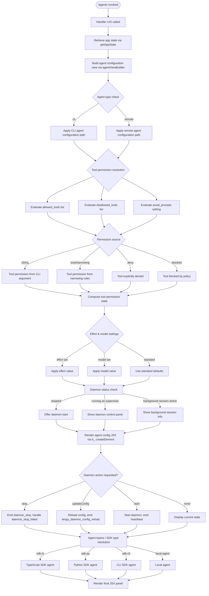

# `/agents`

> Analysis basis: CC v2.1.152 bundle.js (AST extraction + Claude interpretation)
> Minimum version: v2.1.152

---

## Overview

`/agents` is a local-jsx slash command that opens an interactive agent configuration management interface within Claude Code. It allows users to inspect, configure, and control agent instances — including their tool permissions, model settings, effort levels, daemon lifecycle, and team topology — through a rendered JSX panel. The command's handler (`n15`) assembles application state and a rich set of sub-components before returning a React element tree.

---

## Registration

| Field | Value |
|---|---|
| type | `local-jsx` |
| name | `agents` |
| description | `Manage agent configurations` |
| module_id | `pQ1` |
| load_inline | `true` |
| loc_byte | `12259669` |
| loc_byte_end | `12259794` |
| loc_line | `10261` |
| arbor_handler.name | `n15` |
| arbor_handler.fqn | `claude-2.1.152::n15` |
| arbor_handler.kind | `AsyncFunction` |
| arbor_handler.resolution_path | `module_id` |
| arbor_handler.n_hits | `0` |

Analysis basis: CC v2.1.152 bundle.js:+12259669

---

## Input Branching

The handler logic involves more than three distinct branches across agent state transitions, tool-permission evaluation, daemon status checks, and configuration reload paths. A Mermaid flowchart is used.



Analysis basis: CC v2.1.152 bundle.js:+12259503, +12259511, +12259524

---

## Behavioral Spec

### 1. Command Entry — Handler `n15`

The Arbor-resolved handler `n15` is an `AsyncFunction` reached via `module_id → pQ1`. It performs two top-level operations before rendering: it calls the agent view builder (`agentViewBuilder` / `V_`) and the agent command orchestrator (`agentCommandOrchestrator` / `qv`), then passes the results to `tt_.createElement` to produce the JSX output.

```
async function handleAgentsCommand(context):
    appState = agentViewBuilder(context)          // V_
    commandProps = agentCommandOrchestrator(context)  // qv
    return createElement(AgentsPanel, { appState, commandProps })
```

Analysis basis: CC v2.1.152 bundle.js:+12259503, +12259511, +12259524

---

### 2. App State Retrieval — `agentViewBuilder` (`V_`)

The view builder reads the current application state and derives allowed/disallowed tool sets. It uses two helper functions to process the `allowed_tools` and `disallowed_tools` configuration keys respectively, then evaluates the `avoid_prompts` setting.

```
function agentViewBuilder(context):
    state = H.getAppState()

    allowedTools  = resolveToolList(state, "allowed_tools")   // uT8 → sA
    disallowedTools = resolveToolList(state, "disallowed_tools") // mT8 → sA

    return {
        allowedTools,
        disallowedTools,
        avoidPrompts: state["avoid_prompts"],
        effort:       state["effort"],
        model:        state["model"]
    }
```

Key configuration keys read from state:
- `"allowed_tools"` — Analysis basis: CC v2.1.152 bundle.js:+10666341
- `"disallowed_tools"` — Analysis basis: CC v2.1.152 bundle.js:+10666396
- `"avoid_prompts"` — Analysis basis: CC v2.1.152 bundle.js:+10666457
- `"effort"` — Analysis basis: CC v2.1.152 bundle.js:+10666559
- `"model"` — Analysis basis: CC v2.1.152 bundle.js:+10666572

---

### 3. Agent Command Orchestrator — `agentCommandOrchestrator` (`qv`)

This is the primary logic hub. It wires together environment detection, tool permission filtering, agent listing, daemon lifecycle management, and feature-flag gating.

```
function agentCommandOrchestrator(context):
    // Step 1: Environment detection
    envInfo = detectEnvironment()          // uH, w0
    // Distinguishes "cli" vs "remote" agent types
    // Analysis basis: CC v2.1.152 bundle.js:+4687701, +4687712

    // Step 2: Build agent list with tool permission data
    agentList = []
    for each agent in getKnownAgents():    // Y.push
        entry = buildAgentEntry(agent)     // rPH
        if entry.status != "ENOENT":
            agentList.push(entry)
        // Columns padded to width 40    // Analysis: +15408364
        // Two-space separator used      // Analysis: +15406393

    // Step 3: Attach tool-narrowing rules
    toolNarrowingRules = resolveToolNarrowing()  // tB_
    agentList = applyToolNarrowing(agentList, toolNarrowingRules)

    // Step 4: Workflow / feature enable check
    workflowEnabled = checkWorkflowEnabled()     // uN → tengu_workflows_enabled
    // Analysis basis: CC v2.1.152 bundle.js:+4091127

    // Step 5: Filter blocked agents
    blockedAgents = filterBlocked(agentList)     // I_H
    // "blocked" tag applied to matching entries
    // Analysis basis: CC v2.1.152 bundle.js:+9607141

    // Step 6: Resolve per-agent sub-commands
    subCommands = []
    for each sub in [stopSubCmd, failedStopSubCmd, controlSubCmd, quitSubCmd]:
        subCommands.push(sub)   // z.push

    // Step 7: Daemon lifecycle resolver
    daemonState = resolveDaemonLifecycle()  // qm
    // Uses Promise.race + Promise.all with 500ms timeout
    // Analysis basis: CC v2.1.152 bundle.js:+15413604

    // Step 8: Agent team/topology resolver
    teamConfig = resolveAgentTeams(context)  // Ta
    // Reads --agent-teams CLI argument
    // Analysis basis: CC v2.1.152 bundle.js:+5351023

    // Step 9: API/SDK type resolution
    sdkType = resolveSDKType()           // uR → KQ_
    // Possible values: "standard", "tst", "tst-auto"
    // Analysis basis: CC v2.1.152 bundle.js:+9976580, +9976659, +9976709

    // Step 10: Feature flag checks
    featureA = A.has(...)                // Q1.isEnabled check
    featureB = K.some(...) && O.isEnabled(...)
    // "sdk-ts", "sdk-py", "sdk-cli", "local-agent" modes considered
    // Analysis basis: CC v2.1.152 bundle.js:+5223687, +5223701, +5223715, +5223730

    // Step 11: Daemon status file
    statusFilePath = buildStatusPath()   // KI6
    // Uses "daemon.status.json" filename
    // Analysis basis: CC v2.1.152 bundle.js:+12407047

    return {
        agentList,
        workflowEnabled,
        blockedAgents,
        subCommands,
        daemonState,
        teamConfig,
        sdkType,
        statusFilePath
    }
```

Analysis basis: CC v2.1.152 bundle.js:+9607735, +9607774, +9607846, +9607861, +9607875, +9607897, +9607912, +9607924, +9607984, +9608084, +9608102, +9608130, +9608142, +9608153

---

### 4. Agent Entry Builder — `buildAgentEntry` (`rPH`)

Reads an individual agent record, handles missing file gracefully (ENOENT), and formats column output.

```
function buildAgentEntry(agentRef):
    try:
        data = readAgentStore(agentRef)    // A1 → HY7.getStore
    catch error:
        if error.code == "ENOENT":         // Analysis: +12590443
            return null
        throw error

    formatted = formatAgentRow(data)       // Ao1 → Math.max, Object.keys
    keys       = Object.keys(data)         // Analysis: +12590744
    exists     = K.has(agentRef.id)        // Analysis: +12590830

    return {
        data,
        formatted,
        exists
    }
```

Analysis basis: CC v2.1.152 bundle.js:+12590410, +12590435, +12590472

---

### 5. Daemon Lifecycle Management — `resolveDaemonLifecycle` (`qm`)

Handles the three daemon states: `stopped`, supervisor (running), and background session.

```
async function resolveDaemonLifecycle():
    result = await Promise.race([
        Promise.all([shutdownHandler(), timeoutGuard()]),
        errorGuard()
    ])
    // Timeout guard uses 500ms   // Analysis: +15413604

    if daemonState == "stopped":      // Analysis: +15418298
        return { status: "stopped" }

    if sessionType == "supervisor":   // Analysis: +15396324
        return { status: "supervisor", controls: buildSupervisorControls() }

    if sessionType == "background session":  // Analysis: +15418341
        return { status: "background", info: buildBackgroundInfo() }

    // On exit: process.exit called  // Analysis: +15413643
```

Sub-commands emitted by daemon lifecycle:
- `"daemon_stop"` — stop action (Analysis basis: CC v2.1.152 bundle.js:+15418389)
- `"daemon_stop_failed"` — stop failure signal (Analysis basis: CC v2.1.152 bundle.js:+15418426)

Daemon config reload fires `tengu_daemon_config_reload` telemetry (Analysis basis: CC v2.1.152 bundle.js:+15397117).

---

### 6. Tool Permission Resolution — `resolveToolNarrowingRules` (`GZ6`)

Resolves which tools are narrowed, denied, or provided via CLI argument.

```
function resolveToolNarrowingRules(context):
    firstPartyTools = getFirstPartyTools()    // O5H → tG8.flatMap, Nz
    // "deny" disposition used for blocked tools  // Analysis: +10378656

    narrowed = applyNarrowingFilter()         // Vc_ → $i8, l76, GS
    // Sources: "cliArg" | "toolsNarrowing"  // Analysis: +10379242, +10379263

    combined = mergeRules(firstPartyTools, narrowed)  // $21
    return combined
```

Analysis basis: CC v2.1.152 bundle.js:+10379305, +10379322, +10379346

---

### 7. Agent Team / Topology Resolver — `resolveAgentTeams` (`Ta`)

Reads the `--agent-teams` CLI flag and determines the agent topology, including SDK type classification and remote control startup behavior.

```
function resolveAgentTeams(context):
    cliFlag = parseCLIArg("--agent-teams")   // S9 → "--agent-teams" literal
    // Analysis basis: CC v2.1.152 bundle.js:+5351023

    if cliFlag set:
        teamMode = resolveTeamMode(cliFlag)  // S9 → YC7, E6
        // Fires tengu_amber_flint telemetry  // Analysis: +5351135
    else:
        teamMode = defaultTeamMode()

    sdkClient = classifySDKClient()          // NX → uH
    // "sdk-ts" | "sdk-py" | "sdk-cli" | "local-agent"
    // Analysis basis: CC v2.1.152 bundle.js:+5223687, +5223701, +5223715, +5223730

    // Remote control at startup check
    remoteControl = checkRemoteControlAtStartup()  // O0
    // Key: "remoteControlAtStartup"  // Analysis: +13552424

    return { teamMode, sdkClient, remoteControl }
```

Analysis basis: CC v2.1.152 bundle.js:+9606440, +9606456, +9606593, +9606686, +9606757, +9606776, +9606817, +9606823, +9606829, +9606968, +9607009, +9607036

---

### 8. API Provider / SDK Type Resolver — `resolveSDKType` (`KQ_`)

Classifies the API client in use, with special handling for cloud providers.

```
function resolveSDKType(context):
    baseType = detectProviderType()    // uZH
    // Possible bases: "standard", "tst", "tst-auto"
    // tst uses score threshold 100   // Analysis: +9976672

    provider = classifyProvider()     // N → includes check
    // "bedrock", "foundry", "anthropicAws", "mantle", "vertex"
    // Analysis basis: CC v2.1.152 bundle.js:+2040715, +2040765, +2040821, +2040875, +2040923

    if provider == "vertex":
        // ToolSearch:optimistic disabled warning emitted
        // Vertex AI does not accept tool-search beta header
        // Analysis basis: CC v2.1.152 bundle.js:+9977594
        warnToolSearchDisabled()

    if provider includes "anthropic":
        endpoint = "api.anthropic.com"   // Analysis: +2041606

    return { baseType, provider }
```

Analysis basis: CC v2.1.152 bundle.js:+9976568, +9976632, +9976696, +9976723, +9976744

---

### 9. Daemon Status File — `buildStatusPath` (`KI6`)

```
function buildStatusPath():
    parts = hn1.join(...)               // path join
    filename = "daemon.status.json"     // Analysis: +12407047
    return path.join(parts, filename)
```

Analysis basis: CC v2.1.152 bundle.js:+12407033, +12407042, +12407047

---

### 10. Environment / Boolean Normalisation (`uH`, `qK`)

Utility functions used pervasively to coerce string inputs to boolean-like values.

```
function normaliseBooleanString(value):
    if value in ["yes", "on"]:    // Analysis: +26948, +26954
        return true
    if value in ["no", "off"]:    // Analysis: +27099, +27104
        return false
    return String(value)

function normaliseKey(value):
    return String(value)          // qK path
```

Analysis basis: CC v2.1.152 bundle.js:+26899, +27049

---

### 11. First-Party Agent Registration (`f$_`)

When an agent is registered as first-party it receives a `"firstParty"` tag and a UUID generated via `L$_.randomUUID`.

```
function registerFirstPartyAgent(agentDef):
    id = crypto.randomUUID()          // L$_.randomUUID  Analysis: +3174045
    agent = buildAgentRecord(id, agentDef)
    agent.tag = "firstParty"          // Analysis: +3174510
    emitter.emit("agent:registered", agent)  // H.emit  Analysis: +3174157
    return agent
```

Analysis basis: CC v2.1.152 bundle.js:+3174538, +3174092, +3174120

---

## State & Side Effects

| Item | Detail |
|---|---|
| Telemetry: `tengu_slate_harbor` | Fired during environment/CLI-vs-remote detection (bundle.js:+4687731) |
| Telemetry: `tengu_daemon_config_reload` | Fired when daemon configuration is reloaded via `updateConfig` action (bundle.js:+15397117) |
| Telemetry: `tengu_workflows_enabled` | Fired when workflow feature is found enabled during `uN` evaluation (bundle.js:+4091127) |
| Telemetry: `tengu_cobalt_ridge` | Fired inside `GR` during agent command registration on Windows or similar platform branch (bundle.js:+4799244) |
| Telemetry: `tengu_feature_ok` | Fired on successful feature check (bundle.js:+964519) |
| Telemetry: `tengu_feature_bad` | Fired on failed feature check (bundle.js:+964577) |
| Telemetry: `tengu_daemon_control` | Fired when daemon start/stop/control action is taken (bundle.js:+15418464) |
| Telemetry: `tengu_amber_flint` | Fired when agent teams CLI argument is resolved (bundle.js:+5351135) |
| Daemon lifecycle | Calls `Z.stop`, `Z.updateConfig`, `Z.start` on the daemon instance; heartbeat signal `"heartbeat"` used (bundle.js:+15395546) |
| Sub-command signals | `"daemon_stop"` (bundle.js:+15418389) and `"daemon_stop_failed"` (bundle.js:+15418426) emitted as lifecycle events |
| appState changes | Reads `allowed_tools`, `disallowed_tools`, `avoid_prompts`, `effort`, `model` from app state; no writes observed at depth ≤ 2 |
| User settings key | `"userSettings"` key written/read via `O0` → `l_` (bundle.js:+3356231) |
| Remote control flag | `"remoteControlAtStartup"` persisted at startup (bundle.js:+13552424) |
| File I/O | `daemon.status.json` read for daemon status; `d0K.unlinkSync` used for cleanup; `q.write` for status writes |
| Process lifecycle | `process.exit` called when daemon terminates (bundle.js:+15413643) |
| Randomness | `Math.random` used inside `H` (bundle.js:+13371604); `setTimeout` delay up to 2 s with step 1 (bundle.js:+13371618, +13371641) |
| UUID generation | `L$_.randomUUID()` used for first-party agent IDs (bundle.js:+3174045) |
| React rendering | `tt_.createElement` produces the JSX panel returned by the command (bundle.js:+12259524) |
| Vertex AI warning | ToolSearch:optimistic disabled warning logged when provider is Vertex AI (bundle.js:+9977594) |
| Column formatting | Agent rows padded to width `40` with two-space separator (bundle.js:+15408364, +15406393) |

---

## Version History

| Version | Change |
|---|---|
| v2.1.152 | Initial analysis |

---

## Common Mistakes

1. **Assuming `/agents` is a prompt command.** It is `local-jsx` — it renders a React component panel, not a text prompt. Do not expect plain-text output.
2. **Ignoring the `--agent-teams` flag.** Team topology is only resolved when this CLI argument is present; without it, a default single-agent mode is used and `tengu_amber_flint` will not fire.
3. **Conflating `allowed_tools` and `disallowed_tools`.** Both are read independently from app state via separate resolvers (`uT8` and `mT8`); they do not merge automatically — the narrowing pipeline (`GZ6` / `toolsNarrowing`) handles precedence.
4. **Expecting synchronous daemon operations.** The daemon lifecycle resolver (`qm`) uses `Promise.race` with a 500 ms timeout; callers must handle the asynchronous result and the `daemon_stop_failed` signal.
5. **Not accounting for provider-specific restrictions.** When the API provider is Vertex AI, ToolSearch:optimistic is silently disabled unless `ENABLE_TOOL_SEARCH=true` is set; this affects agent tool availability.
6. **Treating `"tst"` mode as equivalent to `"standard"`.** The `tst` SDK type uses a score threshold of `100` (bundle.js:+9976672) which alters agent selection behaviour relative to standard mode.

---

## Appendix — Identifier Mapping

> For bundle debugging only. Identifiers change across versions.

| Identifier | Role |
|---|---|
| `n15` | Main handler (`AsyncFunction`) for `/agents` command; Arbor-resolved entry point |
| `V_` | Agent view builder — reads app state, derives tool configuration |
| `H` | App state / event emitter object; also provides `Math.random`/`setTimeout` scheduling |
| `uT8` | Allowed-tools list resolver (reads `"allowed_tools"` key) |
| `sA` | Shared tool-list state accessor used by both `uT8` and `mT8` |
| `mT8` | Disallowed-tools list resolver (reads `"disallowed_tools"` key) |
| `qv` | Agent command orchestrator — main composition function |
| `uH` | Boolean/string normaliser utility (maps `"yes"`/`"on"` → true, `"no"`/`"off"` → false) |
| `w0` | Environment detection function (distinguishes `"cli"` vs `"remote"`) |
| `wQ` | Sub-utility called during environment detection |
| `qK` | Key normaliser — coerces values to `String` |
| `E6` | Module/feature registration cache lookup |
| `hO6` | Cache hit handler for feature registration |
| `SO6` | Cache miss handler for feature registration |
| `oe` | Feature entry builder |
| `P68` | Deduplication set manager (uses `O$_`, `MzH`) |
| `x6` | Feature clock / timestamp recorder (uses `Date.now`) |
| `Y` | Agent list builder / iteration context |
| `rPH` | Individual agent entry builder — reads store, formats columns |
| `A1` | Agent store accessor (uses `HY7.getStore`) |
| `L8` | Secondary agent data loader |
| `aHA` | Agent header assembler |
| `GH` | String formatter used for agent display (uses `String`) |
| `K` | Agent map / collection with `.has`, `.some`, `.filter`, `.map` |
| `q` | File/socket writer with `.write`, `.close`, `.delete` methods |
| `Ao1` | Agent row formatter (uses `Object.keys`, `Math.max`) |
| `M` | Agent session manager with `.get`, `.set`, `.delete`, `.close` |
| `A` | Session type classifier (uses `.toLowerCase`) |
| `L` | Session lifecycle helper (uses `q.add`, `q.delete`, `M.finally`) |
| `T` | Stop/control action handler; calls `Y` and `H` |
| `b` | Event object (provides `.preventDefault`) |
| `O0` | User settings writer (key `"userSettings"`) |
| `Z` | Daemon instance object with `.stop`, `.updateConfig`, `.start` |
| `JGK` | Heartbeat / keepalive manager |
| `se` | Heartbeat signal emitter |
| `V` | New daemon instance starter (`.start`) |
| `c` | Shared React/render context |
| `tB_` | Tool-narrowing rule assembler |
| `E_` | Module initialiser / ESM interop setup |
| `AS6` | Bound async setup function |
| `uN` | Workflow enablement checker (fires `tengu_workflows_enabled`) |
| `nq8` | Workflow sub-check utility |
| `Lk` | Workflow configuration reader |
| `I_H` | Blocked-agent filter (applies `"blocked"` tag) |
| `GZ6` | Tool narrowing rules resolver |
| `O5H` | First-party tool list builder (uses `tG8.flatMap`) |
| `Vc_` | Narrowing filter applicator (`cliArg` / `toolsNarrowing` sources) |
| `$21` | Rule merge utility |
| `eB_` | Sub-command registration utility |
| `GR` | Agent command registrar (fires `tengu_cobalt_ridge`; Windows branch) |
| `sK` | Agent selector / lookup helper |
| `z` | Sub-command array |
| `SH` | `"daemon_stop"` sub-command descriptor |
| `mH` | `"daemon_stop_failed"` sub-command descriptor |
| `_y` | Agent registration entry creator |
| `Qb` | Registration queue accessor |
| `LEH` | Registration log / ledger helper |
| `f$_` | First-party agent registrar (uses `randomUUID`, `"firstParty"` tag) |
| `qm` | Daemon lifecycle resolver (uses `Promise.race`, `Promise.all`, 500 ms timeout) |
| `GQ` | Shutdown handler (uses `MKH.shutdown`) |
| `vQ` | Timeout guard (uses `clearTimeout`) |
| `n8` | Abort / error signal handler (signals `"aborted"`, `"abort"`) |
| `Ta` | Agent team / topology resolver |
| `NX` | SDK client classifier (outputs `"sdk-ts"`, `"sdk-py"`, `"sdk-cli"`, `"local-agent"`) |
| `qw` | CLI argument parser sub-utility |
| `feH` | Agent feature hint resolver |
| `S9` | `--agent-teams` CLI argument processor (fires `tengu_amber_flint`) |
| `YC7` | Team mode builder |
| `ovL` | Optional agent lifecycle hook A |
| `avL` | Optional agent lifecycle hook B |
| `uR` | API provider / SDK type resolver entry point |
| `KQ_` | SDK type classifier (produces `"standard"`, `"tst"`, `"tst-auto"`) |
| `N` | Provider type detector (checks `"bedrock"`, `"vertex"`, etc.) |
| `yA` | Provider-specific configuration builder |
| `sL` | Provider sub-feature resolver |
| `X4` | Feature flag accessor |
| `O` | Feature flag object with `.isEnabled` |
| `k8` | Feature flag backing store |
| `$` | Session includes / membership checker |
| `Sn1` | Session state snapshot builder (uses `Date.now`, `A1`, `KI6`, `CH`) |
| `Ki` | Session identifier builder |
| `KI6` | Daemon status file path builder (produces `"daemon.status.json"`) |
| `CH` | JSON serialiser wrapper (uses `JSON.stringify`) |

---

Note: index built via Arbor fallback; some signals (telemetry, literals) may be missing — see arbor-fallback.js.