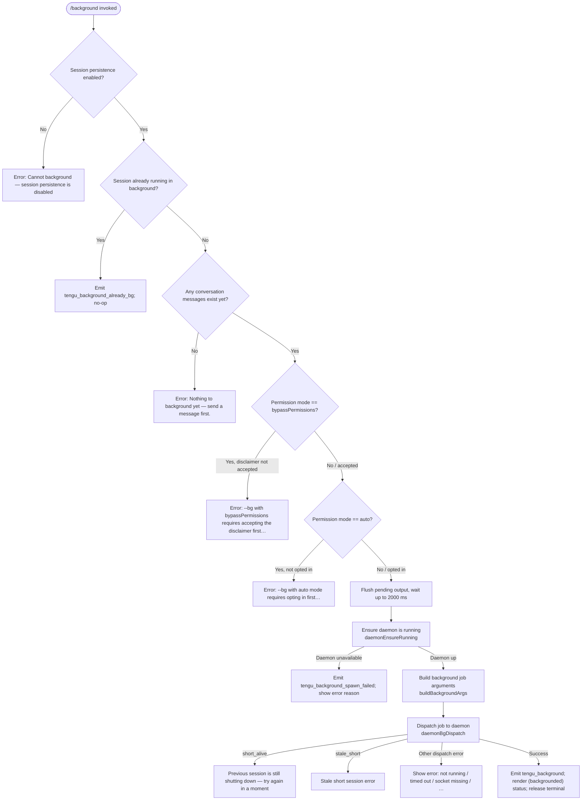

# `/background`

> Analysis basis: CC v2.1.152 bundle.js (AST extraction + Claude interpretation)
> Minimum version: v2.1.152

---

## Overview

The `/background` command (alias `/bg`) detaches the current interactive Claude Code session from the terminal and hands it off to the background daemon as a persistent job. The forked job continues running autonomously while the terminal is freed for other use. Resuming the job later is possible via the session/job identifier written to the daemon's job store.

---

## Registration

| Field | Value |
|---|---|
| type | `local-jsx` |
| name | `background` |
| description | `Send this session to the background and free the terminal` |
| aliases | `["bg"]` |
| argumentHint | `[prompt]` |
| immediate | `null` |
| module_id | `Ps1` |
| load_inline | `true` |
| loc_byte | `12740542` |
| loc_byte_end | `12740782` |
| loc_line | `11052` |
| arbor_handler.name | `N$5` |
| arbor_handler.fqn | `claude-2.1.152::N$5` |
| arbor_handler.kind | `AsyncFunction` |
| arbor_handler.resolution_path | `module_id` |
| arbor_handler.n_hits | `0` |

Analysis basis: CC v2.1.152 bundle.js:+12740542

---

## Input Branching

The command has more than three distinct decision branches (session persistence check, already-backgrounded guard, permission-mode gate, auto-mode gate, conversation-empty guard, daemon reachability, dispatch outcome). A Mermaid flowchart is used.



---

## Behavioral Spec

### Handler Entry — `backgroundCommandHandler` (`N$5`)

The Arbor-resolved handler `N$5` is an `AsyncFunction`. The call graph shows it immediately performs two pre-flight checks before any daemon interaction.

```
async function backgroundCommandHandler(commandInput, appState):
    // Pre-flight 1: session persistence check
    if not sessionPersistenceEnabled(appState):
        return error("Cannot background — session persistence is disabled, "
                     "so the forked job would have nothing to resume.")
    // Analysis basis: CC v2.1.152 bundle.js:+12739984

    // Pre-flight 2: already-backgrounded guard
    if sessionIsAlreadyBackground(appState):
        emit telemetry("tengu_background_already_bg")
        return // silent no-op
    // Analysis basis: CC v2.1.152 bundle.js:+12739917

    // Pre-flight 3: conversation must have content
    if conversationMessages.length == 0:
        return error("Nothing to background yet — send a message first.")
    // Analysis basis: CC v2.1.152 bundle.js:+12740160

    // Permission gate checks (delegated to permissionGateCheck)
    permissionGateCheck(appState)   // may throw ERR3 or ERR4 (see below)

    // Flush output; timeout = 2000 ms ("flush timeout")
    await flushWithTimeout(2000)
    // Analysis basis: CC v2.1.152 bundle.js:+12736324

    // Collect active session list for daemon
    sessions = Array.from(sessionMap.values())
    // Analysis basis: CC v2.1.152 bundle.js:+12736067

    // Ensure daemon is up (daemonEnsureRunning)
    daemonHandle = await daemonEnsureRunning(appState)
    if daemonHandle == null:
        emit telemetry("tengu_background_spawn_failed")
        return error(daemonErrorReason)
    // Analysis basis: CC v2.1.152 bundle.js:+12736931

    // Build CLI argument vector for the background job
    args = buildBackgroundArgs(appState, commandInput)

    // Dispatch to daemon
    result = await daemonBgDispatch(daemonHandle, args, timeout=6000)
    // Analysis basis: CC v2.1.152 bundle.js:+12712304

    handleDispatchResult(result)    // branches below
    emit telemetry("tengu_background")
    renderBackgroundedStatus()      // shows "(backgrounded)"
    // Analysis basis: CC v2.1.152 bundle.js:+12737684
```

Analysis basis: CC v2.1.152 bundle.js:+12739903

---

### Permission Gate — `permissionGateCheck`

```
function permissionGateCheck(appState):
    mode = appState.permissionMode  // reads "bypassPermissions" | "auto" | other

    if mode == "bypassPermissions":
        // Check flag --dangerously-skip-permissions was accepted interactively
        if not disclaimerAccepted(appState):
            throw "--bg with bypassPermissions requires accepting the disclaimer first. "
                  "Run `claude --dangerously-skip-permissions` once interactively."
        // Analysis basis: CC v2.1.152 bundle.js:+12733569

    if mode == "auto":
        if not autoModeOptedIn(appState):
            throw "--bg with auto mode requires opting in first. "
                  "Run `claude --permission-mode auto` once interactively."
        // Analysis basis: CC v2.1.152 bundle.js:+12733731
```

Analysis basis: CC v2.1.152 bundle.js:+12733366

---

### Background Argument Builder — `buildBackgroundArgs` (`D$5`)

This function assembles the full CLI argument vector passed to the spawned background process. Several flag families are recognised and propagated.

```
function buildBackgroundArgs(appState, commandInput):
    args = []

    // Resume flags: --resume=<id>, -r=<id>, --resume, -r
    // Analysis basis: CC v2.1.152 bundle.js:+12732553

    // Session identity: --session-id=<id>, --session-id
    // Analysis basis: CC v2.1.152 bundle.js:+12732907

    // Fork flag: --fork-session (triggers repl/none mode)
    // Analysis basis: CC v2.1.152 bundle.js:+12717048

    // Agent mode: --agent
    // Analysis basis: CC v2.1.152 bundle.js:+12716807

    // Name: --name / -n
    // Analysis basis: CC v2.1.152 bundle.js:+12716834

    // Continue: -c / --continue
    // Analysis basis: CC v2.1.152 bundle.js:+12716947

    // Permission pass-through: --permission-mode, --dangerously-skip-permissions,
    //   --allow-dangerously-skip-permissions
    // Analysis basis: CC v2.1.152 bundle.js:+12733369

    // Additional dirs: --add-dir
    // Analysis basis: CC v2.1.152 bundle.js:+12736451

    // Tool lists: --allowed-tools, --disallowed-tools
    // Analysis basis: CC v2.1.152 bundle.js:+12736486

    // Model / effort: --model, --effort
    // Analysis basis: CC v2.1.152 bundle.js:+12736558

    // Environment variable pass-through (cloud credentials):
    //   CLAUDE_CONFIG_DIR, CLAUDE_INTERNAL_FC_OVERRIDES,
    //   AWS_REGION, AWS_DEFAULT_REGION, AWS_PROFILE,
    //   GOOGLE_APPLICATION_CREDENTIALS, GOOGLE_CLOUD_PROJECT, GCLOUD_PROJECT
    // Analysis basis: CC v2.1.152 bundle.js:+12734347

    // Optional prompt from commandInput appended last
    if commandInput.prompt != "":
        args.push(commandInput.prompt)

    return args
```

Analysis basis: CC v2.1.152 bundle.js:+12716418

---

### Daemon Ensure Running — `daemonEnsureRunning` (`tB`)

```
async function daemonEnsureRunning(appState):
    status = readDaemonStatus()   // reads daemon.status.json
    // Analysis basis: CC v2.1.152 bundle.js:+12407047

    if status == "up":
        emit telemetry("tengu_bg_daemon_ensure_running")
        return existingHandle

    // Stale exec path check
    if serviceExecPathIsStale():
        emit telemetry("tengu_bg_daemon_service_stale_exec")
        log warning: "daemon service exec path is stale…"
        // Analysis basis: CC v2.1.152 bundle.js:+12677318

    platform = detectPlatform()   // "macos" | "linux"
    // Analysis basis: CC v2.1.152 bundle.js:+12677778

    installMode = readInstallPreference()  // "ask" | "yes" | "once" | "never" | "no"

    if installMode == "ask":
        // Prompt user: "Install as a service now? [y/N/never, or 'once' just for now]"
        emit telemetry("tengu_bg_daemon_cold_start_ask")
        answer = promptUser()
        emit telemetry("tengu_bg_daemon_cold_start_ask_answer")
        // Analysis basis: CC v2.1.152 bundle.js:+12684133

    if willInstall:
        installDaemonService()
        pollUntilReachable(timeout=5000)
        // "service installed but the daemon did not become reachable within 5s"
        // Analysis basis: CC v2.1.152 bundle.js:+12684664
        emit telemetry("tengu_bg_daemon_install")
    else if willSpawnTransient:
        spawnTransientDaemon(args=["run", "--origin", "transient",
                                   "--spawned-by", spawnerId])
        // Analysis basis: CC v2.1.152 bundle.js:+12678595
        pollUntilReachable(timeout=30000..60000)
        // Analysis basis: CC v2.1.152 bundle.js:+12678865
    else:
        // "No background daemon is running."
        emit telemetry("tengu_bg_daemon_cold_start_ask")
        return null
```

Analysis basis: CC v2.1.152 bundle.js:+12677137

---

### Daemon Dispatch — `daemonBgDispatch` (`B6A`)

```
async function daemonBgDispatch(daemonHandle, args, options):
    // Write dispatch file; connect to control socket
    // IPC message type: "cli-bg-dispatch"
    // Analysis basis: CC v2.1.152 bundle.js:+12712063

    // Wait for ACK; no-ack timeout = 6000 ms
    // Analysis basis: CC v2.1.152 bundle.js:+12712304

    response = await sendAndAwaitAck(daemonHandle, args, timeout=6000)

    switch response.code:
        case "EALIVE":   // Analysis basis: CC v2.1.152 bundle.js:+12712406
            return { status: "already_alive" }
        case "ESTALE":   // Analysis basis: CC v2.1.152 bundle.js:+12712536
            return { status: "stale" }
        case "ESTARTING": // Analysis basis: CC v2.1.152 bundle.js:+12713055
            return { status: "starting" }
        default:
            return { status: "ok", jobId: response.jobId }

    // On dispatch error, emit telemetry("tengu_bg_dispatch_fallback")
    // and attempt rescue path (emit tengu_bg_dispatch_rescued)
    // Analysis basis: CC v2.1.152 bundle.js:+12719737
```

Analysis basis: CC v2.1.152 bundle.js:+12711813

---

### Dispatch Error Mapping

The handler maps the dispatch result code to user-facing messages:

| Result code / state | User-facing message | loc_byte |
|---|---|---|
| `not running` | "not running" | +12723156 |
| `timed out` | "timed out" | +12723194 |
| `couldn't write dispatch file` | "couldn't write dispatch file" | +12723233 |
| `socket missing` | "socket missing" | +12723284 |
| `service still starting` | "service still starting" | +12723323 |
| `id collision with a prior job` | "id collision with a prior job" | +12723372 |
| `short_alive` | "Previous session is still shutting down — try again in a moment" | +12720660 |
| `stale_short` | (stale session error) | +12720738 |

Analysis basis: CC v2.1.152 bundle.js:+12720823

---

### Daemon Worker — Background Session Handler (`kI8`)

Once handed off, the daemon-side worker manages the background session lifecycle. Key constants observed:

- Flush timeout: **2000 ms** (Analysis basis: CC v2.1.152 bundle.js:+12736324)
- AbortSignal timeout applied to the whole hand-off sequence (Analysis basis: CC v2.1.152 bundle.js:+12737122)
- `120` seconds used as an outer timeout for the daemon-side session (Analysis basis: CC v2.1.152 bundle.js:+12737454)
- Status label rendered to terminal: `"(backgrounded)"` (Analysis basis: CC v2.1.152 bundle.js:+12737684)
- Background job type string: `"background session"` (Analysis basis: CC v2.1.152 bundle.js:+15418341)

```
async function daemonWorkerBackgroundSession(sessionContext):
    // Detach from controlling terminal
    sendDetachRequest()          // IPC type: "detach-request"
    // Analysis basis: CC v2.1.152 bundle.js:+10760335

    // Hand session state to daemon worker thread
    transferSessionToDaemonWorker(sessionContext)

    // Render status marker "(backgrounded)" in the vacated terminal
    printStatus("(backgrounded)")

    // Session continues inside daemon under "background session" label
    // stopped state is tracked for re-attach / resume
```

Analysis basis: CC v2.1.152 bundle.js:+12737404

---

### Spare-Process Pool (background process optimisation)

The daemon maintains a spare-process pool to reduce cold-start latency for `/background` calls.

```
function manageSparePool():
    if spareProcessEnabled():
        emit telemetry("tengu_bg_spare_enable")

    if claimSpare(sessionId):
        emit telemetry("tengu_bg_spare_claim")
    else:
        emit telemetry("tengu_bg_spare_claim_fail")

    if spawnNewSpare():
        emit telemetry("tengu_bg_spare_spawn")
```

Analysis basis: CC v2.1.152 bundle.js:+15383605

---

## State & Side Effects

| Item | Detail |
|---|---|
| Telemetry — pre-flight | `tengu_background_already_bg` (session already in background) |
| Telemetry — dispatch | `tengu_bg_dispatch`, `tengu_bg_dispatch_fallback`, `tengu_bg_dispatch_rescued` |
| Telemetry — daemon | `tengu_bg_daemon_ensure_running`, `tengu_bg_daemon_service_stale_exec`, `tengu_bg_daemon_install`, `tengu_bg_daemon_cold_start_ask`, `tengu_bg_daemon_cold_start_ask_answer`, `tengu_bg_daemon_spawn_failed`, `tengu_bg_daemon_service_poll_fallthrough` |
| Telemetry — main | `tengu_background`, `tengu_background_spawn_failed` |
| Telemetry — daemon spare pool | `tengu_bg_spare_enable`, `tengu_bg_spare_claim`, `tengu_bg_spare_claim_fail`, `tengu_bg_spare_spawn` |
| Telemetry — SIGKILL / memory | `tengu_bg_dispatch_sigkill_escalate`, `tengu_bg_dispatch_low_mem` |
| Telemetry — config | `tengu_config_parse_error`, `tengu_config_lock_contention`, `tengu_config_stale_write`, `tengu_config_auth_loss_prevented`, `tengu_daemon_config_reload` |
| Telemetry — session rename | `tengu_rename_full_session_fork` |
| Daemon status file | Reads/writes `daemon.status.json` inside the Claude config directory |
| Job store | Creates a job entry under the `jobs/` subdirectory of the config dir |
| IPC socket | Connects to the daemon control socket; sends `"cli-bg-dispatch"` message |
| Terminal | Releases the controlling terminal after printing `"(backgrounded)"` |
| appState changes | Session mode transitions to background; `sessionPersistenceEnabled` must be true beforehand |
| Process management | May spawn a transient daemon process (`--origin transient`) or install a persistent service |
| Spare-process pool | Daemon may claim or spawn a spare process to accelerate the hand-off |
| Sound | Not observed in traversal |

---

## Version History

| Version | Change |
|---|---|
| v2.1.152 | Initial analysis |

---

## Common Mistakes

1. **Running `/background` before sending any message** — the command guards against empty conversations and returns *"Nothing to background yet — send a message first."* You must have at least one exchange before backgrounding.
2. **Using `/background` with `--dangerously-skip-permissions` without prior interactive acceptance** — the disclaimer must be accepted once in an interactive session before this flag combination is permitted in background mode.
3. **Using `/background` with `--permission-mode auto` without prior opt-in** — similarly, `auto` mode must first be confirmed interactively via `claude --permission-mode auto`.
4. **Expecting instant daemon availability** — if no daemon is running and the user declines installation, `/background` fails with *"No background daemon is running."* Run `claude daemon install` to set up a persistent service.
5. **Retrying immediately after a `short_alive` error** — the message *"Previous session is still shutting down — try again in a moment"* indicates the prior session has not fully exited yet; a brief wait is required.
6. **Assuming session persistence is always available** — when session persistence is explicitly disabled (e.g., certain non-standard configurations), `/background` cannot operate and returns an error. The forked job requires a resumable session ID.
7. **Forgetting that `/bg` is the canonical alias** — both `/background` and `/bg` invoke the same handler; the alias is first-class and preferred in interactive usage.

---

## Appendix — Identifier Mapping

> For bundle debugging only. Identifiers change across versions.

| Identifier | Role |
|---|---|
| `N$5` | Main handler for `/background` command (AsyncFunction; Arbor-resolved) |
| `II8` | Background session hand-off orchestrator (flush + dispatch entry) |
| `kI8` | Daemon-side background session worker |
| `D$5` | Background argument builder (constructs CLI argv for spawned job) |
| `tB` | `daemonEnsureRunning` — checks/starts daemon, handles install/transient-spawn |
| `B6A` | `daemonBgDispatch` — sends `cli-bg-dispatch` IPC message, awaits ACK |
| `CI6` | Daemon cold-start / service install flow |
| `tZ8` | Control-socket connect helper (used by dispatch) |
| `uO` | Lower-level control-socket send/receive helper |
| `mSH` | Dispatch file write helper |
| `E$5` | Permission-gate check (bypassPermissions / auto mode validation) |
| `kl` | Session fork / job initialisation (creates job entry, generates ID) |
| `Sn1` | Job metadata writer (`daemon.status.json` update) |
| `KI6` | Job status path resolver |
| `W5H` | Detach-request sender (triggers terminal release) |
| `NZ1` | Background task label handler (`"task"` / `"background session"`) |
| `ba` | Daemon write helper (writes `"detach-request"` via control stream) |
| `sPH` | Environment / context validation for background session |
| `r6A` | Hook-registration helper called during hand-off |
| `BL` | Promise-race timeout utility (flush timeout, 2000 ms) |
| `vT` | Hook registration forwarding helper |
| `Y` | Supervisor / job-map manager (stop/start/delete job entries) |
| `rPH` | Job status reporter |
| `Ao1` | Job listing / padding formatter |
| `JGK` | Heartbeat sender for background jobs |
| `p6A` | Path-bearing argument normaliser for dispatch |
| `qs1` | Dispatch result classifier |
| `n8` | Async timeout helper with unref |
| `BF` | Post-dispatch rescue / cleanup helper |
| `_AH` | Config-write / amber-anchor helper |
| `M8` | Global config save with lock |
| `S$_` | Config-with-lock writer (backup management) |
| `z76` | Atomic file writer (randomBytes temp, fsync, rename) |
| `h$_` | Config directory path helper |
| `m66` | Forked-agent session runner |
| `MH5` | Agent query executor within forked session |
| `T0` | Single agent turn processor |
| `I28` | App-state reader/writer during turn |
| `Py` | Query pipeline entry (builds request, calls API) |
| `FHK` | Core API query handler (streaming + retry logic) |
| `PRH` | Message normalisation wrapper |
| `fQ_` | Context-file loader for query |
| `l08` | Conversation message serialiser |
| `fT` | Message formatter / tool-use flattener |
| `ySL` | System-prompt serialiser |
| `Uf` | Session-type predicate |
| `Uv` | Session map accessor |
| `vq6` | Additional-directory flag builder |
| `wYH` | Workspace/file-context loader |
| `d$` | Compact-boundary message slicer |
| `al_` | Forked-agent telemetry recorder |
| `Zq6` | Agent run-state tracker |
| `PV8` | Conversation metadata builder |
| `E6` | Event-bus emitter |
| `hH` | Error reporter / log handler |
| `GH` | String-conversion utility |
| `CH` | JSON serialisation helper |
| `B6` | JSON parsing helper |
| `N` | Log-level formatter |
| `j8` | Logging sink |
| `L8` | Warning/error logger |
| `u9` | Daemon-worker bootstrap |
| `_OH` | Worker-thread entry point |
| `e_H` | Background session event handler |
| `Et1` | Session-persistence flag accessor |
| `gC` | Background-context validator |
| `Zg` | Auto-mode opt-in checker |
| `tm` | Settings multi-layer reader |
| `x8` | User/local/flag/policy settings merger |
| `yl` | Flag-settings reader |
| `z_` | Log helper (error path) |
| `pv` | Low-level log writer |
| `SU` | Tool-list array normaliser |
| `xy` | Tool-filter predicate builder |
| `cc` | Tool-list canonicaliser |
| `JK` | Tool-filter applicator |
| `qT8` | Tool availability checker |
| `JH6` | Tool-name prefix checker |
| `J3` | Session-context builder |
| `kB` | Session-configuration finaliser |
| `y6` | Config accessor |
| `fT8` | Compact-boundary finder |
| `XJ` | Compact-boundary marker |
| `dO` | Atomic file writer (hex random, writeFile + rename) |
| `d5` | Job-file persistence helper |
| `aw` | Cache-entry invalidator |
| `n9` | Job-metadata loader (stat + readFile + cache) |
| `xHH` | Working/active state classifier |
| `_s1` | Session list formatter |
| `Y$5` | Shell-command builder for Windows/Unix |
| `zU6` | Windows shell detector (Git Bash fallback) |
| `Z$5` | Argument accumulator with prefix filter |
| `Ds1` | Resume-flag parser |
| `T$5` | Session-ID flag parser |
| `ws1` | Environment variable pass-through collector |
| `v$5` | Allowed-tools flag inspector |
| `js1` | Fleet-mode argument injector |
| `RR` | Retry/respawn decision helper |
| `b6` | Current-session-ID accessor |
| `KU6` | Session-ID store reader |
| `z_` | Log-error helper |
| `cO` | Background-service status checker |
| `fzH` | Event-bus status query |
| `te` | Daemon-not-running error builder |
| `OKH` | Error-message formatter for daemon unavailable |
| `Opq` | Config-entry enumerator |
| `xgH` | Config-timestamp recorder |
| `bgH` | Config background-field accessor |
| `uO6` | Config user-object accessor |
| `R$_` | Config backup-path builder |
| `Efq` | Atomic-write options builder |
| `z76` | Atomic file writer (reused) |
| `S$_` | Config-with-lock writer (reused) |
| `h$_` | Config-dir helper (reused) |
| `Ki` | Timestamp / session-start recorder |
| `A1` | AsyncLocalStorage store reader |
| `KI6` | Job status path builder (reused) |
| `rG` | Jobs-directory path builder |
| `uK` | Jobs-base directory resolver |
| `mSH` | Dispatch-file path builder (reused) |
| `bJ6` | Background job JSX renderer |
| `vNH` | Terminal-release notifier |
| `Ry` | Random-bytes session-ID generator |
| `Su` | Command lifecycle exit handler |
| `fV6` | Message-type tombstone checker |
| `m21` | Tombstone-flag inspector |
| `D7H` | Tool-use-ID set manager |
| `D` | Session runner / process-pool manager |
| `v_H` | Hook invocation helper |
| `a_H` | AbortSignal / cancellation helper |
| `pT8` | Turn-interrupt checker |
| `vFL` | Fork-context builder |
| `IR8` | MCP server context builder |
| `iE6` | Dynamic tool registrar |
| `T8` | IPC framing reader (Buffer concat + indexOf) |
| `X` | Socket read-line splitter |
| `J` | Daemon-worker session runner |
| `Yb1` | Tool-permission context builder |
| `XS` | Tool-name trimmer |
| `NP` | Provider/auth type classifier |
| `yA` | Auth URL builder |
| `sL` | Model-string normaliser |
| `aA_` | Managed-key prefix stripper |
| `g9` | Auth-provider branching helper |
| `LBH` | Login-provider URL builder |
| `gG` | Query-provider finaliser |
| `EK` | Model-capability checker |