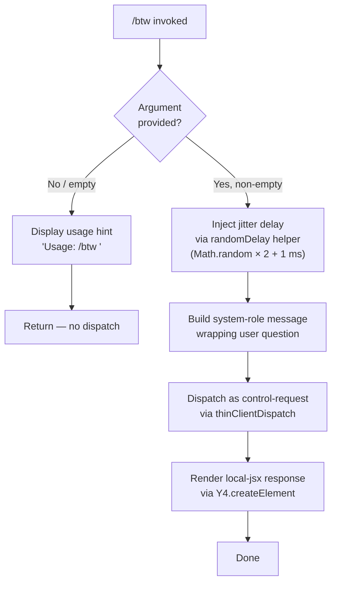

# `/btw`

> Analysis basis: CC v2.1.152 bundle.js (AST extraction + Claude interpretation)
> Minimum version: v2.1.152

---

## Overview

`/btw` ("by the way") lets the user inject a quick side question or clarifying remark into the active Claude Code session without disrupting the main conversation thread. It dispatches the question immediately as a `control-request` to the thin-client layer, so the agent handles it in-band without forking a new session. The command is registered as a `local-jsx` type, meaning it renders a React component inline within the terminal UI.

---

## Registration

| Field | Value |
|---|---|
| type | `local-jsx` |
| name | `btw` |
| description | Ask a quick side question without interrupting the main conversation |
| argumentHint | `<question>` |
| immediate | `true` |
| thinClientDispatch | `control-request` |
| module_id | `DT1` |
| load_inline | `true` |
| loc_byte | `10700780` |
| loc_byte_end | `10701019` |
| loc_line | `8642` |
| arbor_handler.name | `_gL` |
| arbor_handler.fqn | `claude-2.1.152::_gL` |
| arbor_handler.kind | `AsyncFunction` |
| arbor_handler.resolution_path | `module_id` |
| arbor_handler.n_hits | `0` |

Analysis basis: CC v2.1.152 bundle.js:+10700780

---

## Input Branching

The handler has three distinct paths based on whether the user supplied a question argument, whether the argument is non-empty, and the subsequent dispatch/render flow. A Mermaid flowchart is used.



Analysis basis: CC v2.1.152 bundle.js:+10700375 (usage string), +10700416 (system role), +10700485 (createElement call), +13371602 (jitter constants)

---

## Behavioral Spec

### 1. Argument Validation

When the user invokes `/btw` with no argument or only whitespace, the handler surfaces the literal usage string `"Usage: /btw <your question>"` and returns immediately without sending any message to the agent.

```
function handleBtw(rawArgument):
    trimmed = rawArgument.trim()
    if trimmed is empty:
        display("Usage: /btw <your question>")
        return
    proceedToDispatch(trimmed)
```

Analysis basis: CC v2.1.152 bundle.js:+10700375 (usage literal), +10700377 (string constant)

---

### 2. Jitter Delay Before Dispatch

Before the control-request is sent, the handler calls a random-delay utility (`randomDelay`) that schedules a `setTimeout` with a duration computed as `Math.random() * 2 + 1` milliseconds. This sub-millisecond-to-3 ms jitter is likely a debounce / collision-avoidance measure for rapid successive invocations.

```
function randomDelay():
    jitterMs = Math.random() * 2 + 1   // range: [1, 3) ms
    await new Promise(resolve => setTimeout(resolve, jitterMs))
```

Analysis basis: CC v2.1.152 bundle.js:+13371602 (constant `2`), +13371618 (constant `1`), +13371604 (`Math.random` call), +13371641 (`setTimeout` call)

---

### 3. Message Construction and System-Role Wrap

After the delay, the handler wraps the trimmed question in a message object whose `role` field is set to `"system"`. This instructs the agent to treat the injected content as an out-of-band system-level annotation rather than a normal user turn, preserving the conversational context of the main thread.

```
function buildControlMessage(question):
    return {
        role: "system",       // signals out-of-band side question
        content: question
    }
```

Analysis basis: CC v2.1.152 bundle.js:+10700416 (`"system"` literal)

---

### 4. Thin-Client Dispatch (`control-request`)

The constructed message is forwarded through the `thinClientDispatch` pathway using the `"control-request"` channel. This channel is distinct from the normal user-message channel; it allows the agent loop to process the side question without replacing the pending main-thread turn.

The handler (`_gL`, resolved via module `DT1`) is an `AsyncFunction`. It invokes `configManager` (`M8`) to obtain the current project configuration and `saveConfigWithLock` (`S$_`) if any configuration mutation is required as a side effect of the side question. The config subsystem uses file locking, backup rotation, and stale-write guards (see State & Side Effects).

```
async function btwHandler(args, context):
    await randomDelay()
    message = buildControlMessage(args.question)
    await thinClientDispatch("control-request", message, context)
    return renderBtwJsx(message)
```

Analysis basis: CC v2.1.152 bundle.js:+10700375 (`_gL` → `H`), +10700439 (`_gL` → `M8`), +10700485 (`_gL` → `Y4.createElement`)

---

### 5. JSX Render

After dispatch, the handler produces a React element via `Y4.createElement` to render confirmation or the echoed question within the terminal UI inline component. This is the `local-jsx` render path.

```
function renderBtwJsx(message):
    return Y4.createElement(BtwResponseComponent, { message })
```

Analysis basis: CC v2.1.152 bundle.js:+10700485

---

### 6. Config Manager and Lock Subsystem (called transitively)

`_gL` calls `configManager` (`M8`), which in turn calls `saveConfigWithLock` (`S$_`). The lock subsystem:

- Creates a lock directory with `mkdirSync` before writing.
- Uses `Date.now()` to timestamp writes.
- Detects stale lock contention and emits `tengu_config_lock_contention`.
- Prevents auth-data loss (GH #3117 guard) and emits `tengu_config_stale_write` or `tengu_config_auth_loss_prevented` if an inconsistency is detected.
- Rotates backups in a `backups/` subdirectory, keeping up to 5 copies (constant `5` at bundle.js:+3202383); backup filenames contain the `.backup.` infix (literal at +3202250).
- Config lock acquisition timeout warning: `"Lock acquisition took longer than expected - another Claude instance may be running"` (bundle.js:+3201364).
- Config file is read as `utf-8` (bundle.js:+3203480).
- Config parse errors are guarded by `"Config accessed before allowed."` (bundle.js:+3203397) and emit `tengu_config_parse_error`.

```
function saveConfigWithLock(configPath, updater):
    lockDir = dirname(configPath)
    mkdirSync(lockDir, { recursive: true })
    timestamp = Date.now()
    try:
        acquireLock(lockDir, timeout=60000ms)   // +3202134
    catch timeout:
        emit("tengu_config_lock_contention")
        warn("Lock acquisition took longer than expected...")
    currentDisk = readFileSync(configPath, "utf-8")
    parsed = JSON.parse(currentDisk)
    if cachedHasAuth and parsedMissingAuth:
        emit("tengu_config_auth_loss_prevented")
        return  // refuse write, guard GH #3117
    updated = updater(parsed)
    rotateBackups(configPath, maxBackups=5)
    atomicWrite(configPath, updated)
    emit("tengu_config_stale_write")  // if stale condition detected
```

Analysis basis: CC v2.1.152 bundle.js:+3198454 (`M8`→`S$_`), +3201180 (`mkdirSync`), +3201225 (`Date.now`), +3201364 (lock warning), +3201453 (lock contention event), +3201589 (stale write event), +3201780 (auth-loss guard message), +3201932 (auth loss prevented event), +3202134 (60 000 ms timeout), +3202250 (`.backup.`), +3202383 (max 5 backups), +3203397 (pre-allowed guard), +3203480 (utf-8 encoding), +3204028 (parse error event)

---

## State & Side Effects

| Item | Detail |
|---|---|
| Telemetry — `tengu_config_lock_contention` | Fired when config file lock takes longer than expected (bundle.js:+3201453) |
| Telemetry — `tengu_config_stale_write` | Fired when a stale write condition is detected during config save (bundle.js:+3201589) |
| Telemetry — `tengu_config_parse_error` | Fired on JSON parse failure of config file (bundle.js:+3204028) |
| Telemetry — `tengu_config_auth_loss_prevented` | Fired when a write is blocked to prevent auth credential loss (bundle.js:+3201932) |
| Telemetry — `tengu_bg_dispatch_sigkill_escalate` | Fired in background session SIGKILL escalation path (bundle.js:+15382331) |
| Telemetry — `tengu_bg_dispatch_low_mem` | Fired when background session detects low free memory (bundle.js:+15382910) |
| Telemetry — `tengu_bg_spare_enable` | Fired when a spare background session is enabled (bundle.js:+15383605) |
| Telemetry — `tengu_bg_spare_claim` | Fired when a spare background session is successfully claimed (bundle.js:+15383726) |
| Telemetry — `tengu_bg_spare_claim_fail` | Fired when spare session claim fails (bundle.js:+15383989) |
| thinClientDispatch | Sends message on `"control-request"` channel — does not create a new conversation turn |
| Config file side effects | `saveConfigWithLock` may rotate backups and atomically update `~/.claude.json` |
| Backup rotation | Up to 5 backup copies in `backups/` subdirectory; `.backup.` infix in filename |
| Lock mechanism | File-system directory lock; warns if another Claude instance is running |
| Auth-loss guard | Refuses config write if cached auth would be erased (GH #3117) |
| JSX render | Produces an inline React element in the terminal UI; no persistent state written |
| Sound | <!-- TODO: not found in depth-2 traversal; needs --depth 4 --> |
| appState changes | <!-- TODO: not found in depth-2 traversal; needs --depth 4 --> |

---

## Version History

| Version | Change |
|---|---|
| v2.1.152 | Initial analysis |

---

## Common Mistakes

1. **Invoking `/btw` with no argument**: The command silently shows `"Usage: /btw <your question>"` and does nothing. Always supply a question text after `/btw`.
2. **Expecting a new conversation turn**: `/btw` dispatches on the `control-request` channel, not the normal user-message channel. The agent receives it out-of-band; the main conversation thread is not replaced or interrupted.
3. **Assuming synchronous dispatch**: The handler is `async` and inserts a small random jitter delay (1–3 ms) before dispatch. In rapid-fire scenarios, two quick `/btw` calls may arrive in non-deterministic order.
4. **Conflating `/btw` with a full prompt command**: This is a `local-jsx` command, not a `prompt`-type command. It does not send a long structured prompt body to the agent; it wraps only the user's literal argument as a `system`-role message.
5. **Ignoring config lock warnings**: If the terminal prints a lock-contention warning after `/btw`, another Claude Code instance may be running and holding the config lock. Running concurrent instances on the same project directory can cause stale config writes.

---

## Appendix — Identifier Mapping

> For bundle debugging only. Identifiers change across versions.

| Identifier | Role |
|---|---|
| `_gL` | Main async handler for `/btw` (arbor_handler; resolved via module_id `DT1`) |
| `H` | Random-delay utility (uses `Math.random` + `setTimeout`) |
| `M8` | Config manager — reads and prepares project/global config |
| `S$_` | `saveConfigWithLock` — atomic config writer with backup rotation |
| `_` | Internal filesystem abstraction (readdirStringSync, statSync wrapper) |
| `Q6` | Path existence / resolution helper |
| `L` | File-system lock manager (add/delete/finally lifecycle) |
| `q` | Lower-level fs operations (unlinkSync, readFileSync, statSync, etc.) |
| `M` | Promise/resource finalizer (close, retire) |
| `Efq` | Config object merge/assign helper |
| `Iq_` | Config initializer called by `Efq` |
| `N` | Message/content builder (formats agent messages, handles redaction) |
| `OyK` | Message role resolver (uses `dv`, `$yK`, `xMA`) |
| `CH` | JSON serialization helper (`JSON.stringify` wrapper) |
| `j4` | Content text extractor / slicer |
| `VxH` | Message validation helper |
| `DyK` | Config disk writer with file-size checks and Buffer.byteLength guard |
| `c` | Utility / context object used across config and lock paths |
| `L8` | Error/exception type factory or re-thrower |
| `zzH` | Config file reader with pre-allowed guard and backup-dir walker |
| `B6` | JSON parse wrapper |
| `Mb` | String prefix stripper (startsWith / slice) |
| `zpq` | Backup directory scanner and entry resolver |
| `R$_` | Backup path joiner |
| `w` | Background session process manager (spawn, kill, SIGKILL escalation) |
| `uO6` | Config update applicator |
| `A` | Lowercase normalizer / session map |
| `V` | Version / prefix check string |
| `P` | SDK/transport initializer (http/sse/dynamic routing) |
| `IR8` | Transport factory |
| `hH` | Connection health checker / error logger |
| `n_` | Error normalizer (wraps raw errors with `String` / `Error`) |
| `Z` | Slice target (backup array or history list) |
| `z76` | Atomic file writer (randomBytes temp name, fchmod, fsync, rename) |
| `O` | Symbolic-link status checker |
| `j8` | Error re-thrower utility |
| `bgH` | Background session helper called from config manager |
| `Opq` | Object-entries iterator for config fields |
| `xgH` | Timestamp recorder (`Date.now`) for config entries |
| `h$_` | Config path builder (dirname + join + atomic write via `z76`) |

---

Note: index built via Arbor fallback; some signals (telemetry, literals) may be missing — see arbor-fallback.js.