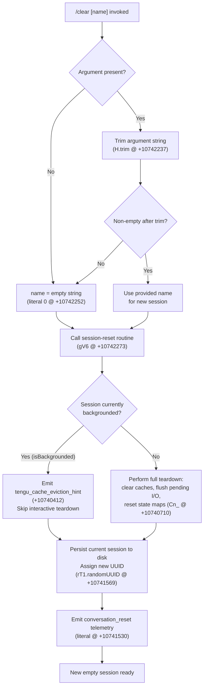

# `/clear`

> Analysis basis: CC v2.1.152 bundle.js (AST extraction + Claude interpretation)
> Minimum version: v2.1.152

---

## Overview

The `/clear` command starts a brand-new Claude Code session with an empty context window. The previous session is persisted on disk and remains resumable at any time via `/resume`. The command is also available under the aliases `/reset` and `/new`.

---

## Registration

| Field | Value |
|---|---|
| type | `local` |
| name | `clear` |
| description | `Start a new session with empty context; previous session stays on disk (resumable with /resume)` |
| aliases | `reset`, `new` |
| argumentHint | `[name]` |
| supportsNonInteractive | `true` |
| thinClientDispatch | `post-text` |
| module_id | `sT1` |
| load_inline | `true` |
| loc_byte | `10742411` |
| loc_byte_end | `10742702` |
| loc_line | `8663` |
| arbor_handler.name | `FgL` |
| arbor_handler.fqn | `claude-2.1.152::FgL` |
| arbor_handler.kind | `AsyncFunction` |
| arbor_handler.resolution_path | `module_id` |
| arbor_handler.n_hits | `0` |

Analysis basis: CC v2.1.152 bundle.js:+10742411

---

## Input Branching

Four distinct branches exist based on whether an optional session name is provided and the state of the current session at the time the command fires.



---

## Behavioral Spec

### Entry point — handler (`FgL`)

Analysis basis: CC v2.1.152 bundle.js:+10742237

```
async function clearCommandHandler(rawArgument):
    trimmedName = rawArgument.trim()          // H.trim @ +10742237
    sessionName = trimmedName if trimmedName != "" else ""  // literal 0 @ +10742252
    await sessionResetOrchestrator(sessionName)  // gV6 @ +10742273
```

### Session-reset orchestrator (`gV6`)

Analysis basis: CC v2.1.152 bundle.js:+10740308

```
async function sessionResetOrchestrator(newSessionName):
    // 1. Parse numeric context budget (dV6 @ +10740308)
    parsedBudget = parseContextBudget()        // parseInt, Number.isFinite @ +12959243/65

    // 2. Fire SessionEnd hook sequence (WSH @ +10740320)
    await fireSessionEndHooks()                // literal "SessionEnd" @ +12949903

    // 3. Set abort signal with a hard timeout (AbortSignal.timeout @ +10740368)
    timeoutSignal = AbortSignal.timeout(...)

    // 4. Emit cache-eviction telemetry hint
    emit("tengu_cache_eviction_hint")          // @ +10740412

    // 5. Clear all in-memory caches via globalCacheReset (Cn_ @ +10740710)
    await globalCacheReset()

    // 6. Resolve working-directory path for new session (zw @ +10740719)
    resolvedCwd = resolveWorkingDirectory()

    // 7. Clear conversation message store (_.clear @ +10740728)
    conversationStore.clear()

    // 8. Assign new session UUID (rT1.randomUUID @ +10741569)
    newSessionId = crypto.randomUUID()

    // 9. Emit conversation_reset event (literal @ +10741530)
    emit("conversation_reset", { id: newSessionId, name: newSessionName })

    // 10. Rebuild session scaffolding — worktree symlinks, log pipes, etc.
    await rebuildSessionScaffolding(newSessionId, newSessionName)

    // 11. Return control; UI renders empty conversation
    return { sessionId: newSessionId }
```

### Context-budget parser (`dV6`)

Analysis basis: CC v2.1.152 bundle.js:+12959243

```
function parseContextBudget(rawValue):
    parsed = parseInt(rawValue, 10)            // parseInt @ +12959243, radix 10 literal @ +12959254
    if not Number.isFinite(parsed):            // @ +12959265
        return fallbackSettingsValue()         // HD @ +12959308
    clamped = Math.max(Math.min(parsed, MAX), MIN)  // @ +12959461/474
    // MAX derived from 1000-unit ceiling (literal 1000 @ +12959430)
    return clamped
```

### Session-end hook firing (`WSH`)

Analysis basis: CC v2.1.152 bundle.js:+12949876

The `WSH` routine dispatches the `"SessionEnd"` hook event (literal `"SessionEnd"` at +12949903) to all registered hook handlers (`a4` → `xW` pipeline), waits for completion, then signals the REPL that the outgoing session has ended.

```
async function fireSessionEndHooks():
    hookEvent = { type: "SessionEnd" }         // literal @ +12949903
    await hookDispatcher(hookEvent)            // a4 @ +12949876, xW @ +12949934
    await notifyReplSessionEnd()               // TyH @ +12950136
```

### Global cache reset (`Cn_`)

Analysis basis: CC v2.1.152 bundle.js:+10739274

This routine iterates over every registered in-memory cache subsystem and calls its `clear()` method, then resets auxiliary state maps.

```
function globalCacheReset():
    clearSkillIndex()                          // ox → H.clearSkillIndexCache @ +12822074
    clearFileWatcherCache()                    // FT9 → yU.clear @ +6472741
    resetCompactState()                        // Do @ +10739309
    clearLW8Cache()                            // zo → lW8.clear @ +9709216
    clearSessionStartCache()                   // cw6 @ +10739327
    clearNameNormCache()                       // C_1 → NyH.clear, _m_.clear @ +8747528/40
    clearHookParserCache()                     // Ci9 → paH.clear, W06.clear @ +8054820/32
    clearShellCache()                          // Xn8 → SmH.clear @ +1061150
    clearTokenCountCache()                     // vT9 → O58.clear @ +6461269
    clearKbCache()                             // Kn8 → hmH.clear @ +1053928
    clearRouteCache()                          // Eo9 → ro.clear, LJH.clear @ +8121208/19
    iterateAndInvalidateObjectKeys()           // Object.keys @ +10739420
    resolvePromise()                           // Promise.resolve @ +10739636
```

### Working-directory resolver (`zw`)

Analysis basis: CC v2.1.152 bundle.js:+8107354

```
function resolveWorkingDirectory(rawPath):
    if not path.isAbsolute(rawPath):           // Yj8.isAbsolute @ +8107354
        rawPath = path.resolve(rawPath)        // Yj8.resolve @ +8107374
    validated = validateAllowedCwd(rawPath)    // Q6 @ +8107389
    if not validated:
        throw Error(...)                       // Error @ +8107456
    normalized = normalizeWithStore(rawPath)   // Ll8 @ +8107496
    return normalized
```

### Hook dispatcher (`xW` / `uX`)

Analysis basis: CC v2.1.152 bundle.js:+12998072

`xW` is the primary hook-execution router called for SessionEnd. It:

1. Reads the current hook configuration (`xp` → `x8` @ +3224159).
2. Enumerates registered hook types (`e8A` @ +12998364).
3. Filters hooks matching `"SessionEnd"` event.
4. For each hook, selects execution strategy: `command`, `callback`, `mcp_tool`, `http`, or `agent` (literals at +12979343/+12979525/+12979897/+12979776/+12979651).
5. Dispatches via `Xk8` (spawn-based execution @ +13002159) or `i8A` (HTTP @ +13001073) or `ce1` (callback @ +13001462).
6. Collects results, merges any `systemMessage` or `additionalContext` fields.
7. Fires `tengu_run_hook` telemetry (@ +12998493).

```
async function hookDispatcher(hookEvent, options):
    config = readHookConfig()                  // xp @ +12998161
    matchingHooks = filterHooksByEvent(config, hookEvent.type)  // e8A @ +12998364
    results = []
    for hook in matchingHooks:
        requestId = crypto.randomUUID()        // pRH.randomUUID @ +12998859
        if hook.type == "command":
            result = await spawnCommandHook(hook, hookEvent)   // Xk8 @ +13002159
        elif hook.type == "http":
            result = await httpHook(hook, hookEvent)           // i8A @ +13001073
        elif hook.type == "callback":
            result = await callbackHook(hook, hookEvent)       // ce1 @ +13001462
        elif hook.type == "mcp_tool":
            result = await mcpToolHook(hook, hookEvent)        // r8A @ +12999775
        emit("tengu_run_hook", { hookType: hook.type })        // @ +12998493
        results.push(result)
    return mergeHookResults(results)           // R_H @ +13000146
```

---

## State & Side Effects

| Item | Detail |
|---|---|
| Telemetry — `tengu_cache_eviction_hint` | Emitted once per `/clear` invocation during session reset (bundle.js:+10740412) |
| Telemetry — `tengu_run_hook` | Emitted per hook executed during the `SessionEnd` hook sequence (bundle.js:+12998493) |
| Telemetry — `tengu_hook_plugin_metrics` | Emitted when plugin hook metrics are collected (bundle.js:+12976931) |
| Telemetry — `tengu_feature_ok` / `tengu_feature_bad` | Emitted by the hook feature-flag evaluator on success / failure paths (bundle.js:+964519 / +964577) |
| Telemetry — `tengu_repl_hook_finished` | Emitted when REPL hook execution completes (bundle.js:+12982380) |
| Telemetry — `tengu_hook_plugin_injected` | Emitted when a plugin hook is injected into the execution plan (bundle.js:+12996833) |
| Telemetry — `tengu_session_renamed` | Emitted if the optional `[name]` argument renames the session (bundle.js:+12862384) |
| Conversation store | Cleared via `conversationStore.clear()` — all in-memory messages discarded (bundle.js:+10740728) |
| Session UUID | A fresh UUID is generated via `rT1.randomUUID()` (bundle.js:+10741569); the old UUID remains on disk |
| `conversation_reset` event | Emitted to the event bus with the new session ID (literal at bundle.js:+10741530) |
| `SessionEnd` hook event | Dispatched to all registered `SessionEnd` hooks before context is cleared (literal at bundle.js:+12949903) |
| Cache subsystems cleared | Skill index, file-watcher cache, compact state, LW8, session-start cache, name-norm cache, hook-parser cache, shell cache, token-count cache, KB cache, route cache (via `Cn_` family; bundle.js:+10739274) |
| Two in-memory caches cleared | `FS6` and `eC8` cleared via `Wz` (bundle.js:+26612, +26624) |
| appState changes | Working directory re-resolved; new session scaffolding (worktree symlinks, log pipes) rebuilt |
| Hook registration | No new hooks registered by this command; existing hooks invoked for `SessionEnd` |
| Sound | None detected in depth-2 traversal |
| Disk | Previous session data retained on disk (per description); new session directory created |

---

## Version History

| Version | Change |
|---|---|
| v2.1.152 | Initial analysis |

---

## Common Mistakes

1. **Confusing `/clear` with data deletion** — `/clear` does not delete the previous session; it merely retires it to disk. Use `/resume` to return to it.
2. **Omitting the optional name** — When a descriptive name would help identify the session later (via `/resume`), it should be passed as the `[name]` argument; omitting it leaves the session with an auto-generated UUID as its identifier.
3. **Expecting hook-side-effects to be skipped** — `SessionEnd` hooks still execute during `/clear`; long-running hooks may add latency before the new session appears.
4. **Using `/clear` to reset configuration** — Only the conversation context and in-memory caches are cleared. Persistent settings (project settings, user settings, policy settings) remain unchanged.
5. **Treating aliases as separate commands** — `/reset` and `/new` are exact aliases for `/clear` and share the same handler (`FgL`); they produce identical behavior.

---

## Appendix — Identifier Mapping

> For bundle debugging only. Identifiers change across versions.

| Identifier | Role |
|---|---|
| `FgL` | Main async handler for `/clear` (arbor_handler; resolves via `module_id` → `sT1`) |
| `gV6` | Session-reset orchestrator; coordinates teardown and new-session setup |
| `dV6` | Context-budget parser (parseInt + clamp logic) |
| `HD` | Fallback settings value reader for context budget |
| `x8` | Hook / settings store accessor |
| `BB6` | Sub-accessor called by settings store reader |
| `Tg` | Auxiliary settings helper |
| `Em` | Policy-settings evaluator |
| `pv` | Low-level primitive helper (used by multiple subsystems) |
| `up` | Session-state updater |
| `l$_` | Cache-map accessor with get/set semantics (`mpq`) |
| `Wz` | Dual-cache clear routine (`FS6.clear`, `eC8.clear`) |
| `n$_` | Auxiliary state-map reset helper |
| `WSH` | SessionEnd hook dispatcher (entry point for hook pipeline) |
| `a4` | Hook-event builder / router |
| `y6` | Logger / emitter utility |
| `eh` | Hook-event emission helper |
| `_W` | Extended thinking / effort setting resolver |
| `YV` | High-effort model selector |
| `Ov` | Model-name formatter (joins parts via `ZD.join`) |
| `b6` | JSON-parse wrapper |
| `xW` | Primary hook-execution router |
| `uH` | String coercion utility |
| `xp` | Hook-config reader (reads from `x8`) |
| `N` | Log-level / message formatter |
| `DMH` | Hook-display-message helper |
| `e8A` | Hook-type enumerator and filter |
| `le1` | Hook list accessor |
| `t8A` | Hook-filter predicate |
| `ie1` | Hook-iteration helper |
| `c` | Generic continuation / callback utility |
| `CH` | JSON.stringify wrapper |
| `hH` | Log-error recorder (`Cn.logError`) |
| `mH` | Feature-bad recorder |
| `u0H` | Feature-ok recorder (`Qp6`) |
| `BV` | Abort-controller / timeout manager |
| `J` | Callback-registration map |
| `uAH` | Async-hook result accumulator |
| `vv` | Hook-result value extractor |
| `Dk8` | Hook-result merge helper |
| `r8A` | MCP-tool hook executor |
| `Jk8` | JSON-output parser for hook stdout |
| `R_H` | Hook-result merger (Object.fromEntries) |
| `i8A` | HTTP hook executor |
| `ce1` | Callback hook executor |
| `n5H` | Non-interactive hook helper |
| `Xk8` | Spawn-based command hook executor |
| `nkH` | Hook-notification helper |
| `SH` | Feature-ok state recorder |
| `TyH` | REPL session-end notifier |
| `Tq6` | Timeout/abort-signal configuration helper |
| `L` | Task-set with `add`/`finally`/`delete` lifecycle |
| `q` | File-unlink registry |
| `M` | Session/connection lifecycle manager |
| `A` | Process/client map |
| `w` | Background-session dispatch core |
| `R` | Process kill/restart helper |
| `WGK` | Realpath + stat resolver for processes |
| `Tz` | Timeout utility |
| `Wx5` | Process-state helper (`kP8`) |
| `z` | Daemon write/pipe stream |
| `jI8` | Low-memory detector (macOS freemem) |
| `E6` | Token-count cache checker |
| `mY6` | `pins.json` reader |
| `pj_` | Pin-file path builder |
| `B6` | JSON.parse wrapper |
| `j8` | ENOENT error guard |
| `QD7` | Directory-entry async reader |
| `B` | Settled-session retirement helper |
| `F6` | Message-filter for MCP-prefixed content |
| `gH` | Orphaned-permission set manager |
| `d4A` | Background-spare session spawner |
| `h_A` | Session-metadata file writer (mkdir + writeFile) |
| `lb5` | Send-claim retry loop with timeout |
| `cb5` | Claim-frame builder (`_F.buildClaimFrame`) |
| `L8` | Error-with-code factory |
| `GH` | String coercion helper |
| `IB` | Binary IPC frame encoder (Buffer ops) |
| `a4A` | Background-session lifecycle orchestrator |
| `K` | Roster-entry formatter |
| `uK` | Session-directory path builder |
| `n9` | Session-stat / metadata reader |
| `tw` | Active-session state tracker (`zV`) |
| `d5` | Session-dir CH path helper |
| `A66` | Session-exit watcher with `EiL` error catch |
| `N5H` | Session-path join helper |
| `Gh` | Session-name splitter |
| `bB` | Session-roster-entry writer |
| `Jv6` | Session directory maker (`qr_`) |
| `Y` | Daemon config-reload / MCP-server manager |
| `D` | Spare-pool health monitor and refill trigger |
| `$` | Subagent/session disposer (`Sn1`) |
| `Q4A` | Background spare-process spawner (`Bun.spawn`) |
| `mX` | Session-metadata map accessor |
| `Mj` | Session-ID mapper |
| `Cn_` | Global cache-reset coordinator (calls all subsystem `clear()` methods) |
| `kn_` | Cache-key initializer |
| `pR` | Skill-index invalidation entry point |
| `ox` | Skill-index cache clear (`H.clearSkillIndexCache`) |
| `tW8` | Watcher restart helper |
| `zz1` | Skill-registry reset |
| `ChH` | Skill-fetch cache clear |
| `FT9` | File-watcher cache clear (`yU.clear`) |
| `lNH` | Watcher re-registration writer |
| `dq6` | Debounce-queue clear |
| `Do` | Compact-state reset coordinator |
| `NvH` | Compact-output-map accessor |
| `S58` | Subagent-exit state cleaner |
| `cw6` | Session-start cache cleaner (`lZ`) |
| `g6H` | Agent-state map cleaner |
| `x58` | Plugin-state-cache clear (`sP1.clear`) |
| `JZ9` | Streaming-output cache clear (`OX6`, `TV_`) |
| `YZ9` | Task-queue state resetter |
| `RwH` | Route-handler reset helper |
| `xw` | Output-token counter reset |
| `mV_` | MCP-state reset helper |
| `zo` | Long-watch-cache clear (`lW8.clear`) |
| `C_1` | Name-normalisation cache clear (`NyH`, `_m_`) |
| `Ci9` | Hook-parser cache clear (`paH`, `W06`) |
| `Xn8` | Shell-history cache clear (`SmH`) |
| `GH9` | Toolset-cache clear (no-arg) |
| `vT9` | Token-count cache clear (`O58`) |
| `nx8` | Permission-set membership checker |
| `Kn8` | KB-index cache clear (`hmH`) |
| `$D1` | Diagnostic-state reset |
| `Eo9` | Route-cache clear (`ro`, `LJH`) |
| `zw` | Working-directory resolver (isAbsolute + resolve + validate) |
| `Q6` | CWD allow-list validator |
| `Ll8` | CWD normalisation with async-local-storage |
| `kqH` | Path-normalise helper |
| `z_` | Log/emit primitive |
| `hVH` | Session-hook-value helper |
| `KI` | Interval/timer clear helper |
| `yO` | Hook-flush coordinator (`Ak8`, `Hk8`) |
| `Ak8` | Pending-hook-task tracker (`ot1`) |
| `cnH` | Notification-channel helper (`Ww9`) |
| `aT1` | Feature-flag accessor (`$fH`) |
| `J3` | Conversation-log writer (`I4`) |
| `I4` | Append-log file writer |
| `tq` | Crash-recovery registration (`CMA.register`) |
| `uI` | UI-state reader |
| `mM` | Model-string formatter (`SwH.join`) |
| `oh` | Logger emit helper |
| `QV6` | Conversation-log initializer |
| `Kb8` | Session-start event emitter (`iS6.emit`) |
| `mbH` | Metadata-broadcast helper |
| `Ll` | Conversation log appender |
| `Ph` | Session-rename handler (`eI6.emit`) |
| `YMH` | File-append + mkdir helper (`A.appendFileSync`) |
| `WhH` | Worktree-symlink manager (`fs.symlink`, `fs.unlink`) |
| `F8A` | Worktree-directory creator (`fs.mkdir`) |
| `iaH` | Worktree-path resolver |
| `X3` | Worktree entry builder |
| `lsH` | Worktree-lock-file opener (`fs.open`) |
| `tZ` | Subagent-session path helper (`jV_.get`) |
| `Of` | Misc session-option accessor |
| `E_` | Process-signal binding bootstrapper |
| `AS6` | Signal-handler binding (`AS6.bind`) |
| `W` | Coordinator-mode setter (`_L`) |
| `T` | Remote-control startup handler |
| `b` | Remote-control event source |
| `O0` | Configuration-load trigger (`l_`) |
| `l_` | Settings file loader (all four layers: flag/user/project/local) |
| `Uf` | Session-attachment helper |
| `xu` | Session-worktree-state emitter (`kT8.emit`) |
| `s_H` | Isolation-latch setter |
| `St1` | Isolation-latch file writer (`d4.appendFile`) |
| `hU` | Session initialisation orchestrator (top-level new-session setup) |
| `A4` | App-state initialiser |
| `wEH` | Policy-settings subscriber |
| `ymH` | Log-rotation timestamp helper |
| `v8` | Log-file appender (appendFileSync + mkdirSync) |
| `LX6` | Full session-launch pipeline (calls `a4`, `J3`, `ZX`, `uX`) |
| `ZX` | Session-context initialiser |
| `uX` | Main REPL agent-loop driver |
| `f` | MCP server manager map |
| `lhH` | MCP server connection setup |
| `dPK` | MCP server update applier |
| `yR5` | MCP client state reconciler |
| `Nq` | Session-UUID generator for Nq path (`mO1.randomUUID`) |

---

Note: index built via Arbor fallback; some signals (telemetry, literals) may be missing — see arbor-fallback.js.