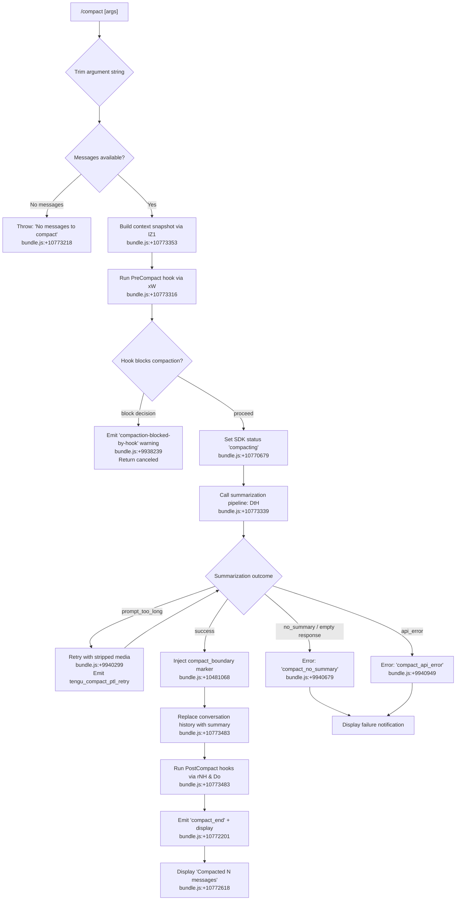

# `/compact`

> Analysis basis: CC v2.1.152 bundle.js (AST extraction + Claude interpretation)
> Minimum version: v2.1.152

---

## Overview

`/compact` frees up context window space by summarizing the current conversation into a concise digest, then replacing the full conversation history with that summary plus a boundary marker. It supports an optional custom instruction argument, runs `PreCompact` hooks before summarization and `PostCompact` hooks after, and can operate both interactively (user-triggered) and automatically when context utilization approaches saturation.

---

## Registration

| Field | Value |
|---|---|
| type | `local` |
| name | `compact` |
| description | `Free up context by summarizing the conversation so far` |
| argumentHint | `<optional custom summarization instructions>` |
| supportsNonInteractive | `true` |
| thinClientDispatch | `post-text` |
| module_id | `nZ1` |
| load_inline | `true` |
| loc_byte | `10774181` |
| loc_byte_end | `10774494` |
| loc_line | `8792` |
| arbor_handler.name | `JQL` |
| arbor_handler.fqn | `claude-2.1.152::JQL` |
| arbor_handler.kind | `AsyncFunction` |
| arbor_handler.resolution_path | `module_id` |
| arbor_handler.n_hits | `0` |

Analysis basis: CC v2.1.152 bundle.js:+10774181

---

## Input Branching

The handler has more than 3 distinct execution paths depending on whether custom instructions are provided, whether there are messages to compact, and outcomes of the summarization pipeline.



---

## Behavioral Spec

### Handler Entry: compactCommandHandler (`JQL`)

```
async function compactCommandHandler(options):
    customInstructions = options.args.trim()          // bundle.js:+10773250
    if no messages exist:
        throw Error("No messages to compact")         // bundle.js:+10773218

    contextSnapshot = await buildContextSnapshot()    // JQL→lZ1 bundle.js:+10773353
    triggerMode = "manual"                            // bundle.js:+10770774

    result = await runCompactionPipeline(
        contextSnapshot,
        customInstructions,
        triggerMode
    )                                                 // JQL→XQL bundle.js:+10773316

    if result.canceled:
        display("Compaction canceled.")               // bundle.js:+10773788
        return

    updateConversationWithSummary(result)
    refreshDisplay()
    return result
```

Analysis basis: CC v2.1.152 bundle.js:+10773187

---

### Compaction Pipeline Orchestrator (`XQL`)

```
async function compactionPipelineOrchestrator(snapshot, instructions, mode):
    startTime = performance.now()                    // bundle.js:+10770700

    // 1. Emit progress status
    emitSdkStatus("compact_progress")               // bundle.js:+10770563
    emitSdkStatus("hooks_start")                    // bundle.js:+10770594

    // 2. Run PreCompact hooks
    hookResult = await runPreCompactHook(snapshot)  // XQL→td bundle.js:+10770762
    if hookResult.decision == "block":
        emitWarning("compaction-blocked-by-hook")   // bundle.js:+9938239
        emitWarning("compaction blocked by PreCompact hook")
        return { canceled: true }

    emitSdkStatus("pre_compact")                    // bundle.js:+10770617
    emitSdkStatus("sdk_status", "compacting")       // bundle.js:+10770679

    // 3. Build system prompt and context for summarizer
    [systemPrompt, contextData] = await Promise.all([
        buildSystemPrompt(snapshot),               // XQL→lZ1 bundle.js:+10770837
        buildMcpContext()                           // XQL→td already called
    ])

    // 4. Prepare message payload
    payload = buildCompactPayload(contextData, instructions)  // XQL→x08 bundle.js:+10770848

    // 5. Emit compact_start
    emitStatus("compact_start")                    // bundle.js:+10771121

    // 6. Invoke summarization query
    summaryResult = await invokeSummarizationAgent(payload) // XQL→UV_ bundle.js:+10771152

    // 7. Handle failure modes
    if summaryResult.error == "prompt_too_long":
        emit tengu_compact_ptl_retry
        summaryResult = await retryStripped(payload)

    if not summaryResult.summary:
        emitError("compact_no_summary")
        displayFailure("Failed to generate conversation summary…")
        return { success: false }

    // 8. Post-compaction cleanup
    resetConversationState(summaryResult)          // XQL→Do bundle.js:+10771710
    setNewConversationState(summaryResult)         // XQL→rNH bundle.js:+10771735
    runPostCompactHooks()                          // XQL→cZ1 bundle.js:+10771937

    endTime = performance.now()
    emitMetrics("compact_end", endTime - startTime) // bundle.js:+10772201

    return { success: true, summary: summaryResult.summary }
```

Analysis basis: CC v2.1.152 bundle.js:+10770700

---

### Message Slicing and Boundary Insertion (`d$` / `fT8`)

```
function sliceMessagesForCompaction(messages):
    // Insert a system-role "compact_boundary" sentinel at the split point
    boundaryMessage = { role: "system", type: "compact_boundary" }
    // bundle.js:+10481046, +10481068
    keptMessages = messages.slice(splitIndex)      // bundle.js:+10481221
    return [boundaryMessage, ...keptMessages]
```

Analysis basis: CC v2.1.152 bundle.js:+10481198

---

### Context Snapshot Builder (`lZ1`)

```
async function buildContextSnapshot(session):
    appState = session.getAppState()              // bundle.js:+10772674
    systemPrompt = buildFullSystemPrompt(appState) // lZ1→Ru bundle.js:+10772798

    // Gather conversation turns
    conversationTurns = Array.from(collectTurns(appState)) // bundle.js:+10772741
    mcpContext = await buildMcpServerContext()     // lZ1→V_ bundle.js:+10772752

    return Promise.all([
        systemPrompt,
        conversationTurns,
        mcpContext
    ])                                            // bundle.js:+10772984
```

Analysis basis: CC v2.1.152 bundle.js:+10772674

---

### Summarization Agent (`DtH` — main summarizer invocation)

```
async function invokeSummarizationQuery(payload, options):
    startTime = performance.now()               // bundle.js:+9939067

    // Deny all tool calls during compaction
    toolPolicy = { decision: "deny",
                   reason: "Tool use is not allowed during compaction" }
                                               // bundle.js:+9949777

    // Build summarizer system prompt
    summarizerSystemPrompt =
        "You are a helpful AI assistant tasked with summarizing conversations."
                                               // bundle.js:+9952096

    // Determine trigger telemetry key
    triggerKey = (mode == "auto") ? "compact_auto" : "compact_manual"
                                               // bundle.js:+9939027 / +9939042

    // Emit tracing span
    emitSpan("claude_code.compaction")         // bundle.js:+9939091

    // Check message count floor
    if messageCount < minimumThreshold:
        emit("compact_not_enough_messages")    // bundle.js:+9939229
        return { canceled: true }

    // Run API query for summary
    response = await runApiQuery(payload)      // DtH→mD1 bundle.js:+9939962

    if response lacks text:
        emit("compact_no_summary")
        displayError("compact_no_summary")
        return { success: false }

    return { success: true, summary: response.text }
```

Analysis basis: CC v2.1.152 bundle.js:+9939067

---

### Reactive Auto-Compaction Engine (`UV_` / `uZ9`)

```
async function reactiveCompactionEngine(session, contextUsage):
    // Triggered automatically when context utilization hits threshold
    // bundle.js:+6540602 ("compact_reactive")

    if groups < 2:
        log("Reactive compact: fewer than 2 groups, nothing to compact")
        // bundle.js:+6505707
        emit("too_few_groups")
        return

    startTime = performance.now()               // bundle.js:+6539963

    attempt = 0
    while attempt < maxAttempts:
        result = await runReactiveCompact(session, attempt)
        // bundle.js:+6506430 tengu_reactive_compact_attempt

        if result.status == "aborted":
            break
        if result.status == "media_too_large" and attempt == 0:
            log("Reactive compact: summarize hit media-size error, retrying stripped")
            // bundle.js:+6507153
            attempt++
            continue
        if result.success:
            emit tengu_reactive_compact_succeeded // bundle.js:+6542453
            break
        else:
            emit tengu_reactive_compact_failed    // bundle.js:+6540199
            break

    emitTokenCounts("compact_reactive", result)
```

Analysis basis: CC v2.1.152 bundle.js:+6539933

---

### Post-Compaction State Reset (`Do`)

```
function resetConversationAfterCompaction(session):
    clearPrecomputedCompact()         // Do→S58 bundle.js:+6536269
    clearCaches()                     // Do→x58 bundle.js:+6536343
    clearMessageTracking()            // Do→JZ9 bundle.js:+6536349
    resetAutonomousLoopDelivered()    // bundle.js:+6536381
    resetStateFlags()                 // Do→xw bundle.js:+6536431
    clearMvState()                    // Do→mV_ bundle.js:+6536537
    emit("post_compact_cleanup")      // bundle.js:+6536275
```

Analysis basis: CC v2.1.152 bundle.js:+6536259

---

### Token Usage Calculation for Compaction (`ig_`)

```
function calculateContextUsagePercentage(tokenCounts):
    // Accepts "auto" sentinel or numeric string
    if value == "auto":
        return parseAsAuto(value)           // bundle.js:+9957456
    trimmed = value.trim()
    if trimmed.endsWith("%"):
        pct = parseFloat(trimmed)           // bundle.js:+9957503
    else:
        pct = parseInt(trimmed) / 1000 * 100 // bundle.js:+9957561, +9957597
    if not Number.isFinite(pct):
        return null
    return Math.round(pct)                  // bundle.js:+9957670
```

Analysis basis: CC v2.1.152 bundle.js:+9957426

---

## State & Side Effects

| Item | Detail |
|---|---|
| Telemetry — compaction lifecycle | `tengu_compact` (bundle.js:+9942250), `tengu_compact_failed` (bundle.js:+9953375), `tengu_compact_ptl_retry` (bundle.js:+9940339), `tengu_compact_cache_prefix` (bundle.js:+9939867), `tengu_compact_cache_sharing_success` (bundle.js:+9950654), `tengu_compact_cache_sharing_fallback` (bundle.js:+9951284) |
| Telemetry — reactive compaction | `tengu_reactive_compact_attempt` (bundle.js:+6506430), `tengu_reactive_compact_failed` (bundle.js:+6540199), `tengu_reactive_compact_succeeded` (bundle.js:+6542453), `tengu_precomputed_compact_discarded` (bundle.js:+6519832) |
| Telemetry — post-compact file restore | `tengu_post_compact_file_restore_success` (bundle.js:+9953857), `tengu_post_compact_file_restore_error` (bundle.js:+9953899) |
| Telemetry — attachment handling | `tengu_attachment_file_too_large` (bundle.js:+9713068), `tengu_pdf_reference_attachment` (bundle.js:+9712649) |
| Hook registration | Fires `PreCompact` hook before summarization (bundle.js:+12945062, +12978088); fires `PostCompact` hook after conversation replacement (bundle.js:+12978088) |
| AppState changes | Replaces full message history with summary text plus `compact_boundary` sentinel message; updates `compactMetadata` field (bundle.js:+10771657); sets `autoCompactEnabled` flag read path (bundle.js:+9959634) |
| Conversation boundary marker | Inserts a `{ role: "system", type: "compact_boundary" }` message at the splice point (bundle.js:+10481046, +10481068) |
| SDK status emissions | `compact_progress`, `hooks_start`, `pre_compact`, `sdk_status/compacting`, `compact_start`, `compact_end` (bundle.js:+10770563–10772201) |
| Display | Shows "Compacted N messages" with `ctrl+o` keybinding hint to toggle transcript (bundle.js:+10772618, +10772511) |
| Sound | <!-- TODO: not found in depth-2 traversal; needs --depth 4 --> |
| Tool use during compaction | All tool calls denied with `"Tool use is not allowed during compaction"` (bundle.js:+9949777) |
| Model constraint | Summarization agent must produce only text; tool use in compaction response treated as error `"compaction agent should only produce text summary"` (bundle.js:+9949857) |
| Error strings (user-visible) | `"Compaction failed · conversation could not be reduced below the context limit"` (bundle.js:+10771325); `"Compaction failed · attached media exceeds size limits"` (bundle.js:+10771448) |

---

## Version History

| Version | Change |
|---|---|
| v2.1.152 | Initial analysis |

---

## Common Mistakes

1. **Running `/compact` on an empty session** — The handler immediately throws `"No messages to compact"` (bundle.js:+10773218) if no conversation messages exist. Ensure at least one exchange has occurred before invoking `/compact`.
2. **Expecting tool calls to work during compaction** — All tool calls are unconditionally blocked during the summarization turn (bundle.js:+9949777). Any hook or prompt that attempts tool use will be denied.
3. **Assuming compaction always succeeds on first attempt** — When the combined prompt exceeds the model's context window (`prompt_too_long`), the pipeline automatically strips media attachments and retries. If stripping is insufficient, it surfaces `"compact_no_summary"` and the conversation is left unchanged.
4. **Ignoring PreCompact hook block decisions** — A `PreCompact` hook returning a `"block"` decision silently cancels compaction and displays `"Compaction canceled."` (bundle.js:+10773788). Check hook configuration if compaction appears to do nothing.
5. **Providing very long custom instructions** — The argument is trimmed but not otherwise validated for length before being appended to the summarization prompt; excessively long instructions may contribute to `prompt_too_long` errors.

---

## Appendix — Identifier Mapping

> For bundle debugging only. Identifiers change across versions.

| Identifier | Role |
|---|---|
| `JQL` | Main `/compact` command async handler (Arbor-resolved entry point) |
| `d$` | Message slicer — computes conversation split point and inserts boundary |
| `fT8` | Conversation flattener helper called by message slicer |
| `XJ` | Utility called inside flattener |
| `$7H` | Context-usage percentage reader (feeds into auto-compact threshold) |
| `uwH` | Inner context-usage helper |
| `h_` | Logging/event emitter utility |
| `E6` | Tool-permission / allow-list checker |
| `hO6` | Tool allow-list sub-helper |
| `SO6` | Tool allow-list sub-helper |
| `oe` | Permission resolution helper |
| `P68` | Deferred-permission cache helper |
| `x6` | App-state snapshot helper |
| `mG` | Model capability resolver (selects output-token limit by model name) |
| `uH` | String coercion utility |
| `_0` | Model token-limit sub-helper |
| `$1H` | Model string-coercion sub-helper |
| `wp` | Model output-token calculator |
| `P9` | API provider resolver |
| `hS` | Provider type checker (firstParty) |
| `nD` | Provider type checker (anthropicAws / foundry) |
| `f1H` | Extended model limit calculator |
| `sL` | Model limit fallback |
| `_e6` | Token headroom calculator |
| `AP` | Compact-argument parser |
| `Q58` | Token-count formatter |
| `$T` | Message token estimator |
| `c7` | Model context-window resolver |
| `ig_` | Context usage percentage parser (handles "auto", numeric, percent) |
| `XQL` | Compaction pipeline orchestrator |
| `VV` | Summarization payload builder |
| `bSL` | Summary message assembler |
| `KDH` | Token-count rounding helper |
| `YQ_` | Full conversation serializer for summarization prompt |
| `td` | PreCompact hook runner |
| `a4` | Hook executor (generic) |
| `y6` | Hook config loader |
| `eh` | Hook event emitter |
| `_W` | Hook context builder |
| `YV` | Hook output processor |
| `Ov` | Hook message builder |
| `b6` | File-path resolver used by hooks |
| `xW` | Hook dispatch engine (runs shell/HTTP/MCP hooks) |
| `xp` | Platform (OS) detector |
| `N` | Command-line argument normalizer |
| `DMH` | Hook directory resolver |
| `e8A` | Hook-type filter |
| `O` | Background-session helper |
| `le1` | Hook config reader |
| `t8A` | Hook file filter |
| `ie1` | Hook settings reader |
| `c` | Capability/config reader |
| `CH` | JSON serializer wrapper |
| `hH` | Error logger |
| `mH` | Message-queue helper |
| `u0H` | Hook output queue |
| `BV` | Abort-controller / timeout helper |
| `J` | Worker process reference |
| `uAH` | Hook async response handler |
| `vv` | Tool-call validator (during compaction: deny policy) |
| `Dk8` | Hook tool-denial wrapper |
| `r8A` | MCP tool result processor |
| `Jk8` | Hook output JSON parser |
| `R_H` | Hook environment variable builder |
| `i8A` | HTTP hook executor |
| `ce1` | Hook plaintext-output parser |
| `n5H` | Hook notification emitter |
| `Xk8` | Shell hook executor |
| `nkH` | Hook post-execution cleaner |
| `SH` | State updater helper |
| `K` | Background-process tracker |
| `L` | Async-task set |
| `M` | MCP client manager |
| `f` | MCP server registry |
| `lhH` | MCP connection handler |
| `dPK` | MCP update applier |
| `$` | MCP client factory |
| `yR5` | MCP server reload orchestrator |
| `lZ1` | Context snapshot builder (system prompt + conversation turns) |
| `GT` | Full system prompt assembler |
| `D_A` | String formatter used in system prompt |
| `oW8` | MCP server context injector |
| `s_` | Session-memory loader |
| `uV` | System prompt section assembler |
| `GY5` | Coding-style section builder |
| `TY5` | Task-context section builder |
| `X_A` | Environment-info section builder |
| `rY5` | Environment-info delegator |
| `pZ6` | Project-config section builder |
| `ZY5` | Project-config delegator |
| `CY5` | Memory/schedule section builder |
| `aO6` | CLAUDE.md memory loader |
| `BY5` | Environment description builder |
| `UY5` | Worktree section builder |
| `vY5` | Language/output-style section |
| `NY5` | Background-session section |
| `gY5` | Scratchpad section |
| `QY5` | Context-management section |
| `cY5` | Brief-mode checker |
| `iY5` | Focus/context-mode injector |
| `uY5` | App-state reader for system prompt |
| `VY5` | System-prompt trimmer |
| `LZ9` | Tool-listing section builder |
| `xY5` | Extra instructions section |
| `IY5` | GrowthBook flags section |
| `kY5` | Prompt-injection warning section |
| `yY5` | Tool-search availability section |
| `hY5` | Env-info alt section |
| `SY5` | Plan-mode section |
| `bY5` | Final instructions section |
| `fUq` | Memory-prompt section builder |
| `sOH` | Model-name / limit lookup |
| `V_` | App-state turn collector |
| `uT8` | Turn serializer (user messages) |
| `mT8` | Turn serializer (assistant messages) |
| `Ru` | System-prompt assembler for summarization |
| `EK` | API key / auth resolver |
| `ZR` | Auth-header builder |
| `E_` | Module export initializer |
| `zD` | Stream-mode resolver |
| `x08` | Compact-payload finalizer |
| `Qg_` | Cache-prefix calculator for compaction |
| `UV_` | Reactive auto-compaction engine |
| `DJ` | Conversation grouper for reactive compact |
| `W6H` | Token-limit sentinel checker |
| `D49` | Reactive compact trigger evaluator |
| `Br` | Reactive compact boundary marker |
| `I58` | Reactive compact core loop |
| `ziH` | Message accumulator |
| `qZ9` | Split-point math (max/floor) |
| `w` | Background-session process pool |
| `Jg7` | Reactive compact API caller |
| `j` | Subagent process pool |
| `Xg7` | Reactive compact split-point calculator |
| `oG` | Hook + MCP context fetcher |
| `kO` | App-state retriever (for reactive compact) |
| `MD` | Metrics dispatcher |
| `Ux` | Path sanitizer (redacts home dir, IPs, emails) |
| `QR7` | URL userinfo redactor |
| `FR7` | IP-address redactor |
| `mR7` | Email redactor |
| `xR7` | Home-directory redactor |
| `cR7` | Windows-path redactor |
| `dR7` | UNC-path redactor |
| `H8` | Config reader used in reactive compact |
| `uZ9` | Reactive compact state machine |
| `NvH` | Output-token counter |
| `Qw6` | Map-entry serializer |
| `hVH` | Token-histogram helper |
| `od` | Tool-result normalizer |
| `HX6` | Deferred-tool resolver |
| `ubH` | Binary attachment stripper |
| `WiH` | Memory-block injector |
| `A` | Terminal/display helper |
| `wX6` | UUID generator wrapper |
| `Q6H` | Token-count aggregator |
| `Bg7` | Reactive compact phase orchestrator |
| `mwH` | Message-window builder |
| `BV_` | Last-assistant-message finder |
| `Y7H` | Token threshold constants |
| `j58` | Token rounding helper |
| `w58` | Conversation turn iterator |
| `Do` | Post-compaction state reset |
| `S58` | Precomputed compact discarder |
| `y58` | Precomputed compact reader |
| `EZ9` | Precomputed compact metrics |
| `cw6` | Lock-file writer |
| `lZ` | Lock-file path resolver |
| `g6H` | Axios-instance builder |
| `ax8` | HTTP client initializer |
| `Lu8` | Request interceptor |
| `x58` | Message-selector cache clearer |
| `JZ9` | Typing-indicator cache clearer |
| `YZ9` | Conversation-state resetter |
| `RwH` | Hook-state resetter |
| `xw` | Output-token counter resetter |
| `mV_` | Misc cleanup after compact |
| `rNH` | Conversation-state writer (sets new history) |
| `cZ1` | PostCompact hook runner + display updater |
| `niH` | Model-selector initializer |
| `Zc7` | Model display-name mapper |
| `jX` | Key-binding registrar |
| `NA8` | Key-binding action resolver |
| `IA8` | Key-binding handler builder |
| `vDH` | OTEL metrics emitter |
| `L4` | OTEL span builder |
| `rb8` | Metric attribute builder |
| `mvH` | OTEL span recorder |
| `lq6` | Metric event sequencer |
| `DtH` | Summarization query runner (main compaction API call) |
| `hX6` | Tracing span initializer |
| `v7H` | Span context holder |
| `UV` | Span exporter |
| `Sy` | Active-span accessor |
| `OiH` | Compaction context accessor |
| `N58` | String trimmer helper |
| `T8` | Streaming API response handler |
| `X` | Raw stream reader |
| `ZM` | Stream end handler |
| `Hx5` | Background-session multiplexer |
| `GH` | String coercion helper |
| `mD1` | Summarization loop (drives API call + post-processing) |
| `n$1` | Streaming token reader |
| `VW8` | API-frame getter |
| `l$1` | Token-budget reader |
| `T0` | Forked-agent turn runner |
| `I28` | App-state updater for in-progress turn |
| `W` | Worker registry |
| `Ry` | Crypto random-bytes helper |
| `v_H` | Memory-block builder |
| `Su` | Compaction-turn state manager |
| `fV6` | Tombstone/tool-use-summary type checker |
| `a_H` | Turn-abort helper |
| `pT8` | Turn-progress helper |
| `m21` | Tool-use summary helper |
| `D` | Subagent session tracker |
| `D7H` | Deferred-tool filter |
| `vFL` | Turn finalization helper |
| `WV_` | Message count calculator |
| `f7H` | Output-token-limit resolver |
| `oOH` | Per-model token ceiling |
| `P6H` | Max-output-tokens env-var parser |
| `sZ` | Last-assistant-message finder |
| `v58` | Summary sentinel injector |
| `V58` | `<summary>` tag finder |
| `e8` | Message-role type guard |
| `I` | Away-summary background runner |
| `iP8` | Rate-limit state reader |
| `ZN5` | Away-summary eligibility checker |
| `M$K` | Focus-state accessor |
| `V` | Blur/focus state holder |
| `hL8` | Away-summary invocation handler |
| `PW1` | UUID factory |
| `g` | Blur-event tracker |
| `ohL` | Compaction-error display helper |
| `qn` | User-notification emitter |
| `wE6` | Tool-search mode decision helper |
| `YWH` | Tool-search flag reader |
| `gNH` | Model-name normalization helper |
| `ZhH` | Tool-search eligibility checker |
| `KQ_` | Tool-search config builder |
| `NSL` | Tool-search pool updater |
| `PV_` | Message serializer for summarization API |
| `nhL` | Array-type guard |
| `ihL` | Tool-result filter |
| `rhL` | Message content normalizer |
| `DE6` | Document block formatter |
| `Fg_` | Recursive message normalizer |
| `RD1` | Surrogate-pair handler |
| `_eH` | Pre-turn hook dispatcher |
| `fQ_` | Hook output accumulator |
| `FHK` | Full turn orchestrator (tool execution, streaming, hooks) |
| `fT` | Message-history normalizer |
| `wpL` | Message queue builder |
| `cc_` | Conversation continuity checker |
| `GpL` | Geq helper |
| `WpL` | Turn-boundary marker builder |
| `TpL` | Thinking-block presence checker |
| `h` | Away-summary blur tracker |
| `qT8` | Tool-use presence checker |
| `z` | Daemon stop tracker |
| `CpL` | UUID injector for messages |
| `F0` | Message finalizer |
| `BU_` | Bulk-update helper |
| `KT8` | Tool-use aggregator |
| `uR` | System-prompt reminder builder |
| `oc_` | Tool-type checker |
| `jpL` | Tool-result presence checker |
| `Z` | Message ring-buffer |
| `JpL` | System-message presence checker |
| `RpL` | MCP tool-name resolver |
| `X4` | Boolean coercion helper |
| `IW1` | Image-content checker |
| `EpL` | Context-efficiency annotation builder |
| `fW1` | Annotation queue builder |
| `bpL` | Annotation combiner |
| `T` | Key-event handler |
| `ZpL` | Tool-use summary builder |
| `nG6` | Orphaned-thinking block filter |
| `gpL` | Trailing-thinking block filter |
| `lG6` | Empty-assistant-content fixer |
| `QpL` | Whitespace-only assistant message filter |
| `VpL` | Message ring-buffer updater |
| `MW1` | Message history windower |
| `$W1` | Turn boundary resolver |
| `PpL` | Media-stripping helper |
| `q` | Config store |
| `G` | MCP client-pool getter |
| `iE6` | MCP client initializer |
| `IR8` | MCP client connection monitor |
| `Y` | Spinner/progress display |
| `rPH` | Progress-bar renderer |
| `Ao1` | Column-width calculator |
| `JGK` | Heartbeat sender |
| `SU` | Tool-result array normalizer |
| `bD1` | Message slice calculator |
| `sdH` | Token-size estimator |
| `mVH` | Media-block detector |
| `jJ_` | Content-length parser |
| `UN` | Tool-name prefix checker |
| `p58` | File-reference restoration after compact |
| `ahL` | File-path permission checker |
| `M88` | Path-prefix matcher |
| `Gq` | Path validator / normalizer |
| `thL` | CLAUDE.md file-path resolver |
| `LE` | CLAUDE.md reader |
| `zEH` | CLAUDE.md section formatter |
| `rW8` | At-mention attachment loader |
| `PeH` | File reader |
| `EU6` | File-read token counter |
| `tgH` | File-type classifier |
| `Q6` | File read helper |
| `Hz1` | At-mention resolver |
| `tN` | Attachment token estimator |
| `o0H` | Token floor calculator |
| `U4` | String index-of helper |
| `Nq` | Conversation-ID generator |
| `YM` | Token-count rounder |
| `g58` | Local-agent task-list loader |
| `X3` | Task-file path builder |
| `iaH` | Task directory resolver |
| `U58` | Plan-file attachment loader |
| `ME` | Plan-file reader |
| `j8` | File-size helper |
| `x` | Transient-output writer |
| `S` | Subprocess stdout writer |
| `b` | Process handle |
| `F58` | Full-file attachment loader |
| `B58` | Binary attachment loader |
| `lx8` | Binary data writer |
| `shL` | Attachment slicer |
| `z7H` | Tool-search context builder |
| `UF_` | Deferred-tools pool manager |
| `P` | MCP connection pool |
| `sA` | Config settings accessor |
| `aNH` | Tool-availability aggregator |
| `cZ_` | App-state tool-list reader |
| `qK` | String cast helper |
| `q7H` | Tool-category classifier |
| `hJH` | Built-in tool filter |
| `O5H` | Built-in tool name expander |
| `jJ6` | Extension tool filter |
| `AL8` | Case-insensitive tool matcher |
| `dZ_` | Tool display-name formatter |
| `OC7` | Tool list joiner |
| `O1` | Tool metadata resolver |
| `h8_` | Tool description getter |
| `y8_` | Tool example getter |
| `sD` | Tool schema builder |
| `sNH` | MCP tool-availability updater |
| `OO1` | MCP instruction-pool manager |
| `hU` | Session-start hook runner (loads plugins, fires hooks) |
| `A4` | String encoder |
| `HD` | Hook type verifier |
| `x8` | App-version reader |
| `wEH` | Hook environment populator |
| `ymH` | Debug logger |
| `v8` | File-append logger |
| `LX6` | Main REPL loop runner |
| `J3` | Memory-loader |
| `ZX` | System-prompt cacher |
| `uX` | Full REPL turn handler |
| `pR` | Skill-index cache clearer |
| `ox` | Skill-index invalidator |
| `tW8` | Skill-loader |
| `zz1` | Skill registry |
| `ChH` | Skill-cache helper |
| `zo` | LRU-cache clearer |
| `mM` | Platform/environment string builder |
| `oh` | Platform info getter |
| `pv` | OS info helper |
| `z_` | Environment string formatter |
| `w0` | CLI/remote mode resolver |
| `wQ` | CLI mode flag |
| `Aw6` | Context-efficiency calculator |
| `fX6` | Conversation-turn formatter |
| `jg7` | Turn text normalizer |
| `Fr` | History-group checker |
| `uD1` | Compaction result display helper |
| `PR` | Notification queue manager |
| `Vm` | Notification deduplicator |
| `e07` | Notification ring-buffer |
| `NM8` | Stream-end display updater |
| `LIH` | SDK status setter |
| `sg_` | String-unescape helper |