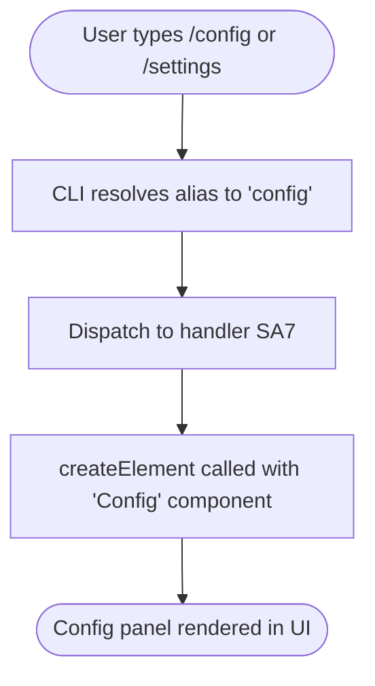

# `/config`

> Analysis basis: CC v2.1.132 bundle.js (AST extraction + Claude interpretation)
> Minimum version: v2.1.132

---

## Overview

The `/config` command (also reachable via `/settings`) is a `local-jsx` slash command that opens the application's configuration panel directly within the Claude Code CLI interface. It does not invoke the agent or send any prompt to the model; instead, it renders a JSX component — identified internally as `"Config"` — that presents the user with interactive configuration options.

---

## Registration

| Field | Value |
|---|---|
| type | `local-jsx` |
| name | `config` |
| description | `Open config panel` |
| aliases | `settings` |
| module_id | `Jt9` |
| load_inline | `true` |
| handler | `SA7` (resolved via `module_id` path) |
| `loc_byte_end` | `10230289` |
| `arbor_handler.name` | `SA7` |
| `arbor_handler.kind` | `AsyncFunction` |
| `arbor_handler.resolution_path` | `module_id` |
| `arbor_handler.fqn` | `claude-2.1.132::SA7` |
| `arbor_handler.n_hits` | `0` |

Analysis basis: CC v2.1.132 bundle.js:+10230153 – +10230289

**Notes:**

- The `local-jsx` type means this command is handled entirely client-side: it renders a React/JSX element and never calls the language model.
- The alias `settings` is fully equivalent to `config`; both names invoke the same handler.
- The handler `SA7` was resolved by Arbor via the `module_id` path (`Jt9` → module exports → `SA7`). The `load_inline: true` flag indicates the handler is bundled inline rather than lazily loaded from a separate module chunk.

---

## Input Branching

The `/config` command accepts no arguments and performs no input parsing. There is a single execution path: invoke the handler, render the config panel.



Analysis basis: CC v2.1.132 bundle.js:+10230019 (callGraph edge SA7 → PvA.createElement), +10230073 (literal `"Config"`)

---

## Behavioral Spec

### Config Panel Rendering

The handler is an `AsyncFunction` that, when invoked, constructs and returns a JSX element representing the configuration panel.

```
async function openConfigPanel():
    element = createElement(ConfigComponent, props=none_or_default)
    return element
```

- `createElement` corresponds to the React (or React-compatible) element factory observed in the call graph as `PvA.createElement`.
- The component tag resolved from the string literal `"Config"` (bundle.js:+10230073) indicates the rendered panel is the application's primary settings/configuration view.
- Because the return type is a JSX element (not a string or agent prompt), the CLI framework intercepts the return value and renders it directly in the terminal UI rather than forwarding it to any model inference pipeline.
- No arguments or flags passed by the user are forwarded to the component; the panel opens in its default state regardless of any trailing text after `/config`.

Analysis basis: CC v2.1.132 bundle.js:+10230019, +10230073

### Alias Resolution

The registration declares `"settings"` as an alias for `"config"`. Alias resolution is performed by the CLI's command dispatcher before the handler is called; by the time `SA7` executes, there is no observable difference between `/config` and `/settings`.

```
function resolveCommand(userInput):
    normalized = stripLeadingSlash(userInput).split(' ')[0]
    if normalized in ["config", "settings"]:
        return invoke(SA7)
    else:
        // handled by other command registrations
```

Analysis basis: CC v2.1.132 bundle.js:+10230153 (aliases field in registration)

---

## State & Side Effects

| Item | Detail |
|---|---|
| Telemetry | None detected in depth-2 traversal |
| Agent / model invocation | None — `local-jsx` type bypasses the inference pipeline entirely |
| UI side effect | Renders the `"Config"` JSX component panel in the CLI terminal UI |
| appState changes | <!-- TODO: not found in depth-2 traversal; needs --depth 4 --> |
| Hook registration | <!-- TODO: not found in depth-2 traversal; needs --depth 4 --> |
| Sound | <!-- TODO: not found in depth-2 traversal; needs --depth 4 --> |
| Persistent config writes | <!-- TODO: not found in depth-2 traversal; needs --depth 4 --> |

**Key observation:** The `telemetry` array is empty for this command, meaning no `tengu_*` events are fired on invocation or panel open at the depth-2 call graph boundary. Deeper telemetry (e.g., from individual config sub-panels) is not captured in the current extraction.

---

## Version History

| Version | Change |
|---|---|
| v2.1.132 | Initial analysis. Command registered as `local-jsx`, handler `SA7`, module `Jt9`. Alias `settings` confirmed. |

---

## Common Mistakes

1. **Passing arguments expecting them to pre-select a config section.** `/config theme` or `/config model` will not navigate to a specific panel — the handler ignores all trailing input and always opens the config panel in its default state.
2. **Expecting model output.** Because this is a `local-jsx` command, it produces no agent response text. Users waiting for a chat reply after `/config` will see only the rendered panel, not a conversational answer.
3. **Confusing `/config` with persisting settings programmatically.** This command opens the interactive UI panel; it does not accept key-value pairs or flags to set configuration values non-interactively (e.g., `/config set theme dark` is not a supported syntax).
4. **Overlooking the `/settings` alias.** Both `/config` and `/settings` are identical entry points. Documentation or scripts that hardcode one form will work identically with the other.

---

## Appendix — Identifier Mapping

> For bundle debugging only. Identifiers change across versions.

| Identifier | Role |
|---|---|
| `SA7` | Main async handler for the `/config` command; resolved from module `Jt9` via `module_id` path; calls `PvA.createElement` to produce the config panel JSX element |
| `PvA` | React (or React-compatible) namespace providing the `createElement` factory used to construct the `"Config"` JSX component |