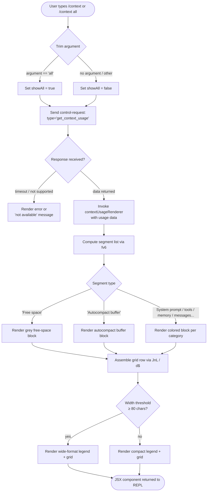

# `/context`

> Analysis basis: CC v2.1.152 bundle.js (AST extraction + Claude interpretation)
> Minimum version: v2.1.152

---

## Overview

`/context` visualizes the current conversation's context-window utilization as a colored grid, rendering each logical segment of the context (system prompt, tools, memory files, messages, etc.) as a proportionally sized colored block. The command dispatches a `get_context_usage` control request to the host process, collects the breakdown data, and renders an inline JSX component in the terminal.

---

## Registration

| Field | Value |
|---|---|
| type | `local-jsx` |
| name | `context` |
| description | `Visualize current context usage as a colored grid` |
| argumentHint | `[all]` |
| thinClientDispatch | `control-request` |
| module_id | `yv1` |
| load_inline | `true` |
| loc_byte | `11173216` |
| loc_byte_end | `11173442` |
| loc_line | `8844` |
| arbor_handler.name | `XnL` |
| arbor_handler.fqn | `claude-2.1.152::XnL` |
| arbor_handler.kind | `AsyncFunction` |
| arbor_handler.resolution_path | `module_id` |
| arbor_handler.n_hits | `0` |

Analysis basis: CC v2.1.152 bundle.js:+11173216

---

## Input Branching

The command has more than three distinct branches based on the optional argument, the control-request response shape, and the various segment-type paths in the visualization builder. A Mermaid flowchart is used.



Analysis basis: CC v2.1.152 bundle.js:+11171910, +11171941, +11172352

---

## Behavioral Spec

### 1. Handler Entry (`XnL` — contextCommandHandler)

The handler is an `AsyncFunction` resolved via `module_id → yv1`. It performs the following steps in sequence:

```
async function contextCommandHandler(args, context):
    rawArg = args.trim()                        // +11171916
    showAll = (rawArg == "all")                 // +11171941

    response = await context.sendControlRequest(
        type: "get_context_usage"               // +11172006
    )                                           // +11171976

    if response is unavailable:
        return errorComponent("not supported")

    usageData = parseControlResponse(response)  // coH, +11172036

    grid = buildContextGrid(usageData, showAll)  // fv6, +11172146
    legend = buildLegend(usageData)              // GH,  +11172230
    footer = buildFooter(usageData)              // JnL, +11172319

    widthThreshold = 80                          // +11172352

    return createElement(
        gridComponent,
        { grid, legend, footer, widthThreshold }
    )                                            // +11172040
```

Analysis basis: CC v2.1.152 bundle.js:+11171910

---

### 2. Control-Request Dispatch (`sendControlRequest` / `K.sendControlRequest`)

The command uses the `thinClientDispatch: "control-request"` registration field to send a typed IPC message with type key `"get_context_usage"` to the backing REPL bridge. The REPL bridge (`cc1`) handles `get_context_usage` and either calls an `onGetContextUsage` callback (if registered) or returns the error message `"get_context_usage is not supported in this context (onGetContextUsage callback not registered)"`.

```
function dispatchControlRequest(type):
    message = { type: type, uuid: generateUUID() }
    send message over control channel
    await control_response with matching uuid
    return response.data
```

Analysis basis: CC v2.1.152 bundle.js:+11171976, +12342203

---

### 3. Context-Usage Grid Builder (`fv6` — contextUsageRenderer)

`fv6` is the primary rendering function. It accepts the raw usage breakdown and the `showAll` flag, then constructs an array of display segments.

```
function contextUsageRenderer(usageData, showAll):
    segments = []

    // Filter to visible segments unless showAll
    filtered = usageData.filter(entry => showAll OR entry.visible)
                                                        // +11170014

    // Locate autocompact boundary marker if present    // +11170332
    boundaryEntry = filtered.find(e => e.kind == "compact_boundary")
                                                        // "compact_boundary" +10481068

    for each entry in filtered:
        switch entry.category:
            case "Free space":                          // +11170049
                segments.push(freeSpaceSegment(entry))
            case "Autocompact buffer":                  // +11170072
                segments.push(autocompactSegment(entry))
            case "projectSettings":                     // +11170998
                segments.push(coloredSegment("Project", entry))   // +11171018
            case "userSettings":                        // +11171038
                segments.push(coloredSegment("User", entry))      // +11171055
            case "localSettings":                       // +11171072
                segments.push(coloredSegment("Local", entry))     // +11171090
            case "Flag":                                // +11171125
                segments.push(coloredSegment("Flag", entry))
            case "Policy":                              // +11171161
                segments.push(coloredSegment("Policy", entry))
            case "plugin" / "Plugin":                   // +11171180 / +11171191
                segments.push(coloredSegment("Plugin", entry))
            case "built-in" / "Built-in":               // +11171210 / +11171223
                segments.push(coloredSegment("Built-in", entry))
            case "mcp" / "MCP":                         // +11171180 region
                segments.push(coloredSegment("MCP", entry))
            default:
                segments.push(coloredSegment(entry.label, entry))

    tokenPercent = computePercent(usageData.used, usageData.total)
    // _t uses Math.round and s1 (numberFormatter) +11171749, +208952

    return { segments, tokenPercent, boundary: boundaryEntry }
```

Analysis basis: CC v2.1.152 bundle.js:+11170014, +11170049, +11170072, +11170998

---

### 4. Number Formatter (`s1` / `wK` — localeNumberFormatter)

Token counts are formatted with locale `"en-US"` and notation `"compact"`, with a `.0` suffix pattern for sub-20 precision display.

```
function localeNumberFormatter(n):
    formatted = n.toLocaleString("en-US", { notation: "compact" })  // +210902, +210920
    if formatted ends without decimal:
        append ".0"                                                   // +208894
    if n < 20:
        return "< 20"                                                 // +208932
    return formatted
```

Analysis basis: CC v2.1.152 bundle.js:+210902, +210920, +208923, +208932

---

### 5. Grid-Row Assembler (`JnL` / `d$` — gridRowAssembler)

`JnL` calls `d$` which uses `fT8` (compact-boundary detector) and string-slice operations to build fixed-width grid cells.

```
function gridRowAssembler(segments, terminalWidth):
    cells = []
    for each segment in segments:
        cell = buildCell(segment, terminalWidth)
        // fT8 checks for compact_boundary label +10481198
        // d$.H.slice pads or truncates to cell width +10481221
        cells.push(cell)
    return cells.join("")
```

Analysis basis: CC v2.1.152 bundle.js:+11171872, +10481198

---

### 6. Legend Builder (`GH` — legendFormatter)

`GH` converts token counts to display strings using `String()` coercion.

```
function legendFormatter(usageData):
    lines = []
    for each category in usageData:
        lines.push(
            colorSwatch(category.color) +
            " " +
            category.label +
            ": " +
            String(category.tokenCount)           // +173353
        )
    return lines
```

Analysis basis: CC v2.1.152 bundle.js:+173353, +11172230

---

### 7. Control-Response Parser (`coH` — controlResponseParser)

`coH` listens for a `"data"` event on the response stream, converts the buffer to a string, and passes it through `np` (the JSX node parser).

```
function controlResponseParser(stream, onData):
    stream.on("data", chunk => {              // "data" +7695089
        text = chunk.toString()               // +7695121
        node = parseResponseNode(text)        // np +7695148
        onData(node)
    })
    return createElement(g8H, node)           // +7695151
```

Analysis basis: CC v2.1.152 bundle.js:+7695084, +7695089

---

### 8. Width-Threshold Branching

The rendered component checks a threshold of **80 characters** to decide between wide and compact layout modes.

```
function selectLayout(availableWidth, grid, legend):
    if availableWidth >= 80:                  // 80 +11172352
        return wideLayout(grid, legend)
    else:
        return compactLayout(grid, legend)
```

Analysis basis: CC v2.1.152 bundle.js:+11172352

---

## State & Side Effects

| Item | Detail |
|---|---|
| Telemetry | No `tengu_*` events fire directly from the `/context` command handler (`XnL`) itself within depth-2. Indirect telemetry events from shared subsystems reached during traversal include `tengu_amber_creek` (+3368889), `tengu_pewter_brook` (+3368797), `tengu_marlin_porch` (+3732066), `tengu_amber_redwood2` (+9957842), and others — these are from helper functions shared with the broader system, not specifically emitted on each `/context` invocation. |
| Control-request side effect | Issues a `get_context_usage` control request over the bridge IPC channel. This is read-only; it does not modify any application state. |
| appState changes | None — the command is purely read/display. |
| Sound | None. |
| Render output | Returns a JSX component displayed inline in the REPL terminal. |
| `thinClientDispatch` | Registered as `"control-request"`, so in thin-client mode the command is forwarded to the host process rather than executed locally. |

---

## Version History

| Version | Change |
|---|---|
| v2.1.152 | Initial analysis |

---

## Common Mistakes

1. **Running `/context` in a headless or non-interactive session** — the `onGetContextUsage` callback may not be registered in headless contexts, causing the command to return the error `"get_context_usage is not supported in this context"`. Use it only in interactive REPL sessions.
2. **Expecting token totals to sum exactly** — the "Free space" segment is computed as remaining capacity and is displayed as a separate block; the sum of all labelled segments plus free space equals the model's context limit, but displayed percentages are rounded.
3. **Using `/context all` unnecessarily** — the `all` argument forces all segments visible including deferred or inactive ones; without it, low-weight entries may be collapsed for readability.
4. **Assuming output width is fixed** — the 80-character threshold causes layout to switch between wide and compact modes depending on terminal width, so the visual output differs across window sizes.

---

## Appendix — Identifier Mapping

> For bundle debugging only. Identifiers change across versions.

| Identifier | Role |
|---|---|
| `XnL` | Main handler for `/context` command (contextCommandHandler) |
| `fv6` | Context-usage segment renderer / grid builder |
| `coH` | Control-response stream parser |
| `np` | JSX response-node parser |
| `gD_` | JSX createElement wrapper |
| `gKH` | JSX grid component factory |
| `aQH` | Grid layout sub-component |
| `JnL` | Grid-row assembler dispatcher |
| `d$` | Grid-row cell builder |
| `fT8` | Compact-boundary label detector |
| `XJ` | Compact-boundary helper |
| `GH` | Legend formatter (token count to string) |
| `s1` | Locale number formatter |
| `wK` | Number format options builder |
| `JyK` | Number format precision helper |
| `_t` | Token percent calculator (uses Math.round) |
| `UmH` | Segment color/label lookup |
| `p08` | System-prompt assembly pipeline (shared) |
| `$q` | Fullscreen / terminal detection utility |
| `efH` | Terminal capability check (uses LiK.has) |
| `oO_` | Terminal color-mode detector |
| `qK` | Color string builder |
| `uH` | Shared settings/config accessor |
| `ri` | Terminal renderer initializer |
| `J97` | iTerm / tmux detection |
| `j97` | Terminal prefix checker (H.startsWith) |
| `rO_` | Window/OS platform check |
| `s_` | Settings loader |
| `sm` | Settings-from-disk loader |
| `pi8` | Settings load pipeline step |
| `Tg` | Settings object assembler |
| `gS6` | Post-load settings hook |
| `X97` | Fullscreen eligibility resolver |
| `E6` | Shared event emitter / state notifier |
| `z$` | NWH-based helper (node writer?) |
| `NWH` | Node write helper |
| `N` | Terminal write / output utility |
| `OyK` | Output channel selector |
| `xMA` | Display adapter (zNK/YNK routing) |
| `CH` | JSON.stringify wrapper |
| `j4` | Path/label formatter |
| `Y$A` | qyK map helper |
| `VxH` | e3A-based writer |
| `e3A` | H.write wrapper |
| `DyK` | Log/transcript writer |
| `obH` | Buffered output handler |
| `cqH` | cWH join / l8 / y6 output helper |
| `Q96` | L8-based log helper |
| `G$A` | cWH path join helper |
| `W$A` | File stat/rename/unlink manager |
| `YyK` | Directory + append-file writer |
| `tq` | CMA.register hook |
| `Z9` | Settings dedup (R$A set) |
| `Lk` | Settings lock helper |
| `hO6` | Event emitter helper |
| `SO6` | State observer |
| `oe` | State change emitter |
| `P68` | Seen-set dedup (O$_ / MzH) |
| `x6` | Shared context event dispatcher |
| `K` | sendControlRequest host object |
| `L` | Promise lifecycle manager |
| `M` | Close/cleanup manager |
| `$v6` | createElement namespace |
| `g8H` | createElement namespace (coH) |
| `Xiq` | createElement namespace (gD_) |