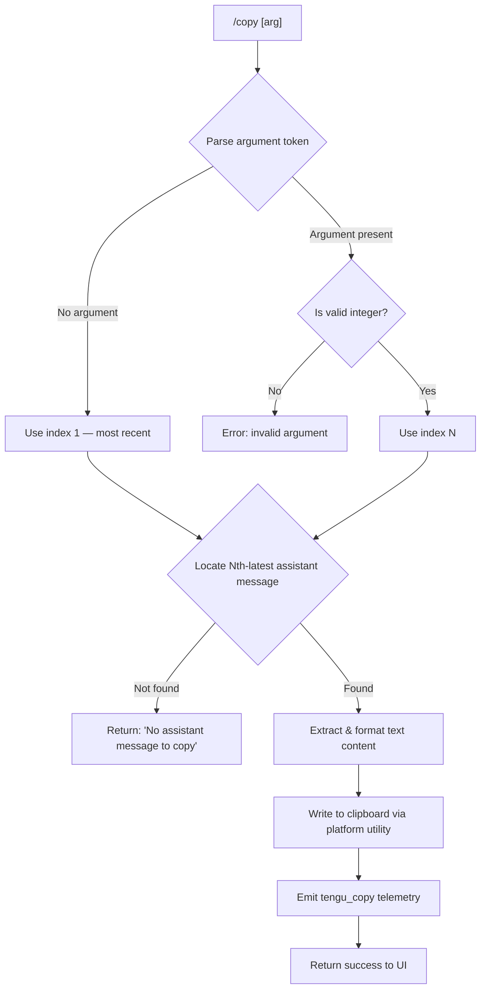

# `/copy`

> Analysis basis: CC v2.1.152 bundle.js (AST extraction + Claude interpretation)
> Minimum version: v2.1.152

---

## Overview

The `/copy` command copies Claude's most recent assistant response to the system clipboard. An optional integer argument `N` (e.g. `/copy 2`) selects the Nth-latest assistant message instead of the most recent one. The command extracts text content from the conversation history, formats it, and invokes a platform-appropriate clipboard utility.

---

## Registration

| Field | Value |
|---|---|
| type | `local-jsx` |
| name | `copy` |
| description | `Copy Claude's last response to clipboard (or /copy N for the Nth-latest)` |
| module_id | `WZ1` |
| load_inline | `true` |
| loc_byte | `10753594` |
| loc_byte_end | `10753780` |
| loc_line | `8714` |
| arbor_handler.name | `AQL` |
| arbor_handler.fqn | `claude-2.1.152::AQL` |
| arbor_handler.kind | `AsyncFunction` |
| arbor_handler.resolution_path | `module_id` |
| arbor_handler.n_hits | `0` |

Analysis basis: CC v2.1.152 bundle.js:+10753594

---

## Input Branching

Four distinct paths exist based on argument parsing and message availability, so a Mermaid flowchart is used.



Analysis basis: CC v2.1.152 bundle.js:+10752779 (handler `AQL`), +10752889 (`Number`/`Number.isInteger` check), +10752820 (error string)

---

## Behavioral Spec

### Argument Parsing

The handler (`AQL`) receives the raw slash-command argument string and attempts to resolve a message index.

```
async function copyCommandHandler(rawArg, appContext):
    token = parseFirstToken(rawArg)           // JZ1 → tokenizes input
    if token is absent or empty:
        index = 1                             // default: most-recent
    else:
        n = Number(token)
        if not Number.isInteger(n) or n < 1:
            return errorResult("invalid argument")
        index = n
    // index is now a positive integer
    messageList = getAssistantMessages(appContext)  // JZ1 + history access
    target = messageList[messageList.length - index]
    if target is undefined:
        return uiResult("No assistant message to copy")   // bundle.js:+10752820
    textContent = extractPlainText(target)    // agL → lexer pass
    writeToClipboard(textContent)             // un_ → platform dispatch
    emitTelemetry("tengu_copy")               // bundle.js:+10753198
    return successResult()
```

Analysis basis: CC v2.1.152 bundle.js:+10752779 (`AQL` entry), +10752889 (`Number`), +10752903 (`Number.isInteger`)

---

### Message Lookup and Text Extraction

`JZ1` (message-filter helper) filters the conversation history to retain only entries of role `"assistant"` (literal: `"assistant"`, bundle.js:+10748727). `agL` then lexes the message through `mf.lexer` (bundle.js:+10747605) to extract `"text"`-typed content blocks (literal: `"text"`, bundle.js:+10452930), stripping non-text blocks. `HjH` applies a replacement pass over the raw text (bundle.js:+10451286).

```
function filterAssistantMessages(conversationHistory):
    return conversationHistory.filter(
        entry => entry.role == "assistant"    // literal "assistant" :+10748727
    )

function extractPlainText(assistantMessage):
    tokens = lexer(assistantMessage.content) // mf.lexer :+10747605
    textBlocks = tokens.filter(t => t.type == "text")   // "text" :+10452930
    rawText = textBlocks.map(t => t.value).join("")
    return applyTextReplacements(rawText)    // HjH :+10451286
```

Analysis basis: CC v2.1.152 bundle.js:+10748727, +10747605, +10452930, +10451286

---

### Table / Plaintext Formatting

`wZ1` (table formatter) is called for structured output. It recognises a `"table"` content shape (literal: `"table"`, bundle.js:+10748491) and formats it as a pipe-separated table. Column alignment variants `"left"`, `"center"`, and `"right"` are supported (literals bundle.js:+10748184, +10748102, +10748144). The pipe separator literal `" | "` (bundle.js:+10748067) is used between cells; an escaped-pipe pattern `"\\|"` (bundle.js:+10747908) guards cell content. A minimum column width of 3 is enforced via `Math.max(..., 3)` (bundle.js:+10747958). For non-table content the output type degrades to `"plaintext"` (literal: bundle.js:+10748932).

```
function formatTableContent(tableBlock):
    columns = mapColumns(tableBlock)         // sgL :+10747865
    for each column:
        width = Math.max(
            maxCellWidth(column),            // e6 → Bun.stringWidth :+205856
            3                               // literal 3 :+10747967
        )
    rows = tableBlock.rows.map(row =>
        row.cells.map((cell, i) =>
            padCell(cell, columns[i].align, width[i])
        ).join(" | ")                       // " | " :+10748067
    )
    return rows.join("\n")

function padCell(text, align, width):
    if align == "center": return centerPad(text, width)   // :+10748102
    if align == "right":  return text.padStart(width)     // :+10748144
    return text.padEnd(width)                              // "left" :+10748184
```

Analysis basis: CC v2.1.152 bundle.js:+10748491, +10747865, +10747967, +10748067, +10748102, +10748144, +10748184, +10748932

---

### Platform Clipboard Dispatch

`un_` selects and invokes the OS-appropriate clipboard utility. The dispatch is delegated to `hZ` (bundle.js:+10749143), which in turn calls `f97` and `K97` for platform-specific sub-flows.

```
async function writeToClipboard(text):
    platform = process.platform
    if platform == "darwin":
        spawnAndWrite("pbcopy", [], text)      // "pbcopy" :+3361233
    else if platform == "linux":
        if waylandAvailable():
            spawnAndWrite("wl-copy", [], text) // "wl-copy" :+3361298
        else if xclipAvailable():
            spawnAndWrite("xclip", ["-selection", "clipboard"], text)
                                               // "xclip" :+3361344, "-selection" :+3361365, "clipboard" :+3361378
        else:
            spawnAndWrite("xsel", ["--clipboard", "--input"], text)
                                               // "xsel" :+3361410, "--clipboard" :+3361429, "--input" :+3361443
    else if platform == "win32":
        spawnAndWrite("powershell",
            ["-NoProfile", "-NonInteractive", "-Command", "Set-Clipboard"],
            text)                              // "powershell" :+3361722, flags :+3361736–:+3361767
    // Kitty / tmux terminal multiplexer paths also supported
    // "kitty" :+3360329, "tmux" :+3360894 ("load-buffer" :+3360832, "-w" :+3360866)
    // iTerm2 OSC sequence path: "iTerm2" :+3360822
    // Clipboard written via tmp file path JX (PZ1 :+10749001) when needed
```

Analysis basis: CC v2.1.152 bundle.js:+3361207 (`"darwin"`), +3361259 (`"linux"`), +3361710 (`"win32"`), +3361233, +3361298, +3361344, +3361722, +3360329, +3360894, +10749143 (`hZ`), +10749001 (`PZ1`/`JX`)

---

### Temporary File Path for Clipboard

When the clipboard utility requires a file path (e.g. tmux `load-buffer`), `PZ1` creates the necessary directory structure and writes a temporary file via `HZ8.mkdir` / `HZ8.writeFile` (bundle.js:+10749035, +10749078). The temp directory is rooted under `JX` (bundle.js:+10749001), which honours the `CLAUDE_CODE_TMPDIR` environment override and asserts the directory has correct ownership/permissions via `nz7` (bundle.js:+3934294). The constant `/tmp` is the fallback (bundle.js:+3933607), with chmod `0o700` (448 decimal, bundle.js:+3934288).

Analysis basis: CC v2.1.152 bundle.js:+10749001, +10749035, +10749078, +3933607, +3934288

---

## State & Side Effects

| Item | Detail |
|---|---|
| Telemetry | `tengu_copy` (bundle.js:+10753198) — fired on every successful copy invocation |
| Telemetry (indirect, from call graph depth-2) | `tengu_feature_ok` (+964519), `tengu_feature_bad` (+964577) — general feature-gate checks reached via clipboard utility path |
| Clipboard mutation | System clipboard contents are replaced with the extracted assistant text |
| Temporary files | A temp file may be written under `CLAUDE_CODE_TMPDIR` (or `/tmp`) for multiplexer-based clipboard paths; cleaned up after the utility exits |
| appState changes | None — command is read-only with respect to conversation state |
| Hook registration | None observed in depth-2 traversal |
| Sound | None observed in depth-2 traversal |

---

## Version History

| Version | Change |
|---|---|
| v2.1.152 | Initial analysis |

---

## Common Mistakes

1. **Passing a non-integer argument**: `/copy 1.5` or `/copy last` will fail argument validation because `Number.isInteger` rejects non-integer values (bundle.js:+10752903). Always supply a whole positive number.
2. **Expecting `/copy 0` to work**: Index counting starts at 1 (most recent). Index 0 or negative values are rejected by the `n < 1` guard.
3. **Requesting an index larger than conversation length**: If only two assistant turns exist, `/copy 3` will trigger the "No assistant message to copy" path (bundle.js:+10752820) rather than an explicit error. Verify the session has enough turns.
4. **Clipboard failure in headless/remote environments**: In SSH sessions without a display server, `xclip`/`xsel`/`wl-copy` may not be available. Claude Code attempts a tmux `load-buffer` or OSC-sequence fallback, but if none apply, the copy silently fails at the OS level. Users should ensure at least one clipboard backend is installed.
5. **Assuming rich formatting is preserved**: The extraction pipeline reduces content to plain text (type `"plaintext"`, bundle.js:+10748932) or a pipe-table representation. Markdown formatting other than tables is stripped.

---

## Appendix — Identifier Mapping

> For bundle debugging only. Identifiers change across versions.

| Identifier | Role |
|---|---|
| `AQL` | Main async handler for `/copy` (arbor_handler) |
| `wZ1` | Table content formatter (column-width, alignment, pipe-separator logic) |
| `sgL` | Column-mapping helper called by table formatter |
| `jZ1` | Message-filter / token-dispatch helper; routes to `wZ1` or text path |
| `JZ1` | Conversation history filter — retains only `"assistant"` role entries |
| `JK` | Text-block filter applied to assistant message content blocks |
| `agL` | Lexer wrapper that extracts text tokens from a message using `mf.lexer` |
| `HjH` | Text replacement pass applied after extraction |
| `mf` | Markdown/content lexer (wraps `hvH.parse`) |
| `XZ1` | Plaintext content normaliser (applies `H.replace`) |
| `un_` | Platform clipboard dispatch — top-level clipboard write orchestrator |
| `hZ` | Clipboard sub-orchestrator; branches on terminal type and OS |
| `f97` | Platform-specific clipboard writer (darwin/linux/win32 branches) |
| `K97` | Alternative clipboard path (delegates to `Z8`) |
| `q97` | Text pre-processing for clipboard (applies `H.replaceAll`) |
| `qJ` | Kitty / terminal-protocol clipboard helper |
| `_97` | Low-level Kitty protocol helper (calls `gJ`) |
| `PZ1` | Temp-file directory setup + file write (mkdir + writeFile) |
| `JX` | Temp directory resolver with ownership/permission validation |
| `nz7` | Directory permission checker (lstat + chmodSync) |
| `U4` | String index utility (wraps `H.indexOf`) |
| `Hd` | Temp directory path builder |
| `e6` | Terminal string-width measurement (wraps `Bun.stringWidth`) |
| `Sn1` | Daemon status helper (reads `daemon.status.json`) |
| `Ki` | Internal state accessor called by daemon status |
| `z1H` | Text trimmer helper (applies `_.trim` with 1000ms timeout hint) |
| `KI6` | Status-file join helper (joins `hn1`, reads `daemon.status.json`) |
| `CH` | JSON serialiser wrapper (`JSON.stringify`) |
| `k8` | Session state classifier (produces `"stopped"` / `"background session"`) |
| `A1` | App-state store accessor (`HY7.getStore`) |
| `wZ1` | (see table formatter above — same ident) |
| `lhH` | MCP server connection orchestrator (large; reached via call graph depth-2) |
| `r6H` | MCP config loader |
| `NX6` | MCP transport negotiator |
| `W7H` | MCP server boot helper |
| `i6H` | SDK-type MCP connection helper |
| `vX6` | SSE/HTTP MCP transport connector |
| `pV` | MCP permission checker |
| `XO` | MCP config validator |
| `EQ_` | MCP OAuth + tool-dispatch coordinator |
| `U_H` | MCP OAuth flow runner (HTTP callback server) |
| `FeH` | MCP pending-auth tracker |
| `WB` | MCP reconnect handler |
| `VQ_` | MCP complete-authentication tool handler |
| `BeH` | Pending-auth cache reader |
| `geH` | Auth-state cache getter |
| `TQ_` | MCP telemetry event emitter |
| `qv_` | MCP connection-state checker |
| `M8` | Global config writer |
| `SJ1` | Async iterable utility |
| `ur` | Async iterator / stream wrapper |
| `rE6` | `parseInt` wrapper (radix 10) |
| `Vd_` | `parseInt` wrapper (radix 20) |
| `xJ1` | Auth-cache file writer |
| `CG8` | Cache path builder (joins `RG8`) |
| `Ed_` | Auth-cache read helper |
| `RbL` | Needs-auth cache manager |
| `OM8` | Auth-cache object builder |
| `zM8` | Cache hash updater |
| `yX` | Hash generator (`bE9.createHash`, sha256) |
| `$M8` | Config key extractor (`gK`) |
| `gK` | HMAC/key helper (`hfq`) |
| `O8` | MCP debug logger (`YmH.push` + `Cn.logMCPDebug`) |
| `XL` | MCP error logger (`YmH.push` + `Cn.logMCPError`) |
| `GH` | String coercion wrapper |
| `WRL` | SSH environment detector |
| `GRL` | MCP OAuth gate helper |
| `Wg` | Auth-flow initiator (`am` + `xK`) |
| `am` | Credential manager accessor |
| `fG8` | State-store config reader |
| `Y` | Supervisor/config-reload handler |
| `RI` | Rate-limiter or retry controller |
| `D` | Daemon session lifecycle manager |
| `dPK` | MCP update applier |
| `bG8` | MCP update serialiser |
| `xI` | MCP cleanup invoker |
| `HH6` | MCP client cleanup helper |
| `yR5` | Remote MCP server retry loop |
| `DM8` | MCP server duplicate filter |
| `n8` | Timeout/abort controller |
| `N` | Process/command executor |
| `OyK` | Command builder |
| `xMA` | Environment variable injector |
| `j4` | Argument sanitiser (redacts sensitive values) |
| `Y$A` | Argument list mapper |
| `VxH` | Stdin writer |
| `e3A` | Low-level stdin write |
| `DyK` | Log file writer / rotator |
| `obH` | Buffered log output flusher |
| `cqH` | Log file path builder |
| `Q6` | Config directory resolver |
| `Q96` | Log file rotator |
| `G$A` | Log directory path helper |
| `W$A` | Log file rename / unlink helper |
| `YyK` | Log append-file writer |
| `tq` | CMA registration helper |
| `c` | Generic error handler / logger |
| `w` | Daemon worker process manager |
| `R` | Worker kill helper |
| `mH` | Feature-bad telemetry emitter |
| `SH` | Feature-ok telemetry emitter |
| `jI8` | Memory monitor (`a6` + `E6`) |
| `mY6` | Worker config file reader |
| `hH` | Worker error logger |
| `B` | Worker retirement helper |
| `E6` | Worker session cache |
| `d4A` | Worker claim / socket connect |
| `a4A` | Worker lifecycle (add/delete/finally) |
| `S` | Worker state disposer |
| `C_7` | Config file watcher |
| `xi` | Config watch debouncer |
| `L8` | Log level / output helper |
| `Mb` | Path prefix stripper |
| `zpq` | Directory listing helper |
| `R$_` | Path join helper |
| `B6` | JSON parser wrapper |
| `N$_` | Config null-guard |
| `zzH` | Global config file reader/writer |

---

Note: index built via Arbor fallback; some signals (telemetry, literals) may be missing — see arbor-fallback.js.