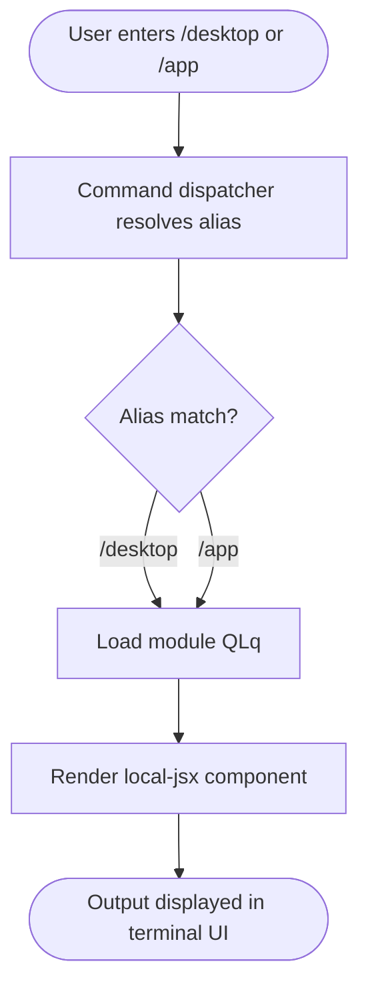

# `/desktop`

> Analysis basis: CC v2.1.144 bundle.js (AST extraction + Claude interpretation)
> Minimum version: v2.1.144

---

## Overview

The `/desktop` command (also aliased as `/app`) provides a mechanism to continue the current Claude Code CLI session inside the Claude Desktop application. It is registered as a `local-jsx` command, meaning its output is rendered as a JSX component directly within the terminal UI rather than as plain text. The core mechanism bridges the CLI session context into the Desktop application environment.

---

## Registration

| Field | Value |
|---|---|
| type | `local-jsx` |
| name | `desktop` |
| description | `Continue the current session in Claude Desktop` |
| aliases | `["app"]` |
| module_id | `QLq` |

Analysis basis: CC v2.1.144 bundle.js:+10147052

---

## Input Branching

The AST depth-2 traversal of module `QLq` returned an empty call graph and no extracted literals. No branching logic, argument parsing, or conditional paths were recoverable at this traversal depth.

<!-- TODO: not found in depth-2 traversal; needs --depth 4 -->

The following flowchart represents the minimum structural shape that can be stated with confidence based on registration metadata alone:



---

## Behavioral Spec

Because the AST traversal of module `QLq` produced no recoverable entry functions, call edges, or string literals, no algorithmic pseudocode can be derived without speculation.

<!-- TODO: not found in depth-2 traversal; needs --depth 4 -->

### Alias Resolution

The command registers two names that map to the same handler module.

```
function resolveDesktopCommand(inputToken):
    if inputToken == "desktop" or inputToken == "app":
        return loadModule("QLq")
    else:
        return NO_MATCH
```

Analysis basis: CC v2.1.144 bundle.js:+10147052

### JSX Render Path

The `local-jsx` type indicates the command's output is not streamed as plain text but rendered as a React/JSX component inside the CLI's terminal UI layer. The component is mounted at command invocation time and unmounted when the user navigates away or the command completes.

```
function executeDesktopCommand(sessionContext):
    component = loadJSXComponent(module = "QLq")
    mount(component, props = { session: sessionContext })
    // Component handles its own lifecycle from this point
```

Analysis basis: CC v2.1.144 bundle.js:+10147052

### Session Handoff (Inferred from Description)

The registered description states the command's purpose is to "Continue the current session in Claude Desktop." The mechanism by which session state is transferred to the Desktop application is not recoverable from the depth-2 traversal.

<!-- TODO: not found in depth-2 traversal; needs --depth 4 -->

---

## State & Side Effects

| Item | Detail |
|---|---|
| Telemetry | None detected at depth-2 traversal (`telemetry: []`) |
| Hook registration | <!-- TODO: not found in depth-2 traversal; needs --depth 4 --> |
| appState changes | <!-- TODO: not found in depth-2 traversal; needs --depth 4 --> |
| Sound | <!-- TODO: not found in depth-2 traversal; needs --depth 4 --> |
| Render mode | `local-jsx` — output is a mounted JSX component, not plain text |
| Alias side effect | `/app` is a registered alias; both tokens invoke the same module `QLq` |

---

## Version History

| Version | Change |
|---|---|
| v2.1.144 | Initial analysis — registration confirmed; implementation internals not recoverable at depth-2 |

---

## Common Mistakes

1. **Using `/app` and expecting different behavior than `/desktop`** — Both tokens are aliases for the same command handler (`QLq`). There is no behavioral difference between them.
2. **Expecting plain-text output** — Because the command type is `local-jsx`, its output is a rendered UI component. Piping or redirecting stdout will not capture the command's rendered content.
3. **Assuming the command works without Claude Desktop installed** — The description explicitly references Claude Desktop as the target environment. Invoking this command in an environment where the Desktop application is absent or not authenticated may produce an error or a no-op; exact failure behavior is not recoverable from the current traversal depth.
4. **Expecting telemetry confirmation** — No `tengu_*` telemetry events were found at depth-2. Do not rely on telemetry signals from this command to confirm successful handoff.

---

## Appendix — Identifier Mapping

> For bundle debugging only. Identifiers change across versions.

| Identifier | Role |
|---|---|
| QLq | Module containing the `/desktop` (`/app`) command handler and JSX component |

> Note: The `identifiers` array returned by the AST extraction was empty (`[]`). No additional obfuscated identifiers were exposed at depth-2 traversal. The module ID `QLq` is included here as the sole recoverable bundle reference.
> Analysis basis: CC v2.1.144 bundle.js:+10147052