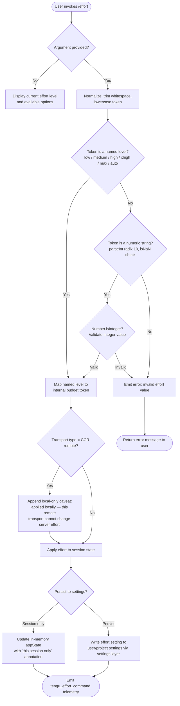

# `/effort`

> Analysis basis: CC v2.1.152 bundle.js (AST extraction + Claude interpretation)
> Minimum version: v2.1.152

---

## Overview

The `/effort` command sets the reasoning effort level that Claude Code applies to model usage within the current session or globally via persisted settings. It accepts one of several named tiers (`low`, `medium`, `high`, `xhigh`, `max`, or `auto`) and translates that token into an internal budget token value, applying it to application state and persisting it through the settings layer. Remote (CCR) transports receive a caveat that effort changes are applied locally only.

---

## Registration

| Field | Value |
|---|---|
| type | `local-jsx` |
| name | `effort` |
| description | Set effort level for model usage |
| argumentHint | `[low\|medium\|high\|xhigh\|max\|auto]` |
| immediate | `null` |
| thinClientDispatch | `control-request` |
| module_id | `ol1` |
| load_inline | `true` |
| loc_byte | 12389661 |
| loc_byte_end | 12389924 |
| loc_line | 10307 |
| arbor_handler.name | `F75` |
| arbor_handler.fqn | `claude-2.1.152::F75` |
| arbor_handler.kind | `AsyncFunction` |
| arbor_handler.resolution_path | `module_id` |
| arbor_handler.n_hits | 1 |

Analysis basis: CC v2.1.152 bundle.js:+12389661

---

## Input Branching

The command processes user input through multiple distinct branches: argument presence check, token validation, named-level recognition, numeric budget interpretation, CCR remote caveat injection, and session-vs-persisted application. A Mermaid flowchart is used because there are more than three distinct paths.



---

## Behavioral Spec

### Handler Entry Point (F75)

The Arbor-resolved handler `F75` (AsyncFunction) is the command's main entry point. It receives the argument string from the CLI invocation and orchestrates argument parsing, effort mapping, and state application.

Analysis basis: CC v2.1.152 bundle.js:+12387574

```
async function effortCommandHandler(args, context):
    # Check whether $3H (valid-levels list) includes the raw argument
    if args not in validEffortLevels:
        # Render current status via CA.createElement
        return renderCurrentEffortStatus(context)

    # Proceed to parse and apply the effort level
    level = parseEffortToken(args)
    applyEffortToState(level, context)
    emitTelemetry("tengu_effort_command")
```

Analysis basis: CC v2.1.152 bundle.js:+12387574, +12387591, +12387643

---

### Effort Token Parsing (fx, CVH, RVH)

The token parser normalizes input and resolves it to an internal representation.

Analysis basis: CC v2.1.152 bundle.js:+4092527, +4092391, +4092354

```
function parseEffortToken(rawToken):
    trimmed = rawToken.trim()                  # CVH: H.trim at +4092391
    normalized = String(trimmed)               # fx: String at +4092549

    if isNamedLevel(normalized):               # RVH: mN.includes at +4092354
        return namedLevelToBudgetToken(normalized)

    parsed = parseInt(normalized, 10)          # fx: parseInt radix 10 at +4092610
    if isNaN(parsed):                          # fx: isNaN at +4092629
        return error("unset")                  # literal "unset" at +4092889

    if not Number.isInteger(parsed):           # _eq: Number.isInteger at +4094271
        return error("invalid integer")

    return parsed
```

Named levels recognized (literals array):
- `"low"` — Quick, straightforward implementation with minimal overhead (bundle.js:+4094396, +4094408)
- `"medium"` — Balanced approach with standard implementation and testing (bundle.js:+4094474, +4094489)
- `"high"` — Comprehensive implementation with extensive testing and documentation (bundle.js:+4094567)
- `"xhigh"` — Extra-high reasoning budget (bundle.js:+4095082)
- `"max"` — Maximum capability with deepest reasoning (bundle.js:+4094743, +4093195)
- `"auto"` — Automatic selection (bundle.js:+4092917)

Special internal token: `"ultra"` maps to `"max"` (bundle.js:+4093146); `"opus-4-7"` is a recognized alias (bundle.js:+4092973).

---

### Model-Gating Logic (_W, P9, QdH, gY6)

Before applying an effort level, the command checks whether the currently active model supports that effort tier. The check inspects the model name against a hardcoded allow-list.

Analysis basis: CC v2.1.152 bundle.js:+4091227, +4091291, +4091335

```
function isEffortSupportedForModel(effortLevel, modelName):
    lowerModel = modelName.toLowerCase()       # A: M.toLowerCase at +15408290

    # Models supporting "max_effort" tier (literal at +4091623)
    maxEffortModels = [
        "claude-3-",       # prefix (bundle.js:+4091355)
        "claude-opus-4-0", "claude-opus-4-1",
        "claude-sonnet-4-0", "claude-sonnet-4-5",
        "claude-haiku-4-5", "claude-opus-4-7",
        "claude-opus-4-6", "claude-sonnet-4-6",
        "claude-opus-4-5"
    ]

    # Models supporting "xhigh_effort" tier (literal at +4091977)
    xhighEffortModels = [...]

    # Check A.includes at +4091344 (supported model list)
    if lowerModel not in supportedModels:
        return false

    # Provider check: firstParty, anthropicAws, foundry, mantle
    # P9: H.includes at +2183859, literals at +2041445–2041498
    if provider is "application-inference-profile":   # literal at +2183870
        return checkInferenceProfileSupport()

    return true
```

Analysis basis: CC v2.1.152 bundle.js:+4091344, +4091355–4091550, +2183859, +2183870

---

### CCR Remote Transport Caveat (cl1, Xy)

When the active session is connected to a CCR (remote) transport, a caveat string is appended to the confirmation message.

Analysis basis: CC v2.1.152 bundle.js:+12378674, +12378706

```
function buildEffortConfirmationMessage(effortLevel, transportType):
    base = formatEffortMessage(effortLevel)

    if transportType == "ccr":                 # literal "ccr" at +4090460
        base += " (applied locally — this remote transport can't change server effort)"
        # literal at +12378706

    return base
```

---

### Effort Application to State (uHH, _W, iq8, rq8, QdH, gY6)

The resolved effort token is applied through a multi-step state-mutation pipeline: first to in-memory session state, then optionally persisted to the settings layer.

Analysis basis: CC v2.1.152 bundle.js:+4093038, +4093057, +4093066, +4093075

```
async function applyEffortToState(effortToken, sessionOnly):
    # _W: update in-memory effort state (uH at +4091227)
    updateInMemoryEffort(effortToken)

    # iq8: update primary session config (P9 at +4092958)
    updateSessionConfig("effort", effortToken)

    # x6: record timestamp via Date.now (+3200369), assign session ID
    recordEffortChange(effortToken, Date.now())

    if sessionOnly:
        # Annotate with " (this session only)" literal at +12379685
        appendAnnotation("this session only")
    else:
        # rq8 → P9: persist to settings layer (+4095050)
        persistEffortSetting(effortToken)

    # ddH: write to settings (via settings-layer functions)
    writeToSettingsLayer(effortToken)

    # oj_: broadcast change notification (at +4093158)
    broadcastEffortChange(effortToken)
```

---

### Settings Persistence (sj_, O1H, E6)

The effort value is written to the appropriate settings file through the settings persistence layer.

Analysis basis: CC v2.1.152 bundle.js:+12379893, +4094834, +4094856

```
async function persistEffortSetting(effortToken):
    # sD7: validate settings schema (+4094834)
    validateSettingsSchema(effortToken)

    # O1H → O1: resolve settings path (+2958392)
    path = resolveSettingsPath()

    # E6: write via config-save mechanism (+3181073)
    # Uses MzH.has / MzH.get, kO6.add, TQ.has / TQ.get
    # Emits tengu_slate_finch on completion (+4094866)
    saveSettingWithLock("apply_flag_settings", effortToken)
    # literal "apply_flag_settings" at +12378855
```

Settings files involved (literals):
- `~/.claude/settings.json` (bundle.js:+1214320, +1214330)
- `~/.claude/settings.local.json` (bundle.js:+1214392)

---

### Status Display (VN8, O4H, F75 render path)

When invoked without an argument, `/effort` renders the current effort level and available options.

Analysis basis: CC v2.1.152 bundle.js:+12380427, +12387612, +12387627

```
function renderCurrentEffortStatus(context):
    # VN8: normalize current value to lowercase (+12380427)
    currentLevel = getCurrentEffortFromState().toLowerCase()

    # O4H → RVH: validate current value against named levels (+4094337)
    isKnown = isNamedLevel(currentLevel)

    # F75 render: CA.createElement with props "current" and "status"
    # literals at +12387612, +12387627
    return renderJSXComponent({
        current: currentLevel,
        status: isKnown ? "active" : "unset"
    })
```

---

### Animated Effect Component (El, rl1, il1)

The `/effort` module includes a JSX animation component rendered alongside the effort confirmation. It uses trigonometric math to produce a visual particle or wave effect.

Analysis basis: CC v2.1.152 bundle.js:+12383134, +12383273, +12383277

```
function renderEffortAnimation(frameData):
    # il1: Math.sqrt for distance calculation (+12382924)
    # rl1: Math.cos, Math.min, Math.round for wave shaping
    #      (+12383025, +12383061, +12383083)
    # Renders up to 9 cells (literal 9 at +12383140)
    # with 3 color steps (literal 3 at +12383230)
    # and 4/7 frame positions (literals at +12383400, +12383448)
    cells = computeAnimationCells(frameData, sqrt, cos, min, round)
    return CA.createElement("animation", {cells})
```

---

## State & Side Effects

| Item | Detail |
|---|---|
| Telemetry: `tengu_effort_command` | Fired on every successful effort change (bundle.js:+12380065) |
| Telemetry: `tengu_slate_finch` | Fired when settings are persisted via config-save path (bundle.js:+4094866) |
| Telemetry: `tengu_feature_ok` | Fired when a feature gate passes (bundle.js:+964519) |
| Telemetry: `tengu_feature_sad` | Fired when a feature gate returns a soft failure (bundle.js:+964654) |
| Telemetry: `tengu_feature_bad` | Fired when a feature gate returns a hard failure (bundle.js:+964577) |
| Telemetry: `tengu_config_lock_contention` | Fired if config-lock acquisition exceeds threshold (bundle.js:+3201453) |
| Telemetry: `tengu_config_stale_write` | Fired when a stale write is detected in the config layer (bundle.js:+3201589) |
| Telemetry: `tengu_config_auth_loss_prevented` | Fired when a write is blocked to avoid losing auth tokens (bundle.js:+3201932) |
| Telemetry: `tengu_config_parse_error` | Fired when settings JSON cannot be parsed (bundle.js:+3204028) |
| appState changes | In-memory effort level updated; session state mutated via `updateInMemoryEffort` and `updateSessionConfig` |
| Settings writes | `~/.claude/settings.json` and/or `~/.claude/settings.local.json` updated when persisting; protected by config lock (60 000 ms timeout at bundle.js:+3202134) |
| Config lock | Lock contention logged; stale-write and auth-loss guards prevent data loss (GH #3117 referenced at bundle.js:+3201780, +3198661) |
| Session annotation | When applied session-only, confirmation message includes " (this session only)" (bundle.js:+12379685) |
| CCR caveat | When transport is CCR, confirmation appended with remote-limitation notice (bundle.js:+12378706) |
| Config backups | Up to 5 backup files retained with `.backup.` prefix, 60 s window (bundle.js:+3202250, +3202383, +3202134) |
| thinClientDispatch | `control-request` — the command is dispatched as a control request in thin-client mode |

---

## Version History

| Version | Change |
|---|---|
| v2.1.152 | Initial analysis; named levels: low, medium, high, xhigh, max, auto; model allow-list includes claude-3-* prefix and specific claude-opus/sonnet/haiku 4.x variants |

---

## Common Mistakes

1. **Providing an unrecognized level name** — only `low`, `medium`, `high`, `xhigh`, `max`, and `auto` are accepted named tokens; typos are treated as invalid and result in an error, not a fuzzy match.
2. **Expecting effort to propagate to a remote CCR server** — the command explicitly notes that CCR transport cannot change server-side effort; the setting applies locally only.
3. **Assuming all models support all effort levels** — the model allow-list is hardcoded; models not in the list (e.g. third-party or older Claude 2 variants) may not honor `xhigh` or `max` tiers.
4. **Forgetting the session-only boundary** — without explicit persistence, the effort level applies only for the current session and is lost on restart.
5. **Concurrent Claude instances** — config-lock contention is possible when multiple Claude Code instances run simultaneously; the lock guard logs `tengu_config_lock_contention` and may delay the write up to 60 seconds.
6. **Using a numeric token without understanding the budget scale** — numeric tokens are parsed as integers (radix 10); non-integer floats are rejected; the valid integer range is not documented in depth-2 traversal.

---

## Appendix — Identifier Mapping

> For bundle debugging only. Identifiers change across versions.

| Identifier | Role |
|---|---|
| `EN8` | Top-level effort command orchestrator (calls token parser, state applier, settings writer) |
| `z$` | Session/context accessor utility |
| `NWH` | Session context sub-accessor |
| `ddH` | Settings write dispatcher |
| `fx` | Effort token parser (trim → String → named-level check → parseInt → isNaN) |
| `_eq` | Integer validation helper (wraps Number.isInteger) |
| `RVH` | Named-level membership checker (mN.includes) |
| `YV` | Effort application coordinator (delegates to uHH and O4H) |
| `uHH` | Core state-mutation function for effort (_W, iq8, rq8, ddH, oj_, QdH, gY6) |
| `_W` | In-memory effort state updater (uH, be, P9, A.includes, hS, nD) |
| `uH` | String-coercion utility for state values |
| `P9` | Config-object updater (On6, rj, H.includes, Au8, vP) |
| `A` | Model name normalizer (M.toLowerCase) |
| `hS` | Settings helper: firstParty provider path (yA) |
| `nD` | Settings helper: multi-provider path (Mn6, dk4, yA, Ln6) |
| `iq8` | Primary session-config update (P9, x6) |
| `x6` | Timestamped change recorder (Q6, BG, N$_, zzH, Date.now, C_7) |
| `rq8` | Persistence-path session-config update (P9) |
| `oj_` | Change-notification broadcaster |
| `QdH` | Max-effort model-gate checker (be, P9, A.includes, hS, nD) |
| `gY6` | Xhigh-effort model-gate checker (be, P9, A.includes, hS, nD) |
| `O4H` | Current-level display validator (RVH) |
| `sj_` | Settings-persistence entry point (sD7, O1H, E6) |
| `sD7` | Settings schema validator |
| `O1H` | Settings path resolver (O1) |
| `O1` | Settings resolution implementation (h8_, y8_, sD, lq) |
| `h8_` | Settings path component helper |
| `y8_` | Settings path component helper |
| `sD` | Core settings resolver (A4, VN, gO, GA, QJ, JO, o1H) |
| `E6` | Config-save mechanism with deduplication (hO6, SO6, oe, MzH.has, P68, kO6.add, TQ.has, TQ.get, x6) |
| `hO6` | Config-save pre-check helper |
| `SO6` | Config-save post-check helper |
| `oe` | Config entry formatter (uH, Qb) |
| `Qb` | Config entry builder (QS) |
| `P68` | Deduplication guard (O$_.has, MzH.get, O$_.add, $$_, w$_) |
| `$$_` | Config event emitter (Qb, LEH, Sp, eFH, L$_.randomUUID, CH, K_7, bi.emit) |
| `w$_` | Config write worker (ONq, s_, amq, efH) |
| `rl1` | Animation wave-shaping math (Math.cos, Math.min, Math.round) |
| `il1` | Animation distance math (Math.sqrt) |
| `VN8` | Status/display handler (H.toLowerCase, G75, CVH, W75) |
| `H` | Random/timer utility (Math.random, setTimeout) |
| `G75` | Effort-level display renderer (cl1, dY6, c, z$, ddH) |
| `cl1` | Session-context builder (z$, Xy) |
| `Xy` | Session-context accessor (z$) |
| `dY6` | Effort display sub-renderer (XYH, l_, M8) |
| `XYH` | Display formatting helper |
| `l_` | Settings-load orchestrator (zO, Q6, YGH.dirname, mi8, Tg, OP, j8, V9, N, pn8, DGH, z76, CH, Wz, lU6, Ob, z_, SH, H8, mH, sm, hH, rmH.emit) |
| `zO` | Settings directory resolver (m3H, Tg) |
| `Q6` | File existence checker |
| `mi8` | Settings file reader (mNA, m3H, Gg, bNA, bn) |
| `Tg` | Settings merge/parse engine (z_, pq6, jx8, bq6, PWH, WWH, Uq6, C3H, b3H, hi8, PNA, Bn, e76) |
| `OP` | Path utility wrapper (xn) |
| `j8` | File-not-found handler (L8) |
| `N` | Log/debug utility (t96, OyK, H.includes, CH, _.toUpperCase, j4, H.trim, Dk, VxH, DyK) |
| `pn8` | Settings cache timestamp recorder (tU6.set, Date.now) |
| `DGH` | Settings-load finisher (UB6, Tg) |
| `z76` | Atomic file writer with locking (Q6, q.readlinkSync, m5.isAbsolute, m5.resolve, m5.dirname, N, Vf.closeSync, Vf.openSync, L8, q.lstatSync, j8, wl8.randomBytes, q.statSync, M.toString, Vf.writeFileSync, Vf.fchmodSync, Vf.fsyncSync, q.renameSync, q.unlinkSync) |
| `CH` | JSON serializer (JSON.stringify) |
| `Wz` | Cache-clear utility (FS6.clear, eC8.clear) |
| `lU6` | Settings-file append/write utility (b6, Zn8, H.replaceAll, A.endsWith, cU6, d64, W9H.dirname, W3H.mkdir, W3H.readFile, ZVA, N, EVA, W3H.appendFile, L8, W3H.writeFile, String) |
| `Ob` | Claude config path builder (KN.join) |
| `z_` | Process environment reader (pv) |
| `SH` | Feature-gate OK reporter (c → tengu_feature_ok) |
| `H8` | Feature-gate sad reporter (c → tengu_feature_sad) |
| `mH` | Feature-gate bad reporter (c → tengu_feature_bad) |
| `sm` | Settings-load lifecycle tracer (Lk, Z9, pi8, Tg, gS6) |
| `hH` | Error-log helper (n_, uH, V1, UtK, YmH.push, Cn.logError) |
| `M8` | Conversation/session state manager (S$_, BG, H, bgH, Opq, xgH, N, zzH, uO6, c, h$_) |
| `S$_` | Config-save-with-lock implementation (_, eY.dirname, Q6, L.mkdirSync, Date.now, Efq, N, c, BG, L.statSync, L8, zzH, uO6, A, JG, CH, eY.basename, R$_, L.readdirStringSync, V.startsWith, Number, P.split, Number.isNaN, eY.join, L.copyFileSync, Z.slice, L.unlinkSync, z76, M) |
| `bgH` | Session background-state helper |
| `Opq` | Object-entries enumerator |
| `xgH` | Timestamp-based state helper (Date.now) |
| `zzH` | Config file reader with fallback (Error, Q6, q.readFileSync, B6, Mb, _, String, L8, zpq, N, q.statSync, c, eY.basename, R$_, q.mkdirSync, q.readdirStringSync, w.startsWith, eY.join, Date.now, q.copyFileSync) |
| `uO6` | Config write safety guard |
| `c` | Telemetry emitter (tengu_* events) |
| `h$_` | Config-save fallback path (eY.dirname, Q6, JG, CH, z76) |
| `CVH` | Input normalizer: trim + named-level check (H.trim, RVH) |
| `W75` | Full effort-change flow (XYH, Xy, cl1, dY6, c, z$, ddH, sj_) |
| `F75` | **Main async handler** for `/effort` command (Arbor-resolved; $3H.includes, H, CA.createElement) |
| `El` | Animation component renderer (I86.c, rl1, il1, $.at, $.push, $.map, CA.createElement) |
| `$` | Animation frame array (Sn1) |
| `Sn1` | Telemetry/frame helper (Ki, Date.now, A1, KI6, CH) |
| `Ki` | Session key resolver (z1H) |
| `z1H` | Session key builder (Tt, _.trim) |
| `A1` | Async-local-storage store accessor (HY7.getStore) |
| `KI6` | Daemon status path builder (hn1.join, l8) |