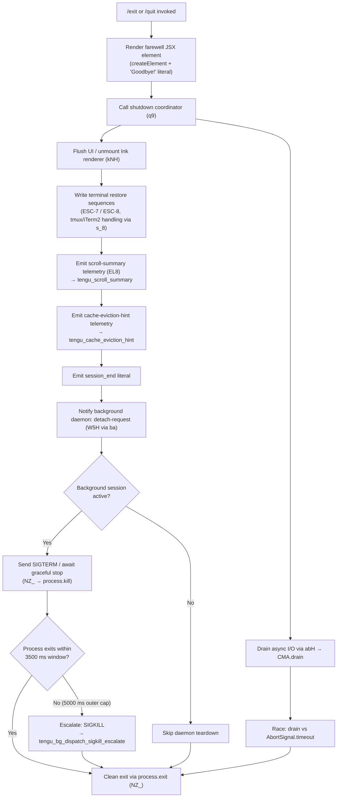

# `/exit`

> Analysis basis: CC v2.1.152 bundle.js (AST extraction + Claude interpretation)
> Minimum version: v2.1.152

---

## Overview

The `/exit` command (also aliased as `/quit`) terminates the Claude Code CLI session immediately. When invoked, it performs an orderly shutdown sequence: displaying a farewell message, flushing pending I/O and telemetry, tearing down the UI, signalling background daemon processes, and finally calling `process.exit`. The command is registered as a `local-jsx` type with `immediate: true`, meaning it executes without entering the normal agent turn cycle.

---

## Registration

| Field | Value |
|---|---|
| type | `local-jsx` |
| name | `exit` |
| description | `null` |
| aliases | `["quit"]` |
| immediate | `true` |
| module_id | `mc1` |
| load_inline | `true` |
| loc_byte | `12336301` |
| loc_byte_end | `12336462` |
| loc_line | `10295` |
| arbor_handler.name | `y45` |
| arbor_handler.fqn | `claude-2.1.152::y45` |
| arbor_handler.kind | `AsyncFunction` |
| arbor_handler.resolution_path | `module_id` |
| arbor_handler.n_hits | `1` |

Analysis basis: CC v2.1.152 bundle.js:+12336301

---

## Input Branching

The `/exit` handler (`y45`) branches across more than three distinct paths during shutdown. The primary decision tree covers: render the farewell UI element, initiate the async shutdown sequence, handle background session detach, await pending I/O drain vs. timeout, and finally execute the OS-level exit or process kill.



Analysis basis: CC v2.1.152 bundle.js:+12335550 – +12335733

---

## Behavioral Spec

### 1. Entry Point — Main Handler (`y45`)

The Arbor-resolved handler `y45` is an `AsyncFunction` reached via `module_id → mc1`.

```
async function exitCommandHandler(context):
    // 1. Render the farewell UI component
    element = createElement(InkComponent, {message: "Goodbye!"})
    renderFarewell(element)                // ke_.createElement @ +12335627

    // 2. Prepare background-task snapshot string (scheduledTaskSnapshot)
    snapshot = buildScheduledTaskSnapshot()  // _Z8 @ +12335597

    // 3. Invoke the full async shutdown sequence
    await performShutdown(snapshot)          // q9 @ +12335733

    // (control does not return — process.exit called inside performShutdown)
```

Analysis basis: CC v2.1.152 bundle.js:+12335550, +12335627, +12335720

---

### 2. Farewell Display (`k45` → `K2`)

A lightweight JSX component is created and mounted. The string literal `"Goodbye!"` (bundle.js:+12335514) is the only user-visible text emitted by the command itself before the shutdown sequence begins.

```
function renderFarewell():
    component = createFarewellComponent()   // k45 → K2 @ +12335505
    // Renders "Goodbye!" to stdout via Ink / ke_.createElement
```

Analysis basis: CC v2.1.152 bundle.js:+12335514, +12335720

---

### 3. Background-Session Snapshot (`_Z8`)

Before shutdown, the handler captures the current state of any scheduled/background tasks:

```
function buildScheduledTaskSnapshot():
    entries = []
    for each scheduledTask in taskRegistry:   // $G (pv wrapper) @ +10753828
        entry = formatTaskEntry(task)          // KQL @ +10753874
        entries.push(entry)                    // H.push @ +10753833
    trimmedOutput = truncateToTerminalWidth(entries)  // p9 @ +10753889
    return trimmedOutput
```

The label `"scheduled task"` (bundle.js:+10753847) is used when formatting task descriptions.

Analysis basis: CC v2.1.152 bundle.js:+12335597, +10753828, +10753847

---

### 4. Daemon Detach Notification (`W5H`)

The shutdown coordinator sends a `"detach-request"` message (bundle.js:+10760335) to any running background daemon:

```
function notifyDaemon():
    sendMessage(type: "detach-request")    // ba → Ca.write @ +10760326
    // Message serialised with JSON.stringify via CH @ +10588867
    // NZ1 checks daemon mode: "bg", "daemon", "daemon-worker" literals
    //   @ +2194946, +2194956, +2194970
    // If in bg/daemon mode: flushes task queue (ai6 @ +10760301)
```

Analysis basis: CC v2.1.152 bundle.js:+10760301, +10760326, +10760335

---

### 5. UI Teardown and Terminal Restore (`kNH`, `s_8`)

```
function teardownUI():
    writeSync(finalOutputBuffer)           // DwH.writeSync @ +5316314
    renderer = getActiveRenderer()         // $7.get @ +5316341
    renderer.unmount()                     // H.unmount @ +5316392
    restoreTerminalState()                 // nS @ +5316426
    writeTerminalEscapeSequences()         // s_8 @ +5316474
        // Saves/restores cursor: ESC-7 (\u001b7 @ +3705105)
        //                        ESC-8 (\u001b8 @ +3705116)
        // Handles tmux multiplexer: replaces ESC with ESC-ESC
        //   "tmux" literal @ +3360411
        // Handles screen multiplexer: "screen" @ +3360484
        // Handles Ghostty >= 1.2.0: "ghostty" @ +3436434
        // Handles iTerm.app >= 3.6.6: "iTerm.app" @ +3436503
    convertStringForTerminal(output)       // uH → String @ +5316481
```

Analysis basis: CC v2.1.152 bundle.js:+5316314, +3705105, +3360411, +3436434

---

### 6. Scroll Summary and Telemetry Flush (`EL8`, `$q`)

```
function emitScrollSummaryAndTelemetry():
    // EL8 @ +5317846
    recordTelemetryEvent("tengu_scroll_summary")   // @ +5317860
    buildDurationStats(bD9)                        // Date.now, Math.max, Math.round
    flushTelemetryQueue($q):                       // @ +5317904
        checkLocalAgent()                          // efH → LiK.has @ +839028
        emitEvent("tengu_pewter_brook")            // @ +3368797
        emitEvent("tengu_amber_creek")             // @ +3368889
        drainOutputBuffer(E6)                      // @ +3368794
    emitEvent("tengu_cache_eviction_hint")         // @ +5318893
    emitSessionEndLiteral("session_end")           // @ +5318928
```

Analysis basis: CC v2.1.152 bundle.js:+5317846, +5317860, +5318893, +5318928

---

### 7. Async I/O Drain (`abH`, `VL8`)

```
async function drainAndExit():
    // Drain buffered async I/O
    drainPromise = drainOutputQueue()        // abH → CMA.drain @ +58704

    // Parallel shutdown tasks with timeout race
    shutdownTasks = buildShutdownTaskList()  // VL8 @ +5318002
        // Promise.all + Promise.race @ +5318002, +5318117
        // Timeout sentinel: 500 ms @ +5318149

    await Promise.race([
        Promise.all(shutdownTasks),
        AbortSignal.timeout(5000)            // outer cap @ +5318819
    ])
    clearTimeout(pendingTimers)              // @ +5318754
```

Analysis basis: CC v2.1.152 bundle.js:+58704, +5318002, +5318677, +5318819

---

### 8. Final Process Termination (`NZ_`)

```
function terminateProcess():
    clearTimeout(watchdogTimer)            // @ +5316911
    renderer = $7.get()                    // @ +5316944

    if gracefulExitPossible:
        process.exit(0)                    // @ +5316992
    else:
        // Escalation path — process did not exit within window
        process.kill(pid, signal)          // @ +5317017
        // Signals used: SIGTERM @ +15384224, SIGKILL @ +15382379
        // Escalation telemetry: tengu_bg_dispatch_sigkill_escalate @ +15382331
        throw Error("unreachable")         // "unreachable" literal @ +5317065
```

Timing constants observed in the shutdown path:
- Inner drain race timeout: **500 ms** (bundle.js:+5318149)
- Graceful shutdown window: **3500 ms** (bundle.js:+5318564)
- Outer hard cap: **5000 ms** (bundle.js:+5318557)
- SIGKILL escalation wait: **2000 ms** (bundle.js:+15381957)

Analysis basis: CC v2.1.152 bundle.js:+5316911, +5316992, +5317017, +5317065

---

### 9. Startup Perf Report (conditional, `L16`)

If startup profiling was enabled, the shutdown path may flush a startup performance report before exit:

```
function maybeFlushStartupPerfReport():
    // om8 @ +212356; requires "perf_hooks" @ +211181
    if profilingEnabled:
        report = collectPerfMarks()         // Sm → require("perf_hooks")
        writeReport(dstPath)               // dWH → QqH.writeFileSync @ +183617
        emitTelemetry("tengu_startup_perf") // @ +213639
    else:
        // "Startup profiling not enabled" @ +211862
        // "No profiling checkpoints recorded" @ +211952
        skip()
```

Analysis basis: CC v2.1.152 bundle.js:+212356, +211862, +213639

---

### 10. Supervisor / Heartbeat Cleanup (`Y`)

```
function cleanupSupervisor():
    // Y @ +15396299
    rPH(supervisorHandle)                  // @ +15396299
    writeToSupervisor("supervisor")        // q.write @ +15396316
    stopHeartbeat()                        // "heartbeat" @ +15395546; JGK → se @ +15395559
    stopWatcher(T)                         // T.stop @ +15396592
    updateConfig(Z)                        // Z.updateConfig @ +15396721
    deleteManagedEntry(M)                  // M.delete @ +15396601
    emitTelemetry("tengu_daemon_config_reload") // @ +15397117
    startReplacementSession(V)             // V.start @ +15396897
```

Analysis basis: CC v2.1.152 bundle.js:+15396299, +15395546, +15397117

---

## State & Side Effects

| Item | Detail |
|---|---|
| Telemetry | `tengu_scroll_summary` (+5317860), `tengu_cache_eviction_hint` (+5318893), `tengu_pewter_brook` (+3368797), `tengu_amber_creek` (+3368889), `tengu_startup_perf` (+213639), `tengu_daemon_config_reload` (+15397117), `tengu_bg_dispatch_sigkill_escalate` (+15382331), `tengu_bg_dispatch_low_mem` (+15382910), `tengu_bg_spare_enable` (+15383605), `tengu_bg_spare_claim` (+15383726), `tengu_bg_spare_claim_fail` (+15383989), `tengu_bg_spare_spawn` (+15382024) |
| UI teardown | Ink renderer unmounted (`H.unmount`); terminal cursor save/restore escape sequences written |
| Terminal multiplexer handling | tmux, screen, Ghostty ≥ 1.2.0, iTerm.app ≥ 3.6.6 each receive adapted escape sequences |
| Daemon notification | `"detach-request"` message written to daemon channel via `Ca.write` |
| Background sessions | Receive SIGTERM; escalated to SIGKILL after 2000 ms if still running |
| appState changes | Supervisor config updated (`Z.updateConfig`); heartbeat stopped; managed entry deleted (`M.delete`) |
| Sound | <!-- TODO: not found in depth-2 traversal; needs --depth 4 --> |
| Startup perf report | Written to disk (fsync'd) if profiling was enabled; flushed via `tengu_startup_perf` |
| Process exit | `process.exit()` called unconditionally; `process.kill()` used as escalation path |
| Timeout constants | 500 ms (drain race), 3500 ms (graceful window), 5000 ms (hard cap), 2000 ms (SIGKILL escalation) |

---

## Version History

| Version | Change |
|---|---|
| v2.1.152 | Initial analysis |

---

## Common Mistakes

1. **Expecting `/exit` to return control** — because `immediate: true` is set and `process.exit()` is called unconditionally, there is no way to intercept or cancel the command once invoked; any unsaved state is lost.
2. **Confusing `/exit` with session abort** — `/exit` performs a full orderly teardown including telemetry flushing and daemon notification; it is not equivalent to sending SIGINT (Ctrl-C), which uses a different code path.
3. **Assuming `/quit` behaves differently** — `/quit` is a registered alias that maps to exactly the same handler (`y45`); the behaviour is identical.
4. **Expecting immediate termination** — the shutdown sequence has a 5000 ms outer hard cap; in degenerate conditions (slow drain, unresponsive daemon) the process may remain alive for up to 5 seconds after the command is issued.
5. **Running `/exit` inside a tmux -CC (iTerm2 integration mode) session without `CLAUDE_CODE_NO_FLICKER=1`** — the fullscreen restore path will emit a warning: `"fullscreen disabled: tmux -CC (iTerm2 integration mode) detected · set CLAUDE_CODE_NO_FLICKER=1 to override"` (bundle.js:+3368372).

---

## Appendix — Identifier Mapping

> For bundle debugging only. Identifiers change across versions.

| Identifier | Role |
|---|---|
| `y45` | Main exit command handler (AsyncFunction; Arbor-resolved via module_id `mc1`) |
| `u9` | Daemon mode checker (reads "bg" / "daemon" / "daemon-worker" literals) |
| `_OH` | Mode-string comparison helper |
| `H` | Random jitter / setTimeout wrapper (used in farewell display timing) |
| `W5H` | Daemon detach-request dispatcher |
| `ai6` | Task queue flusher (called before daemon detach) |
| `NZ1` | Daemon channel writer (checks mode, writes via `SXH` / `k8`) |
| `SXH` | Low-level channel write helper |
| `k8` | Channel send primitive |
| `ba` | JSON-serialised message writer (`Ca.write` wrapper) |
| `CH` | JSON serialiser (`JSON.stringify` wrapper) |
| `e_H` | Detach cleanup helper |
| `Uf` | Pre-exit state snapshot helper |
| `_Z8` | Scheduled-task snapshot builder |
| `$G` | Task registry accessor (`pv` wrapper) |
| `pv` | Low-level registry getter |
| `KQL` | Task entry formatter / deadline calculator |
| `TV` | Cron / schedule string parser |
| `K` | Padding / column formatter |
| `w` | Background session manager (SIGKILL escalation, freemem, spawn) |
| `L` | Async task tracker (add/delete/finally) |
| `j` | Process kill helper (iterates live processes) |
| `D` | Session disposal / cleanup coordinator |
| `$` | Socket / stream wrapper (`Sn1`) |
| `J` | UTC date arithmetic helper (schedule alignment) |
| `aN` | Schedule expression tokeniser |
| `hT7` | Schedule token parser (split, match, parseInt, Set) |
| `A` | Lowercase normaliser helper |
| `LlH` | Absolute-time resolver for schedule entries |
| `_` | Date base object |
| `O` | Date mutation target (setSeconds, setMinutes, etc.) |
| `M` | Stream pair closer (A.close, q.close) |
| `q` | Temp-file unlinker (`d0K.unlinkSync`) |
| `H9` | Integer rounding helper (Math.floor / Math.round) |
| `p9` | Terminal-width-aware string truncator |
| `e6` | Grapheme width measurer (`Bun.stringWidth`) |
| `uq` | ANSI-aware string slice helper |
| `DY` | ANSI escape stripper |
| `k45` | Farewell JSX component factory |
| `q9` | Full async shutdown coordinator |
| `kNH` | UI unmount and terminal-restore writer |
| `nS` | Terminal state restorer |
| `s_8` | Escape-sequence emitter (ESC-7/ESC-8, multiplexer-aware) |
| `QEH` | Terminal type detector (Ghostty, iTerm2 version checks) |
| `UEH` | Alternate terminal restore path |
| `lG` | tmux/screen escape-sequence transformer |
| `uH` | String coercion wrapper (`String()`) |
| `vZ_` | Scroll-summary renderer (writes dim text to stdout) |
| `_Z` | Scroll context accessor |
| `gC` | Scroll line collector |
| `y6` | Config path resolver (`pv` wrapper) |
| `mJ6` | CLAUDE.md / project-root locator |
| `oh` | Home-dir resolver |
| `z_` | CWD resolver |
| `Q6` | Path existence checker |
| `J3` | Workspace root finder |
| `I4` | Git-root detector (`tq`) |
| `uD9` | Scroll output formatter |
| `NZ_` | Final process terminator (`process.exit` / `process.kill`) |
| `abH` | Async I/O drain initiator (`CMA.drain`) |
| `Y` | Supervisor / daemon lifecycle manager |
| `rPH` | Supervisor write helper |
| `A1` | AsyncLocalStorage store accessor |
| `L8` | Logger / structured-log emitter |
| `aHA` | Supervisor message formatter |
| `GH` | String coercer for supervisor messages |
| `Ao1` | Supervisor config renderer |
| `T` | Keyboard-event watcher (stop / config update) |
| `b` | Input event target |
| `O0` | User-settings accessor |
| `Z` | Daemon process controller (stop/updateConfig/start) |
| `JGK` | Heartbeat manager |
| `se` | Heartbeat stop primitive |
| `V` | Replacement session starter |
| `c` | Generic async sleep / delay |
| `L16` | Startup performance report writer |
| `om8` | Perf-mark collector and report formatter |
| `Sm` | `require("perf_hooks")` wrapper |
| `m$A` | Startup perf file path builder and writer |
| `B$A` | Perf log filename constructor |
| `dWH` | Fsync-safe file writer |
| `C$A` | Checkpoint accumulator and formatter |
| `N` | Logger facade (debug/warn levels, JSON serialiser) |
| `EL8` | Scroll-summary telemetry emitter |
| `xD9` | Telemetry duration calculator |
| `bD9` | Session duration stats builder |
| `RD9` | Stats aggregator |
| `$q` | Telemetry batch flusher |
| `efH` | Local-agent channel checker (`LiK.has`) |
| `oO_` | Output queue drainer |
| `ri` | Telemetry record builder |
| `rO_` | Boolean flag evaluator for telemetry |
| `s_` | Session state serialiser (`sm`) |
| `X97` | Secondary telemetry event emitter |
| `E6` | Primary telemetry dispatch (MzH, TQ registry) |
| `Tq6` | Cache-eviction-hint event emitter |
| `VL8` | Parallel shutdown task runner (Promise.all / Promise.race) |
| `n8` | Timeout-with-abort-signal helper |