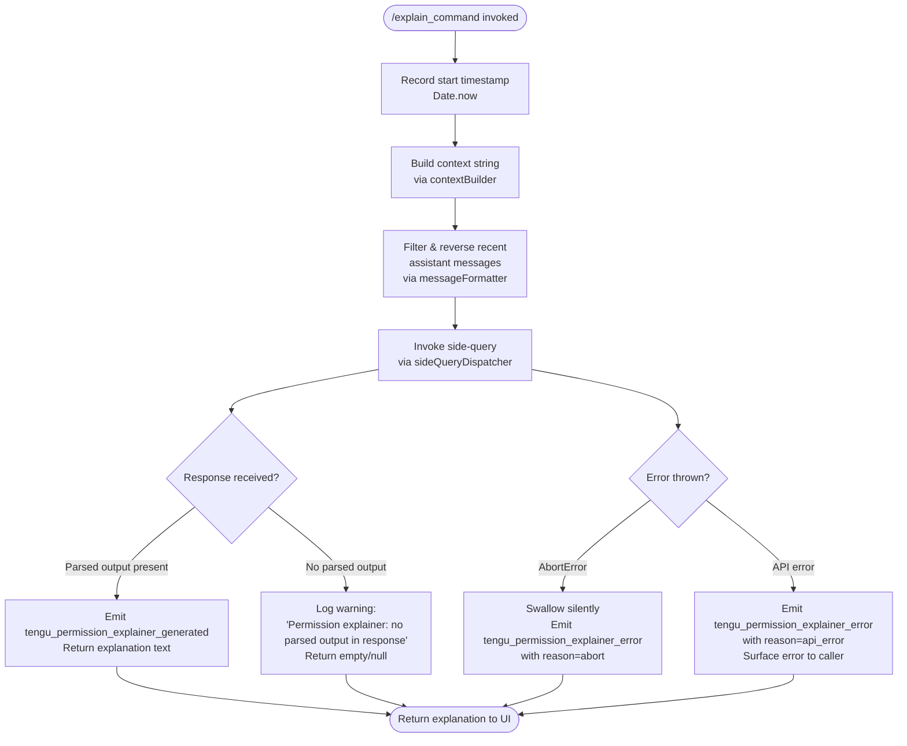

# `/explain_command`

> Analysis basis: CC v2.1.152 bundle.js (AST extraction + Claude interpretation)
> Minimum version: v2.1.152

---

## Overview

`/explain_command` is an internal **tool-type** slash command that generates a human-readable explanation for a pending permission request. It invokes an asynchronous AI sub-call (the "permission explainer") which assembles conversation context, filters and formats recent assistant messages, then dispatches a side-query to the model to produce a natural-language justification. The result is surfaced in the UI wherever a permission prompt is awaiting user approval.

---

## Registration

| Field | Value |
|---|---|
| type | `tool` |
| name | `explain_command` |
| description | `null` |
| loc_byte | `13850970` |
| loc_byte_end | `13851006` |
| loc_line | `12618` |
| arbor_handler.name | `H5K` |
| arbor_handler.fqn | `claude-2.1.152::H5K` |
| arbor_handler.kind | `AsyncFunction` |
| arbor_handler.resolution_path | `direct` |
| arbor_handler.n_hits | `1` |

Analysis basis: CC v2.1.152 bundle.js:+13850970

---

## Input Branching

The handler contains 4+ distinct execution paths (normal generation, abort/cancellation, API error, and "no parsed output" fallback), so a Mermaid flowchart is used.



Analysis basis: CC v2.1.152 bundle.js:+13850665 (H5K→x9A call), +13851503 (o9 property check), +13851555 (tengu_permission_explainer_generated), +13851665 (tengu_permission_explainer_error), +13851800 (no-parsed-output warning), +13852123 (AbortError literal), +13852194 (api_error literal)

---

## Behavioral Spec

### Handler Entry — `permissionExplainerHandler` (H5K)

```
async function permissionExplainerHandler(toolInput):
    startTime = Date.now()                        // +13850689

    contextString = buildContextString(toolInput) // calls contextBuilder (+13850710)
    formattedMessages = formatMessages(toolInput) // calls messageFormatter (+13850728)

    emit telemetry: tengu_permission_explainer_generated (on success path)

    try:
        result = await sideQueryDispatcher(       // calls sideQueryDispatcher (+13850875, +13850888)
            context = contextString,
            messages = formattedMessages,
        )

        parsed = extractParsedOutput(result)      // calls propertyChecker (+13851503)

        if parsed is null or empty:
            log warning "Permission explainer: no parsed output in response"  // +13851800
            return null

        emit telemetry: tengu_permission_explainer_generated  // +13851453
        return parsed

    catch AbortError:                             // +13852123
        emit telemetry: tengu_permission_explainer_error (reason="abort")  // +13851665
        return null

    catch APIError:                               // +13852194
        emit telemetry: tengu_permission_explainer_error (reason="api_error")  // +13851665
        raise
```

Analysis basis: CC v2.1.152 bundle.js:+13850665

---

### Context Builder — `contextBuilder` (vZ5)

```
function buildContextString(input):
    // Converts structured input to a serializable context string
    serialized = jsonStringify(input)             // calls jsonSerializer (+13850175, CH→JSON.stringify at +183087)
    return String(serialized)                     // +13850201
```

Analysis basis: CC v2.1.152 bundle.js:+13850710

---

### Message Formatter — `messageFormatter` (NZ5)

```
function formatMessages(conversationHistory):
    // Filter to assistant-role messages only
    assistantMessages = conversationHistory
        .filter(msg => msg.role === "assistant")  // literal "assistant" at +13850264
                                                  // filter call at +13850241

    // Retain only the N most recent messages
    // Reverse order for recency, then slice to limit
    recent = assistantMessages
        .reverse()                                // +13850309
        .slice(0, LIMIT)                          // +13850452; limit constant 3 at +13850284

    // Prepend a separator token for the UI
    recent.unshift("...")                         // literal "..." at +13850465; call at +13850473

    // Flatten to a single string separated by double-space
    return recent.join("  ")                      // literal "  " (two spaces) at +15406393; join call at +13850506
```

Constants:
- Message role filter: `"assistant"` (bundle.js:+13850264)
- Context window truncation after reversing: `3` most-recent messages (bundle.js:+13850284)
- Truncation ellipsis token: `"..."` (bundle.js:+13850465)
- Conversation token count ceiling before truncation: `1000` (bundle.js:+13850229)
- JSON serialisation depth: `2` (bundle.js:+13850185)

Analysis basis: CC v2.1.152 bundle.js:+13850728

---

### Side-Query Dispatcher — `sideQueryDispatcher` (g9)

```
async function sideQueryDispatcher(context, messages):
    // Build a model input representation
    inputRepresentation = buildInputRepresentation(messages)    // He (+2181969)

    // Resolve token / language-model metadata
    normalizedInput = normalizeInput(inputRepresentation)       // H1 (+2182005)

    // Execute the actual side API call
    response = await executeSideCall(normalizedInput, context)  // _X (+2182018)

    return response
```

The `sideQueryDispatcher` routes through the same API infrastructure (`lx` → `Ip`) used by the main REPL loop; it carries `"side_query"` as the call-type literal (bundle.js:+13119354).

Analysis basis: CC v2.1.152 bundle.js:+13850875

---

### Side-Call Executor — `sideCallExecutor` (lx)

```
async function sideCallExecutor(normalizedInput, context):
    // Hashes input for cache key
    cacheKey = sha256Hash(normalizedInput)                   // W_A→DHK.createHash (+13074074), "sha256" (+13074089)

    // Check for cached result
    cached = lookupCache(cacheKey)                           // hD5 (+13119506)
    if cached: return cached

    // Perform network call via main API invoker
    rawResponse = await apiInvoker(normalizedInput, context) // Ip (+13119322)

    // Normalise and validate response
    result = normalizeResponse(rawResponse)                  // mZH (+13119460), NZ (+13120229)

    // Cache the result
    storeCache(cacheKey, result)                             // implicit via hD5 path

    return result
```

Analysis basis: CC v2.1.152 bundle.js:+13850888

---

### Property Checker — `propertyChecker` (o9)

```
function extractParsedOutput(responseObject):
    // Guards that the expected output key exists on the response
    if not Object.hasOwn(responseObject, key):    // +3154552
        return null
    if responseObject[key].startsWith(prefix):    // +3154604
        // MCP tool shape — special handling
        return handleMcpTool(responseObject[key]) // "mcp_tool" literal at +3154632
    return responseObject[key]
```

Analysis basis: CC v2.1.152 bundle.js:+13851503

---

## State & Side Effects

| Item | Detail |
|---|---|
| Telemetry — success | `tengu_permission_explainer_generated` (bundle.js:+13851453, +13851555) |
| Telemetry — error | `tengu_permission_explainer_error` (bundle.js:+13851665) |
| Telemetry — infrastructure (background dispatcher) | `tengu_bg_dispatch_sigkill_escalate`, `tengu_bg_dispatch_low_mem`, `tengu_bg_spare_enable`, `tengu_bg_spare_claim`, `tengu_bg_spare_claim_fail` |
| Telemetry — OAuth path (reachable on first call) | `tengu_oauth_token_refresh_starting`, `tengu_oauth_token_refresh_race_resolved`, and 14 related OAuth events |
| Telemetry — API / config | `tengu_config_parse_error`, `tengu_api_success`, `tengu_prompt_cache_1h_config`, `tengu_feature_ok`, `tengu_feature_bad`, `tengu_feature_sad` |
| Side-query API call | Fires a lightweight model call tagged `"side_query"` (+13119354); uses full API auth pipeline including OAuth refresh and proxy auth |
| Config read | Reads configuration via the guarded config accessor (error: `"Config accessed before allowed."` at +3203397) |
| Config backup | May write a timestamped backup file via `Date.now` + `copyFileSync` (+3204518, +3204536) |
| appState changes | None observed in depth-2 traversal |
| Sound | None observed in depth-2 traversal |
| Hook registration | None directly; infrastructure uses `CMA.register` via `tq` (+58661) |

---

## Version History

| Version | Change |
|---|---|
| v2.1.152 | Initial analysis |

---

## Common Mistakes

1. **Treating `/explain_command` as a user-facing slash command**: It is registered as `type: "tool"` with a `null` description, meaning it is not listed in the user-visible command palette; it is invoked programmatically by the permission-prompt UI layer.
2. **Expecting output for every invocation**: The handler explicitly returns `null` (logging `"Permission explainer: no parsed output in response"`) when the model response lacks a parsed field — callers must handle `null` gracefully.
3. **Assuming the call is free of latency**: The command dispatches a full model API call (tagged `"side_query"`), including OAuth refresh, proxy-auth resolution, and optional cache lookup; it is **not** a local operation.
4. **Ignoring `AbortError`**: If the parent permission prompt is dismissed before the side-query completes, an `AbortError` is silently swallowed and `null` is returned — callers must not treat `null` as an indication of an explanation being unavailable permanently.
5. **Confusing message truncation limit**: Only the `3` most-recent `"assistant"` messages (after reversing) are forwarded to the model (+13850284); older context is intentionally dropped.

---

## Appendix — Identifier Mapping

> For bundle debugging only. Identifiers change across versions.

| Identifier | Role |
|---|---|
| `H5K` | Main async handler for `explain_command` (permissionExplainerHandler) |
| `x9A` | Config/context loader called at handler entry |
| `x6` | Configuration accessor (guarded; raises if accessed too early) |
| `Q6` | Configuration getter utility |
| `N$_` | Configuration namespace resolver |
| `zzH` | Configuration file reader (reads UTF-8, handles ENOENT, writes backups) |
| `B6` | JSON parser wrapper |
| `Mb` | String prefix stripper |
| `L8` | Logger or secondary config utility |
| `zpq` | Directory walker / backup path resolver |
| `R$_` | Backup directory path builder |
| `N` | Language-model type normaliser |
| `c` | Logging sink / error reporter |
| `w` | Background daemon session manager |
| `C_7` | File-watch registration helper |
| `xi` | File-watch event handler |
| `tq` | Hook/listener registrar (calls CMA.register) |
| `vZ5` | Context-string builder (contextBuilder) |
| `CH` | JSON serialiser wrapper |
| `NZ5` | Message formatter (filters, reverses, slices, joins assistant messages) |
| `H` | Random/timer utility (Math.random + setTimeout) |
| `A` | Case-normalisation utility (toLowerCase) |
| `M` | Stream/connection manager |
| `L` | Promise-tracking set manager |
| `g9` | Side-query dispatcher (sideQueryDispatcher) |
| `He` | Input representation builder |
| `Uv` | Sub-component of input builder |
| `hqH` | Sub-component of input builder |
| `lg` | Token/model metadata resolver |
| `f` | Model registry lookup helper |
| `K` | String padding utility |
| `On6` | Object-entries iterator |
| `KBH` | Model family inclusion checker |
| `RMq` | Model index finder |
| `ER4` | Model string inclusion checker |
| `L1H` | Known-model-list checker |
| `H1` | Model name normaliser (trim, toLowerCase, replace) |
| `VR4` | Model variant resolver |
| `_X` | Side-call executor wrapper |
| `H0` | API request builder |
| `TA` | Auth token resolver |
| `Ke` | Plan-type resolver (max plan) |
| `e$H` | Plan-type resolver (team/default_claude_max_5x) |
| `fBH` | Plan-type resolver (enterprise) |
| `PZ` | Provider resolver |
| `VP` | First-party API caller |
| `u3` | Provider-type classifier (anthropicAws / gateway) |
| `yA` | Provider base-URL builder |
| `K3` | Provider config assembler |
| `JN` | Provider+config combiner |
| `lx` | Side-call executor (sideCallExecutor) |
| `Ip` | Main API invoker |
| `rD` | Async-local-store getter |
| `va4` | URL parser |
| `u9` | App-type resolver (_OH) |
| `_OH` | App-type constants (bg/daemon/cli) |
| `ki` | Session-id injector |
| `Fi6` | Session store getter (pMq.getStore) |
| `y6` | Version reporter (pv) |
| `pv` | Version string source |
| `tA_` | URL encoder for headers |
| `uH` | String coercer |
| `jO` | OAuth flow orchestrator |
| `mM_` | OAuth token refresh logic (lock acquire/release, retry) |
| `UMq` | Boolean coercer for auth flags |
| `sD` | API request dispatcher |
| `A4` | Request metadata builder |
| `VN` | Request-variant resolver |
| `gO` | Request helper |
| `QJ` | Request queue manager |
| `JO` | HTTP request executor |
| `o1H` | Error-response handler |
| `C$` | Context-state accessor |
| `Ea4` | Request finaliser |
| `dFH` | Request-timing recorder |
| `h_` | Abort-signal helper |
| `qd6` | Proxy-auth helper dispatcher |
| `pGH` | Proxy-auth header builder |
| `JlA` | Proxy-auth fallback builder |
| `tj4` | Integer timeout parser |
| `uk` | URL utility |
| `YP` | Trust-accepted checker (a0H) |
| `ka4` | Request stream manager |
| `sL` | Stream-state logger |
| `ya4` | Header-sanitiser (redacts authorization, anthropic-beta) |
| `Ia4` | Stream event emitter |
| `ZM_` | Max-value clamper |
| `Na4` | Stream read loop (ReadableStream reader, watchdog timers) |
| `nD` | Provider-type discriminator |
| `Mn6` | Provider-type builder |
| `dk4` | Prefix-based provider matcher |
| `Ln6` | Case-insensitive enum resolver |
| `yz` | Proxy resolver |
| `mg` | URL classifier (https/port/path) |
| `emH` | Proxy credential resolver |
| `XlA` | Proxy environment variable reader |
| `ot8` | IP-address / hostname validator |
| `tt8` | URL scheme constant holder |
| `Va4` | Bedrock/Vertex credential helper |
| `tt6` | Region/endpoint resolver |
| `Bv` | Credential cache |
| `ebH` | Credential expiry checker |
| `kWH` | AWS-region finder (DNK.find) |
| `Cq` | OAuth endpoint validator (staging/prod/custom) |
| `LOH` | Gateway JWT refresh dispatcher |
| `Zx8` | Gateway JWT cache reader |
| `ZC4` | Gateway JWT HTTP caller |
| `zR6` | Gateway JWT cache writer |
| `Tx8` | Timestamp helper (Date.now) |
| `N$6` | Header lowercaser |
| `rOH` | Anthropic SDK error logger |
| `R` | Supervisor file-watch / mtime monitor |
| `WGK` | Realpath + stat resolver |
| `Tz` | Supervisor state tracker |
| `hH` | Error logger with push (YmH.push + Cn.logError) |
| `Wx5` | Supervisor key builder (kP8) |
| `z` | Daemon control socket writer |
| `h` | Away-summary trigger (blurred/focused) |
| `yQ` | Away-summary gate (checks cache age, rate-limit state) |
| `I` | Away-summary generator |
| `V` | Message-queue flusher |
| `M$K` | Away-summary cache writer |
| `Z` | Away-summary stream controller |
| `d2` | HTTP request helper (JO path) |
| `GBH` | WIF token-exchange dispatcher |
| `Wr6` | WIF credential fetcher (fetch + AbortSignal.timeout) |
| `SH` | Feature-flag OK reporter (tengu_feature_ok) |
| `mH` | Feature-flag BAD reporter (tengu_feature_bad) |
| `NC4` | WIF inclusion checker |
| `T` | Remote-control input handler |
| `b` | Remote-control event emitter |
| `O0` | User-settings accessor (l_) |
| `Y` | Terminal session manager (start/stop/updateConfig) |
| `X` | IPC socket reader (Buffer.concat) |
| `J` | IPC socket reference |
| `ZM` | IPC socket framer (H.end + CH) |
| `Hx5` | Daemon IPC message router (ping/nudge/dispatch/kill/resize/attach) |
| `_x5` | IPC sub-router |
| `$` | IPC socket write target |
| `cO` | Background-service error wrapper (fzH) |
| `n4A` | IPC rate-limiter |
| `r0K` | IPC retry scheduler |
| `n8` | Async lock / mutex |
| `P` | Terminal repaint orchestrator |
| `oW` | Working-directory resolver (WmH.join) |
| `x3` | Real-path normaliser (gm.realpath) |
| `Y3H` | File-line reader (ITA.createInterface) |
| `tb5` | Stall detector (E6 + Math.max) |
| `m` | Timeout-flush writer |
| `e_H` | IPC event handler |
| `uK` | Path joiner (FP.join) |
| `eb5` | Worker lifecycle manager (kill/phase/respawn) |
| `o` | Voice toggle silence timeout watcher |
| `x` | Focus silence timeout watcher |
| `t` | Focus silence timeout watcher (variant) |
| `W` | Push accumulator (_L) |
| `B` | MCP tool-use filter (F6.filter + gH.has) |
| `g` | Combined B+$ helper |
| `l` | Event filter (e.filter) |
| `r` | Stream pipe (w + d) |
| `d` | rk8 stream helper |
| `Jh6` | IPC snapshot writer (H.destroy + H.write) |
| `G` | Terminal repaint (iE6 + IR8) |
| `GH` | String coercer (String) |
| `mZH` | Response normaliser (P9 + nD + hS) |
| `P9` | Model output parser (On6 + rj + vP) |
| `rj` | Model-name replacer (toLowerCase + includes + replace) |
| `Au8` | Model output sub-parser |
| `vP` | Model output string replacer |
| `hS` | Provider-type helper (yA) |
| `hD5` | Cache lookup (H.find + A.find) |
| `W_A` | SHA-256 hash builder (DHK.createHash) |
| `Qi6` | Response validator (qK + yA + Fi6 + N) |
| `qK` | String key coercer |
| `x68` | Response post-processor (yA) |
| `OIH` | Prompt-cache configuration builder (repl_main_thread, auto_mode, memdir_relevance) |
| `tx8` | Prompt-cache sub-builder |
| `E6` | Tool-registry cache manager (hO6 + SO6 + oe + P68) |
| `hO6` | Tool-registry entry reader |
| `SO6` | Tool-registry entry writer |
| `oe` | Tool-registry entry validator (uH + Qb) |
| `P68` | Tool-registry dedup guard (O$_.has/add + MzH.get + $$_ + w$_) |
| `ex8` | Tool-registry extended checker |
| `NZ` | Response shape normaliser (kM_ + uZH) |
| `kM_` | Response field mapper (yA) |
| `uZH` | HIPAA-flag injector (uH + jMq) |
| `jMq` | BA_ array inclusion checker |
| `gHK` | Response metadata helper |
| `$e6` | Model-output temperature handler (be + P9) |
| `ZP` | Message-array mapper |
| `GYH` | Response array dispatcher (V9 + Array.isArray + N + CH + Sp + B5 + y6) |
| `Sp` | Sub-process spawner (x6 + Ypq.randomBytes + M8) |
| `M8` | Config writer / global-config saver |
| `B5` | API-call brancher (sD + x6) |
| `MfH` | Metrics / timing helper |
| `Lj6` | Agent-type router (T79 + Kj6) |
| `T79` | Agent builtin/custom resolver (GV7 + hH) |
| `GV7` | Agent registry lookup (W79.has + xK + P48.has) |
| `Kj6` | Agent fallback router |
| `Rd` | Agent-name dispatcher (WV7 + O6H + hH) |
| `WV7` | Agent name parser (startsWith + slice + X48 + s2_) |
| `X48` | Agent name slice helper (s2_) |
| `s2_` | String index/slice utility |
| `O6H` | Agent name prefix matcher (startsWith) |
| `Eq6` | Side-query completion handler |
| `o9` | Parsed-output property checker (Object.hasOwn + startsWith) |
| `H8` | Feature-flag SAD reporter (tengu_feature_sad) |