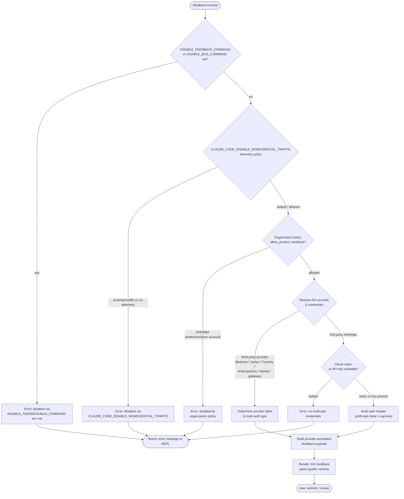

```markdown
---
type: feature-spec
feature: "feedback"
cc_version: "2.1.152"
updated: "2026-06-02"
tags: ["feedback", "commands", "slash-commands"]
source: "bundle-analysis"
bundle_verified: true
inherited_from: "2.1.149"
analysis_basis: "CC v2.1.149 bundle.js (AST extraction + Claude interpretation)"
author: "ryujaeuk <ryujaeuk@gmail.com>"
repository: "https://github.com/MyLittleLuckyDog/cc-gnothi"
license: "AGPL-3.0-only"
---

# `/feedback`

> Analysis basis: CC v2.1.149 bundle.js (AST extraction + Claude interpretation)
> Minimum version: v2.1.149

---

## Overview

The `/feedback` command (also reachable via `/share` and `/bug`) opens an interactive JSX-rendered panel that lets the user submit product feedback, file a bug report, or share a conversation with Anthropic. Before presenting the panel, the command runs a multi-step eligibility gate that checks environment variables, telemetry policy, organization policy, and the active API provider; if any gate fails it renders an error message and aborts.

---

## Registration

| Field | Value |
|---|---|
| type | `local-jsx` |
| name | `feedback` |
| description | `Submit feedback, report a bug, or share your conversation` |
| aliases | `["share", "bug"]` |
| argumentHint | `[report]` |
| module_id | `y21` |
| load_inline | `true` |
| loc_byte | `10649508` |
| loc_byte_end | `10649731` |
| loc_line | `8369` |
| arbor_handler.name | `DuL` |
| arbor_handler.fqn | `claude-2.1.149::DuL` |
| arbor_handler.kind | `AsyncFunction` |
| arbor_handler.resolution_path | `module_id` |
| arbor_handler.n_hits | `0` |

Analysis basis: CC v2.1.149 bundle.js:+10649508

---

## Input Branching

The command contains 5+ distinct gate branches before rendering its UI, so a Mermaid flowchart is used.



---

## Behavioral Spec

### Top-level async handler (`DuL`)

The Arbor-resolved async handler (`DuL`) is the true entry point for the command.
It calls the JSX component factory (`k21`) and returns its result to the CLI runtime.

```
async function feedbackCommandHandler(context):
    component = buildFeedbackComponent(context)
    return component
```

Analysis basis: CC v2.1.149 bundle.js:+10649339

---

### JSX component factory (`k21`)

`k21` is the component factory function. It orchestrates all eligibility checks and,
when they pass, returns the rendered feedback panel.

```
function buildFeedbackComponent(context):
    // --- Gate 1: env-var kill switches ---
    disableStatus = checkDisabledEnvVars(context)   // → Xd_
    if disableStatus == "disabled":
        if DISABLE_FEEDBACK_COMMAND set:
            return errorMessage("/feedback has been disabled via the DISABLE_FEEDBACK_COMMAND ...")
        if DISABLE_BUG_COMMAND set:
            return errorMessage("/feedback has been disabled via the DISABLE_BUG_COMMAND ...")

    // --- Gate 2: telemetry / non-essential traffic policy ---
    trafficPolicy = resolveTrafficPolicy(context)   // → G1 → Z2A
    if trafficPolicy in ["essential-traffic", "no-telemetry"]:
        return errorMessage("/feedback has been disabled via the CLAUDE_CODE_DISABLE_NONESSENTIAL_TRAFFIC ...")

    // --- Gate 3: organization policy ---
    orgAllowed = checkOrgFeedbackPolicy(context)    // → k1
    if NOT orgAllowed:
        return errorMessage("/feedback has been disabled by your organization's policy")

    // --- Gate 4: provider detection ---
    providerInfo = resolveProvider(context)         // → RA
    providerLabel = mapProviderLabel(providerInfo.type)
    // Labels: "Amazon Bedrock", "Vertex AI", "Microsoft Foundry",
    //         "Claude Platform on AWS", "Amazon Bedrock (Mantle)",
    //         "an API gateway"

    // --- Gate 5: credential check (first-party only) ---
    if providerInfo.type == "firstParty":
        authHeader = buildAuthHeader(context)       // → fp
        if authHeader == null:
            return errorMessage("no Anthropic credentials")

    // --- Build submission payload ---
    sessionId = generateSessionId()                 // → I21, uses Date.now + 30000 timeout
    randomSuffix = generateRandom()                 // → H, uses Math.random + setTimeout(_, 2)
    payload = {
        variant: "public",
        method: "post",
        provider: providerLabel,
        bundle: "bundle",
        ...authHeader
    }

    // --- Render panel ---
    return createElement(FeedbackPanel, payload)    // → Vd_.createElement
```

Analysis basis: CC v2.1.149 bundle.js:+10649041

---

### Environment-variable gate (`Xd_`)

Checks both `DISABLE_FEEDBACK_COMMAND` and `DISABLE_BUG_COMMAND` environment variables.
If either is set, the string `"disabled"` is produced and the component short-circuits.

```
function checkDisabledEnvVars(context):
    if env["DISABLE_FEEDBACK_COMMAND"] is set:
        return "disabled"   // literal "disabled" at bundle.js:+10627614
    if env["DISABLE_BUG_COMMAND"] is set:
        return "disabled"
    return null
```

Disabled message (FEEDBACK path): `"/feedback has been disabled via the DISABLE_FEEDBACK_COMMAND environment variable"` (bundle.js:+10627632)
Disabled message (BUG path): `"/feedback has been disabled via the DISABLE_BUG_COMMAND environment variable"` (bundle.js:+10627786)

Analysis basis: CC v2.1.149 bundle.js:+10627561

---

### Telemetry / non-essential traffic policy gate (`G1` → `Z2A`)

Reads the current telemetry policy. Three policy strings are recognised:

| Policy value | Effect |
|---|---|
| `"essential-traffic"` | Feedback disabled |
| `"no-telemetry"` | Feedback disabled |
| `"default"` | Feedback allowed |

Disabled message: `"/feedback has been disabled via the CLAUDE_CODE_DISABLE_NONESSENTIAL_TRAFFIC environment variable"` (bundle.js:+10627904)

```
function resolveTrafficPolicy(context):
    raw = readTelemetrySetting()   // → Z2A → mH
    return raw   // one of "essential-traffic", "no-telemetry", "default"
```

Analysis basis: CC v2.1.149 bundle.js:+10627869

---

### Organization policy gate (`k1`)

For enterprise or team accounts, checks the `allow_product_feedback` policy flag.

```
function checkOrgFeedbackPolicy(context):
    accountType = getAccountType(context)   // → cb → RA
    if accountType in ["enterprise", "team"]:
        policy = getPolicyFlag("allow_product_feedback", context)  // → LX7.has, G1
        if NOT policy:
            return false
    return true   // non-enterprise accounts always pass
```

Policy key literal: `"allow_product_feedback"` (bundle.js:+4685131)
Account type literals: `"enterprise"` (bundle.js:+4681798), `"team"` (bundle.js:+4681833)

Analysis basis: CC v2.1.149 bundle.js:+10628009

---

### Provider detection and label mapping (`RA`)

Identifies the active API provider and maps it to a human-readable label for inclusion in the feedback payload.

```
function mapProviderLabel(providerType):
    switch providerType:
        case "bedrock"      → "Amazon Bedrock"
        case "vertex"       → "Vertex AI"
        case "foundry"      → "Microsoft Foundry"
        case "anthropicAws" → "Claude Platform on AWS"
        case "mantle"       → "Amazon Bedrock (Mantle)"
        case "gateway"      → "an API gateway"
        case "firstParty"   → (no label override; proceed to credential check)
```

Provider literals: bundle.js:+10628200, +10628275, +10628346, +10628430, +10628513, +10628598

Analysis basis: CC v2.1.149 bundle.js:+10628136

---

### Auth header builder (`fp`)

Constructs the HTTP authentication header to be included in the feedback submission request.

```
function buildAuthHeader(context):
    if providerType != "firstParty":
        // "Anthropic auth not used on third-party providers" (bundle.js:+2965042)
        return null

    if cloudGatewayInUse:
        // "Not available when using a Cloud gateway" (bundle.js:+2965307)
        return null

    token = getOAuthToken(context)   // → tt → yO
    if token:
        return { "anthropic-beta": token }   // header literal bundle.js:+2965241

    apiKey = getApiKey(context)      // → Rj → e$
    if apiKey:
        return { "x-api-key": apiKey }       // header literal bundle.js:+2965432

    // Neither credential available
    return NO_CREDS   // "no_creds" bundle.js:+10628675
```

Error strings:
- `"No OAuth token available"` (bundle.js:+2965157)
- `"No API key available"` (bundle.js:+2965392)
- `"no Anthropic credentials"` (bundle.js:+10628692)
- Submission method: `"post"` (bundle.js:+10628732)

Analysis basis: CC v2.1.149 bundle.js:+10628637

---

### Session-ID generation (`I21`)

Produces a time-based session identifier for the feedback submission with a 30 000 ms timeout window.

```
function generateSessionId():
    base = Date.now()          // bundle.js:+10648878
    timeout = 30000            // ms, bundle.js:+10648897
    return deriveId(base, timeout)
```

Analysis basis: CC v2.1.149 bundle.js:+10649100

---

### Random suffix / nonce (`H`)

Generates a random component for the feedback submission token.

```
function generateRandom():
    value = Math.random()      // bundle.js:+13290020
    setTimeout(callback, 2)    // 2 ms debounce, bundle.js:+13290018 / +13290057
    return value
```

Analysis basis: CC v2.1.149 bundle.js:+10649077

---

### API key resolution (`e$`)

Resolves the Anthropic API key from environment or configuration.

```
function resolveApiKey(context):
    key = env["ANTHROPIC_API_KEY"]          // literal bundle.js:+2933563
    helper = config["apiKeyHelper"]         // literal bundle.js:+2933657
    if key == "none":                       // literal bundle.js:+2933696
        return null
    if NOT key AND NOT helper:
        throw Error("ANTHROPIC_API_KEY or CLAUDE_CODE_OAUTH_TOKEN env var is required")
                                            // bundle.js:+2933984
    return resolveViaHelper(helper) OR key
```

Analysis basis: CC v2.1.149 bundle.js:+2933476

---

## State & Side Effects

| Item | Detail |
|---|---|
| Telemetry | No `tengu_*` events found in depth-2 traversal <!-- TODO: not found in depth-2 traversal; needs --depth 4 --> |
| Hook registration | None detected at depth ≤ 2 |
| appState changes | None detected at depth ≤ 2 |
| Sound | None detected at depth ≤ 2 |
| Environment reads | `DISABLE_FEEDBACK_COMMAND`, `DISABLE_BUG_COMMAND`, `CLAUDE_CODE_DISABLE_NONESSENTIAL_TRAFFIC`, `ANTHROPIC_API_KEY`, OAuth token store |
| Network | HTTP `POST` to Anthropic feedback endpoint when all gates pass (bundle.js:+10628732) |
| Render variant | `"public"` JSX panel (bundle.js:+10649314) |
| Submission timeout | 30 000 ms (bundle.js:+10648897) |

---

## Version History

| Version | Change |
|---|---|
| v2.1.149 | Initial analysis |

---

## Common Mistakes

1. **Expecting `/bug` or `/share` to behave differently** — both are aliases of `/feedback` and run identical logic; there is no separate implementation per alias.
2. **Assuming feedback works on third-party providers** — when using Amazon Bedrock, Vertex AI, Microsoft Foundry, Mantle, Claude Platform on AWS, or a generic API gateway, Anthropic credentials are not used and the provider label is injected into the payload; however, if no first-party credentials are present at all the command returns a "no Anthropic credentials" error rather than opening the panel.
3. **Ignoring the organization policy gate** — enterprise and team accounts with `allow_product_feedback` disabled will receive a policy-blocked error even if all environment variables are unset.
4. **Setting `DISABLE_BUG_COMMAND` and expecting `/feedback` to still work** — the `/bug` alias shares the same kill-switch check; setting `DISABLE_BUG_COMMAND` blocks `/feedback` and `/share` as well because they all invoke the same handler.
5. **Expecting telemetry events** — no `tengu_*` telemetry events are emitted by this command at the depth analysed; callers should not rely on telemetry firing to confirm submission.

---

## Appendix — Identifier Mapping

> For bundle debugging only. Identifiers change across versions.

| Identifier | Role |
|---|---|
| `DuL` | Top-level async command handler (Arbor-resolved entry point) |
| `k21` | JSX component factory; orchestrates all eligibility gates and renders panel |
| `Xd_` | Environment-variable disable gate (`DISABLE_FEEDBACK_COMMAND` / `DISABLE_BUG_COMMAND`) |
| `mH` | String utility / normaliser (shared helper) |
| `G1` | Telemetry / traffic-policy reader |
| `Z2A` | Raw telemetry-policy resolver (called by `G1`) |
| `k1` | Organization policy gate (`allow_product_feedback`) |
| `p8q` | Policy flag lookup helper |
| `_q8` | Inner policy predicate |
| `cb` | Account-type resolver |
| `RA` | API provider type detector |
| `w5` | Account metadata helper |
| `e$` | API key resolver (`ANTHROPIC_API_KEY` / `apiKeyHelper`) |
| `X1H` | Supplementary string helper used by org-policy path |
| `fp` | Auth header builder (OAuth token vs. API key selection) |
| `tt` | OAuth token fetch coordinator |
| `yO` | OAuth token accessor |
| `EA` | Credential-availability checker |
| `dD` | Credential detail extractor |
| `oC` | Array-based provider/type inclusion check |
| `Rj` | API key fetch coordinator |
| `H` | Random nonce generator (uses `Math.random` + `setTimeout`) |
| `I21` | Session-ID generator (uses `Date.now` + 30 000 ms window) |
```