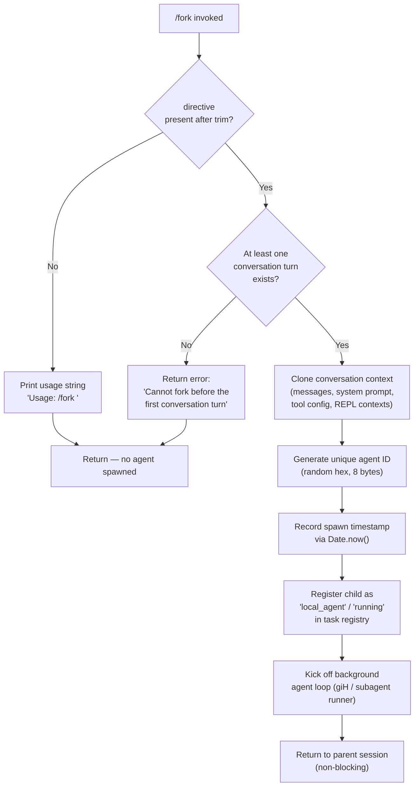

# `/fork`

> Analysis basis: CC v2.1.152 bundle.js (AST extraction + Claude interpretation)
> Minimum version: v2.1.152

---

## Overview

`/fork` spawns a background agent that inherits the full current conversation context, then independently pursues a user-supplied directive. The parent session continues normally while the child agent runs asynchronously; the child cannot fork until at least one conversation turn has occurred.

---

## Registration

| Field | Value |
|---|---|
| type | `local-jsx` |
| name | `fork` |
| description | Spawn a background agent that inherits the full conversation |
| argumentHint | `<directive>` |
| loc_byte | `12742580` |
| loc_byte_end | `12742776` |
| loc_line | `11052` |
| module_id | `Is1` |
| load_inline | `true` |
| arbor_handler.name | `Q$5` |
| arbor_handler.fqn | `claude-2.1.152::Q$5` |
| arbor_handler.kind | `AsyncFunction` |
| arbor_handler.resolution_path | `module_id` |
| arbor_handler.n_hits | `0` |

Analysis basis: CC v2.1.152 bundle.js:+12742580

---

## Input Branching

Three distinct cases exist (no directive supplied, directive supplied before any turn, directive supplied after at least one turn), so a Mermaid flowchart is used.



Analysis basis: CC v2.1.152 bundle.js:+12742184 (trim check), +12742317 (pre-turn guard), +12742206 (random-ID helper), +10689444 (Date.now timestamp)

---

## Behavioral Spec

### 1. Handler Entry — `forkCommandHandler` (`Q$5`)

```
async function forkCommandHandler(input):
    directive = input.trim()                        // bundle.js:+12742184

    if directive is empty:
        print "Usage: /fork <directive>"            // bundle.js:+12742208
        return

    conversationHistory = getConversationHistory()
    if conversationHistory has no turns:
        return error "Cannot fork before the first conversation turn"
                                                    // bundle.js:+12742317

    agentId = generateAgentId()                     // calls randomIdHelper (H)
    context = buildForkContext(conversationHistory, agentId)
    launchSubagent(context, directive)              // calls subagentLauncher (An_)
```

Analysis basis: CC v2.1.152 bundle.js:+12742184

### 2. Random-ID Generation — `randomIdHelper` (`H`)

```
function generateAgentId():
    // Uses Math.random + setTimeout scheduling internally
    bytes = crypto.randomBytes(8)                  // bundle.js:+6629099 (8 bytes, hex)
    return bytes.toString("hex")
```

Analysis basis: CC v2.1.152 bundle.js:+12742206, +6629083, +6629099

### 3. Fork Context Builder — `subagentLauncher` (`An_`)

The launcher is the primary orchestrator. It:

1. **Collects system prompt** via `buildSystemPrompt` (`cFL` → `GT` → `Ru`).  
   - Includes env info, tool descriptions, memory prompts, language/output-style settings.  
   - Inherits `allowed_tools` / `disallowed_tools` / `avoid_prompts` from parent session state.  
   Analysis basis: CC v2.1.152 bundle.js:+10689115, +10666341, +10666396

2. **Clones REPL contexts** (`_.getReplContexts`) and trims them to a message-slice suitable for a forked child (slice offset limited by literals 50 / 49).  
   Analysis basis: CC v2.1.152 bundle.js:+10689242, +10689387, +10689390, +10689400

3. **Assigns a session identity** using `crypto.randomBytes` (8 bytes → hex string "fork" label).  
   Analysis basis: CC v2.1.152 bundle.js:+10689417, +10689202

4. **Sets session type to `"fork"`** in agent metadata; parent label becomes `"resume"`.  
   Analysis basis: CC v2.1.152 bundle.js:+10689202, +10689321

5. **Creates a worktree-path record** (`rtH` → `WhH`): makes directory, creates symlink, opens log file.  
   Analysis basis: CC v2.1.152 bundle.js:+10238791, +12917976

6. **Registers the new agent** in the task registry (`K.register`) with status `"local_agent"` / `"running"`.  
   Analysis basis: CC v2.1.152 bundle.js:+10239149, +10238838, +10238883

7. **Launches the main agent loop** (`giH`) and pipes events back.  
   Analysis basis: CC v2.1.152 bundle.js:+10689961

```
async function subagentLauncher(history, directive, agentId):
    systemPrompt = buildSystemPrompt(parentAppState)
    replContexts  = getReplContexts()
    slicedHistory = sliceHistory(history, offset=50..49)

    metadata = {
        id:           agentId,
        type:         "fork",
        parentLabel:  "resume",
        spawnedAt:    Date.now(),
        status:       "running",
        kind:         "local_agent",
    }

    worktreePath = setupWorktree(agentId)           // mkdir + symlink + open log
    register(metadata)                              // task registry

    agentLoop = startAgentLoop({
        systemPrompt, replContexts, slicedHistory,
        directive, worktreePath, agentId
    })

    return agentLoop                                // non-blocking to caller
```

Analysis basis: CC v2.1.152 bundle.js:+10689115 through +10690019

### 4. System Prompt Assembly — `buildSystemPrompt` (`cFL`)

```
function buildSystemPrompt(appState):
    baseConfig   = getAppState()                    // V_ / uT8 / mT8
    toolSection  = buildToolDescriptions(oW8)       // Object.values + map
    memoryPrompt = buildMemoryPrompt(aO6)           // team memory + CLAUDE.md
    envSection   = buildEnvInfo(GT)                 // env_info_static / env_info_simple

    parts = [baseConfig, toolSection, memoryPrompt, envSection,
             languageSection, outputStyleSection, contextMgmtSection]
    return join(parts, role="system")               // bundle.js:+12742248
```

Key literals used in prompt assembly:

- Role label: `"system"` (bundle.js:+12742248)
- Background-session tag: `"bg-session"` (bundle.js:+13054192)
- Output style options: `"off"` / `"additive"` / `"compact"` (bundle.js:+13062770, +13062831, +13062847)
- Context management key: `"context_management"` (bundle.js:+13054246)
- Brief mode key: `"brief"` (bundle.js:+13054285)
- Worktree notice literal begins with `"This is a git worktree —…"` (bundle.js:+13055875)
- Agent absolute-path reminder: `"- Agent threads always have their cwd reset…"` (bundle.js:+13059449)

Analysis basis: CC v2.1.152 bundle.js:+10690686, +10690786, +10690797, +10690848

### 5. Background Agent Loop — `agentRunner` (`giH`)

The loop runs in the child process/thread:

```
async function agentRunner(config):
    // Timeout constants: 10 iterations × 600 000 ms (bundle.js:+6711754, +6711759)
    stallTimeout = 600_000   // 10-minute stall detection window

    loop:
        events = await streamNextTurn(config)

        for event in events:
            if event.type == "subagent_complete":           // bundle.js:+6712887
                emit telemetry("subagent_complete")
                break loop

            if event.type == "watchdog_stall":             // bundle.js:+6712245
                emit telemetry("tengu_async_agent_stall_timeout")
                break loop

            if event.type == "api_error":                  // bundle.js:+6713749
                emit error event; break loop

            if event.type == "cancelled" or user_kill:     // bundle.js:+6714554
                emit telemetry("tengu_agent_tool_terminated")
                break loop

            dispatch(event)

        updateTaskRegistry(status="completed" | "failed")
    
    cleanup(worktreePath)
```

Stall-timeout telemetry event: `tengu_async_agent_stall_timeout`  
Analysis basis: CC v2.1.152 bundle.js:+6711754, +6711759, +6712245, +6712650, +6712887, +6713749

### 6. Worktree / Log-File Setup — `worktreeSetup` (`WhH`)

```
function setupWorktree(agentId):
    dir = path.join(subagentsDir, agentId)
    fs.mkdir(dir, {recursive: true})               // bundle.js:+12915711, +12918013
    // Errors EEXIST silently ignored
    // ENOSPC / EDQUOT propagated (bundle.js:+12918160, +12918174)

    logPath = path.join(dir, "session.log")
    fd = fs.open(logPath, flags)                   // bundle.js:+12917854
    fs.symlink(dir, latestLink)                    // EEXIST tolerated

    return { dir, fd }
```

Analysis basis: CC v2.1.152 bundle.js:+12918029, +12918065, +12918160, +12918174

---

## State & Side Effects

| Item | Detail |
|---|---|
| Telemetry — fork lifecycle | `tengu_async_agent_stall_timeout` (stall guard, bundle.js:+6712650) |
| Telemetry — agent completion | `tengu_agent_tool_completed` (bundle.js:+6708749) |
| Telemetry — agent terminated | `tengu_agent_tool_terminated` (bundle.js:+6714578) |
| Telemetry — system-prompt build | `tengu_sparrow_ledger`, `tengu_verified_vs_assumed`, `tengu_moth_copse`, `tengu_memdir_disabled`, `tengu_herring_clock`, `tengu_team_memdir_disabled` |
| Telemetry — background dispatch | `tengu_bg_spare_spawn`, `tengu_bg_dispatch_sigkill_escalate`, `tengu_bg_dispatch_low_mem` |
| Telemetry — subagent runner | `tengu_forked_agent_default_turns_exceeded`, `tengu_auto_mode_decision` |
| Task registry | New entry inserted with `kind="local_agent"`, `status="running"`, updated to `"completed"` or `"failed"` on exit |
| File system | Creates subdirectory under `subagents/` path; creates log file; creates symlink `latest → agentId`; unlinks on cleanup |
| appState changes | Parent session appState unchanged; child inherits a deep-clone snapshot at fork time |
| Abort / cleanup | Child registers an `AbortController`; on parent abort the child receives SIGKILL escalation |
| Hook registration | `K.register` adds task entry; `K.register` fires downstream task-notification hooks |
| Sound | None detected in depth-2 traversal |

---

## Version History

| Version | Change |
|---|---|
| v2.1.152 | Initial analysis |

---

## Common Mistakes

1. **Forking before the first turn** — `/fork` issued immediately on session start will return the error `"Cannot fork before the first conversation turn"` (bundle.js:+12742317). Send at least one message first.
2. **Omitting the directive** — `/fork` with no argument prints the usage hint and returns silently without spawning anything (bundle.js:+12742208).
3. **Expecting synchronous output** — The forked agent runs as a background task; its output does not appear inline. Monitor it via the task/subagent status panel.
4. **Assuming the fork uses a separate working directory automatically** — By default the fork inherits the parent's cwd. A worktree is set up only in the `subagents/` log directory, not as a full Git worktree for source edits unless the agent itself calls `EnterWorktree`.
5. **Sending a SIGKILL immediately** — The child registers graceful shutdown logic; premature SIGKILL may leave orphaned log files in the `subagents/` directory.

---

## Appendix — Identifier Mapping

> For bundle debugging only. Identifiers change across versions.

| Identifier | Role |
|---|---|
| `Q$5` | Fork command handler (async entry point) |
| `An_` | Subagent launcher — clones context and starts child |
| `cFL` | System-prompt assembler |
| `V_` | App-state accessor for tool policy |
| `uT8` | Allowed-tools extractor |
| `mT8` | Disallowed-tools extractor |
| `GT` | Full system-prompt builder (orchestrates sub-sections) |
| `D_A` | System-prompt text formatter |
| `oW8` | Tool-description section builder |
| `GY5` | Code-style section builder |
| `TY5` | Base agent persona section builder |
| `X_A` | Context-management section builder |
| `rY5` | Context-management variant helper |
| `pZ6` | Output-style section builder |
| `ZY5` | Output-style wrapper |
| `CY5` | Tool-use section builder |
| `aO6` | Memory / CLAUDE.md prompt builder |
| `BY5` | Env-info (static) section builder |
| `UY5` | Env-info (simple/worktree) section builder |
| `gY5` | Background-session section builder |
| `QY5` | Scratchpad section builder |
| `cY5` | Brief-mode section builder |
| `iY5` | Focus section builder |
| `uY5` | Base-prompt paragraph builder |
| `VY5` | Reproduce/verify-workflow section builder |
| `LZ9` | Language section builder |
| `kY5` | System (tool-result injection prompt) section builder |
| `yY5` | Doing-tasks section builder |
| `SY5` | Using-tools section builder |
| `bY5` | Tone-and-style section builder |
| `fUq` | Memory-load prompt helper |
| `sOH` | Provider-type resolver (firstParty / anthropicAws) |
| `Ru` | Agent-memory loader |
| `KW8` | Message-history cloner / slicer |
| `iEL` | Assistant-message filter |
| `rEL` | Tool-result message filter |
| `nEL` | Code-content filter |
| `oEL` | Error-result filter |
| `AT1` | History-trim helper (trims to 3-char prefix) |
| `Ry` | Random-bytes ID generator |
| `rtH` | Subagent registration + worktree controller |
| `WhH` | Worktree directory + log-file setup |
| `Ak8` | Active-task set manager (add / delete on finally) |
| `F8A` | Filesystem mkdir wrapper |
| `X3` | Symlink path builder |
| `lsH` | Log-stream opener |
| `Y2` | Pending-task timestamp recorder |
| `tZ` | Subagents base-path resolver |
| `giH` | Background agent main event loop |
| `mX6` | Task-state updater (running → complete) |
| `ud_` | Task duration recorder |
| `yO` | Log-flush helper |
| `y7H` | Task notification dispatcher |
| `pX6` | Streaming turn processor |
| `T0` | Turn-event handler |
| `T8` | Message-ID generator (randomUUID) |
| `B71` | App-state writer for agent result |
| `QM8` | Subagent-complete event processor |
| `od7` | Classifier-result cache checker |
| `lM8` | Auto-mode classifier dispatcher |
| `CX6` | Auto-mode classifier core |
| `S7H` | Killed-state updater |
| `ry` | Full REPL session runner (parent and child share this path) |
| `Su` | Agent-loop driver |
| `wFL` | Core query / API-call loop |
| `nLH` | Agent-turn launcher |
| `uX` | Single-turn executor |
| `rT6` | Session initialiser |
| `I28` | App-state boot / AbortController setup |
| `N28` | MCP tool / permission resolver |
| `giH` | Async agent event loop (same as above) |
| `Jo` | Model-name resolver |
| `H1` | Model-alias normaliser |
| `SV9` | OTel span opener for subagent spawn |
| `Sy` | Active-context storage accessor |
| `MIH` | Span metadata writer |
| `lwH` | Context-storage writer (enterWith) |
| `vM8` | Tracing metadata recorder |
| `Md7` | Parent-span push helper |
| `eH` | REPL session teardown / bridge cleanup |
| `Zk6` | Bridge-to-cloud API poster |
| `bZL` | MCP-server initialiser for child |
| `z7H` | Tool-search / deferred-tools pool manager |
| `UF_` | Deferred-tools set operations |
| `RV9` | OTel span closer |
| `LIH` | Span status setter |
| `nwH` | Context-storage restorer |
| `giH` | (see above) |
| `An_` | (see above) |
| `mH` | Generic logger / side-effect sink |
| `SH` | No-op / small renderer helper |
| `GH` | String-coercion helper |
| `uH` | Unicode-safe string coercer |
| `E6` | Permission / tool-grant evaluator |
| `NX` | Error-display helper |
| `hH` | Error logger |
| `Of` | Observable / stream helper |
| `c` | Render / JSX helper |
| `N` | Log-line formatter |
| `L8` | File-descriptor wrapper |