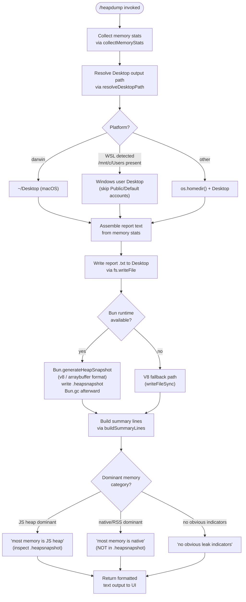

# `/heapdump`

> Analysis basis: CC v2.1.152 bundle.js (AST extraction + Claude interpretation)
> Minimum version: v2.1.152

---

## Overview

`/heapdump` is a hidden developer-diagnostics command that captures a full V8/Bun heap snapshot and a rich memory-statistics report, writing both to the user's Desktop directory. It is intended for investigating memory leaks or unexpected RSS growth inside the Claude Code process itself; it is not exposed in normal help listings.

---

## Registration

| Field | Value |
|---|---|
| type | `local` |
| name | `heapdump` |
| description | `Dump the JS heap to ~/Desktop` |
| supportsNonInteractive | `true` |
| isHidden | `true` |
| module_id | `Md1` |
| load_inline | `true` |
| loc_byte | `12270104` |
| loc_byte_end | `12270267` |
| loc_line | `10270` |
| arbor_handler.name | `OK5` |
| arbor_handler.fqn | `claude-2.1.152::OK5` |
| arbor_handler.kind | `AsyncFunction` |
| arbor_handler.resolution_path | `module_id` |
| arbor_handler.n_hits | `0` |

Analysis basis: CC v2.1.152 bundle.js:+12270104

---

## Input Branching

The command has three distinct top-level branches based on heap snapshot strategy (Bun vs. V8 fallback) and platform-specific Desktop path resolution (macOS/Linux, WSL/Windows, generic). A Mermaid flowchart is used.



Analysis basis: CC v2.1.152 bundle.js:+12267635, +12267694, +12267931, +12268174, +12268673, +12269416, +12269476, +12269613

---

## Behavioral Spec

### 1. Command Entry Point — `heapdumpHandler` (`OK5`)

The async handler is the Arbor-resolved entry point `OK5`.

```
async function heapdumpHandler(context):
    lines = []
    lines.push("Open the .heapsnapshot in Chrome DevTools → Memory → Load to inspect retainers.")
    // Analysis basis: CC v2.1.152 bundle.js:+12269129

    report = await runHeapdump(context)       // Kd1
    summary = buildSummaryLines(report)       // zK5

    lines.push(summary)
    return lines.join("\n")                   // text type output
    // Analysis basis: CC v2.1.152 bundle.js:+12269005, +12269119, +12269241
```

Analysis basis: CC v2.1.152 bundle.js:+12268973

---

### 2. Core Dump Orchestrator — `runHeapdump` (`Kd1`)

```
async function runHeapdump(context):
    // 1. Collect memory statistics snapshot
    stats = await collectMemoryStats()        // fK5
    // Analysis basis: CC v2.1.152 bundle.js:+12267648

    // 2. Trigger manual GC baseline (mode="manual", flags=0)
    triggerGC("manual", 0)                   // y6 → pv
    // Analysis basis: CC v2.1.152 bundle.js:+12267611, +12267622

    // 3. Resolve output path on the Desktop
    desktopPath = resolveDesktopPath()        // mTA
    // Analysis basis: CC v2.1.152 bundle.js:+12267931

    // 4. Build timestamp-based filename
    outDir  = path.join(desktopPath, ...)
    outFile = path.join(outDir, ...)
    // Analysis basis: CC v2.1.152 bundle.js:+12268040

    // 5. Write human-readable memory report as text
    await fs.writeFile(outFile + ".txt", formatReport(stats), {mode: 0o600})
    // File mode 384 (0o600) — owner read/write only
    // Analysis basis: CC v2.1.152 bundle.js:+12268083, +12268118

    // 6. Capture heap snapshot
    await captureHeapSnapshot(outFile)        // $K5
    // Analysis basis: CC v2.1.152 bundle.js:+12268174

    // 7. Emit telemetry
    emit("tengu_heap_dump")
    // Analysis basis: CC v2.1.152 bundle.js:+12268225

    // 8. Render progress / spinner
    renderProgress(context)                   // c, n_, Tz, hH
    // Analysis basis: CC v2.1.152 bundle.js:+12268223, +12268394, +12268403, +12268481

    return stats
```

Analysis basis: CC v2.1.152 bundle.js:+12267635

---

### 3. Memory Statistics Collector — `collectMemoryStats` (`fK5`)

```
async function collectMemoryStats():
    result = {}

    // Node.js / Bun built-ins
    result.memoryUsage        = process.memoryUsage()
    // Analysis basis: CC v2.1.152 bundle.js:+12265136

    result.heapStatistics     = v8.getHeapStatistics()
    // Analysis basis: CC v2.1.152 bundle.js:+12265160

    result.resourceUsage      = process.resourceUsage()
    // Analysis basis: CC v2.1.152 bundle.js:+12265186

    result.uptime             = process.uptime()
    // Analysis basis: CC v2.1.152 bundle.js:+12265212

    result.heapSpaceStats     = v8.getHeapSpaceStatistics()
    // Analysis basis: CC v2.1.152 bundle.js:+12265237

    result.activeHandles      = process._getActiveHandles().length
    // Analysis basis: CC v2.1.152 bundle.js:+12265279

    result.activeRequests     = process._getActiveRequests().length
    // Analysis basis: CC v2.1.152 bundle.js:+12265316

    // Linux proc filesystem probing
    try:
        result.fdCount        = fs.readdir("/proc/self/fd").length
        // Analysis basis: CC v2.1.152 bundle.js:+12265379
    catch: // silently skip on non-Linux

    try:
        result.smapsRollup    = fs.readFile("/proc/self/smaps_rollup", "utf8")
        // Analysis basis: CC v2.1.152 bundle.js:+12265442, +12265468
    catch: // silently skip on non-Linux

    // Load bun:jsc introspection module if available
    try:
        jsc = require("bun:jsc")
        // Analysis basis: CC v2.1.152 bundle.js:+12265527
        result.jscStats = jsc statistics ...
    catch: // not a Bun runtime

    // Connection / subprocess pool stats (from connection pool manager P)
    result.poolStats = connectionPoolSnapshot()
    // Analysis basis: CC v2.1.152 bundle.js:+12265721

    // Compute native memory ratio
    // Threshold: if native memory exceeds heap by factor > 100%
    // (constant 100 at bundle.js:+12265820)
    if nativeRSS > jsHeap * (100 / 100):
        result.nativeLeakWarning =
            "Native memory > heap - leak may be in native addons (node-pty, sharp, etc.)"
        // Analysis basis: CC v2.1.152 bundle.js:+12265906

    // Open file-handle stats — formatted to 2 decimal places
    result.fdFormatted = X.toFixed(2)
    // Analysis basis: CC v2.1.152 bundle.js:+12266029

    // Limit: uptime bucket uses 3600 s boundary (1 hour)
    // Memory unit: 1048576 bytes = 1 MiB divisor
    // Analysis basis: CC v2.1.152 bundle.js:+12265668, +12265673

    // Platform annotation
    if platform == "macos" or "darwin":
        result.platform = "macos"
        // Analysis basis: CC v2.1.152 bundle.js:+12266760, +12267179

    if no obvious indicators:
        result.fallbackNote =
            "No obvious leak indicators. Check heap snapshot for retained objects."
        // Analysis basis: CC v2.1.152 bundle.js:+12267025

    return result
```

Analysis basis: CC v2.1.152 bundle.js:+12265136

---

### 4. Desktop Path Resolver — `resolveDesktopPath` (`mTA`)

```
function resolveDesktopPath():
    home = os.homedir()
    // Analysis basis: CC v2.1.152 bundle.js:+1014047

    // WSL / Windows detection
    if path "/mnt/c/Users" is accessible:
        // Enumerate Windows user directories
        for each entry under "/mnt/c/Users":
            // Skip system pseudo-accounts
            if entry in ["Public", "Default", "Default User", "All Users"]:
                continue
            // Analysis basis: CC v2.1.152 bundle.js:+1014359, +1014378, +1014398, +1014423
            return path.join("/mnt/c/Users", entry, "Desktop")
        // Analysis basis: CC v2.1.152 bundle.js:+1014315

    // Standard POSIX (macOS / Linux)
    return path.join(home, "Desktop")
    // Analysis basis: CC v2.1.152 bundle.js:+1014083, +1014093
```

Analysis basis: CC v2.1.152 bundle.js:+1014040

---

### 5. Heap Snapshot Capture — `captureHeapSnapshot` (`$K5`)

```
async function captureHeapSnapshot(outputBasePath):
    snapshotPath = outputBasePath + ".heapsnapshot"

    if Bun runtime detected:
        // Use Bun's native snapshot API with v8-compatible arraybuffer format
        snapshot = Bun.generateHeapSnapshot("v8", "arraybuffer")
        // Analysis basis: CC v2.1.152 bundle.js:+12268673, +12268698, +12268703
        fs.writeFileSync(snapshotPath, snapshot)
        // Analysis basis: CC v2.1.152 bundle.js:+12268653

        // Force GC after snapshot to reclaim snapshot buffer memory
        Bun.gc(/* force */ true)
        // Analysis basis: CC v2.1.152 bundle.js:+12268730
    else:
        // V8 fallback — writeFileSync with snapshot data
        fs.writeFileSync(snapshotPath, v8HeapData)
```

Analysis basis: CC v2.1.152 bundle.js:+12268653

---

### 6. Summary Line Builder — `buildSummaryLines` (`zK5`)

```
function buildSummaryLines(stats):
    lines = []

    // Determine dominant memory category
    maxValue = Math.max(jsHeapUsed, nativeRSS, ...)
    // Analysis basis: CC v2.1.152 bundle.js:+12269348

    if jsHeapDominant:
        lines.push("— most memory is JS heap (inspect the .heapsnapshot)")
        // Analysis basis: CC v2.1.152 bundle.js:+12269416
    else if nativeDominant:
        lines.push("— most memory is native (NOT in the .heapsnapshot)")
        // Analysis basis: CC v2.1.152 bundle.js:+12269476

    if noObviousIndicators:
        lines.push("  (no obvious leak indicators)")
        // Analysis basis: CC v2.1.152 bundle.js:+12269613

    // Memory threshold note: 1 GiB = 1073741824 bytes used as display boundary
    // Analysis basis: CC v2.1.152 bundle.js:+12270022

    // Column formatting: entries padded to align, precision = 8 decimal places
    // Analysis basis: CC v2.1.152 bundle.js:+12269748

    appendTableRows(lines, stats, P86)
    // Analysis basis: CC v2.1.152 bundle.js:+12269660

    return lines.join("\n")
```

Analysis basis: CC v2.1.152 bundle.js:+12269092

---

### 7. Output File Schema

| Artifact | Extension | Location | Contents |
|---|---|---|---|
| Memory report | `.txt` | `~/Desktop/` | Human-readable stats table: RSS, heap used/total, heap spaces, FD count, uptime, smaps rollup (Linux), native leak warning if triggered |
| Heap snapshot | `.heapsnapshot` | `~/Desktop/` | V8-format heap snapshot; loadable in Chrome DevTools → Memory → Load |

File permissions for the report: mode `0o600` (owner read/write only).
Analysis basis: CC v2.1.152 bundle.js:+12268118

---

## State & Side Effects

| Item | Detail |
|---|---|
| Telemetry | `tengu_heap_dump` (bundle.js:+12268225) |
| Telemetry (indirect — bg dispatch) | `tengu_bg_dispatch_sigkill_escalate` (+15382331), `tengu_bg_dispatch_low_mem` (+15382910), `tengu_bg_spare_enable` (+15383605), `tengu_bg_spare_claim` (+15383726), `tengu_bg_spare_claim_fail` (+15383989), `tengu_bg_proto_mismatch` (+15370671), `tengu_bg_dispatch_stale_drop` (+15371910), `tengu_bg_attach_legacy_autorespawn` (+15373986), `tengu_bg_attach` (+15374397), `tengu_bg_attach_stall_gave_up` (+15375309), `tengu_bg_attach_stall_respawn` (+15375578), `tengu_bg_attach_kick` (+15376495) |
| GC trigger | Manual GC invoked before stats collection (mode `"manual"`, flags `0`); `Bun.gc(true)` forced after snapshot write |
| File writes | Two files written to Desktop: `<timestamp>.txt` (mode 0o600) and `<timestamp>.heapsnapshot` |
| Hook registration | `CMA.register` called via `tq` (bundle.js:+58661) — likely a process-level cleanup/unref hook |
| appState changes | No direct appState mutations observed in depth-2 traversal |
| Sound | <!-- TODO: not found in depth-2 traversal; needs --depth 4 --> |
| Visibility | `isHidden: true` — command is omitted from all user-facing help and completion listings |
| `supportsNonInteractive` | `true` — can be invoked in non-interactive / headless mode (e.g. CI pipelines, scripts) |

---

## Version History

| Version | Change |
|---|---|
| v2.1.152 | Initial analysis |

---

## Common Mistakes

1. **Expecting output in the current directory.** The `.heapsnapshot` and `.txt` report are always written to `~/Desktop` (or the Windows Desktop under WSL). There is no flag to redirect the output path.
2. **Running on a headless server without a Desktop directory.** If `~/Desktop` does not exist, `resolveDesktopPath` will still construct the path, but the subsequent `fs.writeFile` will fail. Pre-create the directory or run on a desktop OS.
3. **Interpreting the `.heapsnapshot` size as total memory.** The snapshot covers only JS heap objects. RSS and native addon memory (node-pty, sharp, etc.) are visible only in the `.txt` report and will trigger the "Native memory > heap" warning when dominant.
4. **Invoking `/heapdump` during heavy activity.** The command forces a manual GC pass before sampling; this can cause a noticeable pause. Run it on an otherwise idle process for the most accurate baseline.
5. **Using a non-Bun build.** The primary snapshot path calls `Bun.generateHeapSnapshot`. On a plain Node.js build the V8 fallback is used instead; the output format is structurally equivalent but the code path differs.
6. **Forgetting the command is hidden.** `/heapdump` does not appear in `/help` or autocomplete. It must be typed in full.

---

## Appendix — Identifier Mapping

> For bundle debugging only. Identifiers change across versions.

| Identifier | Role |
|---|---|
| `OK5` | `heapdumpHandler` — async top-level command handler (Arbor-resolved entry point) |
| `Kd1` | `runHeapdump` — core orchestrator: GC trigger, stats, file write, snapshot capture |
| `fK5` | `collectMemoryStats` — gathers process.memoryUsage, v8 heap stats, /proc files, bun:jsc |
| `zK5` | `buildSummaryLines` — formats dominant-memory category lines and table for UI output |
| `$K5` | `captureHeapSnapshot` — calls Bun.generateHeapSnapshot / V8 fallback and writes .heapsnapshot |
| `mTA` | `resolveDesktopPath` — resolves ~/Desktop across macOS, Linux, and WSL/Windows |
| `y6` | `triggerGC` — initiates a GC pass (mode string + flags integer) |
| `pv` | GC primitive / runtime GC hook called by `triggerGC` |
| `G` | Connection/pool helper used during stats collection |
| `iE6` | Sub-helper called by connection pool helper `G` |
| `IR8` | Sub-helper called by connection pool helper `G` and pool manager `P` |
| `P` | `connectionPoolManager` — connection pool used for pool stats snapshot |
| `hH` | `spawnSubprocess` — subprocess spawn helper used during dump flow and bg dispatch |
| `n_` | `wrapError` — error normalisation (wraps raw Error/string into structured error) |
| `X` | `subprocessHandle` — handle for spawned subprocess; provides `.reply`, `.kill`, `.resize` etc. |
| `J` | `outputChunkBuffer` — accumulates subprocess stdout/stderr chunks |
| `w` | `subprocessSupervisor` — supervises spawned worker processes, handles SIGKILL escalation |
| `ZM` | `streamEndHelper` — ends a socket/stream within supervisor |
| `Hx5` | `supervisorMessageDispatcher` — routes IPC messages (ping, nudge, yield, lease, etc.) |
| `GH` | `stringCoercionHelper` — coerces values to String |
| `N` | `shellCommandRunner` — runs shell commands with logging and retries |
| `OyK` | `commandBuilder` — constructs shell command strings |
| `xMA` | `envResolver` — resolves environment variables for command execution |
| `H` | `randomRetryScheduler` — schedules retries with random jitter and setTimeout |
| `CH` | `jsonStringifyHelper` — thin wrapper around JSON.stringify |
| `_` | `stringProcessor` — generic string manipulation utility |
| `j4` | `pathNormaliser` — normalises filesystem paths, handles redaction |
| `Y$A` | `pathMapper` — maps path components |
| `q` | `fileCleanupHelper` — performs unlinkSync on temporary files |
| `A` | `moduleRegistry` — map-based registry of loaded modules; provides get/set/values |
| `VxH` | `fileWriteWrapper` — wraps fs write operations |
| `e3A` | `streamWriteHelper` — writes to a stream handle |
| `DyK` | `logFileManager` — manages append-only log files with rotation |
| `obH` | `writeQueueFlusher` — batches and flushes buffered log writes |
| `cqH` | `logEntryFormatter` — formats log entries for file output |
| `Q6` | `fsPromisesRef` — reference to `fs/promises` (async fs) |
| `Q96` | `fsErrorClassifier` — classifies fs errors (EISDIR, ENOENT, etc.) |
| `G$A` | `logDirEnsurer` — ensures log directory exists before writes |
| `W$A` | `logFileRotator` — renames / unlinks old log files on rotation |
| `YyK` | `logAppendWorker` — performs mkdir + appendFile + rotation cycle |
| `tq` | `cleanupHookRegistrar` — registers process-level cleanup via CMA.register |
| `K` | `columnFormatter` — formats memory stats into padded columns for display |
| `L` | `taskQueue` — lightweight promise queue with add/delete/finally tracking |
| `M` | `resourceCloser` — closes open handles (socket A, queue q) on teardown |
| `c` | `uiRenderer` — renders UI elements / spinner |
| `Tz` | `progressIndicator` — progress/spinner component shown during dump |
| `P86` | `tableFormatter` — formats the final stats table appended to summary lines |

---

Note: index built via Arbor fallback; some signals (telemetry, literals) may be missing — see arbor-fallback.js.