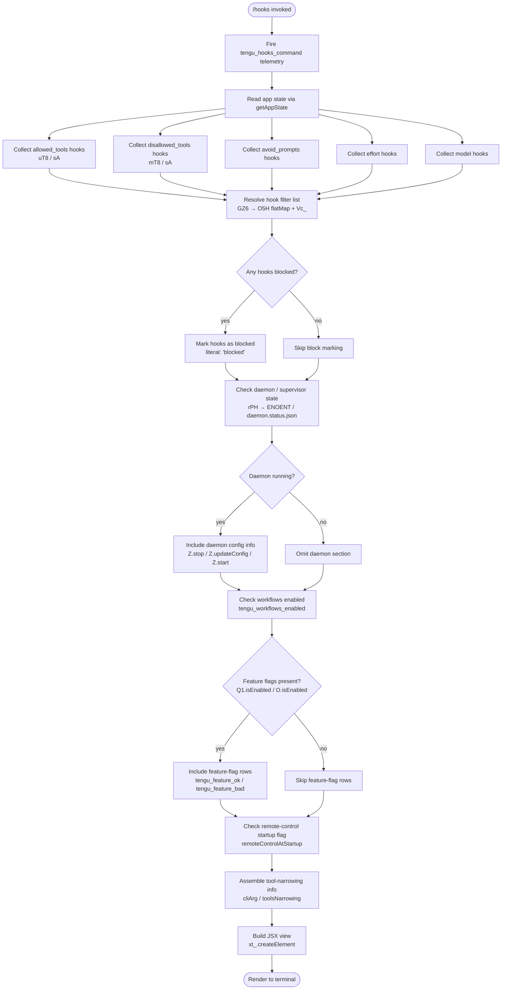

# `/hooks`

> Analysis basis: CC v2.1.152 bundle.js (AST extraction + Claude interpretation)
> Minimum version: v2.1.152

---

## Overview

The `/hooks` command displays a read-only view of the current hook configurations registered for tool events in the active Claude Code session. It is a `local-jsx` command that renders its output as a JSX component inline in the terminal, and it fires immediately on invocation (no user confirmation required). The command reads both allowed-tools and disallowed-tools hook lists, as well as avoid-prompts, effort, and model hook settings, before handing the assembled data to the JSX renderer.

---

## Registration

| Field | Value |
|---|---|
| type | `local-jsx` |
| name | `hooks` |
| description | `View hook configurations for tool events` |
| immediate | `true` |
| module_id | `rF1` |
| load_inline | `true` |
| loc_byte | `12162921` |
| loc_byte_end | `12163071` |
| loc_line | `10148` |
| arbor_handler.name | `S95` |
| arbor_handler.fqn | `claude-2.1.152::S95` |
| arbor_handler.kind | `AsyncFunction` |
| arbor_handler.resolution_path | `module_id` |
| arbor_handler.n_hits | `0` |

Analysis basis: CC v2.1.152 bundle.js:+12162921

---

## Input Branching

The command has more than three distinct logical branches when constructing the hook-configuration view: it distinguishes allowed tools, disallowed tools, avoid-prompts, effort, model settings, blocked hooks, and daemon/supervisor state. A flowchart is mandatory here.



Analysis basis: CC v2.1.152 bundle.js:+12162719 through +12162791

---

## Behavioral Spec

### 1. Entry Point — Main Handler (`S95`)

The Arbor-resolved handler `S95` is an `AsyncFunction` reached via `module_id → rF1`.

```
async function hooksCommandHandler(context):
    fire telemetry("tengu_hooks_command")          // +12162721
    appState = readAppState()                       // calls getAppStateReader (+12162753)
    hookData = buildHookConfigView(appState)        // calls viewBuilder (+12162761)
    element  = createElement(hookData)             // xt_.createElement (+12162791)
    return element
```

Analysis basis: CC v2.1.152 bundle.js:+12162719

---

### 2. App-State Reader (`V_`)

Reads the live application state and extracts the five named hook-configuration keys.

```
function readAppState():
    state = H.getAppState()                        // +10666233
    allowedTools    = extractHookList(state, "allowed_tools")    // uT8 +10666341
    disallowedTools = extractHookList(state, "disallowed_tools") // mT8 +10666396
    avoidPrompts    = extractHookList(state, "avoid_prompts")    // +10666457
    effortHooks     = extractHookList(state, "effort")           // +10666559
    modelHooks      = extractHookList(state, "model")            // +10666572
    return { allowedTools, disallowedTools, avoidPrompts,
             effortHooks, modelHooks }
```

`extractHookList` (both `uT8` and `mT8`) ultimately calls `sA` with a zero-based index (`0` literal at +10660008).

Analysis basis: CC v2.1.152 bundle.js:+10666233

---

### 3. Hook-Configuration View Builder (`qv`)

This is the core display function. It composes the JSX rows by calling a chain of sub-helpers.

```
function buildHookConfigView(appState):
    // Resolve display names
    displayName = resolveDisplayName(appState)        // uH +9607735
    formattedRow = formatRow(appState)                // w0 +9607774

    // Push daemon process row
    daemonRow = buildDaemonRow(appState)              // Y.push +9607846

    // Build tool-narrowing block
    toolNarrowInfo = buildToolNarrowingBlock()        // tB_ +9607861

    // Build workflows-enabled indicator
    workflowsRow = buildWorkflowsRow(appState)        // uN +9607875

    // Build blocked-hooks list
    blockedHooks = resolveBlockedHooks(appState)      // I_H +9607897

    // Build environment / feature row
    envRow = buildEnvRow(appState)                    // eB_ +9607912

    // Build shell-key row
    shellKeyRow = buildShellKeyRow(appState)          // sK +9607924

    // Assemble component array
    components = []
    components.push(buildComponentRows(appState))     // z.push +9607984

    // Build tool-access row with feature flags
    toolAccessRow = buildToolAccessRow(appState)      // Ta +9608084

    // Check feature availability
    hasFeature = A.has(appState)                      // +9608102
    someFeature = K.some(appState)                    // +9608130
    featureX4   = X4(appState)                       // +9608142
    isQ1Enabled = Q1.isEnabled(appState)              // +9608153

    // Filter and map hook entries
    filteredHooks = K.filter(appState)                // +9608229
    hasFcH        = FcH.has(appState)                 // +9608244
    mappedHooks   = K.map(appState)                   // +9608272
    isOEnabled    = O.isEnabled(appState)             // +9608283

    // Resolve display-name extension
    extName = NX(appState)                            // +9608325
    included = $.includes(appState)                   // +9608370

    return assembleJSX(components)
```

Analysis basis: CC v2.1.152 bundle.js:+9607735

---

### 4. Row Formatter (`w0`)

Converts raw hook entries into display strings, distinguishing CLI from remote hook origins.

```
function formatRow(hookEntry):
    kind = classifyKind(hookEntry)           // qK +4687566
    name = resolveEntryName(hookEntry)       // uH +4687611
    if hookEntry.origin == "cli":            // literal +4687701
        applyCliStyle(name)
    else if hookEntry.origin == "remote":    // literal +4687712
        applyRemoteStyle(name)
    fire telemetry("tengu_slate_harbor")     // +4687731
    enrichRow = E6(hookEntry)               // +4687728
    return { kind, name, enrichRow }
```

Analysis basis: CC v2.1.152 bundle.js:+4687549

---

### 5. Hook Enrichment / Deduplication (`E6`)

Checks multiple Sets and Maps to determine whether a hook entry has already been seen and should be de-duplicated or marked.

```
function enrichHookEntry(entry):
    baseDisplay = hO6(entry)               // +3181073
    secondary   = SO6(entry)               // +3181110
    label       = buildLabel(entry)        // oe +3181145

    if MzH.has(entry):                     // +3181162
        cached = P68(entry)                // +3181173  (checks O$_.has, MzH.get, O$_.add)
        kO6.add(entry)                     // +3181185
    if TQ.has(entry):                      // +3181199
        existing = TQ.get(entry)           // +3181216
        return renderExisting(existing)    // x6 +3181236
    return { baseDisplay, secondary, label, cached }
```

The `x6` sub-call records a timestamp via `Date.now` (+3200369) and calls `C_7` (+3200422) for final rendering.

Analysis basis: CC v2.1.152 bundle.js:+3181073

---

### 6. Daemon Row Builder (`Y` / `rPH`)

Reads the daemon's status file and renders a summary row.

```
function buildDaemonRow(appState):
    config = loadDaemonConfig(appState)         // rPH +15396299
    if config.error == "ENOENT":                // literal +12590443
        return renderNoDaemon()
    keys = Object.keys(config)                  // +12590744
    if K.has(config):                           // +12590830
        columns = L.map(keys)
        padded  = M.padEnd(columns, "  ")       // +15406372, literal +15406393
    daemonWriter   = q.write(config)            // +15396316
    supervisorMode = config["supervisor"]       // literal +15396324
    configMetrics  = Ao1(config)                // +15396518 (Object.keys, Math.max, Zz)
    return { config, supervisorMode, configMetrics }
```

The daemon status file name `"daemon.status.json"` is referenced at +12407047 via `KI6`.

Analysis basis: CC v2.1.152 bundle.js:+15396299

---

### 7. Daemon Lifecycle Controls (`Y` — continued)

After reading the daemon row, the builder also manages daemon lifecycle transitions.

```
function manageDaemonLifecycle(daemonRef):
    daemonRef.stop()                   // Z.stop   +15396712
    daemonRef.updateConfig(newCfg)     // Z.updateConfig +15396721
    daemonRef.start()                  // Z.start  +15396739
    heartbeatInit = JGK(daemonRef)     // +15396841, fires "heartbeat" literal +15395546
    M.set(daemonRef)                   // +15396886
    V.start(daemonRef)                 // +15396897
    fire telemetry("tengu_daemon_config_reload")  // +15397117
    c(daemonRef)                       // +15397115
```

Analysis basis: CC v2.1.152 bundle.js:+15396712

---

### 8. Daemon Control Components (`z` / `SH`, `mH`, `_y`, `qm`)

The component array (`z`) contains three primary sub-components:

```
function buildComponentRows(context):
    stopRow  = buildDaemonStopRow(context)      // SH +15418386
        // fires tengu_feature_ok  (+964519)
    failRow  = buildDaemonStopFailRow(context)  // mH +15418409
        // fires tengu_feature_bad (+964577)
    ctrlRow  = buildDaemonControlRow(context)   // _y +15418461
        // fires tengu_daemon_control (+15418464)
        // uses literals "daemon_stop" (+15418389), "daemon_stop_failed" (+15418426)
        // calls Qb → QS, WQ.push, LEH → gb, f$_ (firstParty +3174510, H.emit)
    shutRow  = buildShutdownRow(context)        // qm +15418515
        // Promise.race + Promise.all +15413562/15413576
        // process.exit +15413643
        // timeout 500 ms literal +15413604
    return [stopRow, failRow, ctrlRow, shutRow]
```

`_y` uses `L$_.randomUUID` (+3174045) to assign a unique identifier to the control row.

Analysis basis: CC v2.1.152 bundle.js:+15418386

---

### 9. Tool-Access Row with Remote Filtering (`Ta`)

Builds the tool-access section, which lists all tools, filters by blocked status, and conditionally shows SDK type and agent-teams information.

```
function buildToolAccessRow(appState):
    shellKey = buildShellKeyRow(appState)           // sK +9606440
    displayN = resolveDisplayNameX(appState)        // NX +9606456
        // supports "sdk-ts", "sdk-py", "sdk-cli", "local-agent" +5223687–5223730
    queryWrapped = qw(appState)                     // +9606593  uses qK +5270422
    label = uH(appState)                            // +9606686
    featureHook = feH(appState)                     // +9606757
    toolNarrow  = buildToolNarrowingBlock()         // tB_ +9606776
    agentTeams  = buildAgentTeamsRow(appState)      // S9 +9606817
        // --agent-teams literal +5351023
        // fires tengu_amber_flint +5351135
    onAccepted  = ovL(appState)                     // +9606823  (Qf1, E_)
    onDenied    = avL(appState)                     // +9606829  (rf1, E_)
    envSection  = buildEnvRow(appState)             // eB_ +9606968
    b1Section   = B$1(appState)                     // +9607009
    remoteCtrl  = buildRemoteControlRow(appState)   // uR +9607036
        // "standard", "tst", "tst-auto" modes +9976580/9976659/9976709
        // "remoteControlAtStartup" key +13552424
        // fires tengu_cobalt_ridge via GR +4799244
    return assembleToolAccessJSX(...)
```

Analysis basis: CC v2.1.152 bundle.js:+9606440

---

### 10. Blocked-Hooks Resolver (`I_H`)

Filters the hook list to extract entries whose status is `"blocked"`.

```
function resolveBlockedHooks(hookList):
    filtered = H.filter(hookList, isBlocked)   // +9607080
    blocked  = GZ6(filtered)                   // +9607095
        // literal "blocked" +9607141
        // GZ6 calls O5H (tG8.flatMap, Nz) and Vc_ ($i8, l76, GS)
        // also calls $21 +10379346
        // uses "deny" literal +10378656
        // uses "cliArg" +10379242 and "toolsNarrowing" +10379263
    return blocked
```

Analysis basis: CC v2.1.152 bundle.js:+9607080

---

### 11. Workflows-Enabled Row (`uN`)

Checks whether the workflows feature is active and builds an indicator row.

```
function buildWorkflowsRow(appState):
    base = nq8(appState)          // uH +4090896, Lk +4090943
    name = uH(appState)           // +4091070
    fire tengu_workflows_enabled  // E6 +4091124 → +4091127
    return { base, name }
```

Analysis basis: CC v2.1.152 bundle.js:+4091024

---

### 12. Environment / Feature Row (`eB_`)

Builds the environment origin row, distinguishing Windows vs. other platforms, and fires the `tengu_cobalt_ridge` telemetry event.

```
function buildEnvRow(hookEntry):
    origin  = a6(hookEntry)            // +4799143
    name    = uH(hookEntry)            // +4799167
    kind    = qK(hookEntry)            // +4799176
    winFlag = w9H(hookEntry)           // +4799212  (windows literal +4799150)
    fire tengu_cobalt_ridge            // E6 +4799241 → +4799244
    secondPart = OtH(hookEntry)        // +9607686
    init       = E_(hookEntry)         // +9607692
    return { origin, name, kind, winFlag, secondPart }
```

Analysis basis: CC v2.1.152 bundle.js:+4799143

---

### 13. Remote-Control Row (`uR` / `KQ_`)

Handles display of the remote-control session status, distinguishing among `standard`, `tst`, `tst-auto`, and startup-flag modes.

```
function buildRemoteControlRow(appState):
    sessionInfo = resolveSessionKind(appState)     // KQ_ +9977058
        modes: "standard" | "tst" | "tst-auto"    // +9976580, +9976659, +9976709
        limit: 100                                 // +9976672
        uZH +9976568, rD1 +9976632, PSL +9976696
        uH +9976723, qK +9976744
    flagRow = N(appState)                          // +9977098
        // "debug" literal +203069
        // checks H.includes, _.toUpperCase, H.trim
        // Dk, VxH, DyK
    apiRow  = yA(appState)                         // +9977250
        // "bedrock","foundry","anthropicAws","mantle","vertex" +2040715–2040923
        // "api.anthropic.com" +2041606
    sL(appState)                                   // +9977272
    return { sessionInfo, flagRow, apiRow }
```

Analysis basis: CC v2.1.152 bundle.js:+9977058

---

### 14. Daemon Status Loader (`Sn1`)

Reads the daemon status JSON from disk and caches state.

```
function loadDaemonStatusFile():
    ki = Ki()                                 // z1H +2191209
    timestamp = Date.now()                    // +12407159
    store = A1()                              // HY7.getStore +3943910
    path  = KI6()                             // hn1.join + l8 +12407033/12407042
        // "daemon.status.json" +12407047
    payload = CH(data)                        // JSON.stringify +183087
    return { ki, timestamp, store, path, payload }
```

Analysis basis: CC v2.1.152 bundle.js:+12407144

---

## State & Side Effects

| Item | Detail |
|---|---|
| Telemetry: `tengu_hooks_command` | Fired immediately on invocation; primary command event (bundle.js:+12162721) |
| Telemetry: `tengu_slate_harbor` | Fired during row formatting for each hook entry (bundle.js:+4687731) |
| Telemetry: `tengu_daemon_config_reload` | Fired when daemon config is reloaded during view construction (bundle.js:+15397117) |
| Telemetry: `tengu_workflows_enabled` | Fired when workflows-enabled state is read (bundle.js:+4091127) |
| Telemetry: `tengu_cobalt_ridge` | Fired in the environment / feature row builder (bundle.js:+4799244) |
| Telemetry: `tengu_feature_ok` | Fired when daemon stop row is rendered successfully (bundle.js:+964519) |
| Telemetry: `tengu_feature_bad` | Fired when daemon stop-fail row is rendered (bundle.js:+964577) |
| Telemetry: `tengu_daemon_control` | Fired when daemon control row is assembled (bundle.js:+15418464) |
| Telemetry: `tengu_amber_flint` | Fired in agent-teams row builder (bundle.js:+5351135) |
| Hook registration | `immediate: true` — no confirmation dialog is shown before execution |
| appState changes | Read-only access via `H.getAppState`; no mutations observed in depth-2 traversal |
| Daemon lifecycle | `Z.stop`, `Z.updateConfig`, `Z.start` may be called during daemon row construction (bundle.js:+15396712–15396739) |
| File I/O | Reads `daemon.status.json` via `KI6`; `d0K.unlinkSync` reachable via `q` (bundle.js:+15360630) |
| UUID generation | `L$_.randomUUID` called for daemon-control row identity (bundle.js:+3174045) |
| Timer | `Math.random` + `setTimeout` used in app-state reader's backing store `H` (bundle.js:+13371604); `clearTimeout` in shutdown path |
| Sound | <!-- TODO: not found in depth-2 traversal; needs --depth 4 --> |

---

## Version History

| Version | Change |
|---|---|
| v2.1.152 | Initial analysis |

---

## Common Mistakes

1. **Expecting mutations**: `/hooks` is a read-only view command. It does not create, delete, or modify hook registrations — it only displays the current configuration. Use `settings` or direct config editing to change hooks.
2. **Confusing "blocked" with "disabled"**: A hook entry marked `"blocked"` (literal at +9607141) means its execution was prevented by a tool-narrowing rule (`cliArg` / `toolsNarrowing`), not that the hook definition was removed.
3. **Daemon section absent**: If `daemon.status.json` is not present (ENOENT, +12590443), the daemon row is silently omitted rather than showing an error. This is expected in non-daemon sessions.
4. **Running as non-`immediate`**: The `immediate: true` flag (+12162921) means the command executes without a confirmation prompt. Do not expect a "are you sure?" dialog.
5. **Assuming static output**: The view is built from live app state each invocation. Re-running `/hooks` after a settings change will reflect the updated configuration.
6. **Remote vs. CLI origins**: Hook entries are tagged with either `"cli"` or `"remote"` origin. Display formatting differs; remote hooks may be absent in offline/local-only sessions.

---

## Appendix — Identifier Mapping

> For bundle debugging only. Identifiers change across versions.

| Identifier | Role |
|---|---|
| `S95` | Main async handler for `/hooks` command (Arbor-resolved, fqn: `claude-2.1.152::S95`) |
| `c` | Shared utility / callback invoked at handler entry and daemon lifecycle end |
| `V_` | App-state reader; extracts hook-configuration keys from live state |
| `H` | App-state backing store; exposes `getAppState`, `Math.random`, `setTimeout` |
| `uT8` | Extracts `allowed_tools` hook list from state |
| `sA` | Low-level hook-list accessor (zero-indexed) |
| `mT8` | Extracts `disallowed_tools` hook list from state |
| `qv` | Hook-configuration view builder; composes all display rows |
| `uH` | Display-name resolver / string formatter |
| `w0` | Row formatter; classifies CLI vs. remote hook origin |
| `wQ` | Sub-utility called inside row formatter |
| `qK` | Entry-kind classifier; wraps `String` coercion |
| `E6` | Hook-entry enrichment and deduplication logic |
| `hO6` | Primary display string builder inside enrichment |
| `SO6` | Secondary display string builder inside enrichment |
| `oe` | Label builder inside enrichment (calls `uH`, `Qb`) |
| `P68` | Cached-entry resolver (checks `O$_.has`, `MzH.get`, `O$_.add`) |
| `x6` | Final renderer for existing cached entries; records `Date.now` timestamp |
| `Y` | Daemon row builder; manages `q.write`, `T.stop`, `M.get/set/delete`, `Z.*`, `V.start` |
| `rPH` | Daemon config loader; reads `daemon.status.json`, handles ENOENT |
| `A1` | AsyncLocalStorage `getStore` wrapper |
| `L8` | Sub-utility in daemon config loader |
| `aHA` | Sub-utility in daemon config loader (calls `oHA`) |
| `GH` | String coercion helper |
| `K` | Column/table helper; exposes `L.map`, `M.padEnd`, `has`, `some`, `filter`, `map` |
| `q` | Writer / file handle; exposes `write`, `close`, `add`, `delete` (and `d0K.unlinkSync`) |
| `Ao1` | Config-metrics builder (`Object.keys`, `Math.max`, `Zz`) |
| `M` | Map/manager for daemon entries; exposes `get`, `set`, `delete`, `close`, `toLowerCase`, `finally` |
| `A` | Entry abstraction; exposes `close`, `toLowerCase`, `has` |
| `L` | Lifecycle promise wrapper; `q.add`, `M.finally`, `q.delete` |
| `T` | Stop-event handler; `b.preventDefault`, `O0`, `Y`, `H` |
| `b` | Event object passed to stop handler |
| `O0` | User-settings accessor (key: `"userSettings"`) |
| `Z` | Daemon instance handle; exposes `stop`, `updateConfig`, `start` |
| `JGK` | Heartbeat initializer |
| `se` | Heartbeat sub-utility |
| `V` | Secondary process/timer handle; exposes `start` |
| `tB_` | Tool-narrowing block builder (`$31`, `E_`) |
| `E_` | ES-module init helper (`__esModule`, `yC8`, `_S6.call`, `AS6.bind`, `ITK`, `y7A.set`) |
| `AS6` | Bound method reference inside ES-module init |
| `uN` | Workflows-enabled row builder |
| `nq8` | Base-data accessor for workflows row (`uH`, `Lk`) |
| `Lk` | Sub-accessor used in workflows row |
| `I_H` | Blocked-hooks resolver (`H.filter`, `GZ6`) |
| `GZ6` | Hook-filter pipeline (`O5H`, `Vc_`, `$21`) |
| `O5H` | FlatMap-based hook expander (`tG8.flatMap`, `Nz`) |
| `Vc_` | Hook classifier (`$i8`, `l76`, `GS`) |
| `$21` | Final step in hook-filter pipeline |
| `eB_` | Environment / feature row builder |
| `GR` | Origin/kind sub-builder inside env row (`a6`, `uH`, `qK`, `w9H`, `E6`) |
| `sK` | Shell-key row builder (`a6`, `w9H`) |
| `z` | Component-row array; holds `SH`, `mH`, `_y`, `qm` entries |
| `SH` | Daemon-stop-success row component |
| `mH` | Daemon-stop-failure row component |
| `_y` | Daemon-control row component (`Qb`, `WQ.push`, `LEH`, `f$_`) |
| `Qb` | Queue/bucket helper (calls `QS`) |
| `LEH` | Listener helper (calls `gb`) |
| `f$_` | First-party hook emitter (`Y68`, `L$_.randomUUID`, `eFH`, `Sp`, `H.emit`) |
| `qm` | Shutdown row component (`Promise.race`, `Promise.all`, `GQ`, `vQ`, `n8`, `process.exit`) |
| `GQ` | Shutdown initiator (`MKH.shutdown`) |
| `vQ` | Timeout-clearing helper (`clearTimeout`, `m$_`) |
| `n8` | Abort/timeout wrapper (`K`, `Error`, `q`, `setTimeout`, `O`, `clearTimeout`, `L.unref`) |
| `Ta` | Tool-access row builder; top-level orchestrator for tool display |
| `NX` | Display-name extension resolver (SDK type: `sdk-ts`/`sdk-py`/`sdk-cli`/`local-agent`) |
| `qw` | Query wrapper (calls `qK`) |
| `feH` | Feature-hook accessor |
| `S9` | Agent-teams row builder (`uH`, `YC7`, `E6`; `--agent-teams` flag) |
| `YC7` | Sub-utility in agent-teams builder |
| `ovL` | Accept-handler builder (`Qf1`, `E_`) |
| `avL` | Deny-handler builder (`rf1`, `E_`) |
| `uR` | Remote-control row builder (`KQ_`, `N`, `yA`, `sL`) |
| `KQ_` | Session-kind resolver (`uZH`, `rD1`, `PSL`, `uH`, `qK`; modes: standard/tst/tst-auto) |
| `N` | Debug-flag row builder (`t96`, `OyK`, `H.includes`, `CH`, `_.toUpperCase`, `j4`, `H.trim`, `Dk`, `VxH`, `DyK`) |
| `yA` | API-provider row builder (bedrock/foundry/anthropicAws/mantle/vertex/api.anthropic.com) |
| `sL` | Trailing sub-utility in remote-control row |
| `X4` | Feature-check helper |
| `O` | Feature-flag handle; exposes `isEnabled`, `k8` |
| `k8` | Feature-flag sub-accessor |
| `$` | Inclusion-check wrapper; exposes `includes` (calls `Sn1`) |
| `Sn1` | Daemon status-file reader (`Ki`, `Date.now`, `A1`, `KI6`, `CH`) |
| `Ki` | Internal clock/tick helper (calls `z1H`) |
| `KI6` | Path builder for `daemon.status.json` (`hn1.join`, `l8`) |
| `CH` | JSON serializer wrapper (`JSON.stringify`) |

---

Note: index built via Arbor fallback; some signals (telemetry, literals) may be missing — see arbor-fallback.js.