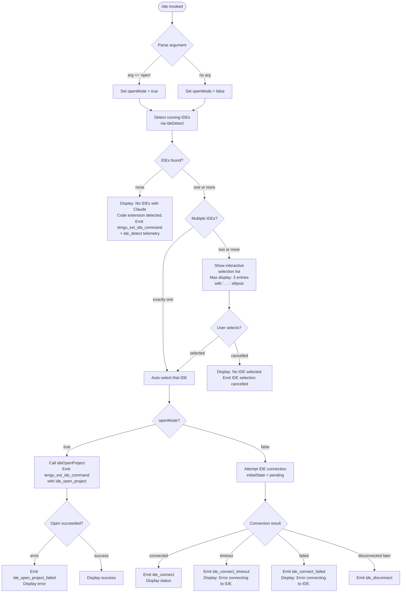

# `/ide`

> Analysis basis: CC v2.1.152 bundle.js (AST extraction + Claude interpretation)
> Minimum version: v2.1.152

---

## Overview

`/ide` manages IDE integrations for Claude Code by detecting running IDEs with the Claude Code extension, presenting an interactive selection UI, and establishing (or refreshing) a live connection from the CLI session to the chosen IDE. When invoked with the optional `open` sub-command argument it additionally triggers an "open project" action against the selected IDE. The command also surfaces disconnection and reconnection flows for already-connected IDEs.

---

## Registration

| Field | Value |
|---|---|
| type | `local-jsx` |
| name | `ide` |
| description | `Manage IDE integrations and show status` |
| argumentHint | `[open]` |
| module_id | `_k1` |
| load_inline | `true` |
| loc_byte | `11291796` |
| loc_byte_end | `11291952` |
| loc_line | `8899` |
| arbor_handler.name | `QrL` |
| arbor_handler.fqn | `claude-2.1.152::QrL` |
| arbor_handler.kind | `AsyncFunction` |
| arbor_handler.resolution_path | `module_id` |
| arbor_handler.n_hits | `0` |

Analysis basis: CC v2.1.152 bundle.js:+11291796

---

## Input Branching

The command has five distinct paths depending on detection results, argument presence, and connection state, so a Mermaid flowchart is used.



Analysis basis: CC v2.1.152 bundle.js:+11288018, +11288127, +11288265, +11289039, +11290015, +11290102, +11290209

---

## Behavioral Spec

### 1. Handler Entry — `ideCommandHandler` (arbor: `QrL`)

The async handler is the primary entry point resolved via `module_id → _k1`.

```
async function ideCommandHandler(args, context):
    emit telemetry("tengu_ext_ide_command", ...)      // +11287912
    arg = args[0] ?? null

    detectedIDEs = await ideDetect(context)           // calls CnH

    if detectedIDEs is empty:
        display("No IDEs with Claude Code extension detected.")   // +11288127
        return

    if detectedIDEs.length == 1:
        selectedIDE = detectedIDEs[0]
    else:
        selectedIDE = await showIDESelector(detectedIDEs)
        if selectedIDE is null:
            display("No IDE selected.")               // +11288265
            log("IDE selection cancelled")            // +11291178
            return

    if arg == "open":                                 // +11288018
        await ideOpenProject(selectedIDE, context)
    else:
        await ideConnect(selectedIDE, context)
```

Analysis basis: CC v2.1.152 bundle.js:+11287910, +11288032, +11288056

---

### 2. IDE Detection — `ideDetect` (bundle: `CnH`)

Scans the system for running IDE processes that have loaded the Claude Code extension. On Linux it runs a `ps aux` pipeline; on macOS/Windows it uses platform-specific enumeration. Returns a deduplicated list of IDE descriptors.

```
async function ideDetect(context):
    platform = getPlatform()

    if platform == "linux":                           // +5293362
        rawOutput = shell("ps aux | grep -E 'code|cursor|windsurf|…'")  // +5293388
        candidates = parseProcessList(rawOutput)
    else:
        candidates = await enumerateSockets(context) // DL8 + PR7

    results = []
    for candidate in candidates:
        ideInfo = await probeIDESocket(candidate)    // JR7 → eA_
        if ideInfo.valid:
            results.push(ideInfo)

    emit telemetry("ide_detect", ...)                // +5289854
    if results is empty:
        emit telemetry("ide_detect_failed", ...)     // +5289918

    return deduplicate(results)
```

Key sub-calls:
- `DL8` enumerates socket paths (`Promise.all` over mapped socket candidates) (bundle.js:+5285065)
- `PR7` resolves each candidate path, checks `isDirectory`, `isSymbolicLink`, skips WSL special paths (`/mnt/c/Users`, `Public`, `Default`, etc.) (bundle.js:+5286304)
- `eA_` probes each socket using `sh -c` with a 3000 ms timeout (bundle.js:+2190596, +2190619)
- IDE types recognised: `vscode` (+11288325), `cursor` (+11288366), `windsurf` (+11288407), JetBrains family including `appcode` (+5293762), `jetbrains` (+5284961)

Analysis basis: CC v2.1.152 bundle.js:+5288511, +5288530, +5288560

---

### 3. IDE Selection Display — list rendering (`hr_`)

When multiple IDEs are found, the UI renders up to 3 entries inline, appending `, …` when there are more than 3.

```
function formatIDEList(ideList):
    displaySlice = ideList.slice(0, 3)               // literal 3 at +11291327
    labels = displaySlice.map(ide =>
        normalizeNFC(ide.label))                     // "NFC" literal +11291395
    result = labels.join(", ")                       // +11291552
    if ideList.length > 3:
        result += ", …"                              // +11291566
    return result
```

The random number generation seen in `H` (calls `Math.random`, `setTimeout`) is used for staggered retry delays in connection attempts — not for selection logic.

Analysis basis: CC v2.1.152 bundle.js:+11291290, +11291297, +11291327, +11291395, +11291404, +11291444, +11291470, +11291529, +11291552, +11291566

---

### 4. IDE Open Project — `ideOpenProject`

Invoked when the user passes `open` as the argument. Sends an open-project request to the selected IDE's socket, distinguishing between worktree and standard project modes.

```
async function ideOpenProject(selectedIDE, context):
    mode = context.isWorktree ? "worktree" : "project"  // +11288499, +11288510
    try:
        await sendIDERequest(selectedIDE.socket, {action: "open", mode})
        emit telemetry("ide_open_project", {ide: selectedIDE.type, mode})  // +11288465
        displaySuccess()
    catch error:
        emit telemetry("ide_open_project_failed", ...)   // +11288572
        if noIDEResponded:
            display("Exited without opening IDE")        // +11288862
        displayError(error)
```

Analysis basis: CC v2.1.152 bundle.js:+11288462, +11288526, +11288550

---

### 5. IDE Connection Flow — `ideConnect` (React component `Hk1`)

The connection logic is implemented as a JSX component (type `local-jsx`), managing connection state reactively via `useState`, `useEffect`, and `useCallback`.

```
function IDEConnectComponent({selectedIDE, context}):
    [status, setStatus] = useState("pending")         // +11289798, +11289971

    useEffect():
        connectionAttempt = startIDEConnection(selectedIDE)  // calls a4A sub-system

        on connectionAttempt.success:
            setStatus("connected")
            emit telemetry("ide_connect", ...)        // +11290015

        on connectionAttempt.timeout:
            setStatus("error")
            emit telemetry("ide_connect_timeout", ...) // +11290209
            display("Error connecting to IDE.")        // +11290327

        on connectionAttempt.failure:
            setStatus("error")
            emit telemetry("ide_connect_failed", ...) // +11290102
            display("Error connecting to IDE.")

        return cleanup

    if status == "pending":
        display("Connecting to " + selectedIDE.name)  // +11291045

    if selectedIDE.protocol.startsWith("ws:"):        // +11290825
        useWebSocketTransport(selectedIDE)             // ws-ide path +11285917
    else:
        useSSETransport(selectedIDE)                   // sse-ide path +11285897

    onDisconnect:
        emit telemetry("ide_disconnect", ...)          // +11290708

    // MCP tool filtering: hide mcp__ide__* tools from display
    if toolName.startsWith("mcp__ide__"):             // +11290605, +11290812
        suppress from tool list
```

The component also calls `installIDEExtension` callback (`_.onInstallIDEExtension` at +11289039), displaying a "restart your IDE" prompt (+11289130) when the extension needs to be installed or refreshed.

Analysis basis: CC v2.1.152 bundle.js:+11289798, +11289818, +11289869, +11289876, +11289890

---

### 6. Transport Layer — IDE Socket Protocol

Two transport variants are supported:

| Transport | Literal Key | Description |
|---|---|---|
| WebSocket | `ws-ide` (+11285917) | Used when IDE socket URL begins with `ws:` (+11290825) |
| SSE | `sse-ide` (+11285897) | Used for HTTP-based Server-Sent Events IDEs |

The underlying connection uses the daemon attach sub-system (`d4A → lb5 → nb5`) which connects via a Unix socket (`mR8.connect`), sends a claim frame (`_F.buildClaimFrame`), and waits up to 5000 ms for acknowledgement (literal `5000` at +15363481). On `ECONNREFUSED` (+15363629) it retries; on timeout it surfaces `"send-claim timeout"` (+15363537).

Analysis basis: CC v2.1.152 bundle.js:+15363207, +15363251, +15363273, +15363361

---

## State & Side Effects

| Item | Detail |
|---|---|
| Telemetry — command entry | `tengu_ext_ide_command` (every invocation, +11287912) |
| Telemetry — detection | `ide_detect` (+5289854), `ide_detect_failed` (+5289918) |
| Telemetry — open project | `ide_open_project` (+11288465), `ide_open_project_failed` (+11288572) |
| Telemetry — connection | `ide_connect` (+11290015), `ide_connect_failed` (+11290102), `ide_connect_timeout` (+11290209) |
| Telemetry — disconnection | `ide_disconnect` (+11290708) |
| Telemetry — daemon/bg (indirect) | `tengu_bg_spare_claim`, `tengu_bg_spare_claim_fail`, `tengu_bg_sendclaim_failed`, `tengu_bg_dispatch_*`, `tengu_daemon_control`, `tengu_daemon_yield`, `tengu_config_parse_error`, `tengu_bg_spare_enable`, `tengu_bg_sparse_spawn`, `tengu_bg_low_mem_mb`, `tengu_bg_proto_mismatch`, `tengu_bg_attach`, `tengu_bg_attach_stall_ms`, `tengu_bg_attach_stall_gave_up`, `tengu_bg_attach_stall_respawn`, `tengu_bg_attach_kick`, `tengu_bg_attach_legacy_autorespawn`, `tengu_bg_roster_parse_failed`, `tengu_daemon_config_reload`, `tengu_daemon_idle_exit`, `tengu_feature_ok`, `tengu_feature_bad`, `tengu_feature_sad` |
| Hook registration | `_.onInstallIDEExtension` registered when extension install flow is needed (+11289039) |
| appState changes | IDE connection state stored reactively; connected IDE written to app state via `lzH.useSyncExternalStore` / `J6` |
| MCP tool suppression | Tools matching prefix `mcp__ide__` (+11290605) are filtered from the visible tool list while the component is mounted |
| Transport protocol | Negotiates `sse-ide` or `ws-ide` transport based on IDE socket URL; falls back through daemon claim system |
| File I/O (indirect) | `daemon.status.json` read at +12407047 during daemon status checks; pin state read from `pins.json` (+4075156) |
| Sound | None observed in depth-2 traversal |

---

## Version History

| Version | Change |
|---|---|
| v2.1.152 | Initial analysis |

---

## Common Mistakes

1. **Running `/ide open` without an active extension** — If no IDE has the Claude Code extension loaded and active, detection returns an empty list and the command exits immediately with "No IDEs with Claude Code extension detected." Install the extension first and restart the IDE (+11289130).

2. **Expecting instant connection** — The initial state is `pending` and the UI displays "Connecting to …" (+11291045). A 5000 ms timeout (+15363481) applies to the claim handshake. Firewalls or antivirus software blocking the local Unix socket will surface as `ide_connect_timeout`, not a network error.

3. **Multiple IDEs — wrong one selected** — When two or more IDEs are detected, an interactive list is shown. Cancelling (Escape/Ctrl-C) without selecting produces "No IDE selected." (+11288265) and exits without connecting.

4. **Confusing `/ide` transport errors with network errors** — The `ECONNREFUSED` literal (+15363629) refers to the local IPC socket, not a remote server. Restarting the IDE or its extension typically resolves this.

5. **Expecting `/ide open` to work on a worktree** — The open-project payload distinguishes `worktree` from `project` mode (+11288499); some IDE extension versions may not support the worktree variant, causing `ide_open_project_failed`.

6. **`mcp__ide__` tools appearing in command listings** — These are deliberately suppressed by the component (+11290605, +11290812); they are internal IPC tools, not user-facing slash commands.

---

## Appendix — Identifier Mapping

> For bundle debugging only. Identifiers change across versions.

| Identifier | Role |
|---|---|
| `QrL` | Main async handler for `/ide` command (arbor primary handler) |
| `hr_` | IDE list formatter / display helper (slice, normalize, join) |
| `CnH` | IDE detection orchestrator (platform branch, socket enumeration) |
| `DL8` | Socket path enumerator (Promise.all over candidate list) |
| `PR7` | Single candidate path resolver (stat, symlink check, WSL filter) |
| `JR7` | IDE socket prober dispatcher |
| `eA_` | Low-level IDE process/socket probe (sh -c, timeout) |
| `T_` | Shell command runner with timeout and error handling |
| `bY9` | Process name matcher (regex match against ps output) |
| `kX` | IDE type classifier (toLowerCase, basename, wNH lookup) |
| `iY9` | Process kill helper (process.kill) |
| `zZ_` | IDE instance descriptor builder |
| `vR7` | IDE enumeration result aggregator (Object.entries, includes, push) |
| `YP` | IDE descriptor normalizer feeding `a0H` |
| `a0H` | Low-level IDE connection session factory |
| `Mo` | IDE metadata resolver |
| `mrL` | IDE selection list renderer |
| `Hk1` | React JSX component for IDE connection UI (useState/useEffect/useCallback) |
| `J6` | App-state selector hook (useSyncExternalStore wrapper) |
| `lD_` | AppState context accessor (useContext + ReferenceError guard) |
| `$A` | Secondary app-state hook |
| `$M` | Theme/config context hook (useContext, useMemo, useSyncExternalStore) |
| `xI` | Cleanup registration helper (HH6 → CH) |
| `HH6` | JSON serialise wrapper (CH → JSON.stringify) |
| `O` | UI container/panel wrapper (k8) |
| `b6` | Async context store accessor (KU6 → qU6.getStore) |
| `KU6` | Async store getter with fallback (el) |
| `z_` | Logging/tracing utility (pv) |
| `D` | Daemon supervisor manager (spawn, dispose, freemem, Date.now loop) |
| `E6` | MCP connection registry (hO6, SO6, oe, MzH, kO6, TQ, x6) |
| `oe` | Connection normaliser (uH, Qb) |
| `P68` | Connection claim handler (O$_, MzH.get, $$_, w$_) |
| `$$_` | Experiment/feature flag event emitter (LEH, Sp, eFH, bi.emit) |
| `w$_` | Connection write helper (ONq, s_, amq, efH) |
| `x6` | File-based config watcher (C_7, zzH, Date.now) |
| `zzH` | Config file reader/writer (readFileSync, statSync, mkdirSync, copyFileSync) |
| `C_7` | File watch setup (y68.watchFile / unwatchFile) |
| `Sn1` | Daemon status writer (Ki, A1, KI6, CH, Date.now) |
| `KI6` | Status file path builder (hn1.join, l8, "daemon.status.json") |
| `jI8` | Memory/OS metrics helper (a6, E6, "macos", 1024) |
| `Q4A` | Background spare PTY spawner (Bun.spawn, randomBytes, mkdir, unlink) |
| `ib5` | Spawn argument validator (If → Array.isArray) |
| `db5` | Spawn result handler (a6, Object.assign) |
| `Gh` | PTY PID path builder (a6, V$.join, pSH, H.split) |
| `pSH` | PTY socket path helper (V$.join, uSH, "pty-pids") |
| `IN1` | Spare socket path builder (V$.join, zl, "spare") |
| `kN1` | Secondary spare path builder |
| `zl` | Base path resolver (V$.join, Ba) |
| `d4A` | Background session claim+connect orchestrator (_F.claim, lb5, cb5, mR8.connect) |
| `lb5` | Claim send-with-timeout (Date.now, Error, nb5, n8, 5000 ms) |
| `nb5` | Socket connection helper (mR8.connect, K.once, K.end, CH) |
| `cb5` | Claim frame builder (_F.buildClaimFrame) |
| `IB` | Binary frame encoder (Buffer.from, allocUnsafe, writeUInt32BE, writeUInt8, copy) |
| `a4A` | Session attach/lifecycle manager (roster, hH, n9, tw, d5, A66, bB, Y.get, Y.delete) |
| `A66` | Roster read+write (RN1.then, xB, H, Date.now, EiL) |
| `xB` | Roster file reader (B6, _66.readFile, v5H, j8, Kr_, hH, SN1, yZ1, ZiL) |
| `EiL` | Roster file writer (v5H, _66.mkdir, CN1.dirname, dO, CH) |
| `n9` | Job state file reader (FP.join, BP.stat, BP.readFile, B6, YYH cache ops) |
| `tw` | Active state tracker (zV → kVH) |
| `d5` | Job directory writer (dO, FP.join, CH, aw) |
| `dO` | Atomic file writer (hq_.randomBytes, fe.writeFile, fe.rename, fe.copyFile, fe.unlink) |
| `h_A` | Auth token writer (a6, Jv6, mAH.mkdir, mAH.writeFile, JSON.stringify, 384 mode) |
| `Jv6` | Auth socket path builder (V$.join, qr_) |
| `qr_` | Base auth path builder (V$.join, Ba) |
| `bB` | Background worker descriptor builder (a6, Hr_, V$.join, H66) |
| `Hr_` | Worker ID helper (GiL) |
| `H66` | Worker path builder (V$.join, Ba) |
| `N5H` | PTY-pids path builder (V$.join, pSH) |
| `Y` | Session connection holder/writer (rPH, q.write, Ao1, M.get, T.stop, JGK, Z ops, V.start) |
| `rPH` | Session state reader (A1, L8, aHA, GH, V9, oHA, Object.keys, K.has) |
| `Ao1` | Session column layout helper (Object.keys, Math.max, Zz) |
| `T` | Remote control handler (b.preventDefault, O0, "remoteControlAtStartup") |
| `JGK` | Session heartbeat scheduler (se) |
| `R` | Worker process manager (WGK, Tz, N, hH, Wx5, z.write) |
| `WGK` | Worker path verifier (FR8.realpath, FR8.stat, j8) |
| `Wx5` | Worker capabilities builder (kP8 → FjH) |
| `kP8` | Capabilities frame builder (If, ZT6.join, FjH) |
| `z` | Supervisor stream writer (SH, mH, _y, qm) |
| `_y` | Outbound message queuer (Qb, WQ.push, LEH, f$_) |
| `qm` | Graceful shutdown sequencer (Promise.race, Promise.all, GQ, vQ, n8, process.exit, 500 ms) |
| `w` | Session dispatch manager (A.get, c, R.kill, setTimeout, E6, d4A, A.set, a4A, L, D, L8, _F.spawn) |
| `j` | Job value iterator (A.values, y.kill) |
| `y` | Job kill helper (z.write, c) |
| `mY6` | Pins file reader (BP.readFile, pj_, B6, Array.isArray, filter, QD7) |
| `pj_` | Pins path builder (FP.join, rG) |
| `rG` | Jobs directory path builder (FP.join, l8, "jobs") |
| `QD7` | Pinned job directory scanner (BP.readdir, Promise.all, BP.readFile, FP.join, ntq) |
| `ntq` | Pin entry writer (pj_, BP.mkdir, FP.dirname, dO, CH) |
| `uK` | Job socket path builder (FP.join, rG) |
| `n8` | Timeout-with-abort utility (K, Error, setTimeout, clearTimeout, L.unref) |
| `B` | Settled/retired session filter (F6.filter, gH.has) |
| `F6` | Session phase classifier (Qf, g6.filter, qH.has, Y8.indexOf) |
| `qH` | Phase set (s, DH, Z, I) |
| `gH` | Retired session set (Z) |
| `K` | Column display padder (L.map, M.padEnd) |
| `hH` | Log error formatter (n_, uH, V1, UtK, YmH.push, Cn.logError) |
| `n_` | Error stringifier (Error, String) |
| `V1` | Error message formatter (mGA) |
| `mGA` | Error detail extractor (uH) |
| `UtK` | Log ring-buffer manager (tp6.shift, tp6.push) |
| `N` | Output writer/logger (t96, OyK, H.includes, CH, j4, Dk, VxH, DyK) |
| `OyK` | Output transport selector (dv, $yK, xMA) |
| `xMA` | Transport fallback (zNK, YNK) |
| `j4` | ANSI sequence formatter (Y$A, H.replace, q.at, A.lastIndexOf, A.slice) |
| `Y$A` | ANSI palette map builder (qyK.map) |
| `VxH` | Write flush helper (e3A → H.write) |
| `DyK` | File log appender (obH, cqH, cWH.dirname, dv, Q6, Q96, G$A, W$A, YyK, RC6, Buffer.byteLength, tq) |
| `obH` | Batched write scheduler (clearTimeout, setTimeout, setImmediate, $.push, L.push, J.join) |
| `cqH` | Log file path builder (J$A, cWH.join, l8, y6) |
| `Q96` | Log rotation helper (L8) |
| `G$A` | Log directory path builder (cWH.join, y6) |
| `W$A` | Log file rename/cleanup (Yk.stat, Yk.rename, Yk.unlink, j8) |
| `YyK` | Log file append+rotate (Yk.mkdir, Yk.appendFile, Q96, G$A, W$A, Buffer.byteLength) |
| `tq` | Crash reporter registration (CMA.register) |
| `L8` | Error code classifier ("EACCES", "EPERM", "ENOENT", "EISDIR", "ENOTDIR", "ELOOP", "EROFS") |
| `j8` | Error code normaliser (L8) |
| `GH` | Value-to-string coercer (String) |
| `CH` | JSON serialiser (JSON.stringify) |
| `B6` | JSON parser (JSON.parse) |
| `eq` | Permission error classifier (L8) |
| `A1` | Async store getter (HY7.getStore) |
| `SH` | Low-level write helper (c) |
| `mH` | Low-level write helper variant (c) |
| `H8` | Simple helper (c) |
| `Uf` | Utility called early in handler |
| `Z8` | Session context builder (T_, b6) |
| `Hx5` | IPC protocol message dispatcher (large central handler) |
| `ZM` | Stream end+flush helper (H.end, CH) |
| `Jh6` | Stream destroy+write helper (H.destroy, H.write, CH) |
| `r0K` | Dispatch timeout/retry scheduler (Date.now, Math.min, n4A, n8, ZM, cO) |
| `cO` | Background service error factory (fzH, "background service") |
| `eb5` | Session phase transition handler (n9, uK, oW, x3, Y3H, EA6.rm, H.kill) |
| `tb5` | Stall detection helper (E6, Math.max) |
| `oW` | Working directory resolver (WmH.join, ov, vz) |
| `x3` | Path normaliser (gm.realpath, H.normalize) |
| `Y3H` | Transcript tail reader (gm.open, ITA.createInterface, _.createReadStream) |
| `P` | SDK connection manager (IR8, zh, hu, Promise.all, Td, hH, n_) |
| `G` | UI repaint coordinator (iE6, IR8) |
| `x` | Keepalive/heartbeat timer (S, clearTimeout, setTimeout, z.write, Math.round) |
| `I` | Away-summary scheduler (N, Date.now, iP8, ZN5, M$K, hL8, SH, PW1) |
| `o` | Voice toggle-silence timer (W.current, Q.setTimeout, N, r) |
| `t` | Voice focus-silence timer (G.current, Q.setTimeout, N, r) |
| `f` | Session state accessor (lhH, dPK, L.get, N, L.values, yR5) |
| `g` | State pair accessor (B, $) |
| `l` | Active session filter (e.filter) |
| `r` | Render pipeline (w, d) |
| `d` | Render worker (rk8) |
| `m` | Timeout-write helper (clearTimeout, $.write) |
| `b` | Interval-based flush scheduler |
| `_L` | Platform uppercase helper |
| `W` | Platform string holder (toUpperCase → _L) |
| `X` | IPC socket stream wrapper (Buffer.concat, J.indexOf, w.off, ZM, w.setTimeout, Hx5) |
| `J` | Stream reference holder (w) |
| `Qb` | Experiment assignment lookup (QS) |
| `LEH` | Feature flag gate helper |
| `Sp` | Experiment tracking helper |
| `eFH` | Experiment record emitter |
| `uH` | String coercer (String) |
| `Q6` | File existence checker |
| `N$_` | Config normaliser |
| `hO6` | MCP connection pre-processor |
| `SO6` | MCP connection post-processor |
| `MzH` | Connection metadata map |
| `kO6` | Active connection set |
| `TQ` | Transport map (has/get) |
| `Ki` | Daemon start signal |
| `Sn1` | Daemon status update writer |
| `PR7` | Socket candidate resolver |
| `iY9` | Process signal sender (process.kill) |
| `_F` | Background worker factory (claim, buildClaimFrame, spawn) |

Note: index built via Arbor fallback; some signals (telemetry, literals) may be missing — see arbor-fallback.js.