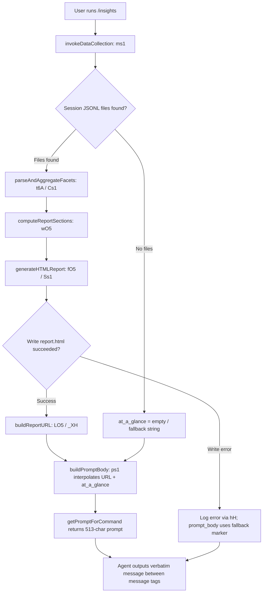

# `/insights`

> Analysis basis: CC v2.1.152 bundle.js (AST extraction + Claude interpretation)
> Minimum version: v2.1.152

---

## Overview

The `/insights` command generates a structured HTML usage report analyzing the user's Claude Code sessions, then instructs the agent to deliver a fixed confirmation message pointing to the report's location. The command collects session data from on-disk JSONL facets, processes and aggregates metrics (tool usage, error rates, response-time bands, time-of-day distribution, etc.), writes a self-contained `report.html` file, and finally invokes `getPromptForCommand` to build a prompt that causes the agent to output a single prescribed message verbatim.

---

## Registration

| Field | Value |
|---|---|
| type | `prompt` |
| name | `insights` |
| description | `Generate a report analyzing your Claude Code sessions` |
| loc_byte | `12817137` |
| loc_byte_end | `12818441` |
| loc_line | `11950` |
| handler_method | `getPromptForCommand` |
| handler_method_start | `12817311` |
| handler_method_end | `12818440` |
| prompt_body.length | `513` |
| prompt_body.trace | `call→ps1(...) (1 literals)` |
| arbor_handler.name | `getPromptForCommand` |
| arbor_handler.fqn | `claude-2.1.152::getPromptForCommand` |
| arbor_handler.kind | `Method` |
| arbor_handler.resolution_path | `direct` |
| arbor_handler.n_hits | `1` |

Analysis basis: CC v2.1.152 bundle.js:+12817137

---

## Input Branching

The handler has 4+ distinct internal paths (data present vs. absent, report generation success vs. failure, and the fallback "no insights" case), so a Mermaid flowchart is used.



Analysis basis: CC v2.1.152 bundle.js:+12817317 (handler entry), +12804180 (data collection), +12806148 (report generation), +12818343 (ps1 call)

---

## Behavioral Spec

### 1. Handler Entry — `getPromptForCommand`

The handler is an ObjectMethod registered directly on the command object (Arbor resolution: `direct`, `n_hits: 1`). On invocation it immediately calls the data-collection pipeline (`invokeDataCollection`) and the report-builder, then delegates prompt assembly to `buildPromptBody`.

```
async function getPromptForCommand(context):
    reportData = await invokeDataCollection(context)          // ms1
    prompt     = await buildPromptBody(reportData)            // ps1
    return { role: "user", content: prompt }
```

Analysis basis: CC v2.1.152 bundle.js:+12817311

---

### 2. Session Data Collection — `invokeDataCollection` (`ms1`)

Reads on-disk session data, filters to the most recent sessions, and populates per-session facet objects.

```
async function invokeDataCollection(context):
    projectDirs = await listProjectDirectories()              // JO5 → sd → "projects" literal
    // Limit: most recent 50 sessions (literal value 50 at +12804199),
    //        batch-processing up to 200 at a time (literal 200 at +12804204)
    sessionSlice = projectDirs.slice(0, RECENT_SESSION_LIMIT) // A.slice at +12804253
    results = await Promise.all(
        sessionSlice.map(dir => readSessionFacets(dir))       // B.map at +12804288
    )
    // Filter out MCP tool calls (prefix "mcp__" at +15182108)
    // Keep only assistant messages of type "tool_use"
    aggregated = aggregateResults(results)                    // ms1 internal
    return aggregated
```

Key constants:
- Recent session batch limit: **50** (bundle.js:+12804199)
- Maximum session scan window: **200** (bundle.js:+12804204)
- Facet file extension filter: **`.jsonl`** (bundle.js:+12887687)
- Data subdirectory names: `"usage-data"` (bundle.js:+12743132), `"session-meta"` (bundle.js:+12743228), `"facets"` (bundle.js:+12743182)

Analysis basis: CC v2.1.152 bundle.js:+12804180

---

### 3. Directory Enumeration — `listProjectDirectories` (`JO5`)

```
async function listProjectDirectories(baseDir):
    entries = await fs.readdir(baseDir)                      // Sh.readdir at +12803807
    dirs    = entries.filter(e => e.isDirectory())           // K.isDirectory at +12803875
    // Yield control every 10-9 entries to avoid blocking    // setImmediate at +12804087
    //   batch size literals: 10 at +12804057, 9 at +12804062
    dirs.sort(byModificationTimeDescending)                  // q.sort at +12804111
    return dirs
```

Analysis basis: CC v2.1.152 bundle.js:+12803788

---

### 4. Per-Session JSONL Reading — `readSessionJSONL` (`t86`)

```
async function readSessionJSONL(sessionDir):
    files = await fs.readdir(sessionDir)                     // d4.readdir at +12887581
    jsonlFiles = files.filter(f =>
        f.isFile() &&
        matchesJSONLExtension(f)                             // Xo → zd7.test at +6629043
    )
    stats    = await Promise.all(jsonlFiles.map(f => fs.stat(f)))  // d4.stat at +12887890
    parsed   = []
    for file in jsonlFiles:
        content = parseJSONLLines(file)                      // N at +12887989
        parsed.push(content)
    return parsed
```

Analysis basis: CC v2.1.152 bundle.js:+12887581

---

### 5. Session Facet Parsing — `parseSessionFacets` (`t6A` / `Cs1`)

Parses each JSONL line into a structured facet. Classifies tool calls, errors, and timing data.

```
function parseSessionFacets(lines):
    facets = []
    for line in lines:
        obj = JSON.parse(line)
        // Classify tool category:
        //   "WebSearch", "WebFetch" → web tools     (+12743825, +12743849)
        //   "Edit", "Write"         → edit tools    (+12743956, +12743968)
        //   "git commit", "git push"→ vcs actions   (+12744212, +12744244)
        //   else                    → "Other"        (+12744760)
        // Classify outcome:
        //   "rejected" / "doesn't want" → "User Rejected"  (+12744879, +12744903, +12744921)
        //   "exit code" / "Command Failed" → "Command Failed" (+12744828, +12744843)
        //   "string to replace not found" / "no changes" → "Edit Failed" (+12744956, +12744999, +12745015)
        //   "modified since read" → "File Changed"   (+12745048, +12745073)
        //   "exceeds maximum" / "too large" → "File Too Large" (+12745107, +12745138, +12745153)
        //   "file not found" / "does not exist" → "File Not Found" (+12745189, +12745219, +12745239)
        //   "[Request interrupted by user" → interrupted  (+12745313)
        // Assign time-of-day bucket based on getHours():
        //   Morning   6–12  (+12761198)
        //   Afternoon 12–18 (+12761245)
        //   Evening   18–24 (+12761299)
        //   Night     0–6   (+12761351)
        // Session duration cap: 3600 seconds (+12744629)
        facets.push(classifiedFacet)
    return facets
```

Analysis basis: CC v2.1.152 bundle.js:+12745902

---

### 6. Report HTML Generation — `generateHTMLReport` (`fO5` / `wO5`)

Assembles a self-contained HTML report from aggregated facet data. All numeric values are rounded via `Math.round`.

```
async function generateHTMLReport(aggregated):
    sections = []
    // Tool usage bar chart (colors: #2563eb, #0891b2, #10b981, #8b5cf6)
    //   at +12798015, +12798153, +12798325, +12798468
    sections.push(renderToolSection(aggregated.tools))       // wO5 / zMH at +12797993
    // Response-time distribution with buckets:
    //   "2-10s", "10-30s", "30s-1m", "1-2m", "2-5m", "5-15m", ">15m"
    //   at +12760350 … +12760410
    //   upper bound 120 s (+12760570), 900 s (+12760652)
    sections.push(renderResponseTimeSection(aggregated.timing))
    // Time-of-day usage pattern (Morning/Afternoon/Evening/Night)
    sections.push(renderTimeOfDaySection(aggregated.hourly)) // YO5 at +12801518
    // Error breakdown (red #dc2626, green #16a34a, yellow #eab308)
    //   at +12801731, +12801980, +12802473
    sections.push(renderErrorSection(aggregated.errors))
    // "Add to CLAUDE.md" suggestion link (+12765694)
    sections.push(renderSuggestionsSection(aggregated.suggestions))
    // at_a_glance summary string (+12757377)
    glance = buildAtAGlance(aggregated)
    html   = assembleHTML(sections, glance)                  // DO5 → CH at +12761926
    // Write output; token budget cap: 8192 chars (+12759519)
    outputPath = path.join(facetsDir, "report.html")         // literal at +12806437
    await fs.writeFile(outputPath, html)                     // Sh.writeFile at +12806465
    return { path: outputPath, glance }
```

Fallback when no data is present: renders `<p class="empty">No data</p>` (bundle.js:+12759841).

Analysis basis: CC v2.1.152 bundle.js:+12756736

---

### 7. Report URL Building — `buildReportURL` (`LO5` / `_XH`)

```
async function buildReportURL(reportPath):
    // Attempts to create a shareable URL via the insights upload endpoint
    // Uses SHA-1 hash (6 hex chars) for cache-busting: +9983513, +9983542, +9983557
    hash    = crypto.createHash("sha1")
                    .update(fileContents)
                    .digest("hex")
                    .slice(0, 6)
    uuid    = crypto.randomUUID()                            // XE6.randomUUID at +9983694
    // If upload succeeds → returns HTTPS URL
    // If upload fails or network unavailable → returns local file:// path
    return resolvedURL
```

Analysis basis: CC v2.1.152 bundle.js:+12750954

---

### 8. Prompt Assembly — `buildPromptBody` (`ps1`)

Constructs the 513-character prompt sent to the agent. The prompt:

1. States that the user ran `/insights`.
2. Embeds the full aggregated insights data object.
3. Provides `Report URL`, `HTML file` path, and `Facets directory` path.
4. Embeds the at-a-glance summary string (marked as agent-only context, not yet seen by user).
5. Instructs the agent to output **verbatim** the text between `<message>` tags — specifically a confirmation that the shareable insights report is ready, followed by a prompt asking the user whether they want to explore any section or act on suggestions.
6. If no insights were generated the fallback literal `"_No insights generated_"` is substituted (bundle.js:+12818208).

The separator literal `" · "` (bundle.js:+12817769) is used when joining summary fragments.

Analysis basis: CC v2.1.152 bundle.js:+12818343

---

### 9. JSON Serialization Helper (`CH`)

Used throughout the pipeline for safe JSON stringification of facet objects and HTML embedding.

```
function safeStringify(value):
    return JSON.stringify(value)   // JSON.stringify at +183087
```

Analysis basis: CC v2.1.152 bundle.js:+183087

---

## State & Side Effects

| Item | Detail |
|---|---|
| Telemetry | `tengu_transcript_phantom_parent` (+12873522), `tengu_relink_walk_broken` (+12853264), `tengu_chain_parent_cycle` (+12855033), `tengu_chain_timestamp_fallback` (+12855182), `tengu_chain_parallel_tr_recovered` (+12857048), `tengu_transcript_parent_cycle` (+12877085) |
| File writes | `report.html` written to the facets directory via `Sh.writeFile` (+12806465); usage-data and session-meta JSON files may be written by `KO5` / `AO5` |
| File reads | JSONL session files read via `d4.readFile` / `Sh.readFile`; existing report HTML read for hash computation |
| Directory creation | `Sh.mkdir` called with `recursive: true` for output directories (+12806178, +12749780, +12749023) |
| File deletions | Stale JSONL files may be unlinked via `d0K.unlinkSync` (+15360630) / `Sh.unlink` (+12748931) |
| appState changes | None directly in the handler; MCP server state is indirectly touched through the `f` / `yR5` / `dPK` call path (MCP client refresh) |
| Sound | None |
| Hook registration | None |
| Network | Optional upload to generate a shareable report URL (`_XH` / `l08`); gracefully degrades to local path if unavailable |

---

## Version History

| Version | Change |
|---|---|
| v2.1.152 | Initial analysis |

---

## Common Mistakes

1. **Running `/insights` with no prior sessions**: If no JSONL facet files exist, the report contains empty sections (`<p class="empty">No data</p>`) and the prompt uses the `"_No insights generated_"` fallback — the agent will still respond but with limited content.
2. **Expecting interactive input**: The command takes no arguments. It reads all session data automatically from the standard facets directory; there is no way to filter by project or date range from the CLI invocation.
3. **Confusing the report URL with a persistent link**: The shareable URL is content-addressed by a 6-hex-char SHA-1 prefix. If the underlying data changes (new sessions), re-running `/insights` produces a new URL.
4. **Assuming the agent will elaborate spontaneously**: The prompt instructs the agent to output the `<message>` block *verbatim* as its entire response. The agent will not add commentary unless the user explicitly follows up.
5. **Missing write permissions on the facets directory**: If `Sh.writeFile` fails for `report.html`, the pipeline logs the error via `hH` but still delivers the prompt; the user will receive an incomplete or missing report URL.

---

## Appendix — Identifier Mapping

> For bundle debugging only. Identifiers change across versions.

| Identifier | Role |
|---|---|
| `__handler_insights` | Synthetic BFS entry point for the `/insights` command handler |
| `ms1` | Main data-collection and report-orchestration function |
| `JO5` | Lists project session directories from the data store |
| `sd` | Resolves the base `"projects"` storage path |
| `t86` | Reads and filters per-session JSONL files |
| `Xo` | Tests whether a filename matches the `.jsonl` extension |
| `N` | JSONL line parser / message classifier |
| `qO5` | Reads a single usage-data JSON file |
| `a6A` | Resolves `session-meta` subdirectory path |
| `lI6` | Resolves `usage-data` subdirectory path |
| `bs1` | JSON parse wrapper for session files |
| `B6` | Safe JSON.parse helper |
| `lhH` | MCP client initialization / connection manager |
| `r6H` | MCP transport factory |
| `pV` | MCP capability resolver |
| `H` | Jitter-delay / random backoff helper |
| `e8` | MCP state machine step function |
| `iE6` | MCP auth-state check |
| `RbL` | MCP reconnect scheduler |
| `zM8` | MCP config update applier |
| `$M8` | MCP settings getter |
| `O8` | MCP debug log emitter |
| `EQ_` | MCP OAuth flow initiator |
| `VQ_` | MCP OAuth callback handler |
| `xJ1` | MCP tool-list fetcher |
| `TQ_` | MCP connection state poller |
| `qv_` | MCP transport-type checker |
| `j` | Active MCP process registry |
| `y` | MCP stdio write queue |
| `XL` | MCP error log emitter |
| `GH` | Error-to-string converter |
| `SJ1` | MCP server URL resolver |
| `rE6` | MCP retry-count parser |
| `Vd_` | MCP timeout parser |
| `dPK` | MCP server update applier |
| `bG8` | MCP config diff checker |
| `xI` | MCP client cleanup helper |
| `$` | Session snapshot manager |
| `Sn1` | Session metadata writer |
| `yR5` | MCP server refresh orchestrator |
| `DM8` | MCP server capability filter |
| `n8` | Async retry-with-timeout helper |
| `HH6` | MCP error serializer |
| `g` | Active conversation / branch registry |
| `RI8` | Session replay / chain builder |
| `w_H` | Conversation-chain walk / relink engine |
| `bO5` | Chain walk initialization |
| `m` | Per-session write-stream map |
| `tR` | Chain timestamp resolver |
| `K$A` | JSON patch / delta applier |
| `XJ` | Chain node linker |
| `O` | Background session registry |
| `J` | IPC message write helper |
| `X` | Stdio framing / buffer splitter |
| `P` | Remote connection wrapper |
| `G` | Auth-aware connection guard |
| `z` | Daemon control socket writer |
| `Y` | MCP server lifecycle controller |
| `D` | Background process memory monitor |
| `w` | Background worker process manager |
| `W` | Worktree state tracker |
| `T` | Keyboard / input event handler |
| `V` | Content-replacement tracker |
| `Q` | Fork-context reference store |
| `I` | Away-summary generator |
| `h` | Away-summary scheduler |
| `uH` | String-to-boolean converter |
| `Lz5` | Attribution-snapshot JSONL parser |
| `Mz5` | Attribution-snapshot header reader |
| `x` | Daemon idle-exit timer |
| `Yt1` | Conversation chain relink walker |
| `Kz5` | Compact-boundary JSONL parser |
| `KGH` | Base-64 encode/decode helper |
| `S` | Daemon supervisor reference |
| `eq` | Filesystem permission error handler |
| `hH` | Structured error logger |
| `s` | Notification dispatcher |
| `e` | Voice recording session manager |
| `c` | Generic cleanup callback |
| `d` | Background task registry |
| `r` | Task dependency graph node |
| `t` | Focus-silence timeout handler |
| `yt1` | Chain index get/set helper |
| `bLH` | Chain entry de-duplicator |
| `iO5` | Chain parallel-turn resolver |
| `rO5` | Chain branch sorter / merger |
| `lO5` | Chain queue shift/push scheduler |
| `AtH` | Session message mapper |
| `G8A` | Compact-boundary text extractor |
| `vN6` | Inline attachment / text-block extractor |
| `E8A` | Image/document content filter |
| `oO5` | Content-type "image" / "document" checker |
| `aO5` | Content array presence checker |
| `QI8` | Chain entry accumulator |
| `dI8` | Chain entry array-from-values helper |
| `o$5` | NaN-safe number parser |
| `t6A` | Session facet aggregator (top-level) |
| `Cs1` | Per-session facet parser and classifier |
| `R` | Daemon stdio relay / write helper |
| `cI6` | Tool-category classifier |
| `r$5` | File-extension extractor |
| `zwH` | Diff computation helper |
| `U4` | Array index-of lookup |
| `C` | Case-normalizer / toLowerCase wrapper |
| `s6A` | Warmup-minimal session marker |
| `KO5` | Facet JSON writer (usage-data path) |
| `CH` | Safe JSON.stringify wrapper |
| `_O5` | Facet file reader / unlinker |
| `SI8` | Storage path resolver (insights subdir) |
| `Us1` | Facet parse-or-skip guard |
| `LO5` | Report generation and URL orchestrator |
| `HO5` | Per-project report batch processor |
| `s$5` | Project-level facet assembler |
| `_XH` | Shareable report uploader |
| `EK` | Upload endpoint config resolver |
| `l08` | HTTP report upload handler |
| `T8` | Upload request builder |
| `PRH` | Upload response parser |
| `gG` | Upload error logger |
| `Rs1` | Local report path builder |
| `PZ` | Storage root resolver |
| `JK` | HTTP response status filter |
| `n_` | Error string normalizer |
| `AO5` | Facet JSON writer (session-meta path) |
| `XO5` | Object-keys metrics extractor |
| `us1` | Statistical aggregator (median, percentile) |
| `s86` | Metric entry serializer |
| `L9` | String slice-by-index helper |
| `xs1` | Sorted-set / percentile calculator |
| `fO5` | HTML report section assembler |
| `Ss1` | Report section renderer |
| `c$5` | Report storage path resolver |
| `wO5` | Full HTML document builder |
| `Z5` | HTML entity escaper |
| `f5` | String replaceAll escaper |
| `hI8` | Markdown-to-HTML inline converter |
| `DO5` | HTML template injector |
| `zMH` | Tool-usage bar-chart renderer |
| `zO5` | Metric max-value normalizer |
| `YO5` | Time-of-day bar renderer |
| `ps1` | Prompt-body interpolator (builds the 513-char prompt) |