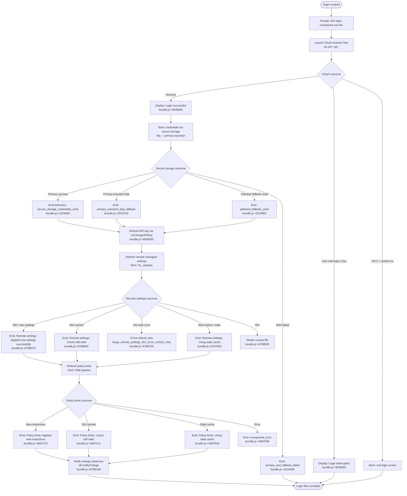

# `/login`

> Analysis basis: CC v2.1.152 bundle.js (AST extraction + Claude interpretation)
> Minimum version: v2.1.152

---

## Overview

The `/login` command initiates the Anthropic account authentication flow from within an active Claude Code session. It allows users to switch between Anthropic accounts or sign in for the first time by launching an OAuth browser flow, storing credentials securely, and then refreshing all dependent subsystems (API key, remote settings, policy limits) without restarting the CLI.

---

## Registration

| Field | Value |
|---|---|
| type | `local-jsx` |
| name | `login` |
| description | `Switch Anthropic accounts \| Sign in with your Anthropic account` |
| loc_byte | `11326984` |
| loc_byte_end | `11327217` |
| loc_line | `9383` |
| module_id | `G11` |
| load_inline | `true` |
| arbor_handler.name | `Xk1` |
| arbor_handler.fqn | `claude-2.1.152::Xk1` |
| arbor_handler.kind | `Function` |
| arbor_handler.resolution_path | `direct` |
| arbor_handler.n_hits | `2` |

Analysis basis: CC v2.1.152 bundle.js:+11326984

---

## Input Branching

The `/login` command has multiple distinct flow branches depending on: whether login completes successfully, whether it is interrupted, and downstream outcomes such as credential storage method and policy/settings refresh results. A Mermaid flowchart is used.



---

## Behavioral Spec

### 1. Component Rendering and OAuth Initiation

The handler resolved by Arbor as `Xk1` (registered directly within the byte range `11326984`–`11327217`) renders a JSX component via `Ya.createElement`. The component mounts internal state via React hooks and launches the OAuth browser-based sign-in flow.

```
function loginCommandHandler(appState):
    component = createElement(LoginComponent, { appState })
    return component

function LoginComponent(props):
    [loginState, dispatchLoginState] = useReducer(loginReducer, INITIAL)
    useEffect(() => subscribeToAuthEvents(), [])
    launchOAuthFlow()
```

Analysis basis: CC v2.1.152 bundle.js:+9036004

---

### 2. OAuth Flow Execution (oauthFlowRunner / siH)

The primary OAuth orchestrator (`siH`) coordinates the full sign-in sequence:

1. Reads current app state to determine environment (`prod`, `staging`, `local`).
2. Resolves the OAuth endpoint — `prod` uses the standard Anthropic OAuth URL; `staging`/`local` environments use localhost variants (`http://localhost:8000`, `http://localhost:4000`, `http://localhost:3000`).
3. Enforces that `CLAUDE_CODE_CUSTOM_OAUTH_URL`, if set, must be an approved endpoint — otherwise throws `"CLAUDE_CODE_CUSTOM_OAUTH_URL is not an approved endpoint."` (bundle.js:+949824).
4. If `CLAUDE_TRUSTED_DEVICE_TOKEN` env var is set, skips trusted-device enrollment (bundle.js:+6750680).
5. Waits for policy limits to load (`K.waitForPolicyLimitsToLoad`).
6. Checks policy allow/enforce state (`K.isPolicyAllowed`, `K.isPolicyEnforced`).
7. Posts enrollment payload to `c_.post` with `Content-Type: application/json`, 10 000 ms timeout, 500 ms retry window (bundle.js:+6751392, bundle.js:+6751418).
8. On HTTP 201 response, extracts `device_token`; missing token emits `missing_token` telemetry (bundle.js:+6751878).
9. Stores resulting token via the secure-storage writer (`hfq`).

```
async function oauthFlowRunner(appState):
    env = resolveEnvironment(appState)          // "prod" | "staging" | "local"
    oauthUrl = resolveOAuthEndpoint(env)
    if CLAUDE_TRUSTED_DEVICE_TOKEN is set:
        log("[trusted-device] env var set, skipping enrollment")
        return
    if essentialTrafficOnly(appState):
        log("[trusted-device] Essential traffic only, skipping enrollment")
        return
    if not hasOAuthToken(appState):
        log("[trusted-device] No OAuth token, skipping enrollment")
        return
    await K.waitForPolicyLimitsToLoad()
    response = await post(oauthUrl, payload, {
        timeout: 10000,
        headers: { "Content-Type": "application/json" }
    })
    if response.status == 201:
        token = response.body.device_token
        if not token:
            emitTelemetry("missing_token")
        else:
            storeCredentials(token)
    elif response.status >= 400:
        emitTelemetry("http_error", { status: response.status })
```

Analysis basis: CC v2.1.152 bundle.js:+6750121, bundle.js:+6751204, bundle.js:+6751580

---

### 3. Credential Storage (secureCredentialWriter / hfq)

The credential writer attempts primary keychain storage first, then falls back to plaintext.

```
async function secureCredentialWriter(credentials):
    try:
        result = await primaryKeychainWrite(credentials)
        if result == "transient_skip":
            emitLiteral("primary_transient_skip_fallback")
            writePlaintextFallback(credentials)
            emitLiteral("plaintext_fallback_used")
        else:
            emitLiteral("secure_storage_credentials_write")
    catch error:
        try:
            writePlaintextFallback(credentials)
            emitLiteral("plaintext_fallback_used")
        catch fallbackError:
            emitLiteral("primary_and_fallback_failed")
```

Analysis basis: CC v2.1.152 bundle.js:+2223655, bundle.js:+2223753, bundle.js:+2223902, bundle.js:+2224005

---

### 4. API Key Change Propagation (apiKeyChangeHandler / hP8 → H.onChangeAPIKey)

After credential storage succeeds, the API key change callback is fired:

```
function propagateApiKeyChange(newKey):
    H.onChangeAPIKey(newKey)            // notifies all key consumers
    applyMessageOperation("update")    // updates in-flight session state
```

Analysis basis: CC v2.1.152 bundle.js:+9035655, bundle.js:+9035697

---

### 5. Remote Managed Settings Refresh (remoteSettingsRefresher / MrH → IN_)

After API key propagation, the remote-settings pipeline refreshes:

```
async function remoteSettingsRefresher():
    log("Remote settings: Refreshed after auth change")   // bundle.js:+6789344
    fetchResult = await fetchRemoteSettings({
        headers: {
            "User-Agent": userAgentString,
            "If-None-Match": cachedETag
        }
    })
    match fetchResult.status:
        200:
            validated = validateSettingsFormat(fetchResult.body)
            if not validated:
                throw "Invalid remote settings format"
            applySettings(validated)
            log("Remote settings: Applied new settings successfully")
        204:
            log("Remote settings: Applied new settings successfully")
        304:
            log("Remote settings: Cache still valid (304 Not Modified)")
        401:
            emitTelemetry("tengu_remote_settings_401_force_refresh_retry")
            // triggers security dialog flow
        404:
            deleteLocalCacheFile()
            log("Remote settings: Deleted cached file (404 response)")
        else:
            if cachedSettingsAvailable:
                log("Remote settings: Using stale cache after fetch failure")
            emitTelemetry("remote_managed_settings_fetch_failed")
    JR.notifyChange("policySettings")
```

HTTP status codes handled: 200, 204, 304, 401, 404 (bundle.js:+6785711–6785738).

Security dialog shown when new settings require user approval: emits `tengu_managed_settings_security_dialog_shown` (bundle.js:+6782854). If user rejects: `"Remote settings: User rejected new settings, using cached settings"` (bundle.js:+6788240).

Analysis basis: CC v2.1.152 bundle.js:+6787469, bundle.js:+6789333, bundle.js:+6785591

---

### 6. Policy Limits Refresh (policyLimitsRefresher / Kw6 → D99)

In parallel with remote settings, policy limits are reloaded:

```
async function policyLimitsRefresher():
    log("Policy limits: Refreshed after auth change")    // bundle.js:+4698553
    buildAuthHeaders()    // "anthropic-beta: oauth" or "x-api-key"
    response = await fetchPolicyLimits()
    emitTelemetry("tengu_policy_limits_fetch")
    match response:
        304:
            log("Policy limits: Cache still valid (304 Not Modified)")
        new_data:
            if empty:
                log("Policy limits: No restrictions (cached empty)")
            else:
                applyPolicyRestrictions(response.data)
                log("Policy limits: Applied new restrictions successfully")
        fetch_failure:
            if staleCache:
                log("Policy limits: Using stale cache after fetch failure")
                emit("stale_cache_used")
            emit("request_failed")
        error:
            log("Policy limits: Using stale cache after error")
            emit("unexpected_error")
```

Authentication headers use `"anthropic-beta": "oauth"` when an OAuth token is available; otherwise fall back to `"x-api-key"` (bundle.js:+4694560, bundle.js:+4694703). If neither is available, the error `"No authentication available"` is raised (bundle.js:+4694783).

Analysis basis: CC v2.1.152 bundle.js:+4696826, bundle.js:+4697372, bundle.js:+4697043

---

### 7. Background Polling Restart (backgroundPoller / kI9 → ql7 / AK8)

After login the background polling loops for both remote settings and policy limits are restarted:

```
function restartBackgroundPollers():
    clearInterval(existingRemoteSettingsInterval)
    clearInterval(existingPolicyLimitsInterval)
    newRemoteInterval = setInterval(remoteSettingsPollCycle, POLL_INTERVAL)
    newPolicyInterval = setInterval(policyLimitsPollCycle, POLL_INTERVAL)
    registerUnrefHandles(newRemoteInterval, newPolicyInterval)
```

Analysis basis: CC v2.1.152 bundle.js:+6789853, bundle.js:+4692389

---

### 8. UI Feedback Strings

| Situation | Displayed String | loc_byte |
|---|---|---|
| Login completed | `"Login successful"` | `+9036063` |
| Login interrupted | `"Login interrupted"` | `+9036082` |
| Cancel hint | `"Press "` + key + `" again to exit"` | `+9036440` / `+9036459` |
| Escape action label | `"Esc"` + `"cancel"` | `+9036546` / `+9036564` |
| Title | `"Login"` | `+9036988` |

Analysis basis: CC v2.1.152 bundle.js:+9036063

---

### 9. Session Cleanup on Interruption (sessionCleanup / $EH → kgH)

If the user exits mid-flow, the cleanup routine runs:

```
function cleanupOnInterrupt():
    process.off("exit")
    clearAllIntervals()    // clears: MzH, X68, kO6, O$_, TQ
    J$_.clearInterval()
    process.removeListener("beforeExit", ...)
    IgH.emit("cleanup")
    resetSessionState()
```

Analysis basis: CC v2.1.152 bundle.js:+9035754, bundle.js:+3182103

---

## State & Side Effects

| Item | Detail |
|---|---|
| Telemetry — remote settings 401 | `tengu_remote_settings_401_force_refresh_retry` (bundle.js:+6786720) |
| Telemetry — feature flag bad | `tengu_feature_bad` (bundle.js:+964577) |
| Telemetry — feature flag ok | `tengu_feature_ok` (bundle.js:+964519) |
| Telemetry — feature flag sad | `tengu_feature_sad` (bundle.js:+964654) |
| Telemetry — managed settings dialog shown | `tengu_managed_settings_security_dialog_shown` (bundle.js:+6782854) |
| Telemetry — managed settings accepted | `tengu_managed_settings_security_dialog_accepted` (bundle.js:+6782538) |
| Telemetry — managed settings rejected | `tengu_managed_settings_security_dialog_rejected` (bundle.js:+6782588) |
| Telemetry — policy limits fetch | `tengu_policy_limits_fetch` (bundle.js:+4696826) |
| Telemetry — bypass permissions mode | `tengu_disable_bypass_permissions_mode` (bundle.js:+10406896) |
| Telemetry — auto mode config | `tengu_auto_mode_config` (bundle.js:+10404923) |
| Telemetry — daemon config reload | `tengu_daemon_config_reload` (bundle.js:+15397117) |
| appState changes | API key updated via `H.onChangeAPIKey`; `H.setAppState` called (bundle.js:+9035916); permission mode refreshed |
| Hook registration | `q_.registerHandler` for keyboard interrupt (`Ctrl-C`, `Ctrl-D`); `process.removeListener("beforeExit")` on cleanup |
| Secure storage | Primary keychain write attempted; plaintext fallback on failure; telemetry emitted for each path |
| File I/O | Remote settings cache file written via `A.writeFile` + `A.datasync`; deleted on 404 (bundle.js:+6787109, bundle.js:+6788519) |
| Polling | `setInterval` / `clearInterval` cycles restarted for remote settings and policy limits after successful login |
| Notifications | `JR.notifyChange("policySettings")` fired after settings applied (bundle.js:+6789439, bundle.js:+6789771) |
| Sound | <!-- TODO: not found in depth-2 traversal; needs --depth 4 --> |

---

## Version History

| Version | Change |
|---|---|
| v2.1.152 | Initial analysis |

---

## Common Mistakes

1. **Invoking `/login` inside a non-AppStateProvider context** — The component depends on `AppStateProvider`; calling it outside will throw `"useAppState/useSetAppState cannot be called outside of an <AppStateProvider />"` (bundle.js:+3765668).
2. **Setting `CLAUDE_CODE_CUSTOM_OAUTH_URL` to an unapproved endpoint** — The flow validates this at runtime and throws immediately; only known approved URLs pass (bundle.js:+949824).
3. **Expecting immediate policy limit availability** — Policy limits load asynchronously; the flow explicitly calls `K.waitForPolicyLimitsToLoad()`. If this times out, the log message `"Policy limits: Loading promise timed out, resolving anyway"` is emitted and the flow continues (bundle.js:+4693547).
4. **Assuming plaintext storage is silent** — Plaintext fallback emits `plaintext_fallback_used` telemetry and should be treated as a degraded state, not a silent success.
5. **Interrupting login with `Esc` vs `Ctrl-C`** — `Esc` emits `"cancel"` and shows `"Login interrupted"` with a clean teardown; `Ctrl-C` triggers the full session-interrupt cleanup path including `process.removeListener` and interval clearing.

---

## Appendix — Identifier Mapping

> For bundle debugging only. Identifiers change across versions.

| Identifier | Role |
|---|---|
| `Xk1` | Arbor-resolved login command handler (top-level entry point) |
| `hP8` | Login component main render/effect coordinator |
| `pbH` | Timestamp utility (wraps `Date.now`) |
| `MrH` | Remote managed settings refresh orchestrator (post-login) |
| `yI9` | Settings sub-utility A |
| `VN_` | Settings sub-utility B (calls `RNA`) |
| `RNA` | Remote notification helper |
| `vo` | API provider resolution / base URL selector |
| `V9H` | Async file/promise utility |
| `St` | Settings state accessor |
| `yA` | String/API type normalizer |
| `uH` | String coercion utility |
| `TWH` | HTTP client wrapper |
| `C$` | Config reader |
| `sL` | Session-level state accessor |
| `IZ` | Settings validator (calls `lq`) |
| `F$6` | Secondary validator (calls `lq`) |
| `JO` | API key resolution and env-var reader |
| `A4` | String utility (wraps `uH`) |
| `vN` | Flag settings parser |
| `C$6` | Config merge utility |
| `QJ` | Query/join utility |
| `QbH` | VSCode integration check (checks `"claude-vscode"`) |
| `r56` | File descriptor key reader (`CLAUDE_CODE_API_KEY_FILE_DESCRIPTOR`) |
| `x6` | Auth token builder / timestamp stamper |
| `SS` | Token slicer (last 20 chars, bundle.js:+2063856) |
| `vN_` | Policy settings notifier (calls `JR.notifyChange`) |
| `hH` | Error queue handler / log flusher |
| `n_` | Error/string coercion helper |
| `V1` | Log queue manager (calls `mGA`) |
| `UtK` | Queue shift/push operator (`tp6`) |
| `IN_` | Remote settings full fetch-and-apply pipeline |
| `N` | Path/environment resolution utility |
| `OyK` | File path utility (calls `dv`, `$yK`, `xMA`) |
| `CH` | JSON stringify wrapper |
| `j4` | Path redaction utility (replaces sensitive segments with `"[REDACTED]"`) |
| `VxH` | Settings structure validator (calls `e3A`) |
| `DyK` | Cache file writer with buffer/sync |
| `u3H` | Cache state accessor + clearer |
| `T_4` | Array/object normalizer |
| `Wz` | Dual-cache clearer (`FS6.clear`, `eC8.clear`) |
| `FN9` | SHA-256 hash builder for settings fingerprint |
| `MN_` | Recursive settings mapper (self-calls) |
| `Hl7` | Remote settings HTTP request handler |
| `tc7` | HTTP client builder |
| `NI9` | Remote settings response parser (handles 200/204/304/401/404) |
| `f6H` | Exponential back-off delay calculator |
| `n8` | Async retry wrapper with abort/timeout |
| `mH` | Session context reader |
| `c` | Base context accessor |
| `omH` | Optional managed settings hook |
| `SH` | State hydration helper |
| `VI9` | Settings deep-clone pair (`KP` / `$b`) |
| `KP` | `structuredClone` wrapper |
| `$b` | Lazy loader pair (`q_4`, `L_4`) |
| `GI9` | Security-dialog gating flow for new managed settings |
| `Of8` | Settings key enumerator |
| `_rH` | Settings entry diffing utility |
| `rN9` | Settings serialization for dialog display |
| `_Z` | Dialog state manager |
| `WI9` | Dialog render helper |
| `nc7` | Dialog wait queue (`LrH` push/filter) |
| `np` | Permission write trigger |
| `q` | File unlink (settings cache deletion) |
| `A` | Lowercase normalizer |
| `Lc` | Callback coordinator (`cc7`) |
| `TI9` | User-rejection handler for managed settings |
| `hK` | Rejection state recorder |
| `_l7` | Atomic file writer (open → writeFile → datasync → close; buffer size 384 bytes, encoding `"utf-8"`) |
| `a76` | Path joiner (`SNA.join` + `l8`) |
| `L8` | Error recovery logger |
| `kI9` | Background poller restarter |
| `AK8` | `setInterval` / `clearInterval` wrapper |
| `ql7` | Remote-settings poll cycle function |
| `tq` | Cleanup registration (`CMA.register`) |
| `Kw6` | Policy limits refresh orchestrator |
| `M2_` | Policy limits state manager (clears timeout) |
| `D2_` | Policy limits state initializer |
| `OvH` | Auth-type detector |
| `wMq` | OAuth token presence check |
| `lFH` | Limits response merger |
| `KK8` | Policy limits timeout guard |
| `jx` | Policy limits HTTP client |
| `LK8` | Policy cache path builder |
| `fK8` | Policy limits full fetch flow |
| `D99` | Policy limits fetch, cache, and apply |
| `f2_` | Cache file reader (`O99.readFileSync`) |
| `TG7` | Policy limits hash builder (`$99.createHash`) |
| `Y99` | Policy limits response handler |
| `ZG7` | Policy limits back-off + retry |
| `H8` | Miscellaneous context helper |
| `VG7` | Policy limits cache file writer |
| `j99` | Policy limits poll cycle |
| `IG7` | Poll-cycle inner body |
| `_zH` | Session interrupt handler reference |
| `$EH` | Session cleanup coordinator |
| `oe` | OAuth provider resolver |
| `Qb` | OAuth flow launcher |
| `QS` | OAuth URL builder |
| `kgH` | Full cleanup executor (clears intervals, removes process listeners) |
| `J$_` | Interval + listener remover |
| `qN_` | App-state-change subscriber setup |
| `E_` | Event system initializer |
| `AS6` | Async event binder |
| `gO` | Generic observer utility |
| `b7H` | Auth-event broadcaster |
| `E6` | Auth-change event emitter |
| `hO6` | Current OAuth token reader |
| `SO6` | Session OAuth state checker |
| `P68` | API key caching layer |
| `gK` | Keyboard input reader (wraps `hfq`) |
| `hfq` | Secure credential writer (primary keychain + plaintext fallback) |
| `DTH` | Async read update utility |
| `siH` | OAuth enrollment flow (trusted-device logic) |
| `db` | Post-login enrollment submitter |
| `smq` | Feature-flag-gated enrollment helper |
| `L` | Feature value reader |
| `HN_` | Post-auth state resetter |
| `K` | Policy object with `waitForPolicyLimitsToLoad`, `isPolicyAllowed`, `isPolicyEnforced` |
| `M` | Process stream handler |
| `Cq` | OAuth URL validator |
| `y0A` | Environment config reader |
| `hsK` | Approved endpoint list checker |
| `GH` | String coercer (wraps `String`) |
| `J11` | Inline hook: session ID accessor |
| `NT6` | App-state hydration on login complete |
| `yP8` | Auth state reader (calls `j$_`) |
| `j$_` | OAuth/key composite state builder |
| `WIH` | Permission state loader (calls `bf`) |
| `bf` | Permission map manager |
| `qf` | Permission entry builder |
| `V_` | Tool allow/disallow list reader |
| `uT8` | Allowed tools state accessor |
| `sA` | Tool list normalizer |
| `mT8` | Disallowed tools state accessor |
| `Bp_` | Post-login banner renderer |
| `IT6` | Interactive permission UI coordinator |
| `kT6` | Full permission/mode settings apply |
| `ae` | Auth event watcher |
| `W68` | Auth-change → smq bridge |
| `uc_` | Permission mode validator |
| `xc_` | Mode coercion helper |
| `g9` | Model name resolver |
| `He` | Model validation entry |
| `H1` | Model alias normalizer (handles `"opusplan"`, `"sonnet"`, `"haiku"`, `"opus"`, `"best"`) |
| `_X` | Model name + alias dispatcher |
| `cFH` | Claude version/model family validator |
| `P9` | Inference profile detector (`"application-inference-profile"`) |
| `wH6` | UI spinner/loader (`Zg`) |
| `Y` | Output renderer (supervisor / heartbeat) |
| `rPH` | Output row builder |
| `Ao1` | Column width calculator |
| `T` | Key intercept handler |
| `Z` | Spinner lifecycle manager |
| `JGK` | Heartbeat emitter (`"heartbeat"`) |
| `V` | Secondary spinner |
| `Y5H` | Mode-gate notification UI |
| `th` | Layout helper |
| `x4H` | Audit event emitter (`L4`) |
| `L4` | Event log writer |
| `z5H` | Permission map enumerator |
| `F0L` | Top-level login JSX element factory |
| `dJH` | Login dialog container component |
| `jw` | Login inner form component |
| `J6` | App state context reader |
| `lD_` | Context guard (throws if outside `AppStateProvider`) |
| `j11` | Login form state machine (reducer + effects) |
| `ZQ` | Auth event subscription setup |
| `cmq` | Async auth event dispatcher |
| `H0` | Token/model context builder |
| `TA` | Conversation context accessor |
| `sD` | Message chain builder |
| `Pb` | Array inclusion checker |
| `Ke` | Context max-token resolver |
| `O1` | Token limit lookup |
| `e$H` | Extended context checker |
| `DQ` | Default quota resolver |
| `fBH` | Fallback token resolver |
| `ovq` | Base token fallback |
| `PZ` | Token range builder |
| `u3` | Token range utility |
| `K3` | Token bucket constructor |
| `VP` | Token+model composite builder |
| `$1H` | String hash builder |
| `O1H` | Context limit selector |
| `JN` | Nested token range builder |
| `AD` | Permission dialog context reader |
| `q_` | Global keyboard handler registration |
| `iw` | Layout context reader |
| `OM` | Interrupt/exit UI controller |
| `Ztq` | Ctrl-C / Ctrl-D handler root |
| `hj_` | Key intercept component (handles `"app:interrupt"`, `"app:exit"`) |
| `HR` | Debounced key handler |
| `f` | Active task tracker |