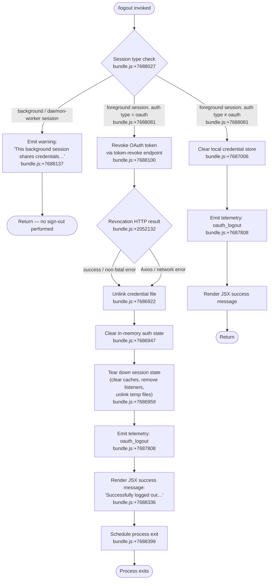

# `/logout`

> Analysis basis: CC v2.1.152 bundle.js (AST extraction + Claude interpretation)
> Minimum version: v2.1.152

---

## Overview

The `/logout` command signs the user out of their Anthropic account by revoking the active OAuth token on the server, clearing local credential storage, tearing down session state, and exiting the CLI process. It detects background/daemon sessions and emits an informational warning instead of performing the sign-out when the credentials are shared with a foreground session.

---

## Registration

| Field | Value |
|---|---|
| type | `local-jsx` |
| name | `logout` |
| description | Sign out from your Anthropic account |
| loc_byte | 11327278 |
| loc_byte_end | 11327466 |
| loc_line | 9383 |
| module_id | `qQ9` |
| load_inline | `true` |
| arbor_handler.name | `DLL` |
| arbor_handler.fqn | `claude-2.1.152::DLL` |
| arbor_handler.kind | `AsyncFunction` |
| arbor_handler.resolution_path | `module_id` |
| arbor_handler.n_hits | 0 |

Analysis basis: CC v2.1.152 bundle.js:+11327278

---

## Input Branching

The command has three distinct top-level branches: background/daemon session detection, OAuth-authenticated logout flow, and non-OAuth (API-key) session handling. A Mermaid flowchart is therefore used.



---

## Behavioral Spec

### 1. Handler Entry Point (`DLL`)

The Arbor-resolved handler is the async function `DLL` (fqn: `claude-2.1.152::DLL`, reached via `module_id` → `qQ9`). On invocation it immediately reads the current session-type flag via `checkSessionType` (`u9` / `_OH`).

```
async function handleLogout(context):
    sessionType = checkSessionType()          // u9 → _OH  :+7688027
    if sessionType in {"bg", "daemon", "daemon-worker"}:
        renderWarning(BACKGROUND_WARNING_MSG) // :+7688137
        return

    authType = readAuthType()                 // H  :+7688135
    if authType == "oauth":
        await performOAuthLogout(context)     // fW6  :+7688100
    else:
        await clearLocalCredentials(context)  // gK  :+7687006

    emitSHA("oauth_logout")                   // SH  :+7687808
    renderSuccessUI()                         // kS_.createElement  :+7688311
    scheduleExit()                            // setTimeout  :+7688399
```

Analysis basis: CC v2.1.152 bundle.js:+7688027

---

### 2. Background Session Guard

The process-role flag is compared against the string constants `"bg"` (bundle.js:+2194946), `"daemon"` (bundle.js:+2194956), and `"daemon-worker"` (bundle.js:+2194970). When any of these match, the full warning string — beginning `"This background session shares credentials…"` — is displayed and the function returns early without touching credentials.

```
function checkSessionType():                  // u9 → _OH  :+2195023
    return process.env role marker            // one of "bg" | "daemon" | "daemon-worker" | foreground
```

Analysis basis: CC v2.1.152 bundle.js:+7688027, +2194946

---

### 3. OAuth Token Revocation (`performOAuthLogout` / `fW6`)

When the auth type is `"oauth"`, the main logout worker (`fW6`) is invoked. Its steps in order:

```
async function performOAuthLogout():
    // Step 1 — resolve a Promise immediately (sentinel)   :+7686892
    await Promise.resolve()

    // Step 2 — unlink on-disk credential file             :+7686922
    unlinkCredentialFile()     // q → d0K.unlinkSync       :+15360630

    // Step 3 — clear in-memory auth state                 :+7686947
    clearAuthState()           // u9 → _OH

    // Step 4 — full session teardown                      :+7686959
    tearDownSession()          // MW6 (see §4)

    // Step 5 — clear API client config                    :+7686979
    clearApiClientConfig()     // yA → uH

    // Step 6 — clear credential store / keychain          :+7687006
    clearCredentialStore()     // gK → hfq

    // Step 7 — persist updated config (writes ~./claude.json)  :+7687046
    await persistConfig()      // L.readAsync

    // Step 8 — send token-revoke HTTP request             :+7687101
    await revokeTokenRemote()  // C8_ (see §5)

    // Step 9 — reload config file from disk               :+7687181
    reloadConfig()             // ls

    // Step 10 — save global config snapshot               :+7687196
    saveGlobalConfig()         // tM_ → M8

    // Step 11 — mutate app state store                    :+7687224
    appStore.mutate(...)       // K.mutate

    // Step 12 — render finalizing message                 :+7687379
    renderExitMessage()        // hH

    // Step 13 — delete session key from store             :+7687398
    appStore.delete(...)       // K.delete

    // Step 14 — record subscription-switch marker         :+7687653
    recordMarker("subscription-switch")
```

Analysis basis: CC v2.1.152 bundle.js:+7686892

---

### 4. Session Teardown (`tearDownSession` / `MW6`)

```
function tearDownSession():
    clearEventEmitter()        // eX6  :+7687885
    clearFileHandles()         // lFH  :+7687891
    clearUvqCache()            // Oe6 → Uvq.clear  :+2934325
    clearZH()                  // _zH  :+7687903

    // Flush event bus and remove process listeners
    flushEventBus()            // $EH → oe → IgH.emit  :+3181856
                               //     → kgH (clears MzH, X68, kO6, O$_, TQ)
                               //     → J$_ (clearInterval, process.removeListener)
                               //     → process.off  :+3181984

    // Delete MCP / temp socket files
    deleteTempFiles()          // II9 → TIH.unlink  :+6787418

    // Remove lock files / PID files
    removeLockFiles()          // Y2_ → qw6.unlink  :+4698636
```

Analysis basis: CC v2.1.152 bundle.js:+7687885

---

### 5. Remote Token Revocation (`revokeTokenRemote` / `C8_`)

```
async function revokeTokenRemote():
    payload = buildRefreshTokenPayload()   // value "refresh_token"  :+2051987
    headers = {
        "Content-Type": "application/json" // :+2052042/:+2052057
    }
    timeout = 5000                         // ms  :+2052085

    try:
        response = await httpClient.post(  // c_.post  :+2051927
            tokenRevokeEndpoint,           // telemetry label "oauth_token_revoke"  :+2052095
            payload, {headers, timeout}
        )
    except AxiosError:                     // c_.isAxiosError  :+2052132
        // Log network error; do not block logout   :+2052219
        logNetworkError()
        return

    // On success, write result to secure store
    writeResult()                          // SH  :+2052092
    updateHttpClientState()                // H8  :+2052264
```

Analysis basis: CC v2.1.152 bundle.js:+7687101

---

### 6. Credential Store Clearance (`clearCredentialStore` / `gK` → `hfq`)

The credential-store helper (`hfq`) abstracts both a primary secure-storage backend and a plaintext fallback:

```
function clearCredentialStore():
    primary = getPrimaryStore()            // H.read / H.readAsync  :+2223278
    fallback = getFallbackStore()          // _.read / _.readAsync  :+2223327

    try:
        primary.delete(credentialKey)      // H.delete  :+2223846
        emitTelemetry("secure_storage_credentials_write")  // :+2223655
    except:
        // Record "primary_transient_skip_fallback"        :+2223753
        if fallbackExists:
            fallback.delete(credentialKey) // _.delete  :+2223634
            emitTelemetry("plaintext_fallback_used")       :+2223902
        else:
            emitTelemetry("primary_and_fallback_failed")   :+2224005

    await Promise.all([...pendingWrites])  // :+2224110
```

Analysis basis: CC v2.1.152 bundle.js:+7687006

---

### 7. Process Exit Sequencing (`scheduleExit` / `hK` → `q9`)

After rendering the success message, a `setTimeout` (bundle.js:+7688399) triggers exit sequencing. The exit helper (`q9`) performs an ordered shutdown:

```
async function exitSequencer(exitCode):
    writeExitFrame()           // kNH → DwH.writeSync  :+5316314
    unmountInkUI()             // kNH → H.unmount      :+5316392
    printFinalLines()          // vZ_ → DwH.writeSync  :+5316784
    startExitTimeout()         // setTimeout  :+5318511  (3500 ms  :+5318564)
    exitTimeoutRef.unref()     // wwH.unref  :+5318573

    await drainTelemetryQueue()// abH → CMA.drain  :+58704
    await Promise.race([
        allShutdownTasks(),    // VL8 → Promise.all  :+5318002
        exitTimeout            // 2000 ms safety  :+5318742
    ])

    clearTimeout(exitTimeoutRef)  // :+5318754
    processExitOrKill()        // NZ_ → process.exit / process.kill("SIGKILL")
                               //        :+5316992 / :+5317017
```

Analysis basis: CC v2.1.152 bundle.js:+7688399

---

### 8. Config Persistence Safety (`saveGlobalConfig` / `tM_` → `M8` → `S$_`)

The config write path contains an auth-loss prevention guard:

```
function saveGlobalConfigWithLock():
    acquireLock()                          // S$_ → L.mkdirSync  :+3201180
    if lockAcquisitionTooSlow:
        emitTelemetry("tengu_config_lock_contention")  // :+3201453
        // Warning: "Lock acquisition took longer…"    :+3201364

    reRead = readConfigFromDisk()          // zzH → q.readFileSync  :+3203453
    if cachedConfig.hasAuth and not reRead.hasAuth:
        // Refuse to write; emit guard telemetry
        emitTelemetry("tengu_config_auth_loss_prevented")  // :+3201932
        // Log: "saveGlobalConfig fallback: re-read config is missing auth…"  :+3198661
        return

    writeAtomically(config)               // z76 → Vf.writeFileSync  :+1010911
    createBackup(config)                  // zzH → q.copyFileSync  :+3204536
```

Analysis basis: CC v2.1.152 bundle.js:+7687196

---

## State & Side Effects

| Item | Detail |
|---|---|
| Telemetry — oauth_logout | Fired unconditionally after credential clearance (bundle.js:+7687808) |
| Telemetry — tengu_feature_ok / tengu_feature_sad / tengu_feature_bad | Fired by secure-storage helper on write outcomes (bundle.js:+964519, +964654, +964577) |
| Telemetry — tengu_config_lock_contention | Fired when config lock acquisition is slow (bundle.js:+3201453) |
| Telemetry — tengu_config_stale_write | Fired on stale config write attempt (bundle.js:+3201589) |
| Telemetry — tengu_config_auth_loss_prevented | Fired when write is refused to prevent auth wipe (bundle.js:+3201932) |
| Telemetry — tengu_config_parse_error | Fired on config JSON parse failure during re-read (bundle.js:+3204028) |
| Telemetry — tengu_daemon_config_reload | Fired when daemon reloads config (bundle.js:+15397117) |
| Telemetry — tengu_startup_perf | Fired during startup profiling path reached via exit sequencer (bundle.js:+213639) |
| Telemetry — tengu_scroll_summary | Fired by scroll renderer during final output (bundle.js:+5317860) |
| Telemetry — tengu_pewter_brook | Fired by display/fullscreen mode selection helper (bundle.js:+3368797) |
| Telemetry — tengu_cache_eviction_hint | Fired during session-end cache cleanup (bundle.js:+5318893) |
| Credential file | Unlinked synchronously via `d0K.unlinkSync` (bundle.js:+15360630) |
| Keychain / secure storage | Entry deleted; fallback plaintext file deleted if applicable (bundle.js:+2223846, +2223634) |
| MCP / socket temp files | Unlinked via `TIH.unlink` (bundle.js:+6787418) |
| Lock / PID files | Removed via `qw6.unlink` (bundle.js:+4698636) |
| Event listeners | All process listeners removed; intervals cleared via `kgH` / `J$_` (bundle.js:+3181984, +3182641) |
| In-memory caches | `Uvq`, `MzH`, `X68`, `kO6`, `O$_`, `TQ` all cleared (bundle.js:+2934325, +3182103–3182151) |
| App state store | Mutated then key deleted via `K.mutate` / `K.delete` (bundle.js:+7687224, +7687398) |
| Config file (`~/.claude.json`) | Rewritten atomically with auth fields removed; up to 5 backup files retained (bundle.js:+3202383) |
| UI | Ink component tree unmounted; success message rendered as `system`-role JSX element (bundle.js:+7688289, +7688336) |
| Process | Exits via `process.exit` or `SIGKILL` after drain (bundle.js:+5316992, +5317017) |
| Background session | No credential mutation; warning message only (bundle.js:+7688137) |
| Sound | No sound events found in depth-2 traversal |

---

## Version History

| Version | Change |
|---|---|
| v2.1.152 | Initial analysis |

---

## Common Mistakes

1. **Running `/logout` inside a background/daemon terminal pane** — The command detects the `"bg"`, `"daemon"`, or `"daemon-worker"` session-type flag and emits only the warning `"This background session shares credentials with other sessions…"`. No actual sign-out happens. Always run `/logout` from the main foreground terminal.

2. **Expecting the process to stay alive after logout** — The command schedules a process exit (via `setTimeout` with a 3 500 ms drain window, bundle.js:+5318564). Any code or automation that relies on the session continuing will fail.

3. **Assuming `/logout` is instantaneous** — Remote token revocation has a 5 000 ms timeout (bundle.js:+2052085). On slow or offline networks the revocation request times out silently and the logout continues locally; the remote token may remain valid until server-side expiry.

4. **Misinterpreting a network error as a failed logout** — If the token-revocation HTTP call raises an Axios/network error (bundle.js:+2052132), the error is logged and the local logout proceeds normally. Local credentials are still removed.

5. **Concurrent Claude instances during logout** — The config-write path acquires a filesystem lock. If another Claude instance holds the lock, the write is delayed and a `tengu_config_lock_contention` telemetry event is fired (bundle.js:+3201453). Close other instances before logging out to avoid stale-config races.

---

## Appendix — Identifier Mapping

> For bundle debugging only. Identifiers change across versions.

| Identifier | Role |
|---|---|
| `DLL` | Main `/logout` async handler (Arbor-resolved entry point) |
| `fW6` | OAuth logout worker — orchestrates all credential-clearing steps |
| `q` | Credential file unlink helper (calls `d0K.unlinkSync`) |
| `u9` | Session-type / auth-state reader |
| `_OH` | Low-level auth-state accessor called by `u9` |
| `MW6` | Session teardown orchestrator |
| `eX6` | Event-emitter clearance step inside session teardown |
| `lFH` | File-handle clearance step inside session teardown |
| `Oe6` | Cache-clear wrapper (calls `Uvq.clear`) |
| `_zH` | Additional state-clear step inside session teardown |
| `$EH` | Event-bus flush and listener-removal coordinator |
| `oe` | Sub-helper within event-bus flush |
| `uH` | String utility / formatter |
| `Qb` | Secondary sub-helper within `oe` |
| `kgH` | Bulk listener / interval removal (clears MzH, X68, kO6, O$_, TQ) |
| `J$_` | Clears `clearInterval` registrations and `process.removeListener` |
| `hH` | Exit-message renderer |
| `n_` | Error-string builder used by renderer |
| `V1` | Traffic-queue helper used during render path |
| `UtK` | Queue shift/push helper (calls `tp6.shift` / `tp6.push`) |
| `II9` | MCP / temp-socket file deletion helper |
| `yI9` | Sub-step of MCP file deletion |
| `VN_` | Sub-step calling `RNA` during MCP cleanup |
| `RNA` | Low-level MCP resource cleanup |
| `V9H` | Path helper used by MCP cleanup |
| `a76` | Path-join utility used during MCP cleanup |
| `Y2_` | Lock/PID file removal orchestrator |
| `M2_` | Sub-step of lock removal (calls `clearTimeout`) |
| `D2_` | Sub-step of lock removal |
| `OvH` | Lock-path resolver (checks includes/some) |
| `LK8` | Path-join helper for lock files |
| `yA` | API-client config clearance helper |
| `gK` | Credential store clearance entry point |
| `hfq` | Secure-storage abstraction (primary + fallback) |
| `H` | Primary secure-storage backend |
| `_` | Plaintext fallback storage backend |
| `DTH` | Async read/update coordinator for primary store |
| `wC4` | AsyncLocalStorage-aware store accessor |
| `SH` | Telemetry write helper (`tengu_feature_ok` path) |
| `c` | Low-level config/store accessor |
| `H8` | Telemetry write helper (`tengu_feature_sad` path) |
| `mH` | Telemetry write helper (`tengu_feature_bad` path) |
| `L` | Async file-I/O queue wrapper |
| `M` | File-handle pool manager |
| `A` | Lower-case normaliser utility |
| `C8_` | Remote token-revocation HTTP caller |
| `Cq` | OAuth endpoint URL builder |
| `y0A` | OAuth environment selector |
| `hsK` | OAuth host/client-id resolver |
| `N` | HTTP request builder / logger |
| `OyK` | HTTP layer sub-helper |
| `xMA` | URL normalisation helper |
| `CH` | JSON-stringify wrapper |
| `j4` | Header redaction utility (replaces with `[REDACTED]`) |
| `Y$A` | Header map helper |
| `VxH` | HTTP write utility |
| `e3A` | Low-level write flusher |
| `DyK` | Log-file rotation / append helper |
| `obH` | Timer-based log-flush scheduler |
| `cqH` | Log-path builder |
| `Q6` | Filesystem existence check |
| `Q96` | Error-code classifier (`EISDIR`) |
| `G$A` | Log directory path builder |
| `W$A` | Log file rename/rotate helper |
| `YyK` | Log append-with-rotation implementation |
| `tq` | CMA telemetry register helper |
| `ls` | Config reload from disk |
| `tM_` | Global config save entry point |
| `rvq` | Config path resolver |
| `lAq` | Config directory locator |
| `wN` | Config file path hasher (sha256/NFC) |
| `YP` | Config path sub-helper |
| `QE` | OS user-info accessor |
| `GH` | String coercion utility |
| `M8` | Global config write implementation |
| `S$_` | Atomic config write with lock and backup |
| `Efq` | Storage object factory |
| `L8` | Generic error handler / re-thrower |
| `zzH` | Config file reader with parse and backup |
| `uO6` | Config validation helper |
| `R$_` | Backup file path builder |
| `V` | String startsWith test target |
| `P` | Parallel async task runner (Promise.all) |
| `Z` | Renderer start/stop/updateConfig interface |
| `z76` | Atomic file write (with temp + fsync + rename) |
| `bgH` | Config schema validator |
| `Opq` | Object.entries iterator for config fields |
| `xgH` | Config timestamp recorder |
| `h$_` | Config write sub-step (dirname + mkdirSync) |
| `Jr6` | Config write cleanup step |
| `K` | App state store (supports mutate/delete/set/map) |
| `ZWH` | State-store wipe helper |
| `RlH` | Auth-state reader used by `DLL` |
| `QW` | Auth-field extractor |
| `L4` | Session-state serialiser / emitter |
| `rb8` | Session ID reader |
| `mvH` | OTEL metrics initialiser |
| `Sp` | OTEL span creator |
| `y6` | Path utility (`pv`) |
| `T48` | OTEL attribute formatter |
| `efH` | Feature-flag presence checker (`LiK.has`) |
| `B5` | OTEL counter helper |
| `E79` | OTEL value/enum helpers |
| `G48` | OTEL attribute-set builder (Object.freeze) |
| `lq6` | Session-event queue helper |
| `hK` | Exit sequencer entry point |
| `q9` | Full ordered-shutdown implementation |
| `kNH` | Terminal unmount / final-frame writer |
| `nS` | Terminal state finaliser |
| `s_8` | TTY write-sync helper (ESC-8 restore) |
| `vZ_` | Final output line renderer |
| `_Z` | Output stream selector |
| `gC` | Cursor/column helper |
| `mJ6` | CWD stat helper used during final output |
| `J3` | Output format helper |
| `uD9` | Output encoding helper |
| `NZ_` | Hard-exit helper (process.exit / SIGKILL) |
| `abH` | Telemetry drain caller (`CMA.drain`) |
| `Y` | Ink renderer manager (start/stop/updateConfig) |
| `rPH` | Renderer state introspector |
| `Ao1` | Renderer layout calculator |
| `T` | Input handler (preventDefault / remoteControlAtStartup) |
| `JGK` | Heartbeat manager |
| `L16` | Startup profiling reporter |
| `om8` | Startup perf metrics recorder |
| `m$A` | Startup perf file writer |
| `EL8` | Scroll-summary telemetry emitter |
| `xD9` | Scroll-metrics collector |
| `bD9` | Scroll-frame calculator |
| `$q` | Display/fullscreen mode selector |
| `Tq6` | Session-end event emitter (`session_end`) |
| `VL8` | Shutdown task aggregator (Promise.all + race) |
| `n8` | Abortable-timeout helper |