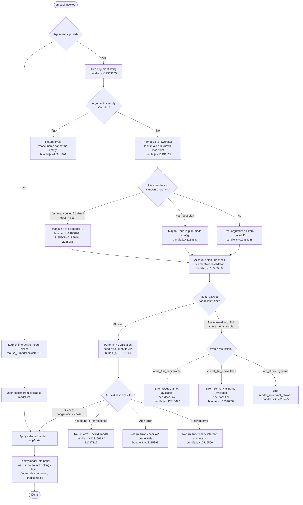

# `/model`

> Analysis basis: CC v2.1.152 bundle.js (AST extraction + Claude interpretation)
> Minimum version: v2.1.152

---

## Overview

The `/model` command allows users to set or switch the AI model used by Claude Code during a session. When invoked with a model name or shorthand alias, it validates the requested model against the user's account permissions and available model catalog, then updates the active session model accordingly. The command supports both interactive model selection (via an interactive picker) and non-interactive direct assignment via argument.

---

## Registration

| Field | Value |
|---|---|
| type | `local` |
| name | `model` |
| description | Set the AI model for Claude Code |
| argumentHint | `<model>` |
| supportsNonInteractive | `true` |
| module_id | `Kl1` |
| load_inline | `true` |
| loc_byte | `12361416` |
| loc_byte_end | `12361590` |
| loc_line | `10299` |
| arbor_handler.name | `n45` |
| arbor_handler.fqn | `claude-2.1.152::n45` |
| arbor_handler.kind | `AsyncFunction` |
| arbor_handler.resolution_path | `module_id` |
| arbor_handler.n_hits | `0` |

Analysis basis: CC v2.1.152 bundle.js:+12361416

---

## Input Branching

The command has four or more distinct behavioral branches depending on whether an argument is supplied, what value it has, and what account tier is active. A Mermaid flowchart is used.



Analysis basis: CC v2.1.152 bundle.js:+12353155, +12353171, +12353194, +12353258, +12353311, +12353378

---

## Behavioral Spec

### 1. Handler Entry — `modelCommandHandler` (`n45`)

The main handler is the async function `n45`, resolved via `module_id` → `Kl1`.

```
async function modelCommandHandler(argument, context):
    rawInput = argument.trim()                    // bundle.js:+12353155

    knownAliases = getKnownAliasList()            // lp6.includes, bundle.js:+12353171
    appState     = context.getAppState()          // bundle.js:+12353194

    if rawInput is in knownAliases OR rawInput is empty:
        // Route to interactive or alias path
        result = resolveAndValidateModel(rawInput, appState)   // fN8, bundle.js:+12353238
    else:
        result = resolveAndValidateModel(rawInput, appState)

    if argument is non-interactive and rawInput is non-empty:
        emit telemetry("tengu_model_command_inline")           // bundle.js:+12353313

    if planTierAllowsModel(appState, resolvedModel):           // $3H.includes, bundle.js:+12353258
        interactiveModelSwitch(resolvedModel, context)         // c, bundle.js:+12353311
    else:
        showModelPicker(context)                               // Yc1, bundle.js:+12353378
```

Analysis basis: CC v2.1.152 bundle.js:+12353155, +12353171, +12353194, +12353238, +12353258, +12353311, +12353378

---

### 2. Model Resolution and Alias Expansion — `modelResolver` (`ZM6` / `H1`)

Known shorthand aliases are expanded to canonical model identifiers. The list of recognized aliases and their labels:

| Alias | Description / Label |
|---|---|
| `sonnet` | Claude Sonnet (latest) |
| `haiku` | Claude Haiku (latest) |
| `opus` | Claude Opus (latest) |
| `best` | Best available model for account |
| `opusplan` | Opus in plan mode, else Sonnet |

The alias `[1m]` suffix (e.g., `sonnet[1m]`, `sonnet-4-6[1m]`) activates extended 1M-context variants when available.

```
function expandAlias(rawInput):
    normalized = rawInput.trim().toLowerCase()           // H1: bundle.js:+2185733, +2185744

    switch normalized:
        case "sonnet"   -> return resolveLatestSonnet()  // bundle.js:+2185870
        case "haiku"    -> return resolveLatestHaiku()   // bundle.js:+2185909
        case "opus"     -> return resolveLatestOpus()    // bundle.js:+2185948
        case "best"     -> return resolveBestModel()     // bundle.js:+2185985
        case "opusplan" -> return resolveOpusPlanMode()  // bundle.js:+2184387
        default         -> return normalized             // treat as literal model ID

    // Strip ANSI bold markers like "[1m]" from display
    // bundle.js:+2185855
```

Analysis basis: CC v2.1.152 bundle.js:+2185733, +2185744, +2185855, +2185870, +2185909, +2185948, +2185985, +2184387

---

### 3. Plan / Account Tier Gating — `planModelValidator` (`H0`, `Ke`, `e$H`, `fBH`)

Before live API validation, the command checks whether the resolved model is permitted for the user's current account tier.

```
function planModelValidator(resolvedModel, appState):
    tier = appState.accountTier   // one of: "max", "team", "enterprise",
                                  //         "enterprise_usage_based", "default_claude_max_5x"
                                  // bundle.js:+2958142, +2958213, +2958228, +2958323, +2958345

    if resolvedModel requires 1M context AND tier == "max":
        // "max" tier allows extended context
        pass

    if resolvedModel is "opus[1m]" variant AND tier does NOT include extended context:
        return Error("opus_1m_unavailable",
            "Opus with 1M context is not available for your account. " +
            "Learn more: https://code.claude.com/docs/en/model-config#extended-context-with-1m")
        // bundle.js:+12316622, +12316660

    if resolvedModel is "sonnet[1m]" / "sonnet-4-6[1m]" AND tier does NOT include extended context:
        return Error("sonnet_1m_unavailable",
            "Sonnet 4.6 with 1M context is not available for your account. " +
            "Learn more: https://code.claude.com/docs/en/model-config#extended-context-with-1m")
        // bundle.js:+12316839, +12316879

    if general policy restriction applies:
        emit event("model_switch", "not_allowed")   // bundle.js:+12316460, +12316475
        return Error("not_allowed")

    return OK
```

Provider type context (used by `yA` / `u3`):

| Provider Key | Meaning |
|---|---|
| `firstParty` | Direct Anthropic API |
| `anthropicAws` | AWS Bedrock via Anthropic |
| `bedrock` | AWS Bedrock |
| `foundry` | Azure AI Foundry |
| `mantle` | Mantle gateway |
| `vertex` | Google Vertex AI |
| `gateway` | Generic gateway |

Analysis basis: CC v2.1.152 bundle.js:+2958142, +2958213, +2958228, +2958323, +2958345, +12316460, +12316475, +12316622, +12316839

---

### 4. Live Model Validation via Side Query — `modelLiveValidator` (`KN8`, `lx`)

When the tier check passes, the command performs a live API probe to confirm the model is accessible.

```
async function modelLiveValidator(modelId, appState):
    if modelId is empty:
        return Error("Model name cannot be empty")   // bundle.js:+12314699

    normalizedId = modelId.trim().toLowerCase()      // bundle.js:+12314662, +12314822

    if modelId already in validationCache (zc1):     // bundle.js:+12314943
        return cachedResult

    // Build a minimal "Hi" user message with ephemeral cache control
    // bundle.js:+12315073 ("user"), +12315107 ("Hi"), +12315132 ("ephemeral")
    probe = buildMinimalMessage(role="user", content="Hi", cacheControl="ephemeral")

    emit telemetry event type "model_validation"      // bundle.js:+12315038

    // Send side_query fetch to API with max_tokens=1024
    // bundle.js:+13119354 ("side_query"), +13119170 (1024)
    response = await sideQueryFetch(modelId, probe,
                   maxTokens=1024,
                   queryType="side_query")           // lx, bundle.js:+12314988

    if response is success:
        store result in validationCache               // zc1.set, bundle.js:+12315151
        return OK

    if response error type == "not_found_error":     // bundle.js:+12315619
        // Check if error message contains "model:"
        // bundle.js:+12315701
        return Error("invalid_model")                // bundle.js:+12317122

    if response is auth failure:
        return Error("Authentication failed. Please check your API credentials.")
        // bundle.js:+12315398

    if response is network error:
        return Error("Network error. Please check your internet connection.")
        // bundle.js:+12315500

    // On validate_exception path:
    emit telemetry event "validate_exception"         // bundle.js:+12317219
```

The `sideQueryFetch` function (`lx`) uses `globalThis.fetch` (bundle.js:+13119407), measures latency via `performance.now` (bundle.js:+13120397) and `Date.now` (bundle.js:+13120777), and caps results with `Math.min` / `Math.max` / `Math.round`. It also applies jitter via `Math.random` and `setTimeout` (bundle.js:+13371604, +13371641) with a constant factor of 2 (bundle.js:+13371602).

The validation cache uses a 1-hour TTL — `"1h"` (bundle.js:+13120204) — with states `"disabled"` / `"enabled"` (bundle.js:+13120099, +13120138).

Analysis basis: CC v2.1.152 bundle.js:+12314662, +12314699, +12314733, +12314822, +12314943, +12315038, +12315073, +12315107, +12315132, +12315151, +12315398, +12315500, +12315619, +12315701, +13119170, +13119354, +13119407, +13120204

---

### 5. Interactive Model Picker — `showModelPicker` (`Yc1`, `We_`, `Ge_`)

When no argument is supplied (or after a failed constraint check in interactive mode), the command renders a model selection UI.

```
function showModelPicker(context):
    availableModels = buildModelList()    // We_ / lg, bundle.js:+12317333

    // buildModelList steps (lg):
    //   - Enumerate known models from internal catalog
    //   - Normalize names (toLowerCase, trim)
    //   - Filter by prefix "anthropic." / "claude-" presence
    //     bundle.js:+2179975, +2179596
    //   - Sort with scoring: RMq (indexOf rank), KBH (includes check)
    //   - Annotate with provider info via On6 (Object.entries)
    //   - Pad display names to width 40 chars, bundle.js:+15408364
    //   - Separate columns with "  " (two spaces), bundle.js:+15406393

    for each model in availableModels:
        annotations = []

        if model uses fast mode:
            annotations += " · Fast mode ON"          // bundle.js:+12317687
        if model draws from usage credits:
            annotations += " · Draws from usage credits"  // bundle.js:+12317738
        if model uses fast mode OFF:
            annotations += " · Fast mode OFF"         // bundle.js:+12317784

    displayPicker(availableModels, annotations)       // Ge_, bundle.js:+12317402

    // Picker shows bold model names (P6.bold), dim secondary text (P6.dim)
    // After selection, call applyModelSelection()
```

Analysis basis: CC v2.1.152 bundle.js:+12317333, +12317402, +12317687, +12317738, +12317784, +2179596, +2179975

---

### 6. Model Info Display After Selection — `modelInfoPanel` (`A45`)

After a model is selected or switched, a summary panel is shown.

```
function modelInfoPanel(selectedModel, appState):
    // Determine settings source layer:
    // "projectSettings" -> .claude/settings.json
    // "localSettings"   -> .claude/settings.local.json
    // "policySettings"  -> "Managed settings"
    // bundle.js:+12317928, +12317944, +12317967, +12317988, +12318090

    settingsSource = resolveSettingsLayer(appState)   // wGH / x8 / Ob

    display(
        bold(selectedModel.displayName),              // P6.bold, bundle.js:+12318148
        dim("Source: " + settingsSource),             // P6.dim, bundle.js:+12318122
        modelCapabilityAnnotations                    // Ai / Aiw
    )

    // Special model labels:
    // "Opus Plan" -> opusplan variant   bundle.js:+2184695
    // "sonnet-4-6"                      bundle.js:+10828390
    // "opus-4-6"                        bundle.js:+2172560
    // "opus-4-7"                        bundle.js:+2172614

    // For 1M-context variants display:
    // "sonnet[1m]"     bundle.js:+12318419
    // "sonnet-4-6[1m]" bundle.js:+12318445
```

Settings file paths resolved by `Ob` (bundle.js:+1214312):
- `.claude/settings.json` (bundle.js:+1214320, +1214330)
- `.claude/settings.local.json` (bundle.js:+1214392)

Analysis basis: CC v2.1.152 bundle.js:+12317928, +12317944, +12317967, +12317988, +12318090, +12318122, +12318148, +12318419, +12318445, +1214312, +1214320, +1214330, +1214392

---

## State & Side Effects

| Item | Detail |
|---|---|
| Telemetry: `tengu_model_command_inline` | Fired when `/model <arg>` is used in non-interactive (inline) mode (bundle.js:+12353313) |
| Telemetry: `tengu_api_success` | Fired after a successful side-query API validation call (bundle.js:+13120805) |
| Telemetry: `tengu_feature_ok` | Fired on successful model feature path (bundle.js:+964519) |
| Telemetry: `tengu_feature_bad` | Fired on failed model feature path (bundle.js:+964577) |
| Validation cache (`zc1`) | `Map`-based in-memory cache with 1-hour TTL; stores validation results keyed by model ID (bundle.js:+12314943, +12315151, +13120204) |
| appState changes | Updates active model in `appState` upon successful switch (bundle.js:+12353194) |
| Settings persistence | Model preference written to `.claude/settings.json` or `.claude/settings.local.json` depending on scope (bundle.js:+1214320, +1214392) |
| Network I/O | Performs `globalThis.fetch` side-query to Anthropic API for model validation (bundle.js:+13119407) |
| Jitter / retry delay | Uses `Math.random` + `setTimeout` with factor 2 for retry backoff (bundle.js:+13371602, +13371604, +13371641) |
| Sound | Not detected in depth-2 traversal |

---

## Version History

| Version | Change |
|---|---|
| v2.1.152 | Initial analysis |

---

## Common Mistakes

1. **Providing a model alias with wrong casing**: The handler normalizes to lowercase internally (bundle.js:+12314822, +2185744), but passing mixed-case values like `Sonnet` in scripts may cause unexpected behavior in non-interactive pipelines before normalization occurs. Use lowercase aliases consistently.

2. **Assuming 1M-context variants are always available**: The `[1m]` suffix variants (`sonnet[1m]`, `sonnet-4-6[1m]`, `opus[1m]`) are gated behind account tier checks. They fail with a specific error message and documentation link rather than silently falling back.

3. **Using a full model string that includes a typo**: The live API validation probe sends a minimal "Hi" message (bundle.js:+12315107) with `max_tokens=1024` to confirm the model exists. A `not_found_error` response whose message contains `"model:"` yields `invalid_model` — not a generic failure. Check the exact model ID against the Anthropic model catalog.

4. **Expecting the validation result to re-check every time**: Results are cached in `zc1` for approximately 1 hour (bundle.js:+13120204). Switching back to a previously validated model in the same session will skip the live API probe.

5. **Confusing `opusplan` with `opus`**: The alias `opusplan` selects "Opus in plan mode, else Sonnet" (bundle.js:+2184404), not the plain Opus model. This has distinct behavior depending on whether Claude Code is in planning phase.

6. **Not accounting for provider type**: Models available under `bedrock`, `vertex`, `foundry`, or `mantle` providers (bundle.js:+2040715, +2040765, +2040875, +2040923) may differ from first-party Anthropic API models. The `/model` command resolves provider context before validation.

---

## Appendix — Identifier Mapping

> For bundle debugging only. Identifiers change across versions.

| Identifier | Role |
|---|---|
| `n45` | Main handler for `/model` command (`modelCommandHandler`); async entry point |
| `H` | General utility / string helper; provides `.trim()` in handler context |
| `_` | App context / state accessor |
| `fN8` | Model resolution dispatcher; routes to `Nh` and app state |
| `Nh` | Inner model resolution coordinator; calls `ZM6` and `H0` |
| `ZM6` | Model alias expansion / normalization logic |
| `TY` | Sub-utility within alias expansion (called by `ZM6`) |
| `H1` | Alias-to-model-ID mapper; performs trim, toLowerCase, replace, and model lookup |
| `H0` | Account / plan tier model validator |
| `TA` | Provider-type detector sub-component |
| `Ke` | Tier check for "max" plan |
| `e$H` | Tier check for "team" / `default_claude_max_5x` |
| `fBH` | Tier check for "enterprise" / `enterprise_usage_based` |
| `PZ` | Utility: provider key resolver using `u3` and `K3` |
| `VP` | Sub-validator combining provider and tier checks |
| `u3` | Provider type classifier (`anthropicAws`, `gateway`) |
| `yA` | Low-level provider name resolver (`bedrock`, `foundry`, `mantle`, `vertex`) |
| `K3` | Provider config builder |
| `JN` | Joint validator combining `u3` and `K3` |
| `c` | Generic event emitter / telemetry dispatcher |
| `Yc1` | Model picker orchestrator; calls `We_` and `Ge_` |
| `We_` | Model list builder and validation router |
| `lg` | Available model catalog enumerator and formatter |
| `A` | Model name normalizer (toLowerCase in catalog context) |
| `f` | Model cache/store accessor (`L.get`, `L.values`) |
| `K` | Display name formatter (`L.map`, `M.padEnd`) |
| `q` | Filesystem / model list cleanup utility |
| `On6` | Model metadata enumerator (`Object.entries`) |
| `KBH` | Model allowlist inclusion checker (`ZR4.includes`) |
| `RMq` | Model rank/sort comparator using `KBH` and `A.indexOf` |
| `ER4` | Model filter: checks string inclusion and calls `L1H`, `H1` |
| `L1H` | Model string inclusion validator (`K1H.includes`) |
| `VR4` | Variant resolver: handles `[1m]` suffix and `startsWith` checks |
| `mH` | Feature flag / capability checker for model |
| `K45` | Opus 1M availability checker; toLowerCase + VP + includes |
| `_8H` | Sub-check utility for Opus 1M path (`$1H`, `TA`, `WN9`) |
| `L45` | Sonnet 1M availability checker; toLowerCase + C7H + includes |
| `C7H` | Sub-check utility for Sonnet 1M path (`$1H`, `TA`, `WN9`) |
| `q45` | Fast-mode capability checker (`K1H.includes`, toLowerCase) |
| `KN8` | Live model validation via API side-query; manages `zc1` cache |
| `lx` | Side-query HTTP fetch executor; handles retry, jitter, timing |
| `H45` | Validation result formatter / error message builder |
| `GH` | String conversion utility (`String()`) |
| `Ge_` | Interactive model picker renderer; shows selection list with annotations |
| `SH` | Picker success callback |
| `SK` | Display renderer combining `yA` and `uH` |
| `uH` | String formatting utility (base `String()`) |
| `a$H` | Picker annotation helper |
| `iD` | Model display entry builder (`SK`, `H0`, `H1`, `_i`) |
| `_i` | String display sub-formatter |
| `gXH` | Fast-mode / usage-credits annotation renderer |
| `_X` | Layout helper combining `H1` and `H0` |
| `_0` | Utility referencing `$1H` |
| `A45` | Post-selection model info panel renderer |
| `wGH` | Settings source resolver (`im`, `x8`) |
| `x8` | Settings layer display builder (`BB6`, `Tg`) |
| `Ob` | Settings file path builder (`.claude/settings.json` etc.) |
| `Ai` | Model capability annotation builder (`L1H`, `TY`, `H1`) |

---

Note: index built via Arbor fallback; some signals (telemetry, literals) may be missing — see arbor-fallback.js.