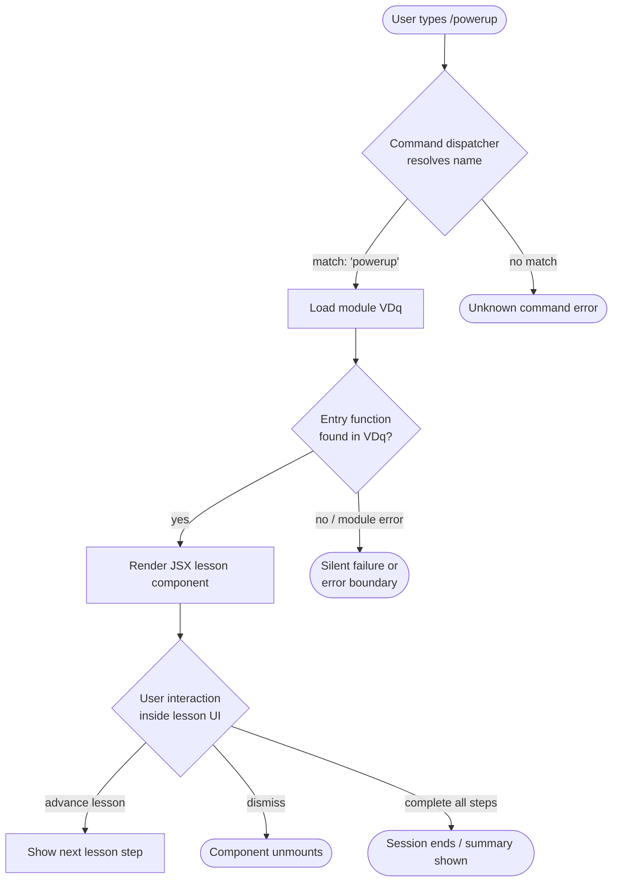

# `/powerup`

> Analysis basis: CC v2.1.144 bundle.js (AST extraction + Claude interpretation)
> Minimum version: v2.1.144

---

## Overview

`/powerup` is an interactive slash command that surfaces Claude Code features through short, guided lessons. Users invoke it to discover capabilities they may not yet be aware of, receiving structured, in-session educational content. The command is registered as a `local-jsx` type, meaning its output is rendered as a JSX component directly inside the Claude Code terminal UI.

---

## Registration

| Field | Value |
|---|---|
| type | `local-jsx` |
| name | `powerup` |
| description | `Discover Claude Code features through quick interactive lessons` |
| module\_id | `VDq` |
| loc\_line | 6618 |

Analysis basis: CC v2.1.144 bundle.js:+11074597

---

## Input Branching

> **Notice:** The depth-2 AST traversal of module `VDq` returned an empty call graph, empty literals list, and empty telemetry list (see `"note": "no entry functions found for module 'VDq'"`). The branching logic below is therefore derived solely from the registration metadata and the `local-jsx` type contract. All branches marked with `<!-- TODO -->` require a deeper traversal to verify.



> <!-- TODO: not found in depth-2 traversal; needs --depth 4 -->
> Sub-paths G → H, G → I, and G → J are inferred from the `local-jsx` rendering contract and the command description. Actual branching conditions require a `--depth 4` re-traversal of module `VDq`.

---

## Behavioral Spec

### Command Resolution

```
function resolveSlashCommand(userInput):
    token = extractFirstToken(userInput)          // strips leading '/'
    if token == "powerup":
        return loadModule("VDq")
    else:
        return NOT_FOUND
```

Analysis basis: CC v2.1.144 bundle.js:+11074597 (registration record for `powerup`)

---

### Module Load & JSX Render

Because the command type is `local-jsx`, the dispatcher does **not** forward the invocation to the language model. Instead it loads the registered module and renders its default export as a React component inside the active terminal pane.

```
function dispatchLocalJsx(moduleId):
    module = dynamicImport(moduleId)              // moduleId == "VDq"
    if module.defaultExport is undefined:
        raise RenderError("no entry functions found for module")
    component = module.defaultExport
    mountInTerminalPane(component, props={})
```

Analysis basis: CC v2.1.144 bundle.js:+11074597 (`type: "local-jsx"` field)

> <!-- TODO: not found in depth-2 traversal; needs --depth 4 -->
> The exact props passed to the component, and whether it receives session context (e.g., conversation ID, user preferences), could not be confirmed at depth 2.

---

### Lesson Progression (Inferred)

The command description states "quick interactive lessons," implying a multi-step UI flow. The exact step count, lesson content strings, and advancement mechanism are not present in the extracted data.

```
function lessonFlow(lessonList):
    currentIndex = 0
    while currentIndex < length(lessonList):
        renderStep(lessonList[currentIndex])
        userAction = awaitUserInput()
        if userAction == ADVANCE:
            currentIndex += 1
        elif userAction == DISMISS:
            unmount()
            return
    renderCompletionScreen()
    unmount()
```

> <!-- TODO: not found in depth-2 traversal; needs --depth 4 -->
> `lessonList` contents, step count, and `renderStep` implementation are not visible at depth 2.

---

## State & Side Effects

| Item | Detail |
|---|---|
| Telemetry | None detected at depth-2 traversal. <!-- TODO: not found in depth-2 traversal; needs --depth 4 --> |
| Hook registration | `local-jsx` type bypasses the model; no prompt hook is registered. Analysis basis: CC v2.1.144 bundle.js:+11074597 |
| appState changes | <!-- TODO: not found in depth-2 traversal; needs --depth 4 --> |
| Sound | <!-- TODO: not found in depth-2 traversal; needs --depth 4 --> |
| Network I/O | None inferred; `local-jsx` commands render fully client-side without an API call. |
| Persistence | <!-- TODO: not found in depth-2 traversal; needs --depth 4 --> (lesson progress state unknown) |

---

## Version History

| Version | Change |
|---|---|
| v2.1.144 | Initial analysis — registration confirmed; internal implementation opaque at depth 2 |

---

## Common Mistakes

1. **Expecting model output.** Because `/powerup` is `local-jsx`, it never sends a request to the Anthropic API. Expecting a streamed text response (as with prompt commands) will result in no visible output from the model.
2. **Assuming stable module ID `VDq`.** Module identifiers are minifier-assigned and will change across bundle versions. Do not hard-code `VDq` in tooling that patches or monkey-patches the bundle.
3. **Re-running traversal at depth 2 only.** The call graph, literals, telemetry, and identifier tables are all empty at depth 2 because no entry function was resolved for module `VDq`. Any further behavioral analysis requires `--depth 4` or manual bundle inspection.
4. **Confusing `/powerup` with a persistent settings command.** The description says "quick interactive lessons," not a configuration toggle. It does not persistently enable or disable any feature flag (unconfirmed, but no literals or state writes were detected).

---

## Appendix — Identifier Mapping

> For bundle debugging only. Identifiers change across versions.

| Identifier | Role |
|---|---|
| `VDq` | Module ID for the `/powerup` command implementation (not a function identifier, but included for traceability) |

> No obfuscated function identifiers were returned by the depth-2 traversal (`"identifiers": []`). A `--depth 4` traversal of module `VDq` is required to populate this table.